# 数据库面试题

## MySQL基础

### 什么是关系型数据库？

- 概念：所谓关系型数据库，就是一种建立在**关系模型**上的数据库。

- 关系模型：关系模型表明了数据库中所存储的数据之间的关系（一对一、一对多、多对多）。

- 关系型数据库的数据：在关系型数据库中，所有的数据都被存放在各种各样的表里，表里的每一行代表着一条**记录**，每一列代表着一个**字段**。

- 关系型数据库的操作：大部分关系型数据库都使用SQL来操作数据库中的数据，并且大部分关系型数据库都支持事务的**四大特性（ACID）**。

- 常见的关系型数据库：MySQL、Oracle、SQL Server、SQLite

### 什么是MySQL？

概念：MySQL是一种关系型数据库，主要用于持久化存储我们系统中的数据，开源免费，常用于企业级开发。

### 数据库三范式

1. 第一范式就是**属性不可分割**，每个字段都应该是不可再拆分的。

    > 比如一个字段是姓名（NAME），在国内的话通常理解都是姓名是一个不可再拆分的单位，这时候就符合第一范式；但是在国外的话还要分为FIRST NAME和LAST NAME，这时候姓名这个字段就是还可以拆分为更小的单位的字段，就不符合第一范式了。

2. 第二范式就是要求表中要有主键，表中其他其他字段都依赖于主键，因此第二范式只要记住**主键约束**就好了。【消除部分依赖】

    > 比如说有一个表是学生表，学生表中有一个值唯一的字段学号，那么学生表中的其他所有字段都可以根据这个学号字段去获取，依赖主键的意思也就是相关的意思，因为学号的值是唯一的，因此就不会造成存储的信息对不上的问题，即学生001的姓名不会存到学生002那里去。

3. 第三范式就是要求表中不能有其他表中存在的、存储相同信息的字段，通常实现是在通过外键去建立关联，因此第三范式只要记住**外键约束**就好了。【消除传递依赖】

    > 比如说有一个表是学生表，学生表中有学号，姓名等字段，那如果要把他的系编号，系主任，系主任也存到这个学生表中，那就会造成数据大量的冗余，一是这些信息在系信息表中已存在，二是系中有1000个学生的话这些信息就要存1000遍。因此第三范式的做法是在学生表中增加一个系编号的字段（外键），与系信息表做关联。


### delete和drop的区别？

- 用法区别

    - drop会删除表结构
    - delete会删除表数据，不加where和truncate差不多。
    - truncate清空数据，再插入数据的时候自增长 id 又从 1 开始，在清空表中数据的时候使用（说白了就是删除表再创建）

- 属于不同的数据库语言

    - drop和truncate属于DDL(数据定义)，立即生效不能回滚。DDL 语句更多的被数据库管理员（DBA）所使用。
    - delete属于DML(数据操作)，可以回滚。不涉及到表的定义、结构的修改，更不会涉及到其他对象。

- 执行速度

    drop > truncate > delete

    因为Delete需要生成日志

    truncate需要重置


### 关键词及执行顺序

关键字		解释					执行顺序			备注

from 		表					第一步

join			连接类型				第二步		表1 join 表2 on 连接条件															（xxx==xxx）

on 			连接条件				第三步

where 		筛选条件				第四步		对表中字段进行操作

group by 		分组列表				第五步		group by 列名

having 		分组后的筛选条件		第六步		对已筛选的组/列、聚合函数进行操作

select 		查询列表（字段）		第七步

order by		 排序列表				第八步		order by 列名

​                                            默认升序asc，降序desc

limit			 偏移 ，条目数			第九步		limit 5 ；前五条记录

​                                            limit 5，10； 6-15行记录

​                                            limit 5，-1；6-最后一行记录

总结：

**from->on->join(各种join)->where->group by->having->select->distinct->union->order by->limit**

### 聚合函数

在一个行的集合（一组行）上进行操作，对每个组给一个结果。

| [AVG([distinct\] expr)](https://www.cnblogs.com/geaozhang/p/6745147.html#sum-avg) | 求平均值     |
| ------------------------------------------------------------ | ------------ |
| [COUNT({*\|[distinct\] } expr)](https://www.cnblogs.com/geaozhang/p/6745147.html#count) | 统计行的数量 |
| [MAX([distinct\] expr)](https://www.cnblogs.com/geaozhang/p/6745147.html#max-min) | 求最大值     |
| [MIN([distinct\] expr)](https://www.cnblogs.com/geaozhang/p/6745147.html#max-min) | 求最小值     |
| [SUM([distinct\] expr)](https://www.cnblogs.com/geaozhang/p/6745147.html#sum-avg) | 求累加和     |

## 存储引擎

### 存储引擎相关的命令

```sql
mysql> show engines; # 查看所有引擎

mysql> show variables like '%storage_engine%'; # 查看默认引擎

mysql> show table status like "<table_name>"; # 查看表的存储引擎
```

### MyISAM和InnoDB的区别

- MySQL5.5之前：默认的存储引擎是MyISAM，不支持事务，不支持行级锁，其最大缺点是崩溃后无法进行安全修复，适合于需要执行大量SELECT的项目。

    > MyISAM支持全文索引。

- MySQL5.5之后：默认的存储引擎是InnoDB，支持事务，支持行级锁和表级锁（默认为行级锁），具有崩溃后的安全修复能力，适合于需要执行大量INSERT或UPDATE的项目。

    > InnoDB支持外键。
    >
    > InnoDB的安全修复能力依赖于redo log。
    >
    > InnoDB的事务实现：通过redo log（重做日志）保证事务的持久性；通过undo log（回滚日志）保证事务的原子性；通过锁机制、MVCC等手段保证事务的隔离性（默认的隔离级别为REPEATABLE-READ）；保证了持久性、原子性、隔离性之后，一致性才能得到保障。
    >
    > MVCC（Multi-Version Concurrency Control，多版本并发控制）可以看做是行级锁的一个升级，可以有效减少加锁操作，提高性能。

### 关于MyISAM和InnoDB的选择问题

虽说MyISAM在设计上是为了高效，但是在实际应用中，MyISAM的效率并非绝对高于InnoDB，并且考虑到安全并发问题，大多数业务场景下我们还是更推荐使用InnoDB。

### InnoDB中MVCC的实现

#### 实现

MVCC（多并发版本控制）是MySQL实现高性能并发的一种方式，以**无锁的方式**处理读/写请求。

> MVCC只在 READ COMMITTED 和 REPEATABLE READ 两个隔离级别下工作。不同级别在readview生成策略不同
>
> RC:每一条都会生成快照
>
> RR:第一条生成快照

`MVCC` 的实现依赖于：**隐藏字段、Read View、undo log**。

1. 在数据行中加入隐藏列，用于保存一个最近修改改行的`事务ID`和一个`回滚指针`。
2. 回滚指针指向当前记录的上一个版本，版本链通过undo log进行维护。
3. ReadView（读快照）记录了当前系统中活跃的事务ID（未提交事务）列表，这些事务对当前事务不可见，进而从版本链中获得可用的数据记录。

>   隐藏字段：
>
>   | **列名**     | **是否必须** | **描述**                                                     |
>   | ------------ | ------------ | ------------------------------------------------------------ |
>   | row_id       | 否           | 单调递增的行ID，不是必需的，占用6个字节。 这个跟MVCC关系不大 |
>   | trx_id       | 是           | 记录操作该行数据事务的事务ID                                 |
>   | roll_pointer | 是           | 回滚指针，指向当前记录行的undo log信息                       |
>
>   版本链：
>
>   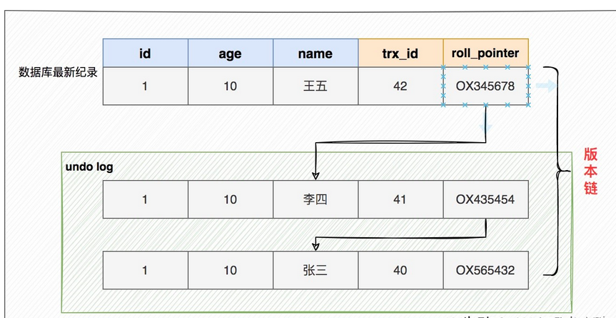
>
>   readView： ReadView 保存了**当前事务开启时所有活跃的事务列表**。
>
>   trx_ids: 当前系统中那些活跃(未提交)的读写事务ID, 它数据结构为一个List。(重点注意:这里的trx_ids中的活跃事务，不包括当前事务自己和已提交的事务，这点非常重要)
>   low_limit_id: 目前出现过的最大的事务ID+1，即下一个将被分配的事务ID。
>   up_limit_id: 活跃事务列表trx_ids中最小的事务ID，如果trx_ids为空，则up_limit_id 为 low_limit_id。
>   creator_trx_id: 表示生成该 ReadView 的事务的 事务id
>   访问某条记录的时候如何判断该记录是否可见,具体规则如下：
>
>       如果被访问版本的 事务ID = creator_trx_id，那么表示当前事务访问的是自己修改过的记录，那么该版本对当前事务可见；
>       如果被访问版本的 事务ID < up_limit_id，那么表示生成该版本的事务在当前事务生成 ReadView 前已经提交，所以该版本可以被当前事务访问。
>       如果被访问版本的 事务ID > low_limit_id 值，那么表示生成该版本的事务在当前事务生成 ReadView 后才开启，所以该版本不可以被当前事务访问。
>       如果被访问版本的 事务ID在 up_limit_id和m_low_limit_id 之间，那就需要判断一下版本的事务ID是不是在 trx_ids 列表中，如果在，说明创建 ReadView 时生成该版本的事务还是活跃的，该版本不可以被访问；
>       如果不在，说明创建 ReadView 时生成该版本的事务已经被提交，该版本可以被访问。
>   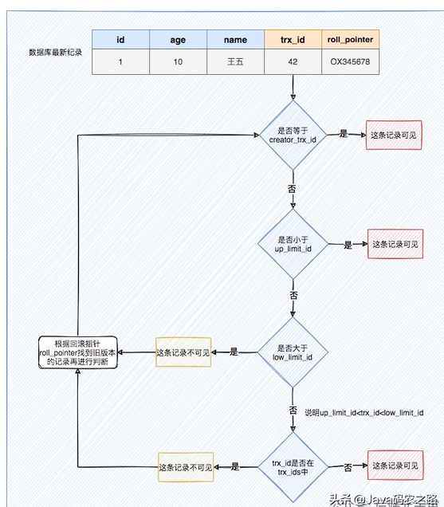
>
>   注：事务id从小到大，也是事务开始时间从小到大       
>
>   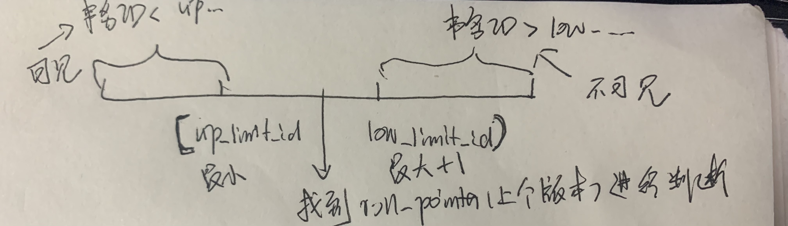
>
>   那么是什么时候创建readview，也就是当前事务id呢？这就是rr和rc的区别了                      


#### 为什么引入MVCC

最早的数据库系统，只有读读之间可以并发，读写，写读，写写都要阻塞。引入多版本之

后，只有写写之间相互阻塞，其他三种操作都可以并行，这样大幅度提高了InnoDB的并发

度。


#### MVCC好处

-   在并发读写数据库时，可以做到在读操作时不用阻塞写操作，写操作也不用阻塞读操作，提高了数据库并发读写的性能

-   同时还可以解决脏读，幻读，不可重复读等事务隔离问题，但不能解决更新丢失问题

MVCC只在读取已提交和可重复 读两种隔离级别下有作用

>   并发，提高性能
>
>   解决读写并发问题


#### MVCC能解决什么问题

数据库并发场景有三种，分别为：

读-读：不存在任何问题，也不需要并发控制

读-写：有线程安全问题，可能会造成事务隔离性问题，可能遇到脏读，幻读，不可重复读

写-写：有线程安全问题，可能会存在更新丢失问题，比如第一类更新丢失，第二类更新丢失


#### MVCC如何解决

-   MVCC解决不可重复读

    在 RC 隔离级别下，事务在每次查询开始时都会生成并设置新的 Read View，所以导致不可重复读，RR使用快照读

-   MVCC + Next-key-Lock 防止幻读

    `InnoDB`存储引擎在 **RR 级别**下通过 `MVCC`和 `Next-key Lock` 来解决幻读问题:

	1.   针对普通select，直接使用MVCC快照读
	
	2.   针对当前读，需要使用Next-key lock进行控制


#### 一些概念

-   一致性非锁定读

    读快照数据，InnoDB存储引擎会去读取行的一个**快照数据**，通过**undo log 来实现**

-   一致性锁定读

    在锁定读下，读取的是数据的最新版本，这种读也被称为 `当前读（current read）`。锁定读会对读取到的记录**加锁**


## 日志

###  redo log、undo log、bin log

- redo log：重做日志，记录事务执行后的状态，可以保证事务的**持久性**，可用于崩溃修复。

- bin log：二进制日志，记录逻辑，一方面可实现数据库的**主从复制**，另一方面可用于**基于时间点的数据库还原**，**一致性**。

    > 主从复制：建立一个和主数据库完全一样的数据库环境，称为从数据库。一方面从数据库可以作为主数据库的备份；另一方面可以做到读写分离（主数据库写，从数据库读），降低主服务器的压力。
    >
    > 事务提交的时候，会一次性将事务中的sql语句记录到bin log中。

- undo log：回滚日志，记录逻辑，便于在事务执行出错时进行回滚，可以保证事务的**原子性**。常用于MVCC。


### binlog和redolog的区别

- 层次不同：redo log是基于innodb存储引擎的，而bin log 是基于数据库服务层实现的，所以mysql数据库中任何存储引擎对数据库进行修改都会产生bin log
- 作用不同：redo log 用于碰撞恢复(crash recovery),保证**mysql宕机不会影响持久性**；而bin log 用于**时间点恢复数据**(point-in-time-recovery),保证服务器可以基于时间点恢复数据以及**主从复制**
- 内容不同：redo log是物理日志，记录的是做了什么修改，**结果**；bin log内容是二进制的，记录的是**语句原始逻辑**
- 写入方式不同：redo log采用**循环写入**的方式，bin log采用**顺序写**（追加）的方式
- 刷盘时机不同:redo log在事务进行中不断的写入，而bin log在**事务提交**才写入


### **mysql的日志文件有哪些**

MySQL日志：

错误日志、查询日志、慢查询日志、**事务日志**（redolog 重做日志）、**二进制日志**（binlog 归档日志）、中继日志（relay log） 

- redo log：(持久性、崩溃恢复)

    redo log是InnoDB**存储引擎**独有的，让mysql有了崩溃恢复能力，比如MySQL实例挂了，重启时，InnoDB会使用redo log回复数据，保证数据的**持久性**。

- undolog:（原子性、MVCC）

    `undo log`是**Mysql存储引擎**InnoDB的事物日志，是为了保证事务的**原子性**，`undo log`相当于逻辑日志, 记录的是变化过程, 比如做一个删除`delete`, `undo log`记录`insert`, 反言之, 做`insert`操作, `undo log`记录`delete`。常用于

    - 在异常发生的时候，对已经执行的操作进行回滚。
    - 多版本并发控制(`MVCC`)：事务未提交前, `undo log`保存了**未提交前的版本数据**，`undo log`中数据可作为数据旧版本快照供其他并发事务进行快照读

- binlog :（主从同步）

    bin log是数据库**server层日志**，和存储引擎无关，以二进制形式存储在磁盘中的逻辑日志，记录了所有DDL和DML操作(不包括select和show)。不管用什么存储引擎，只要发生了**表数据更新**，都会产生 `binlog` 日志。`MySQL`数据库的**数据备份、主备、主主、主从**都离不开`binlog`，需要依靠`binlog`来同步数据，保证数据**一致性**。

    `binlog`会记录所有涉及**更新数据**的逻辑操作，并且是顺序写。

- relay log：（中转、主从复制）

    relay log和bin log具有相同的格式，上面主从复制流程页提到了relay log,其主要作用起到一个中转作用。

- error log

    错误日志记录mysql服务**每次启动和停止的时间以及诊断和出错信息**，默认开启，可通过 show variables like ‘log_error’ 查找存放路径。

- 查询日志

    一般查询日志用来记录用户的所有操作，包括客户端何时连接的服务器、客户端发送的所有sql以及其他等事情。处于性能考虑，该日志功能默认也是关闭的。

- 慢查询日志

    慢查询日志用于记录在mysql执行过程超过指定时间的查询语句，处于性能考虑，一般只有在排查慢查询、调试参数时候才会开启，默认情况下时关闭的，默认时间时10s


bin log 和 redo log区别：

- 层次不同：redo log是基于innodb存储引擎的，而bin log 是基于数据库服务层实现的，所以mysql数据库中任何存储引擎对数据库进行修改都会产生bin log
- 作用不同：redo log 用于碰撞恢复(crash recovery),保证**mysql宕机不会影响持久性**；而bin log 用于**时间点恢复数据**(point-in-time-recovery),保证服务器可以基于时间点恢复数据以及**主从复制**
- 内容不同：redo log是物理日志，记录的是做了什么修改，**结果**；bin log内容是二进制的，记录的是**语句原始逻辑**
- 写入方式不同：redo log采用**循环写入**的方式，bin log采用**顺序写**（追加）的方式
- 刷盘时机不同:redo log在**事务开始时**即开始写入，而bin log在**事务提交**才写入


### MySQL日志两阶段提交

为了让两份日志之间的逻辑一致。由于`redo log`与`binlog`的写入时机不一样，可能会导致两份日志之间的**逻辑不一致**，从而导致**数据的不一致**。redo log在**事务开始时**即开始写入，而bin log在**事务提交**才写入。

将`redo log`的写入拆成了两个步骤`prepare`和`commit`，进行**两阶段提交**。


## 索引（重点）

### 什么是索引？作用？优缺点

索引：

**索引是一种用于快速查询和检索数据的数据结构。常见的索引结构有: B 树， B+树和 Hash。**索引的作用就相当于目录的作用。（查字典）


索引的作用：

大大加快数据查询速度。


优点：

- 加快数据检索速度
- 创建唯一性索引，可保证数据库表中的每一行数据的唯一性
- 对分组和排序子句进行数据检索时，同样可以显著减少查询中分组和排序的时间,因为本身有序
- **加速两个表之间的连接**，一般是在外键上创建索引，实现数据参考完整性上很有用


缺点：

- 创建索引和维护索引都需要耗费许多时间，降低SQL执行效率

- 索引需要物理文件存储，消耗空间

    

### 简述常用索引有哪些种类

**一级索引**

主键索引：特殊的唯一索引，不可以有空值

>   “聚簇索引”默认是主键，如果没有主键，就选择唯一且非空的主键，再或者隐式定义一个自增的主键。


**二级索引**

普通索引：对数据库表创建普通索引，可有多个，可为空

唯一索引：索引列唯一，允许有空值

组合索引：多个字段联合起来作为一个组合索引（查询时满足左前缀原则才能使用相应的复合索引）。

前缀索引：只适用于字符串类型的数据，根据文本前缀创建索引，比普通索引建立的数据更小。

全文索引（搜索引擎常用）：对全文进行关键字查找，允许有空值和重复值。

> MySQL5.6以前只有MyISAM引擎支持全文索引，MySQL5.6以后InnoDB也支持了全文索引。


###  **mysql几个基本索引类型有哪些？为什么对某个字段建立索引。**


主键索引（聚集索引）：数据表的主键列使用的就是主键索引。

二级索引（非聚集索引）：二级索引又称为辅助索引，是因为**二级索引的叶子节点存储的数据是主键**。也就是说，通过二级索引，可以**定位主键的位置**。**唯一索引，普通索引，前缀索引等索引属于二级索引。**

- 唯一索引：数据不能重复，可以为NULL，可有多个。（目的：大部分时候都是为了该属性列的**数据的唯一性**，而不是为了查询效率）
- 普通索引：数据可以重复，可以为NULL，可有多个。（目的：快速查询数据）
- 前缀索引：只适用于字符串，对文本前几个字符创建索引。
- 全文索引：（目的：检索大文本数据中的关键字信息）


聚集索引即**索引结构和数据**一起存放的索引。主键索引属于聚集索引。需要**排序**，更新代价大，因为有数据。

非聚集索引即**索引结构和数据分开存放的索引。二级索引属于非聚集索引。**可能会回表

​	- 覆盖索引即需要查询的字段正好是索引的字段。则非聚集索引无需回表

联合索引使用表中的**多个字段创建索引**，就是 **联合索引**，也叫 **组合索引** 或 **复合索引**。

	- 最左前缀匹配原则，从**左到右**依次到**查询条件**中去匹配，可以将区分度高的字段放在最左边，这也可以过滤更多数据。


**为什么对某个字段建立索引？**

用于快速查询和检索数据的数据结构。索引是为了快速查找数据，就跟⼀本书的⽬录⼀样。在⽬录中检索到具体章节的⻚码，然后直接跳转，就相当于根据索引快速找到数据在磁盘上的地址，然后去读取数据。 对于**中到大型**表索引都是非常有效的。

MySQL数据库索引采⽤的是B+Tree结构，在B-Tree结构上做了优化改造

- 索引能够**提高数据检索的效率**，降低数据库的IO成本，将随机io变成顺序io

- 通过创建唯一性索引，可以保证数据库表中每一行数据的**唯一性**，创建唯一索引

- 在使用**分组和排序子句**进行数据检索时，同样可以显著减少查询中分组和排序的时间,因为本身有序

- **加速两个表之间的连接**，一般是在外键上创建索引，实现数据参考完整性上很有用
- 通过使用索引，可以再查询单饿过程中使用优化隐藏器，提高系统的性能


### 如何选择在哪些列上建索引？

-   一张表一般都要去建主键，所以主键索引几乎是每张表必备的，这个就不多说了。
-   区别度高的列，也就是重复度低的列。比如女子学校学生表中的性别列，所有数据的值都是女，这样的列就不适合建索引。比如学生表中的身份证号列，选择性就很高，就适合建索引。
-   经常用于查询的列（出现在**where**条件中的列）。不过如果不符合上一条的条件，即便是出现在where条件中也不适合建索引，甚至就不应该出现在where条件中。
-   多表关联查询时作为关联条件的列。比如学生表中有班级ID的列用于和班级表关联查询时作为关联条件，这个列就适合建索引。
-   值会频繁变化的列不适合建索引。因为在数据发生变化时是需要针对索引做一些处理的，所以如果不是有非常必要的原因，不要值会频繁变化的列上建索引，会影响数据更新的性能。反过来也就是说索引要建在值比较固定不变的列上。
-   一张表上不要建太多的索引。和上一条的原因类似，如果一张表上的索引太多，会严重影响数据增删改的性能。也会耗费很大的磁盘空间。
-   不出现在where语句中的字段不应该被创建索引
-   **不管有多少索引，一次查询至多采用一个索引**
-   对于字符串类型的字段，使用前缀索引代替普通索引（节省磁盘空间，提高效率）


### **聚簇索引和非聚簇索引是什么？唯一索引是聚簇索引吗，主键索引是聚簇索引吗**

**聚簇索引和非聚簇索引**：底层都是b+树

- 聚集索引即**索引结构和数据**一起存放的索引。主键索引属于聚集索引。

    因为 B+树是多路平衡树，如果索引的数据**不是有序的，那么就需要在插入时排序**；更新代价大，因为有数据。

    >   优点：查询速度快
    >
    >   缺点：依赖于有序的数据（否则要在插入时排序），更新代价大（所以对于主键索引，主键一般不可修改）。

-   非聚集索引即**索引结构和数据分开存放的索引。二级索引属于非聚集索引。**更新代价小；可能会回表二次查询。

    辅助索引也属于非聚簇索引。
    
    在MyISAM引擎中，表的.myi文件包含了表的索引，叶子结点中的指针指向.myd文件的数据。
    
    >   优点：更新代价小，因为无数据
    >
    >   缺点：查询速度慢（可能要回表），需要排序

​		覆盖索引即需要查询的字段正好是索引的字段，则非聚集索引无需回表。

​		回表查询：先定位主键值，再定位行记录。

>   细节：
>
>   -   聚集索引即**索引结构和数据**一起存放的索引,非聚集索引即索引结构和数据分开存放的索引；聚簇索引的叶子节点就是数据节点，而非聚簇索引的叶子节点仍然是索引节点，只不过有指向对应数据块的指针。
>
>   -   聚簇索引的顺序，就是数据在硬盘上的物理顺序。一般情况下主键就是默认的聚簇索引。一张表只允许存在一个聚簇索引，因为**真实数据的物理顺序**只能有一种。（为它新创建聚簇索引时，就需要对已有数据重新进行排序，所以对表进行修改速度较慢是聚簇索引的缺点，对于经常更新的列不宜建立聚簇索引。）
>   -   在一些情况下是，簇族索引的选择顺序是主键，唯一索引，隐藏列。默认是主键，如果不设置主键就是表里的一个唯一索引，如果唯一索引也没有设置，是mysql在每行后加的三列之一的一个自增列，用来做簇族，就是聚簇索引。


**聚簇索引和唯一索引**

严格来说，聚簇索引不一定是唯一索引，聚簇索引的索引值并不要求是唯一的，唯一聚簇索

引才是！在一个有聚簇索引的列上是可以插入两个或多个相同值的，这些相同值在硬盘上的

物理排序与聚簇索引的排序相同，仅此而已。


### 说一下覆盖索引

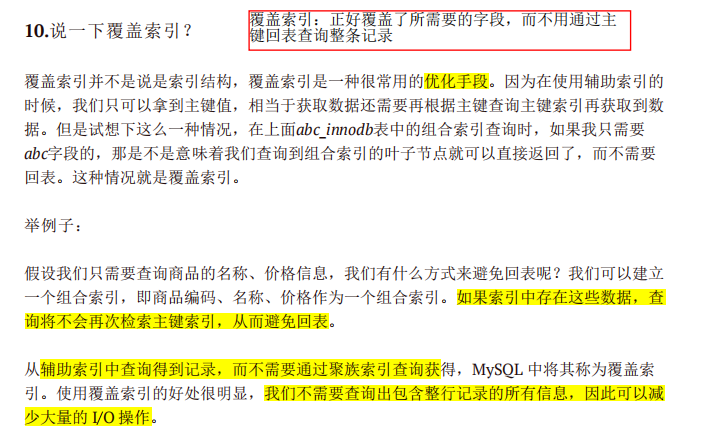

```sql
SELECT * FROM user_table WHERE age < 18; # 需要回表
SELECT age FROM user_table WHERE age < 18; # 覆盖索引
```


### **mysql** 数据库中索引的工作机制是什么

数据库索引，是数据库管理系统中一个排序的数据结构，以协助快速查询、更新数据

库表中数据。索引的实现通常使用 B 树及其变种 B+树


### **索引什么？为什么用索引?索引使用什么数据结构?b+树是什么？b+树叶子节点链表是双向链表还是单向？**

- 索引是一种用于快速查询和检索数据的数据结构。

    索引是为了快速查找数据，就跟⼀本书的⽬录⼀样。在⽬录中检索到具体章节的⻚码，然后直接跳转，就相当于根据索引快速找到数据在磁盘上的地址，然后去读取数据。 

    MySQL数据库索引采⽤的是B+Tree结构，在B-Tree结构上做了优化改造

- 原因见1.1.2

- InnoDB使用的数据结构是B+树。

- B+树是多路平衡查找树。

    B+树常用于数据库和操作系统文件系统的用于查找的数据结构

    B+树是B树的一种变形形式，B+树上的叶子结点存储关键字以及相应记录的地址，叶子结点以上各层作为索引使用。一棵m阶的B+树特点： 

    1. ⾮叶⼦节点不存储data数据，只存储索引值，这样便于存储更多的索引值 

    2. 叶⼦节点包含了所有的索引值和data数据 

    3. 叶⼦节点⽤指针连接，提⾼区间的访问性能  

- InnoDB中的b+树是双向链表。B+树中，**有一个指针指向关键字最小的叶子结点，所有叶子结点链接成一个双向链表**，因为要做范围查询嘛


### **InnoDB**存储引擎有哪些常见的索引？

B+树索引、全文索引和哈希索引。

#### Hash表

（key,value）,可以快速检索数据

hash映射：使用hash算法，可以快速通过key得到value所在的索引。

hash冲突：通常可以通过链地址法或红黑树来解决（如，Java中的HashMap）。

优点：

性能比b-tree高，快速精确值比较

**存在的问题：**

- 需要解决哈希冲突：链地址法、红黑树
- Hash索引**不支持范围和顺序查找**，因为**Hash是无序的**
- 组合hash索引无法使用部分索引，因为无序


#### B树

B树，多路平衡查找树

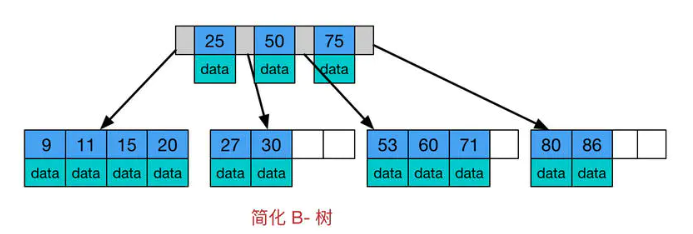

特点：

-   所有键值分布在整颗树中（索引值和具体data都在每个节点里）；

-   任何一个关键字出现且只出现在一个结点中；

-   搜索有可能在非叶子结点结束（最好情况O(1)就能找到数据）；

-   在关键字全集内做一次查找,性能逼近二分查找；


**存在的问题：**

- B 树的检索的过程相当于对范围内的每个节点的关键字做二分查找，会存在查找不到的情况
- 存在回旋查找的问题，比如像查大于5的所有数，需要先查到5，再遍历其他大于5的数


#### B+树

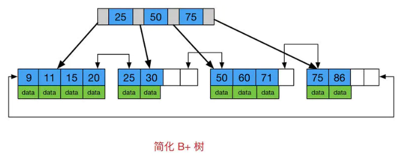

因为内节点并不存储 data，所以一般B+树的叶节点和内节点大小不同


### 说一下**B+**树与**B**树的区别？

1.   B+**树内节点不存储数据**，所有 data 存储在叶节点导致查询时间复杂度固定为 log n。而B-树查询时间复杂度不固定，与 key 在树中的位置有关，最好为O(1)。 

2.   B+树叶节点两两相连可大大增加区间访问性，可使用在范围查询等，而**B-树每个节点 key 和 data 在一起**，则无法区间查找。

3.   B+树更适合外部存储。由于内节点无 data 域，每个节点能索引的范围更大更精确

     >   由于B树的节点都存了key和data，而B+树只有叶子节点存data，非叶子节点都只是索引值，没有实际的数据，这就时B+树在一次IO里面，能读出的索引值更多。从而减少查询时候需要的IO次数！


### 为什么**MySQL**数据库使用**B+**树不使用**B**树？

当存储同数量级的数据的时候，B+树的高度比B树的高度小，这样的话进程IO操作的次数就少，效果就高。因为B+树的所有非叶子节点只存索引，数据存在叶子节点，一般3层的树高度，即可存千万级别的数据，而B数不行

>   1.高度
>
>   2.范围查找
>
>   3.B树还有回旋查找的问题，范围


### **Hash** 索引和 **B+** 树索引区别是什么？你在设计索引是怎么抉择的？ 

-   B+ 树可以进行范围查询，Hash 索引不能。

-   B+ 树支持联合索引的最左侧原则，Hash 索引不支持。

-   B+ 树支持 order by 排序，Hash 索引不支持。

-   Hash 索引在等值查询上比 B+ 树效率更高。

-   B+ 树使用 like 进行模糊查询的时候，like 后面（比如%开头）的话可以起到优化的作用，Hash 索引根本无法进行模糊查询

>   B+树：排序、范围（查找、最左原则、模糊查找）
>
>   Hash：精确等值查找


### 建立了索引但是索引无效是为什么？

- **隐式转换造成的索引失效**。

```sql
(varchar-int) 。左边varchar转为浮点数`10000`，但不唯一，因为`10000a`,`010000`,`10000`都会转为浮点数`10000`，所以索引失效了。
```

- 没有查询条件，或者查询条件没有建立索引

- 在查询条件上没有使用引导列，尽量使用覆盖索引减少使用select *

- 对索引列进行运算导致索引失效,我所指的对索引列进行运算包括(+，-，*，/，! 等)

- 模糊查询，like "%_" 百分号在前。可以用覆盖索引，也就是引导列

- 单独引用复合索引里非第一位置的索引列

- not in ,not exist，使用 is null 或者 is not null 也不能使用索引

- 少用or，用它来连接索引会失效

- 存储引擎不能使用索引**范围条件**右边的列、比如

    ```sql
    select * from myTest  where a=3 and b>7 and c=3; ---- b范围值，断点，阻塞了c的索引
    ```

- 索引列不能是表达式的一部分，也不能是函数的参数，否则无法使用索引


最左优先，以最左边的为起点任何连续的索引都能匹配上，如不连续，则匹配不上； 索引失效在以下情况： 

- 不满⾜最左【前缀】匹配规则 
- 在索引列上做任何操作如计算、函数、（⼿动或⾃动）类型转换等操作，会导致索引失效⽽进⾏全表扫描 
- 使⽤不等于（!= 、<>） 
- like 中以通配符开头(’%abc’) 
- 字符串不加单引号索引失效 
- or 连接索引失效


### 什么是最左匹配原则

B+树支持最左匹配原则

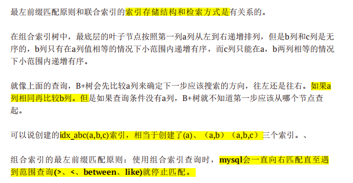


### 最左匹配设计

最左匹配原则：Mysql从左到右的使用索引中的字段，一个查询可以只使用索引中的一部份，但只能是最左侧部分。例如索引是key index （***a,b,c***）。 

- 能使用哪个索引？

    ```sql
    index1(A,B)  
    
    index2(A,C)
    
    select * from table where A = xxx and B > xxx and C = xxx;
    ```

    第一个，因为第二个会被阻断掉，最左匹配原则

- 建立索引，写sql语句，时间精确到年月日

    查找一种商品的所有信息 	

    ```sql
    select * from table where product_name = "xxxxx"';
    ```

    查找某个时间所有商品  

    ```sql
    select product_name from table where date = "xxxx";
    ```

    查找这个商品最近三十天的信息 , 只有一个范围查询，且后面没有字段，联合索引不会失效。

    （存储引擎不能使用索引**范围条件**右边的列）

    ```sql
    select * from table where product_name = "xxxx" and date > 30;
    ```

    怎么建立索引？能建立一个联合索引不？

    创建商品名和时间的联合索引、时间索引 

    创建创建时间和商品名的联合索引、商品名索引

    >   注意是时间和商品名的量和索引，不是商品名和时间的

    答：

    不能只建一个联合索引，还需要一个普通索引。

    索引不是越大越好（选数据空间占用小的好维护，看商品名和时间谁占的空间更小，如果时间精确到年月日可能占用空间更大，则选②）

-   ```sql
    # 假设复合索引为 (a,b,c)
    SELECT * FROM t WHERE a=1, b=2, c=3; # 满足左前缀原则
    SELECT * FROM t WHERE b=2, a=1, c=3; # 索引列会重排序，因此仍然满足左前缀原则
    SELECT * FROM t WHERE a=1, b=2; # 满足左前缀原则
    SELECT * FROM t WHERE a=1, c=3; # 会走索引，但只会走a,不会走c字段
    select * from table where a = '1' and b > ‘2’  and c='3' #只会走a b 不走c 
    SELECT * FROM t WHERE b=2, c=3; # 不满足左前缀原则！！！！！索引失效
    ```
    
    因为有优化器，所以会对索引列重排序，或者说是查询字段顺序的优化

### BTree在MyISAM和InnoDB中的不同实现

> InnoDB中索引和数据存放在同一个文件里`.idb`
>
> MyISAM中索引和数据分开存储`.MYI`，`.MYD`

- MyISAM

    - 使用“非聚簇索引”，B+Tree的叶子结点的data域存放着数据记录的地址。

        > "非聚簇索引"：将数据与索引分开存储，索引结构的叶子结点指向了数据对应的位置。

    - 在进行索引检索时，先在B+Tree中搜索索引，如果索引存在，则取出data域中的地址，然后读取地址所指向的数据记录。

- InnoDB：

    - 使用“聚簇索引”，表数据文件本身被B+Tree组织成一个索引结构，叶子结点的data域存放了完整的数据记录。

        > “聚簇索引”：将数据存储与索引放到了一块，索引结构的叶子结点保存了行数据。

    - 在“聚簇索引”之上创建的索引被称为“辅助索引”，“辅助索引”的叶子结点存储的是主键值，通过辅助索引来访问数据总是需要二次查找。

        - 在根据主键索引查找时，找到索引所在的叶子结点即可取出数据。
        - 在根据非主键索引查找时，需要先索引出主键的值，再根据主键索引查找数据。

        > 注意点1：不建议使用过长的字段作为主键，也不建议使用非单调的字段作为主键，否则会造成主索引的频繁分裂。 
        >
        > 注意点2：如果在“辅助索引”的叶子结点中存储数据地址，将不利于增删改后的维护。


### MySQL 如何为表字段添加索引

alter

1. 添加 PRIMARY KEY（主键索引）

    ```sql
    ALTER TABLE `table_name` ADD PRIMARY KEY ( `column` )
    ```

2. 添加 UNIQUE（唯一索引）

    ```sql
    ALTER TABLE `table_name` ADD UNIQUE ( `column` )
    ```

3. 添加 INDEX（普通索引）

    ```sql
    ALTER TABLE `table_name` ADD INDEX index_name ( `column` )
    ```

4. 添加 FULLTEXT（全文索引）

    ```sql
    ALTER TABLE `table_name` ADD FULLTEXT ( `column` )
    ```

5. 添加多列索引

    ```sql
    ALTER TABLE `table_name` ADD INDEX index_name ( `column1`, `column2`, `column3` )
    ```


## 锁

锁是数据库系统区别文件系统的一个关键特性，锁机制用于管理对共享资源的并发访

问

### 锁级别

- 表级锁：表级锁对当前操作的整张表加锁，速度较快，不会产生死锁，但是容易出现锁冲突问题，并发度较低。

    >  因为每操作一条记录都要锁定整个表，所以不会产生死锁。

- 行级锁：行级锁对当前操作的行进行加锁，速度较慢，可能产生死锁，但是能大大减少锁冲突问题，并发度较高。

    > ```sql
    > # 并发场景，死锁产生
    > #肯定先找到主键、再找到索引
    > update user_table set 辅助字段='y' where 辅助字段='x'; # 使用辅助索引，会用到主键索引
    > update user_table set 辅助字段='z' where 主键字段=1; # 执行了主键索引，还需等待辅助索引
    > # 修改语句，避免死锁=》嵌套查询，避免死锁？
    > update user_table set 辅助字段='y' where 主键字段=(select 主键 from user_table where 辅助字段='x')
    > ```

### InnoDB的三种锁算法

- record lock：单行记录上的锁。

    > 当查询的索引含有唯一属性时，next-key lock将自动降级为record key。

- gap lock：间隙锁，锁定一个范围，不包括记录本身。

    > 用于防止多个事务将记录插入到同一范围内，防止幻影读。

- next-key lock：邻键锁，锁定一个范围，包括记录本身。

    > **InnoDB对于行查询使用next-key lock，主要目的是解决当前读中的幻影读问题。**

### **lock**和**latch**的区别

lock锁：

锁的对象是事务，用于锁定数据库中的对象，如表、页、行等，并且lock锁一般在commit或rollback后释放，有死锁机制。

latch锁：

一般称为轻量级锁，要求锁定的时间必须非常短，在InnoDB中又可以分mutex(互斥量)和rwlock(读写锁)。目的是用来保证并发线程操作临界资源的正确性，并且通常没有死锁检测的机制


### **锁的类型有哪些**

基于锁的属性分类：共享锁（读锁）、排他锁。

>   -   共享锁又称读锁，简称S锁；当一个事务为数据加上读锁之后，其他事务只能对该数据加读锁，而不能对数据加写锁。【不支持读写】
>
>   -   排他锁又称写锁，简称X锁；当一个事务为数据加上写锁时，其他请求将不能再为数据加任何锁【不支持写读、写写】

基于锁的粒度分类：行级锁(INNODB)、表级锁(INNODB、MYISAM)、页级锁(BDB引擎 )、记录锁、间隙锁、临键锁。

>-   表锁：【整个表】
>
>    是指上锁的时候锁住的是整个表，当下一个事务访问该表的时候，必须等前一个事务释放了锁才能 进行对表进行访问； 
>
>    特点： 粒度大，加锁简单，容易冲突；
>
>-   行锁：【一条或多条】
>
>    指上锁的时候锁住的是表的某一行或多行记录，其他事务访问同一张表时，只有被锁住的记录不 能访问，其他的记录可正常访问； 
>
>    特点：粒度小，加锁比表锁麻烦，不容易冲突，相比表锁支持的并发要高；
>
>-   记录锁(Record Lock)：【一条】
>
>    记录锁也属于行锁中的一种，只不过记录锁的范围只是表中的某一条记录，记录锁是说事务在加锁后锁住的只是表的某一条记录。 精准条件命中，并且命中的条件字段是唯一索引加了记录锁之后数据可以避免数据在查询的时候被修改的重复读题，也避免了在修改的事务未提交前 被其他事务读取的脏读问题
>
>    特点：速度慢
>
>-   间隙锁(Gap Lock)：【(]、RR】
>
>    属于行锁中的一种，间隙锁是在事务加锁后其锁住的是表记录的某一个区间，当表的相邻ID之间出现空隙则会形成一个区间，遵循左开右闭原则。 
>
>    范围查询并且查询未命中记录，查询条件必须命中索引、间隙锁只会出现在REPEATABLE_READ（重复读)的事务级别中。 
>
>    触发条件：防止幻读问题，事务并发的时候，如果没有间隙锁，就会发生如下图的问题，在同一个事务里，A事务的两次查询出的结果会不一样。 
>
>    比如表里面的数据ID 为 1,4,5,7,10 ,那么会形成以下几个间隙区间，-n-1区间，1-4区间，7-10 区间，10-n区间 （-n代表负无穷大，n代表正无穷大）
>
>-   临建锁(Next-Key Lock)【记录锁+间隙锁】
>
>    也属于行锁的一种，并且它是INNODB的行锁默认算法，总结来说它就是记录锁和间隙锁的组合，临键锁 会把查询出来的记录锁住，同时也会把该范围查询内的所有间隙空间也会锁住，再之它会把相邻的下一 个区间也会锁住 
>
>    触发条件：范围查询并命中，查询命中了索引。 
>
>    结合记录锁和间隙锁的特性，临键锁避免了在范围查询时出现脏读、重复读、幻读问题。加了临键锁之 后，在范围区间内数据不允许被修改和插 入。

基于锁的状态分类：意向共享锁、意向排它锁

>   有行锁不能加表锁，所以在加表锁前需要遍历看有没有行锁，速度会慢，设置一个状态后，就免除了遍历
>
>   -   意向共享锁
>
>       当一个事务试图对整个表进行加共享锁之前，首先需要获得这个表的意向共享锁。
>
>   -   意向排他锁
>
>       当一个事务试图对整个表进行加排它锁之前，首先需要获得这个表的意向排它锁。


### 数据库中的死锁

死锁是指两个或两个以上的事务在执行过程中，因争夺资源而造成的一种互相等待的 现象。

解决死锁的办法：一种是超时回滚，一种是采用死锁检测机制（wait-for graph等待图）

例子：

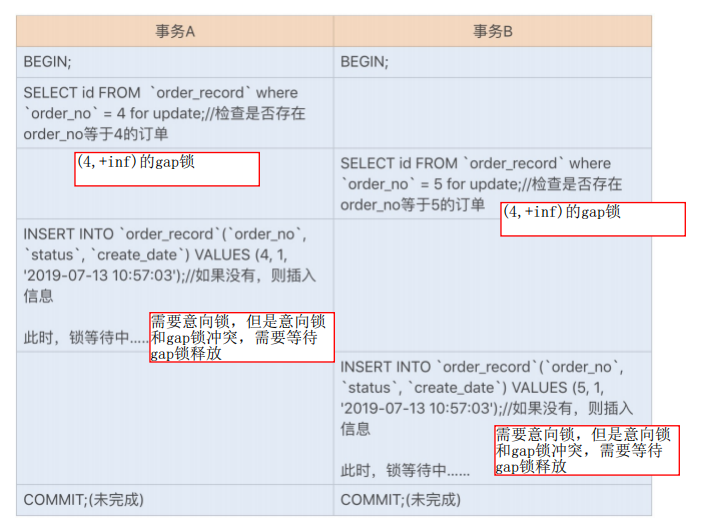

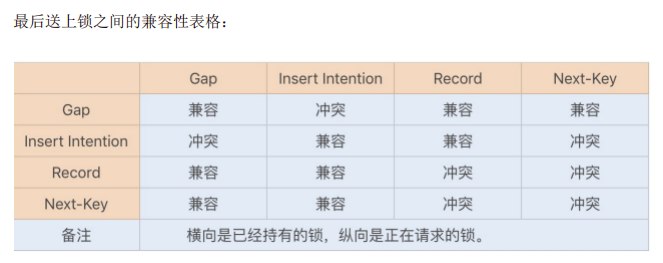


## 事务

### 什么是事务？

- 概念：事务指的是满足 **ACID 特性** 的一组操作，可以通过 Commit 提交一个事务，也可以使用 Rollback 进行回滚。

### 什么是数据库事务？

- 概念：数据库事务就是将多个数据库操作（即多条SQL语句）组合成逻辑上的一个事务操作。

- 实现原理：InnoDB通过redo log（重做日志）保证事务的持久性；通过undo log（回滚日志）保证事务的原子性；通过锁机制、MVCC等手段保证事务的隔离性（默认的隔离级别为**REPEATABLE-READ**）；保证了持久性、原子性、隔离性之后，一致性才能得到保障。

### 什么是ACID特性？

关系型数据库事务都有ACID的特性

- 原子性：事务是最小的执行单位，不允许分割。事务的原子性确保动作要么全部完成，要么完全不起作用；
- 一致性：执行事务前后，数据保持一致，比如A给B转账，A少B多；【最终的目标】
- 持久性：事务成功则必持久化到数据库，失败就回滚；
- 隔离性：事务之间各不影响


### 如何保证ACID

- 通过redo log+内存保证事务的持久性
- 通过undo log保证事务的原子性
- 通过锁机制、mvcc保证事务的隔离性
- 从而保证一致性


### 并发事务可能带来哪些问题？

并发环境下，事务的隔离性很难保证，因此会出现很多并发一致性问题。

- 丢失修改：指一个事务的更新结果被另外一个事务的更新结果所覆盖。

    > 比如，A=20，事务1做A-1，事务2也做A-1，本来要做两次A-1，结果却只做了一次A-1，得到A=20。

- 读脏数据：指一个事务读到其他事务未提交的数据。

- 不可重复读：指一个事务在重复读取一个数据的过程中，另一个事务对该数据进行了修改，导致该事务多次读取的数据**内容不一致**。

- 幻影读：指一个事务在重复读取多个数据的过程中，另一个事务插入/删除了一部分数据，导致该事务多次读取的数据**数量不一致**。

### 事务隔离级别

- READ-UNCOMMITTED(读取未提交)

    最低的隔离级别，可能会导致脏读、幻读、不可重复读

- REAS-COMMITTED(读取已提交)

    可以阻止脏读，幻读、不可重复读还会发生

- REPEATABLE-READ(可重复读)

    多次读取结果一致，可以阻止脏读、不可重复读、但还会导致幻读

- SERIALIZABLE(可串性化)

    最高隔离级别，逐个执行，可以阻止脏读、不可重复读、幻读

    该隔离级别需要加锁实现（如邻键锁），因为要使用加锁机制保证同一时间只有一个事务执行。

    |     隔离级别     | 脏读 | 不可重复读 | 幻读 |
    | :--------------: | :--: | :--------: | :--: |
    | READ-UNCOMMITTED |  √   |     √      |  √   |
    |  READ-COMMITTED  |  ×   |     √      |  √   |
    | REPEATABLE-READ  |  ×   |     ×      |  √   |
    |   SERIALIZABLE   |  ×   |     ×      |  ×   |


- 脏读：一个事务访问了另一个事务的未提交的数据

- 丢失修改：一个事务修改了另一个事务未提交数据，导致之前的事务修改操作失败

- 不可重复读：一个事务A在未结束的情况下多次读同一数据，由于其他事务可能会修改数据，导致了A可能读取的数据会不一样

- 幻读：一个事务A读取数据时，另一个事务插入了数据

    > 不可重复度和幻读的区别：不可重复读是发现已有数据的值被修改，幻读是发现记录增多或减少

    

### MySQL默认的隔离级别

MySQL InnoDB 存储引擎的默认支持的隔离级别是可重读（REPEATABLE-READ）。

```sql
# 通过命令查询默认隔离级别
SELECT @@tx_isolation; # MySQL8.0以前
SELECT @@transaction_isolation; # MySQL8.0以后
```

> InnoDB存储引擎在**分布式事务**的情况下，一般会用到可串行化（SERIALIZABLE）隔离级别。
>
> 分布式事务：指的是允许多个独立的事务资源（如关系型数据库系统）参与到一个全局的事务中。


### 事务的原子性怎么实现的？

通过undo log保证事务的原子性。在异常发生的时候，对已经执行的操作，但没有提交的事务进行回滚。

`undo log`相当于逻辑日志, 记录的是变化过程, 比如做一个删除`delete`, `undo log`记录`insert`, 反言之, 做`insert`操作, `undo log`记录`delete`, 这样在出问题时, 就可以直接运行`undo log`回滚到起始位置。


`undo log`产生时间：`undo log`在事务开始前产生;

`undo log`销毁时间：事务在提交后, 并不会立刻删除`undolog`, 因为这个过程中可能需要用到undolog, 比如MVCC多版本控制。InnoDB会将该事务对应的`undolog`入到`删除列表`中, 后面会通过**后台线程`purge thread`**进行回收处理。

`undo log`存储: `undo log`采用**段方式管理**和记录, 在InnoDB数据文件中包含一种`rollback segment`回滚段, 内部包含1024个`undolog segment`。


### 可重复读是什么？

事务的隔离级别，REPEATABLE-READ(可重复读)

一个事务执行过程中看到的数据，总是跟这个事务在启动时看到的数据是一致的。可以阻止脏读、不可重复读、但还会导致幻读。


- 快照读的情况下：

    rr不能更新事务内的 up_limit_id ,⽽ rc 每次会把 up_limit_id 更新为快照读之前最新已提交事务的 transaction id,则 rc 不能可重复读 

- 当前读的情况下：

    rr 是利⽤ record lock+gap lock来实现的,⽽ **rc 没有 gap,**所以 rc 不能重复读


在读提交（RC），可重复读（RR）两个不同的事务的隔离级别下，快照读有什么不同呢？

- 事务总能够读取到，⾃⼰写⼊（update /insert /delete）的⾏记录 

- RC 下，快照读总是能读到**最新的⾏数据快照**，当然，必须是已提交事务写⼊的。 

- RR 下，某个事务**⾸次 read 记录的时间为 T**，未来不会读取到 T 时间之后已提交事务写⼊的记录，以保证连续相同的 read 读到相同的结果集 

    

## 架构和语句执行

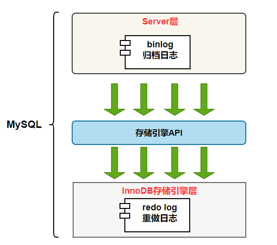

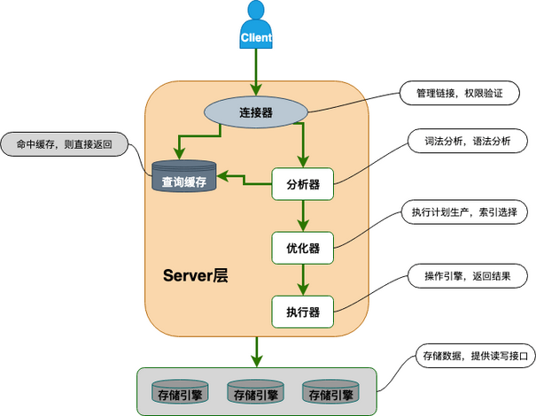

### Server层和存储引擎层

- Server 层：主要包括连接器、查询缓存、分析器、优化器、执行器等，所有跨存储引擎的功能都在这一层实现，比如存储过程、触发器、视图，函数等，还有一个通用的日志模块 binglog 日志模块。
- 存储引擎：主要负责数据的存储和读取，采用可以替换的插件式架构，支持 InnoDB、MyISAM、Memory 等多个存储引擎，其中 InnoDB 引擎有自有的日志模块 redolog 模块。

### Server层组件

- 连接器

    **身份认证和权限**相关工作（登录MySQL）。进行用户的身份认证，包括校验账户密码。权限等操作。如果用户账户密码已通过，后续只要这个连接不断开，即使管理员修改了该用户的权限，该用户也是不受影响的。

- 查询缓存

    执行查询语句，会先查缓存（8.0版本之后移除了，因为不实用）。缓存所执行的 SELECT 语句以及该语句的结果集。

- 分析器

    词法分析+语法分析。说白了就是看你要干嘛，再检查语法是否正确。

- 优化器

    按照MySQL认为最优的方案执行。比如多个索引的时候该如何选择索引，多表查询的时候如何选择关联顺序等。

- 执行器

    执行前会**校验该用户**有没有权限，如果没有权限，就会返回错误信息，如果有权限，就会去调用引擎的接口，返回接口执行的结果。

### 查询缓存的使用

- 简介：在开启查询缓存之后，每次执行查询语句，都会先查询缓存，如果缓存命中，就直接返回缓存中的结果。

- 优点：一定程度上能提升查询的性能。

- 缺点：缓存操作需要额外的开销，且缓存命中的要求较为苛刻——要求查询内容和查询条件都完全一致。因为不太实用，所以MySQL8.0以后移除了缓存功能。

  

###   一条SQL语句在MySQL中是如何执行的？

####  查询（select）

```sql
select * from tb_student  A where A.age='18' and A.name=' 张三 ';
```

- 检查语句是否有权限，没有则返回错误信息，有则查缓存，如果有缓存，则直接返回缓存结果，没有执行下一步
- 通过分析器词法分析，提取sql的**关键元素**，比如**提取查询对象和查询条件**；再判断有无语法错误
- 优化器进行确定执行方案，比如先查18还是张三
- 用户权限校验，没有权限返回错误信息，有则调用引擎接口，返回引擎的执行查询的结果


#### 更新（update delete insert）

```sql
update tb_student A set A.age='19' where A.name=' 张三 ';
```

- 先查询张三这条数据，有缓存则用
- 查到查询的语句，将age改为19
- 调用引擎API接口，写入这一行数据。同时记录redo log（prepare），并告诉执行器，执行完成，随时可提交
- 执行器收到通知后记录binlog，然后调用引擎接口，提交事务，提交binlog，提交redo log（commit）
- 更新完成


#### 总结

- 查询语句的执行流程如下：

    语句权限校验（如果命中缓存）--->查询缓存--->分析器--->优化器--->用户权限校验--->执行器--->引擎

- **更新语句的执行流程如下：**【事务，两阶段提交】

    分析器---->权限校验---->执行器--->引擎-->提交redo log(prepare 状态)--->提交事务--->提交binlog--->提交redo log(commit状态）


## 其他

### 选择合适的类型存储时间

1. 不使用字符串

    >  字符串存储时间的效率更低，且更占用空间。

2. 首选Timestamp，其次选Datetime

    > Timestamp包含时区信息；
    >
    > Datetime不包含时区信息，且消耗的空间更大；但是Datetime能表示更长远的时间范围，并且更直观。

### 大表优化

当InnoDB单表记录数过大时，CRUD性能会明显下降。常见的优化措施如下：

1. 限制数据的范围：禁止无条件查询。

2. 读写分离：主库负责写，从库负责读。

    > 从数据库是主数据库的备份。

3. 垂直分区：把列比较多的表根据相关性拆分为多张表。

    > 优点：可以使列数据变小，提高查询速度，简化表结构，易于维护。
    >
    > 缺点：主键会出现冗余，需要管理冗余列，容易引发join操作，并且会让事务变得更复杂。

4. 水平分区：将数据进行分片，便于分库存储。

    > 优点：可能支持大数据量的存储。
    >
    > 缺点：分片事务难以解决。
    >
    > 补充：数据库分片的常见方案
    >
    > 1. 客户端代理
    > 2. 中间件代理

### 池化设计思想和数据库连接池

在连接池中，创建多个连接，便于后续再次使用。

优点：这样能减少新连接的创建，减少用户等待建立数据库连接的时间。

### 分库分表之后，如何处理主键？

使用全局唯一的id作为主键，比如

1. 使用数据库自增id：给两个数据库分别设置不同的步长以生成不重复的id。
2. 利用redis生成id：性能较好，方便灵活，不依赖于数据库。

### MySQL高性能优化建议

1. 控制单表数据量的大小，比如建立历史数据归档，进行分库分表。

2. 不在数据库中存储图片、文件等二进制文件，只存储文件所在服务器的地址信息。

    >   放到相应的图片服务器

3. 限制单表索引的数量，避免建立冗余的索引。

    > 索引虽然有利于查询，但是会影响插入和更新的效率。

4. 给每个表都设置一个主键（建议使用自增的int值）。

4. 使用自增主键、而不是业务主键

### **慢查询是什么？怎么解决？**

慢查询：

设置sql指定超时时间，超过这个时间的sql语句被称为慢查询

long_query_time：默认10s

如何解决：慢查询的优化首先要搞明白慢的原因是什么？是查询条件没有命中索引？是load了不需要的数据列？还是数据量太大？

1.   首先分析语句，看看是否load了额外的数据，可能是查询了多余的行并且抛弃掉了，可能是加载了许多结果中并不需要的列，对语句进行分析以及重写。

2.   分析语句的执行计划，然后获得其使用索引的情况，之后修改语句或者修改索引，使得语句可以尽可能的命中索引。

     >   - 运行语句，找到慢查询的sql
     >
     >   - 查询区分度最高的字段
     >
     >   - 通过explain，显式mysql如何使用索引来处理select语句以及连接表，可以帮助选择更好的索引、写出更优化的查询语句
     >
     >       [参考](https://blog.csdn.net/Diamond_Tao/article/details/123585314)
     >
     >   - order by limit形式的sql语句，让排序的表优先查

3.   如果对语句的优化已经无法进行，可以考虑表中的数据量是否太大，如果是的话可以进行横向或者纵向的分表。


>   执行计划：
>   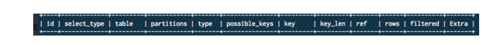
>
>   -   id：是一个有顺序的编号，是查询的顺序号，越大越先执行
>
>   -   selectType：表示查询中每个select子句的类型（比如联表查询、子查询）
>
>   -   table：表示该语句查询的表
>
>   -   **type**：优化sql的重要字段，也是我们判断sql性能和优化程度重要指标。他的取值类型范围：
>
>       const：通过索引一次命中，匹配一行数据
>
>       system: 表中只有一行记录，相当于系统表；
>
>       eq_ref：唯一性索引扫描，对于每个索引键，表中只有一条记录与之匹配
>
>       ref: 非唯一性索引扫描,返回匹配某个值的所有
>
>       range: 只检索给定范围的行，使用一个索引来选择行，一般用于between、<、>；
>
>       index: 只遍历索引树；
>
>       ALL: 表示全表扫描，这个类型的查询是性能最差的查询之一。 那么基本就是随着表的数量增多，
>
>       执行效率越慢。
>
>       **执行效率：**
>
>       **ALL < index < range< ref < eq_ref < const < system**。最好是避免ALL和index
>
>   -   possible_keys：它表示Mysql在执行该sql语句的时候，可能用到的索引信息
>   -   key：此字段是 mysql 在当前查询时所真正使用到的索引。
>   -   **key_len**：表示查询优化器使用了索引的字节数，这个字段可以评估组合索引是否完全被使用，这也是我们优化sql时，评估索引的重要指标
>   -   **rows：**mysql 查询优化器根据统计信息，估算该sql返回结果集需要扫描读取的行数，这个值相关重要，索引优化之后，扫描读取的行数越多，说明索引设置不对，或者字段传入的类型之类的问题，说明要优化空间越大
>   -   filtered：返回结果的行占需要读到的行(rows列的值)的百分比
>   -   extra：覆盖索引、是否用临时表等

### SQL语句执行慢的原因

1. 数据量太大了。

2. 执行的时候遇到锁。

3. 没有用到索引。

    > 可能是字段没有设置索引；或者对索引字段进行了运算，导致系统无法使用索引。

### 字符集以及校对规则

字符集：指的是某一字符集合到二进制编码的映射。

> 比如，ASCII字符集、GBK字符集、UTF8字符集。

校对规则：指的是某一字符集下的排序和比较规则。

> MySQL中的每一种字符集都有其默认的校对规则。

### 子查询和连接查询是什么？

子查询：

子查询又称内查询，在主查询之前一次执行完成，可能会多次遍历数据。

其结果被主查询使用。

将查询操作嵌套在另一个查询操作中。

先执行子查询，再执行外查询。


连接查询：

https://blog.csdn.net/Ber_Bai/article/details/118029011#inner_join_1

将表连接后再进行查询，仅遍历一次。

又分为内连接（又称等值连接，【自然连接去掉重复列的等值连接】）、外连接（左外、右外、全外【mysql中无】）、交叉连接（不带where子句 笛卡尔乘积）、自连接

 

选择：

连接查询的效率更高，因为子查询会多次遍历数据，而连接查询值遍历一次，但是数据量小的情况下，自查询更加容易控制。


### Mysql中的临时表

- 内部临时表：

    - 一类是information_schema中的临时表

        >   performance_schema用于性能分析，而information_schema用于存储数据库元数据（关于数据的数据）
        >
        >   information_schema中的表实际上是试图，而不是基本表，因此，文件系统上没有与之相关的文件

    - 一类是会话查询时，`group by`,`distinct`,`union`等语句，含有“using temporary”，辅助sql执行

        - 使用场景：

            取两个子查询结果的并集，重复的数据只保留一行，通过建立一个带主键的临时表，就可以解决“去重”问题；

            对于group by而言，我们首先需要统计每个值出现的数目，这就需要借助临时表来快速定位，如果不存在，则插入一条记录，如果存在，并累加计数，所以看到了"Using temporary"；

            

- 外部临时表：

通过语句`create temporary table`，可以指定临时表的内存引擎

​	创建一个 frm 文件保存表结构定义，还要有地方保存表数据


临时表和普通表的说明：

在服务器重启之后，所有临时表都会被销毁，会话断开后无效

临时表示**进程独占**的，当前进程创建的临时表，其他进程是查不到的


**索引可以帮助服务器避免进行排序和分组,以及避免创建临时表**(B-Tree索引是有序的，可以用于
ORDER BY和GROUP BY操作。**临时表主要是在排序和分组过程中创建,不需要排序和分组,也就不需要创建临时表)**


## 阿里巴巴数据库最佳实践

### 模糊查询

【强制】页面搜索严禁使用左模糊或者全模糊，如果需要请走搜索引擎来解决。

【原因】索引文件具有B-Tree的最左前缀匹配特性，如果左值未确定，那么就无法使用索引。

```sql
SELECT * FROM user_table WHERE name LIKE '%小明'; # 左模糊
SELECT * FROM user_table WHERE name LIKE '%小%'; # 全模糊
```

### 外键和级联

【强制】不得使用外键和级联，一切外键概念必须在应用层解决。

> 数据库表的关联，应该按照表的内部id做关联，不推荐用业务编码做主键。 

【原因】外键和级联更适合与单机、低并发，不适合分布式、高并发集群——级联更新是强阻塞，存在数据库更新风暴的风险；外键影响数据库的插入速度。

> 外键的优点：保证了数据库数据的一致性和完整性；级联操作方便，减轻了程序代码量。
>
> 外键的缺点：做增删改的时候需要考虑外键约束；对分库分表十分不友好。

### @Transactional注解（Spring的内容）

【参考】@Transactional事务不要滥用。事务会影响数据库的QPS（每秒查询率），另外使用事务的地方需要考虑各方面的回滚方案，包括缓存回滚、搜索引擎回滚、消息补偿、统计修正等。


## Redis

首先Redis是基于C语言编写的，而且是内存中的数据库，读写速度很快。在项目中也经常会使用Redis，一般会用来做缓存、或者分布式锁


### 与memcached区别

**Redis** 支持数据的持久化，可以将内存中的数据保持在磁盘中，重启的时候可以再次加载进行使用**,**而 **Memecache** 把数据全部存在内存之中。

所以redis有灾难恢复机制，也可以将不用的数据放入磁盘


### Redis数据过期后的删除策略？

常用的过期数据的删除策略就两个（重要！自己造缓存轮子的时候需要格外考虑的东西）：

1.   惰性删除 ：只会在取出key的时候才对数据进行过期检查。这样**对CPU最友好**，但是可能会造成太多过期 key 没有被删除。

2.   定期删除 ： 每隔一段时间抽取一批 key 执行删除过期key操作。并且，Redis 底层会通过限制删除操作执行的时长和频率来减少删除操作对CPU时间的影响。


**定期删除对内存更加友好，惰性删除对CPU更加友好。**两者各有千秋，所以Redis 采用的是定期删除**+**惰性**/**懒汉式删除 。

### 什么是缓存穿透？如何避免？什么是缓存击穿，如何避免？什么是缓存雪崩？何如避免？

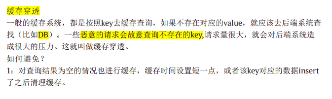

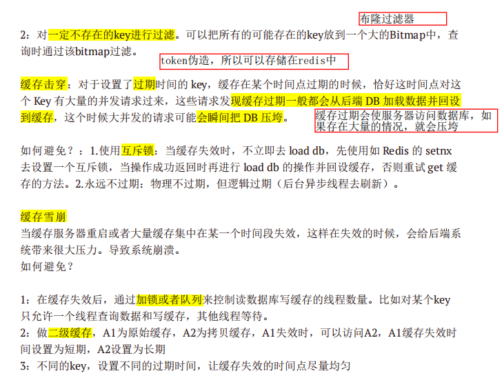

总结：

-   缓存穿透：恶意查询不存在的key

    解决：缓存空值；布隆过滤器（过滤这种key）

-   缓存击穿：缓存过期

    缓存过期会使服务器访问数据库，如果存在大量的情况，就会压垮

    解决：互斥锁；永远不过期，后台异步线程刷新

-   缓存雪崩：缓存服务器重启、大量缓存在同一时间失效

    解决：加锁；二级缓存；给key设置不同的过期时间，均匀


### 单点登录

单点登录SSO（Single Sign On）说得简单点就是在一个多系统共存的环境下，用户在一处登录后，就不用在其他系统中登录，也就是用户的一次登录能得到其他所有系统的信任。


## 写SQL

### 面经1

- 有一个user表，包括uid，name字段

  有一个record表，包括id，uid， create_date字段

  根据name查询最近10条的record记录。

  ```sql
  select * 
  from record
  where uid in (
  	select uid 
      from user
      where name = "name"
  )
  order by create_data
  limit 10
  ```

- 当表A的id和表B的id相同时，将表A的某个字段x的值赋给表B的某个字段的值 

  ```sql
  update A set A.KZXM = (
       select B.xm 
       from  B 
       where A.ID=B.ID 
       limit 1
  )
  ```

- 表grade，有三列，name、subject、score，找到：语文这科目，姓张的同学中成绩最好的三个人的姓名和分数

  ```sql
  select name,score
  from grade
  where subject="语文" and name like "张%"
  order by score desc
  limit 3
  ```


### leetcode

#### [584. 寻找用户推荐人](https://leetcode-cn.com/problems/find-customer-referee/)

给定表 `customer` ，里面保存了所有客户信息和他们的推荐人。写一个查询语句，返回一个客户列表，列表中客户的推荐人的编号都 **不是** 2。

```sql
--注意id为空的情况
select name from customer
where referee_id <> 2 or referee_id is null
```

#### [595. 大的国家](https://leetcode-cn.com/problems/big-countries/)

如果一个国家满足下述两个条件之一，则认为该国是 大国 ：

    面积至少为 300 平方公里（即，3000000 km2），或者
    人口至少为 2500 万（即 25000000）

编写一个 SQL 查询以报告 大国 的国家名称、人口和面积。

```sql
select name, population, area from World
where area >= 3000000 or population >= 25000000
```


#### [175. 组合两个表](https://leetcode-cn.com/problems/combine-two-tables/)(左连接)

编写一个SQL查询来报告 `Person` 表中每个人的姓、名、城市和状态。如果 `personId` 的地址不在 `Address` 表中，则报告为空  `null` 。

```sql
select FirstName as firstName, LastName as lastName, City as city, State as state 
from Person
left join Address
on Person.PersonId = Address.PersonId
```

#### [180. 连续出现的数字](https://leetcode-cn.com/problems/consecutive-numbers/)（自连接）

编写一个 SQL 查询，查找所有至少连续出现三次的数字。

返回的结果表中的数据可以按 **任意顺序** 排列。

```sql
select distinct a.Num as ConsecutiveNums 
from logs a
join logs b on a.Id = b.Id - 1
join logs c on a.Id = c.Id - 2
where a.Num = b.Num and b.Num = c.Num
```


#### [182. 查找重复的电子邮箱](https://leetcode-cn.com/problems/duplicate-emails/)（group by）

编写一个 SQL 查询，查找 `Person` 表中所有重复的电子邮箱。

```sql
select Email from Person
group by Email
having count(Email) >= 2
```


#### [176. 第二高的薪水](https://leetcode-cn.com/problems/second-highest-salary/)（limit）

编写一个 SQL 查询，获取并返回 `Employee` 表中第二高的薪水 。如果不存在第二高的薪水，查询应该返回 `null` 。

```sql
# 将临时表的结果作为是否为null
select distinct (
    select distinct salary 
    from Employee 
    order by salary DESC
    limit 1,1
) as SecondHighestSalary
```


#### [1084. 销售分析III](https://leetcode-cn.com/problems/sales-analysis-iii/)(in)

编写一个SQL查询，报告`2019年春季`才售出的产品。即**仅**在`**2019-01-01**`至`**2019-03-31**`（含）之间出售的商品。

```sql
select distinct Product.product_id, product_name
from Product
join Sales
on Product.product_id = Sales.product_id
where sale_date between '2019-01-01' and '2019-03-31'
and Sales.product_id not in (select product_id from Sales
where sale_date > '2019-03-31' or sale_date < '2019-01-01'
)
```

```sql
SELECT 
    s.product_id, p.product_name
FROM 
    sales s
LEFT JOIN 
    product p 
ON 
    s.product_id = p.product_id
GROUP BY 
    s.product_id
HAVING MIN(sale_date) >= '2019-01-01' 
AND MAX(sale_date) <= '2019-03-31';
```


#### [197. 上升的温度](https://leetcode-cn.com/problems/rising-temperature/)(date)

编写一个 SQL 查询，来查找与之前（昨天的）日期相比温度更高的所有日期的 `id` 。

注意日期的比较：

| 函数          | 描述                                |
| ------------- | ----------------------------------- |
| NOW()         | 返回当前的日期和时间                |
| CURDATE()     | 返回当前的日期                      |
| CURTIME()     | 返回当前的时间                      |
| DATE()        | 提取日期或日期/时间表达式的日期部分 |
| EXTRACT()     | 返回日期/时间按的单独部分           |
| DATE_ADD()    | 给日期添加指定的时间间隔            |
| DATE_SUB()    | 从日期减去指定的时间间隔            |
| DATEDIFF()    | 返回两个日期之间的天数              |
| DATE_FORMAT() | 用不同的格式显示日期/时间           |

```sql
select distinct w1.id from 
Weather as w1
join Weather as w2
where datediff(w1.recordDate, w2.recordDate) = 1 and 
w2.temperature < w1.temperature
```


### 面经2

参考：https://blog.csdn.net/vincerey/article/details/116403484

#### **表结构**

下文中用到的数据库有：

- 数据库1

    Student(Sno,Sname,Sage,Ssex) 学生表

    Course(Cno,Cname,Tno) 课程表

    SC(Sno,Cno,score) 成绩表

    Teacher(Tno,Tname) 教师表

- 数据库2

    Salary(year,salary) 工资表

- 数据库3

    a(id,name)


#### 题目

- 查询“001”课程比“002”课程成绩高的所有学生的学号

    ```sql
    -- 需要自连接
    SELECT s1.Sno 
    FROM SC AS s1, SC AS s2
    WHERE s1.Sno = s2.Sno AND s1.Cno='001' AND s2.Cno='002' AND s1.score > s2.score
    ```

    ```sql
    -- 构建两个临时表
    SELECT a.Sno
    FROM (SELECT Sno,score FROM SC WHERE Cno='001') a,
    (SELECT Sno,score FROM SC WHERE Cno='002') b
    WHERE a.score > b.score AND a.Sno=b.Sno;
    ```

- 查询平均成绩大于60分的同学的学号和平均成绩

    ```sql
    -- 按学号分组
    -- 分组后算平均成绩 goup by的用途
    SELECT Sno,AVG(score)
    FROM SC
    GROUP BY Sno
    HAVING AVG(score) > 60
    ```

- 查询**所有**同学的学号、姓名、选课数、总成绩

    ```sql
    -- 所有同学，所以是left join
    select SC.Sno,Sname,count(SC.Cno),sum(score)
    from Student 
    left join SC on Student.Sno = Sc.Sno
    group by SC.Sno
    ```

- 查询姓“李”的老师的个数

    ```sql
    select Count(Tname)
    from Teacher
    where Tname like '李%'
    
    -- 这里不用分组就可以用聚合函数是因为下面Sql语句包含了Tname的列
    -- select *
    -- from Teacher
    -- where Tname like '李%'
    -- 然后就可以直接求列的count()了
    ```

- **查询没学过“叶平”老师课的同学的学号、姓名**

    ```sql
    -- 把`变成学过叶平老师课的同学的学号和姓名`结果取反
    -- where里对临时表的筛选可以用in
    select Student.Sno, Student.`Sname`
    from Student
    where Sno not in (
    	select distinct SC.Sno
    	from SC, Course, Teacher
    	where SC.`Cno` = Course.`Cno` and Teacher.`Tno`=Course.`Cno` and
    		Teacher.Tname='叶平'
    )
    ```

    错误解法解析：

    ```sql
    -- 错误解法：因为他们都有不是叶平老师的课的课程Cno，必须每一门课都不是叶平老师的才行
    select distinct Student.Sno, Sname
    from Student
    join SC on SC.Sno = Student.Sno
    join Course on Course.cno = SC.Cno
    join Teacher on Teacher.Tno = Course.Tno
    where Tname !='叶平'
    
    -- 修正：所以进行group by 的分组，然后判断老师名不是叶平
    -- 下面这个解法，可以得到正确的答案的条目
    -- 由于在使用group by分组时，后面如果需要再加一个having进行判断，则所判断的字段需要在select后面出现(不是聚合函数的情况下)，否则会报错
    -- 所以不能直接返回Student.Sname和Student.Sno
    SELECT *
    FROM Student
    JOIN SC ON SC.Sno = Student.Sno
    JOIN Course ON Course.cno = SC.Cno
    JOIN Teacher ON Teacher.Tno = Course.Tno
    GROUP BY Student.Sno
    HAVING Teacher.Tname !='叶平'
    
    -- 本来写的是这样
    SELECT Sno,Sname
    FROM (
    SELECT Student.Sno, Sname,Teacher.Tname
    FROM Student
    JOIN SC ON SC.Sno = Student.Sno
    JOIN Course ON Course.cno = SC.Cno
    JOIN Teacher ON Teacher.Tno = Course.Tno
    GROUP BY Student.Sno
    HAVING Teacher.Tname !='叶平'
    )
    
    -- 但会报错“每一个派生出来的表都必须有一个自己的别名”
    -- 所以将代码修改为
    select t.Sno,t.Sname
    from (
    SELECT Student.Sno, Sname,Teacher.Tname
    FROM Student
    JOIN SC ON SC.Sno = Student.Sno
    JOIN Course ON Course.cno = SC.Cno
    JOIN Teacher ON Teacher.Tno = Course.Tno
    GROUP BY Student.Sno
    HAVING Teacher.Tname !='叶平'
    ) as t
    ```

- 查询学过“001”并且也学过编号“002”课程的同学的学号、姓名；

    ```sql
    -- 自己写的,利用表联合
    SELECT Student.Sno,Student.Sname
    FROM Student
    JOIN (
    SELECT s1.Sno
    FROM SC AS s1,SC AS s2
    WHERE s1.Sno = s2.Sno AND s1.Cno='001' AND s2.Cno='002') AS t
    ON t.Sno = Student.Sno
    ```

    ```sql
    -- 答案，利用exists关键字
    SELECT Student.Sno,Student.Sname
    FROM Student,SC
    WHERE Student.Sno=SC.Sno AND SC.Cno='001' AND 
    EXISTS( SELECT * FROM SC AS SC_2 WHERE SC_2.Sno=SC.Sno AND SC_2.Cno='002');
    ```

- 查询学过**“叶平”老师所教的所有课**的同学的学号、姓名（是所有课，不是所有学生，可以利用count来判断）

    ```sql
    SELECT Sno,Sname
    FROM Student
    WHERE Sno IN(
        -- 连接所有的表
    	SELECT Student.Sno
    	FROM Student
    	JOIN SC ON SC.Sno = Student.Sno
    	JOIN Course ON Course.cno = SC.Cno
    	JOIN Teacher ON Teacher.Tno = Course.Tno
    	WHERE Tname = '叶平'
        -- 按学生分组，看学生选叶平老师课的数量和叶平老师教的所有课的数量是否一致
    	GROUP BY Sno
        -- 计算所有叶平老师教得课程
    	HAVING COUNT(Tname='叶平')=(
    		SELECT COUNT(Course.Cno)
    		FROM Course,Teacher
    		WHERE Course.Tno = Teacher.`Tno` AND Teacher.Tname='叶平')
    )
    ```

- 查询所有课程成绩小于60分的同学的学号、姓名

    ```sql
    SELECT Sno,Sname
    FROM Student
    WHERE Sno IN (
    SELECT Sno
    FROM SC
    GROUP BY Sno
    HAVING MAX(score) < 60
    )
    ```

    ```sql
    select Sno,Sname
    from Student
    where Sno not in (select Student.Sno from Student,SC where S.Sno=SC.Sno and score>60);
    ```

    

- 查询没有学全所有课的同学的学号、姓名；

    ```sql
    SELECT Sno,Sname
    FROM Student
    WHERE Sno NOT IN 
    (
    SELECT Sno
    FROM SC
    GROUP BY Sno
    HAVING COUNT(Cno) = (
    	SELECT COUNT(Cno)
    	FROM Course
    ))
    ```

    ```sql
    SELECT Student.Sno,Student.Sname
    FROM Student,SC
    WHERE Student.Sno=SC.Sno
    GROUP BY Student.Sno,Student.Sname HAVING COUNT(Cno) <(SELECT COUNT(Cno) FROM Course);
    ```

- 查询至少有一门课与学号为“1001”的同学所学相同的同学的学号和姓名；

    ```sql
    SELECT Sno,Sname
    FROM Student
    WHERE Student.Sno IN
    (
    SELECT DISTINCT Sno
    FROM SC
    WHERE Cno IN(
    	SELECT Cno
    	FROM SC
    	WHERE Sno='2'
    	)
    )
    ```

    ```sql
    SELECT DISTINCT Student.Sno,Sname
    FROM Student,SC
    WHERE Student.Sno=SC.Sno AND Cno IN (SELECT Cno FROM SC WHERE Sno='2');
    ```

- 删除学习“叶平”老师课的SC表记录

    ```sql
    DELETE SC
    FROM SC
    WHERE Cno IN (
    	SELECT Cno
    	FROM Course
    	WHERE Tno IN(
    		SELECT Tno
    		FROM Teacher
    		WHERE Tname='叶平'
    	)
    )
    ```

    ```sql
    DELETE SC
    FROM Course ,Teacher
    WHERE Course.Cno=SC.Cno AND Course.Tno= Teacher.Tno AND Tname='叶平';
    ```

- 查询各科成绩最高和最低的分：以如下形式显示：课程ID，最高分，最低分

    ```sql
    -- 不确定是否对，但结果和答案一致，但不明白为什么答案那么复杂
    SELECT Cno AS '课程ID', MAX(score) AS '最高分',MIN(score) AS '最低分'
    FROM SC
    GROUP BY Cno
    ```

    ```sql
    SELECT L.Cno 课程ID,L.score 最高分,R.score 最低分
    FROM SC L ,SC R
    WHERE L.Cno = R.Cno
    and
    L.score = (SELECT MAX(IL.score)
    FROM SC IL,Student IM
    WHERE IL.Cno = L.Cno and IM.Sno=IL.Sno
    GROUP BY IL.Cno)
    and
    R.Score = (SELECT MIN(IR.score)
    FROM SC IR
    WHERE IR.Cno = R.Cno
    GROUP BY IR.Cno );
    ```

- **查询学生平均成绩及其名次**

    ```sql
    -- 名次的求法：
    -- 利用自连接创建两个包含学生学号和平均成绩的表T1,T2
    -- 求T1.平均成绩 > T2.平均成绩的 T1里的数量
    -- 最后结果 + 1
    -- 原理是：
    -- 做了一个统计，统计了现在有多少人的分数大于需要计算的人的考试成绩，这个计算出来的数字加1，就是名次了。
    -- 比如我现在80分，统计有多少人的成绩比80分大
    
    SELECT 
    
    1+(SELECT COUNT( DISTINCT 平均成绩)
    FROM (SELECT Sno,AVG(score) 平均成绩
    FROM SC
    GROUP BY Sno ) T1
    WHERE 平均成绩 > T2.平均成绩) 名次, Sno 学生学号,平均成绩
    
    FROM (SELECT Sno,AVG(score) 平均成绩 FROM SC GROUP BY Sno ) T2
    ORDER BY 平均成绩 DESC;
    ```

- **查询各科成绩前三名的记录:(不考虑成绩并列情况)**

    我是真的没懂

    ```sql
    -- b为当前表
    -- 必须用left join 
    SELECT a.Sno,a.Cno,a.`score` FROM SC AS a 
    LEFT JOIN SC b ON a.Cno = b.`Cno` AND a.score < b.score
    GROUP BY a.Sno, a.Cno,a.Score
    HAVING COUNT(b.Sno)<3
    ORDER BY a.Cno,a.Score DESC
    ```

- **查询每门功课成绩最好的前两名**

    ```sql
    -- a是当前的表，以a为基准，也就是笛卡尔乘积里不变的那个
    SELECT a.Sno,a.Cno,a.`score` FROM SC AS a 
    LEFT JOIN SC b ON a.Cno = b.`Cno` AND b.score < a.score
    GROUP BY a.Cno,a.Sno,a.Score
    HAVING COUNT(b.Sno) < 2
    ORDER BY a.Cno,a.Score DESC
    ```

- **查询小于等于当前年份的薪资总和**

    要分清以哪个表作为基准的，以select里写的为准，也就是笛卡尔乘积里不变的那个

    ```sql
    -- b是当前的表，以b为基准
    -- 所以是b.year
    -- SUM(a.salary)是因为，要小于当前年份的薪资总和
    -- 由于不加group by只有一列，所以需要加以当前为基准的划分
    SELECT b.year,SUM(a.salary)
    FROM salary a,salary b
    WHERE a.year <= b.year
    GROUP BY b.year
    ORDER BY b.year
    ```

- **查询A(ID,Name)表中第31至40条记录，ID作为主键可能是不是连续增长的列**(在面试过程中多次碰到一道SQL查询的题目)

    ```sql
     -- 查询表A中第i至j条记录,id为主键，但不是连续增长的，但是是增长的
     -- 找出0-i-1条记录中的id的最大值max(id)
     -- 以后的id > max(id)的记录要(j-i+1)条
     
     -- example 查找4-6的记录，表和结果如下
     SELECT *
     FROM A
     WHERE id > 
     (
     	SELECT MAX(id)
     	FROM (
     		SELECT id 
     		FROM A
     		ORDER BY id
     		LIMIT 0,3
     	) AS t
     )
     ORDER BY id
     LIMIT 0,3
    ```

    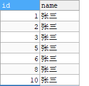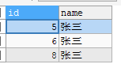


