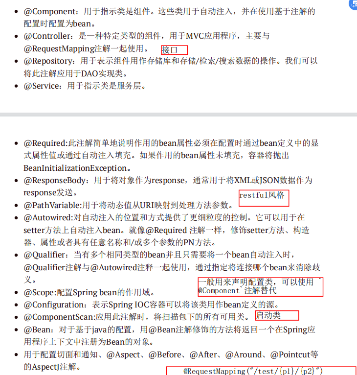
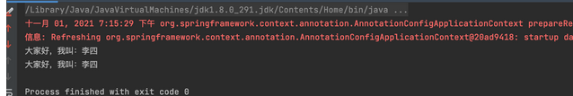
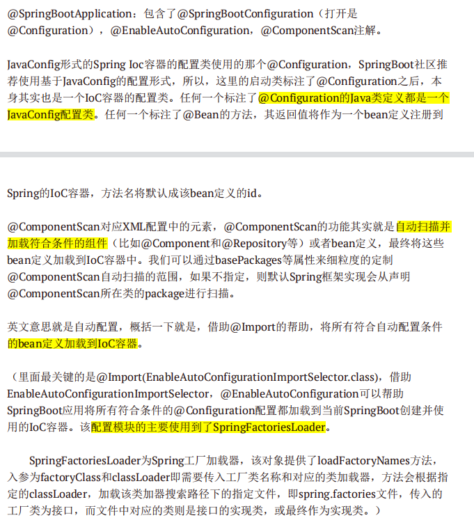
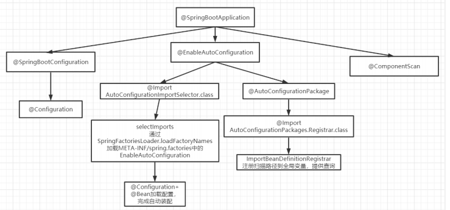
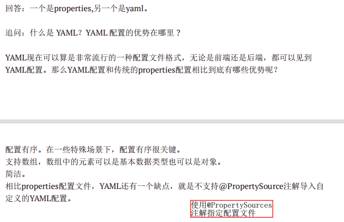
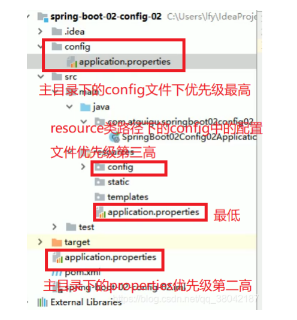

# **Spring概念**

## Spring是什么

轻量级的开源的J2EE框架。它是一个容器框架，用来装javabean（java对象），中间层框架（万能胶）可以起一个连接作用，整合现有的技术框架,旨在提高开发人员的开发效率以及系统的可维护性。

（SSM：SpringMVC , Spring, Mybatis）

优点：

- Spring开源免费的框架（容器）
- Spring是一个轻量级、非入侵式的框架（框架）
- **控制反转（IOC）【松耦合】，面向切面编程(AOP)【分离业务逻辑和服务逻辑】**
- 支持**事务**的处理，对框架整合的支持

缺点：

-   使用了大量的反射机制，反射机制非常占用内存
-   配置复杂，约定大于配置


## 重要的Spring模块

**Spring Core**

核心模块， Spring 其他所有的功能基本都需要依赖于该模块，主要提供 IoC 依赖注入功能的支持。

**Spring AOP**

提供了面向切面的编程实现。

**Spring Data Access/Integration **

Spring Data Access/Integration 由 5 个模块组成：

- spring-jdbc : 提供了对数据库访问的抽象 JDBC。不同的数据库都有自己独立的 API 用于操作数据库，而 Java 程序只需要和 JDBC API 交互，这样就屏蔽了数据库的影响。
- spring-tx : 提供对事务的支持。
- spring-orm : 提供对 Hibernate 等 ORM 框架的支持。
- spring-oxm ： 提供对 Castor 等 OXM 框架的支持。
- spring-jms : Java 消息服务。

**Spring Web**

Spring Web 由 4 个模块组成：

- spring-web ：对 Web 功能的实现提供一些最基础的支持。
- spring-webmvc ： 提供对 Spring MVC 的实现。
- spring-websocket ： 提供了对 WebSocket 的支持，WebSocket 可以让客户端和服务端进行双向通信。
- spring-webflux ：提供对 WebFlux 的支持。WebFlux 是 Spring Framework 5.0 中引入的新的响应式框架。与 Spring MVC 不同，它不需要 Servlet API，是完全异步

**Spring Test**

Spring 团队提倡测试驱动开发（TDD）。有了控制反转 (IoC)的帮助，单元测试和集成测试变得更简单。

Spring 的测试模块对 JUnit（单元测试框架）、TestNG（类似 JUnit）、Mockito（主要用来 Mock  对象）、PowerMock（解决 Mockito 的问题比如无法模拟 final, static， private  方法）等等常用的测试框架支持的都比较好。


## Spring,Spring MVC,Spring Boot 之间什么关系?

Spring 包含了多个功能模块，其中最重要的是 Spring-Core（主要提供 IoC 依赖注入功能的支持） 模块， Spring 中的其他模块（比如 Spring MVC）的功能实现基本都需要依赖于该模块。


Spring MVC 是 Spring 中的一个很重要的模块，主要赋予 Spring 快速构建 MVC 架构的 Web 程序的能力。**MVC  是模型(Model)、视图(View)、控制器(Controller)的简写，其核心思想是通过将业务逻辑、数据、显示分离来组织代码**。


使用 Spring 进行开发各种配置过于麻烦比如开启某些 Spring 特性时，需要用 XML 或 Java 进行显式配置。于是，Spring Boot 诞生了！

Spring 旨在简化 J2EE 企业应用程序开发。Spring Boot 旨在简化 Spring 开发（减少配置文件，开箱即用！）。整合了一系列的解决方案（starter机制）


## 常用注解

详细看Spring5_2



>   @PathVarible：接收请求路径中占位符的值
>
>   具体使用看下：
>
>   ```java
>   @Controller
>   @RequestMapping("hello")
>   public class HelloController2 {
>       /**
>        *3、占位符映射
>        * 语法：@RequestMapping(value=”user/{userId}/{userName}”)
>        * 请求路径：http://localhost:8080/hello/show5/1/james
>        * @param ids
>        * @param names
>        * @return
>        */
>       @RequestMapping("show5/{id}/{name}")
>       public ModelAndView test5(@PathVariable("id") Long ids ,@PathVariable("name") String names){
>   	...
>       }
>   }
>   ```
>
>   
>
>   SpringBoot在写启动类的时候如果不使用@ComponentScan指明对象扫描范围，默认指扫描当前启动类所在的包里的对象
>
>   因为启动类不能直接放在main/java文件夹下，必须要建一个包把它放进去或者使用@ComponentScan指明要扫描的包。


## XML配置和注解之间有什么区别

注解的优点：

所有信息都在一个文件中

当类更改了，不用修改xml配置文件


xml配置的优点：

POJO及其行为之间更清晰地分离

当你不知道哪个POJO负责该行为时，更容易找到该POJO


# Spring IOC

## **IoC**

IoC: 控制反转，意思就是将创建对象的控制权从⾃⼰硬编码new的⼀个对象反转到了第三⽅身上。

IoC的主要实现⽅式是依赖注⼊，Spring中的依赖注⼊⽅式有：构造⽅法注⼊、settter注⼊、接⼝注⼊？


**为什么叫控制反转？**

- **控制** ：指的是对象创建（实例化、管理）的权力
- **反转** ：控制权交给外部环境（Spring 框架、IoC 容器）

IOC负责创建对象，使用依赖注入（dependency injection，DI）管理它们，将对象集中起来，配置对象，管理对象的整个生命周期。

在 Spring 中， IoC 容器是 Spring 用来实现 IoC 的载体， IoC 容器实际上就是个 Map（key，value），Map 中存放的是各种对象。BeanDefineRegistry

>   key：bean的名称id
>
>   value：配置信息，比如bean的作用域，bean的类型，bean的依赖，bean的属性等等,对象
>
>   ```java
>   Map<String, Object> 
>   ```


**⽬的：**

帮助我们接耦各种有依赖关系的业务对象之间的绑定关系


## IOC的好处

-   IOC或依赖注入最小化应用程序代码量。（if,else）
-   它使测试应用程序变得容易，因为单元测试中不需要单例或JNDI查找机制。
-   以最小的代价和最少的干扰来促进松耦合。
-   IOC容器支持快速实例化和懒加载。


## 对IOC的理解

容器概念、控制反转、依赖注入


**ioc容器**

实际上就是个map（key，value），里面存的是各种对象（在xml里配置的bean节点、@repository、@service、@controller、@component），在项目启动的时候会读取配置文件里面的bean节点，根据全限定类名使用反射创建对象放到map里、扫描到打上上述注解的类还是通过反射创建对象放到map里。

这个时候map里就有各种对象了，接下来我们在代码里需要用到里面的对象时，再通过DI注入（autowired、resource等注解，xml里bean节点内的ref属性，项目启动的时候会读取xml节点ref属性根据id注入，也会扫描这些注解，根据类型或id注入；id就是对象名）。


**控制反转**

没有引入IOC容器之前，对象A依赖于对象B，那么对象A在初始化或者运行到某一点的时候，**自己必须主动去创建对象B**或者使用已经创建的对象B。无论是创建还是使用对象B，控制权都在自己手上。

引入IOC容器之后，对象A与对象B之间失去了直接联系，**当对象A运行到需要对象B的时候，IOC容器会主动创建一个对象B注入到对象A需要的地方。**

通过前后的对比，不难看出来：对象A获得依赖对象B的过程,由主动行为变为了被动行为，控制权颠倒过来了，这就是“控制反转”这个名称的由来。

全部对象的控制权全部上缴给“第三方”IOC容器，所以，IOC容器成了整个系统的关键核心，它起到了一种类似“粘合剂”的作用，把系统中的所有对象粘合在一起发挥作用，如果没有这个“粘合剂”，对象与对象之间会彼此失去联系，这就是有人把IOC容器比喻成“粘合剂”的由来。


**依赖注入**

“获得依赖对象的过程被反转了”。控制被反转之后，获得依赖对象的过程由自身管理变为了由IOC容器主动注入。依赖注入是实现IOC的方法，就是由IOC容器在运行期间，动态地将某种依赖关系注入到对象之中。依赖注入只是一种方式而已。


## **IoC-Provider**

虽然不需要我们⾃⼰来做绑定关系，但是这部分的⼯作还是需要有⼈来实现的，所以IoC Provider就担任了这个⻆⾊，同时IoC Provider的职责也不仅仅这些，其基础职责如下： 

- 业务对象的构建管理：

    IoC中，业务对象不需要关⼼所依赖的对象如何构建如何获取，这部分任务交由IoC Provider 

- 业务对象之间的依赖绑定：

    通过结合之前构建和管理的所有业务对象，以及各个业务对象之间可识别的依赖关系，将这些对象所依赖的对象注⼊绑定。从⽽保证每个业务对象在使⽤的时候，可以处于就绪状态。 


## 如何实现一个IOC容器

1、配置文件配置包扫描路径

2、递归包扫描获取.class文件 => set

3、反射、确定需要交给IOC管理的类（bean的实例化）=>遍历set将带注释的类交给ioc管理，实例化

4、对需要注入的类进行依赖注入


-   配置文件中指定需要扫描的包路径

-   定义一些注解，分别表示访问控制层、业务服务层、数据持久层、依赖注入注解、获取配置文件注解

-   从配置文件中获取需要扫描的包路径，获取到当前路径下的文件信息及文件夹信息，我们将当前路径下所有以.class结尾的文件添加到一个Set集合中进行存储

-   遍历这个set集合，获取在类上有**指定注解**的类，并将其交给IOC容器，定义一个安全的Map用来存储这些对象

-   遍历这个IOC容器，获取到每一个类的实例，判断里面是有有依赖其他的类的实例，然后进行递归注入

    

## Spring的IoC容器（Bean的生命周期）

### 概述

担任了IoC Provider的职责，同时在此基础上，还增加了对Bean⽣命周期的管理、AOP⽀持内容。

从整体来看Spring的IoC容器的作⽤，共分为两部分：

- 容器启动阶段

  以某种⽅式将配置的Bean信息（XML、注解、Java编码）加载如整个Spring应⽤ 

  - 配置元信息（Resource）：（XML、注解、Java编码）

  - **BeanDefination**：配置元信息被加载到内存之后是以BeanDefination的形存在的

  - **BeanDefinationReader**：加载配置元信息，并将其转化为内存形式的BeanDefination

  - **BeanDefinationRegistry**：BeanDefinationRegistry就是一个存放BeanDefination的大篮子，它也是一种键值对的形式，通过特定的Bean定义的id，映射到相应的BeanDefination。map<string,beandefination>

  - **BeanFactoryPostProcessor**：是容器启动阶段Spring提供的一个扩展点（AOP）

    BeanFactoryPostProcessor会对注册到BeanDefinationRegistry中的BeanDefination做最后的修改，替换$占位符为配置文件中的真实的数据

- Bean实例化阶段

  将加载的Bean配置信息组装成应⽤需要的业务对象，加载方式分为两种

  - 非懒加载（默认）：容器启动后，立即实例化Bean，通过隐式的调用所有依赖对象的getBean方法来实例化所有配置的Bean并保存起来。
  - 懒加载：Spring只有在我们需要依赖对象的时候才开启相应对象的实例化阶段，再此之前都是BeanDefination的方式存在
  
  在此基础上，还充分运⽤了这两个阶段不同的特点，都预留了拓展钩⼦(AOP扩展点)，供我们根据业务场景进⾏⾃定义拓展


### Bean的生命周期

参考：https://juejin.cn/post/6929672218322731022


从Bean的⻆度来看，其整个⽣命周期如下：


注意：Spring只帮我们管理单例Bean的⽣命周期，对于prototype类型的bean，Spring在创建好交给使⽤者使⽤之后，就不在管理其后续的⽣命周期了。 


**粗略涉及具体源码的整体流程：** 


== 容器启动阶段==

1. BeanDefinitionReader读取Bean的配置信息（XML等），将读取到的每个Bean的配置信息使⽤BeanDefinition表示，同时注册到相应的BeanDefinitionRegistry（⼀个map）中 。 
2. 【AOP扩展点一】通过实现了**BeanFactoryPostProcessor**的类，⾃定义修改BeanDefinition中的信息（如果有的话） 


通俗理解：

```java
1.调用构造方法：我出生了！
2.设置属性：我的名字叫张铁钢
3.调用BeanNameAware#setBeanName方法:我要上学了，起了个学名
4.调用BeanFactoryAware#setBeanFactory方法：选好学校了
5.BeanPostProcessor#postProcessBeforeInitialization方法：到学校报名啦
6.InitializingBean#afterPropertiesSet方法：入学登记
7.自定义init方法：努力上学ing
8.BeanPostProcessor#postProcessAfterInitialization方法：终于毕业，拿到毕业证啦！
Bean使用中：工作，只有对社会没有用的人才放假。。
9.DisposableBean#destroy方法：平淡的一生落幕了
10.自定义destroy方法:睡了，别想叫醒我
```


== 实例化阶段==

3. Bean的实例化: 

   (1) **采⽤策略化bean的实例。**两种⽅式：cglib、**反射**

   ```java
   UserMapper mapper = (UserMapper) context.getBean("UserMapperImple1");
   ```

   (2) **设置对象属性，手动依赖注入**。获取Bean的实例之后，根据BeanDefinition中信息，填充Bean的属性、依赖注入 （IOC注入）**（是对象的属性值）**

4. **检测各种Aware接⼝，自动注入相关依赖对象实例，获取资源。**(是bean的属性值)

   - 如果是**BeanFactory**（手动注入）

     必须要在配置文件中或者使用注解的方式，将相关实例注册容器中，BeanFactory才可以为我们自动注入

   - **ApplicationContext**（自动注入 ）

     建立在BeanFactory 基础之上，当检测到Aware相关接口，ApplicationContext完全可以将自身注入到其中，通过**BeanPostProcessor**

5. （类比动态代理部分invoke前添加的seeHouse方法）

   **调⽤BeforeBeanPostProcessor的初始化前方法**，处理符合要求的Bean实例【扩展点/AOP/代理】,postProcessBeforeInitialization

6. **初始化**（两种方法）

   - 如果实现了**InitializingBean接⼝**，override对应的afterPropertiesSet()⽅法（或者通过注解，比如从数据库中给变量赋值）

   - 如果定义了**init-method参数**，执⾏对应的⾃定义初始化⽅法

       >   - 如果 Bean 实现了`InitializingBean`接口，执行`afterPropertiesSet()`方法。
       >
       >       如果 Bean 在配置文件中的定义包含 init-method 属性，执行指定的方法。
       >
       >   - 如果有和加载这个 Bean 的 Spring 容器相关的 `BeanPostProcessor` 对象，执行`postProcessAfterInitialization()` 方法
       >
       >   - 当要销毁 Bean 的时候，如果 Bean 实现了 `DisposableBean` 接口，执行 `destroy()` 方法。
       >
       >       当要销毁 Bean 的时候，如果 Bean 在配置文件中的定义包含 destroy-method 属性，执行指定的方法。

7. 【AOP扩展点二】（类比动态代理部分invoke后添加的getMoney方法）

   **调⽤BeanPostProcessor的初始化后方法 **,postProcessAfterInitialization

8. **自定义销毁逻辑**

   这一步对应自定义初始化逻辑，同样有两种方式

   - 实现**DisposableBean接口**
   - 配置**destory-method参数**（比如配置dataSource的时候destory-method为数据库连接的close()方法）

9. **bean对象放入mapper，使用bean**

10. 调用回调销毁接口
    - 判断Bean的Scope，如果是prototype类型，不再管理，用户管理
    - 如果是单例类型
      - 如果实现了DisposableBean接⼝，执⾏对应的destoy⽅法
      - 如果定义了destory-method，执⾏对应的⾃定义销毁⽅法


>   BeanNameAware接口是为了让自身Bean能够感知到，获取到自身在Spring容器中的id属性。
>
>   同理，其他的Aware接口也是为了能够感知到自身的一些属性。
>   比如实现了ApplicationContextAware接口的类，能够获取到ApplicationContext，实现了BeanFactoryAware接口的类，能够获取到BeanFactory对象。

### 总结

#### **两个拓展点：（AOP切面）**

- **BeanFactoryPostProcess**（初始化阶段） 

  Spring提供的容器扩展机制，允许我们在**bean实例化之前修改bean的定义信息**即BeanDefinition的信息 

- **BeanPostProcessor** （实例化阶段）

  也是Spring提供的容器扩展机制，不同于BeanFactoryPostProcessor的是，BeanPostProcessor在**bean实例化后修改bean或替换bean**。BeanPostProcessor是后⾯实现AOP的关键。 

  ApplicationContext对于**Aware接口的检查与自动注入就是通过BeanPostProcessor**实现的，在这一步Spring将检查Bean中是否实现了**相关的Aware接口**，如果是的话，那么就将其**自身注入Bean**中即可。Spring中AOP就是在这一步实现的偷梁换柱，产生对于原生对象的代理对象，然后将对源对象上的方法调用，转而使用代理对象的相同方法调用实现的。
  
  
  
  包括after和before


#### **BeanFactory和ApplicationContext**

Spring框架中，一旦把一个Bean纳入Spring IOC容器之中，这个Bean的生命周期就会交由容器进行管理，一般担当管理角色的是**BeanFactory或者ApplicationContext**

- Bean 工厂（com.springframework.beans.factory.BeanFactory）是Spring 框架最核心的接口，它提供了高级IoC 的配置机制。

- 应用上下文（com.springframework.context.ApplicationContext）建立在BeanFactory 基础之上。继承了BeanFactory。
  几乎所有的应用场合我们都直接使用ApplicationContext 而非底层的BeanFactory。

 


区别：

-   ApplicationContext是BeanFactory的子接口

-   BeanFactroy采用的是延迟加载形式来注入Bean的，即只有在使用到某个Bean时(调用getBean())，才对该Bean进行加载实例化。这样，我们就不能发现一些存在的Spring的配置问题。如果Bean的某一个属性没有注入，BeanFacotry加载后，直至第一次使用调用getBean方法才会抛出异常。

    ApplicationContext，它是在容器启动时，一次性创建了所有的Bean。这样，在容器启动时，我们就可以发现Spring中存在的配置错误，这样有利于检查所依赖属性是否注入。ApplicationContext启动后预载入所有的单实例Bean，通过预载入单实例bean ,确保当你需要的时候，你就不用等待，因为它们已经创建好了。

-   相对于基本的BeanFactory，ApplicationContext 唯一的不足是占用内存空间。当应用程序配置Bean较多时，程序启动较慢。

-   BeanFactory通常以编程的方式被创建，ApplicationContext还能以声明的方式创建，如使用ContextLoader。

-   BeanFactory和ApplicationContext都支持BeanPostProcessor、BeanFactoryPostProcessor的使用，但两者之间的区别是：BeanFactory需要将实例手动注册到ioc容器，而ApplicationContext则是自动注册。


# Spring AOP

## 概念

AOP(Aspect-Oriented  Programming:面向切面编程)能够将那些与业务无关，却为业务模块所共同调用的逻辑或责任（例如事务处理、日志管理、权限控制等）封装起来，便于减少系统的重复代码，降低模块间的耦合度，并有利于未来的可拓展性和可维护性。

Spring AOP 就是基于**动态代理**的，如果要代理的对象，实现了某个接口，那么 Spring AOP 会使用 **JDK Proxy**，去创建代理对象，而对于没有实现接口的对象，就无法使用 JDK Proxy 去进行代理了，这时候 Spring AOP 会使用 **Cglib** 生成一个被代理对象的子类来作为代理


总结AOP：

1.   将与业务逻辑无关的，但为业务逻辑提供共同调用服务（日志），进行封装，减少重复代码

2.   可扩展性，不改变原有代码


## AOP是如何实现的

将请求进行拦截，然后交给动态代理进行处理。

如果要代理的对象（比如房东）实现了某个接口（比如租房），那么Spring AOP会使用JDK proxy，去创建代理对象。

如果没有实现接口，则利用cglib生成要代理对象的子类作为代理对象。


## 追问：JDK和cglib区别？

1、CGLib所创建的动态代理对象在实际**运行时候的性能**要比JDK动态代理高(1.6和1.7的时

候，CGLib更快;1.8的时候，jdk更快) 

2、CGLib在**创建对象的时候所花费的时间**却比JDK动态代理多

3、**singleton的**代理对象或者具有实例池的代理，因为无需频繁的创建代理对象，所以比较适合采用CGLib动态代理，反之，则适合用JDK动态代理

4、JDK生成的代理类类型**是Proxy(**因为继承的是Proxy)，CGLIB生成的代理类类型是

**Enhancer**类型

5、JDK动态代理是面向接口的，CGLib动态代理是通过字节码底层**继承代理类来**实现（如果被代理类被**final关键字所修饰，那么会失败**）

6、如果要被代理的对象是个**实现类**，那么Spring会使用JDK动态代理来完成操作（

Spirng默认采用JDK动态代理实现机制）；

如果要被代理的对象不是实现类，那么Spring会强制使用CGLib来实现动态代理。


## Spring AOP 和 AspectJ AOP 有什么区别？

**Spring AOP 属于运行时增强，而 AspectJ 是编译时增强。** Spring AOP 基于代理(Proxying)，而 AspectJ 基于字节码操作(Bytecode Manipulation)。

Spring AOP 已经集成了 AspectJ ，AspectJ 应该算的上是 Java 生态系统中最完整的 AOP 框架了。AspectJ 相比于 Spring AOP 功能更加强大，但是 Spring AOP 相对来说更简单，

如果我们的切面比较少，那么两者性能差异不大。但是，当切面太多的话，最好选择 AspectJ ，它比 Spring AOP 快很多。


## 对AOP理解

日志代码往往水平地散布在所有对象层次中，而与它所散布到的对象的核心功能毫无关系。

在OOP设计中，它导致了大量代码的重复，而不利于各个模块的重用。

弥补了面向对象的不足

AOP：将程序中的**交叉业务逻辑**（比如安全，日志，事务等），封装成一个切面，然后注入到目标对象（具体业务逻辑）中去。AOP可以对某个对象或某些对象的功能进行增强，比如对象中的方法进行增强，可以在执行某个方法之前额外的做一些事情，在某个方法执行之后额外的做一些事情


# Spring bean

## 什么是 Spring Bean？

**Bean 代指的就是那些被 IoC 容器所管理的对象**

我们需要告诉 IoC 容器帮助我们管理哪些对象，这个是通过配置元数据来定义的。配置元数据可以是 XML 文件、注解或者 Java 配置类


##  将一个类声明为 Bean 的注解有哪些?

**声明bean**

`@Component` ：通用的注解，可标注任意类为 `Spring` 组件。如果一个 Bean 不知道属于哪个层，可以使用`@Component` 注解标注。

`@Repository` : 对应持久层即 Dao 层，主要用于数据库相关操作。【model】

`@Service` : 对应服务层，主要涉及一些复杂的逻辑，需要用到 Dao 层。【model】

`@Controller` : 对应 Spring MVC 控制层，主要用户接受用户请求并调用 Service 层返回数据给前端页面【controller】

**Dao操作数据库，Service调Dao层，Controller调Service层**


## bean的自动装配

bytype byname 构造器 p

### xml

```xml
<!--
1.byName
  - 将查找其类中所有的set方法名，例如setCat，获得将set去掉并且首字母小写的字符串，即cat。
  - 去spring容器中寻找是否有此字符串名称id的对象。
  - 如果有，就取出注入；如果没有，就报空指针异常。
  - 保证id唯一-->
<bean id="person" class="com.pojo.Person" autowire="byName">
        
<!--
2.byType
  - 如果您有相同类型的多个 Bean，则注入失败，并且引发异常
  - 保证class唯一-->
<bean id="person" class="com.pojo.Person" autowire="byType"/>
    
<!--
3.constructor
  - 如果您有相同类型的多个 Bean，则注入失败，并且引发异常-->
<bean id="person" class="com.pojoPerson" autowire="constructor"/>

<!--
4.no
  - 不使用自动装配-->
<bean id="person" class="com.pojo.Person" autowire="no">
     <constructor-arg ref="man" type="com.pojo.Man"/>
</bean>
```


### 注解

注意：

- 导入约束

- **Spring 默认不使用注解装配 Bean，因此需要在配置文件中添加 <context:annotation-config/>，启用注解。**

    ```xml
    <?xml version="1.0" encoding="UTF-8"?>
    <beans xmlns="http://www.springframework.org/schema/beans"
           xmlns:xsi="http://www.w3.org/2001/XMLSchema-instance"
           xmlns:context="http://www.springframework.org/schema/context"
           xmlns:aop="http://www.springframework.org/schema/aop"
           xsi:schemaLocation="http://www.springframework.org/schema/beans
            https://www.springframework.org/schema/beans/spring-beans.xsd
            http://www.springframework.org/schema/context
            https://www.springframework.org/schema/context/spring-context.xsd
            http://www.springframework.org/schema/aop
            https://www.springframework.org/schema/aop/spring-aop.xsd">
     
        <!--开启注解的支持-->
        <context:annotation-config/>
     
        <bean id="cat1" class="com.kuang.pojo.Cat"/>
        <bean id="cat2" class="com.kuang.pojo.Cat"/>
        <bean id="dog132" class="com.kuang.pojo.Dog"/>
        <bean id="people" class="com.kuang.pojo.People"/>
     
    </beans>
    ```

    

Autowired

@Autowired：

- 可在属性、Set上使用

- 可以不用编写Set方法 ,前提是符合**byType**的要求

- 按类型自动转配的不支持id匹配

- 需要导入 spring-aop的包

- 允许对象为null

    ```java
    //如果允许对象为null，设置required = false,默认为true
    @Autowired(required = false)
    private Cat cat;
    ```


Autowired和Qualifier

@Autowired是根据类型自动装配的，加上@Qualifier则可以根据byName的方式自动装配

- @Qualifier不能单独使用,和Autowired搭配使用

    ```java
    @Autowired
    @Qualifier(value = "cat2")
    private Cat cat;
    @Autowired
    @Qualifier(value = "dog2")
    private Dog dog;
    ```


Resource

@Resource如有指定的name属性，先按该属性进行byName方式查找装配；

- 这是java的元注解

- @Resource如有指定的name属性，先按该属性进行byName方式查找装配；

- 其次再进行默认的byName方式进行装配；

- 如果以上都不成功，则按byType的方式自动装配。

- 都不成功，则报异常。

    ```java
        @Resource(name = "cat2")
        private Cat cat;
     
        @Resource
        private Dog dog;
        private String name;
    ```

    

小结：

@Resource和@Autowired的区别:

- 都是用来自动装配的，都可以放在属性字段正Autowired通过byname的方式实现

- @Resource默认通过byname的方式实现，如果找不到名字，则通过byType实现!


## @Component 和 @Bean 的区别是什么？

- `@Component` 注解作用于**类**，而`@Bean`注解作用于**方法**。

- `@Component`通常是通过类路径扫描来**自动侦测**以及自动装配到 Spring 容器中（我们可以使用 `@ComponentScan` 注解定义要扫描的路径从中找出标识了需要装配的类自动装配到 Spring 的 bean 容器中）。`@Bean` 注解通常是我们在标有该注解的方法中定义产生这个 bean,`@Bean`告诉了 **Spring 这是某个类的实例**，当我需要用它的时候还给我。

- `@Bean` 注解比 `@Component` 注解的自定义性更强，而且很多地方我们只能通过 `@Bean` 注解来注册 bean。比如当我们引用第三方库中的类需要装配到 `Spring`容器时，则只能通过 `@Bean`来实现。

    >   比如异常库，比如mybatis的分页插件等

`@Bean`注解使用示例：

```java
@Configuration
public class AppConfig {
    @Bean
    public TransferService transferService() {
        return new TransferServiceImpl();
    }

}
```

上面的代码相当于下面的 xml 配置

```xml
<beans>
    <bean id="transferService" class="com.acme.TransferServiceImpl"/>
</beans>
```

下面这个例子是通过 `@Component` 无法实现的。

```java
@Bean
public OneService getService(status) {
    case (status)  {
        when 1:
                return new serviceImpl1();
        when 2:
                return new serviceImpl2();
        when 3:
                return new serviceImpl3();
    }
}
```


## 注入 Bean 的注解有哪些？

**注入bean**

Spring 内置的 `@Autowired` 以及 JDK 内置的 `@Resource` 和 `@Inject` 都可以用于注入 Bean。

| Annotaion    | Package                            | Source       |
| ------------ | ---------------------------------- | ------------ |
| `@Autowired` | `org.springframework.bean.factory` | Spring 2.5+  |
| `@Resource`  | `javax.annotation`                 | Java JSR-250 |
| `@Inject`    | `javax.inject`                     | Java JSR-330 |

`@Autowired` 和`@Resource`使用的比较多一些


## @Autowired 和 @Resource 的区别是什么？

`Autowired` 属于 Spring 内置的注解，默认的注入方式为`byType`（根据类型进行匹配），也就是说会优先根据接口类型去匹配并注入 Bean （接口的实现类）。

**这会有什么问题呢？** 当一个接口存在多个实现类的话，`byType`这种方式就无法正确注入对象了，因为这个时候 Spring 会同时找到多个满足条件的选择，默认情况下它自己不知道选择哪一个。

这种情况下，注入方式会变为 `byName`（根据名称进行匹配），这个名称通常就是类名（首字母小写）。就比如说下面代码中的 `smsService` 就是我这里所说的名称，这样应该比较好理解了吧。

```java
// smsService 就是我们上面所说的名称
@Autowired
private SmsService smsService;
```

举个例子，`SmsService` 接口有两个实现类: `SmsServiceImpl1`和 `SmsServiceImpl2`，且它们都已经被 Spring 容器所管理。

```java
// 报错，byName 和 byType 都无法匹配到 bean
@Autowired
private SmsService smsService;
// 正确注入 SmsServiceImpl1 对象对应的 bean
@Autowired
private SmsService smsServiceImpl1;
// 正确注入  SmsServiceImpl1 对象对应的 bean
// smsServiceImpl1 就是我们上面所说的名称
@Autowired
@Qualifier(value = "smsServiceImpl1")
private SmsService smsService;
```

我们还是建议通过 `@Qualifier` 注解来显示指定名称而不是依赖变量的名称。


`@Resource`属于 JDK 提供的注解，默认注入方式为 `byName`。如果无法通过名称匹配到对应的 Bean 的话，注入方式会变为`byType`。

`@Resource` 有两个比较重要且日常开发常用的属性：`name`（名称）、`type`（类型）。

```java
public @interface Resource {
    String name() default "";
    Class<?> type() default Object.class;
}
```

如果仅指定 `name` 属性则注入方式为`byName`，如果仅指定`type`属性则注入方式为`byType`，如果同时指定`name` 和`type`属性（不建议这么做）则注入方式为`byType`+`byName`。

```java
// 报错，byName 和 byType 都无法匹配到 bean
@Resource
private SmsService smsService;
// 正确注入 SmsServiceImpl1 对象对应的 bean
@Resource
private SmsService smsServiceImpl1;
// 正确注入 SmsServiceImpl1 对象对应的 bean（比较推荐这种方式）
@Resource(name = "smsServiceImpl1")
private SmsService smsService;
```

简单总结一下：

- `@Autowired` 是 Spring 提供的注解，`@Resource` 是 JDK 提供的注解。
- `Autowired` 默认的注入方式为`byType`（根据类型进行匹配），`@Resource`默认注入方式为 `byName`（根据名称进行匹配）。
- 当一个接口存在多个实现类的情况下，`@Autowired` 和`@Resource`都需要通过名称才能正确匹配到对应的 Bean。`Autowired` 可以通过 `@Qualifier` 注解来显示指定名称，`@Resource`可以通过 `name` 属性来显示指定名称


## Bean 的作用域有哪些?

Spring 中 Bean 的作用域通常有下面几种：

-   singleton：Spring将bean定义的范围限定为每个Spring IOC容器只有一个单实例。

-   prototype：单个bean定义有任意数量的对象实例。

-   request：作用域为一次http请求，该作用域仅在基于web的Spring ApplicationContext情形下有效。

-   session：作用域为HTTP Session，该作用域仅在基于web的Spring ApplicationContext情形下有效。

-   global-session：作用域为全局的HTTP session。该作用域也是仅在基于web的 Spring ApplicationContext情形下有效。

默认的作用域是singleton。 

**如何配置 bean 的作用域呢？**

xml 方式：

```xml
<bean id="..." class="..." scope="singleton"></bean>
```

注解方式：

```java
@Bean
@Scope(value = ConfigurableBeanFactory.SCOPE_PROTOTYPE)
public Person personPrototype() {
    return new Person();
}
```


## 追问：单例模式是线程安全的吗

大部分时候我们并没有在项目中使用多线程，所以很少有人会关注这个问题。单例 Bean 存在线程问题，主要是因为当多个线程操作同一个对象的时候是存在资源竞争的。

常见的有两种解决办法：

1.   修改作用域

1. 在 Bean 中尽量避免定义可变的成员变量。
2. 在类中定义一个 `ThreadLocal` 成员变量，将需要的可变成员变量保存在 `ThreadLocal` 中（推荐的一种方式）。

不过，大部分 Bean 实际都是无状态（没有实例变量）的（比如 Dao、Service），这种情况下， Bean 是线程安全的


例子：

```java
public class Student {
    private String stuName;

    public String report(String uname){
        stuName = "大家好，我叫："+uname;
        try {
            Thread.sleep(100);
        } catch (InterruptedException e) {
            e.printStackTrace();
        }
        return stuName;
    }
}
-----------------------------------------------------------------------------------------------------------------
public class Run {
    public static void main(String[] args) {
        AnnotationConfigApplicationContext context = new AnnotationConfigApplicationContext(MainConfig.class);
        Student bean1 = context.getBean(Student.class);

        new Thread(() -> {
            System.out.println(bean1.report("张三"));
        }).start();

        Student bean2 = context.getBean(Student.class);
        new Thread(() -> {
            System.out.println(bean2.report("李四"));
        }).start();

    }
}
```



分析原因：线程一执行完stuName的赋值后进入休眠，线程二这时候也进入该方法对stuName进行赋值，由于对象是单例的，线程二的赋值操作也就影响了线程一的打印结果。导致最后打印的结果都是线程二传入的值。


Spring中的Bean默认是单例模式的，框架并没有对bean进行多线程的封装处理。

如果Bean是**有状态**的，那就需要开发人员自己来进行线程安全的保证，最简单的办法就是改变bean的作用域 把 "singleton"改为’‘protopyte’ 这样每次请求Bean就相当于是 new Bean() 这样就可以保证线程的安全了。

>   有状态就是有数据存储功能，有实例变量
>
>   无状态就是不会保存数据 ，没有实例变量

controller、service和dao层本身并不是线程安全的，只是如果只是调用里面的方法，而且多线程调用一个实例的方法，会在内存中复制变量，这是自己的线程的工作内存，是安全的。


Dao会操作数据库Connection，Connection是带有状态的，比如说数据库事务，Spring的事务管理器

其使用Threadlocal为不同线程维护了一套独立的connection副本，保证线程之间不会互相影响（Spring是如何保证事务获取同一个Connection的）


不要在bean中声明任何有状态的实例变量或类变量，如果必须如此，那么就使用ThreadLocal把变量变为线程私有的，如果bean的实例变量或类变量需要在**多个线程之间**共享，那么就只能使用synchronized、lock、CAS等这些实现线程同步的方法了。


## Bean 的生命周期了解么?

- Bean 容器找到配置文件中 Spring Bean 的定义。

- Bean 容器利用 Java Reflection API 创建一个 Bean 的实例。

- 如果涉及到一些属性值 利用 `set()`方法设置一些属性值。

- 如果 Bean 实现了 `BeanNameAware` 接口，调用 `setBeanName()`方法，传入 Bean 的名字。

    如果 Bean 实现了 `BeanClassLoaderAware` 接口，调用 `setBeanClassLoader()`方法，传入 `ClassLoader`对象的实例。

    如果 Bean 实现了 `BeanFactoryAware` 接口，调用 `setBeanFactory()`方法，传入 `BeanFactory`对象的实例。

    与上面的类似，如果实现了其他 `*.Aware`接口，就调用相应的方法。

- 如果有和加载这个 Bean 的 Spring 容器相关的 `BeanPostProcessor` 对象，执行`postProcessBeforeInitialization()` 方法

- 如果 Bean 实现了`InitializingBean`接口，执行`afterPropertiesSet()`方法。

    如果 Bean 在配置文件中的定义包含 init-method 属性，执行指定的方法。

- 如果有和加载这个 Bean 的 Spring 容器相关的 `BeanPostProcessor` 对象，执行`postProcessAfterInitialization()` 方法

- 当要销毁 Bean 的时候，如果 Bean 实现了 `DisposableBean` 接口，执行 `destroy()` 方法。

    当要销毁 Bean 的时候，如果 Bean 在配置文件中的定义包含 destroy-method 属性，执行指定的方法。


1、解析类得到BeanDefinition

2、如果有多个构造方法，则要推断构造方法

3、确定好构造方法后，进行实例化得到一个对象

4、对对象中的加了@Autowired注解的属性进行属性填充

5、回调Aware方法，比如BeanNameAware，BeanFactoryAware

6、调用BeanPostProcessor的初始化前的方法

7、调用初始化方法

8、调用BeanPostProcessor的初始化后的方法，在这里会进行AOP

9、如果当前创建的bean是单例的则会把bean放入单例池

10、使用bean

11、Spring容器关闭时调用DisposableBean中destory()方法


# 设计模式

## Spring 框架中用到了哪些设计模式？

详细看Spring5_3中关于设计模式的详解

**工厂设计模式** : Spring 使用工厂模式通过 `BeanFactory`、`ApplicationContext` 创建 bean 对象。

>   当我们需要创建一个对象的时候，只需要配置好配置文件/注解即可，完全不用考虑对象是如何被创建出来的。
>
>   **两者对比：**
>
>   - `BeanFactory` ：延迟注入(使用到某个 bean 的时候才会注入),相比于`ApplicationContext` 来说会占用更少的内存，程序启动速度更快。
>   - `ApplicationContext` ：容器启动的时候，不管你用没用到，一次性创建所有 bean 。`BeanFactory` 仅提供了最基本的依赖注入支持，` ApplicationContext` 扩展了 `BeanFactory` ,除了有`BeanFactory`的功能还有额外更多功能，所以一般开发人员使用` ApplicationContext`会更多。
>
>   ApplicationContext的三个实现类：
>
>   1. `ClassPathXmlApplication`：把上下文文件当成类路径资源。
>   2. `FileSystemXmlApplication`：从文件系统中的 XML 文件载入上下文定义信息。
>   3. `XmlWebApplicationContext`：从Web系统中的XML文件载入上下文定义信息。

**代理设计模式** : Spring AOP 功能的实现。

>   拦截、分离与业务逻辑代码无关的代码、扩展

**单例设计模式** : Spring 中的 Bean 默认都是单例的。

>   有一些对象其实我们只需要一个，比如说：线程池、缓存、对话框、注册表、日志对象、充当打印机、显卡等设备驱动程序的对象。
>
>   **使用单例模式的好处:**
>
>   - 对于频繁使用的对象，可以省略创建对象所花费的时间，这对于那些重量级对象而言，是非常可观的一笔系统开销；
>   - 由于 new 操作的次数减少，因而对系统内存的使用频率也会降低，这将减轻 GC 压力，缩短 GC 停顿时间。
>
>   实现单例的方式：
>
>   -   xml : `<bean id="userService" class="top.snailclimb.UserService" scope="singleton"/>`
>
>   - 注解：`@Scope(value = "singleton")`

**模板方法模式** : Spring 中 `jdbcTemplate`、`hibernateTemplate` 等以 Template 结尾的对数据库操作的类，它们就使用到了模板模式。

>   模板方法：父类定义了骨架（调用哪些方法及顺序），某些特定方法由子类实现。
>
>   最大的好处：代码复用，减少重复代码。除了子类要实现的特定方法，其他方法及方法调用顺序都在父类中预先写好了。

**包装器设计模式** : Spring 中配置 DataSource 的时候，DataSource 可能是不同的数据库和数据源。我们的项目需要连接多个数据库，而且不同的客户在每次访问中根据需要会去访问不同的数据库。这种模式让我们可以根据客户的需求能够动态切换不同的数据源。

>   装饰者模式可以动态地给对象添加一些额外的属性或行为。相比于使用继承，装饰者模式更加灵活。**简单点儿说就是当我们需要修改原有的功能，但我们又不愿直接去修改原有的代码时，设计一个Decorator套在原有代码外面。**

**观察者模式:** Spring 事件驱动模型就是观察者模式很经典的一个应用。

>   当一个对象发生改变的时候，这个对象所依赖的对象也会做出反应。

**适配器模式** : Spring AOP 的增强或通知(Advice)使用到了适配器模式、spring MVC 中也是用到了适配器模式适配`Controller`。

>   适配器模式(Adapter Pattern) 将一个接口转换成客户希望的另一个接口，适配器模式使接口不兼容的那些类可以一起工作，其别名为包装器(Wrapper)。
>
>   AOP:
>
>   **通知（aop方法）与拦截器之间形成适配关系**
>
>   在Spring的Aop中，使用Advice（通知）来增强被代理类的功能，Advice的类型有：BeforeAdvice、AfterReturningAdvice、ThreowSadvice。
>
>   每种Advice都有对应的拦截器，MethodBeforeAdviceInterceptor、AfterReturningAdviceInterceptor、ThrowsAdviceInterceptor。
>
>   **各种不同类型的Interceptor，通过适配器统一对外提供接口**，如下类图所示：client ---> target ---> adapter ---> interceptor ---> advice。最终调用不同的advice来实现被代理类的增强
>
>   SpringMVC:
>
>   在Spring MVC中，`DispatcherServlet` 根据请求信息调用 `HandlerMapping`，解析请求对应的 `Handler`。解析到对应的 `Handler`（也就是我们平常说的 `Controller` 控制器）后，开始由`HandlerAdapter` 适配器处理。`HandlerAdapter` 作为期望接口，具体的适配器实现类用于对目标类进行适配，`Controller` 作为需要适配的类。
>
>   mvc流程：
>
>   1. 客户端（浏览器）发送请求，直接请求到 `DispatcherServlet`。
>   2. `DispatcherServlet` 根据请求信息调用 `HandlerMapping`，解析请求对应的 `Handler`。 url和handler的映射
>   3. 【编写】**解析**到对应的 `Handler`（也就是我们平常说的 `Controller` 控制器）后，开始由 `HandlerAdapter` 适配器处理。（这步只是解析而已）
>   4. `HandlerAdapter` 会根据 `Handler`来调用真正的处理器来处理请求，并处理相应的业务逻辑。
>   5. 【编写】处理器处理完业务后，会返回一个 `ModelAndView` 对象，`Model` 是返回的数据对象，`View` 是个逻辑上的 `View`。
>   6. `ViewResolver` 会根据逻辑 `View` 查找实际的 `View`。
>   7. `DispaterServlet` 把返回的 `Model` 传给 `View`（视图渲染）。
>   8. 把 `View` 返回给请求者（浏览器）


# Spring 事务

## Spring 管理事务的方式有几种？

- **编程式事务** ： 在代码中硬编码(不推荐使用) : 通过 `TransactionTemplate`或者 `TransactionManager` 手动管理事务，实际应用中很少使用，但是对于你理解 Spring 事务管理原理有帮助。
- **声明式事务** ： 在 **XML 配置文件**中配置或者直接基于**注解**（推荐使用） : 实际是通过 AOP 实现（基于`@Transactional` 的全注解方式使用最多）


## Spring 事务中哪几种事务传播行为?

**事务传播行为是为了解决业务层方法之间互相调用的事务问题**。

当事务方法被另一个事务方法调用时，必须指定事务应该如何传播。例如：方法可能继续在现有事务中运行，也可能开启一个新事务，并在自己的事务中运行。

正确的事务传播行为可能的值如下:

**1.`TransactionDefinition.PROPAGATION_REQUIRED`**

使用的最多的一个事务传播行为，我们平时经常使用的`@Transactional`注解默认使用就是这个事务传播行为。如果当前存在事务，则加入该事务；如果当前没有事务，则创建一个新的事务。

**`2.TransactionDefinition.PROPAGATION_REQUIRES_NEW`**

创建一个新的事务，如果当前存在事务，则把当前事务挂起。也就是说不管外部方法是否开启事务，`Propagation.REQUIRES_NEW`修饰的内部方法会新开启自己的事务，且开启的事务相互独立，互不干扰。

**3.`TransactionDefinition.PROPAGATION_NESTED`**

如果当前存在事务，则创建一个事务作为当前事务的嵌套事务来运行；如果当前没有事务，则该取值等价于`TransactionDefinition.PROPAGATION_REQUIRED`。

**4.`TransactionDefinition.PROPAGATION_MANDATORY`**

如果当前存在事务，则加入该事务；如果当前没有事务，则抛出异常。（mandatory：强制性）

这个使用的很少。

若是错误的配置以下 3 种事务传播行为，事务将不会发生回滚：

- **`TransactionDefinition.PROPAGATION_SUPPORTS`**: 如果当前存在事务，则加入该事务；如果当前没有事务，则以非事务的方式继续运行。
- **`TransactionDefinition.PROPAGATION_NOT_SUPPORTED`**: 以非事务方式运行，如果当前存在事务，则把当前事务挂起。
- **`TransactionDefinition.PROPAGATION_NEVER`**: 以非事务方式运行，如果当前存在事务，则抛出异常。


## 事务什么时候会失效

spring事务的原理是AOP，进行了切面增强，那么失效的根本原因是这个**AOP不起作用**了！常见情况有如下几种

1、发生自调用，类里面使用this调用本类的方法（this通常省略），此时这个this对象不是代理类，而是UserService对象本身！

解决方法很简单，让那个this变成UserService的代理类即可！

2、方法不是public的 

3、数据库不支持事务

4、没有被spring管理

5、异常被吃掉，事务不会回滚(或者抛出的异常没有被定义，默认为RuntimeException)


## Spring 事务中的隔离级别有哪几种?

和事务传播行为这块一样，为了方便使用，Spring 也相应地定义了一个枚举类：`Isolation`

```java
public enum Isolation {

    DEFAULT(TransactionDefinition.ISOLATION_DEFAULT),

    READ_UNCOMMITTED(TransactionDefinition.ISOLATION_READ_UNCOMMITTED),

    READ_COMMITTED(TransactionDefinition.ISOLATION_READ_COMMITTED),

    REPEATABLE_READ(TransactionDefinition.ISOLATION_REPEATABLE_READ),

    SERIALIZABLE(TransactionDefinition.ISOLATION_SERIALIZABLE);

    private final int value;

    Isolation(int value) {
        this.value = value;
    }

    public int value() {
        return this.value;
    }

}
```

下面我依次对每一种事务隔离级别进行介绍：

- **`TransactionDefinition.ISOLATION_DEFAULT`** :使用后端数据库默认的隔离级别，MySQL 默认采用的 `REPEATABLE_READ` 隔离级别 Oracle 默认采用的 `READ_COMMITTED` 隔离级别.
- **`TransactionDefinition.ISOLATION_READ_UNCOMMITTED`** :最低的隔离级别，使用这个隔离级别很少，因为它允许读取尚未提交的数据变更，**可能会导致脏读、幻读或不可重复读**
- **`TransactionDefinition.ISOLATION_READ_COMMITTED`** : 允许读取并发事务已经提交的数据，**可以阻止脏读，但是幻读或不可重复读仍有可能发生**
- **`TransactionDefinition.ISOLATION_REPEATABLE_READ`** : 对同一字段的多次读取结果都是一致的，除非数据是被本身事务自己所修改，**可以阻止脏读和不可重复读，但幻读仍有可能发生。**
- **`TransactionDefinition.ISOLATION_SERIALIZABLE`** : 最高的隔离级别，完全服从 ACID 的隔离级别。所有的事务依次逐个执行，这样事务之间就完全不可能产生干扰，也就是说，**该级别可以防止脏读、不可重复读以及幻读**。但是这将严重影响程序的性能。通常情况下也不会用到该级别。

>注意：
>
>数据库的配置隔离级别是Read Commited,而Spring配置的隔离级别是Repeatable Read，请问这时隔离级别是以哪一个为准？ 
>
>以Spring配置的为准，如果spring设置的隔离级别数据库不支持，效果取决于数据库 


## @Transactional(rollbackFor = Exception.class)注解了解吗？

`Exception` 分为运行时异常 `RuntimeException` 和非运行时异常。事务管理对于企业应用来说是至关重要的，即使出现异常情况，它也可以保证数据的一致性。

当 `@Transactional` 注解作用于类上时，该类的所有 public 方法将都具有该类型的事务属性，同时，我们也可以在方法级别使用该标注来覆盖类级别的定义。如果类或者方法加了这个注解，那么这个类里面的方法**抛出异常，就会回滚，数据库里面的数据也会回滚**。

在 `@Transactional` 注解中如果不配置`rollbackFor`属性,那么事务只会在遇到`RuntimeException`的时候才会回滚，加上 `rollbackFor=Exception.class`,可以让事务在遇到**非运行时异常时也回滚**。


>   Throwable：exception error


# JPA

Java Persistence API

## 如何使用 JPA 在数据库中非持久化一个字段？

假如我们有下面一个类：

```java
@Entity(name="USER")
public class User {

    @Id
    @GeneratedValue(strategy = GenerationType.AUTO)
    @Column(name = "ID")
    private Long id;

    @Column(name="USER_NAME")
    private String userName;

    @Column(name="PASSWORD")
    private String password;

    private String secrect;

}
```

如果我们想让`secrect` 这个字段不被持久化，也就是不被数据库存储怎么办？我们可以采用下面几种方法：

```java
static String transient1; // not persistent because of static
final String transient2 = "Satish"; // not persistent because of final
transient String transient3; // not persistent because of transient
@Transient
String transient4; // not persistent because of @Transient
```

一般使用后面两种方式比较多，我个人使用注解的方式比较多


这种的反序列化以后变为初始值


# SpringBoot

## 什么是SpringBoot？

随着动态语言的流行,Java的开发显得格外的笨重:繁多的配置,低下的开发效率,复杂的部署

流程以及第三方技术集成难度大. 使用SpringBoot很容易创建一个独立运行(运行Jar内嵌Servlet容器)准生产级别的基于Spring框架的项目,使用SpringBoot你可以不用或者只需要很少的Spring配置


## 介绍一下@SpringBootApplication 注解，Spring Boot 的自动配置是如何实现的? 




@Import + @Configuration + Spring spi

自动配置类由各个starter提供，使用@Configuration + @Bean定义配置类，放到META

INF/spring.factories下

使用Spring spi扫描META-INF/spring.factories下的配置类

使用@Import导入自动配置类




## Spring Boot 常用的两种配置文件




## Spring Boot 加载配置文件的优先级了解么？

SpringBoot加载配置文件的优先级由高到低如下：

file: ./config/

file: ./ 

classpath: /config/

classpath: / 

SpringBoot会从这四个位置全部加载主配置文件，高优先级的配置会覆盖低优先级的配置，

并且 ，互补配置。

说明: file就代表主目录下，classpath代表类路径下，若不懂见下图说明。




## 如何理解 Spring Boot 中的 Starter

使用spring + springmvc使用，如果需要引入mybatis等框架，需要到xml中定义mybatis需要的bean

starter就是定义一个starter的jar包，写一个@Configuration配置类、将这些bean定义在里面，然后在starter包的META-INF/spring.factories中写入该配置类，springboot会按照约定来加载该配置类

开发人员只需要将相应的starter包依赖进应用，进行相应的属性配置（使用默认配置时，不需要配置），就可以直接进行代码开发，使用对应的功能了，比如mybatis-spring-boot--starter，springboot-starter-redis


## 什么是嵌入式服务器？为什么要使用嵌入式服务器?

节省了下载安装tomcat，应用也不需要再打war包，然后放到webapp目录下再运行

只需要一个安装了 Java 的虚拟机，就可以直接在上面部署应用程序了

springboot已经内置了tomcat.jar，运行main方法时会去启动tomcat，并利用tomcat的spi机制加载springmvc

spi:Service Provider Interface，SPI
