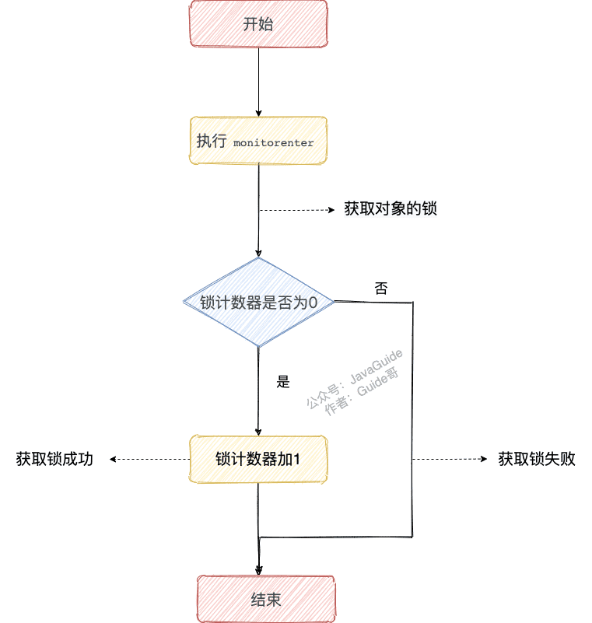

# 并发

## 进程和线程


多个线程共享进程的**堆和方法区** (JDK1.8 之后的元空间)源，但是每个线程有自己的**程序计数器、虚拟机栈 和 本地方法栈**。

总结：线程是进程划分成的更小的运行单位。线程和进程最大的不同在于基本上各进程是独立的，而各线程则不一定，因为同一进程中的线程极有可能会相互影响。线程执行开销小，但不利于资源的管理和保护；而进程正相反。

### 线程私有

-   程序计数器：**线程切换后能恢复到正确的执行位置**

-   虚拟机栈：每个 Java 方法在执行的同时会创建一个**栈帧**用于存储**局部变量表、操作数栈、常量池引用**等信息。从方法调用直至执行完成的过程，就对应着一个栈帧在 Java 虚拟机栈中入栈和出栈的过程。

-   本地方法栈：和虚拟机栈所发挥的作用非常相似，区别是： 虚拟机栈为虚拟机执行 Java 方法 （也就是字节码）服务，而本地方法栈则为虚拟机使用到的 **Native** 方法服务。在 HotSpot 虚拟机中和 Java 虚拟机栈合二为一。

    （一个Native Method就是一个java调用非java代码的接口）

    **保证线程中的局部变量不被别的线程访问到**

### 线程共有（进程）

堆和方法区是所有线程共享的资源，其中**堆**是进程中最大的一块内存，主要用于存放**新创建的对象** (几乎所有对象都在这里分配内存)，
**方法区**主要用于存放**已被加载的类信息、常量、静态变量、即时编译器编译后的代码**等数据。


## 说说并发与并行的区别?

-   **并发**：两个及两个以上的作业在同一 **时间段** 内执行。

-   **并行**：两个及两个以上的作业在同一 **时刻** 执行。

    

## 为什么要使用多线程呢?

-   线程可以比作是轻量级的进程，是程序执行的最小单位,线程间的切换和调度的成本远远小于进程。减少上下文切换。

-   多线程并发编程正是开发高并发系统的基础，利用好多线程机制可以大大提高系统整体的并发能力以及性能。

-   提高Java 进程利用系统资源的整体效率。

-   为了提高进程利用多核 CPU 的能力


## 使用多线程可能带来什么问题?

内存泄漏、死锁、线程不安全等等


## 说说线程的生命周期和状态?

Java 线程在运行的生命周期中的指定时刻只可能处于下面 6 种不同状态的其中一个状态


## 什么是上下文切换?

线程在执行过程中会有自己的运行条件和状态（也称上下文），比如上文所说到过的程序计数器，栈信息等。当出现如下情况的时候，线程会从占用 CPU 状态中退出。

-   主动让出 CPU，比如调用了 `sleep()`, `wait()` 等。
-   时间片用完，因为操作系统要防止一个线程或者进程长时间占用CPU导致其他线程或者进程饿死。
-   调用了阻塞类型的系统中断，比如请求 IO，线程被阻塞。
-   被终止或结束运行

这其中前三种都会发生线程切换，**线程切换意味着需要保存当前线程的上下文，留待线程下次占用 CPU 的时候恢复现场。并加载下一个将要占用 CPU 的线程上下文。**

上下文切换是现代操作系统的基本功能，因其每次需要保存信息恢复信息，这将会占用 CPU，内存等系统资源进行处理，也就意味着效率会有一定损耗，如果频繁切换就会造成整体效率低下


## 什么是线程死锁?如何避免死锁?

### 认识线程死锁

多个线程同时被阻塞，它们中的一个或者全部都在等待某个资源被释放。由于线程被无限期地阻塞，因此程序不可能正常终止

### 产生死锁的四个必要条件：

1.  互斥条件：该资源任意一个时刻只由一个线程占用。
2.  请求与保持条件：一个线程因请求资源而阻塞时，对已获得的资源保持不放。
3.  不剥夺条件:线程已获得的资源在未使用完之前不能被其他线程强行剥夺，只有自己使用完毕后才释放资源。
4.  循环等待条件:若干线程之间形成一种头尾相接的循环等待资源关系。

### 如何预防和避免线程死锁?

避免死锁就是在资源分配时，借助于算法（比如银行家算法）对资源分配进行计算评估，使其进入安全状态。


## 说说 sleep() 方法和 wait() 方法区别和共同点?

-   两者最主要的区别在于：**`sleep()` 方法没有释放锁，而 `wait()` 方法释放了锁** 。
-   两者都可以暂停线程的执行。
-   `wait()` 通常被用于线程间交互/通信，是object类；`sleep() `通常被用于暂停执行，属于thread类。
-   `wait()` 方法被调用后，线程不会自动苏醒，需要别的线程调用同一个对象上的 `notify() `或者 `notifyAll()` 方法。`sleep() `方法执行完成后，线程会自动苏醒。或者可以使用 `wait(long timeout)` 超时后线程会自动苏醒


## 为什么我们调用 start() 方法时会执行 run() 方法，为什么我们不能直接调用 run() 方法？

new 一个 Thread，线程进入了新建状态。调用 `start()`方法，会启动一个线程并使线程进入了**就绪状态**，当分配到时间片后就可以开始运行了。 **`start()` 会执行线程的相应准备工作**，然后自动执行 `run()` 方法的内容，这是真正的多线程工作。 但是，直接执行 `run()` 方法，会把 `run()` 方法当成一个 main 线程下的普通方法去执行，并不会在某个线程中执行它，所以这并不是多线程工作。

**总结： 调用 `start()` 方法方可启动线程并使线程进入就绪状态，直接执行 `run()` 方法的话不会以多线程的方式执行。**


## synchronized 关键字

### 说一说自己对于 synchronized 关键字的了解

**`synchronized` 关键字解决的是多个线程之间访问资源的同步性，`synchronized`关键字可以保证被它修饰的方法或者代码块在任意时刻只能有一个线程执行。**

另外，在 Java 早期版本中，`synchronized` 属于 **重量级锁**，效率低下。

**为什么呢？**

因为监视器锁（monitor）是依赖于底层的**操作系统**的 `Mutex Lock` 来实现的，**Java 的线程是映射到操作系统的原生线程之上的。如果要挂起或者唤醒一个线程，都需要操作系统帮忙完成，而操作系统实现线程之间的切换时需要从用户态转换到内核态**，这个状态之间的转换需要相对比较长的时间，时间成本相对较高。

庆幸的是在 Java 6 之后 Java 官方对从 JVM 层面对 `synchronized` 较大优化，所以现在的 `synchronized` 锁效率也**优化**得很不错了。JDK1.6 对锁的实现引入了大量的优化，如**自旋锁、适应性自旋锁、锁消除、锁粗化、偏向锁、轻量级锁**等技术来减少锁操作的开销。

所以，你会发现目前的话，不论是各种开源框架还是 JDK 源码都大量使用了 `synchronized` 关键字。


### 说说自己是怎么使用 synchronized 关键字

**synchronized 关键字最主要的三种使用方式：**

**1.修饰实例方法:** 作用于当前对象实例加锁，进入同步代码前要获得 **当前对象实例的锁**

```java
synchronized void method() {
    //业务代码
}
```

**2.修饰静态方法:** 也就是给当前类加锁，会作用于类的所有对象实例 ，进入同步代码前要获得 **当前 class 的锁**。因为静态成员不属于任何一个实例对象，是类成员（ *static 表明这是该类的一个静态资源，不管 new 了多少个对象，只有一份*）。所以，如果一个线程 A 调用一个实例对象的非静态 `synchronized` 方法，而线程 B 需要调用这个实例对象所属类的静态 `synchronized` 方法，是允许的，不会发生互斥现象，**因为访问静态 `synchronized` 方法占用的锁是当前类的锁，而访问非静态 `synchronized` 方法占用的锁是当前实例对象锁**。

```java
synchronized static void method() {
    //业务代码
}
```

**3.修饰代码块** ：指定加锁对象，对给定对象/类加锁。`synchronized(this|object)` 表示进入同步代码库前要获得**给定对象的锁**。`synchronized(类.class)` 表示进入同步代码前要获得 **当前 class 的锁**

```java
synchronized(this) {
    //业务代码
}
```

**总结：**

-   `synchronized` 关键字加到 `static` 静态方法和 `synchronized(class)` 代码块上都是是给 Class 类上锁。

-   `synchronized` 关键字加到实例方法上是给对象实例上锁。

-   尽量不要使用 `synchronized(String a)` 因为 JVM 中，字符串常量池具有缓存功能！

    

下面我以一个常见的面试题为例讲解一下 `synchronized` 关键字的具体使用。

面试中面试官经常会说：“单例模式了解吗？来给我手写一下！给我解释一下双重检验锁方式实现单例模式的原理呗！”

**双重校验锁实现对象单例（线程安全）**

对象单例：在应用整个生命周期内只能存在一个实例

```java
public class Singleton {

    private volatile static Singleton uniqueInstance;

    private Singleton() {
    }

    public  static Singleton getUniqueInstance() {
       //先判断对象是否已经实例过，没有实例化过才进入加锁代码
        if (uniqueInstance == null) {
            //类对象加锁
            synchronized (Singleton.class) {
                if (uniqueInstance == null) {
                    uniqueInstance = new Singleton();
                }
            }
        }
        return uniqueInstance;
    }
}
```

第一次判断是在Synchronized同步代码块外进行判断，由于单例模式只会创建一个实例，并通过getInstance方法返回[singleton](https://so.csdn.net/so/search?q=singleton&spm=1001.2101.3001.7020)对象，所以，**第一次判断，是为了在singleton对象已经创建的情况下，避免进入同步代码块，提升效率。**


第二次判断是为了避免以下情况的发生。
 (1)假设：线程A已经经过第一次判断，判断singleton=null，准备进入同步代码块.
 (2)此时线程B获得时间片，由于线程A并没有创建实例，所以，判断singleton仍然=null，所以线程B创建了实例singleton。
 (3)此时，线程A再次获得时间片，由于刚刚经过第一次判断singleton=null(不会重复判断)，进入同步代码块，这个时候，我们如果不加入第二次判断的话，那么线程A又会创造一个实例singleton，就不满足我们的单例模式的要求，所以第二次判断是很有必要的。

另外，需要注意 `uniqueInstance` 采用 `volatile` 关键字修饰也是很有必要。

`uniqueInstance` 采用 `volatile` 关键字修饰也是很有必要的， `uniqueInstance = new Singleton();` 这段代码其实是分为三步执行：

1.  为 `uniqueInstance` 分配内存空间
2.  初始化 `uniqueInstance`
3.  将 `uniqueInstance` 指向分配的内存地址

但是由于 JVM 具有指令重排的特性，执行顺序有可能变成 1->3->2。指令重排在单线程环境下不会出现问题，但是在多线程环境下会导致一个线程获得还没有初始化的实例。例如，线程 T1 执行了 1 和 3，此时 T2 调用 `getUniqueInstance`() 后发现 `uniqueInstance` 不为空，因此返回 `uniqueInstance`，但此时 `uniqueInstance` 还未被初始化。

**使用 `volatile` 可以禁止 JVM 的指令重排，保证在多线程环境下也能正常运行**。


### 构造方法可以使用 synchronized 关键字修饰么？

先说结论：**构造方法不能使用 synchronized 关键字修饰。**

构造方法本身就属于线程安全的，不存在同步的构造方法一说。


### 讲一下 synchronized 关键字的底层原理

**synchronized 关键字底层原理属于 JVM 层面。**

#### synchronized 同步语句块的情况

```java
public class SynchronizedDemo {
    public void method() {
        synchronized (this) {
            System.out.println("synchronized 代码块");
        }
    }
}
```

**`synchronized` 同步语句块的实现使用的是 `monitorenter` 和 `monitorexit` 指令，其中 `monitorenter` 指令指向同步代码块的开始位置，`monitorexit` 指令则指明同步代码块的结束位置。**

当执行 `monitorenter` 指令时，线程试图获取锁也就是获取 **对象监视器 `monitor`** 的持有权。

>   在 Java 虚拟机(HotSpot)中，Monitor 是基于 C++实现的。每个对象中都内置了一个 `ObjectMonitor`对象。
>
>   另外，`wait/notify`等方法也依赖于`monitor`对象，这就是为什么只有在同步的块或者方法中才能调用`wait/notify`等方法，否则会抛出`java.lang.IllegalMonitorStateException`的异常的原因。


在执行`monitorenter`时，会尝试获取对象的锁，如果锁的计数器为 0 则表示锁可以被获取，获取后将锁计数器设为 1 也就是加 1。



对象锁的的拥有者线程才可以执行 `monitorexit` 指令来释放锁。在执行 `monitorexit` 指令后，将锁计数器设为 0，表明锁被释放，其他线程可以尝试获取锁。


如果获取对象锁失败，那当前线程就要阻塞等待，直到锁被另外一个线程释放为止。


#### synchronized 修饰方法的的情况

```java
public class SynchronizedDemo2 {
    public synchronized void method() {
        System.out.println("synchronized 方法");
    }
}
```

`synchronized` 修饰的方法并没有 `monitorenter` 指令和 `monitorexit` 指令，取得代之的确实是 `ACC_SYNCHRONIZED` 标识，该标识指明了该方法是一个同步方法。JVM 通过该 `ACC_SYNCHRONIZED` 访问标志来辨别一个方法是否声明为同步方法，从而执行相应的同步调用。

如果是实例方法，JVM 会尝试获取实例对象的锁。如果是静态方法，JVM 会尝试获取当前 class 的锁


#### 总结

`synchronized` 同步语句块的实现使用的是 `monitorenter` 和 `monitorexit` 指令，其中 `monitorenter` 指令指向同步代码块的开始位置，`monitorexit` 指令则指明同步代码块的结束位置。

`synchronized` 修饰的方法并没有 `monitorenter` 指令和 `monitorexit` 指令，取得代之的确实是 `ACC_SYNCHRONIZED` 标识，该标识指明了该方法是一个同步方法。

**不过两者的本质都是对对象监视器 monitor 的获取。**


##  说说 JDK1.6 之后的 synchronized 关键字底层做了哪些优化，可以详细介绍一下这些优化吗

JDK1.6 对锁的实现引入了大量的优化，如偏向锁、轻量级锁、自旋锁、适应性自旋锁、锁消除、锁粗化等技术来减少锁操作的开销。

锁主要存在四种状态，依次是：无锁状态、偏向锁状态、轻量级锁状态、重量级锁状态，他们会随着竞争的激烈而逐渐升级。注意锁可以升级不可降级，这种策略是为了提高获得锁和释放锁的效率。

https://www.cnblogs.com/wuqinglong/p/9945618.html

### Java对象头（存储锁类型）

Mark Word 用于存储对象自身的运行时数据，如 HashCode、GC分代年龄、锁状态标志、线程持有的锁、偏向线程ID等等。

| 长度     | 内容     | 说明                         |
| -------- | -------- | ---------------------------- |
| 32/64bit | MarkWord | 存储对象的hashCode或锁信息等 |


### 优化后synchronized锁的分类

级别从低到高依次是：

1.  无锁状态
2.  偏向锁状态
3.  轻量级锁状态
4.  重量级锁状态

**锁可以升级，但不能降级。即：无锁 -> 偏向锁 -> 轻量级锁 -> 重量级锁是单向的。**

下面看一下每个锁状态时，对象头中的 MarkWord 这一个字节中的内容是什么。

以32位系统为例：

#### 无锁状态

| 25bit          | 4bit         | 1bit(是否是偏向锁) | 2bit(锁标志位) |
| -------------- | ------------ | ------------------ | -------------- |
| 对象的hashCode | 对象分代年龄 | 0                  | 01             |

这里的 hashCode 是 Object#hashCode 或者 System#identityHashCode 计算出来的值，不是用户覆盖产生的 hashCode。

#### 偏向锁状

| 23bit  | 2bit  | 4bit         | 1bit | 2bit |
| ------ | ----- | ------------ | ---- | ---- |
| 线程ID | epoch | 对象分代年龄 | 1    | 01   |

这里 线程ID 和 epoch 占用了 hashCode 的位置，所以，如果对象如果计算过 identityHashCode  后，便无法进入偏向锁状态，反过来，如果对象处于偏向锁状态，并且需要计算其 identityHashCode  的话，则偏向锁会被撤销，升级为重量级锁。

epoch：

对于偏向锁，如果 线程ID = 0 表示未加锁。

什么时候会计算 HashCode 呢？比如：将对象作为 Map 的 Key 时会自动触发计算，List  就不会计算，日常创建一个对象，持久化到库里，进行 json 序列化，或者作为临时对象等，这些情况下，并不会触发计算  hashCode，所以大部分情况不会触发计算 hashCode。

Identity hash code是未被覆写的 java.lang.Object.hashCode() 或者 java.lang.System.identityHashCode(Object) 所返回的值。

#### 轻量级锁状

| 30bit                  | 2bit |
| ---------------------- | ---- |
| 指向线程栈锁记录的指针 | 00   |

这里指向栈帧中的 Lock Record 记录，里面当然可以记录对象的 identityHashCode。

它仅仅使用 CAS 进行操作，实现获取锁。

####  重量级锁状态

| 30bit              | 2bit |
| ------------------ | ---- |
| 指向锁监视器的指针 | 10   |

这里指向了内存中对象的 ObjectMonitor 对象，而 ObectMontitor 对象可以存储对象的 identityHashCode 的值。

### 锁的升级

#### 偏向锁

偏向锁是针对于一个线程而言的，线程获得锁之后就不会再有解锁等操作了，这样可以省略很多开销。假如有两个线程来竞争该锁话，那么偏向锁就失效了，进而升级成轻量级锁了。

>   为什么要这样做呢？因为经验表明，其实大部分情况下，都会是同一个线程进入同一块同步代码块的。这也是为什么会有偏向锁出现的原因。

如果支持偏向锁（没有计算 hashCode），那么在分配对象时，分配一个可偏向而未偏向的对象（MarkWord的最后 3 位为 101，并且 Thread Id 字段的值为 0）。


-   **偏向锁的加锁**

1.  偏向锁标志是未偏向状态，使用 CAS 将 MarkWord 中的线程ID设置为自己的线程ID，
    1.  如果成功，则获取偏向锁成功。
    2.  如果失败，则进行锁升级。
2.  偏向锁标志是已偏向状态
    1.  MarkWord 中的线程 ID 是自己的线程 ID，成功获取锁
    2.  MarkWord 中的线程 ID 不是自己的线程 ID，需要进行锁升级

偏向锁的锁升级需要进行偏向锁的撤销。


-   **偏向锁的撤销**

1.  对象是不可偏向状态
    1.  不需要撤销
2.  对象是可偏向状态
    1.  MarkWord 中指向的线程不存活
        1.  允许重偏向：退回到可偏向但未偏向的状态
        2.  不允许重偏向：变为无锁状态
    2.  MarkWord 中的线程存活
        1.  线程ID指向的线程仍然拥有锁
            1.  升级为轻量级锁，将 mark word 复制到线程栈中
        2.  不再拥有锁
            1.  允许重偏向：退回到可偏向但未偏向的状态
            2.  不允许重偏向：变为无锁状态

**小结：** 撤销偏向的操作需要在全局检查点执行。我们假设线程A曾经拥有锁（不确定是否释放锁）， 线程B来竞争锁对象，如果当线程A不在拥有锁时或者死亡时，线程B直接去尝试获得锁（根据是否 允许重偏向（`rebiasing`），获得偏向锁或者轻量级锁）；如果线程A仍然拥有锁，那么锁 升级为轻量级锁，线程B自旋请求获得锁。


#### 轻量级锁

之所以是轻量级，是因为它仅仅使用 CAS 进行操作，实现获取锁。

-   加锁流程

如果线程发现对象头中Mark Word已经存在指向自己栈帧的指针，即线程已经获得轻量级锁，那么只需要将0存储在自己的栈帧中（此过程称为递归加锁）；在解锁的时候，如果发现锁记录的内容为0， 那么只需要移除栈帧中的锁记录即可，而不需要更新Mark Word。

加锁前：


加锁后：


线程尝试使用 CAS 将对象头中的 Mark Word 替换为指向锁记录（`Lock Record`）的指针，  如上图所示。如果成功，当前线程获得轻量级锁，如果失败，虚拟机先检查当前对象头的 Mark Word  是否指向当前线程的栈帧，如果指向，则说明当前线程已经拥有这个对象的锁，则可以直接进入同步块  执行操作，否则表示其他线程竞争锁，当前线程便尝试使用自旋来获取锁。当竞争线程的自旋次数 达到界限值（`threshold`），轻量级锁将会膨胀为重量级锁。


-   撤销流程

轻量级锁解锁时，如果对象的Mark Word仍然指向着线程的锁记录，会使用CAS操作， 将Dispalced Mark Word替换到对象头，如果成功，则表示没有竞争发生。如果失败， 表示当前锁存在锁竞争，锁就会膨胀为重量级锁。

#### 重量级锁

重量级锁（`heavy weight lock`），是使用操作系统互斥量（`mutex`）来实现的传统锁。 当所有对锁的优化都失效时，将退回到重量级锁。它与轻量级锁不同竞争的线程不再通过自旋来竞争线程， 而是直接进入堵塞状态，此时不消耗CPU，然后等拥有锁的线程释放锁后，唤醒堵塞的线程， 然后线程再次竞争锁。但是注意，当锁膨胀（`inflate`）为重量锁时，就不能再退回到轻量级锁。


#### 总结

偏向锁适合一个线程对一个锁的多次获取的情况; 

轻量级锁适合锁执行体比较简单(即减少锁粒度或时间), 自旋一会儿就可以成功获取锁的情况


## 谈谈 synchronized 和 ReentrantLock 的区别

### 两者都是可重入锁

**“可重入锁”**  指的是自己可以再次获取自己的内部锁。比如一个线程获得了某个对象的锁，此时这个对象锁还没有释放，当其再次想要获取这个对象的锁的时候还是可以获取的，如果是不可重入锁的话，就会造成死锁。同一个线程每次获取锁，锁的计数器都自增 1，所以要等到锁的计数器下降为 0 时才能释放锁。

### synchronized 依赖于 JVM 而 ReentrantLock 依赖于 API

`synchronized` 是依赖于 JVM 实现的，前面我们也讲到了 虚拟机团队在 JDK1.6 为 `synchronized` 关键字进行了很多优化，但是这些优化都是在虚拟机层面实现的，并没有直接暴露给我们。`ReentrantLock` 是 **JDK 层**面实现的（也就是 API 层面，需要 lock() 和 unlock() 方法配合 try/finally 语句块来完成），所以我们可以通过查看它的源代码，来看它是如何实现的。

### ReentrantLock 比 synchronized 增加了一些高级功能

相比`synchronized`，`ReentrantLock`增加了一些高级功能。主要来说主要有三点：

-   **等待可中断** : `ReentrantLock`提供了一种能够中断等待锁的线程的机制，通过 `lock.lockInterruptibly()` 来实现这个机制。也就是说正在等待的线程可以选择放弃等待，改为处理其他事情。
-   **可实现公平锁** : `ReentrantLock`可以指定是公平锁还是非公平锁。而`synchronized`只能是非公平锁。所谓的公平锁就是先等待的线程先获得锁。`ReentrantLock`默认情况是非公平的，可以通过 `ReentrantLock`类的`ReentrantLock(boolean fair)`构造方法来制定是否是公平的。
-   **可实现选择性通知（锁可以绑定多个条件）**: `synchronized`关键字与`wait()`和`notify()`/`notifyAll()`方法相结合可以实现等待/通知机制。`ReentrantLock`类当然也可以实现，但是需要借助于`Condition`接口与`newCondition()`方法。


## volatile 关键字

**CPU Cache 缓存的是内存数据用于解决 CPU 处理速度和内存不匹配的问题，内存缓存的是硬盘数据用于解决硬盘访问速度过慢的问题。**

### JMM(Java 内存模型)

Java 内存模型抽象了线程和主内存之间的关系，就比如说线程之间的共享变量必须存储在主内存中。Java 内存模型主要目的是为了屏蔽系统和硬件的差异，避免一套代码在不同的平台下产生的效果不一致。

>   -   **主内存** ：所有线程创建的实例对象都存放在主内存中，不管该实例对象是成员变量还是方法中的本地变量(也称局部变量)
>   -   **本地内存** ：每个线程都有一个私有的本地内存来存储共享变量的副本，并且，每个线程只能访问自己的本地内存，无法访问其他线程的本地内存。本地内存是 JMM 抽象出来的一个概念，存储了主内存中的共享变量副本


当前的 Java 内存模型下，线程可以把变量保存**本地内存**（比如机器的寄存器）中，而不是直接在主存中进行读写。这就可能造成一个线程在主存中修改了一个变量的值，而另外一个线程还继续使用它在寄存器中的变量值的拷贝，造成**数据的不一致**。

要解决这个问题，就需要把变量声明为 `volatile` 关键字,该关键字除了防止 JVM 的指令重排 ，还有一个重要的作用就是保证变量的可见性。


## 并发编程的三个重要特性

1.  **原子性** : 一次操作或者多次操作，要么所有的操作全部都得到执行并且不会受到任何因素的干扰而中断，要么都不执行。`synchronized` 可以保证代码片段的原子性。
2.  **可见性** ：当一个线程对共享变量进行了修改，那么另外的线程都是立即可以看到修改后的最新值。`volatile` 关键字可以保证共享变量的可见性。
3.  **有序性** ：代码在执行的过程中的先后顺序，Java 在编译器以及运行期间的优化，代码的执行顺序未必就是编写代码时候的顺序。`volatile` 关键字可以禁止指令进行重排序优化


## 说说 synchronized 关键字和 volatile 关键字的区别

`synchronized` 关键字和 `volatile` 关键字是两个互补的存在，而不是对立的存在！

-   **`volatile` 关键字**是线程同步的**轻量级实现**，所以 **`volatile `性能肯定比`synchronized`关键字要好** 。但是 **`volatile` 关键字只能用于变量而 `synchronized` 关键字可以修饰方法以及代码块** 。
-   **`volatile` 关键字能保证数据的可见性，但不能保证数据的原子性。`synchronized` 关键字两者都能保证。**
-   **`volatile`关键字主要用于解决变量在多个线程之间的可见性，而 `synchronized` 关键字解决的是多个线程之间访问资源的同步性**


## 执行 execute()方法和 submit()方法的区别是什么呢？

1.  **`execute()`方法用于提交不需要返回值的任务，所以无法判断任务是否被线程池执行成功与否；**
2.  **`submit()`方法用于提交需要返回值的任务。线程池会返回一个 `Future` 类型的对象，通过这个 `Future` 对象可以判断任务是否执行成功**，并且可以通过 `Future` 的 `get()`方法来获取返回值，`get()`方法会阻塞当前线程直到任务完成，而使用 `get(long timeout，TimeUnit unit)`方法则会阻塞当前线程一段时间后立即返回，这时候有可能任务没有执行完。


## Atomic 原子类

### 介绍一下 Atomic 原子类

`Atomic` 翻译成中文是原子的意思。在我们这里 Atomic 是指一个操作是不可中断的。即使是在多个线程一起执行的时候，一个操作一旦开始，就不会被其他线程干扰。

**AtomicInteger 类的使用示例**

使用 AtomicInteger 之后，不用对 increment() 方法加锁也可以保证线程安全。

```java
class AtomicIntegerTest {
    private AtomicInteger count = new AtomicInteger();
    //使用AtomicInteger之后，不需要对该方法加锁，也可以实现线程安全。
    public void increment() {
        count.incrementAndGet();
    }

    public int getCount() {
        return count.get();
    }
}
```


### 简单介绍一下 AtomicInteger 类的原理

AtomicInteger 线程安全原理简单分析

```java
// setup to use Unsafe.compareAndSwapInt for updates（更新操作时提供“比较并替换”的作用）
private static final Unsafe unsafe = Unsafe.getUnsafe();
private static final long valueOffset;

static {
    try {
        valueOffset = unsafe.objectFieldOffset
            (AtomicInteger.class.getDeclaredField("value"));
    } catch (Exception ex) { throw new Error(ex); }
}

private volatile int value;
```

AtomicInteger 类主要利用 CAS (compare and swap) + volatile 和 native 方法来保证原子操作，从而避免 synchronized 的高开销，执行效率大为提升。

CAS 的原理是拿期望的值和原本的一个值作比较，如果相同则更新成新的值。UnSafe 类的 objectFieldOffset()  方法是一个本地方法，这个方法是用来拿到“原来的值”的内存地址，返回值是 valueOffset。另外 value 是一个 volatile  变量，在内存中可见，因此 JVM 可以保证任何时刻任何线程总能拿到该变量的最新值。


## 线程池

**使用线程池的好处**：

-   **降低资源消耗**。通过重复利用已创建的线程降低线程创建和销毁造成的消耗。
-   **提高响应速度**。当任务到达时，任务可以不需要等到线程创建就能立即执行。
-   **提高线程的可管理性**。线程是稀缺资源，如果无限制的创建，不仅会消耗系统资源，还会降低系统的稳定性，使用线程池可以进行统一的分配，调优和监控。


### Executor 框架

#### 简介

`Executor` 框架是 Java5 之后引进的，在 Java 5 之后，通过 `Executor` 来启动线程比使用 `Thread` 的 `start` 方法更好，除了更易管理，效率更好（用线程池实现，节约开销）外，还有关键的一点：有助于避免 this 逃逸问题。

>   补充：this 逃逸是指在构造函数返回之前其他线程就持有该对象的引用. 调用尚未构造完全的对象的方法可能引发令人疑惑的错误。

`Executor` 框架不仅包括了线程池的管理，还提供了线程工厂、队列以及拒绝策略等，`Executor` 框架让并发编程变得更加简单
