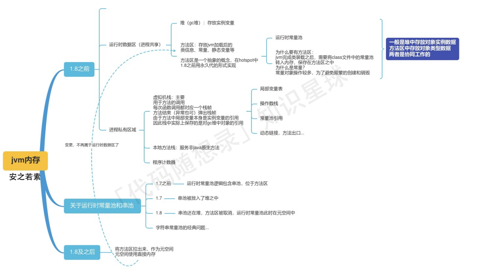

# JAVA内存区域详解

## 运行时数据区域

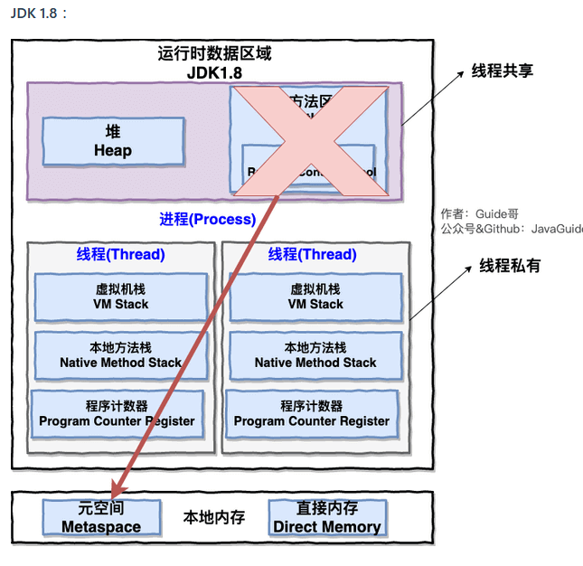

### 线程私有

-   程序计数器：**线程切换后能恢复到正确的执行位置**

-   虚拟机栈：每个 Java 方法在执行的同时会创建一个**栈帧**用于存储**局部变量表、操作数栈、常量池引用**等信息。从方法调用直至执行完成的过程，就对应着一个栈帧在 Java 虚拟机栈中入栈和出栈的过程。

-   本地方法栈：和虚拟机栈所发挥的作用非常相似，区别是： 虚拟机栈为虚拟机执行 Java 方法 （也就是字节码）服务，而本地方法栈则为虚拟机使用到的 **Native** 方法服务。在 HotSpot 虚拟机中和 Java 虚拟机栈合二为一。

    （一个Native Method就是一个java调用非java代码的接口）

    **保证线程中的局部变量不被别的线程访问到**

### 线程共有（进程）

堆和方法区是所有线程共享的资源，其中**堆**是进程中最大的一块内存，主要用于存放**新创建的对象** (几乎所有对象都在这里分配内存)，
**方法区**主要用于存放**已被加载的类信息、常量、静态变量、即时编译器编译后的代码**等数据。


### 线程私有

#### 虚拟机栈

每个 Java 方法在执行的同时会创建一个**栈帧**用于存储**局部变量表、操作数栈、常量池引用，动态链接，方法返回地址**等信息。从方法调用直至执行完成的过程，就对应着一个栈帧在 Java 虚拟机栈中入栈和出栈的过程（先进后出）。

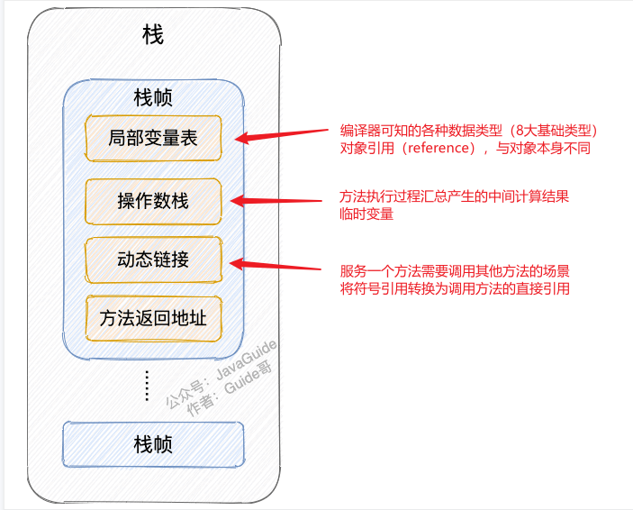


**局部变量表**  主要存放了编译期可知的各种数据类型（boolean、byte、char、short、int、float、long、double）、对象引用（reference 类型，它不同于对象本身，可能是一个指向对象起始地址的引用指针，也可能是指向一个代表对象的句柄或其他与此对象相关的位置）。

**操作数栈** 主要作为方法调用的中转站使用，用于存放方法执行过程中产生的中间计算结果。另外，计算过程中产生的临时变量也会放在操作数栈中。

**动态链接** 主要服务一个方法需要调用其他方法的场景。**在 Java 源文件被编译成字节码文件时，所有的变量和方法引用都作为符号引用（Symbilic  Reference）保存在 Class  文件的常量池【方法区】里**。**当一个方法要调用其他方法，需要将常量池中指向方法的符号引用转化为其在内存地址中的直接引用**。动态链接的作用就是为了将符号引用转换为调用方法的直接引用。


简单总结一下程序运行中栈可能会出现两种错误：

-   **`StackOverFlowError`：** 若栈的内存大小**不允许动态扩展**，那么当线程请求栈的深度超过当前 Java 虚拟机栈的最大深度的时候，就抛出 `StackOverFlowError` 错误。
-   **`OutOfMemoryError`：** 如果栈的内存大小**可以动态扩展**， 如果虚拟机在动态扩展栈时无法申请到足够的内存空间，则抛出`OutOfMemoryError`异常。


**虚拟机栈的生命周期**

对于栈来说，不存在垃圾回收。只要程序运行结束，栈的空间自然就会释放了。栈的生命周期和所处的线程是一致的。

这里补充一句：8种基本类型的变量+对象的引用变量+实例方法都是在栈里面分配内存


我们经常说的栈帧数据，说白了在JVM中叫栈帧，放到Java中其实就是方法，它也是存放在栈中的。


#### 本地方法栈

native方法：调用其他语言方法的接口

和虚拟机栈所发挥的作用非常相似，区别是： **虚拟机栈为虚拟机执行 Java 方法 （也就是字节码）服务，而本地方法栈则为虚拟机使用到的 Native 方法服务。** 在 HotSpot 虚拟机中和 Java 虚拟机栈合二为一。


#### 程序计数器

作用：

-   **字节码解释器**工作时通过改变这个计数器的值来选取下一条需要执行的**字节码指令**，从而实现代码的流程控制，如：顺序执行、选择、循环、异常处理。
-   在多线程的情况下，程序计数器用于记录当前线程执行的位置，从而当线程被切换回来的时候能够知道该线程上次运行到哪儿了。

⚠️ 注意 ：程序计数器是唯一一个不会出现 `OutOfMemoryError` 的内存区域，它的生命周期随着线程的创建而创建，随着线程的结束而死亡。


### 线程共享（进程）

#### 堆

**唯一目的就是存放对象实例，几乎所有的对象实例以及数组都在这里分配内存。**

Java 堆是垃圾收集器管理的主要区域，因此也被称作 **GC 堆（Garbage Collected Heap）**.

在 JDK 7 版本及 JDK 7 版本之前，**堆内存**被通常分为下面三部分：

1.  新生代内存(Young Generation)
2.  老生代(Old Generation)
3.  永久代(Permanent Generation)

下图所示的 Eden 区、两个 Survivor 区 S0 和 S1 都属于新生代，中间一层属于老年代，最下面一层属于永久代。**JDK 8 版本之后 PermGen(永久) 已被 Metaspace(元空间) 取代，元空间使用的是直接内存** 

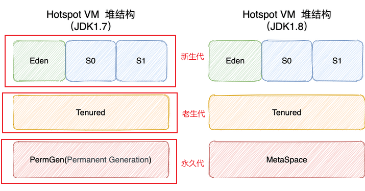

>   大部分情况，对象都会首先在 Eden 区域分配，在一次新生代垃圾回收后，如果对象还存活，则会进入 S0 或者 S1，并且对象的年龄还会加  1(Eden 区->Survivor 区后对象的初始年龄变为 1)，当它的年龄增加到一定程度（默认为 15  岁），就会被晋升到老年代中。对象晋升到老年代的年龄阈值，可以通过参数 `-XX:MaxTenuringThreshold` 来设置


堆这里最容易出现的就是 `OutOfMemoryError` 错误，并且出现这种错误之后的表现形式还会有几种，比如：

1.  **`java.lang.OutOfMemoryError: GC Overhead Limit Exceeded`** ： 当 JVM 花太多时间执行垃圾回收并且只能回收很少的堆空间时，就会发生此错误。
2.  **`java.lang.OutOfMemoryError: Java heap space`** :假如在创建新的对象时, 堆内存中的空间不足以存放新创建的对象, 就会引发此错误。(和配置的最大堆内存有关，且受制于物理内存大小。最大堆内存可通过`-Xmx`参数配置，若没有特别配置，将会使用默认值，


#### 方法区（元空间）

当虚拟机要使用一个类时，它需要读取并解析 Class 文件获取相关信息，再将信息存入到方法区。方法区会存储已被虚拟机加载的 **类信息、字段信息、方法信息、常量、静态变量、即时编译器编译后的代码缓存等数据**。

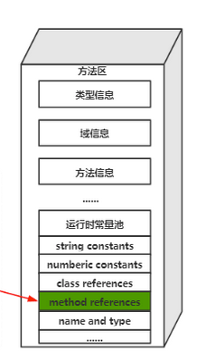

方法区和堆


##### 运行时常量池

编译期生成的各种字面量（Literal）和符号引用（Symbolic Reference）。

字面量包括整数、浮点数和字符串字面量；

符号引用包括类符号引用、字段符号引用、方法符号引用和接口方法符号引用。

常量池表会在**类加载后**存放到方法区的运行时常量池中。

当常量池无法再申请到内存时会抛出 `OutOfMemoryError` 错误


##### 字符串常量池

**字符串常量池** 是 JVM 为了提升性能和减少内存消耗针对字符串（String 类）专门开辟的一块区域，主要目的是为了避免字符串的重复创建。

**字符串常量池：存储的是字面量"abc"和创建的字符串对象的引用(堆中的字符串对象)之间的映射**

**堆：存放对象**

```java
// 在堆中创建字符串对象”ab“
// 将字符串对象”ab“的引用保存在字符串常量池中
String aa = "ab";
// 直接返回字符串常量池中字符串对象”ab“的引用
String bb = "ab";
System.out.println(aa==bb);// true


//
String aa = new String("abc")
//使用这种方式一共会创建两个字符串对象（前提是 String Pool 中还没有 "abc" 字符串对象）。
//"abc" 属于字符串字面量，因此编译时期会在String Pool中创建一个字符串对象，指向这个 "abc" 字符串字面量；
//还会在堆中创建一个字符串对象
```


#####  **为什么要将字符串常量池移动到堆中？**

在 Java 7 之前，String Pool 被放在运行时常量池中，它属于永久代。而在**Java 7，String Pool 被移到堆中**。这是因为永久代的空间有限，在大量使用字符串的场景下会导致 OutOfMemoryError 错误。


##### **方法区和永久代以及元空间是什么关系呢？**

**方法区: 永久代 or 元空间**。永久代（ JDK 1.8 之前）以及元空间（ JDK 1.8 之后）是 HotSpot  虚拟机对虚拟机规范中方法区的两种实现方式。

类似接口和类的关系。

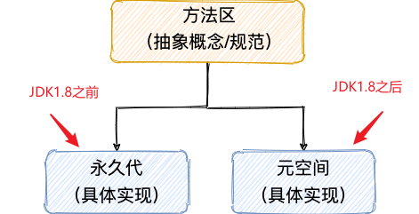


##### **为什么要将永久代 (PermGen) 替换为元空间 (MetaSpace) 呢?**

-   整个永久代有一个 JVM 本身设置的固定大小上限，无法进行调整，而元空间使用的是直接内存，受本机可用内存的限制，虽然元空间仍旧可能溢出，但是比原来出现的几率会更小。

    >   可以使用 `-XX：MaxMetaspaceSize` 标志设置最大元空间大小，默认值为 unlimited，这意味着它只受系统内存的限制。`-XX：MetaspaceSize` 调整标志定义元空间的初始大小如果未指定此标志，则 Metaspace 将根据运行时的应用程序需求动态地重新调整大小。

-   元空间里面存放的是类的元数据，这样加载多少类的元数据就不由 `MaxPermSize` 控制了, 而由系统的实际可用空间来控制，这样能加载的类就更多了。

-   在 JDK8，合并 HotSpot 和 JRockit 的代码时, JRockit 从来没有一个叫永久代的东西, 合并之后就没有必要额外的设置这么一个永久代的地方了。


##### **方法区常用参数有哪些？**

永久代：

```java
-XX:PermSize=N //方法区 (永久代) 初始大小
-XX:MaxPermSize=N //方法区 (永久代) 最大大小,超过这个值将会抛出 OutOfMemoryError 异常:java.lang.OutOfMemoryError: PermGen
```

元空间：

```java
-XX:MetaspaceSize=N //设置 Metaspace 的初始（和最小大小）
-XX:MaxMetaspaceSize=N //设置 Metaspace 的最大大小
```


#### 直接内存

直接内存并不是虚拟机运行时数据区的一部分，也不是虚拟机规范中定义的内存区域，但是这部分内存也被频繁地使用。而且也可能导OutOfMemoryError 错误出现。

来源于 **NIO(New Input/Output)** ，通过存在堆中的DirectByteBuffer操作Native内存。

引入了一种基于通道（Channel）与缓存区（Buffer）的 I/O 方式，它可以直接使用 Native 函数库直接分配堆外内存，然后通过一个存储在 Java 堆中的 DirectByteBuffer 对象作为这块内存的引用进行操作。这样就能在一些场景中显著提高性能，因为避免了在 Java 堆和 Native 堆之间来回复制数据。

>   缺点：
>
>   -   分配回收成本较高
>   -   不受JVM内存回收管理
>   -   直接内存大小可以设置，不设置默认与堆最大值一致。


## HotSpot 虚拟机对象 

下面我们来详细的了解一下 HotSpot 虚拟机在 Java 堆中对象分配、布局和访问的全过程。


### 对象的创建

1.   **类加载器检查**

     遇到new，先去常量池中查找这个类的符号引用。

     ​	如果能找到，则检查这个类是否被加载，解析，初始化；

     ​	如果找不到，则执行类加载。

     

2.   **分配内存**

     分配方式有 **“指针碰撞”** 和 **“空闲列表”** 两种，选择哪种分配方式由 Java 堆是否规整决定，而 Java 堆是否规整又由所采用的**垃圾收集器是否带有压缩整理功能**决定。

     

     **内存分配的两种方式**

     -   指针碰撞 ： 
         -   适用场合 ：堆内存规整（即没有内存碎片）的情况下。
         -   原理 ：用过的内存全部**整合到一边**，没有用过的内存放在另一边，中间有一个分界指针，只需要向着没用过的内存方向将该指针移动对象内存大小位置即可。
         -   使用该分配方式的 GC 收集器：Serial, ParNew
     -   空闲列表 ： 
         -   适用场合 ： 堆内存不规整的情况下。
         -   原理 ：虚拟机会维护一个列表，该列表中会记录**哪些内存块是可用的**，在分配的时候，找一块儿足够大的内存块儿来划分给对象实例，最后更新列表记录。
         -   使用该分配方式的 GC 收集器：CMS

     **内存分配并发问题**

     虚拟机采用两种方式来保证线程安全：

     -   **CAS+失败重试：** CAS 是乐观锁的一种实现方式。所谓乐观锁就是，每次不加锁而是假设没有冲突而去完成某项操作，如果因为冲突失败就重试，直到成功为止。**虚拟机采用 CAS 配上失败重试的方式保证更新操作的原子性。**

     -   **TLAB：** 为每一个线程预先在 Eden 区分配一块儿内存，JVM 在给线程中的对象分配内存时，首先在 TLAB 分配，当对象大于 TLAB 中的剩余内存或 TLAB 的内存已用尽时，再采用上述的 CAS 进行内存分配

         

3.   **初始化零值**

     虚拟机需要将分配到的内存空间都初始化为零值（不包括对象头）,保证了对象的实例字段在 Java 代码中可以不赋初始值就直接使用

     

4.   **设置对象头**

     对象头存储：这个对象是哪个类的实例、如何才能找到类的元数据信息、对象的哈希码、对象的 GC 分代年龄等信息。 另外，根据虚拟机当前运行状态的不同，如是否启用偏向锁等，对象头会有不同的设置方式

     

5.   **执行init方法**

     从虚拟机的视角来看，一个新的对象已经产生了，但从 Java 程序的视角来看，对象创建才刚开始，`<init>` 方法还没有执行，所有的字段都还为零。执行 new 指令之后会接着执行 `<init>` 方法，把对象按照程序员的意愿进行初始化。

​	

### 对象的内存布局

对象在内存中的布局可以分为 3 块区域：**对象头**、**实例数据**和**对齐填充**。

对象头：

-   存储对象自身的运行时数据**（哈希码、GC 分代年龄、锁状态标志等等）**

-   存储**类型指针**，即对象指向它的类元数据的指针，虚拟机通过这个指针来确定这个对象是哪个类的实例。

实例数据：

-   **对象真正存储的有效信息**，也是在程序中所定义的各种类型的字段内容。

对齐填充：

-   对齐填充部分不是必然存在的，也没有什么特别的含义，仅仅起占位作用。 因为 Hotspot 虚拟机的自动内存管理系统要求对象起始地址必须是 8 字节的整数倍，换句话说就是对象的大小必须是 8 字节的整数倍


### 对象访问定位

 Java 程序通过栈上的 reference 数据来操作堆上的具体对象。对象的访问方式由虚拟机实现而定，目前主流的访问方式有：**使用句柄**、**直接指针**。

#### 句柄

如果使用句柄的话，那么 Java 堆中将会划分出一块内存来作为句柄池，reference 中存储的就是对象的**句柄地址**，而句柄中包含了**对象实例数据**与**类型数据**各自的具体地址信息。

>   对象实例数据：对象中各个实例字段的数据
>
>   对象类型数据：对象的类型、父类、实现的接口、方法等

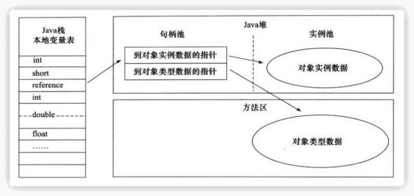

#### 直接指针

如果使用直接指针访问，那么 Java 堆对象的布局中就必须考虑如何放置访问类型数据的相关信息，而 reference 中存储的直接就是**对象的地址**。

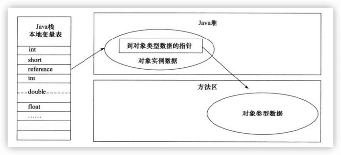

这两种对象访问方式各有优势。使用句柄来访问的最大好处是 reference  中存储的是稳定的句柄地址，在对象被移动时只会改变句柄中的实例数据指针，而 reference  本身不需要修改。使用直接指针访问方式最大的好处就是速度快，它节省了一次指针定位的时间开销。


# JVM垃圾回收详解

https://blog.csdn.net/weixin_42615068/article/details/102813947


## 分配与回收基础

Java 堆是垃圾收集器管理的主要区域，因此也被称作**GC 堆（Garbage Collected Heap）**。从垃圾回收的角度，由于现在收集器基本都采用分代垃圾收集算法，所以 Java 堆还可以细分为：新生代和老年代：再细致一点有：Eden 空间、From Survivor、To Survivor 空间等。**进一步划分的目的是更好地回收内存，或者更快地分配内存。**

**堆空间的基本结构**：

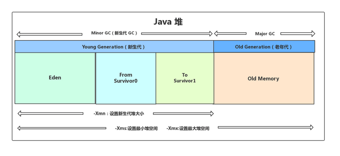

永久代被移到了元空间中。


**分配：**

对象都会首先在 Eden 区域分配，在一次新生代垃圾回收后，如果对象还存活，则会进入 s0 或者 s1，并且对象的年龄还会加 1(Eden  区->Survivor 区后对象的初始年龄变为 1)，当它的年龄增加到一定程度（默认为大于 15 岁），就会被晋升到老年代中。对象晋升到老年代的年龄阈值，可以通过参数 -XX:MaxTenuringThreshold 来设置。经过这次GC后，Eden区和"From"区已经被清空。这个时候，“From"和"To"会交换他们的角色，也就是新的"To"就是上次GC前的“From”，新的"From"就是上次GC前的"To”。不管怎样，都会保证名为To的Survivor区域是空的。Minor GC会一直重复这样的过程，直到“To”区被填满，"To"区被填满之后，会将所有对象移动到年老代中。


**新生代 GC（Minor GC）**：

**触发条件：**

此时如果新生的对象无法在 Eden 区创建（Eden 区无法容纳) 就会触发一次Young GC (Minor GC)。

**过程：**

1.   eden存活的对象放入s0，age加1，其他回收；
2.   当Eden 和 s0区空间满了，会将 S0 区与Eden  区活跃的对象，复制到 S1 区，age 加1
3.   将S0区域和 Eden  区的对象给清空，其他回收
4.   并且将S0 区 和 S1区交换，保证名为S1 的 Survivor 区域是空的，存活的对象年龄加1，其他区域被清空（循环）

**补充：**

Minor GC 会一直重复这样的过程，在这个过程中，有可能当次 Minor GC 后，Survivor  的"From"区域空间不够用，有一些还达不到进入老年代条件的实例放不下，则放不下的部分会提前进入老年代。

**停止-复制（Stop-and-copy）清理法**：经过一次GC和复制，一个Survivor中保存着当前还活着的对象，而Eden区和另一个Survivor区的内容都不再需要了，可以直接清空。

随着MinorGC一次又一次的进行，不断会有新的对象被promote到老年代。最终，MajorGC将会在老年代发生，老年代的空间将会被清除和压缩(标记-清除或者标记整理)。

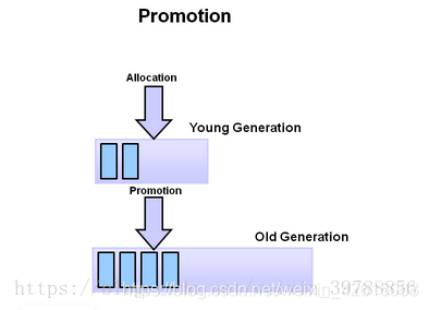


**老年代 GC（Major GC/Full GC）:**

指发生在老年代的 GC，出现了 Major GC 经常会伴随至少一次的 Minor GC（并非绝对），Major GC 的速度一般会比 Minor GC 的慢 10 倍以上。

**触发条件：**

（1）调用System.gc时，系统建议执行Full GC，但是不必然执行
（2）老年代空间不足
（3）方法去空间不足
（4）通过Minor GC后进入老年代的平均大小大于老年代的可用内存
（5）由Eden区、From Space区向To Space区复制时，对象大小大于To Space可用内存，则把该对象转存到老年代，且老年代的可用内存小于该对象大小

老年代：标记-整理等


**对象的堆分配过程：**

1.  对于一个大对象，我们会首先在Eden 尝试创建，如果创建不了，就会触发Minor GC 
2.  随后继续尝试在Eden区存放，发现仍然放不下
3.  尝试直接进入老年代，老年代也放不下
4.  触发 Major GC 清理老年代的空间
5.  放的下 成功
6.  放不下 OOM

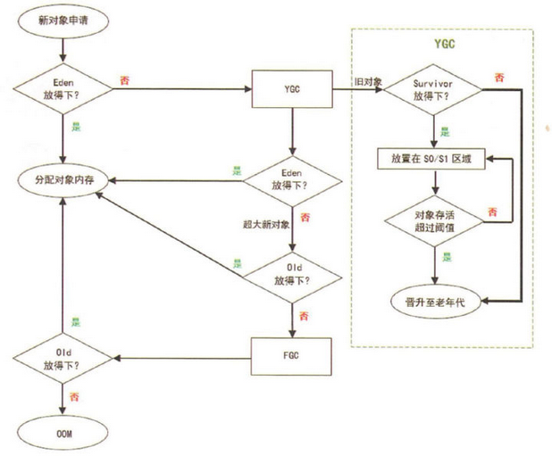


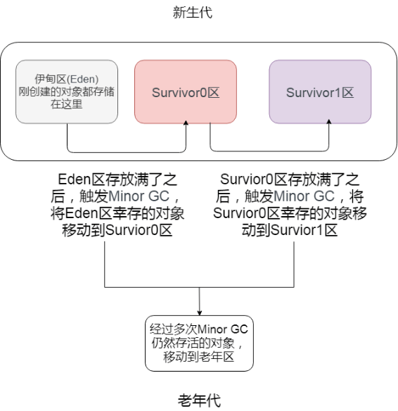


### 对象优先在eden区分配

大多数情况下，对象在新生代中 eden 区分配。当 eden 区没有足够空间进行分配时，虚拟机将发起一次 Minor GC.

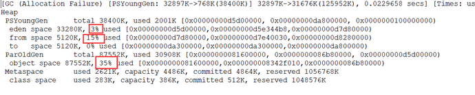

因为给 allocation2 分配内存的时候 eden 区内存几乎已经被分配完了，我们刚刚讲了当 Eden  区没有足够空间进行分配时，虚拟机将发起一次 Minor GC.GC 期间虚拟机又发现 allocation1 无法存入 Survivor  空间，所以只好通过 **分配担保机制** 把新生代的对象提前转移到老年代中去，老年代上的空间足够存放 allocation1，所以不会出现 Full GC。执行 Minor GC 后，后面分配的对象如果能够存在 eden 区的话，还是会在 eden 区分配内存。


### 大对象直接进入老年代

大对象就是需要大量连续内存空间的对象（比如：字符串、数组）。

**为什么要这样呢？**

为了避免为大对象分配内存时由于分配担保机制带来的复制而降低效率


### 长期存活的对象将进入老年代

如果对象在 Eden 出生并经过第一次 Minor GC 后仍然能够存活，并且能被 Survivor 容纳的话，将被移动到 Survivor  空间中，并将对象年龄设为 1.对象在 Survivor 中每熬过一次 MinorGC,年龄就增加 1 岁，当它的年龄增加到一定程度（默认为 15 岁），就会被晋升到老年代中。对象晋升到老年代的年龄阈值，可以通过参数 `-XX:MaxTenuringThreshold` 来设置。


### 空间分配担保机制

空间分配担保是为了确保在 Minor GC 之前老年代本身还有容纳新生代所有对象的剩余空间。

要老年代的连续空间大于新生代对象总大小或者历次晋升的平均大小，就会进行 Minor GC，否则将进行 Full GC


## 判断对象死亡

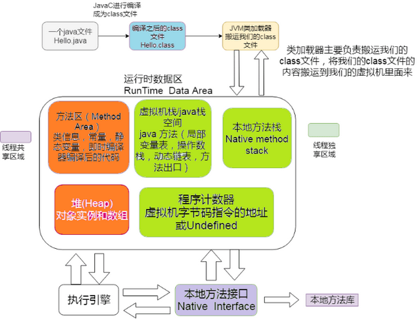


图中程序计数器、虚拟机栈、本地方法栈，3个区域随着线程的生存而生存的。内存分配和回收都是确定的。随着线程的结束内存自然就被回收了，因此不需要考虑垃圾回收的问题。而Java堆和方法区则不一样，各线程共享，内存的分配和回收都是动态的。因此垃圾收集器所关注的都是堆和方法这部分内存。


堆中几乎放着所有的对象实例，对堆垃圾回收前的第一步就是要判断哪些对象已经死亡（即不能再被任何途径使用的对象）

### 引用计数法

给对象中添加一个引用计数器，每当有一个地方引用它，计数器就加 1；当引用失效，计数器就减 1；任何时候计数器为 0 的对象就是不可能再被使用的。

**这个方法实现简单，效率高，但是目前主流的虚拟机中并没有选择这个算法来管理内存，其最主要的原因是它很难解决对象之间相互循环引用的问题。** 所谓对象之间的相互引用问题，如下面代码所示：除了对象 objA 和 objB 相互引用着对方之外，这两个对象之间再无任何引用。但是他们因为互相引用对方，导致它们的引用计数器都不为 0，于是引用计数算法无法通知 GC 回收器回收他们。

```java
public class ReferenceCountingGc {
    Object instance = null;
	public static void main(String[] args) {
		ReferenceCountingGc objA = new ReferenceCountingGc();
		ReferenceCountingGc objB = new ReferenceCountingGc();
		objA.instance = objB;
		objB.instance = objA;
		objA = null;
		objB = null;

	}
}
```


### 可达性分析算法

这个算法的基本思想就是通过一系列的称为 **“GC Roots”** 的对象作为起点，从这些节点开始向下搜索，**节点所走过的路径称为引用链**，当一个对象到 GC Roots 没有任何引用链相连的话，则证明此对象是不可用的，需要被回收。

下图中的 `Object 6 ~ Object 10` 之间虽有引用关系，但它们到 GC Roots 不可达，因此为需要被回收的对象。

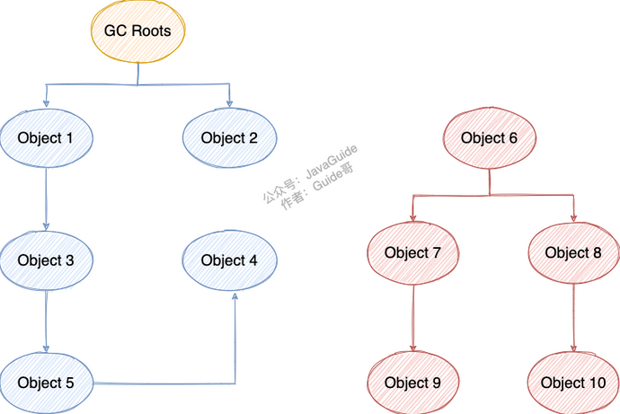

**哪些对象可以作为 GC Roots 呢？**（仅了解）

-   虚拟机栈(栈帧中的本地变量表)中引用的对象

-   本地方法栈(Native 方法)中引用的对象

-   方法区中类静态属性引用的对象

-   方法区中常量引用的对象

-   所有被同步锁持有的对象

    

这种方法的优点是能够解决循环引用的问题，可它的实现需要耗费大量资源和时间，也需要GC（它的分析过程引用关系不能发生变化，所以需要停止所有进程）


**对象可以被回收，就代表一定会被回收吗？**

即使在可达性分析法中不可达的对象，也并非是“非死不可”的，这时候它们暂时处于“缓刑阶段”，要真正宣告一个对象死亡，至少要经历**两次标记**过程；

1.   可达性分析法中不可达的对象被第一次标记并且进行一次筛选，筛选的条件是此对象是否有必要执行 `finalize` 方法。如果对象有必要执行finalize()方法，则被放入F-Queue队列中。

>   当对象没有覆盖 `finalize` 方法，或 `finalize` 方法已经被虚拟机调用过时，虚拟机将这两种情况视为没有必要执行。

2.   被判定为需要执行的对象将会被放在一个队列中进行第二次标记，如果对象在finalize()方法中重新与引用链上的任何一个对象建立了关联，那么二次标记时则会将它移出“即将回收”集合。如果此时对象还没成功逃脱，那么只能被回收了。

>   `Object` 类中的 `finalize` 方法一直被认为是一个糟糕的设计，成为了 Java 语言的负担，影响了 Java 语言的安全和 GC 的性能。JDK9 版本及后续版本中各个类中的 `finalize` 方法会被逐渐弃用移除。finalize()是Object类的一个方法、一个对象的finalize()方法只会被系统自动调用一次，经过finalize()方法逃脱死亡的对象，第二次不会再调用。


### 引用

无论是通过引用计数法判断对象引用数量，还是通过可达性分析法判断对象的引用链是否可达，判定对象的存活都与“引用”有关。

JDK1.2 之前，Java 中引用的定义很传统：如果 reference 类型的数据存储的数值代表的是**另一块内存的起始地址**，就称这块内存代表一个引用。

JDK1.2 以后，Java 对引用的概念进行了扩充，将引用分为强引用、软引用、弱引用、虚引用四种

4种引用强度从高到低：强引用 -> 软引用 -> 弱引用 -> 虚引用


**1．强引用（StrongReference）**

一般指的是对像被new出来，强引用一般不会被JVM收回，Java 虚拟机宁愿抛出 OutOfMemoryError 错误，使程序异常终止，也不会靠随意回收具有强引用的对象来解决内存不足问题。

```java
Object obj = new Object();
```

**2．软引用（SoftReference）**

**如果内存空间足够，垃圾回收器就不会回收它，如果内存空间不足了，就会回收这些对象的内存。只要垃圾回收器没有回收它，该对象就可以被程序使用**。软引用可用来实现内存敏感的临时缓存。

```java
SoftReference<String> ref = new SoftReference<String>("hong");
```

**3．弱引用（WeakReference）**

弱引用与软引用的区别在于：**只具有弱引用的对象拥有更短暂的生命周期。在垃圾回收器线程扫描它所管辖的内存区域的过程中，一旦发现了只具有弱引用的对象，不管当前内存空间足够与否，都会回收它的内存**。不过，由于垃圾回收器是一个优先级很低的线程， 因此不一定会很快发现那些只具有弱引用的对象。

```java
Obejct oj = new Object(); 
WeakReference<Obejct> wf = new WeakReference<Obejct>(oj); 
oj = null; 
System.gc(); //下面会发现有时候直接返回null;wf.get();
```

**4．虚引用（PhantomReference）**

"虚引用"顾名思义，就是形同虚设，与其他几种引用都不同，虚引用并不会决定对象的生命周期。如果一个对象仅持有虚引用，那么它就和没有任何引用一样，在任何时候都可能被垃圾回收。

**虚引用主要用来跟踪对象被垃圾回收的活动**。

**虚引用与软引用和弱引用的一个区别在于：**  虚引用必须和引用队列（ReferenceQueue）联合使用。当垃圾回收器准备回收一个对象时，如果发现它还有虚引用，就会在回收对象的内存之前，把这个虚引用加入到与之关联的引用队列中。程序可以通过判断引用队列中是否已经加入了虚引用，来了解被引用的对象是否将要被垃圾回收。程序如果发现某个虚引用已经被加入到引用队列，那么就可以在所引用的对象的内存被回收之前采取必要的行动。

```java
// 虚引用
Object oj= new Object();
ReferenceQueue req= new ReferenceQueue();
PhantomReference<Object> pr= new PhantomReference<Object>(oj, req);
// 每次返回Null
System.out.println(pr.get());
//返回是否被删除
System.out.println(pr.isEnqueued());
```

特别注意，在程序设计中一般很少使用弱引用与虚引用，使用软引用的情况较多，这是因为**软引用可以加速 JVM 对垃圾内存的回收速度，可以维护系统的运行安全，防止内存溢出（OutOfMemory）等问题的产生**


### 如何判断一个常量是废弃常量？

运行时常量池主要回收的是废弃的常量。那么，我们如何判断一个常量是废弃常量呢？

假如在字符串常量池中存在字符串 "abc"，如果当前没有任何 String 对象引用该字符串常量的话，就说明常量 "abc" 就是废弃常量，如果这时发生内存回收的话而且有必要的话，"abc" 就会被系统清理出常量池了。


### 如何判断一个类是无用的类

方法区主要回收的是无用的类，那么如何判断一个类是无用的类的呢？

类需要同时满足下面 3 个条件才能算是 **“无用的类”** ：

-   该类所有的实例都已经被回收，也就是 Java 堆中不存在该类的任何实例。
-   加载该类的 `ClassLoader` 已经被回收。
-   该类对应的 `java.lang.Class` 对象没有在任何地方被引用，无法在任何地方通过反射访问该类的方法。

虚拟机可以对满足上述 3 个条件的无用类进行回收，这里说的仅仅是“可以”，而并不是和对象一样不使用了就会必然被回收。


## 垃圾收集算法

### 标记-清除算法

该算法分为“标记”和“清除”阶段：首先标记出所有不需要回收的对象，在标记完成后统一回收掉所有没有被标记的对象。它是最基础的收集算法，后续的算法都是对其不足进行改进得到。这种垃圾收集算法会带来两个明显的问题：

1.  **效率问题**
2.  **空间问题（标记清除后会产生大量不连续的碎片）**

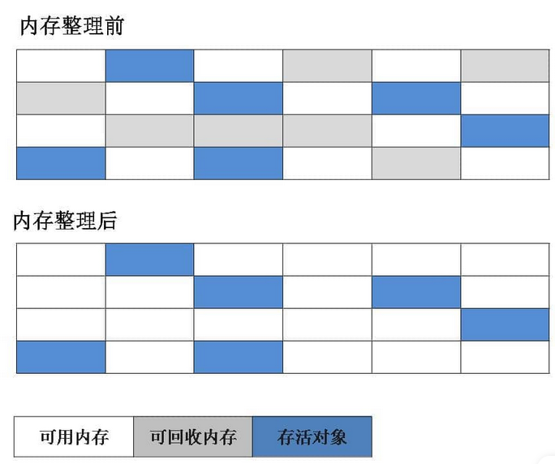


### 标记-复制算法

为了解决效率问题，“标记-复制”收集算法出现了。它可以将内存分为大小相同的两块，每次使用其中的一块。当这一块的内存使用完后，就将还存活的对象复制到另一块去，然后再把使用的空间一次清理掉。这样就使每次的内存回收都是对内存区间的一半进行回收。

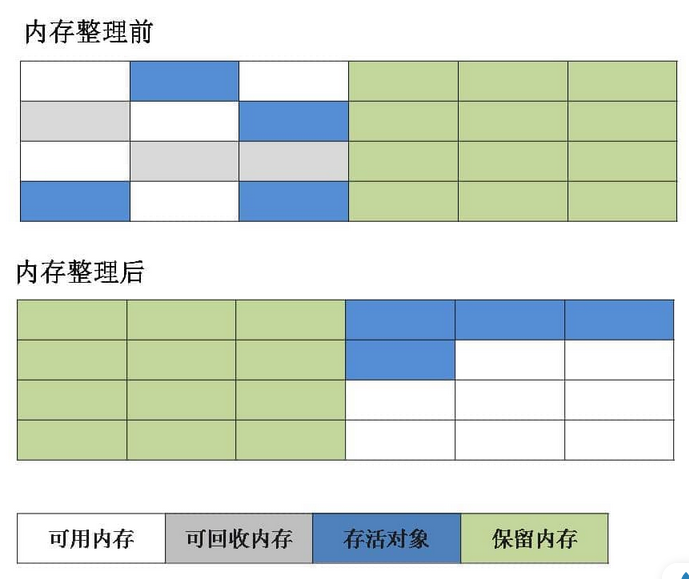

应该就是Minor GC的机制把

这个算法的代价就是把内存缩水了，这样堆内存的使用效率就会变得十分低下了

不过它们分配的时候也不是按照1:1这样进行分配的，就类似于Eden和Survivor也不是等价分配是一个道理


### 标记-整理算法

根据老年代的特点提出的一种标记算法，标记过程仍然与“标记-清除”算法一样，但后续步骤不是直接对可回收对象回收，而是让所有存活的对象向一端移动，然后直接清理掉端边界以外的内存


### 分代收集算法

当前虚拟机的垃圾收集都采用分代收集算法，这种算法没有什么新的思想，只是根据对象存活周期的不同将内存分为几块。一般将 java 堆分为新生代和老年代，这样我们就可以根据各个年代的特点选择合适的垃圾收集算法。

**比如在新生代中，每次收集都会有大量对象死去，所以可以选择”标记-复制“算法，只需要付出少量对象的复制成本就可以完成每次垃圾收集。而老年代的对象存活几率是比较高的，而且没有额外的空间对它进行分配担保，所以我们必须选择“标记-清除”或“标记-整理”算法进行垃圾收集。**

**延伸面试问题：** HotSpot 为什么要分为新生代和老年代？

根据上面的对分代收集算法的介绍回答。


## 垃圾收集器

**如果说收集算法是内存回收的方法论，那么垃圾收集器就是内存回收的具体实现。**

虽然我们对各个收集器进行比较，但并非要挑选出一个最好的收集器。因为直到现在为止还没有最好的垃圾收集器出现，更加没有万能的垃圾收集器，**我们能做的就是根据具体应用场景选择适合自己的垃圾收集器**。试想一下：如果有一种四海之内、任何场景下都适用的完美收集器存在，那么我们的 HotSpot 虚拟机就不会实现那么多不同的垃圾收集器了。

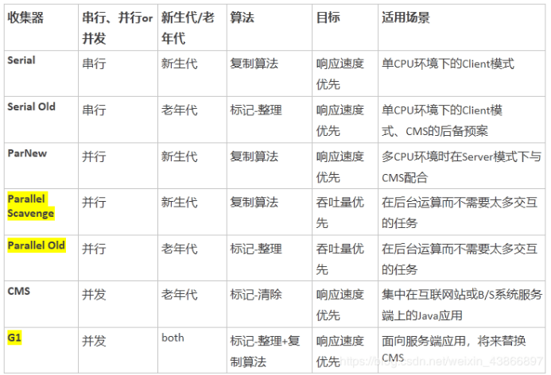

到jdk8为止，默认的垃圾收集器是Parallel Scavenge 和 Parallel Old

从jdk9开始，G1收集器成为默认的垃圾收集器  目前来看，G1回收器停顿时间最短而且没有明显缺点，非常适合Web应用。在jdk8中测试Web应用，堆内存6G，新生代4.5G的情况下，Parallel Scavenge 回收新生代停顿长达1.5秒。G1回收器回收同样大小的新生代只停顿0.2秒


### Serial 收集器

Serial（串行）收集器是最基本、历史最悠久的垃圾收集器了。大家看名字就知道这个收集器是一个单线程收集器了。它的 **“单线程”** 的意义不仅仅意味着它只会使用一条垃圾收集线程去完成垃圾收集工作，更重要的是它在进行垃圾收集工作的时候必须暂停其他所有的工作线程（ **"Stop The World"** ），直到它收集结束。

**新生代采用标记-复制算法，老年代采用标记-整理算法**

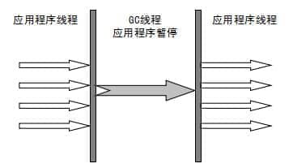

虚拟机的设计者们当然知道 Stop The World 带来的不良用户体验，所以在后续的垃圾收集器设计中停顿时间在不断缩短（仍然还有停顿，寻找最优秀的垃圾收集器的过程仍然在继续）。

但是 Serial 收集器有没有优于其他垃圾收集器的地方呢？当然有，它**简单而高效（与其他收集器的单线程相比）**。Serial 收集器由于**没有线程交互的开销**，自然可以获得很高的单线程收集效率。Serial 收集器对于运行在 Client 模式下的虚拟机来说是个不错的选择

### ParNew 收集器

**ParNew 收集器其实就是 Serial 收集器的多线程版本，除了使用多线程进行垃圾收集外，其余行为（控制参数、收集算法、回收策略等等）和 Serial 收集器完全一样。**

**新生代采用标记-复制算法，老年代采用标记-整理算法。**

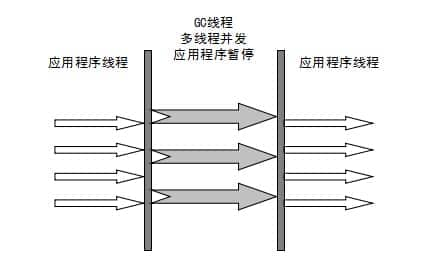

它是许多运行在 **Server 模式**下的虚拟机的首要选择，除了 Serial 收集器外，只有它能与 CMS 收集器（真正意义上的并发收集器，后面会介绍到）配合工作。


**并行和并发概念补充：**

-   **并行（Parallel）** ：指多条垃圾收集线程并行工作，但此时**用户线程仍然处于等待状态**。

-   **并发（Concurrent）**：指**用户线程与垃圾收集线程同时执行**（但不一定是并行，可能会交替执行），用户程序在继续运行，而垃圾收集器运行在另一个 CPU 上

    

###  Parallel Scavenge 收集器

Parallel Scavenge 收集器也是使用**标记-复制算法的多线程收集器**，它看上去几乎和 ParNew 都一样。 **那么它有什么特别之处呢？**

```java
-XX:+UseParallelGC

    使用 Parallel 收集器+ 老年代串行

-XX:+UseParallelOldGC

    使用 Parallel 收集器+ 老年代并行
```

**Parallel Scavenge 收集器关注点是吞吐量（高效率的利用 CPU）。CMS 等垃圾收集器的关注点更多的是用户线程的停顿时间（提高用户体验）。所谓吞吐量就是 CPU 中用于运行用户代码的时间与 CPU 总消耗时间的比值。** Parallel Scavenge  收集器提供了很多参数供用户找到最合适的停顿时间或最大吞吐量，如果对于收集器运作不太了解，手工优化存在困难的时候，使用 Parallel  Scavenge 收集器配合自适应调节策略，把内存管理优化交给虚拟机去完成也是一个不错的选择。

**新生代采用标记-复制算法，老年代采用标记-整理算法**


**这是 JDK1.8 默认收集器**


### Serial Old 收集器

**Serial 收集器的老年代版本**，它同样是一个单线程收集器。它主要有两大用途：一种用途是在 JDK1.5 以及以前的版本中与 Parallel Scavenge 收集器搭配使用，另一种用途是作为 CMS 收集器的后备方案


### Parallel Old 收集器

**Parallel Scavenge 收集器的老年代版本**。使用多线程和“标记-整理”算法。在注重**吞吐量以及 CPU 资源**的场合，都可以优先考虑 Parallel Scavenge 收集器和 Parallel Old 收集


### CMS 收集器

**CMS（Concurrent Mark Sweep）收集器是一种以获取最短回收停顿时间为目标的收集器。它非常符合在注重用户体验的应用上使用。**

**CMS（Concurrent Mark Sweep）收集器是 HotSpot 虚拟机第一款真正意义上的并发收集器，它第一次实现了让垃圾收集线程与用户线程（基本上）同时工作。**

从名字中的**Mark Sweep**这两个词可以看出，CMS 收集器是一种 **“标记-清除”算法**实现的，它的运作过程相比于前面几种垃圾收集器来说更加复杂一些。整个过程分为四个步骤：

-   **初始标记：** 暂停所有的其他线程，并记录下直接与 root 相连的对象，速度很快 ；
-   **并发标记：** 同时开启 GC 和用户线程，用一个闭包结构去记录可达对象。但在这个阶段结束，这个闭包结构并不能保证包含当前所有的可达对象。因为用户线程可能会不断的更新引用域，所以 GC 线程无法保证可达性分析的实时性。所以这个算法里会跟踪记录这些发生引用更新的地方。
-   **重新标记：** 重新标记阶段就是为了修正并发标记期间因为用户程序继续运行而导致标记产生变动的那一部分对象的标记记录，这个阶段的停顿时间一般会比初始标记阶段的时间稍长，远远比并发标记阶段时间短
-   **并发清除：** 开启用户线程，同时 GC 线程开始对未标记的区域做清扫

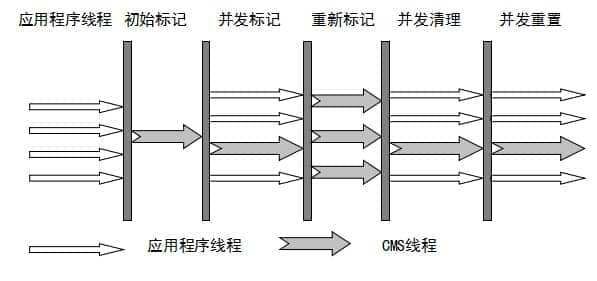

主要优点：**并发收集、低停顿**。但是它有下面三个明显的缺点：

-   **对 CPU 资源敏感；**
-   **无法处理浮动垃圾；**
-   **它使用的回收算法-“标记-清除”算法会导致收集结束时会有大量空间碎片产生**


### G1 收集器

**G1 (Garbage-First) 是一款面向服务器的垃圾收集器,主要针对配备多颗处理器及大容量内存的机器. 以极高概率满足 GC 停顿时间要求的同时,还具备高吞吐量性能特征.**

**所有的Region大小相同**，且**在JVM生命周期内不会被改变**。

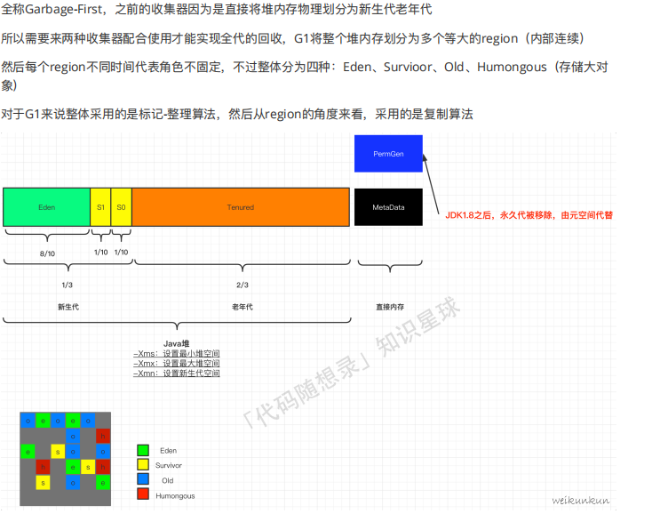

被视为 JDK1.7 中 HotSpot 虚拟机的一个重要进化特征。它具备以下特点：

-   **并行与并发**：G1 能充分利用 CPU、多核环境下的硬件优势，使用多个 CPU（CPU 或者 CPU 核心）来缩短 Stop-The-World  停顿时间。部分其他收集器原本需要停顿 Java 线程执行的 GC 动作，G1 收集器仍然可以通过并发的方式让 java 程序继续执行。
-   **分代收集**：虽然 G1 可以不需要其他收集器配合就能独立管理整个 GC 堆，但是还是保留了分代的概念。
-   **空间整合**：与 CMS 的“标记-清理”算法不同，G1 从整体来看是基于“标记-整理”算法实现的收集器；从局部上来看是基于“标记-复制”算法实现的。
-   **可预测的停顿**：这是 G1 相对于 CMS 的另一个大优势，降低停顿时间是 G1 和 CMS 共同的关注点，但 G1 除了追求低停顿外，还能建立可预测的停顿时间模型，能让使用者明确指定在一个长度为 M 毫秒的时间片段内。

G1 收集器的运作大致分为以下几个步骤：

-   **初始标记**

    标记从根节点直接可达的对象。这个阶段是STW的,并且会触发一次年轻代GC

    触发stw(stop the world),也就是停止用户进程

-   **并发标记**

    和用户进程并发执行，标记所有回收对象.在整个堆中进行并发标记(和应用程序并发执行),此过程可能被young GC中断。在并发标记阶段,**若发现区域对象中的所有对象都是垃圾,那这个区域会被立即回收**。同时,**并发标记过程中,会计算每个区域的对象活性**(区域中**存活对象的比例**)。

-   **最终标记**

    处理并发标记后新产生的对象

    触发stw

-   **筛选回收**

    对region回收价值排序，选择性回收region

    回收是采用标记复制，多条收集器线程并发执行

    不追求一次处理完

    触发stw

**G1 收集器在后台维护了一个优先列表，每次根据允许的收集时间，优先选择回收价值最大的 Region(这也就是它的名字 Garbage-First 的由来)** 。这种使用 Region 划分内存空间以及有优先级的区域回收方式，保证了 G1 收集器在有限时间内可以尽可能高的收集效率（把内存化整为零）。


### ZGC 收集器

与 CMS 中的 ParNew 和 G1 类似，ZGC 也采用标记-复制算法，不过 ZGC 对该算法做了重大改进。

在 ZGC 中出现 Stop The World 的情况会更少！


## 常见面试题

-   如何判断对象是否死亡（两种方法）。
-   简单的介绍一下强引用、软引用、弱引用、虚引用（虚引用与软引用和弱引用的区别、使用软引用能带来的好处）。
-   如何判断一个常量是废弃常量
-   如何判断一个类是无用的类
-   垃圾收集有哪些算法，各自的特点？
-   HotSpot 为什么要分为新生代和老年代？
-   常见的垃圾回收器有哪些？
-   介绍一下 CMS,G1 收集器。
-   Minor Gc 和 Full GC 有什么不同呢？


# 类加载过程

## 类的生命周期

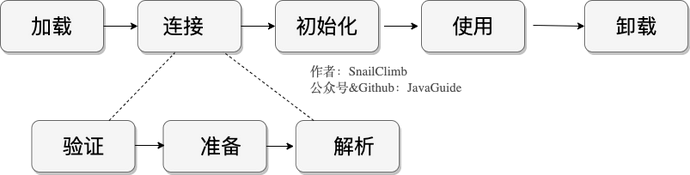

## 类加载过程详解

Class 文件需要加载到虚拟机中之后才能运行和使用，那么虚拟机是如何加载这些 Class 文件呢？

系统加载 Class 类型的文件主要三步：**加载->连接->初始化**。连接过程又可分为三步：**验证->准备->解析**。

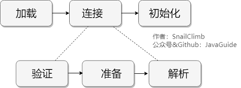

### 加载

1.  通过全类名获取定义此类的二进制字节流
2.  将字节流所代表的静态存储结构转换为方法区的运行时数据结构
3.  在内存中生成一个代表该类的 `Class` 对象，作为方法区这些数据的访问入口

虚拟机规范上面这 3 点并不具体，因此是非常灵活的。比如："通过全类名获取定义此类的二进制字节流" 并没有指明具体从哪里获取、怎样获取。比如：比较常见的就是从 `ZIP` 包中读取（日后出现的 `JAR`、`EAR`、`WAR` 格式的基础）、其他文件生成（典型应用就是 `JSP`）等等。

**一个非数组类的加载阶段（加载阶段获取类的二进制字节流的动作）是可控性最强的阶段，这一步我们可以去完成还可以自定义类加载器去控制字节流的获取方式（重写一个类加载器的 `loadClass()` 方法）。数组类型不通过类加载器创建，它由 Java 虚拟机直接创建。**

类加载器、双亲委派模型也是非常重要的知识点，这部分内容会在后面的文章中单独介绍到。

所有的类都由类加载器加载，加载的作用就是将 `.class`文件加载到内存

加载阶段和连接阶段的部分内容是交叉进行的，加载阶段尚未结束，连接阶段可能就已经开始了。

### 连接

#### 验证

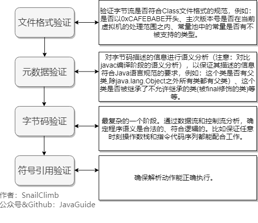

#### 准备

**准备阶段是正式为类变量分配内存并设置类变量初始值的阶段**

这些内存都将在方法区中分配。对于该阶段有以下几点需要注意：

1.  这时候进行内存分配的仅包括类变量（ Class Variables ，即静态变量，被 `static` 关键字修饰的变量，只与类相关，因此被称为类变量），而不包括实例变量。实例变量会在对象实例化时随着对象一块分配在 Java 堆中。
2.  从概念上讲，类变量所使用的内存都应当在 **方法区** 中进行分配。不过HotSpot 已经把原本放在永久代的字符串常量池、静态变量等移动到堆中，这个时候类变量则会随着 Class 对象一起存放在 Java 堆中。

这里所设置的初始值"通常情况"下是数据类型默认的零值（如 0、0L、null、false 等），比如我们定义了`public static int value=111` ，那么 value 变量在准备阶段的初始值就是 0 而不是 111（初始化阶段才会赋值）。特殊情况：比如给 value 变量加上了 final 关键字`public static final int value=111` ，那么准备阶段 value 的值就被赋值为 111。


#### 解析

解析阶段是**虚拟机将常量池内的符号引用替换为直接引用的过程**。解析动作主要针对类或接口、字段、类方法、接口方法、方法类型、方法句柄和调用限定符 7 类符号引用进行。

符号引用就是一组符号来描述目标，可以是任何字面量。**直接引用**就是直接指向目标的指针、相对偏移量或一个间接定位到目标的句柄。在程序实际运行时，只有符号引用是不够的，举个例子：在程序执行方法时，系统需要明确知道这个方法所在的位置。Java  虚拟机为每个类都准备了一张方法表来存放类中所有的方法。当需要调用一个类的方法的时候，只要知道这个方法在方法表中的偏移量就可以直接调用该方法了。通过解析操作符号引用就可以直接转变为目标方法在类中方法表的位置，从而使得方法可以被调用。

综上，解析阶段是虚拟机将常量池内的符号引用替换为直接引用的过程，也就是得到类或者字段、方法在内存中的指针或者偏移量。


### 初始化

初始化阶段是执行**初始化方法`<clinit> ()`方法**的过程，是类加载的最后一步，这一步 JVM 才开始真正执行类中定义的 Java 程序代码(字节码)。

>   说明： `<clinit> ()`方法是编译之后自动生成的。

对于`<clinit> ()` 方法的调用，虚拟机会自己确保其在多线程环境中的安全性。因为 `<clinit> ()` 方法是**带锁线程安全**，所以在多线程环境下进行类初始化的话可能会引起多个进程阻塞，并且这种阻塞很难被发现。

对于初始化阶段，虚拟机严格规范了有且只有 5 种情况下，必须对类进行初始化(只有主动去使用类才会初始化类)：

1.  当遇到 `new` 、 `getstatic`、`putstatic` 或 `invokestatic` 这 4 条直接码指令时，比如 `new` 一个类，读取一个静态字段(未被 final 修饰)、或调用一个类的静态方法时。 

    -   当 jvm 执行 `new` 指令时会初始化类。即当程序创建一个**类的实例对象**。
    -   当 jvm 执行 `getstatic` 指令时会初始化类。即程序访问类的**静态变量**(不是静态常量，常量会被加载到运行时常量池)。
    -   当 jvm 执行 `putstatic` 指令时会初始化类。即程序给类的**静态变量赋值**。
-   当 jvm 执行 `invokestatic` 指令时会初始化类。即程序调用类的**静态方法**。
2.  使用 `java.lang.reflect` 包的方法对类进行**反射调用**时如 `Class.forname("...")`, `newInstance()` 等等。如果类没初始化，需要触发其初始化。
3.  初始化一个类，如果其父类还未初始化，则先触发该父类的初始化。
4.  当虚拟机启动时，用户需要定义一个要执行的主类 (包含 `main` 方法的那个类)，虚拟机会先初始化这个类。
5.  `MethodHandle` 和 `VarHandle` 可以看作是轻量级的反射调用机制，而要想使用这 2 个调用， 就必须先使用 `findStaticVarHandle` 来初始化要调用的类。
6.  当一个接口中定义了 JDK8 新加入的默认方法（被 default 关键字修饰的接口方法）时，如果有这个接口的实现类发生了初始化，那该接口要在其之前被初始化。


## 卸载

卸载类即该类的 Class 对象被 GC。

卸载类需要满足 3 个要求:

1.  该类的所有的实例对象都已被 GC，也就是说堆不存在该类的实例对象。
2.  该类没有在其他任何地方被引用
3.  该类的类加载器的实例已被 GC

所以，在 JVM 生命周期内，由 jvm 自带的类加载器加载的类是不会被卸载的。但是由我们自定义的类加载器加载的类是可能被卸载的。

只要想通一点就好了，jdk 自带的 `BootstrapClassLoader`, `ExtClassLoader`, `AppClassLoader` 负责加载 jdk 提供的类，所以它们(类加载器的实例)肯定不会被回收。而我们自定义的类加载器的实例是可以被回收的，所以使用我们自定义加载器加载的类是可以被卸载掉的。


# 类加载器详解

## 回顾类加载过程

类加载过程：**加载->连接->初始化**。连接过程又可分为三步：**验证->准备->解析**

一个非数组类的加载阶段（加载阶段获取类的二进制字节流的动作）是可控性最强的阶段，这一步我们可以去自定义类加载器去控制字节流的获取方式（重写一个类加载器的 `loadClass()` 方法）。**数组类型不通过类加载器创建，它由 Java 虚拟机直接创建。**

所有的类都由类加载器加载，**加载的作用就是将 `.class`文件加载到内存**


## 类加载器总结

### 作用

ClassLoader负责通过各种方式将Class信息的二进制数据流读入JVM内部，转换为一个于目标类对应的java.lang.Class对象实例。


### 分类

-   **BootstrapClassLoader(启动类加载器)** ：最顶层的加载类，由 C++实现，负责加载 `%JAVA_HOME%/lib`目录下的 jar 包和类或者被 `-Xbootclasspath`参数指定的路径中的所有类。

-   **ExtensionClassLoader(扩展类加载器)** ：主要负责加载 `%JRE_HOME%/lib/ext` 目录下的 jar 包和类，或被 `java.ext.dirs` 系统变量所指定的路径下的 jar 包。

-   **AppClassLoader(系统类加载器)** ：面向我们用户的加载器，负责加载当前应用 classpath 下的所有 jar 包和类

    

## 双亲委派模型

### 双亲委派模型介绍

即在类加载的时候，系统会首先判断当前类是否被加载过。已经被加载的类会直接返回，否则才会尝试加载。加载的时候，首先会把该请求委派给父类加载器的 `loadClass()` 处理，因此所有的请求最终都应该传送到顶层的启动类加载器 `BootstrapClassLoader` 中。当父类加载器无法处理时，才由自己来处理。当父类加载器为 null 时，会使用启动类加载器 `BootstrapClassLoader` 作为父类加载器。

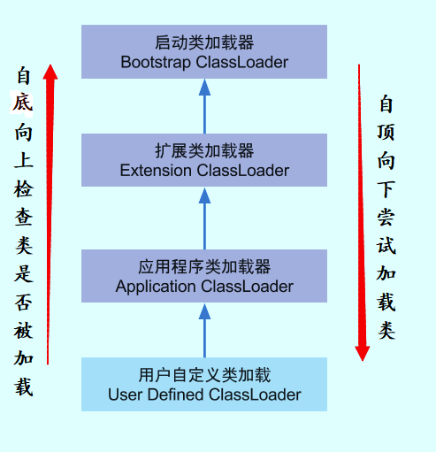

每个类加载都有一个父类加载器，我们通过下面的程序来验证。

```java
public class ClassLoaderDemo {
    public static void main(String[] args) {
        System.out.println("ClassLodarDemo's ClassLoader is " + ClassLoaderDemo.class.getClassLoader());
        System.out.println("The Parent of ClassLodarDemo's ClassLoader is " + ClassLoaderDemo.class.getClassLoader().getParent());
        System.out.println("The GrandParent of ClassLodarDemo's ClassLoader is " + ClassLoaderDemo.class.getClassLoader().getParent().getParent());
    }
}
```

>   ClassLodarDemo's ClassLoader is sun.misc.Launcher$AppClassLoader@18b4aac2
>   The Parent of ClassLodarDemo's ClassLoader is sun.misc.Launcher$ExtClassLoader@1b6d3586
>   The GrandParent of ClassLodarDemo's ClassLoader is null

`AppClassLoader`的父类加载器为`ExtClassLoader`， `ExtClassLoader`的父类加载器为 null，**null 并不代表`ExtClassLoader`没有父类加载器，而是 `BootstrapClassLoader`** 。

另外，类加载器之间的“父子”关系也不是通过继承来体现的，是由“优先级”来决定


### 好处

双亲委派模型保证了 Java 程序的稳定运行，可以**避免类的重复加载**（JVM  区分不同类的方式不仅仅根据类名，相同的类文件被不同的类加载器加载产生的是两个不同的类），也保证了 **Java 的核心 API  不被篡改**。如果没有使用双亲委派模型，而是每个类加载器加载自己的话就会出现一些问题，比如我们编写一个称为 `java.lang.Object` 类的话，那么程序运行的时候，系统就会出现多个不同的 `Object` 类。


### 如果不想使用双亲委派

**自定义加载器**的话，需要继承 `ClassLoader` 。如果我们不想打破双亲委派模型，就重写 `ClassLoader` 类中的 `findClass()` 方法即可，无法被父类加载器加载的类最终会通过这个方法被加载。但是，如果想打破双亲委派模型则需要重写**`loadClass()` 方法**


# 最重要的 JVM 参数总结

JVM的参数非常之多，这里只列举比较重要的几个，通过各种各样的搜索引擎也可以得知这些信息。

| 参数名称                   | 含义                                                       | 默认值               | 说明                                                         |
| -------------------------- | ---------------------------------------------------------- | -------------------- | ------------------------------------------------------------ |
| -Xms                       | 初始堆大小                                                 | 物理内存的1/64(<1GB) | 默认(MinHeapFreeRatio参数可以调整)空余堆内存小于40%时，JVM就会增大堆直到-Xmx的最大限制. |
| -Xmx                       | 最大堆大小                                                 | 物理内存的1/4(<1GB)  | 默认(MaxHeapFreeRatio参数可以调整)空余堆内存大于70%时，JVM会减少堆直到 -Xms的最小限制 |
| -Xmn                       | 年轻代大小(1.4or later)                                    |                      | 注意：此处的大小是（eden+ 2 survivor space).与jmap -heap中显示的New gen是不同的。整个堆大小=年轻代大小 + 老年代大小 +  持久代（永久代）大小.增大年轻代后,将会减小年老代大小.此值对系统性能影响较大,Sun官方推荐配置为整个堆的3/8 |
| -XX:NewSize                | 设置年轻代大小(for 1.3/1.4)                                |                      |                                                              |
| -XX:MaxNewSize             | 年轻代最大值(for 1.3/1.4)                                  |                      |                                                              |
| -XX:PermSize               | 设置持久代(perm gen)初始值                                 | 物理内存的1/64       |                                                              |
| -XX:MaxPermSize            | 设置持久代最大值                                           | 物理内存的1/4        |                                                              |
| -Xss                       | 每个线程的堆栈大小                                         |                      | JDK5.0以后每个线程堆栈大小为1M,以前每个线程堆栈大小为256K.根据应用的线程所需内存大小进行  调整.在相同物理内存下,减小这个值能生成更多的线程.但是操作系统对一个进程内的线程数还是有限制的,不能无限生成,经验值在3000~5000左右一般小的应用， 如果栈不是很深， 应该是128k够用的  大的应用建议使用256k。这个选项对性能影响比较大，需要严格的测试。（校长）和threadstacksize选项解释很类似,官方文档似乎没有解释,在论坛中有这样一句话:-Xss is translated in a VM flag named ThreadStackSize”一般设置这个值就可以了 |
| -XX:NewRatio               | 年轻代(包括Eden和两个Survivor区)与年老代的比值(除去持久代) |                      | -XX:NewRatio=4表示年轻代与年老代所占比值为1:4,年轻代占整个堆栈的1/5Xms=Xmx并且设置了Xmn的情况下，该参数不需要进行设置。 |
| -XX:SurvivorRatio          | Eden区与Survivor区的大小比值                               |                      | 设置为8,则两个Survivor区与一个Eden区的比值为2:8,一个Survivor区占整个年轻代的1/10 |
| -XX:+DisableExplicitGC     | 关闭System.gc()                                            |                      | 这个参数需要严格的测试                                       |
| -XX:PretenureSizeThreshold | 对象超过多大是直接在旧生代分配                             | 0                    | 单位字节 新生代采用Parallel ScavengeGC时无效另一种直接在旧生代分配的情况是大的数组对象,且数组中无外部引用对象. |
| -XX:ParallelGCThreads      | 并行收集器的线程数                                         |                      | 此值最好配置与处理器数目相等 同样适用于CMS                   |
| -XX:MaxGCPauseMillis       | 每次年轻代垃圾回收的最长时间(最大暂停时间)                 |                      | 如果无法满足此时间,JVM会自动调整年轻代大小,以满足此值.       |

其实还有一些打印及CMS方面的参数，这里就不以一一列举了


## 概述

在本篇文章中，你将掌握最常用的 JVM 参数配置。如果对于下面提到了一些概念比如堆、

## 堆内存相关

>   Java 虚拟机所管理的内存中最大的一块，Java 堆是所有线程共享的一块内存区域，在虚拟机启动时创建。**此内存区域的唯一目的就是存放对象实例，几乎所有的对象实例以及数组都在这里分配内存。**

### 显式指定堆内存`–Xms`和`-Xmx`

与性能有关的最常见实践之一是根据应用程序要求初始化堆内存。如果我们需要指定最小和最大堆大小（推荐显示指定大小），以下参数可以帮助你实现：

```text
-Xms<heap size>[unit] 
-Xmx<heap size>[unit]
```

-   **heap size** 表示要初始化内存的具体大小。
-   **unit** 表示要初始化内存的单位。单位为***“ g”*** (GB) 、***“ m”***（MB）、***“ k”***（KB）。

举个栗子🌰，如果我们要为JVM分配最小2 GB和最大5 GB的堆内存大小，我们的参数应该这样来写：

```text
-Xms2G -Xmx5G
```

### 显式新生代内存(Young Generation)

根据[Oracle官方文档](https://docs.oracle.com/javase/8/docs/technotes/guides/vm/gctuning/sizing.html)

，在堆总可用内存配置完成之后，第二大影响因素是为 `Young Generation` 在堆内存所占的比例。默认情况下，YG 的最小大小为 1310 *MB*，最大大小为*无限制*。

一共有两种指定 新生代内存(Young Ceneration)大小的方法：

**1.通过`-XX:NewSize`和`-XX:MaxNewSize`指定**

```text
-XX:NewSize=<young size>[unit] 
-XX:MaxNewSize=<young size>[unit]
```

举个栗子🌰，如果我们要为 新生代分配 最小256m 的内存，最大 1024m的内存我们的参数应该这样来写：

```text
-XX:NewSize=256m
-XX:MaxNewSize=1024m
```

**2.通过`-Xmn<young size>[unit] `指定**

举个栗子🌰，如果我们要为 新生代分配256m的内存（NewSize与MaxNewSize设为一致），我们的参数应该这样来写：

```text
-Xmn256m 
```

GC 调优策略中很重要的一条经验总结是这样说的：

>   将新对象预留在新生代，由于 Full GC 的成本远高于 Minor GC，因此尽可能将对象分配在新生代是明智的做法，实际项目中根据 GC 日志分析新生代空间大小分配是否合理，适当通过“-Xmn”命令调节新生代大小，最大限度降低新对象直接进入老年代的情况。

另外，你还可以通过**`-XX:NewRatio=<int>`**来设置新生代和老年代内存的比值。

比如下面的参数就是设置新生代（包括Eden和两个Survivor区）与老年代的比值为1。也就是说：新生代与老年代所占比值为1：1，新生代占整个堆栈的 1/2。

```text
-XX:NewRatio=1
```

### 显式指定永久代/元空间的大小

**从Java 8开始，如果我们没有指定 Metaspace 的大小，随着更多类的创建，虚拟机会耗尽所有可用的系统内存（永久代并不会出现这种情况）。**

JDK 1.8 之前永久代还没被彻底移除的时候通常通过下面这些参数来调节方法区大小

```java
-XX:PermSize=N //方法区 (永久代) 初始大小
-XX:MaxPermSize=N //方法区 (永久代) 最大大小,超过这个值将会抛出 OutOfMemoryError 异常:java.lang.OutOfMemoryError: PermGen
```

相对而言，垃圾收集行为在这个区域是比较少出现的，但并非数据进入方法区后就“永久存在”了。

**JDK 1.8 的时候，方法区（HotSpot 的永久代）被彻底移除了（JDK1.7 就已经开始了），取而代之是元空间，元空间使用的是本地内存。**

下面是一些常用参数：

```java
-XX:MetaspaceSize=N //设置 Metaspace 的初始（和最小大小）
-XX:MaxMetaspaceSize=N //设置 Metaspace 的最大大小，如果不指定大小的话，随着更多类的创建，虚拟机会耗尽所有可用的系统内存。
```

## 垃圾收集相关

### 垃圾回收器

为了提高应用程序的稳定性，选择正确的[垃圾收集](http://www.oracle.com/webfolder/technetwork/tutorials/obe/java/gc01/index.html)

算法至关重要。

JVM具有四种类型的*GC*实现：

-   串行垃圾收集器
-   并行垃圾收集器
-   CMS垃圾收集器
-   G1垃圾收集器

可以使用以下参数声明这些实现：

```text
-XX:+UseSerialGC
-XX:+UseParallelGC
-XX:+UseParNewGC
-XX:+UseG1GC
```

有关*垃圾回收*实施的更多详细信息，请参见[此处](https://github.com/Snailclimb/JavaGuide/blob/master/docs/java/jvm/JVM垃圾回收.md)。

### GC记录

为了严格监控应用程序的运行状况，我们应该始终检查JVM的*垃圾回收*性能。最简单的方法是以人类可读的格式记录*GC*活动。

使用以下参数，我们可以记录*GC*活动：

```text
-XX:+UseGCLogFileRotation 
-XX:NumberOfGCLogFiles=< number of log files > 
-XX:GCLogFileSize=< file size >[ unit ]
-Xloggc:/path/to/gc.log
```


# 大白话理解JVM

## java文件是如何被运行

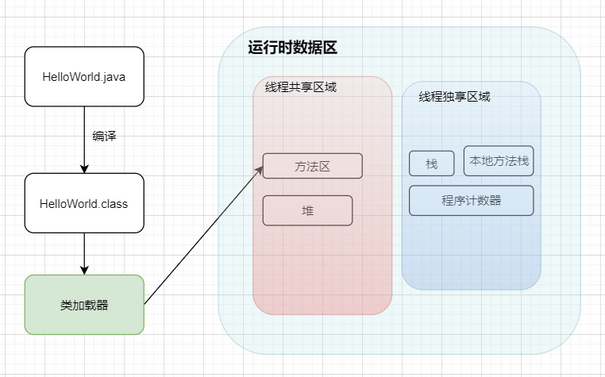

1.  Java文件经过编译后变成 .class 字节码文件
2.  字节码文件通过类加载器被搬运到 JVM 虚拟机中
3.  虚拟机主要的5大块：方法区，堆都为线程共享区域，有线程安全问题，栈和本地方法栈和计数器都是独享区域，不存在线程安全问题，而 JVM 的调优主要就是围绕堆，栈两大块进行


### 例子

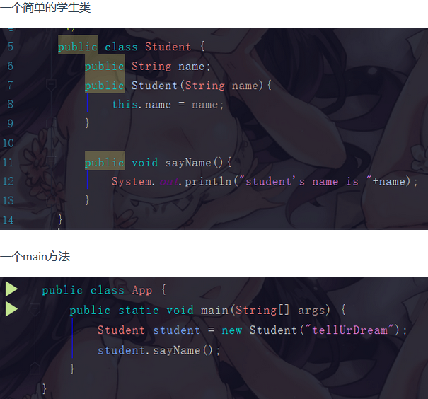

执行main方法的步骤如下:

1.  编译好 App.java 后得到 App.class 后，执行  App.class，系统会启动一个 JVM 进程，从 classpath 路径中找到一个名为 App.class 的二进制文件，将 App  的类信息加载到运行时数据区的方法区内，这个过程叫做 App 类的加载
2.  JVM 找到 App 的主程序入口，执行main方法
3.  这个main中的第一条语句为 Student student = new Student("tellUrDream") ，就是让 JVM  创建一个Student对象，但是这个时候方法区中是没有 Student 类的信息的，所以 JVM 马上加载 Student 类，把  Student 类的信息放到方法区中
4.  加载完 Student 类后，JVM 在堆中为一个新的 Student 实例分配内存，然后调用构造函数初始化 Student 实例，这个 Student 实例持有 **指向方法区中的 Student 类的类型信息** 的引用
5.  执行student.sayName();时，JVM 根据 student 的引用找到 student 对象，然后根据 student 对象持有的引用定位到**方法区中 student 类的类型信息的方法表**，获得 sayName() 的字节码地址。
6.  执行sayName()

其实也不用管太多，**只需要知道对象实例初始化时会去方法区中找类信息，完成后再到栈那里去运行方法。找方法就在方法表中找**


## 类加载器的介绍

将class文件字节码内容加载到内存中，并将这些内容转换成方法区中的运行时数据结构，并且ClassLoader只负责class文件的加载，而是否能够运行则由 Execution Engine 来决定

### 类加载器的流程

从类被加载到虚拟机内存中开始，到释放内存总共有7个步骤：加载，验证，准备，解析，初始化，使用，卸载。其中**验证，准备，解析三个部分统称为连接**

#### 加载

1.  将class文件加载到内存
2.  将静态数据结构转化成方法区中运行时的数据结构
3.  在堆中生成一个代表这个类的 java.lang.Class对象作为数据访问的入口

#### 链接

1.  验证：确保加载的类符合 JVM 规范和安全，保证被校验类的方法在运行时不会做出危害虚拟机的事件，其实就是一个安全检查
2.  准备：为static变量在方法区中分配内存空间，设置变量的初始值，例如 static int a = 3 （注意：准备阶段只设置类中的静态变量（方法区中），不包括实例变量（堆内存中），实例变量是对象初始化时赋值的）
3.  解析：虚拟机将常量池内的符号引用替换为直接引用的过程（符号引用比如我现在import java.util.ArrayList这就算符号引用，直接引用就是指针或者对象地址，注意引用对象一定是在内存进行）

####  初始化

初始化其实就是执行类构造器方法的`<clinit>()`的过程，而且要保证执行前父类的`<clinit>()`方法执行完毕。这个方法由编译器收集，顺序执行所有**类变量（static修饰的成员变量）**显式初始化和静态代码块中语句。此时准备阶段时的那个 `static int a` 由默认初始化的0变成了显式初始化的3。 由于执行顺序缘故，初始化阶段类变量如果在静态代码块中又进行了更改，会覆盖类变量的显式初始化，最终值会为静态代码块中的赋值。

>   注意：字节码文件中初始化方法有两种，非静态资源初始化的`<init>`和静态资源初始化的`<clinit>`，类构造器方法`<clinit>()`不同于类的构造器，这些方法都是字节码文件中只能给JVM识别的特殊方法。

#### 卸载

GC将无用对象从内存中卸载


### 类加载器的加载顺序

加载一个Class类的顺序也是有优先级的，类加载器从最底层开始往上的顺序是这样的

1.  BootStrap ClassLoader：rt.jar【启动类】
2.  Extension ClassLoader: 加载扩展的jar包【扩展类】
3.  App ClassLoader：指定的classpath下面的jar包【应用类】
4.  Custom ClassLoader：自定义的类加载器


### 双亲委派机制

当一个类收到了加载请求时，它是不会先自己去尝试加载的，而是委派给父类去完成，比如我现在要 new 一个 Person，这个 Person 是我们自定义的类，如果我们要加载它，就会先委派 App ClassLoader  ，只有当父类加载器都反馈自己无法完成这个请求（也就是父类加载器都没有找到加载所需的 Class）时，子类加载器才会自行尝试加载。

这样做的好处是，加载位于 rt.jar 包中的类时不管是哪个加载器加载，最终都会委托到 BootStrap ClassLoader 进行加载，这样保证了使用不同的类加载器得到的都是同一个结果。

其实这个也是一个隔离的作用，避免了我们的代码影响了 JDK 的代码，比如我现在自己定义一个 `java.lang.String` ：

```java
package java.lang;
public class String {
    public static void main(String[] args) {
        System.out.println();
    }
}
```

尝试运行当前类的 `main` 函数的时候，我们的代码肯定会报错。这是因为在加载的时候其实是找到了 rt.jar 中的`java.lang.String`，然而发现这个里面并没有 `main` 方法


## 运行时数据区

### 虚拟机堆和栈

栈管运行，堆管存储


### 虚拟机堆的概念

JVM内存会划分为堆内存和非堆内存，堆内存中也会划分为**年轻代**和**老年代**，而非堆内存则为**永久代**（方法区-》元空间）。年轻代又会分为**Eden**和**Survivor**区。Survivor也会分为**FromPlace**和**ToPlace**，toPlace的survivor区域是空的。Eden，FromPlace和ToPlace的默认占比为 **8:1:1**。当然这个东西其实也可以通过一个 -XX:+UsePSAdaptiveSurvivorSizePolicy 参数来根据生成对象的速率动态调整


## jvm调优

根据刚刚涉及的jvm的知识点，我们可以尝试对JVM进行调优，主要就是堆内存那块

所有线程共享数据区大小=新生代大小 +  年老代大小 +  持久代大小。持久代一般固定大小为64m。所以java堆中增大年轻代后，将会减小年老代大小（因为老年代的清理是使用fullgc，所以老年代过小的话反而是会增多fullgc的）。此值对系统性能影响较大，Sun官方推荐配置为java堆的3/8


### 调整最大堆内存和最小堆内存

-Xmx –Xms：指定java堆最大值（默认值是物理内存的1/4(<1GB)）和初始java堆最小值（默认值是物理内存的1/64(<1GB))

不停地往堆内存里面丢数据，等它剩余大小小于40%了，JVM就会动态申请内存空间不过会小于-Xmx，如果剩余大小大于70%，又会动态缩小不过不会小于–Xms。

开发过程中，通常会将 -Xms 与 -Xmx两个参数配置成相同的值，其目的是为了能够在java垃圾回收机制清理完堆区后不需要重新分隔计算堆区的大小而浪费资源

```java
System.out.println("Xmx=" + Runtime.getRuntime().maxMemory() / 1024.0 / 1024 + "M");    //系统的最大空间
System.out.println("free mem=" + Runtime.getRuntime().freeMemory() / 1024.0 / 1024 + "M");  //系统的空闲空间
System.out.println("total mem=" + Runtime.getRuntime().totalMemory() / 1024.0 / 1024 + "M");  //当前可用的总空间

```


根据实际事情调整新生代和幸存代的大小，官方推荐新生代占java堆的3/8，幸存代占新生代的1/10

在OOM时，记得Dump出堆，确保可以排查现场问题，通过下面命令你可以输出一个.dump文件，这个文件可以使用VisualVM或者Java自带的Java VisualVM工具。

```
-Xmx20m -Xms5m -XX:+HeapDumpOnOutOfMemoryError -XX:HeapDumpPath=你要输出的日志路径
```

一般我们也可以通过编写脚本的方式来让OOM出现时给我们报个信，可以通过发送邮件或者重启程序等来解决


# JDK监控和故障处理工具

##  JDK 命令行工具

这些命令在 JDK 安装目录下的 bin 目录下：

-   **`jps`** (JVM Process Status）: 类似 UNIX 的 `ps` 命令。用于查看所有 Java 进程的启动类、传入参数和 Java 虚拟机参数等信息；
-   **`jstat`**（JVM Statistics Monitoring Tool）: 用于收集 HotSpot 虚拟机各方面的运行数据;
-   **`jinfo`** (Configuration Info for Java) : Configuration Info for Java,显示虚拟机配置信息;
-   **`jmap`** (Memory Map for Java) : 生成堆转储快照;
-   **`jhat`** (JVM Heap Dump Browser) : 用于分析 heapdump 文件，它会建立一个 HTTP/HTML 服务器，让用户可以在浏览器上查看分析结果;
-   **`jstack`** (Stack Trace for Java) : 生成虚拟机当前时刻的线程快照，线程快照就是当前虚拟机内每一条线程正在执行的方法堆栈的集合。
