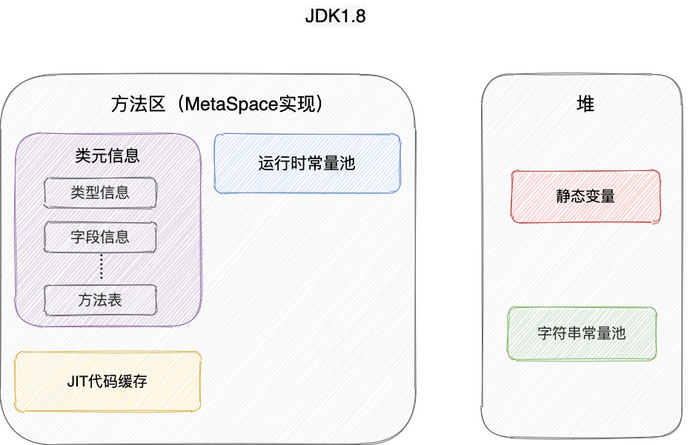

# JAVA内存区域详解

## 运行时数据区域


### 线程私有

-   程序计数器：**线程切换后能恢复到正确的执行位置**

-   虚拟机栈：每个 Java 方法在执行的同时会创建一个**栈帧**用于存储**局部变量表、操作数栈、常量池引用**等信息。从方法调用直至执行完成的过程，就对应着一个栈帧在 Java 虚拟机栈中入栈和出栈的过程。

-   本地方法栈：和虚拟机栈所发挥的作用非常相似，区别是： 虚拟机栈为虚拟机执行 Java 方法 （也就是字节码）服务，而本地方法栈则为虚拟机使用到的 **Native** 方法服务。在 HotSpot 虚拟机中和 Java 虚拟机栈合二为一。

    （一个Native Method就是一个java调用非java代码的接口）

    **保证线程中的局部变量不被别的线程访问到**

### 线程共有（进程）

堆和方法区是所有线程共享的资源，其中**堆**是进程中最大的一块内存，主要用于存放**新创建的对象** (几乎所有对象都在这里分配内存)，
**方法区**主要用于存放**已被加载的类信息、常量、静态变量、即时编译器编译后的代码**等数据。


### 线程私有

#### 虚拟机栈

每个 Java 方法在执行的同时会创建一个**栈帧**用于存储**局部变量表、操作数栈、常量池引用，动态链接，方法返回地址**等信息。从方法调用直至执行完成的过程，就对应着一个栈帧在 Java 虚拟机栈中入栈和出栈的过程（先进后出）。


**局部变量表**  主要存放了编译期可知的各种数据类型（boolean、byte、char、short、int、float、long、double）、对象引用（reference 类型，它不同于对象本身，可能是一个指向对象起始地址的引用指针，也可能是指向一个代表对象的句柄或其他与此对象相关的位置）。

**操作数栈** 主要作为方法调用的中转站使用，用于存放方法执行过程中产生的中间计算结果。另外，计算过程中产生的临时变量也会放在操作数栈中。

**动态链接** 主要服务一个方法需要调用其他方法的场景。**在 Java 源文件被编译成字节码文件时，所有的变量和方法引用都作为符号引用（Symbilic  Reference）保存在 Class  文件的常量池【方法区】里**。**当一个方法要调用其他方法，需要将常量池中指向方法的符号引用转化为其在内存地址中的直接引用**。动态链接的作用就是为了将符号引用转换为调用方法的直接引用。


简单总结一下程序运行中栈可能会出现两种错误：

-   **`StackOverFlowError`：** 若栈的内存大小**不允许动态扩展**，那么当线程请求栈的深度超过当前 Java 虚拟机栈的最大深度的时候，就抛出 `StackOverFlowError` 错误。
-   **`OutOfMemoryError`：** 如果栈的内存大小**可以动态扩展**， 如果虚拟机在动态扩展栈时无法申请到足够的内存空间，则抛出`OutOfMemoryError`异常。


#### 本地方法栈

native方法：调用其他语言方法的接口

和虚拟机栈所发挥的作用非常相似，区别是： **虚拟机栈为虚拟机执行 Java 方法 （也就是字节码）服务，而本地方法栈则为虚拟机使用到的 Native 方法服务。** 在 HotSpot 虚拟机中和 Java 虚拟机栈合二为一。


#### 程序计数器

作用：

-   **字节码解释器**工作时通过改变这个计数器的值来选取下一条需要执行的**字节码指令**，从而实现代码的流程控制，如：顺序执行、选择、循环、异常处理。
-   在多线程的情况下，程序计数器用于记录当前线程执行的位置，从而当线程被切换回来的时候能够知道该线程上次运行到哪儿了。

⚠️ 注意 ：程序计数器是唯一一个不会出现 `OutOfMemoryError` 的内存区域，它的生命周期随着线程的创建而创建，随着线程的结束而死亡。


### 线程共享（进程）

#### 堆

**唯一目的就是存放对象实例，几乎所有的对象实例以及数组都在这里分配内存。**

Java 堆是垃圾收集器管理的主要区域，因此也被称作 **GC 堆（Garbage Collected Heap）**.

在 JDK 7 版本及 JDK 7 版本之前，**堆内存**被通常分为下面三部分：

1.  新生代内存(Young Generation)
2.  老生代(Old Generation)
3.  永久代(Permanent Generation)

下图所示的 Eden 区、两个 Survivor 区 S0 和 S1 都属于新生代，中间一层属于老年代，最下面一层属于永久代。**JDK 8 版本之后 PermGen(永久) 已被 Metaspace(元空间) 取代，元空间使用的是直接内存** 


>   大部分情况，对象都会首先在 Eden 区域分配，在一次新生代垃圾回收后，如果对象还存活，则会进入 S0 或者 S1，并且对象的年龄还会加  1(Eden 区->Survivor 区后对象的初始年龄变为 1)，当它的年龄增加到一定程度（默认为 15  岁），就会被晋升到老年代中。对象晋升到老年代的年龄阈值，可以通过参数 `-XX:MaxTenuringThreshold` 来设置


堆这里最容易出现的就是 `OutOfMemoryError` 错误，并且出现这种错误之后的表现形式还会有几种，比如：

1.  **`java.lang.OutOfMemoryError: GC Overhead Limit Exceeded`** ： 当 JVM 花太多时间执行垃圾回收并且只能回收很少的堆空间时，就会发生此错误。
2.  **`java.lang.OutOfMemoryError: Java heap space`** :假如在创建新的对象时, 堆内存中的空间不足以存放新创建的对象, 就会引发此错误。(和配置的最大堆内存有关，且受制于物理内存大小。最大堆内存可通过`-Xmx`参数配置，若没有特别配置，将会使用默认值，


#### 方法区（元空间）

当虚拟机要使用一个类时，它需要读取并解析 Class 文件获取相关信息，再将信息存入到方法区。方法区会存储已被虚拟机加载的 **类信息、字段信息、方法信息、常量、静态变量、即时编译器编译后的代码缓存等数据**。


方法区和堆


##### 运行时常量池

编译期生成的各种字面量（Literal）和符号引用（Symbolic Reference）。

字面量包括整数、浮点数和字符串字面量；

符号引用包括类符号引用、字段符号引用、方法符号引用和接口方法符号引用。

常量池表会在**类加载后**存放到方法区的运行时常量池中。

当常量池无法再申请到内存时会抛出 `OutOfMemoryError` 错误


##### 字符串常量池

**字符串常量池** 是 JVM 为了提升性能和减少内存消耗针对字符串（String 类）专门开辟的一块区域，主要目的是为了避免字符串的重复创建。

**字符串常量池：存储的是字面量"abc"和创建的字符串对象的引用(堆中的字符串对象)之间的映射**

**堆：存放对象**

```java
// 在堆中创建字符串对象”ab“
// 将字符串对象”ab“的引用保存在字符串常量池中
String aa = "ab";
// 直接返回字符串常量池中字符串对象”ab“的引用
String bb = "ab";
System.out.println(aa==bb);// true


//
String aa = new String("abc")
//使用这种方式一共会创建两个字符串对象（前提是 String Pool 中还没有 "abc" 字符串对象）。
//"abc" 属于字符串字面量，因此编译时期会在String Pool中创建一个字符串对象，指向这个 "abc" 字符串字面量；
//还会在堆中创建一个字符串对象
```


#####  **为什么要将字符串常量池移动到堆中？**

在 Java 7 之前，String Pool 被放在运行时常量池中，它属于永久代。而在**Java 7，String Pool 被移到堆中**。这是因为永久代的空间有限，在大量使用字符串的场景下会导致 OutOfMemoryError 错误。


##### **方法区和永久代以及元空间是什么关系呢？**

**方法区: 永久代 or 元空间**。永久代（ JDK 1.8 之前）以及元空间（ JDK 1.8 之后）是 HotSpot  虚拟机对虚拟机规范中方法区的两种实现方式。

类似接口和类的关系。


##### **为什么要将永久代 (PermGen) 替换为元空间 (MetaSpace) 呢?**

-   整个永久代有一个 JVM 本身设置的固定大小上限，无法进行调整，而元空间使用的是直接内存，受本机可用内存的限制，虽然元空间仍旧可能溢出，但是比原来出现的几率会更小。

    >   可以使用 `-XX：MaxMetaspaceSize` 标志设置最大元空间大小，默认值为 unlimited，这意味着它只受系统内存的限制。`-XX：MetaspaceSize` 调整标志定义元空间的初始大小如果未指定此标志，则 Metaspace 将根据运行时的应用程序需求动态地重新调整大小。

-   元空间里面存放的是类的元数据，这样加载多少类的元数据就不由 `MaxPermSize` 控制了, 而由系统的实际可用空间来控制，这样能加载的类就更多了。

-   在 JDK8，合并 HotSpot 和 JRockit 的代码时, JRockit 从来没有一个叫永久代的东西, 合并之后就没有必要额外的设置这么一个永久代的地方了。


##### **方法区常用参数有哪些？**

永久代：

```java
-XX:PermSize=N //方法区 (永久代) 初始大小
-XX:MaxPermSize=N //方法区 (永久代) 最大大小,超过这个值将会抛出 OutOfMemoryError 异常:java.lang.OutOfMemoryError: PermGen
```

元空间：

```java
-XX:MetaspaceSize=N //设置 Metaspace 的初始（和最小大小）
-XX:MaxMetaspaceSize=N //设置 Metaspace 的最大大小
```


#### 直接内存

直接内存并不是虚拟机运行时数据区的一部分，也不是虚拟机规范中定义的内存区域，但是这部分内存也被频繁地使用。而且也可能导OutOfMemoryError 错误出现。

来源于 **NIO(New Input/Output)** ，通过存在堆中的DirectByteBuffer操作Native内存。

引入了一种基于通道（Channel）与缓存区（Buffer）的 I/O 方式，它可以直接使用 Native 函数库直接分配堆外内存，然后通过一个存储在 Java 堆中的 DirectByteBuffer 对象作为这块内存的引用进行操作。这样就能在一些场景中显著提高性能，因为避免了在 Java 堆和 Native 堆之间来回复制数据。

>   缺点：
>
>   -   分配回收成本较高
>   -   不受JVM内存回收管理
>   -   直接内存大小可以设置，不设置默认与堆最大值一致。


## HotSpot 虚拟机对象 

下面我们来详细的了解一下 HotSpot 虚拟机在 Java 堆中对象分配、布局和访问的全过程。


### 对象的创建

1.   **类加载器检查**

     遇到new，先去常量池中查找这个类的符号引用。

     ​	如果能找到，则检查这个类是否被加载，解析，初始化；

     ​	如果找不到，则执行类加载。

     

2.   **分配内存**

     分配方式有 **“指针碰撞”** 和 **“空闲列表”** 两种，选择哪种分配方式由 Java 堆是否规整决定，而 Java 堆是否规整又由所采用的**垃圾收集器是否带有压缩整理功能**决定。

     

     **内存分配的两种方式**

     -   指针碰撞 ： 
         -   适用场合 ：堆内存规整（即没有内存碎片）的情况下。
         -   原理 ：用过的内存全部**整合到一边**，没有用过的内存放在另一边，中间有一个分界指针，只需要向着没用过的内存方向将该指针移动对象内存大小位置即可。
         -   使用该分配方式的 GC 收集器：Serial, ParNew
     -   空闲列表 ： 
         -   适用场合 ： 堆内存不规整的情况下。
         -   原理 ：虚拟机会维护一个列表，该列表中会记录**哪些内存块是可用的**，在分配的时候，找一块儿足够大的内存块儿来划分给对象实例，最后更新列表记录。
         -   使用该分配方式的 GC 收集器：CMS

     **内存分配并发问题**

     虚拟机采用两种方式来保证线程安全：

     -   **CAS+失败重试：** CAS 是乐观锁的一种实现方式。所谓乐观锁就是，每次不加锁而是假设没有冲突而去完成某项操作，如果因为冲突失败就重试，直到成功为止。**虚拟机采用 CAS 配上失败重试的方式保证更新操作的原子性。**

     -   **TLAB：** 为每一个线程预先在 Eden 区分配一块儿内存，JVM 在给线程中的对象分配内存时，首先在 TLAB 分配，当对象大于 TLAB 中的剩余内存或 TLAB 的内存已用尽时，再采用上述的 CAS 进行内存分配

         

3.   **初始化零值**

     虚拟机需要将分配到的内存空间都初始化为零值（不包括对象头）,保证了对象的实例字段在 Java 代码中可以不赋初始值就直接使用

     

4.   **设置对象头**

     对象头存储：这个对象是哪个类的实例、如何才能找到类的元数据信息、对象的哈希码、对象的 GC 分代年龄等信息。 另外，根据虚拟机当前运行状态的不同，如是否启用偏向锁等，对象头会有不同的设置方式

     

5.   **执行init方法**

     从虚拟机的视角来看，一个新的对象已经产生了，但从 Java 程序的视角来看，对象创建才刚开始，`<init>` 方法还没有执行，所有的字段都还为零。执行 new 指令之后会接着执行 `<init>` 方法，把对象按照程序员的意愿进行初始化。

​	

### 对象的内存布局

对象在内存中的布局可以分为 3 块区域：**对象头**、**实例数据**和**对齐填充**。

对象头：

-   存储对象自身的运行时数据**（哈希码、GC 分代年龄、锁状态标志等等）**

-   存储**类型指针**，即对象指向它的类元数据的指针，虚拟机通过这个指针来确定这个对象是哪个类的实例。

实例数据：

-   **对象真正存储的有效信息**，也是在程序中所定义的各种类型的字段内容。

对齐填充：

-   对齐填充部分不是必然存在的，也没有什么特别的含义，仅仅起占位作用。 因为 Hotspot 虚拟机的自动内存管理系统要求对象起始地址必须是 8 字节的整数倍，换句话说就是对象的大小必须是 8 字节的整数倍


### 对象访问定位

 Java 程序通过栈上的 reference 数据来操作堆上的具体对象。对象的访问方式由虚拟机实现而定，目前主流的访问方式有：**使用句柄**、**直接指针**。

#### 句柄

如果使用句柄的话，那么 Java 堆中将会划分出一块内存来作为句柄池，reference 中存储的就是对象的**句柄地址**，而句柄中包含了**对象实例数据**与**类型数据**各自的具体地址信息。

>   对象实例数据：对象中各个实例字段的数据
>
>   对象类型数据：对象的类型、父类、实现的接口、方法等


#### 直接指针

如果使用直接指针访问，那么 Java 堆对象的布局中就必须考虑如何放置访问类型数据的相关信息，而 reference 中存储的直接就是**对象的地址**。


这两种对象访问方式各有优势。使用句柄来访问的最大好处是 reference  中存储的是稳定的句柄地址，在对象被移动时只会改变句柄中的实例数据指针，而 reference  本身不需要修改。使用直接指针访问方式最大的好处就是速度快，它节省了一次指针定位的时间开销。


# JVM垃圾回收详解


## 分配与回收基础

Java 堆是垃圾收集器管理的主要区域，因此也被称作**GC 堆（Garbage Collected Heap）**。从垃圾回收的角度，由于现在收集器基本都采用分代垃圾收集算法，所以 Java 堆还可以细分为：新生代和老年代：再细致一点有：Eden 空间、From Survivor、To Survivor 空间等。**进一步划分的目的是更好地回收内存，或者更快地分配内存。**

**堆空间的基本结构**：


永久代被移到了元空间中。


**分配：**

对象都会首先在 Eden 区域分配，在一次新生代垃圾回收后，如果对象还存活，则会进入 s0 或者 s1，并且对象的年龄还会加 1(Eden  区->Survivor 区后对象的初始年龄变为 1)，当它的年龄增加到一定程度（默认为大于 15 岁），就会被晋升到老年代中。对象晋升到老年代的年龄阈值，可以通过参数 -XX:MaxTenuringThreshold 来设置。经过这次GC后，Eden区和"From"区已经被清空。这个时候，“From"和"To"会交换他们的角色，也就是新的"To"就是上次GC前的“From”，新的"From"就是上次GC前的"To”。不管怎样，都会保证名为To的Survivor区域是空的。Minor GC会一直重复这样的过程，直到“To”区被填满，"To"区被填满之后，会将所有对象移动到年老代中。


**新生代 GC（Minor GC）**：

**触发条件：**

此时如果新生的对象无法在 Eden 区创建（Eden 区无法容纳) 就会触发一次Young GC (Minor GC)。

**过程：**

1.   eden存活的对象放入s0，age加1，其他回收；
2.   当Eden 和 s0区空间满了，会将 S0 区与Eden  区活跃的对象，复制到 S1 区，age 加1
3.   将S0区域和 Eden  区的对象给清空，其他回收
4.   并且将S0 区 和 S1区交换，保证名为S1 的 Survivor 区域是空的，存活的对象年龄加1，其他区域被清空（循环）

**补充：**

Minor GC 会一直重复这样的过程，在这个过程中，有可能当次 Minor GC 后，Survivor  的"From"区域空间不够用，有一些还达不到进入老年代条件的实例放不下，则放不下的部分会提前进入老年代。

**停止-复制（Stop-and-copy）清理法**：经过一次GC和复制，一个Survivor中保存着当前还活着的对象，而Eden区和另一个Survivor区的内容都不再需要了，可以直接清空。

随着MinorGC一次又一次的进行，不断会有新的对象被promote到老年代。最终，MajorGC将会在老年代发生，老年代的空间将会被清除和压缩(标记-清除或者标记整理)。


**老年代 GC（Major GC/Full GC）:**

指发生在老年代的 GC，出现了 Major GC 经常会伴随至少一次的 Minor GC（并非绝对），Major GC 的速度一般会比 Minor GC 的慢 10 倍以上。

**触发条件：**

（1）调用System.gc时，系统建议执行Full GC，但是不必然执行
（2）老年代空间不足
（3）方法去空间不足
（4）通过Minor GC后进入老年代的平均大小大于老年代的可用内存
（5）由Eden区、From Space区向To Space区复制时，对象大小大于To Space可用内存，则把该对象转存到老年代，且老年代的可用内存小于该对象大小

老年代：标记-整理等


**对象的堆分配过程：**

1.  对于一个大对象，我们会首先在Eden 尝试创建，如果创建不了，就会触发Minor GC 
2.  随后继续尝试在Eden区存放，发现仍然放不下
3.  尝试直接进入老年代，老年代也放不下
4.  触发 Major GC 清理老年代的空间
5.  放的下 成功
6.  放不下 OOM


### 对象优先在eden区分配

大多数情况下，对象在新生代中 eden 区分配。当 eden 区没有足够空间进行分配时，虚拟机将发起一次 Minor GC.


因为给 allocation2 分配内存的时候 eden 区内存几乎已经被分配完了，我们刚刚讲了当 Eden  区没有足够空间进行分配时，虚拟机将发起一次 Minor GC.GC 期间虚拟机又发现 allocation1 无法存入 Survivor  空间，所以只好通过 **分配担保机制** 把新生代的对象提前转移到老年代中去，老年代上的空间足够存放 allocation1，所以不会出现 Full GC。执行 Minor GC 后，后面分配的对象如果能够存在 eden 区的话，还是会在 eden 区分配内存。


### 大对象直接进入老年代

大对象就是需要大量连续内存空间的对象（比如：字符串、数组）。

**为什么要这样呢？**

为了避免为大对象分配内存时由于分配担保机制带来的复制而降低效率


### 长期存活的对象将进入老年代

如果对象在 Eden 出生并经过第一次 Minor GC 后仍然能够存活，并且能被 Survivor 容纳的话，将被移动到 Survivor  空间中，并将对象年龄设为 1.对象在 Survivor 中每熬过一次 MinorGC,年龄就增加 1 岁，当它的年龄增加到一定程度（默认为 15 岁），就会被晋升到老年代中。对象晋升到老年代的年龄阈值，可以通过参数 `-XX:MaxTenuringThreshold` 来设置。


### 空间分配担保机制

空间分配担保是为了确保在 Minor GC 之前老年代本身还有容纳新生代所有对象的剩余空间。

要老年代的连续空间大于新生代对象总大小或者历次晋升的平均大小，就会进行 Minor GC，否则将进行 Full GC


## 判断对象死亡

堆中几乎放着所有的对象实例，对堆垃圾回收前的第一步就是要判断哪些对象已经死亡（即不能再被任何途径使用的对象）

### 引用计数法

给对象中添加一个引用计数器，每当有一个地方引用它，计数器就加 1；当引用失效，计数器就减 1；任何时候计数器为 0 的对象就是不可能再被使用的。

**这个方法实现简单，效率高，但是目前主流的虚拟机中并没有选择这个算法来管理内存，其最主要的原因是它很难解决对象之间相互循环引用的问题。** 所谓对象之间的相互引用问题，如下面代码所示：除了对象 objA 和 objB 相互引用着对方之外，这两个对象之间再无任何引用。但是他们因为互相引用对方，导致它们的引用计数器都不为 0，于是引用计数算法无法通知 GC 回收器回收他们。

```java
public class ReferenceCountingGc {
    Object instance = null;
	public static void main(String[] args) {
		ReferenceCountingGc objA = new ReferenceCountingGc();
		ReferenceCountingGc objB = new ReferenceCountingGc();
		objA.instance = objB;
		objB.instance = objA;
		objA = null;
		objB = null;

	}
}
```


### 可达性分析算法

这个算法的基本思想就是通过一系列的称为 **“GC Roots”** 的对象作为起点，从这些节点开始向下搜索，**节点所走过的路径称为引用链**，当一个对象到 GC Roots 没有任何引用链相连的话，则证明此对象是不可用的，需要被回收。

下图中的 `Object 6 ~ Object 10` 之间虽有引用关系，但它们到 GC Roots 不可达，因此为需要被回收的对象。


**哪些对象可以作为 GC Roots 呢？**

-   虚拟机栈(栈帧中的本地变量表)中引用的对象
-   本地方法栈(Native 方法)中引用的对象
-   方法区中类静态属性引用的对象
-   方法区中常量引用的对象
-   所有被同步锁持有的对象


**对象可以被回收，就代表一定会被回收吗？**

即使在可达性分析法中不可达的对象，也并非是“非死不可”的，这时候它们暂时处于“缓刑阶段”，要真正宣告一个对象死亡，至少要经历**两次标记**过程；可达性分析法中不可达的对象被第一次标记并且进行一次筛选，筛选的条件是此对象是否有必要执行 `finalize` 方法。当对象没有覆盖 `finalize` 方法，或 `finalize` 方法已经被虚拟机调用过时，虚拟机将这两种情况视为没有必要执行。

被判定为需要执行的对象将会被放在一个队列中进行第二次标记，除非这个对象与引用链上的任何一个对象建立关联，否则就会被真的回收。

>   `Object` 类中的 `finalize` 方法一直被认为是一个糟糕的设计，成为了 Java 语言的负担，影响了 Java 语言的安全和 GC 的性能。JDK9 版本及后续版本中各个类中的 `finalize` 方法会被逐渐弃用移除。


### 引用

无论是通过引用计数法判断对象引用数量，还是通过可达性分析法判断对象的引用链是否可达，判定对象的存活都与“引用”有关。

JDK1.2 之前，Java 中引用的定义很传统：如果 reference 类型的数据存储的数值代表的是**另一块内存的起始地址**，就称这块内存代表一个引用。

JDK1.2 以后，Java 对引用的概念进行了扩充，将引用分为强引用、软引用、弱引用、虚引用四种

4种引用强度从高到低：强引用 -> 软引用 -> 弱引用 -> 虚引用


**1．强引用（StrongReference）**

一般指的是对像被new出来，强引用一般不会被JVM收回，Java 虚拟机宁愿抛出 OutOfMemoryError 错误，使程序异常终止，也不会靠随意回收具有强引用的对象来解决内存不足问题。

```java
Object obj = new Object();
```

**2．软引用（SoftReference）**

**如果内存空间足够，垃圾回收器就不会回收它，如果内存空间不足了，就会回收这些对象的内存。只要垃圾回收器没有回收它，该对象就可以被程序使用**。软引用可用来实现内存敏感的临时缓存。

```java
SoftReference<String> ref = new SoftReference<String>("hong");
```

**3．弱引用（WeakReference）**

弱引用与软引用的区别在于：**只具有弱引用的对象拥有更短暂的生命周期。在垃圾回收器线程扫描它所管辖的内存区域的过程中，一旦发现了只具有弱引用的对象，不管当前内存空间足够与否，都会回收它的内存**。不过，由于垃圾回收器是一个优先级很低的线程， 因此不一定会很快发现那些只具有弱引用的对象。

```java
Obejct oj = new Object(); 
WeakReference<Obejct> wf = new WeakReference<Obejct>(oj); 
oj = null; 
System.gc(); //下面会发现有时候直接返回null;wf.get();
```

**4．虚引用（PhantomReference）**

"虚引用"顾名思义，就是形同虚设，与其他几种引用都不同，虚引用并不会决定对象的生命周期。如果一个对象仅持有虚引用，那么它就和没有任何引用一样，在任何时候都可能被垃圾回收。

**虚引用主要用来跟踪对象被垃圾回收的活动**。

**虚引用与软引用和弱引用的一个区别在于：**  虚引用必须和引用队列（ReferenceQueue）联合使用。当垃圾回收器准备回收一个对象时，如果发现它还有虚引用，就会在回收对象的内存之前，把这个虚引用加入到与之关联的引用队列中。程序可以通过判断引用队列中是否已经加入了虚引用，来了解被引用的对象是否将要被垃圾回收。程序如果发现某个虚引用已经被加入到引用队列，那么就可以在所引用的对象的内存被回收之前采取必要的行动。

```java
// 虚引用
Object oj= new Object();
ReferenceQueue req= new ReferenceQueue();
PhantomReference<Object> pr= new PhantomReference<Object>(oj, req);
// 每次返回Null
System.out.println(pr.get());
//返回是否被删除
System.out.println(pr.isEnqueued());
```

特别注意，在程序设计中一般很少使用弱引用与虚引用，使用软引用的情况较多，这是因为**软引用可以加速 JVM 对垃圾内存的回收速度，可以维护系统的运行安全，防止内存溢出（OutOfMemory）等问题的产生**


### 如何判断一个常量是废弃常量？

运行时常量池主要回收的是废弃的常量。那么，我们如何判断一个常量是废弃常量呢？

假如在字符串常量池中存在字符串 "abc"，如果当前没有任何 String 对象引用该字符串常量的话，就说明常量 "abc" 就是废弃常量，如果这时发生内存回收的话而且有必要的话，"abc" 就会被系统清理出常量池了。


### 如何判断一个类是无用的类

方法区主要回收的是无用的类，那么如何判断一个类是无用的类的呢？

类需要同时满足下面 3 个条件才能算是 **“无用的类”** ：

-   该类所有的实例都已经被回收，也就是 Java 堆中不存在该类的任何实例。
-   加载该类的 `ClassLoader` 已经被回收。
-   该类对应的 `java.lang.Class` 对象没有在任何地方被引用，无法在任何地方通过反射访问该类的方法。

虚拟机可以对满足上述 3 个条件的无用类进行回收，这里说的仅仅是“可以”，而并不是和对象一样不使用了就会必然被回收。


