# JAVA

## 面向对象

### 面向对象和面向过程的特点和区别？

面向对象：先确定对象的结构，再确定数据结构的算法，适合大规模的问题，基于**三大特性**，可以设计出更加**低耦合**的系统，易于扩展、复用和维护。

面向过程：以过程为中心的编程思想，分析解决问题**所需要的步骤**，按照步骤进行编程。无需类调用的实例化，所以**性能比面向对象高，开销较小**。常用于单片机、嵌入式开发

>   在性能方面，面向过程的程序设计未必就比面向对象的程序设计要好，更多的还是要考虑业务场景的需求，以及编程语言自身的特点。
>
>   低耦合：耦合性也称块间联系。指软件系统结构中各模块间相互联系紧密程度的一种度量。模块之间联系越紧密，其耦合性就越强，模块的独立性则越差。模块间耦合高低取决于模块间接口的复杂性、调用的方式及传递的信息。
>
>   高内聚：在面向对象编程中，对象自身是内聚的，是保管好自己的数据，完成好自己的操作的，而对外界呈现出自己的状态和行为


面向过程的特点：封装、继承、多态

-   封装：封装是指将对象的属性私有化，提供一些可以访问属性的方法，我们通过访问这些方法得到对象的属性。对对象的使用者隐藏具体的实现方式。**内部细节对外部调用透明，外部调用无需修改或者关心内部实现**

    >   1、javabean的属性私有，提供getset对外访问，因为属性的赋值或者获取逻辑只能由javabean本身决定。而不能由外部胡乱修改
    >
    >   2、ORM框架
    >
    >   操作数据库，我们不需要关心链接是如何建立的、sql是如何执行的，只需要引入mybatis，调方法即可

-   继承：将一类事物的**共有属性和行为**抽象成一个父类，而每一个子类可以继承这些父类的属性和方法，还可以扩展自己特有的行为和属性，提高了代码的复用性。

-   多态：**一个对象变量可以指向多种实际类型的现象叫多态**。多态是为了实现接口重用，多态的一大作用就是解耦，允许父类引用或接口指向子类对象**。基于对象所属类的不同，外部对同一个方法的调用，实际执行的逻辑不同。**

    >   多态的表现形式有【继承】重写（运行时多态：动态绑定）和重载（编译时多态，发生在同一个类）。


### 多态

通俗的说：某个行为（方法），不同的对象去完成时产生不同的状态。

eg：行为：买车票。普通人全价，学生半价，军人优先。

**一个对象变量可以指向多种实际类型的现象叫多态**。多态是为了实现接口重用，多态的一大作用就是解耦，允许父类引用或接口指向子类对象。多态的表现形式有重写（运行时多态：动态绑定）和重载（编译时多态）。

接口和继承都是重写


### 接口和抽象类（继承）的区别

**共同点：**

都实现了多态

都可以有默认实现的方法

抽象类中可以没有抽象方法


**区别：**

-   抽象类可以存在普通成员函数，而接口中只能存在**public abstract 方法或默认方法**。

-   抽象类中的成员变量可以是各种类型的，而接口中的**成员变量只能是public static final**类型的。

-   抽象类不能多继承，接口可以多实现

-   多个不相关的类可以实现接口，多个相关的类使用继承，**接口强调行为，抽象类强调代码复用**

-   抽象类是对类本质的抽象，表达的是 **is a** 的关系，比如： BMW is a Car 。抽象类包含并实现子类的通用特性，将子类存在差异化的特性进行抽象，交由子类去实现。

    而接口是对行为的抽象，表达的是 **has a** 的关系。比如： Bird like a Aircraft （像飞行器一样可以飞），但其本质上 is a Bird 。**接口的核心是定义行为，即实现类可以做什么，至于实现类主体是谁、是如何实现的，接口并不关心。**

-   抽象类需要满足**里式替换原则**，即任何基类可以出现的地方，子类一定可以出代替。

-   抽象类可以有构造器方法，而接口没有。


**使用场景**

当你关注一个事物的本质的时候，用抽象类；当你关注一个操作的时候，用接口。

抽象类的功能要远超过接口，但是，定义抽象类的代价高。因为高级语言来说（从实际设计上来说也是）每个类只能继承一个类。在这个类中，你必须继承或编写出其所有子类的所有共性。虽然接口在功能上会弱化许多，但是它只是针对一个动作的描述。而且你可以在一个类中同时实现多个接口。在设计阶段会降低难度。

一定是先有子类再有父类


### 重写和重载的区别？重载的返回值必须一定吗？重写是对于同一个类吗？

总结：

重写：子类继承父类的方法，并且修改方法的实现。

> 重写原则——“两同两小一大”，即方法名和参数必须相同，返回值类型和异常类型要小于或等于父类，访问修饰符的范围要大于或等于父类。
>
> 虚方法：能被重写的方法，一般指的是实例方法。
>
> 非虚方法：不能被重写的方法，包括构造方法、静态方法、私有方法、final修饰的方法。

重载：在同一个类中定义方法名相同但参数不同的方法。

> 参数不同可以是参数的类型、个数或顺序不同；此外，方法返回值和访问修饰符可以相同也可以不同。但光返回值不同，其他相同则不算重载。
>
> 重载解析：编译器根据方法签名匹配相应的方法。


重写和重载都实现了多态，其中：

重写（override）：方法名，参数列表，返回类型相同，仅对方法体进行修改和重写，访问修饰符的限制不能少于父类的。为了满足里式替换原则，重写有以下三个限制：

- 子类方法的**访问权限**必须大于等于父类方法；

- 子类方法的**返回类型**必须是父类方法返回类型或为其子类型。

- 子类方法抛出的**异常类型**必须是父类抛出异常类型或为其子类型。

- 如果父类方法访问修饰符为private则子类就不能重写该方

    法。

使用 @Override 注解，可以让编译器帮忙检查是否满足上面的三个限制条件。

重载（overload）：方法名相同，但参数列表中的类型，顺序，个数至少有一个不同，返回值可以相同可以不同，但光返回值不同，其他相同则不算重载。

>   重载发生在同一个类中，具有相同的方法名
>
>   重写发生在当子类继承父类时


### JDK JRE JVM


JVM：全称是Java虚拟机，有针对不同操作系统的特定实现，可以在不同的操作系统上运行相同的Java字节码。

其实是中间件，由jvm去生成相应平台的机器码

> HotSpot：JVM的一个具体实现，是目前使用最广的Java虚拟机（被Oracle/Sun JDK、OpenJDK所使用）。

JRE：全称是Java运行时环境，包含JVM、Java类库和其他一些基础组件。

> 运行Java程序至少需要JRE；但是对于Web项目来说，JSP在部署时需要被转化为Servlet，所以需要安装JDK。

JDK：全称是Java开发工具包，包含JRE、编译器（javac）和常用工具（jdb等），能够创建、编译、运行程序。


### 谈谈Java中的即时编译

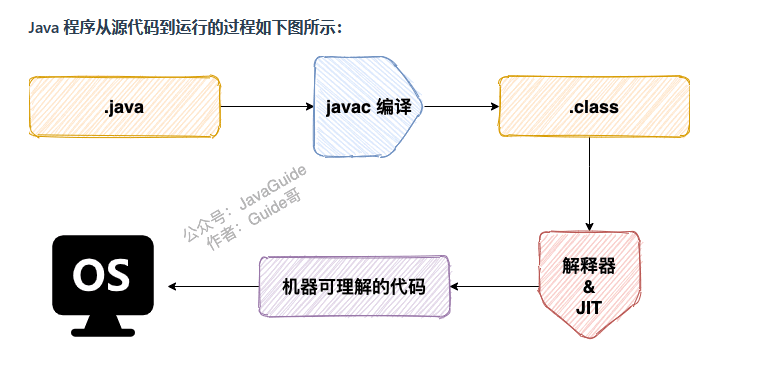

需要格外注意的是 `.class->机器码` 这一步。在这一步 JVM  类加载器首先加载字节码文件，然后通过解释器逐行解释执行，这种方式的执行速度会相对比较慢。而且，有些方法和代码块是经常需要被调用的(也就是所谓的热点代码)，**所以后面引进了 JIT（just-in-time compilation） 编译器，而 JIT 属于运行时编译。当 JIT  编译器完成第一次编译后，其会将字节码对应的机器码保存下来，下次可以直接使用。**而我们知道，机器码的运行效率肯定是高于 Java  解释器的。这也解释了我们为什么经常会说 **Java 是编译与解释共存的语言** 。


在Java代码中，存在一些热点代码（即，经常被执行的方法或代码块），这些热点代码可以通过JIT（即时编译）编译成机器码，从而提高代码的运行效率。

> 检测热点代码的方法被称为热点探测法，主要有两种：【检查栈顶、方法计数器】
>
> 1. 基于**采样**的**热点探测**：JVM会**周期性地检查栈顶**，经常出现在栈顶的方法就是热点方法
> 2. 基于**计数器**的热点探测：为**每个方法建立计数器**，当方法的执行次数超过阈值就会被认为是热点方法


### 谈谈Java中的分层编译

Java分层编译（Tiered Compilation），是一种折中的编译策略。因为编译优化需要收集大量的中间信息，所以越高级的优化，编译阶段就越耗时。因此，Java的分层编译器在初期会先采用级别较低的优化，以快速获得编译结果；后期再采用级别较高的优化，以得到运行速度更快的代码。

> 0. 解释执行
> 1. C1编译器，不开启性能监控
> 2. C1编译器，开启部分性能监控
> 3. C1编译器，开启全部性能监控
> 4. C2编译器，采取激进优化策略，以得到优化程度更高的代码


### 谈谈Java中的提前编译

AOT提前编译（Ahead Of Time）：**JDK1.9**之后引入，能够减少初次启动的时间，但编译质量不如JIT。

>   JDK 9 引入了一种新的编译模式 AOT(Ahead of Time Compilation)，它是直接将字节码编译成机器码，这样就避免了  JIT 预热等各方面的开销。JDK 支持分层编译和 AOT 协作使用。但是 ，AOT 编译器的编译质量是肯定比不上 JIT 编译器的


### 为什么说Java语言“编译与解释共存”？


1. JDK1.9支持AOP、JIT两种**编译技术**，同时也支持JVM**解释执行技术**。
2. Java代码先被**编译**为Java字节码，后经过JVM**解释**执行。


## JAVA基础

### JAVA语言的特点

1. 具有面向对象三大特性（封装、继承、多态）

2. 支持网络编程和并发安全编程

3. 一次编译，到处运行（即具有平台无关性，基于JVM实现）

    

### Java和C++的异同

- 共同点：都是面向对象的程序设计语言，支持面向对象三大特性。

- 不同点：（1）Java更安全（不提供指针访问内存）；（2）Java提供自动的内存管理机制（无需手动释放内存）；（3）Java语法上不支持多继承（但可以通过实现多个接口来实现多继承）。

    > C语言中的字符串需要用字符'\0'来表示字符串结尾；Java中的字符串是一个String类型的对象，底层是一个字符数组，由数组的length属性记录字符串长度，外部调用length()方法可以返回字符串的长度。

    


### import java 和 import javax 的区别？

在JDK的早期版本中，java包属于核心类库，javax包属于扩展类库；但随着时间的推移，javax也逐渐成为了核心类库的一部分。


### 字符型常量和字符串常量的区别？

1. 形式上：字符用单引号，字符串用双引号。
2. 本质上：字符常量相当于一个整型值（ASCII），可以参与表达式运算；字符串常量实际上是一个指向字符串对象的引用。
3. 所占空间大小：字符常量占两个字节，字符串常量占若干字节。


### *new String() 和字符串常量池

>   我之前理解错了！！！！注意
>
>   -   new String：【先堆再常】无论如何会在堆上创建新的字符串对象。 先去堆中创建一个字符串ab，返回堆中的引用。再在常量池观察有无字符串ab，若有则不管，若无则创建一个字符串对象
>
>   -   字符串对象的intern()方法:【先常后堆】如果常量池中存在，则返回常量池中的引用，如果没有则拷贝堆中的引用到常量池。（因为常量池移到堆空间中了）

1. new String()：总是在**堆**上创建字符串对象。先在**常量池**创建一个字符串，再去堆中创建一个字符串ab，**返回堆中的引用**。

    ```java
    String str1 = new String("ab"); 
    ```

2. 通过字面量创建字符串：先尝试从**常量池**中获取，若不存在，则直接在常量池生成一个字符串并返回引用，**常量池中的引用**。

    ```java
    String = "abc";
    ```

3. 字面量的+操作：在编译阶段合并，相当于通过字面量创建。

4. 对象的+操作：实际调用StringBuilder下的append()方法，会创建新的对象。

5. 调用字符串对象的intern()方法：先尝试从常量池中获取，若不存在，则JDK1.7之前会拷贝字符串对象到常量池并返回引用；**JDK1.7以后会直接复制堆上引用到常量池。**

示例一（JDK1.7以后）

```java
String str1 = new String("ab") + new String("cd"); // 两个对象相加，相当于创建了一个新的字符串对象
str1.intern(); // 常量池中没有"abcd"，因此直接将堆中"abcd"对象的引用拷贝到常量池
String str2 = "abcd"; // 常量池中有"abcd"，直接返回引用
System.out.println(str1==str2); // true
```

示例二（JDK1.7以后）

```java
String str1 = new String("ab"); // 这里会先根据字面量在常量池中创建一个字符串"ab"，然后再到堆中创建一个字符串"ab"，返回堆中的引用
String str2 = str1.intern(); // 因为常量池中存在"ab"，所以返回常量池中的引用
System.out.println(str1==str2); // false
```

测试intern

```java
public class StringInter {
    public static void main(String[] args) {
        String s = new String("1");
        s.intern();
        String s2 ="1";
  		System.out.println(s == s2);// 1


        String s3 = new String("1") + new String("1");
        s3.intern();
        String s4 = "11";
  		System.out.println(s3 == s4);//2
    }
}
```

在jdk6中，结果为 false false

在jdk7/8中, 结果为false true


```java
String s1 = "coder" + s2;
```

首先必须明确String的final，不会变的

如果常量池中不存在"codercoder"的结果，则无论有没有new，都会在堆创建新的对象，然后创建常量池的的变量指向了堆的地址

如果存在，则直接调常量池中的字面量

>   一定注意区别是intern会复制堆里的引用
>
>   而当字面量不存在时，是在堆中创建了对象，然后又存入了字面量（不是引用）

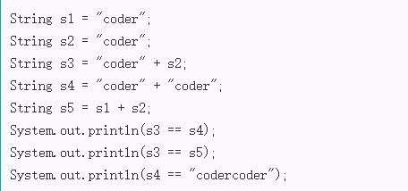

所以结果是：

s1，s2在常量池

s3指向堆的引用

s4在常量池

s5在常量池

则结果为：false false true


### String str = new String("abc") 创建了几个对象？

答：1-2个，执行步骤如下

1.   首先在**堆**中（不是常量池）创建一个指定的对象"abc"，并让str引用指向该对象(**第一个对象**)
2.   在**字符串常量池**中查看，是否存在内容为"abc"字符串对象
     -   若存在，则将new出来的字符串对象与字符串常量池中的对象联系起来
     -   若不存在，则在字符串常量池中创建一个内容为"abc"的字符串对象(**第二个对象**)，并将堆中的对象与之联系起来

>   需要注意的是：
>
>   str本身指向的是字符串对象的引用，其在栈中，不是对象
>
>   此处的对象指存在堆中的（常量池、堆）


### 字符串相加时发生了什么？

1. 字面量的+操作：在编译阶段合并（优化），相当于通过字面量创建。

    >   ```java
    >   String str = "abc" + "def";
    >   ```
    >
    >   在编译时已经被合并成“abcdef”字符串，因此，只会创建1个对象。并没有创建临时字符串对象abc和def，这样减轻了垃圾收集器的压力。

2. 对象的+操作：实际调用StringBuilder下的append()方法，会创建新的对象。

    >   ```java
    >   String str1 = new String("ab") + new String("cd"); // 两个对象相加，相当于创建了一个新的字符串对象
    >   ```
    >
    >   创建了4个字符串对象和1个StringBuilder对象，最后生成的“abcd”不保存在常量池中
    >
    >   ```java
    >   new StringBuilder().append("ab").append("cd").toString();
    >   ```

​	字符串相加时，底层会调用StringBuilder对象的append()方法进行拼接，再调用toString()方法返回新的字符串，该方法会new一个新的字符串对象进行返回。


### 8种基本类型包装类和常量池

在8种基本类型包装类中， 除了浮点型包装类（Float、Double）没有常量池以外，其他6种都实现了常量池：

- 4种整型包装类（Byte、Short、Integer、Long）：缓存范围 `[-128, 127]`。
- 1种字符型包装类（Character）：缓存范围 `[0, 127]`。
- 1种布尔型包装类（Boolean）：缓存范围 `True/False`。

简单应用场景

```java
Integer i1 = 40; // 自动装箱，在常量池中创建，valueOf,调用的是缓存
Integer i2 = new Integer(40); // 在堆中创建
System.out.println(i1 == i2); // 输出 false
```

> 注意：+操作符不适合Integer对象，做计算时需要自动拆箱；使用==操作符比较Integer和常数时，也需要自动拆箱。


int和Integer、new Integer进行比较时，结果永远为true。Integer 会拆箱，intValue 返回值是值

Integer与new Integer()进行==比较时，结果永远为false。地址

Integer与Integer进行==比较，看范围，<128为true，否则为false。缓存


字符串常量池：1.6之前在方法区，1.7之后在堆中

运行时常量池：之前在方法区，1.8之后在元空间

基本类型包装类常量池：


由final修饰的常量存放在哪里？取决于是局部变量、成员变量、类变量

[1](https://zhuanlan.zhihu.com/p/428694393)


### 什么是字节码？采用字节码的好处？

**java中的编译器和解释器：**

Java中引入了虚拟机的概念，即在机器和编译程序之间加入了一层抽象的虚拟的机器。这台虚拟的机器

在任何平台上都提供给编译程序一个的共同的接口。

编译程序只需要面向虚拟机，生成虚拟机能够理解的代码，然后由解释器来将虚拟机代码转换为特定系统的机器码执行。在Java中，这种供虚拟机理解的代码叫做 **字节码**（即扩展名为 .class的文件），它不面向任何特定的处理器，**只面向虚拟机**。


每一种平台的解释器是不同的，但是实现的虚拟机是相同的。Java源程序经过编译器编译后变成字节码，字节码由虚拟机解释执行，虚拟机将每一条要执行的字节码送给解释器，解释器将其翻译成特定机器上的机器码，然后在特定的机器上运行。这也就是解释了Java的编译与解释并存的特点。


**Java源代码---->编译器---->jvm可执行的Java字节码(即虚拟指令)---->jvm---->jvm中解释器----->机器可执行的二进制机器码---->程序运行。**


**采用字节码的好处：**

Java语言通过字节码的方式，在一定程度上解决了传统解释型语言执行效率低的问题，同时又保留了**解释型语言可移植**的特点。所以Java程序运行时比较高效，而且，由于字节码并不专对一种特定的机器，

因此，Java程序无须重新编译便可在多种不同的计算机上运行。


### int和Integer区别，都需要实例化再使用吗？

int不用，int是基本类型

Integer是int的包装类，需要实例化再使用。

基本类型与其对应的包装类型之间的赋值使用自动装箱与拆箱完成。


### 说一下String，StringBuilder和StringBuffer的区别

>   1.   是否可变
>   2.   线程是否安全
>   3.   性能

**String 类**中使用 final 关键字修饰字符数组来保存字符串，private final char value[]，所以String 对象是不可变的。每次对String类型的字符串进行改变时，都会生成一个新的String对象，然后将引用指向新对象。


StringBuilder 与 StringBuffer 都继承自 AbstractStringBuilder 类，在AbstractStringBuilder中也是使用字符数组保存字符串char[]value但是没有用 final关键字修饰，所以这两种对象都是可变的。StringBuilder和StringBuffer每次都会对自身进行操作，而不是生成新的对象并改变引用。


StringBuffer 对方法加了同步锁或者对调用的方法加了同步锁synchronized，所以是线程安全。StringBuilder 并没有对方法进行加同步锁，所以是非线程安全的。


总结：

低高

耗时：StringBuilder <  StringBuffer < String

场景：

1.   不需要经常改变字符串内容时: 适用 String 

2.   单线程操作字符串缓冲区下操作大量数据: 适用 StringBuilder 

3.   多线程操作字符串缓冲区下操作大量数据: 适用 StringBuffer 

     >   优先使用StringBuilder，多线程使用共享变量时使用StringBuffer


### Java访问修饰符有哪些？都有什么区别？

回答：Java中的修饰符有public protected  default private 

1、public：public表明该数据成员、成员函数是对所有用户开放的，所有用户都可以直接

进行调用

2、private：private表示私有，私有的意思就是除了class自己之外，任何人都不可以直接

使用，私有财产神圣不可侵犯嘛，即便是子女，朋友，都不可以使用。

3、protected：protected对于子女、朋友来说，就是public的，可以自由使用，没有任何

限制，而对于其他的外部class，protected就变成private。子类和包

defalut:包


### 怎么获取**private**修饰的变量

回答：private通过反射获取，可以设置setAccessable为true实现

```java
 
    // 1. 创建实例
    MyTestBean myTestBean = new MyTestBean();
 
    // 2. getDeclaredFields()：获取类的所有声明的成员属性字段，包括public、private和proteced，但是不包括父类的申明字段。
    Field[] fields = MyTestBean.class.getDeclaredFields();
 
    // 遍历所有成员属性（testStr，testStrTwo）
    for (int i = 0; i < fields.length; i++) {
        // 3. 设为可访问私有变量
        fields[i].setAccessible(true);
 
        System.out.println(fields[i].getName() + " : " + fields[i].get(myTestBean));        
        /*  私有变量key : 私有变量value
            testStr : null
            testStrTwo : display
         */
    }
```

```java
//方法二：通过反射获取
        Class<?> testGetPrivate1 = Class.forName("TestGetPrivate");
        Object o = testGetPrivate1.newInstance(); //实例
        Field[] declaredFields = testGetPrivate1.getDeclaredFields(); //方法
        for (Field declaredField : declaredFields) {
            declaredField.setAccessible(true);
            System.out.println(declaredField.getName() + " " + declaredField.get(o));
        }
```


### ==和equals

总结：

==：

- 如果用于基本类型的比较，则比较的是基本类型的值；
- 如果用于引用类型的比较，则比较的是对象的地址，即判断两个引用是否指向同一个对象。

equals()：

- 如果没有重写equals()方法，就等价于“==”；

    ```java
    public boolean equals(Object obj) { // Object类中的equals()方法
        return (this == obj);
    }
    ```

- 如果重写了equals()方法，通常作用就是比较两个对象的内容是否相等。

    

==对比的是**栈中的值**，基本数据类型是变量值，引用类型是堆中内存对象的地址

对于**基本类型**来说，== 比较的是**值**是否相等；

对于**引用类型**来说，== 比较的是两个**引用**是否指向同一个对象地址（两者在内存中存放的地址（堆内存地址）是否指向同一个地方）；

对于引用类型（包括包装类型）来说，**equals** 如果没有被重写，对比它们的**地址**是否相等；如果 equals()方法被**重写**（例如 String），则比较的是地址里的**内容**。


equals：object中默认也是采用==比较，通常会重写

**Object**

```java
public boolean equals(Object obj) { 
	return (this == obj); 
}
```

**String**


上述代码可以看出，String类中被复写的equals()方法其实是比较两个字符串的内容。

>   先比较地址是否一样，一样则一定相同
>
>   不一样的情况下，依次比较内容


### equals和hashcode

**作用**

hashcode是为了**提高查找元素**的效率。如果想判断一个元素特别多的set中是否存在某个值，那么可以先对值求hashcode，再从相同hashcode的值中进行equals比较，比较是否有这个值存在。避免对所有值进行equals的比较。hashCode() 的作用是获取哈希码，也称为散列码；它实际上是返回一个int整数。这个哈希码的作用是确定该对象在哈希表中的索引位置。

Object：

```java
public native int hashCode();

public boolean equals(Object obj) {
    return (this == obj);
}
```

String:

R 一般取 31，因为它是一个奇素数，如果是偶数的话，当出现乘法溢出，信息就会丢失，因为与 2 相乘相当于向左移一位，最左边的位丢失。并且一个数与 31 相乘可以转换成移位和减法：`31*x == (x<<5)-x`，编译器会自动进行这个优化。

```java
public int hashCode() {
    int h = hash;
    //hash的初始值为0
    if (h == 0 && value.length > 0) {
        // 字符串数组化
        char val[] = value;
        // 以31为权，每一位为字符的ASCII值进行运算，用自然溢出来等效取模
        for (int i = 0; i < value.length; i++) {
            h = 31 * h + val[i];
        }
        hash = h;
    }
    //如果有hash则直接返回了
    return h;
}

public boolean equals(Object anObject) {
    // ==比较两个对象的地址是不是一致，如果一致说明是引用同一个对象直接返回true
    if (this == anObject) {
        return true;
    }
    // 先判断对象是不是String类的实例，然后比较字符串中的内容，如果一致返回true，如果不一致返回false。
    if (anObject instanceof String) {
        String anotherString = (String)anObject;
        int n = value.length;
        if (n == anotherString.value.length) {
            char v1[] = value;
            char v2[] = anotherString.value;
            int i = 0;
            while (n-- != 0) {
                if (v1[i] != v2[i])
                    return false;
                i++;
            }
            return true;
        }
    }
    return false;
}
```


**同时重写的问题**

在Object对象中，hashCode()方法是一个本地方法，**默认返回的是一个由对象地址转换得到的整型值。**重写equals()方法时，必须重写hashCode()方法。如果没有重写hashCode()，则该class的两个对象无论如何都不会相等（即使这两个对象指向相同的数据）

等价的两个对象散列值一定相同，但是散列值相同的两个对象不一定等价，这是因为计算哈希值具有随机性，两个值不同的对象可能计算出相同的哈希值。

在覆盖 equals() 方法时应当总是覆盖 hashCode() 方法，保证等价的两个对象哈希值也相等。

```java
// 补充：进行比较时，还推荐使用Objects.equals()方法，该方法的源码如下
public static boolean equals(Object a, Object b) {
    return (a == b) || (a != null && a.equals(b)); // 进行非空判断，避免空指针异常
}
```


Object里面的equals一般默认表示，两个引用是否指向内存的同一的对象（**地址值**），而我们一般想比较的是**值**是否相等

Object里面的hashCode，一般是通过**地址值**生成的

所以一定要一起重写

**原则**

如果两个对象相等，则hashcode一定也是相同的

两个对象相等,对两个对象分别调用equals方法都返回true

两个对象有相同的hashcode值，它们也不一定是相等的

因此，equals方法被覆盖过，则hashCode方法也必须被覆盖


### static和final是什么，区别？

**final** 

final类不能被继承，没有子类，final类中的方法默认是final的

**final方法不能被子类的方法覆盖（重写），但可以被重载**

final成员变量表示常量，只能被赋值一次，赋值后不能再被改变

final不能用于修饰构造方法（构造器不是通过继承得到的，所以没有必要把它声明为final的）

private不能被子类方法覆盖，private类型的方法默认是final类型的 

final修饰的变量有三种：静态变量、实例变量和局部变量，分别表示三种类型的常量。

**注意：**final变量定义的时候，可以先声明，而不给初值，这中变量也称为final空白，无论什么情况，编译器都确保空白final在使用之前必须被初始化。

（1）修饰成员变量

如果final修饰的是**类变量**（static），只能在**静态初始化块**中指定初始值或者**声明该类变量**时指定初始值。

如果final修饰的是成员变量，可以在**非静态初始化块声明该变量**或者**构造器**中执行初始值。

（2）修饰局部变量

系统不会为局部变量进行初始化，局部变量必须由程序员**显式初始化**。因此使用final修饰局部变量时，即可以在定义时指定默认值（后面的代码不能对变量再赋值），也可以不指定默认值，而在后面的代码中对final变量赋初值（仅一次）

```java
public class FinalVar { 
    final static int a = 0;//类变量：在声明的时候就需要赋值 或者静态代码块赋值 
    /** 
    static{ 
    	a = 0; 
    }
    */
    final int b = 0;//成员变量：在声明的时候就需要赋值 或者非静态代码块中赋值 或者构造器赋值

    /*{ b = 0; }*/ 
    public static void main(String[] args) { 
        final int localA; //局部变量：只声明没有初始化，不会报错,与final无关。 
        localA = 0;//在使用之前一定要赋值 
        //localA = 1; 但是不允许第二次赋值 } 
    }
```

（3）修饰基本类型数据和引用类型数据

如果是基本数据类型的变量，则其数值一旦在初始化之后便不能更改；

如果是引用类型的变量，则在对其初始化之后便不能再让其指向另一个对象。**但是引用的值是可变的**。 


#### 扩展：为什么局部内部类和匿名内部类只能访问局部final变量？

外部类和内部类编译之后会生成两个class文件，Test.class Test1.class


首先需要知道的一点是: 内部类和外部类是处于**同一个级别**的，内部类不会因为定义在方法中就会随着方法的执行完毕就被销毁。

这里就会产生问题：当**外部类的方法结束时，局部变量就会被销毁了，但是内部类对象可能还存在**(只有没有人再引用它时，才会死亡)。这里就出现了一个矛盾：**内部类对象访问了一个不存在的变量**。

为了解决这个问题，就**将局部变量复制了一份作为内部类的成员变量**，这样当局部变量死亡后，内部类仍可以访问它，实际访问的是局部变量的"copy"。这样就好像**延长了局部变量的生命周期**

将局部变量复制为内部类的成员变量时，必须保证这两个变量是一样的，也就是如果我们在内部类中修改了成员变量，方法中的局部变量也得跟着改变，怎么解决问题呢？

就将局部变量设置为final，对它初始化后，我就不让你再去修改这个变量，就保证了内部类的成员变量

和方法的局部变量的一致性。这实际上也是一种妥协。使得局部变量与内部类内建立的拷贝保持一致。

**总结：**

内部类和外部类是同一级别的，但他们的生命周期可能不同，导致了内部类对象可能会访问一个不存在的变量（外部类局部变量在方法结束时会销毁），为了解决该问题内部类赋值外部类的局部变量作为内部类的成员变量，延长了局部变量的生命周期，为了保证和外部局部变量的值一直，则声明为final


#### 扩展：static

static表示“全局”或者“静态”的意思，用来修饰成员变量和成员方法，也可以形成静态static代码块，但是Java语言中没有全局变量的概念。 

被static修饰的成员变量和成员方法独立于该类的任何对象。也就是说，它不依赖类特定的实例，被类的所有实例共享。只要这个类被加载，Java虚拟机就能根据类名在运行时数据区的方法区内定找到他们。因此，static对象可以在它的任何对象创建之前访问，无需引用任何对象。

用public修饰的static成员变量和成员方法本质是全局变量和全局方法，当声明它类的对象，不生成static变量的副本，而是类的所有实例共享同一个static变量。 

-   类成员变量
-   静态变量（类变量）: static修饰
-   实例变量    : 无static修饰
-   局部变量


**static和final一起使用**

static final用来修饰成员变量和成员方法，可以理解为“全局变量”

对于变量，表示一旦给值就不可修改，并且通过类名可以访问。

对于方法，表示不可覆盖，并且可以通过类名直接访问。

注意：

对于被static和final修饰过的实例常量，实例本身不能再改变了，但对于一些容器类型（比如，ArrayList、HashMap）的实例变量，不可以改变容器变量本身，但可以修改容器中存放的对象。

**如果final修饰的是类变量，只能在静态初始化块中指定初始值或者声明该类变量时指定初始值。**


### 内存溢出和内存泄漏？场景？如何规避？

**内存溢出**

out of memory指程序要求的内存超出了系统所能分配的范围，出现out of memory；比如申请一个int类型，但给了它一个int才能存放的数，就会出现内存溢出，或者是创建一个大的对象，而堆内存放不下这个对象，这也是内存溢出。

**内存泄漏**

memory leak是指程序在申请内存后，无法释放已申请的内存空间(指分配出去的内存无法被gc回收)。一次内存泄露危害可以忽略，但内存泄露堆积后果很严重，无论多少内存,迟早会被占光。

因此，内存泄露可能会导致内存溢出。内存溢出会抛出异常，内存泄露不会抛出异常，大多数时候程序看起来是正常运行的。

**规避**

-   尽早释放无用对象的引用 
    好的办法是使用临时变量的时候，让引用变量在推出活动域后自动设置为null，暗示垃圾收集器来收集该对象，防止发生内存泄漏。
-   程序进行字符串处理时，尽量避免使用String，而应该使用StringBuffer。 
    因为String类是不可变的，每一个String对象都会独立占用内存一块区域。
-   尽量少用静态变量 
    因为静态变量是全局的，存在方法区，GC不会及时回收。（用永久代实现的方法区，垃圾回收行为在这个区域是比较少出现的，垃圾回收器的主要目标是针对常量池和类型的卸载）
-   尽量运用对象池技术以提高系统性能 
    生命周期长的对象拥有生命周期短的对象时容易引发内存泄漏，例如大集合对象拥有大数据量的业务对象的时候，可以考虑分块进行处理，然后解决一块释放一块的策略。
-   不要在经常调用的方法中创建对象，尤其忌讳在循环中创建对象 
    可以适当的使用hashtable，vector创建一组对象容器，然后从容器中去取这些对象，而不用每次new之后又丢弃。


### Java中的异常体系说一下？

回答：Java中的异常主要分为**Error和Exception** 


**Error** 指Java程序运行错误，如果程序在启动时出现Error，则启动失败；如果程序运行过程中出现Error，则系统将退出程序。出现Error是系统的内部错误或资源耗尽，Error不能在程序运行过程中被动态处理，一旦出现Error，系统能做的只有记录错误的原因和安全终止。【StackOverFlowError、VirtualMachineError、OutOfMemoryError】

>   Error无法处理，只能尽量避免；一旦遇到Error，JVM一般会选择线程终止。
>
>   **进程是怎么崩溃的？**
>
>   1.  CPU 执行正常的进程指令
>   2.  操作系统内核调用 kill 系统调用向进程发送信号
>   3.  进程收到操作系统发的信号，CPU 暂停当前程序运行，并将控制权转交给操作系统
>   5.  **操作系统根据情况执行相应的信号处理程序（函数），一般执行完信号处理程序逻辑后会让进程退出**
>
>   
>
>   **JVM是如何优雅的处理崩溃？**
>
>   JVM 自己定义了信号处理函数，这样当发送 kill pid 命令（默认会传 15 也就是 SIGTERM）后，JVM 就可以在信号处理函数中执行一些资源清理之后再调用 exit 退出。
>
>   
>
>   **为什么进程崩溃不会导致jvm崩溃？**
>
>    JVM 自定义了自己的信号处理函数，拦截了 SIGSEGV 信号，针对这两者不让它们崩溃。

**Exception** 指 Java程序运行异常，在运行中的程序发生了程序员不期望发生的事情，可以被Java异常处理机制处理。Exception也是程序开发中异常处理的核心，可分为RuntimeException（运行时异常）和CheckedException（检查异常），如下图所示


-   RuntimeException（运行时异常）：指在Java虚拟机正常运行期间抛出的异常， RuntimeException可以被捕获并处理，如果出现此情况，我们需要抛出异常或者捕获并处理异常。常见的有NullPointerException、ClassCastException、 ArrayIndexOutOfBoundsException等 

-   CheckedException（检查异常）：指在编译阶段**Java**编译器检查 CheckedException异常，并强制程序捕获和处理此类异常，要求程序在可能出现异常的地方通过try catch语句块捕获异常并处理异常。常见的有由于I/O错误导致的IOException、SQLException、ClassNotFoundException等。该类异常通常由于打开错误的文件、**SQL**语法错误、类不存等引起


**总结：**

Java中的所有异常都来自顶级父类Throwable。

Throwable下有两个子类Exception和Error。

Error是程序无法处理的错误，一旦出现这个错误，则程序将被迫停止运行。比如OOM

Exception不会导致程序停止，又分为两个部分RunTimeException运行时异常和CheckedException检查异常。

RunTimeException常常发生在程序运行过程中，会导致程序当前线程执行失败。CheckedException常常发生在程序编译过程中，会导致程序编译不通过。


### 异常的处理方式？

异常处理方式有**抛出异常**和使用**try catch**语句块**捕获异常**两种方式。

（1）**抛出异常：遇到异常时不进行具体的处理，直接将异常抛给调用者，让调用者自己根据情况处理。**抛出异常的三种形式：throws、throw和系统自动抛出异常。其中throws作用在方法上，用于定义方法可能抛出的异常；throw作用在方法内，表示明确抛出一个异常。

（2）**使用try catch捕获并处理异常**：使用try catch 捕获异常能够有针对性的处理每种可能出现的异常，并在捕获到异常后根据不同的情况做不同的处理。其使用过程比较简单：用try catch语句块将可能出现异常的代码包起来即可。

#### try-catch-finally

```java
// 代码示例
Scanner scanner = null;
try {
    scanner = new Scanner(new File("test.txt"));
    while(scanner.hasNext()) {
        System.out.println(scanner.nextLine());
    }
} catch (FileNotFoundException e) {
    e.printStackTrace();
} finally {
    if (scanner != null) {
        scanner.close();
    }
}
```

受检查异常如果不进行try-catch就无法通过编译。

try块用于捕获异常，其后可以有0~n个catch块（处理捕获的异常），如果没有catch块则必须要有finally块。

> 注意：finally会在return之前执行，如果finally中有返回语句，则直接在finally中完成返回。

`finally`块不会执行的三种情况：

1. 使用`System.exit()`退出程序

2. 线程死亡

3. CPU关闭

    

#### try-with-resources

```java
// 代码示例
try(Scanner scanner = new Scanner(new File("test.txt"))) {
    while(scanner.hasNext()) {
        System.out.println(scanner.nextLine());
    }
} catch (FileNotFoundException e) {
    e.printStackTrace();
}
```

- resources可以是任何实现`java.lang.AutoCloseable`或者`java.io.Closeable`的对象。
- resources总是在`catch/finally`执行之前完成关闭。
- 通过使用分号分隔，可以在`try()`中声明多个resources。


### 深拷贝、浅拷贝、引用拷贝

总结：

- 浅拷⻉：

    - 拷贝基本数据类型的值
    - 拷贝引用数据类型的对象地址。

- 深拷⻉：

    - 拷贝基本数据类型的值
    - 对于引用数据类型，会创建一个新的对象，并复制其中的内容。

    

深拷贝：完全复制整个对象，包含这个对象所包含的内部对象

浅拷贝：会在堆上创建一个新的对象（区别于引用拷贝），如果眼对象内部的属性是引用类型，则会直接复制内部对象的引用地址，也就是说拷贝对象和原对象用同一个内部对象。

引用拷贝：两个不同的引用指向同一个对象


浅拷贝特点 

(1) 对于基本数据类型的成员对象，因为基础数据类型是值传递的，所以是直接将属性值赋值给新的对象。基础类型的拷贝，其中一个对象修改该值，不会影响另外一个。

(2) 对于引用类型，比如数组或者类对象，因为引用类型是引用传递，所以浅拷贝只是把内存地址赋值给了成员变量，它们指向了同一内存空间。改变其中一个，会对另外一个也产生影响。


深拷贝特点 

(1) 对于基本数据类型的成员对象，因为基础数据类型是值传递的，所以是直接将属性值赋值给新的对象。基础类型的拷贝，其中一个对象修改该值，不会影响另外一个（和浅拷贝一样）。

(2) 对于引用类型，比如数组或者类对象，深拷贝会新建一个对象空间，然后拷贝里面的内容，所以它们指向了不同的内存空间。改变其中一个，不会对另外一个也产生影响。

(3) 对于有多层对象的，每个对象都需要实现 Cloneable 并重写 clone() 方法，进而实现了对象的串行层层拷贝。

(4) 深拷贝相比于浅拷贝速度较慢并且花销较大


### 注释

1. 单行注释

    ```java
    // 这是单行注释的示例
    ```

2. 多行注释

    ```java
    /* 
     * 这是第一个Java程序
     * 这是一个多行注释的示例
     */
    ```

3. 文档注释

    ```java
    /**
     * 这个类绘制一个条形图
     * @author runoob
     * @version 1.2
     */
    ```

> 实际上，好的代码本身就是注释，我们要尽量规范和美化自己的代码来减少不必要的注释。


### 标识符和关键字的区别

- 标识符，顾名思义，就是起到标识作用的符号。比如，变量名、方法名等。
- 关键字是一种特殊的标识符，在Java语言中有着特殊的意义和用途。比如，访问修饰符、基本类型标识符等。


### Java泛型、类型擦除、通配符的概念

#### Java泛型

概念：泛型是JDK1.5的新特性，本质是参数化类型，可用于**类、接口和方法**的创建。

优点：提供了**编译时类型安全检查**机制。

与普通的 Object 代替一切类型这样简单粗暴而言，泛型使得数据的类别可以像参数一样由外部传递进来。它提供了一种扩展能力。
当具体的类型确定后，泛型又提供了一种类型检测的机制，只有相匹配的数据才能正常的赋值，否则编译器就不通过。所以说，它是一种类型安全检测机制，一定程度上提高了软件的安全性防止出现低级的失误。
泛型提高了程序代码的可读性，不必要等到运行的时候才去强制转换，在定义或者实例化阶段。

注意：

泛型的类型参数只能是类类型（包括自定义类）

##### 泛型类

泛型类的定义

```java
public class Generic<T> {
    private T key;
    public Generic(T key) {
        this.key = key;
    }
    public T getKey() {
        return key;
    }
}
```

泛型类的使用（实例化一个泛型类）

```java
Generic<Integer> genericInteger = new Generic<Integer>(123);
```

##### 泛型接口

泛型接口的定义

```java
public interface Generator<T> {
    public T method();
}
```

泛型接口的使用（指定类型）

```java
class GeneratorImpl implements Generator<String> {
    @Override
    public String method() {
        return "hello";
    }
}
```

泛型接口的使用（不指定类型）

```java
class GeneratorImpl<T> implements Generator<T> {
    @Override
    public T method() {
        return null;
    }
}
```

##### 泛型方法

泛型方法的定义

```java
public static <E> void printArray(E[] inputArray) {
    for(E element : inputArray) {
        System.out.printf("%s ", element); // 自动调用toString()方法
    }
}
```

泛型方法的使用

```java
Integer[] intArray = {1, 2, 3};
String[] stringArray = {"Hello", "World"};
printArray(intArray);
printArray(stringArray);
```

#### 类型擦除

Java泛型是一种伪泛型，因为在编译期间，所有的泛型信息都会被擦除。

```java
List<String> list1 = new ArrayList<String>();
List<Integer> list2 = new ArrayList<Integer>();
System.out.println(list1.getClass() == list2.getClass()); // 因为存在类型擦除，所以编译阶段两个类都是ArrayList.class
```

基于这一点，直接反射调用add()方法添加不同类型的文件进同一个已经规定好泛型的集合。将`Integer`类型的对象插入到`ArrayList<String>`列表中。

>   反射是一种动态编译的实现，编译时会进行类型擦除
>
>   动态编译：
>
>   ```java
>   String className = getClassNameFromConfig();//从配置文件读取需要的类名
>   ```
>
>   由于jvm类加载器会将所有类事先加载进来，使用反射时会去查找当前类是否被加载进来。这样只要修改配置文件中的类名就可以更改需要的类型，不需要重新编译。

```java
public class Fanxing {
    public static void main(String[] args) throws NoSuchFieldException, SecurityException, NoSuchMethodException, IllegalAccessException, IllegalArgumentException, InvocationTargetException, InvocationTargetException {

        // 新建一个int集合，添加元素
        ArrayList<Integer> strArr =new ArrayList<Integer>();
        strArr.add(123);

        // 现在要将abc添加进去
        // 获取成员方法
        Class c = strArr.getClass();
        Method method = c.getMethod("add", Object.class);
        // 执行方法
        method.invoke(strArr, "abc");
        System.out.println(strArr);
    }
}
```

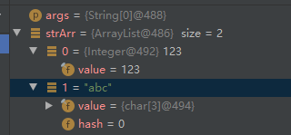

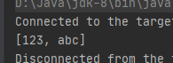

#### 通配符

常用通配符：

- ?，表示不确定的java类型
- T，表示具体的一个java类型（type）
- K，表示键（key）
- V，表示值（value）
- E，表示元素（element）


### Java中的基本数据类型和对应包装类

| 基本类型  | 位数 | 字节 | 默认值  | 包装类    |
| --------- | ---- | ---- | ------- | --------- |
| `int`     | 32   | 4    | 0       | Integer   |
| `short`   | 16   | 2    | 0       | Short     |
| `long`    | 64   | 8    | 0L      | Long      |
| `byte`    | 8    | 1    | 0       | Byte      |
| `char`    | 16   | 2    | 'u0000' | Character |
| `float`   | 32   | 4    | 0f      | Float     |
| `double`  | 64   | 8    | 0d      | Double    |
| `boolean` | 1    |      | false   | Boolean   |

基本数据类型、对象引用直接存放在Java虚拟机栈的局部变量表中；包装类对象存放在堆中。

> Java语言中基本类型的所占空间大小是固定不变的，不随机器硬件架构而变化。

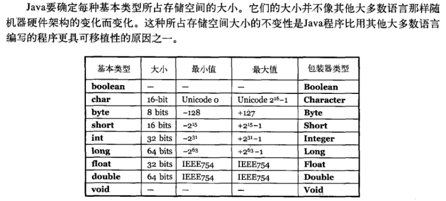


### 自动装箱与拆箱

自动装箱/拆箱，底层调用的都是包装类的方法

```java
int y = x;         // 拆箱 调用了 X.intValue() 常量池的字面量
```

- 装箱：将基本数据类型转换为对应的包装类型。常量池中的对象

    >`Integer i = 10` 等价于 `Integer i = Integer.valueOf(10)`

- 拆箱：将包装类型转换为对应的基本数据类型。

    > `int n = i` 等价于 `int n = i.intValue()`


### 包装类中的常量池技术

常量池技术的作用：

将一些常用的对象保存在常量池中，以减少频繁的对象创建工作。

包装类：

- `Byte`、`Short`、`Integer`、`Long` 这 4 种包装类默认创建了 `[-128,127]` 数值范围内的相应类型的缓存数据
- `Character` 创建了`[0,127]`数值范围内的缓存数据
- `Boolean` 直接返回 `True`或`False`。

缓存的范围区间大小是在性能和资源之间的权衡。

```java
Integer i1 = 40; // 调用了 Integer.valueOf(40),使用常量池中的对象,没有创建新的对象
Integer i2 = new Integer(40); // 创建了新的对象
System.out.println(i1==i2); // false
```


### 浮点数之间的等值判断应该用什么方法？

由于存在精度丢失的问题（与浮点数编码相关），所以一般不推荐使用`==`比较基本类型的浮点数，也不推荐使用包装类中的`equals()`方法比较包装类型的浮点数。

推荐使用`BigDecimal`来定义浮点数，然后进行浮点数的运算，最后使用`Objects.equals()`进行比较，或者调用`BigDecimal`对象的`compareTo()`方法。


### BigDecimal的构造方法

构造方法`BigDecimal(double)`存在精度丢失的问题，为了确保精度不丢失，推荐使用`BigDecimal(String)`方法来创建BigDecimal对象。

> `BigDecimal.valueOf(double)`方法内部使用了`Double.toString(double)`方法来确保精度。
>
> BigDecimal的实现利用了BigInteger。


### 基本数据类型和包装数据类型的选择

根据《阿里巴巴Java开发手册》的描述：

- 【强制】所有的 POJO 类属性必须使用包装数据类型。
- 【强制】RPC 方法的返回值和参数必须使用包装数据类型。
- 【推荐】所有的局部变量使用基本数据类型。

> 包装数据类型能够反映null和0的区别，更适合于实际业务场景。


### 在静态方法内调用非静态成员（属性/方法）为什么是非法的？

静态方法属于某个类，而不是某个对象，因此无法访问具体对象中的属性和方法。

我觉得是因为静态方法的启动顺序先于非静态，当调用静态方法的时候，里面的非静态成员可能还没有被初始化。

> 但是实例方法可以直接访问静态成员。


### Java中的内部类说一下

回答：内部类有四种，分别是静态内部类、局部内部类、匿名内部和成员内部类

静态内部类：常见的main函数就是静态内部类，调用静态内部类通过“外部类.静态内部类”

局部内部类：定义在**方法中的类**叫做局部内部类。

匿名内部类：是指继承一个父类或者实现一个接口的方式直接定义并使用的类，匿名内部类

>   **一个接口/类的**方法的**某个实现方式**在程序中**只会执行一次**，但为了使用它，我们需要创建它的实现类/子类去实现/重写。此时可以使用匿名内部类的方式，可以无需创建新的类，**减少代码冗余**。
>
>   ```java
>   public static void main(String[] args) {
>      Interface01 interface01 = new Interface01() {
>          @Override
>          public void show() {
>              System.out.println("这里使用了匿名内部类");
>          }
>      };
>      //调用接口方法
>      interface01.show();
>   }
>   
>   ```

成员内部类：和成员变量同一级的被称为成员内部类

没有class关键字，因为匿名内部类直接使用new生成一个对象


### 方法调用

在调用一个方法时，先从本类中查找看是否有对应的方法，如果没有再到父类中查看，看是否从父类继承来。否则就要对参数进行转型，转成父类之后看是否有对应的方法。总的来说，方法调用的优先级为：

- this.func(this)
- super.func(this)
- this.func(super)
- super.func(super)


### 为什么说Java中只有值传递

- 在Java中，基本类型参数传递的是基本类型的值，方法接收的是值的副本，无法修改原始变量的值；
- 在Java中，引用类型参数传递的是引用类型的值（也就是对象的地址），方法接收的是地址的副本，可以通过地址访问到相应的对象，但是**无法修改原始引用的指向。**


### 为什么静态方法不能被重写？

因为静态方法采用静态链接，编译期即可将符号引用转为直接引用。(也就是说不是动态链接，不存在重写)当子类具有和父类相同的静态方法时，父类的静态方法将不会被重写，而是被**隐藏**。

重写的目的在于父类引用可以根据子类对象的运行时实际类型不同而调用不同实现代码，从而表现出多态。

并且，**静态方法无需创建对象即可使用，而重写的方法发挥作用，需要父类引用，和（不同的）子类对象。**

因为不能重写，所以也就不存在多态。

```java
class Father{
    public static String method(){
        return "father";
    }
}
class Child{
    public static String method(){
        return "child";
    }
}
class Test{
    public static void main(String[] args){
        Father person = new Child();
        person.method(); // 返回"father"，因为静态方法不能被重写，所以不存在多态。
    }
}
```

> 成员变量无论是静态还是非静态，都只能被隐藏（因为成员变量不存在动态链接，也就没有所谓的重写）
>
> ```java
> class Demo {
> 	static class Parent {
>  	String name = "Parent";
> 	}
>  static class Child extends Parent{
>      String name = "Child";
>  }
> 	public static void main(String[] args) {
>   	Parent person = new Child();
>   	System.out.println(person.name); // "Parent"
> 	}
> }
> ```


### 成员变量与局部变量的区别

1. 成员变量属于类或对象，可以通过访问修饰符来设置访问权限；局部变量属于某一个方法。

2. 成员变量如果没有被显示赋初值，则会被赋予一个默认值；局部变量不会自动赋值。

    > 被final修饰的成员变量也必须显示赋初值。


### 创建对象用什么运算符，对象实体与对象引用的区别是什么？

创建对象使用`new`运算符。

`new`运算符可以创建对象实例（在堆内存中），对象引用（在栈内存中）负责指向对象实例。一个引用可以指向0或1个对象；一个对象可以被0~n个引用所指向。


### 类的构造方法的作用是什么？类如果没有声明构造方法会怎么样？

构造方法的作用：完成对类对象的创建和初始化工作。

当类中没有显示定义的构造方法时，JVM就会在编译期给类添加一个默认的无参构造方法；但是一旦手动添加了构造方法，就不会有默认的无参构造方法了。


### 构造方法的特点

1. 构造方法的方法名与类名相同，包括大小写
2. 构造方法没有返回值，且不能用`void`声明返回值。
3. 在使用`new`创建对象时，会根据给定的参数自动选择构造方法进行执行（构造方法的重载）。

> 构造方法属于特定的类，不能被继承，也不能被重写。


### Object类的常见方法

不允许子类重写的方法

```java
public final native Class<?> getClass() // native方法，用于返回当前运行时对象的Class对象，使用了final关键字修饰，故不允许子类重写。
    
public final native void notify() // native方法，并且不能重写。唤醒一个在此对象监视器上等待的线程(监视器相当于就是锁的概念)。如果有多个线程在等待只会任意唤醒一个。

public final native void notifyAll() // native方法，并且不能重写。跟notify一样，唯一的区别就是会唤醒在此对象监视器上等待的所有线程，而不是一个线程。

public final native void wait(long timeout) throws InterruptedException // native方法，并且不能重写。暂停线程的执行。注意：sleep方法没有释放锁，而wait方法释放了锁 。timeout是等待时间。

public final void wait(long timeout, int nanos) throws InterruptedException // 多了nanos参数，这个参数表示额外时间（以毫微秒为单位，范围是 0-999999）。 所以超时的时间还需要加上nanos毫秒。

public final void wait() throws InterruptedException // 跟之前的2个wait方法一样，只不过该方法一直等待，没有超时时间这个概念
```

允许子类重写的方法

```java
protected void finalize() throws Throwable { } // 实例被垃圾回收器回收的时候触发的操作

protected native Object clone() throws CloneNotSupportedException // native方法，用于创建并返回当前对象的一份拷贝（浅拷贝）。Object类本身没有实现Cloneable接口，所以不重写clone方法并且进行调用的话会发生CloneNotSupportedException异常。
    
public String toString() // 返回类的名字@实例的哈希码的16进制的字符串。建议Object所有的子类都重写这个方法。

public native int hashCode() // 默认返回由地址转换得到的int值
    
public boolean equals(Object obj) // 默认采用==进行比较
```


### 静态代码块、非静态代码块、构造方法的区别?

- 静态代码块在类加载时执行，主要对类中的静态成员变量进行初始化。

- 非静态代码块在`new`实例时执行，主要对所有的成员变量（包括静态和非静态）执行公共的初始化操作。
- 构造方法的**方法体**在非静态代码块执行之后执行，主要对某一对象执行特定的初始化操作。

```java
/*
	1、父类类加载
    2、子类类加载
    3、父类对象构造
    4、子类对象构造
*/
class Demo{
	static class Parent {
        static String name = "Parent";
        static {
            System.out.println(name);
            System.out.println("父类静态初始化块");
        }
        {
            System.out.println("父类非静态初始化块");
        }
        Parent(){
            System.out.println("父类构造方法");
        }
    }
    static class Child extends Parent{
        static String name = "Child";
        static {
            System.out.println(name);
            System.out.println("子类静态初始化块");
        }
        {
            System.out.println("子类非静态初始化块");
        }
        Child(){
            System.out.println("子类构造方法");
        }
    }

    public static void main(String[] args) {
        Parent person = new Child();
        System.out.println(person.name);
    }
}
```


### new一个类对象中各部分执行顺序（构造器的具体处理步骤）

new一个类对象类中各部分执行顺序：静态代码块 -> 非静态代码块 -> 构造函数 -> 一般方法。

子类继承父类各部分执行顺序为：

父静态代码块（初始化块） -> 子静态代码块 ->父非静态代码 （初始化块）-> 父无参构造函数 -> 子静态代码块 -> 子构造函数 -> 方法。


### 强虚软弱引用

引用：栈中的引用变量指向堆中的对象


强引用：new、反射创建的对象。不被gc回收。

软引用：当空间不足，被gc回收。内存敏感缓存。

弱引用：weakReference表示。被gc回收。有则用，无则创，常用于缓存。

虚引用：不能直接访问的对象。能再对象被Gc时，收到系统通知


- 强引用（使用最普遍）：只要强引用关系还在，即便发生OOM，GC也不会回收被强引用的对象。

    > 例子：`Object obj = new Object();`

- 软引用：描述一些非必须的对象，JVM会在内存不足时对其进行回收。

    > 例子：SoftReference类。
    >
    > 应用：可用来实现内存敏感的高速缓存，提高数据的获取速度。
    >
    > ```java
    > public class SoftReferenceDemo {
    > public static void main(String[] args) throws InterruptedException {
    >   // 100M的缓存数据
    >   byte[] cacheData = new byte[100 * 1024 * 1024];
    >   // 将缓存数据用软引用持有
    >   SoftReference<byte[]> cacheRef = new SoftReference<>(cacheData);
    >   // 将缓存数据的强引用去除
    >   cacheData = null;
    >   // 之后如果发现内存不足，会先尝试一次GC，如果第一次GC之后内存还是不足，就会回收软引用对象
    > }
    > }
    > ```

- 弱引用：GC的每次扫描都会将其回收，可以配合引用队列使用。

    > 例子：WeakReference类（WeakHashMap和ThreadLocal类中都使用了弱引用）。
    >
    > 应用：弱引用和**引用队列**，解决了在WeakHashMap中，键被回收后，值却无法被回收的问题——使用弱引用指向键，未被使用的键就会被gc回收，同时弱引用被加入到引用队列，之后Map会周期性检查引用队列，一旦发现被回收的键，就会删除整个的Entry。
    >
    > ```java
    > public class WeakReferenceDemo {
    > public static void main(String[] args) throws InterruptedException {
    >   // 100M的缓存数据
    >   byte[] cacheData = new byte[100 * 1024 * 1024];
    >   // 将缓存数据用弱引用持有
    >   WeakReference<byte[]> cacheRef = new WeakReference<>(cacheData);
    >   // 将缓存数据的强引用去除
    >   cacheData = null;
    >   // 之后如果发现内存不足，会先尝试一次GC，将弱引用对象回收
    > }
    > }
    > ```

- 虚引用：无法通过虚引用获得对象，主要用来跟踪对象被**垃圾回收的活动**，必须配合引用队列使用。

    > 例子：JVM直接内存的回收——JVM使用Unsafe类对直接内存进行分配和回收，通过堆中的对象来保存直接内存的引用，当该对象被回收时，指向直接内存的虚引用就会被加入引用队列，从而通知相应的线程对直接内存进行回收。


## 反射

### 什么是反射？

反射指的是在运行时动态获取类信息（属性和方法），动态调用类方法或对象方法的一种机制。

**利用反射机制获取Class对象的四种方式：**

```java
// 1. 直接获取 -> 不会执行静态代码块等初始化步骤
Class<?> demoClass1 = DemoClass.class;
// 2. Class.forName()
Class<?> demoClass2 = Class.forName("<包名>.DemoClass");
// 3. 通过对象实例的getClass()方法获取
DemoClass demo = new DemoClass();
Class<?> demoClass3 = demo.getClass();
// 4. 通过类加载器获取 -> 不会执行静态代码块等初始化步骤
Class<?> demoClass4 = ClassLoder.getSystemClassLoader.loadClass("<包名>.DemoClass");
```

**利用反射机制创建对象，并调用对象方法：**

```java
Class<?> demoClass = Class.forName("<包名>.DemoClass");
// 创建对象
DemoClass demo = (DemoClass) demoClass.newInstance();
// 获得方法列表
Method[] methods = demoClass.getDeclaredMethods();
// 获得指定方法，传入参数类型，然后调用
Method writeString = demoClass.getDeclaredMethod("writeString", String.class);
writeString.invoke(demo, "A simple demo.");
// 强行修改私有成员属性
Field value = demoClass.getDeclaredField("value");
field.setAccessible(true); // 私有方法在设置accessible为true以后也可以强行调用！
field.set(demo, "newValue");
```

### 反射的优缺点

- 优点：反射机制有助于降低代码的耦合性，提高程序的灵活性和可扩展性。
- 缺点：反射机制可能会带来某些安全问题，比如无视泛型参数的安全检查；此外，反射代码的性能会略有降低。


### 反射的应用场景

1. 动态代理
2. Spring注解


## I/O

### 序列化与反序列化

- 序列化：将对象转换为二进制字节流的过程。
- 反序列化：将序列化所产生的二进制字节流转换为对象。

> 序列化的主要目的是将对象存储到文件系统或数据库中，或者通过网络进行传输。

### 如何标记不想被序列化的字段？

使用 `transient` 关键字修饰不想进行序列化的字段（只能修饰变量，不能修饰类和方法）。

当对象被反序列化时，被 `transient` 修饰的变量值不会被持久化和恢复，**只会产生一个默认值**。

> 静态成员属性无法被序列化，因为它并不属于任何一个对象。

### 获取键盘输入的方法

1. 使用Scanner

    ```java
    Scanner input = new Scanner(System.in);
    String s  = input.nextLine();
    input.close();
    ```

2. 使用BufferedReader

    ```java
    BufferedReader input = new BufferedReader(new InputStreamReader(System.in));
    String s = input.readLine();
    ```

### I/O流的分类

- 按照流的流向分，可以分为输入流和输出流；
- 按照操作单元划分，可以划分为字节流和字符流；
- 按照流的角色划分为节点流和处理流。


Java IO 流共涉及 40 多个类，这些类看上去很杂乱，但实际上很有规则，而且彼此之间存在非常紧密的联系， Java IO 流的 40 多个类都是从如下 4 个抽象类基类中派生出来的。

- InputStream/Reader: 所有的输入流的基类，前者是字节输入流，后者是字符输入流。
- OutputStream/Writer: 所有输出流的基类，前者是字节输出流，后者是字符输出流。


### 为什么要有字节流和字符流？

字节到字符的转换过程比较耗时，且必须考虑编码问题，使用字符流可以节约我们的编码时间。


### 什么是I/O ？

根据冯.诺依曼结构，计算机结构分为 5 大部分：运算器、控制器、存储器、输入设备、输出设备。


用户空间的用户进程如果想执行 I/O 操作，就必须通过 **系统调用** 来间接访问内核空间。


### Unix系统下的I/O模型有哪些？

>   注意是**进程是否阻塞**，而不是cpu是否运行。
>
>   cpu轮询.
>
>   很多概念搞清楚主语就理起来顺多了

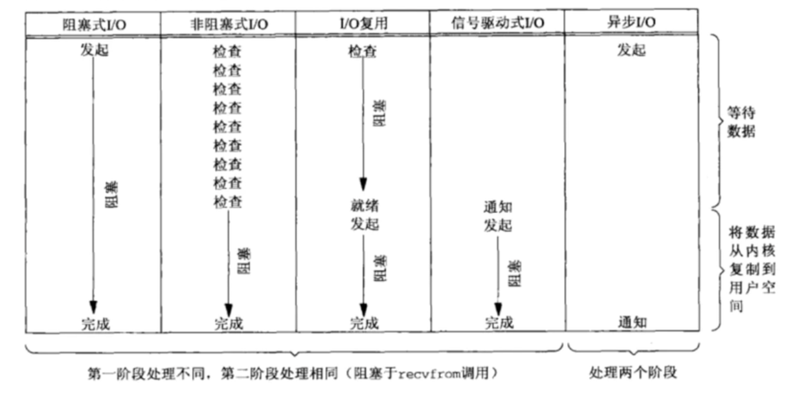

1. 同步阻塞式 I/O：用户进程执行I/O调用后阻塞，等待内核完成I/O操作并将数据拷贝到用户空间后，阻塞才结束。

2. 同步非阻塞 I/O：用户进程执行I/O调用后不阻塞，此时用户进程可以处理其他任务，并采用**用户进程轮询**的方式判断内核中的I/O操作是否完成，如果完成，就阻塞并等待数据拷贝到用户空间，然后阻塞结束。

    > 轮询操作需要额外消耗CPU，会产生较大延时，因此只适合于并发量较小，且不需要及时响应的网络应用。

3. I/O 多路复用：同时阻塞多个I/O调用，然后使用**内核轮询**或事件驱动的方式检测多个系统调用的可用状态，当某个数据准备好之后，就将数据复制到用户态（此过程仍然是阻塞的）。

    > 优点：只用一个线程，一个选择器，就可以同时处理大量I/O（如网络连接）。
    >
    > select：线性扫描所有监听的文件描述符，有最大数量限制。
    >
    > poll：同select，但数据结构不同，需要分配一个pollfd结构数组。
    >
    > epoll：没有大小限制，使用一个文件管理多个文件描述符，底层用红黑树存储，**用事件驱动代替了轮询**，优化了效率。

4. 信号驱动 I/O：用户进程执行I/O调用后不阻塞，此时进程可以处理其他任务，同时等待一个内核态I/O操作完成的信号，一旦完成就发送信号进行通知，用户进程随即进入阻塞，等待数据拷贝到用户空间后，阻塞结束。

5. 异步 I/O：用户进程执行I/O调用后不阻塞，此时进程可以处理其他任务，当内核态I/O操作完成后，自动将数据拷贝到用户空间，用户进程随即可从用户缓冲区中拿到数据。

### 内核缓冲区和用户缓冲区

内核空间和用户空间各有一个缓冲区：

- 内核缓冲区的目的是提高磁盘I/O效率，优化磁盘读写（比如缓冲区可以接收多次写操作的结果，待缓冲区满了再一次性写入——断电会导致缓冲区数据丢失）。

- 用户缓冲区的目的是为了减少系统调用的次数，降低用户态和内核态切换所耗费时间（用户进程可以从缓冲区读取已有的数据）。

### Java中的IO模型有哪些？

1. BIO（同步阻塞I/O）：并发度低。

2. NIO（非阻塞I/O）：可以看做是I/O多路复用模型，适用于高并发场景。NIO的实现依赖于选择器（selector），也被成为多路复用器。

    >   注意和同步非阻塞I/O进行区分。

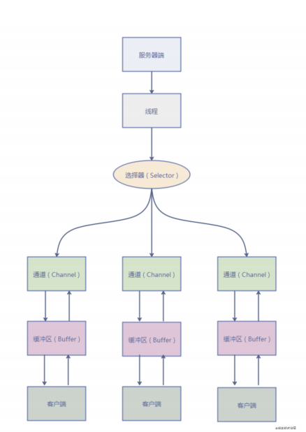

3.   AIO（异步I/O）：基于事件和回调机制实现，应用执行I/O调用后直接返回，不会阻塞，当内核态I/O操作完成后，自动将数据拷贝到用户空间，并通知相应线程进行后续操作。

## 容器和数据结构

### Java中的集合框架有哪些？

回答：Java 集合框架主要包括两种类型的容器，一种是集合（Collection），存储一个元素集合，另一种是图（Map），存储键/值对映射。

Collection 接口又有 3 种子类型，List、Set 和 Queue，再下面是一些抽象类，最后是具体实现类，常用的有 ArrayList、LinkedList、HashSet、LinkedHashSet、HashMap、 TreeMap、LinkedHashMap 等等。


#### List

- ArrayList：Object[]

- LinkedList：双向链表
- Vector：Object[]

#### Set

- HashSet：基于HashMap实现
- LinkedHashSet：继承自HashSet，增加了一个双向链表用来记录元素的插入顺序。
- TreeSet：基于TreeMap实现, 红黑树

#### Map

- HashMap：JDK1.8之前，采用数组+链表（采用“拉链法”解决哈希冲突）存储元素；JDK1.8之后，采用数组+链表/红黑树（当数组长度小于64时，先进行数组扩容；当链表长度大于8时，链表转为红黑树）存储元素。

    > 红黑树可以减少搜索时间。

- LinkedHashMap：在HashMap的基础上，增加了一条双向链表，以保持键值对的插入顺序，支持顺序访问。

- Hashtable：数组+链表实现。

- TreeMap：红黑树实现。

    

### 数组和链表

**数组：**

-   内存连续

-   数组支持随机访问，但插入删除的代价很高，需要移动大量元素；


**链表：**

-   内存不连续

- 链表不支持随机访问，但插入删除只需要改变指针。

    

### 栈和队列

**栈：（stack）**

先进后出

LinkedList : 

Stack：push入栈，pop出栈


**队列：(queue)**

先进先出

LinkedList :  offer入队列, poll出队列


### LinkedList和ArrayList？以及底层结构

1. **是否保证线程安全：** `ArrayList` 和 `LinkedList` 都是不同步的，也就是不保证线程安全；

2. **底层数据结构：** `Arraylist` 底层使用的是 **`Object` 动态数组**，连续内存存储，适合下标随机访问，适合查询，不适合数据插入删除；`LinkedList` 底层使用的是 **双向链表** 数据结构（JDK1.6 之前为循环链表，JDK1.7 取消了循环。），分散在内存中，适合做数据插入和删除，不适合查询。

    >   **注意**
    >
    >   -   ArrayList扩容机制
    >
    >       因为数组长度固定，超出长度存数据时需要新建数组，然后将老数组的数据拷贝到新数组，如果不是尾部插入数据还会涉及到元素的移动（往后复制一份，插入新元素），使用尾插法并指定初始容量可以极大提升性能、甚至超过linkedList（需要创建大量的node对象）
    >
    >   -   LinkedList的遍历
    >
    >       遍历LinkedList必须使用iterator不能使用for循环，因为每次for循环体内通过get(i)取得某一元素时都需要对list重新进行遍历，性能消耗极大。
    >
    >       另外不要试图使用indexOf等返回元素索引，并利用其进行遍历，使用indexlOf对list进行了遍历，当结果为空时会遍历整个列表。
    >
    >       ```java
    >       		Iterator it = listedList.iterator();
    >       		while(it.hasNext()){
    >       			System.out.println(it.next()+" ");
    >       		}
    >       ```

3. **内存空间占用：** `ArrayList` 的空 间浪费主要体现在在 list 列表的结尾会预留一定的容量空间，而 LinkedList 的空间花费则体现在它的每一个元素都需要消耗比 ArrayList 更多的空间（因为要存放**直接后继和直接前驱以及数据**）。

   >    ArrayList在进行插入/删除时需要逐个移位，LinkedList在进行查询时需要逐个遍历。
   
    


### 说说**ArrayList**的扩容机制？

回答：通过阅读ArrayList的源码我们可以发现当以无参数构造方法创建 ArrayList 时，实际上初始化赋值的是一个空数组。当真正对数组进行添加元素操作时，才真正分配容量。即

向数组中添加第一个元素时，数组容量扩为 **10**。当插入的元素个数大于当前容量时，就需要进行扩容了， **ArrayList** 每次扩容之后容量都会变为原来的 **1.5** 倍左右。 


以无参构造函数为例：

1. 初始化时创建一个空数组。

2. **第一次添加元素时**，才真正分配容量，默认的容量大小为**10**。

3. 如果`add()`操作使得元素个数超过当前容量，则**调用`grow()`方法进行扩容**。

4. 首先将容量**扩大为原来的1.5倍。**

    ```java
    int newCapacity = oldCapacity + (oldCapacity>>1);
    ```

5. 如果新容量`newCapacity`仍无法容纳所有元素，就将**新容量直接设置为元素个数`minCapacity`。**

6. 如果**新容量`newCapacity`超过了默认最大值**`Integer.MAX_VALUE-8`，则比较**元素个数`minCapacity`和默认最大值**`Integer.MAX_VALUE-8`——若不超过默认最大值，则取容量为`Integer.MAX_VALUE-8`；若溢出上限值`Integer.MAX_VALUE`则报错；否则扩容到上限值。

7. 最后把**原数组中的元素复制到扩容后的新数组中**。


### System.arraycopy() 和 Arrays.copyOf() 方法

相同点：两个方法都可用于复制原生数组。

不同点：

- System.arraycopy() 是一个native方法，用于将一个数组中的部分元素复制到另一个数组(需要自己定义)的某一连续区间。

    > 该方法也可用于数组元素的整体移动。

- Arrays.copyOf()：底层调用了`System.arraycopy()`，会返回一个新数组（自动创建）。

    > 该方法可用于ArrayList扩容。


### ArrayList中的ensureCapacity() 方法

可用于提前扩容，避免之后在循环添加元素的过程中，以增量的方式多次进行扩容。


### List和Set的区别

>   - List：有序存储，元素可重复。
>   - Set：无需存储，元素不可重复。
>   - Map：存储键值对，key不可重复。

**List**

特点：

有序、可重复、可有多个null值

访问：

使用iterator取出所有元素

```java
Iterator<String> it = strList.iterator();
        while (it.hasNext()) {
            String str = (String) it.next();
            System.out.println(str);
        }
```

get(int index)获取指定下标的元素

```java
for (int i = 0; i < stringList.size(); i++) {
    String str = stringList.get(i);
    System.out.println(str);
}
```

for-each

```java
for (String str : strList) {
            System.out.println(str);
        }
```


**Set**

特点：

无序、不可重复、只能有一个null值

访问：

用Iterator接口取得

```java
Set<String> set = new HashSet<String>();  
Iterator<String> it = set.iterator();  
while (it.hasNext()) {  
  String str = it.next();  
  System.out.println(str);  
}
```

用for-each

```java
for (String str : set) {  
      System.out.println(str);  
}
```


Map：存储键值对，key不可重复。


### list集合有哪些list？哪些list是并发安全的？

- `Arraylist`： `Object[]` 数组
- `Vector`：`Object[]` 数组
- `LinkedList`： 双向链表(JDK1.6 之前为循环链表，JDK1.7 取消了循环)

Vector 是线程安全的（⾥⾯⽅法都带有 synchronized 关键字），效率较低，现在使⽤较少 


### Java中线程安全的集合有哪些？

Vector：就比Arraylist多了个同步化机制（线程安全）。

Hashtable：就比Hashmap多了个线程安全。

ConcurrentHashMap:是一种高效但是线程安全的集合。

Stack：栈，也是线程安全的，继承于Vector。


### ArrayList和Vector的异同

相同点：它们都是List的实现类，底层都是用Object[]数组存储元素。

不同点：

- ArrayList类不是同步的，不能保证线程安全，但是在单线程场景下执行效率更高。

- Vector类中的所有方法都是同步的，能保证线程的安全性，但是单线程场景下会耗费大量时间。

    

### *如何得到一个线程安全的List？

1. 直接使用Vector

    `Vector`类的线程安全是通过给每个方法加`synchronized`来保证的，效率不高。

2. 使用Collections.synchronizedList()对List进行转换

    通过`Collections.synchronizedList()`方法可以将非同步的List转为同步的List——其原理是在方法外层使用`synchronized`对`mutex`对象进行加锁，效率较低。

3. 使用CopyOnWriteArrayList

    当读操作比较多的时候，更好的方案是使用JUC包下的`CopyOnWriteArrayList`类——其原理是在写操作之前，先使用一个可重入锁（ReentrantLock）进行加锁，然后复制一份数组进行操作，再用操作结果替换原数组——这样就可以实现只对写加锁，而不对读加锁，从而提高效率。

    > 但是如果写操作比较多，这种方案就会比较耗时——因为需要多次进行内存复制。


### 如何选用集合？（可以再细致一些）

根据应用场景进行选择：

1. 如果需要存储键值对就选Map接口下的类，如果需要排序就选TreeMap，否则选HashMap，如果需要保证线程安全就选ConcurrentHashMap。
2. 如果只需要存放元素，就选Collection接口下的类，如果需要保证唯一性就选Set接口下的TreeSet和HashSet，否则就选List接口下的ArrayList或LinkedList。

> 与普通数组相比，集合在操作上更加方便、灵活——可根据不同的应用场景选用不同的集合（如上所述）


### 随机访问接口的作用

`RandomAccess`接口中，并没有定义任何函数，仅起到一个标识作用。RandomAccess接口：这是一个标记接口,如果List子类实现了RandomAccess接口，那就表示它能够快速随机访问存储的元素。在对列表进行随机或顺序访问的时候，访问算法能够选择性能最佳方式。

该标识可以在二分查找算法中使用，比如在`binarySearch()`方法的源码中，它会先判断传入的集合是否实现了`RandomAccess`接口——如果是，就调用`indexedBinarySearch()`，基于索引的二分查找方法；否则调用`iteratorBinarySearch()`，基于迭代器的二分查找方法。

```java
public static void accessList(List list) {
            long startTime = System.currentTimeMillis();
            
            if (list instanceof RandomAccess) {
                System.out.println("实现了 RandomAccess 接口...");
                for (int i = 0; i < list.size(); i++) {
                    list.get(i);
                }
            } else {
                System.out.println("没实现 RandomAccess 接口...");
                for (Iterator iterator = list.iterator(); iterator.hasNext();) {
                    iterator.next();
                }
            }
            
            long endTime = System.currentTimeMillis();
            System.out.println("遍历时间：" + (endTime - startTime));
        }
```


### ArrayList的三种初始化方法

1. 无参构造：初始化时创建一个空数组。

2. 有参构造，参数为容量：初始化时以传入的参数为大小创建数组。

3. 有参构造，参数为集合：初始化时以集合元素的个数为大小创建数组，并拷贝集合元素。

    

### 对list、queue、stack中提供并发操作的容器有哪些？


list：

CopyOnWriteArrayList 是 `java.util.concurrent` 包提供的方法，它实现了**读操作无锁，写操作则通过操作底层数组的新副本来实现**，是一种读写分离（读读共享、写写互斥、读写互斥、写读互斥）的并发策略。

queue：

**单端阻塞队列**：其实现有 ArrayBlockingQueue、LinkedBlockingQueue、SynchronousQueue、LinkedTransferQueue、PriorityBlockingQueue 和 DelayQueue。

>   `Condition` 是个接口，依赖于 `Lock` 接口的实现，基本的方法就是 `await()` 和 `signal()` 方法。阻塞队列实际上是使用了Condition来模拟线程间协作。
>   调用Condition的await()和signal()方法，都必须在lock保护之内，就是说必须在lock.lock()和lock.unlock之间才可以使用 Conditon中的await()对应Object的wait()；

**单端非阻塞队列**：其实现是 **ConcurrentLinkedQueue。**
**双端非阻塞队列**：其实现是 ConcurrentLinkedDeque。

**双端阻塞队列**：其实现是 LinkedBlockingDeque。

>   使用阻塞算法的队列可以用一个锁（入队和出队用同一把锁）或两个锁（入队和出队用不同的锁）等方式来实现。非阻塞的实现方式则可以使用循环CAS的方式来实现。
>
>   **阻塞队列：**
>
>   阻塞队列（BlockingQueue）是一个支持两个附加操作的队列。这两个附加的操作支持阻塞的插入和移除方法。
>    1）支持阻塞的插入方法：意思是当队列满时，队列会阻塞插入元素的线程，直到队列不满。
>    2）支持阻塞的移除方法：意思是在队列为空时，获取元素的线程会等待队列变为非空。
>    阻塞队列常用于生产者和消费者的场景，生产者是向队列里添加元素的线程，消费者是从队列里取元素的线程。阻塞队列就是生产者用来存放元素、消费者用来获取元素的容器。
>
>    
>
>   **非阻塞队列：**
>
>   入队和出队操作均利用CAS(compare and set）更新，这样允许多个线程并发执行，并且不会因为加锁而阻塞线程，使得并发性能更好。


### 介绍下HashMap的数据结构，特点。放一个键值对的流程

**HashMap** **概述：**

1. HashMap 底层是⼀个**数组** ，数组中每个元素是⼀个**单向链表**（即，采⽤拉链法解决哈希冲突）。单链表的节点每个节点是 Node<K, V> 类型（⻅下源码） 

2. 同⼀个单链表中所有 Node 的 hash值不⼀定⼀样，但是他们对应的**数组下标⼀定⼀样**

- 数组下标利⽤哈希函数/哈希算法根据 hash值计算得到的 

4. HashMap 是**数组和单链表**的结合体 

    1. 数组查询效率⾼，但是增删元素效率较低 
    2. 单链表在随机增删元素⽅⾯效率较⾼，但是查询效率较低 
    3. HashMap 将⼆者结合起来，充分它们各⾃的优点 

5. HashMap 特点 

    1. **⽆序、不可重复**

        ⽆序：因为不⼀定挂在那个单链表上了 

    2. 为什么不重复？ 

        通过重写 equals ⽅法保证的

    3. **线程不安全**


**放一个键值对的流程(put)**

1.底层会调⽤ key 的 hashCode() ⽅法得出 hash 值

2.因为底层数组容量并不会像hashcode那么大，所以需要缩小hash值。并且缩小之前需要使用扰动函数处理hashcode，以减少碰撞。

> 
>
> ```java
> static final int hash(Object key) { // 通过加入移位和异或运算就可以减少碰撞。
> 	int h;
> 	return (key == null) ? 0 : (h = key.hashCode()) ^ (h >>> 16);
> }
> ```

3.根据hash值通过哈希算法与与运算得出数组下标（ (length-1)&hash

>   这里的n就是底层数组的长度，为了方便与操作能直接得到数组索引，就需要保证n为2的n次方。

3.如果数组下标元素为空，则将key和value封装为Entry对象（JDK1.7是Entry对象，JDK1.8 是Node对象）并放入该位置。

4.如果数组下标位置元素不为空，则要分情况

-   如果是在JDK1.7，则首先会判断是否需要扩容，如果要扩容就进行扩容，如果不需扩容就生成Entry对象，并使用头插法添加到当前链表中。

-   如果是在JDK1.8中，则会先判断当前位置上的TreeNode类型，看是红黑树还是链表Node

    -   如果是红黑树TreeNode，则将key和value封装为一个红黑树节点并添加到红黑树中去，在这个过程中会判断红黑树中是否存在当前key，如果存在则更新value。 

        >   如果下标位置上有但链表，此时会将当前 Node 中的 key 与链表上每⼀个节点中的 key 进⾏ equals ⽐较 
        >
        >   -   如果所有的 equals ⽅法返回都是 false，那么这个新节点 Node 将被添加到链表的末尾； 
        >
        >    -  如果其中有⼀个 equals 返回了 true，那么链表中对应的这个节点的 value 将会被新节点 Node 的value 覆盖。（保证了不可᯿复） 

    -   如果此位置上的Node对象是链表节点，则将key和value封装为一个Node并通过尾插法插入到链表的最后位置去，因为是尾插法，所以需要遍历链表，在遍历过程中会判断是否存在当前key，如果存在则更新其value，当遍历完链表后，将新的Node插入到链表中，**插入到链表后，会看当前链表的节点个**数，如果大于8，则会将链表转为红黑树

5.将key和value封装为**Node插入到链表或红黑树后，在判断是否需要扩容**，如果需要扩容，就结束put方法。


注： 

1. HashMap 中允许 key 和 value 为 null，但是只能有⼀个（不可重复）！ 

2. HashTable 中 key 和 value 都不允许为 null。 

3. 所谓拉链法，就是将链表和数组相结合，数组的每个单元存放一个链表，如果产生冲突，就将新元素加入链表。

    红黑树是一种自平衡二叉查找树，一定程度上能保证查找效率，避免二叉树退化为链表。

### 为什么HashMap的数组长度是2的次方？

数组下标的计算方法是“ `(n - 1) & hash`”

前提是 length 是 2 的 n 次方，则hash%length==hash&(length-1)

位运算快


### HashMap底层机制？扩容过程？get的过程? 并发安全？用安全的Map是什么？

>   **先判断链表的长度，看是否需要转为红黑树，是否扩容数组，再插入值**
>
>   **插入完值以后，再判断是否需要扩容**
>
>   8，《64，先插入，扩容【为什么转为红黑树前要先扩容，因为扩容可以改变链表映射关系，可能这条链上就不是8了】
>
>   9，》64 ，转为红黑树，插入
>
>   [完美答案](https://segmentfault.com/a/1190000040835511)

**底层机制**

HashMap继承了AbstractMap类，实现了Map，Cloneable，Serializable接口

HashMap的容量，默认是16

HashMap的加载因子，默认是0.75

当HashMap中元素数超过容量*加载因子时，HashMap会进行扩容。


JDK1.8 之前 `HashMap` 底层是 **数组和链表** 结合在一起使用也就是 **链表散列**。HashMap 通过 **key** 的 hashCode 经过扰动函数处理过后得到 hash 值，然后通过**(n - 1) & hash**  （范围在-2147483648 到 2147483647）判断当前元素存放的位置（这里的 n 指的是数组的长度），如果当前位置存在元素的话，就判断该元素与要存入的元素的 hash 值以及 key  是否相同，如果相同的话，直接覆盖，不相同就通过拉链法解决冲突。

扰动函数指的就是 HashMap 的 hash 方法。使用 hash 方法也就是扰动函数是为了防止一些实现比较差的 hashCode() 方法 换句话说使用扰动函数之后可以减少碰撞。

JDK 8 之后，对 HashMap 底层数据结构（单链表）进⾏了改进 

1. 如果单链表元素超过8个，则将单链表转变为**红⿊树**； （将链表转换成红黑树前会判断，如果当前数组的长度小于 64，那么会选择先进行数组扩容，而不是转换为红黑树）
2. 如果红⿊树节点数量⼩于6时，会将红⿊树新变为**单链表**。 

这种⽅式也是为了提⾼检索效率，⼆叉树的检索会再次缩⼩扫描范围。提⾼效率


**扩容过程**

HashMap的底层有数组 + 链表(红黑树)组成，数组的大小可以在构造方法时设置，默认大小为16，数组中每一个元素就是一个链表，jdk7之前链表中的元素采用头插法插入元素，jdk8之后采用尾插法插入元素，由于插入的元素越来越多，查找效率就变低了，所以满足某种条件时，链表会转换成红黑树。随着元素的增加，HashMap的数组会频繁扩容，如果构造时不赋予加载因子默认值，那么负载因子默认值为0.75,数组扩容的情况如下:

-   当添加某个元素后，数组的总的添加元素数大于了 数组长度 * 0.75(默认,也可自己设定),数组长度扩容为**两倍**。(如开始创建HashMap集合后，数组长度为16，临界值为16 * 0.75 = 12，当加入元素后元素个数超过12，数组长度扩容为32，临界值变为24)
-   在没有红黑树的条件下，添加元素后数组中某个链表的长度超过了8，数组会扩容为**两倍**.(如开始创建HashMap集合后，假设添加的元素都在一个链表中，当链表中元素为8时，再在链表中添加一个元素，此时若数组中不存在红黑树，则数组会扩容为两倍变成32，假设此时链表元素排列不变，再在该链表中添加一个元素，数组长度再扩容两倍，变为64，假设此时链表元素排列还是不变，则此时链表中存在10个元素，这是HashMap链表元素数存在的最大值，此时，再加入元素，满足了链表树化的两个条件(**1:数组长度达到64, 2:该链表长度达到了8)，该链表会转换为红黑树**


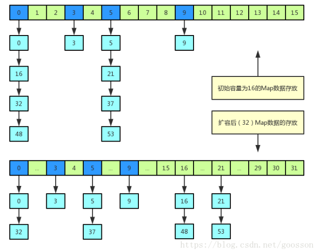

数组扩容前后不一样


**get()方法原理**

1. 先调⽤ key 的 hashCode() ⽅法得出 hash 值 

2. 通过哈希函数/哈希算法，将 hash 值转换为数组的下标 

3. 通过数组下标快速定位到数组中的某个位置： 

    如果这个位置上什么也没有（没有链表），则返回 null； 

    如果这个位置上有单链表，此时会将当前 Node 中的 key 与链表上每⼀个节点中的 key 进⾏ equals ⽐较。 

    ​	如果所有的 equals ⽅法返回都是 false，那么 get ⽅法返回 null； 

    ​	如果其中有⼀个 equals 返回了 true，那么这个节点的 value 便是我们要找的 value，此时 get ⽅法最终返回这个要找的 value。 

注： 

1. 放在 HashMap 中 **key 的元素**（或者放在 HashSet 中的元素）需要同时重写hashCode() 和 equals() ⽅法！！！ 

2. get的时间复杂度

    在理想状态下，及未发生任何hash碰撞，数组中的每一个链表都只有一个节点，那么get方法可以通过hash直接定位到目标元素在数组中的位置，时间复杂度为O(1)。

    若发生hash碰撞，则可能需要进行遍历寻找，n个元素的情况下，链表时间复杂度为O(n)、红黑树为O(logn)

    


**并发安全**

HashMap不是线程安全的，在并发情况下可能会造成Race Condition，形成环形链表从而导致死循环。在并发场景下要保证线程安全可以使用 Collections.synchronizedMap() 方法来包装HashMap；**Hashtable使用synchronized**来保证线程安全，所有访问HashTable的线程都必须竞争同一把锁，在线程竞争激烈的情况下效率非常低下。

基于此，**ConcurrentHashMap**应运而生。在 ConcurrentHashMap 中，无论是读操作还是写操作都能保证很高的性能：在进行读操作时(几乎)不需要加锁，而在写操作时通过锁分段技术（JDK1.7）只对所操作的段加锁而不影响客户端对其它段的访问。


HashMap是线程不安全的，其主要体现：

1.在jdk1.7中，在多线程环境下，扩容时会造成环形链或数据丢失。

2.在jdk1.8中，在多线程环境下，会发生数据覆盖的情况。


1.7 扩容时头插，容易造成死循环；扩容时容易造成数据丢失

1.8

如果线程 A 和线程 B 同时进行 put 操作，刚好这两条不同的数据 hash 值一样，并且该位置数据为 null，所以这线程 A、B 都会进入第 6 行代码中。假设一种情况，线程 A 进入后还未进行数据插入时挂起，而线程 B 正常执行，从而正常插入数据，然后线程 A 获取 CPU 时间片，此时线程 A 不用再进行 hash 判断了，问题出现：线程 A 会把线程 B 插入的数据给**覆盖**，发生线程不安全。

### **Hashtable和HashMap的区别**

**Hashtable**

-   底层数组+链表实现，无论key还是value都不能为null，线程安全，用synchronized修饰，实现线程安全的方式是在修改数据时锁住整个HashTable，效率低，单线程场景下会耗费大量时间，ConcurrentHashMap做了相关优化
-   初始size为11，扩容：newsize = oldsize*2+1
-   计算index的方法：index = (hash & 0x7FFFFFFF) % tab.length
-   Hashtable同样是基于哈希表实现的，同样每个元素是一个key-value对，其内部也是通过单链表解决冲突问题，容量不足（超过了阀值）时，同样会自动增长。


**HashMap**

-   底层数组+链表+红黑树实现，可以存储null键和null值，线程不安全
-   初始size为16，扩容：newsize = oldsize*2，size一定为2的n次幂
-   扩容针对整个Map，每次扩容时，原来数组中的元素依次重新计算存放位置，并重新插入
    插入元素后才判断该不该扩容，有可能无效扩容（插入后如果扩容，如果没有再次插入，就会产生无效扩容）
-   当Map中元素总数超过Entry数组的75%，触发扩容操作，为了减少链表长度，元素分配更均匀
-   计算index方法：index = hash & (tab.length – 1)
-   HashMap是基于哈希表实现的，每一个元素是一个key(数据类型必须一致)-value对，其内部通过单链表解决冲突问题，容量不足（超过了阀值）时，同样会自动增长。
-   HashMap是非线程安全的，只是用于单线程环境下，多线程环境下可以采用concurrent并发包下的concurrentHashMap。
-   HashMap 实现了Serializable接口，因此它支持序列化，实现了Cloneable接口，能被克隆。


**区别**

（1）线程是否安全： HashMap 是非线程安全的，HashTable 是线程安全的,因为HashTable 内部的方法基本都经过synchronized修饰。（如果你要保证线程安全的话就使用ConcurrentHashMap吧！）；

（2）对 **Null key** 和 **Null value** 的支持： HashMap可以存储 null 的 key 和 value，但null 作为键只能有一个，null 作为值可以有多个；HashTable 不允许有 null 键和 null 值，否则会抛出 NullPointerException。 

（3）初始容量大小和每次扩充容量大小的不同 ： 

​	① 创建时如果不指定容量初始值，Hashtable默认的初始大小为 11，之后每次扩充，容量变为原来的 2n+1。HashMap 默认的初始化大小为 16。之后每次扩充，容量变为原来的 2倍。

​	② 创建时如果给定了容量初始值，那么 **Hashtable 会直接使用你给定的大小，而 HashMap会将其扩充为 2 的幂次方大小**（HashMap 中的tableSizeFor()方法保证，下面给出了源代码）。也就是说 HashMap 总是使用 2 的幂作为哈希表的大小,后面会介绍到为什么是 2 的幂

次方。

（4）底层数据结构： JDK1.8 以后的 HashMap在解决哈希冲突时有了较大的变化，当链表长度大于阈值（默认为 8）（将链表转换成红黑树前会判断，如果当前数组的长度小于64，那么会选择先进行数组扩容，而不是转换为红黑树）时，将链表转化为红黑树，元素以内部类Node节点存在，以减少搜索时间。Hashtable 没有这样的机制。

（5）效率： 因为线程安全的问题，HashMap 要比 HashTable效率高一点。另外，HashTable基本被淘汰，不要在代码中使用它；


### HashMap和TreeMap的区别？

1、HashMap是通过hash值进行快速查找的；HashMap中的元素是没有顺序的；TreeMap中所有的元素都是有**某一固定顺序**的，如果需要得到一个有序的结果，就应该使用TreeMap； 

2、HashMap和TreeMap都是线程不安全的；

3、HashMap继承AbstractMap类；覆盖了hashcode() 和equals() 方法，以确保两个相等的映射返回相同的哈希值；**TreeMap继承SortedMap**类；他保持**键的有序顺序**；同时实现了NavigableMap接口，具备快速搜索集合内元素的能力。

4、HashMap：基于**hash表**实现的；使用HashMap要求添加的键类明确定义了hashcode() 和equals() （可以重写该方法）；为了优化HashMap的空间使用，可以调优初始容量和负载因子；TreeMap：基于**红黑树**实现的；TreeMap就没有调优选项，因为红黑树总是处于平衡的状态；

5、HashMap：适用于Map插入，删除，定位元素；TreeMap：适用于按**自然顺序或自定义顺序遍历键（**key）


### TreeSet是如何实现排序的？

TreeSet的底层是通过TreeMap实现的，TreeSet中的每个元素都是TreeMap中的键。

TreeMap的底层数据结构是红黑树，树中的每个结点都是一个静态内部类对象，实现了Map.Entry接口。插入元素时，会根据传入的Comparator或对象本身的CompareTo()方法进行比较，从而实现有序插入。最后，通过旋转和变色来维护红黑树的平衡。

```java
static final class Entry<K,V> implements Map.Entry<K,V> {
        K key;
        V value;
        Entry<K,V> left;
        Entry<K,V> right;
        Entry<K,V> parent;
        boolean color = BLACK;

        Entry(K key, V value, Entry<K,V> parent) {
            this.key = key;
            this.value = value;
            this.parent = parent;
        }
}
```

> TreeSet在添加元素时，实际上是在往TreeMap中添加键值对（元素作为键，一个假的Object对象作为值）。


### HashMap多线程操作有哪些隐患？HashMap会造成覆盖

- 在JDK1.7中，并发执行扩容操作时，会造成**循环链表或数据丢失**——原因是扩容时采用**头插法**将元素迁移到新数组，并发情况下可能会将链表顺序翻转，导致死循环或数据丢失的出现。
- 在JDK1.8中，并发执行**put**操作时，会产生数据覆盖的情况——虽然采用了**尾插法**来避免上述问题，但是在并发执行put操作时，两个元素的hash碰撞检查可能会失效，导致最终只有一个元素被添加（如果这两个元素正好相等倒还没有问题，但如果不相等就会导致数据覆盖）。

> 参考：https://blog.csdn.net/swpu_ocean/article/details/88917958
>
> 处理并发操作时还是推荐使用ConcurrentHashMap


### HashMap的遍历方式

1. 迭代器遍历EntrySet/KeySet

2. foreach遍历EntrySet/KeySet（我感觉这个最方便）

    ```java
    for (Integer key : map.keySet()) { // Entry的效率比Key高
        System.out.println(key + ":" + map.get(key)); // map.get(key)相当于还要做一次遍历查询
    }
    ```

3. lambda表达式遍历

    ```java
    map.forEach((key, value) -> {
        System.out.println(key + ":" + value); 
    });
    ```

4. Stream单线程/多线程遍历

    ```java
    // 单线程
    map.entrySet().stream().forEach((entry) -> {
        System.out.println(entry.getKey() + ":" + entry.getValue());
    });
    
    // 多线程
    map.entrySet().parallelStream().forEach((entry) -> {
        System.out.println(entry.getKey() + ":" + entry.getValue());
    });
    ```


### Comparable接口和Comparator接口

- **实现Comparable接口**后，需要实现CompareTo()方法

    ```java
    public class Person implements Comparable<Person> {
        private int age;
        public int getAge(){return age;}
        @Override
        public int compareTo(Person o) {
            return this.age - o.getAge();
        }
    }
    ```

- 也可以创建一个比较器，**实现Comparator接口**，重写compare()方法

    ```java
    Collections.sort(list, new Comparator<Integer>() {
        @Override
        public int compare(Integer o1, Integer o2) {
            return o2.compareTo(o1); // 逆序
        }
    });
    ```


### 无序性和不可重复性指的是什么？

- 无序性：元素并非是按添加顺序存储在数组中。

    > 如HashSet，就是根据哈希值选择位置进行存储。

- 不可重复性：元素添加后会根据equals()方法判断是否重复。

    > 需要根据情况重写equals()方法和hashCode()方法。


### HashSet如何检查重复元素？

1. 计算对象的hashcode以确定对象在数组中的位置。
2. 如果没有发现哈希相同的对象，则表示没有重复的对象出现。
3. 如果有哈希相同的对象，就进一步调用对象的equals()方法进行检查。

> 通过add()方法返回值，我们也能判断是否出现了重复的元素（true表示添加成功，没有重复；false表示添加失败，存在重复。


### HashSet和HashMap的关系

HashSet是基于HashMap实现的，除了clone()、readObject()、writeObject()这些方法是自己实现的，其他方法都调用了HashMap中的方法。


### HashTable和ConcurrentHashMap区别，以及currentHashmap在jdk7和jdk8实现上有什么变化

**Hashtable** 

Hashtable 使用 `synchronized` 来保证线程安全，效率非常低下。当一个线程访问同步方法时，其他线程也访问同步方法，可能会进入阻塞或轮询状态，如使用 put 添加元素，另一个线程不能使用 put 添加元素，也不能使用 get，竞争会越来越激烈效率越低。


**ConcurrentHashMap**

在 JDK1.7 的时候，`ConcurrentHashMap`（分段锁）对整个桶数组进行了分割分段(`Segment`)，每一把锁只锁容器其中一部分数据，多线程访问容器里不同数据段的数据，就不会存在锁竞争，提高并发访问率。 

到了 JDK1.8 的时候已经摒弃了 `Segment` 的概念，而是直接用 `Node` **数组+链表+红黑树**的数据结构来实现，**并发控制使用 `synchronized` 和 CAS** 来操作。（JDK1.6 以后 对 `synchronized` 锁做了很多优化） 整个看起来就像是优化过且线程安全的。（**CAS：Compare and Swap，即比较再交换**） 


**版本区别**


**jdk7：**

数据结构：**ReentrantLock**+**Segment**+**HashEntry**，一个Segment中包含一个HashEntry数组，每个HashEntry又是一个链表结构

元素查询：二次hash，第一次Hash定位到**Segment**，第二次Hash定位到元素所在的**链表的头部**

锁：Segment分段锁 Segment继承了ReentrantLock，锁定操作的Segment，其他的Segment不受影响，**并发度为segment个数**，可以通过构造函数指定，**数组扩容不会影响其他的segment**

get方法无需加锁，**volatile保证**


**jdk8：**

数据结构：**synchronized+CAS+Node数组+红黑树**（因为jdk8时对synchronized做了大量优化），**Node的val和next都用volatile修饰**（而不是Node本身被volatile修饰），保证可见性

锁：锁链表的head节点，不影响其他元素的读写，锁粒度更细，效率更高。**扩容时，阻塞所有的读写操作、并发扩容；查找，替换，赋值操作都使用CAS，而不使用synchronized。**

>   **CAS方式直接递增**：在线程竞争不大的时候，直接使用CAS操作即可，这里说的竞争不大指的是CAS操作不会失败的情况
>
>   synchronized：若出现了CAS操作失败的情况，则证明此时有线程竞争激烈了，则从CAS转为synchronized

读操作无锁：

Node的val和next使用volatile修饰，读写线程对该变量互相可见

数组用volatile修饰，保证扩容时被读线程感知

增加和删除、扩容都使用synchronized


### 说一下**ConcurrentHashMap**的底层实现，它为什么是线程安全的？

回答：在jdk1.7是 分段的数组**+**链表 ，jdk1.8的时候跟HashMap1.8的时候一样都是基于数组+链表/红黑树。

ConcurrentHashMap是线程安全的

（1）在jdk1.7的时候是使用分段所segment，每一把锁只锁容器其中一部分数据，多线程访问容器里不同数据段的数据，就不会存在锁竞争，提高并发访问率。

（2）在jdk1.8的时候摒弃了 Segment的概念，而是直接用 Node 数组+链表+红黑树的数据结构来实现，并发控制使用 **synchronized** 和 **CAS** 来操作。**synchronized只锁定当前链表或红黑二叉树的首节点。**


### HashMap源码中在计算hash值的时候为什么要右移**16**位？

回答：我的理解是让元素在HashMap中更加均匀的分布，具体的可以看下图，下图是《阿里调优手册》里说的

其实就是扰动函数，防止太规律的hash函数使碰撞更加激烈，打乱


### 容器中的设计模式

 **迭代器模式**


<div align="center">  </div><br>

**Collection 继承了 Iterable 接口**，其中的 iterator() 方法能够产生一个 Iterator 对象，通过这个对象就可以迭代遍历 Collection 中的元素。

从 JDK 1.5 之后可以使用 foreach 方法来遍历实现了 Iterable 接口的聚合对象。

```java
List<String> list = new ArrayList<>();
list.add("a");
list.add("b");
for (String item : list) {
    System.out.println(item);
}
```


**适配器模式**

java.util.Arrays#asList() 可以把数组类型转换为 List 类型。

```java
@SafeVarargs
public static <T> List<T> asList(T... a)
```

应该注意的是 **asList() 的参数为泛型的变长参数**，不能使用基本类型数组作为参数，**只能使用相应的包装类型数组**。

```java
Integer[] arr = {1, 2, 3};
List list = Arrays.asList(arr);
```

也可以使用以下方式调用 asList()：

```java
List list = Arrays.asList(1, 2, 3);
```


### 创建了一个类，有属性 String name； int age，重写的equals有两个字段，如果在hashset中放入这个类的实例，会出现什么问题？

应该是遇到同名和同年龄的问题？就会直接去重

想通过SET来实现对类中重复类进行去除，但是类中有些字段重复就认定该类型为重复类型

需要通过SET去除重复：

需要重写hashSet里的方法：

hashSet判断两个对象是否相等，会进行比较hashCode与equals方法

1：会先调用对象的hashCode方法获得hash的值，如果set中哈希表里面没有对应的hash值，则就认定，对象不存在重复的问题。

2：如果set中hash表里面有对应的hash值，就让后面的对象调用equals方法和之前的hash值不同的对象进行比较，如果返回为true就证明存在，不在储存，入伙返回为false则视为新对象，加入到set中。


### 二叉树的深度优先和广度优先区别

深度是dfs

广度是bfs


### 先序中序后序的访问顺序

递归序


### 红黑树

#### 进化过程：

线性查找：性能低

>   查找：O(n)
>
>   增加：O(n)
>   删除：O(n)

出现二叉搜索树（二分查找）：二查叉树会出现退化成链表的问题

>   查找：O(log2N)到O(n)【链表】
>
>   增加：O(log2N)到O(n)【链表】
>
>   删除：O(log2N)到O(n)【链表】+ 可能的一次或多次树的旋转操作

出现AVL平衡二叉树：数据变化有频繁更新节点效率低

>   查找：O(log2N)
>
>   增加：O(log2N)到O(n)【链表】+ 还可能进行额外的旋转操作
>
>   删除：O(log2N)到O(n)【链表】+ 可能的一次或多次树的旋转操作

出现红黑树

>   查找： O(logn)
>
>   ​	因为 h  <= 2 * log2(n+ 1) 
>
>   增加： O(logn)， 0(1)次的旋转操作
>
>   删除： O(logn)， 0(1) 次的旋转操作

总结：红黑树更多是一种折中的选择，它舍弃平衡二叉树的绝对平衡，换取节点插入时尽可能少的调整。


#### **适用条件：**

查找频繁：AVL树

插入删除频繁：红黑树


#### **基本属性：**

每个节点要么是红色要么是黑色

根属性：根节点必须是黑色的

叶子节点是黑色的（空指针NIL作为叶子结点了）

红属性：红节点的左右孩子必为黑，黑节点左右孩子可以为黑

黑属性：从任一节点出发到其每个叶子节点的路径，黑色节点的数量是相等的（保证平衡）


#### **基本结论：**

自平衡二叉树，但平衡性没有平衡二叉树好，不严格 < 1，没有一条路径会大于其他路径的2倍

黑色高度（bh）：从任一节点出发到其每个叶子节点的路径，黑色节点的数量。

任意一个节点x，**至少**有internal node的节点个数：2^bh(x)-1

>   推论：n >= 2^bh(root)-1


任意一个节点x，bh(x) >= h(x)/2

>   证明：2bh(x) >= bh(x) + rh(x) = h(x)/2

红黑树高度：h  <= 2 * log2(n+ 1) ( 100W个节点，红黑树最大树高40)，n为节点个数

>   证明：
>
>   因为，n >= 2^bh(root)-1
>
>   bh(root) >= h/2
>
>   所以，n>=2^h/2-1
>
>   则得出结论


#### 操作

**插入**

>   变色、旋转（左旋，右旋）

-   空：插入黑色（根）

​	   非空：总是插入红色，然后做如下调整：

-   如果**父节点是黑色**则完成；

​		如果**父节点是红色**则需要做如下调整：（start）

-   检查**父亲的兄弟**（uncle）

    -   如果是**红色**，则反转父亲兄弟和父亲的颜色，从红变黑，再

        -   检查**父亲的父亲**是否是根节点是根节点则结束
        -   不是根节点则重复以上操作(从 start 开始)使之变成红黑树（父亲不是根节点，把父亲变成红色）

        

    -   如果是黑色或者没有，需要适当旋转再着色

        

    

    

    

### 简述快排？时间复杂度

    快速排序的时间主要耗费在划分操作上，对长度为n的区间进行划分，共需n-1次关键字的比较，时间复杂度为O(n)。
    
        对n个元素进行快速排序的过程构成一棵递归树，在这样的递归树中，每一层最多对n个元素进行划分，所花的时间为O(n)。当初始排序数据随机分布，使每次分成的两个子区间中的元素个数大致相等时，递归树高度为log2n，快速排序呈现最好情况，即最好情况下的时间复杂度为O(nlog2n)。快速排序算法的平均时间复杂度也是O(nlog2n)。所以快速排序是一种高效的算法。

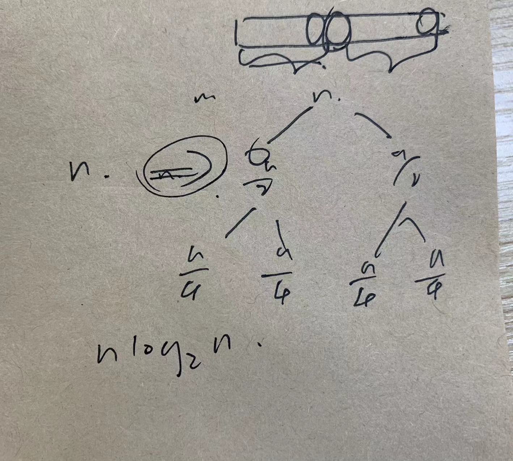

### Collections工具类

#### 排序操作

```java
void reverse(List list) // 反转
void shuffle(List list) // 随机排序
void sort(List list) // 按自然排序的升序排序
void sort(List list, Comparator c) // 定制排序，由Comparator控制排序逻辑
void swap(List list, int i , int j) // 交换两个索引位置的元素，必须得是list
void rotate(List list, int distance) // 旋转。当distance为正数时，将list后distance个元素整体移到前面；当distance为负数时，将list的前distance个元素整体移到后面 
```

#### 查找、替换

```java
int binarySearch(List list, Object key) // 对List进行二分查找，返回索引，注意List必须是有序的
int max(Collection coll) // 根据元素的自然顺序，返回最大的元素。
int max(Collection coll, Comparator c) // 根据定制排序，返回最大元素，排序规则由Comparatator类控制
void fill(List list, Object obj) // 用指定的元素代替指定list中的所有元素
int frequency(Collection c, Object o) // 统计元素出现次数
int indexOfSubList(List list, List target) // 统计target在list中第一次出现的索引，找不到则返回-1
boolean replaceAll(List list, Object oldVal, Object newVal) // 用新元素替换旧元素
```

#### 同步控制

```java
synchronizedCollection(Collection<T> c) // 返回指定collection支持的同步（线程安全的）Collection
synchronizedList(List<T> list) // 返回指定list支持的同步（线程安全的）List
synchronizedMap(Map<K,V> m) // 返回由指定map支持的同步（线程安全的）Map
synchronizedSet(Set<T> s) // 返回指定set支持的同步（线程安全的）Set
```


### *Arrays.asList()的作用

Arrays.asList()可以将一个数组转换为一个List，返回的List是一个内部类，实现了Serializable接口和RandomAccess接口。

```java
// String[]转为List<String>
String[] myArray = {"Apple", "Banana", "Orange"};
List<String> myList = Arrays.asList(myArray);
// 等价于
List<String> myList = Arrays.asList("Apple", "Banana", "Orange");
```

但是这个List底层仍然是数组，因此不能使用集合上的增删方法（可以使用`set()`方法进行修改），并且如果修改了原数组，那么集合也会同步发生改变。

```java
public class Arrays {
    // ...
    public static <T> List<T> asList(T... a) {
        return new ArrayList<>(a);
    }
    private static class ArrayList<E> extends AbstractList<E> 
        implements RandomAccess, java.io.Serializable {
        public E remove(int index) {
            throw new UnsupportedOperationException();
        }
    }
}
```

这是一种**适配器模式**，**只是转换接口**！！！也就是说适配器是方便访问的，起到接口的作用，而不太能进行修改

Arrays.asList()是泛型方法，**传入的参数必须是对象数组**，如果是基本类型数组，那么整个数组将被当作是一个单独的元素。

参考：[asList](https://blog.csdn.net/weixin_44364444/article/details/118858793)

### *如何将数组转为List？

int[] - > arraylist

1. 手动实现

    ```java
    public static <T> List<T> arrayToList(final T[] array) { // array声明为final，避免在方法体中被修改
        final List<T> l = new ArrayList<>(array.length);
        for(final T s : array) {
            l.add(s);
        }
        return l;
    }
    ```

2. 简便方法，asList

    只是接口上发生了变化，本质上还是array的底层，只能用于遍历

    ```java
    List list = new ArrayList<>(Arrays.asList("a", "b", "c"));
    ```

3. **使用Java8的`Arrays.stream().collect()`方法**

    ```java
    Integer [] myArray = { 1, 2, 3 };
    List myList = Arrays.stream(myArray).collect(Collectors.toList());
    
    // 基本类型也可以实现转换（依赖boxed的装箱操作）
    int [] myArray2 = { 1, 2, 3 };
    List myList = Arrays.stream(myArray2).boxed().collect(Collectors.toList());
    ```

4. 使用Java9的`List.of()`方法

    ```java
    List<String> str3=List.of("a","b");
    ```

    

### 如何将List转为数组？

使用`Collection.toArray()`方法，该方法是一个泛型方法，所以需要给方法传入泛型参数，否则默认返回Object类型数组。

```java
List<String> list = Arrays.asList("A","B","C");
String[] s = list.toArray(new String[0]);
```

> 如果需要反转数组，可以先将数组转为List，再使用Collections.reverse()方法，再将List转回数组。


###  foreach的本质

foreach的本质是一种语法糖，在遍历对象（实现了`Iterable`接口）的时候，实际调用对象的`iterator()`方法来产生迭代器，通过`hasNext()`判断遍历是否结束，通过`next()`获得需要遍历的元素。

>   语法糖：计算机语言中添加的某种语法，这种语法对语言的功能并没有影响，但是更方便程序员使用


### foreach的注意事项

不要在foreach循环中调用List对象的remove/add方法。删除元素请使用Iterator方式，如果存在并发操作，则需要对Iterator对象加锁。

>   为什么不能调用自身的remove/add方法，原因在于，在remove或者add的时候会更改list的长度！，导致循环的不正确

> fail-fast机制：列表在创建自身对应的迭代器后，如果调用了自身的remove/add方法，则迭代器会抛出ConcurrentModificationException。
>
> `java.util`包下面的所有的集合类都是fail-fast的，而`java.util.concurrent`包下面的所有的类都是fail-safe的。

为了方便，可以使用`Collection#removeIf()`方法删除满足特定条件的元素——方法底层实际帮我们创建了一个迭代器，并且调用了迭代器`next()`和`hasNext()``remove()`方法来移除满足特定条件的元素。

```java
private static void removeIfTest() {
        List<String> list = Lists.newArrayList("1","12","13","14","15","0");
        System.out.println("初始时："+ list.toString());
        list.removeIf(s -> s.contains("1"));
        System.out.println("过滤完：" + list.toString());
    }
```


### 6、数组、字符串、集合三者的长度分别如何获取？

- 数组：length属性
- 字符串：length()方法
- 集合：size()方法


## JVM

### JVM内存管理的优缺点

优点：无需手动编写内存分配与释放的代码，不容易出现内存泄露的溢出的问题。

缺点：一旦发生了内存泄露，如果不了解JVM内存管理机制，就会难以发现错误，修正问题。

### 为什么将永久代替换为元空间

JVM固定的大小上限，无法进行调整，利用本地内存，大大减少溢出

类的元信息，可加载类的元数据就更多了


### 字符串常量池为什么移到堆区 

因为永久代的GC回收效率太低，只有在full gc时才能执行gc，即时高效回收字符串内存


### JVM的内存模型

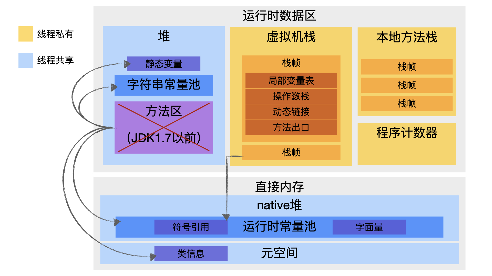

常量池是为了避免频繁创建和销毁对象而影响系统性能，而实现了系统的共享

运行时常量池：存放编译期生成的字面量和**符号引用**【加载时会替换为真实内存】静态会在编译时就替换

字符串常量池：在运行时数据区的堆区


**动态链接** 主要服务一个方法需要调用其他方法的场景。**在 Java 源文件被编译成字节码文件时，所有的变量和方法引用都作为符号引用（Symbilic  Reference）保存在 Class  文件的常量池【方法区】里**。**当一个方法要调用其他方法，需要将常量池中指向方法的符号引用转化为其在内存地址中的直接引用**。动态链接的作用就是为了将符号引用转换为调用方法的直接引用。


#### 私有

-   程序计数器：程序计数器：线程私有，记录当前线程所执行的字节码行号。一方面可以实现代码的流程控制，另一方面可以记录线程当前的执行位置以便于线程切换。

    >   执行本地方法时，程序计数器的值为空。

-   虚拟机栈：每个 Java 方法在执行的同时会创建一个**栈帧**。用于存储**局部变量表、操作数栈、常量池引用**等信息。从方法调用直至执行完成的过程，就对应着一个栈帧在 Java 虚拟机栈中入栈和出栈的过程。

    >   当线程请求的栈深度超出JVM所允许的最大深度时，就会抛出栈溢出错误；
    >
    >   当线程申请栈空间失败时，就会抛出内存溢出错误。

-   本地方法栈：和虚拟机栈所发挥的作用非常相似，区别是： 虚拟机栈为虚拟机执行 Java 方法 （也就是字节码）服务，而本地方法栈则为虚拟机使用到的 **Native** 方法服务。在 HotSpot 虚拟机中和 Java 虚拟机栈合二为一。

    （一个Native Method就是一个java调用非java代码的接口）

    **保证线程中的局部变量不被别的线程访问到**

#### 线程共有（进程）

堆和方法区是所有线程共享的资源，

-   **堆**是进程中最大的一块内存，主要用于存放**新创建的对象** (几乎所有对象都在这里分配内存)，

    >    当剩余堆空间不足以存放新对象时，就会抛出内存溢出错误。

-   **方法区**主要用于存放**已被加载的类信息、常量、静态变量、即时编译器编译后的代码**等数据。


### 堆和栈都存储了什么

#### 栈

每个 Java 方法在执行的同时会创建一个**栈帧**用于存储**局部变量表、操作数栈、常量池引用，动态链接，方法返回地址**等信息。从方法调用直至执行完成的过程，就对应着一个栈帧在 Java 虚拟机栈中入栈和出栈的过程（先进后出）。

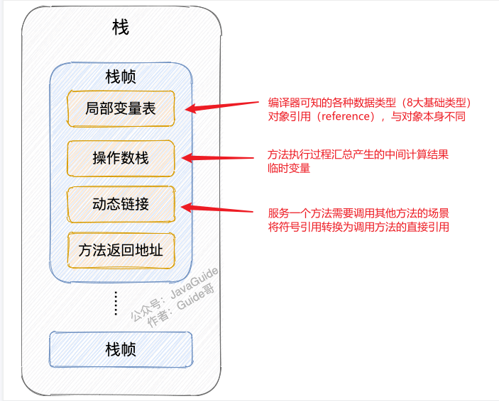


**局部变量表**  主要存放了编译期可知的各种数据类型（boolean、byte、char、short、int、float、long、double）、对象引用（reference 类型，它不同于对象本身，可能是一个指向对象起始地址的引用指针，也可能是指向一个代表对象的句柄或其他与此对象相关的位置）。

**操作数栈** 主要作为方法调用的中转站使用，用于存放方法执行过程中产生的中间计算结果。另外，计算过程中产生的临时变量也会放在操作数栈中。

**动态链接** 主要服务一个方法需要调用其他方法的场景。**在 Java 源文件被编译成字节码文件时，所有的变量和方法引用都作为符号引用（Symbilic  Reference）保存在 Class  文件的常量池【方法区】里**。**当一个方法要调用其他方法，需要将常量池中指向方法的符号引用转化为其在内存地址中的直接引用**。动态链接的作用就是为了将符号引用转换为调用方法的直接引用。


#### 堆

**唯一目的就是存放对象实例，几乎所有的对象实例以及数组都在这里分配内存。**

Java 堆是垃圾收集器管理的主要区域，因此也被称作 **GC 堆（Garbage Collected Heap）**.

JVM内存会划分为堆内存和非堆内存，堆内存中也会划分为**年轻代**和**老年代**，而非堆内存则为**永久代**（方法区-》元空间）。年轻代又会分为**Eden**和**Survivor**区。Survivor也会分为**FromPlace**和**ToPlace**，toPlace的survivor区域是空的。Eden，FromPlace和ToPlace的默认占比为 **8:1:1**。当然这个东西其实也可以通过一个 -XX:+UsePSAdaptiveSurvivorSizePolicy 参数来根据生成对象的速率动态调整


### 直接内存

直接内存并不属于JVM的运行时区域。

> 通过`ByteBuffer.allocateDirect()`方法可以实现堆外内存的分配，通过`DirectByteBuffer`对象可以实现堆外内存的存值/取值操作。
>
> ```java
> ByteBuffer byteBuffer = ByteBuffer.allocateDirect(1024); // 分配1024字节的堆外空间，内部调用的是native方法
> buffer.putInt(100); // 把整型变量存储到堆外内存
> int value = buffer.getInt(); // 从堆外内存读取整型变量
> System.out.println(value);
> System.gc(); // 最好主动回收直接内存（不是必须）—— 通过虚引用回收
> ```
>
> 参考：[DirectByteBuffer的分配与回收源码解析](https://blog.csdn.net/mycs2012/article/details/93513057?utm_medium=distribute.pc_relevant.none-task-blog-2%7Edefault%7EBlogCommendFromMachineLearnPai2%7Edefault-1.control&depth_1-utm_source=distribute.pc_relevant.none-task-blog-2%7Edefault%7EBlogCommendFromMachineLearnPai2%7Edefault-1.control)


### 逃逸分析的作用

JIT中，逃逸分析就是，当一个对象被new出来之后，它可能被外部所调用，如果是作为参数，返回值传递到外部了，就称之为方法逃逸。如果不是逃逸对象，则可以在栈上分配内存，不需要生成对象头，减少内存使用

> 方法逃逸：对象被作为参数传给其他方法，或者作为返回值返回给其他方法。
>
> 线程逃逸：对象被赋给类变量等能被其他线程访问到的变量。


### 为什么要将方法区的实现从永生代替换为元空间？

JDK1.8以前，方法区位于Java堆中，以永生代的方式实现；

JDK1.8以后，方法区就被**拆成了多个部分分别进行存储**，正式成为一种**逻辑**上的概念。方法区中的字符串常量和静态变量，都被存储到了Java堆中；方法区中的运行时常量池，被存储到了本地内存的native堆中；方法区中的类信息，被存储到了本地内存的元空间中。

这种变化的好处在于，**减少了对java堆空间的占用，更不容易出现内存溢出的问题**。

见图

> 设置元空间的初始大小：`-XX: MetaspaceSize=?`；设置元空间的最大大小：`-XX: MaxMetaspaceSize=?`


### 静态分派与动态分派

这两个概念与Java的多态特性有关。

首先是静态分派，它表示可以在编译期，通过变量的静态类型就可以确定重载的方法——采用静态解析的方式，将符号引用转为直接引用。（接口重载）

然后是动态分派，它表示需要在运行时，根据变量的动态类型来确定重写的方法——采用动态链接的方式，将栈内的动态链接转为直接引用。（多态 继承重写）

> 每个栈帧都包含一个动态链接，指向运行时常量池，需要被转为直接引用后才能找到栈帧所真正对应的方法。


### 常用内存分配策略

**分配内存**

分配方式有 **“指针碰撞”** 和 **“空闲列表”** 两种，选择哪种分配方式由 Java 堆是否规整决定，而 Java 堆是否规整又由所采用的**垃圾收集器是否带有压缩整理功能**决定。


**内存分配的两种方式**

-   指针碰撞 ： 
    -   适用场合 ：堆内存规整（即没有内存碎片）的情况下。
    -   原理 ：用过的内存全部**整合到一边**，没有用过的内存放在另一边，中间有一个分界指针，只需要向着没用过的内存方向将该指针移动对象内存大小位置即可。
    -   使用该分配方式的 GC 收集器：Serial, ParNew
    
-   空闲列表 ： 
    -   适用场合 ： 堆内存不规整的情况下。
    
    -   原理 ：虚拟机会维护一个列表，该列表中会记录**哪些内存块是可用的**，在分配的时候，找一块儿足够大的内存块儿来划分给对象实例，最后更新列表记录。
    
    -   使用该分配方式的 GC 收集器：CMS
    
        

**内存分配并发问题**

虚拟机采用两种方式来保证线程安全：

-   **CAS+失败重试：** CAS 是乐观锁的一种实现方式。所谓乐观锁就是，每次不加锁而是假设没有冲突而去完成某项操作，如果因为冲突失败就重试，直到成功为止。**虚拟机采用 CAS 配上失败重试的方式保证更新操作的原子性。**

-   **TLAB：** 为每一个线程预先在 Eden 区分配一块儿内存，JVM 在给线程中的对象分配内存时，首先在 TLAB 分配，当对象大于 TLAB 中的剩余内存或 TLAB 的内存已用尽时，再采用上述的 CAS 进行内存分配

    

乐观锁需要**操作和冲突检测**这两个步骤具备原子性，这里就不能再使用互斥同步来保证了，只能靠硬件来完成。硬件支持的原子性操作最典型的是：比较并交换（Compare-and-Swap，CAS）。CAS 指令需要有 3 个操作数，分别是内存地址 V、旧的预期值 A 和新值 B。当执行操作时，只有当 V 的值等于 A，才将 V 的值更新为 B。


### 垃圾收集器

1. Serial

    - 原理：串行收集器，单线程串行收集，GC时需要暂停其他工作线程。
    - 算法：新生代采用标记-复制，老年代采用**标记-整理**。
    - 特点：简单高效，适合于运行在客户端模式下的虚拟机。

    > Serial Old 是 Serial 的老年代版本。

2. ParNew

    - 原理：Serial的多线程版本，多线程并发收集，GC时需要暂停其他工作线程。
    - 算法：和Serial相同。
    - 特点：简单高效，适合于运行在服务端模式下的虚拟机。

3. Parallel Scavenge

    - 原理：和ParNew类似，区别在于提供了相关参数和自适应调整策略，以提高**吞吐量**（CPU使用率）。

        > 吞吐量 = 运行代码的时间/(运行代码的时间+垃圾收集的时间)

    - 算法：和Serial相同。

    - 特点：**JDK1.8默认使用 Parallel Scavenge** + Parallel Old。

    > Parallel Old 是 Parallel Scavenge 的老年代版本。

4. CMS

    - 原理：Concurrent Mark Sweep，并发标记清除收集器，目标在于**减少停顿**。

    - 算法：并发的**标记-清除**。
        - 初始标记：标记与GC Roots直接关联的对象。
        - 并发标记：并发标记其他可达的对象（即可达性分析）。
        - 重新标记：由于并发标记过程中，引用可能更新，因此需要暂停线程重新修改部分标记。
        - 并发清除：并发清除垃圾对象（此过程无需复制或整理，因此可以并发进行）。
    - 特点：并发、低停顿，但是容易产生**内存碎片**。

    > CMS通常作为老年代收集器，可与Serial或ParNew配合工作。

5. G1

    - 原理：Garbage-First收集器，**不再有明确的分代区域**，而是将堆空间化为为多个Region——每个Region都可以扮演老年代或新生代，通过一个优先级列表跟踪每个Region的回收价值，最后根据优先级进行Mixed GC。目标是**同时保证吞吐量和并发量**。避免full gc。

    - 算法：整体采用标记-清理法、局部采用标记-复制法。

        > 不会产生内存碎片，具体步骤与CMS类似，但是实现方式不同，最后回收的是Region。

    - 特点：JDK1.9默认使用 G1，适合于服务端，适合大对象分配内存。

6. ZGC

    - 原理：Z Garbage Collector，也基于Region布局，与G1的区别在于ZGC的Region可以动态创建和销毁。
    - 算法：标记-整理法。
    - 特点：实验性质、**低延迟**。


### GC如何判断对象可以被回收

-   引用计数法：给对象中添加一个引用计数器，每当有一个地方引用它，计数器就加 1；当引用失效，计数器就减 1；任何时候计数器为 0 的对象就是不可能再被使用的。

    >   **这个方法实现简单，效率高，但是目前主流的虚拟机中并没有选择这个算法来管理内存，其最主要的原因是它很难解决对象之间相互循环引用的问题。**可能会出现A 引用了 B，B 又引用了 A，这时候就算他们都不再使用了，但因为相互引用 计数器=1 永远无法被回收。

-   可达性分析法：从 GC Roots 开始向下搜索，搜索所走过的路径称为引用链。当一个对象到 GC Roots 没有任何引用链相连时，则证明此对象是不可用的，那么虚拟机就判断是可回收对象。(相当于从main函数开始到达的所有的对象)

    

    GC Roots的对象有：

    虚拟机栈(栈帧中的本地变量表）中引用的对象

    方法区中类静态属性引用的对象

    方法区中常量引用的对象

    本地方法栈中JNI(即一般说的Native方法)引用的对象

    

    

    

### **对象可以被回收，就代表一定会被回收吗？**

不可达对象还需执行一次`finalize()`方法，该方法只会被系统自动调用一次。如果该方法执行后为对象重新建立了引用链，那么对象就暂时不会死亡；否则，对象将面临回收。


即使在可达性分析法中不可达的对象，也并非是“非死不可”的，这时候它们暂时处于“缓刑阶段”，要真正宣告一个对象死亡，至少要经历**两次标记**过程；

1.   第一次是经过可达性分析发现没有与GC Roots相连接的引用链，第二次是在由虚拟机自动建立的Finalizer队列中判断是否需要执行finalize()方法。如果对象有必要执行finalize()方法，则被放入F-Queue队列中。否则销毁

>   当对象没有覆盖 `finalize` 方法，或 `finalize` 方法已经被虚拟机调用过时，虚拟机将这两种情况视为没有必要执行。

2.   被判定为需要执行的对象将会被放在一个队列中进行第二次标记，如果对象在finalize()方法中重新与引用链上的任何一个对象建立了关联，那么二次标记时则会将它移出“即将回收”集合。

>   finalize()是Object类的一个方法、一个对象的finalize()方法只会被系统自动调用一次，经过finalize()方法逃脱死亡的对象，第二次不会再调用。由于finalize()方法运行代价高昂，不确定性大，无法保证各个对象的调用顺序，不推荐大家使用，建议遗忘它。


### 垃圾回收策略

#### 标记-清除算法

该算法分为“标记”和“清除”阶段：首先标记出所有需要回收的对象，在标记完成后统一回收掉所有被标记的对象。它是最基础的收集算法，后续的算法都是对其不足进行改进得到。这种垃圾收集算法会带来两个明显的问题：

1.  **效率问题**
2.  **空间问题（标记清除后会产生大量不连续的碎片）**


#### 标记-复制算法

为了解决效率问题，“标记-复制”收集算法出现了。它可以将内存分为大小相同的两块，每次使用其中的一块。当这一块的内存使用完后，就将还存活的对象复制到另一块去，然后再把使用的空间一次清理掉。这样就使每次的内存回收都是对内存区间的一半进行回收。


应该就是Minor GC的机制把

这个算法的代价就是把内存缩水了，这样堆内存的使用效率就会变得十分低下了

不过它们分配的时候也不是按照1:1这样进行分配的，就类似于Eden和Survivor也不是等价分配是一个道理


#### 标记-整理算法

根据老年代的特点提出的一种标记算法，标记过程仍然与“标记-清除”算法一样，但后续步骤不是直接对可回收对象回收，而是让所有存活的对象向一端移动，然后直接清理掉端边界以外的内存


#### 分代收集算法

当前虚拟机的垃圾收集都采用分代收集算法，这种算法没有什么新的思想，只是根据对象存活周期的不同将内存分为几块。一般将 java 堆分为新生代和老年代，这样我们就可以根据各个年代的特点选择合适的垃圾收集算法。

**比如在新生代中，每次收集都会有大量对象死去，所以可以选择”标记-复制“算法，只需要付出少量对象的复制成本就可以完成每次垃圾收集。而老年代的对象存活几率是比较高的，而且没有额外的空间对它进行分配担保，所以我们必须选择“标记-清除”或“标记-整理”算法进行垃圾收集。**

**延伸面试问题：** HotSpot 为什么要分为新生代和老年代？

根据上面的对分代收集算法的介绍回答。


### JDK8默认的垃圾回收器

**1.7-1.8：Parallel Scavenge(新生代) + Parallerl Old（老年代）**

>   注意吞吐量和cpu资源敏感的场合，自适应调节策略
>
>   Parallel Scavenge收集器的目标则是达到一个可控制的吞吐量：标记复制
>
>   Parallerl Old: 标记整理

**1.9-11 : G1**

逻辑分区Region : Eden、S、old、Humongous内存区域

>   -   Humongous
>
>       **对于堆中的大对象，默认直接会被分配到老年代**，但是如果它是**一个短期存在的大对象，就会对垃圾收集器造成负面影响**。为了解决这个问题，G1划分了一个Humongous区，它用来专门存放大对象。G1的初衷就是为了避免FULL GC
>
>   -   特点
>
>       -   并发（可与应用程序同时执行）和并行
>
>       -   分代上看是分代型垃圾回收，但是不要求堆连续
>
>       -   同时兼顾年轻代和老年代
>
>       -   内存回收以region作为基本单位，region之间复制，整体可以看成标记-整理
>
>       -   可预测停顿时间模型
>
>       -   对部分区域进行内存回收，优先回收价值最大的Region，优先级
>
>       -   从经验上来说,**在小内存应用上CMS的表现大概率会优于G1**,而G1在大内存应用上则发挥其优势。平衡点在6-8GB之间
>
>           >   优先级
>           >
>           >   可控STW(stop the word)，减少stw时间和次数，避免full gc
>           >
>           >   基于标记整理，不产生垃圾碎片
>
>   -   过程
>
>       -   年轻代GC（young gc）
>       -   老年代并发标记
>       -   混合回收（mixed gc）
>       -   full gc（可选）

[参考链接](https://blog.csdn.net/weixin_45839894/article/details/120433487)

 

### CMS与G1的对比

#### CMS是标记清除算法

[CMS][https://cloud.tencent.com/developer/article/1624694]

概念：

CMS（Concurrent Mark Sweep）收集器是一种以获取最短回收停顿时间为目标的收集器，它是基于“标记-清除”算法实现的，并且常见的应用场景是**互联网站或者B/S系统的服务端上的Java应用**。


过程：

- 初始标记：标记与GC Roots直接关联的对象。
- 并发标记：并发标记其他可达的对象（即可达性分析）。
- 重新标记：由于并发标记过程中，引用可能更新，因此需要暂停用户线程重新修改部分标记。
- **并发清除**：并发清除垃圾对象（此过程无需复制或整理，因此可以**并发**进行）。


优点：

-   并发收集

-   低停顿

    

缺点：

-   垃圾碎片

-   晋升失败

    在进行Minor GC时，Survivor空间不足，对象只能放入老年代，而此时老年代也放不下造成的，多数是由于老年代有足够的空闲空间，但是由于碎片较多，新生代要转移到老年带的对象比较大,找不到一段连续区域存放这个对象导致的。


#### G1标记整理

概念：

Garbage-First收集器，**不再有明确的分代区域**，而是将堆空间化为为多个Region——每个Region都可以扮演老年代或新生代，通过一个优先级列表跟踪每个Region的回收价值，最后根据优先级进行Mixed GC。目标是**同时保证吞吐量和并发量**，避免full gc。


特点和优点：

-   2048个，逻辑分代

-   可控时间，按优先级收集

-   可控STW(stop the word)，减少stw时间和次数，避免full gc，（比CMS更短的停顿时间），不用一次把所有垃圾收集完

-   基于标记整理，不产生垃圾碎片


过程：

- 初始标记：标记与GC Roots直接关联的对象。，需要暂停用户线程
- 并发标记：并发标记其他可达的对象（即可达性分析）。可并发
- 最终标记：由于并发标记过程中，引用可能更新，因此需要暂停线程重新修改部分标记。
- **筛选回收**：对各个region的回收价值和成本进行排序，根据用户所期望的gc停顿时间制定回收计划。


除了实现上的不同外，具体的应用场景也有所不同：

- CMS适合于小内存应用，GC过程所产生的额外负载要小。
- G1适合于大内存应用，为大对象分配内存时不容易触发下一次GC。


### java从编写代码到最终运行的过程

编写的代码如何在各个操作系统上运行起来的？

java文件通过javac编译成.class字节码文件，然后 由jvm加载字节码，运行时解释器将字节码解释为机器码。在运行期间，即时编译器会针对热点代码将该部分字节码编译成机器码，以获得更高的执行效率。在整个过程中，即时编译器和解释器相互配合，提高速度。

 

java类加载（加载字节码的过程）

目的：把javac编译过的class文本文件通过加载，生成某种形式的class数据结构进入内存，程序可以调用这个数据结构构出object。该过程在运行时进行。

过程：

-   加载：读取一个【class文件】，将其转换成某种【静态数据结构】存储在【方法区,一些转到堆了】中，并在【堆】中生成一个便于用户调用的【java.lang.Class类型的对象】（用户主导：读取二进制流）

    >   加载器的作用就是把.class文件加载到内存中

-   验证：文件格式验证（字节码是否符合.class的格式要求） -> 元数据（对class的静态结构进行语法分析）、字节码验证（对class静态结构进行语义上的分析，保证其不会危害虚拟机的行为）-> 符号引用验证码（确保解析动作能正常执行，在解析阶段）

-   连接准备：正式为**类变量**分配内存并设置类变量初始值（只有类变量、静态变量）

    >   从概念上讲，类变量所使用的内存都应当在 **方法区** 中进行分配。不过HotSpot 已经把**原本放在永久代的字符串常量池、静态变量等移动到堆**中，这个时候类变量则会随着 Class 对象一起存放在 Java 堆中。
    >
    >   注意和初始化阶段区别，比如int 就赋值为0，而不是value，value赋值在初始化阶段

-   连接解析：符号引用替换为直接引用。

    >   一个类一个class

    一个java类A被编译成class之后,并且引用了类B，编译阶段A不知道B有没有被编译，并且此时类B没有被加载，所以不知道类B的实际地址。此时，在类A的class文件中，使用一个字符串S代表B的地址，S则被成为符号地址。

    运行时，A发生了类加载，解析时类B 还没加载，就触发B的类加载，将B加载到虚拟机中，类A的符号引用被替换成B的实际地址，这是直接引用。

    静态解析：A调用B的具体实现类

    动态解析： 类B是抽象类/接口，类C、D是B的实现类，此时不知道用B的哪个实现类进行替换。当运行时发生调用，此时虚拟机调用栈中得到了具体的类型信息，再进行直接引用替换 。

-   初始化（clinit）：主动资源初始化：成员变量的赋值、静态变量的赋值、静态代码块指令（用户主导：整个初始化部分） 


执行main方法的步骤如下:

1.  编译好 App.java 后得到 App.class 后，执行  App.class，系统会启动一个 JVM 进程，从 classpath 路径中找到一个名为 App.class 的二进制文件，将 App  的类信息加载到运行时数据区的方法区内，这个过程叫做 App 类的加载
2.  JVM 找到 App 的主程序入口，执行main方法
3.  这个main中的第一条语句为 Student student = new Student("tellUrDream") ，就是让 JVM  创建一个Student对象，但是这个时候方法区中是没有 Student 类的信息的，所以 JVM 马上加载 Student 类，把  Student 类的信息放到方法区中
4.  加载完 Student 类后，JVM 在堆中为一个新的 Student 实例分配内存，然后调用构造函数初始化 Student 实例，这个 Student 实例持有 **指向方法区中的 Student 类的类型信息** 的引用
5.  执行student.sayName();时，JVM 根据 student 的引用找到 student 对象，然后根据 student 对象持有的引用定位到**方法区中 student 类的类型信息的方法表**，获得 sayName() 的字节码地址。
6.  执行sayName()

其实也不用管太多，**只需要知道对象实例初始化时会去方法区中找类信息，完成后再到栈那里去运行方法。找方法就在方法表中找**


>Class 文件需要加载到虚拟机中之后才能运行和使用，那么虚拟机是如何加载这些 Class 文件呢？
>
>系统加载 Class 类型的文件主要三步：**加载->连接->初始化**。连接过程又可分为三步：**验证->准备->解析**。
>
>
>
>加载
>
>1.  通过全类名获取定义此类的二进制字节流
>2.  将字节流所代表的静态存储结构转换为方法区的运行时数据结构
>3.  在内存中生成一个代表该类的 `Class` 对象，作为方法区这些数据的访问入口
>
>虚拟机规范上面这 3 点并不具体，因此是非常灵活的。比如："通过全类名获取定义此类的二进制字节流" 并没有指明具体从哪里获取、怎样获取。比如：比较常见的就是从 `ZIP` 包中读取（日后出现的 `JAR`、`EAR`、`WAR` 格式的基础）、其他文件生成（典型应用就是 `JSP`）等等。
>
>**一个非数组类的加载阶段（加载阶段获取类的二进制字节流的动作）是可控性最强的阶段，这一步我们可以去完成还可以自定义类加载器去控制字节流的获取方式（重写一个类加载器的 `loadClass()` 方法）。数组类型不通过类加载器创建，它由 Java 虚拟机直接创建。**
>
>所有的类都由类加载器加载，加载的作用就是将 `.class`文件加载到内存
>
>加载阶段和连接阶段的部分内容是交叉进行的，加载阶段尚未结束，连接阶段可能就已经开始了。
>
>
>
> 连接
>
>1.验证
>
>
>
>2.   准备
>
>**准备阶段是正式为类变量分配内存并设置类变量初始值的阶段**
>
>这些内存都将在方法区中分配。对于该阶段有以下几点需要注意：
>
>1.  这时候进行内存分配的仅包括类变量（ Class Variables ，即静态变量，被 `static` 关键字修饰的变量，只与类相关，因此被称为类变量），而不包括实例变量。实例变量会在对象实例化时随着对象一块分配在 Java 堆中。
>2.  从概念上讲，类变量所使用的内存都应当在 **方法区** 中进行分配。不过HotSpot 已经把原本放在永久代的字符串常量池、静态变量等移动到堆中，这个时候类变量则会随着 Class 对象一起存放在 Java 堆中。
>
>这里所设置的初始值"通常情况"下是数据类型默认的零值（如 0、0L、null、false 等），比如我们定义了`public static int value=111` ，那么 value 变量在准备阶段的初始值就是 0 而不是 111（初始化阶段才会赋值）。特殊情况：比如给 value 变量加上了 final 关键字`public static final int value=111` ，那么准备阶段 value 的值就被赋值为 111。
>
>
>
>3.    解析
>
>解析阶段是**虚拟机将常量池内的符号引用替换为直接引用的过程**。解析动作主要针对类或接口、字段、类方法、接口方法、方法类型、方法句柄和调用限定符 7 类符号引用进行。
>
>符号引用就是一组符号来描述目标，可以是任何字面量。**直接引用**就是直接指向目标的指针、相对偏移量或一个间接定位到目标的句柄。在程序实际运行时，只有符号引用是不够的，举个例子：在程序执行方法时，系统需要明确知道这个方法所在的位置。Java  虚拟机为每个类都准备了一张方法表来存放类中所有的方法。当需要调用一个类的方法的时候，只要知道这个方法在方法表中的偏移量就可以直接调用该方法了。通过解析操作符号引用就可以直接转变为目标方法在类中方法表的位置，从而使得方法可以被调用。
>
>综上，解析阶段是虚拟机将常量池内的符号引用替换为直接引用的过程，也就是得到类或者字段、方法在内存中的指针或者偏移量。
>
>
>
>初始化
>
>初始化阶段是执行**初始化方法`<clinit> ()`方法**的过程，是类加载的最后一步，这一步 JVM 才开始真正执行类中定义的 Java 程序代码(字节码)。
>
>>   说明： `<clinit> ()`方法是编译之后自动生成的。
>
>对于`<clinit> ()` 方法的调用，虚拟机会自己确保其在多线程环境中的安全性。因为 `<clinit> ()` 方法是**带锁线程安全**，所以在多线程环境下进行类初始化的话可能会引起多个进程阻塞，并且这种阻塞很难被发现。
>
>对于初始化阶段，虚拟机严格规范了有且只有 5 种情况下，必须对类进行初始化(只有主动去使用类才会初始化类)：
>
>1.  当遇到 `new` 、 `getstatic`、`putstatic` 或 `invokestatic` 这 4 条直接码指令时，比如 `new` 一个类，读取一个静态字段(未被 final 修饰)、或调用一个类的静态方法时。 
>
>   -   当 jvm 执行 `new` 指令时会初始化类。即当程序创建一个**类的实例对象**。
>   -   当 jvm 执行 `getstatic` 指令时会初始化类。即程序访问类的**静态变量**(不是静态常量，常量会被加载到运行时常量池)。
>   -   当 jvm 执行 `putstatic` 指令时会初始化类。即程序给类的**静态变量赋值**。
>
>-   当 jvm 执行 `invokestatic` 指令时会初始化类。即程序调用类的**静态方法**。
>
>2.  使用 `java.lang.reflect` 包的方法对类进行**反射调用**时如 `Class.forname("...")`, `newInstance()` 等等。如果类没初始化，需要触发其初始化。
>3.  初始化一个类，如果其父类还未初始化，则先触发该父类的初始化。
>4.  当虚拟机启动时，用户需要定义一个要执行的主类 (包含 `main` 方法的那个类)，虚拟机会先初始化这个类。
>5.  `MethodHandle` 和 `VarHandle` 可以看作是轻量级的反射调用机制，而要想使用这 2 个调用， 就必须先使用 `findStaticVarHandle` 来初始化要调用的类。
>6.  当一个接口中定义了 JDK8 新加入的默认方法（被 default 关键字修饰的接口方法）时，如果有这个接口的实现类发生了初始化，那该接口要在其之前被初始化
>


### java中创建对象

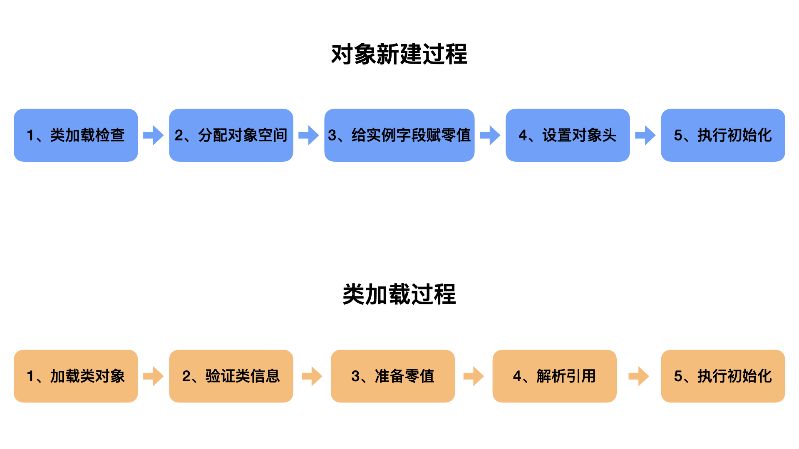

1. 类加载检查：检查类是否加载，如果没有加载，则先执行类加载。
2. 分配内存：为新对象分配堆内存。
3. 初始化零值：为对象的实例字段赋初值。
4. 设置对象头：设置对象的锁状态、哈希码、分代年龄等。
5. 执行init方法：执行实例变量的初始化和非静态初始化块。


### 类加载过程

1. 加载：加载类的二进制字节流，在方法区（运行时常量池）生成类的符号引用，在堆中生成类的Class对象。

2. 连接：与加载阶段交叉进行，包括以下三个部分

    - 验证：对类文件格式、类的元信息、类的字节码、类的符号引用进行验证。

    - 准备：为类变量分配内存并设置初值。

        > `public static int value=1` 初始化为0；`public static final int value=1` 初始化为1。

    - 解析：将常量池中的符号引用替换为直接引用（静态分派）。

3. 初始化：执行静态变量的初始化和静态初始化块。

    > 先初始化父类，再初始化子类。
    >
    > ```java
    > static class Parent {
    >   public static int A = 1;
    >   static {
    >     	A = 2;
    >   }
    > }
    > static class Sub extends Parent {
    > 	public static int B = A; // 父类的初始化先完成，因此 B = 2
    > }
    > ```

### 什么时候会执行类加载？

1. 新建对象时
2. 使用类的静态成员变量/方法时
3. 使用反射对类进行调用时

> 此外，主类会在虚拟机启动时被加载。

### 类的卸载需要满足那些条件？

类的卸载指的就是类的Class对象被GC，类的卸载需要满足三个条件：

1. 该类的所有实例对象被回收

2. 该类的Class对象不在其他任何位置被引用

3. 该类的类加载器的实例被回收

    > 所以，由JVM自带的类加载器加载的类不会被卸载，只有自定义的类加载器加载的类才有可能被卸载。

### 并发条件下如何进行对象内存分配？

每个线程预先在Eden分配一块空间作为线程私有的TLAB（Thread Local Allocation Buffer，线程本地分配缓存区），先在线程私有的TLAB上分配对象空间，不够用的话再使用CAS进行内存分配。


### 对象访问定位

 Java 程序通过栈上的 reference 数据来操作堆上的具体对象。对象的访问方式由虚拟机实现而定，目前主流的访问方式有：**使用句柄**、**直接指针**。

#### 句柄

如果使用句柄的话，那么 Java 堆中将会划分出一块内存来作为句柄池，reference 中存储的就是对象的**句柄地址**，而句柄中包含了**对象实例数据**与**类型数据**各自的具体地址信息。

>   对象实例数据：对象中各个实例字段的数据（属性）
>
>   对象类型数据：对象的类型、父类、实现的接口、方法等（类型）


#### 直接指针

如果使用直接指针访问，那么 Java 堆对象的布局中就必须考虑如何放置访问类型数据的相关信息，而 reference 中存储的直接就是**对象的地址**。


这两种对象访问方式各有优势。使用句柄来访问的最大好处是 reference  中存储的是稳定的句柄地址，在对象被移动时只会改变句柄中的实例数据指针，而 reference  本身不需要修改。使用直接指针访问方式最大的好处就是速度快，它节省了一次指针定位的时间开销。

>    HotSpot采用直接指针。

### Minor GC 和 Full GC

- Minor GC：回收新生代，因为新生代对象存活时间很短，因此 Minor GC 会频繁执行，执行的速度一般也会比较快。

- Full GC：回收老年代和新生代，老年代对象其存活时间长，因此 Full GC 很少执行，执行速度会比 Minor GC 慢很多。

    

### 方法区中的垃圾回收

1. 回收无用的类

    - 无用的类指的是，类的所有实例对象被回收，类对象不再被使用，产生该类的类加载器被回收。

        > 框架中通常存在大量的自定义类加载器，此时就需要JVM具有类卸载能力，以减少方法区内存压力。

2. 回收运行时常量池中的废弃常量（包括字符串常量、符号引用）

    - 不被任何对象所引用的常量就是废弃常量。


### GC的分类

1. Partial GC：部分GC
    - Minor GC：回收堆中的新生代
    - Major GC：回收堆中的老生代
    - Mixed GC：回收堆中的新生代和部分老生代
2. Full GC：完全GC，回收堆和方法区。


### 分代收集的优点

可以根据不同对象的存活时间划分出不同GC区域，以便采用合适的算法进行垃圾收集，这样可以提高GC的整体效率和内存利用率。

> 比如，复制-清除法适合于GC次数较多的新生代，整理-清除法适合于注重内存利用率的老生代。


### 内存分配策略

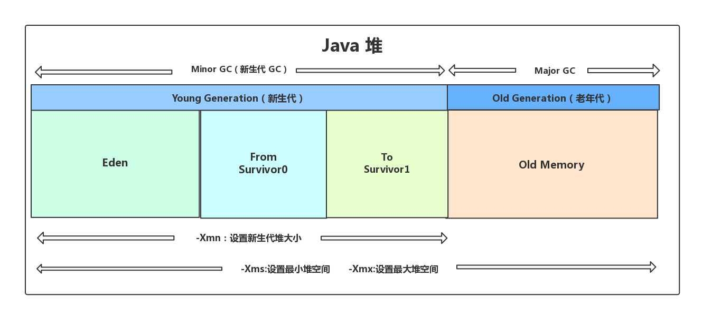

#### 1. 对象优先在 Eden 分配

大多数情况下，对象在新生代 Eden 上分配，当 Eden 空间不够时，发起 Minor GC。

>   - MinorGC会尝试将Eden区中的对象转移至Survivor区，然后再尝试在Eden区进行分配。
>   - 如果有Survivor区存放不下的对象，则会通过**分配担保机制**将其提前转移到老年代。

#### 2. 大对象直接进入老年代

大对象是指需要连续内存空间的对象，最典型的大对象是那种很长的字符串以及数组。

经常出现大对象会提前触发垃圾收集以获取足够的连续空间分配给大对象。

>   -XX:PretenureSizeThreshold，大于此值的对象直接在老年代分配，避免在 Eden 和 Survivor 之间的大量内存复制。

#### 3. 长期存活的对象进入老年代

为对象定义年龄计数器，对象在 Eden 出生并经过 Minor GC 依然存活，将移动到 Survivor 中，年龄就增加 1 岁，增加到一定年龄则移动到老年代中。

>    -XX:MaxTenuringThreshold 用来定义年龄的阈值。

#### 4. 动态对象年龄判定

虚拟机并不是永远要求对象的年龄必须达到 MaxTenuringThreshold 才能晋升老年代，如果在 Survivor 中相**同年龄所有对象大小的总和大于 Survivor 空间的一半**，则年龄大于或等于该年龄的对象可以直接进入老年代，无需等到 MaxTenuringThreshold 中要求的年龄。

#### 5. 空间分配担保

在发生 Minor GC 之前，虚拟机先检查**老年代最大可用的连续空间是否大于新生代所有对象总空间**，如果条件成立的话，那么 Minor GC 可以确认是安全的。

如果不成立的话虚拟机会查看 HandlePromotionFailure 的值**是否允许担保失败**，如果允许那么就会继续检查老年代**最大可用的连续空间是否大于历次晋升到老年代对象的平均大小**，如果大于，将**尝试着进行一次 Minor GC**；如果小于，或者 HandlePromotionFailure 的值不允许冒险，那么就要进行一次 **Full GC**。

>   这么做是为了减少Full GC的次数。

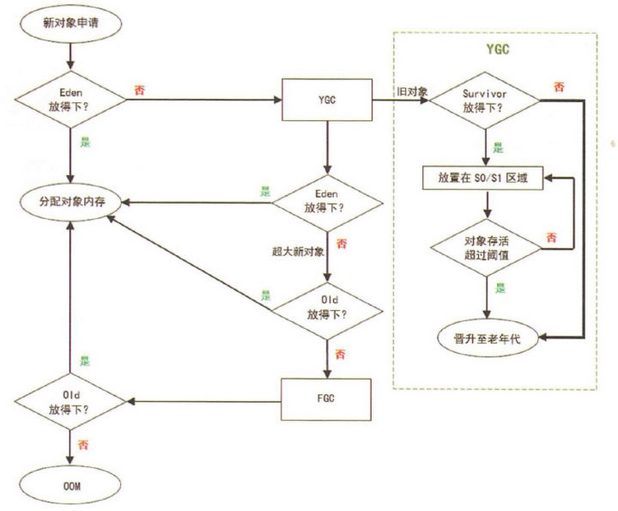

### JVM调优工具

https://blog.csdn.net/javalingyu/article/details/124983769

#### Linux

top：实时显示正在执行进程的 CPU 使用率、内存使用率以及系统负载等信息

vmstat：可对操作系统的虚拟内存、进程、CPU活动进行监控

pidstat：监控指定进程的上下文切换，深入到线程级别


#### jdk

-   jps：显示当前所有java进程pid

-   jstat：监测 Java 应用程序的实时运行情况，可以看到VM内的Eden、Survivor、老年代的内存使用情况，还有 YoungGC 和 FullGC 的执行次数以及耗时。

-   jmap：查看堆内存初始化配置信息以及堆内存的使用情况，输出堆内存中的对象信息，包括产生了哪些对象，对象数量多少等。

-   jstack：线程堆栈分析工具，最常用的功能就是使用 jstack pid 命令查看线程的**堆栈信息**，通常会结合 top -Hp pid 或 pidstat -p pid -t 一起查看具体线程的状态，也经常用来排查一些死锁的异常、CPU占用高的线程等。

- **`jinfo`** (Configuration Info for Java) ：显示虚拟机配置信息
- **`jhat`** (JVM Heap Dump Browser ) : 用于分析 heapdump 文件，它会建立一个 HTTP/HTML 服务器，让用户可以在浏览器上查看分析结果;


#### JDK可视化分析工具

JConsole 是基于 JMX 的可视化监视、管理工具。可以很方便的监视本地及远程服务器的 java 进程的内存使用情况。你可以在控制台输出`console`命令启动或者在 JDK 目录下的 bin 目录找到`jconsole.exe`然后双击启动。

> 可以查看Java程序的堆内存使用量、线程、类、CPU占用率。
>
> 内存部分可以细化到Eden、Survivor区。
>
> 线程监控还可以检测死锁。


### 内存持续升高，如何排查？


### JAVA类加载器

JDK自带有三个类加载器：bootstrap ClassLoader、ExtClassLoader、AppClassLoader。

**BootStrapClassLoader**是ExtClassLoader的父类加载器，默认负责加载**%JAVA_HOME%lib**下的jar包和class文件。

**ExtClassLoader**是AppClassLoader的父类加载器，负责加载**%JAVA_HOME%/lib/ext**文件夹下的jar包和class类。

**AppClassLoader**是自定义类加载器的父类，负责加载**classpath**下的类文件。系统类加载器，线程上下文加载器。

继承ClassLoader实现**自定义类加载器**


### 双亲委派机制

-   自下向上检查类是否已经被加载（loadClass加载缓存）

-   从上至下尝试查找类(findClass查找路径)

    **向上加载类缓存（查找到BootStrapClassLoader），向下查找加载路径(找到到向上委托的类)**

    

    

    

双亲委派模型的好处：

-   主要是为了安全性，避免用户自己编写的类动态替换 Java的一些核心类，比如 String。

-   同时也避免了类的重复加载，因为 JVM中区分不同类，不仅仅是根据类名，相同的 class文件被不同的 ClassLoader加载就是不同的两个类

    

### 如何破坏双亲委派机制

>   如果我们不想打破双亲委派模型，就重写 `ClassLoader` 类中的 `findClass()` 方法即可，无法被父类加载器加载的类最终会通过这个方法被加载；但是，如果想打破双亲委派模型则需要重写 `loadClass()` 方法。

**重写loadclass()方法破坏双亲委派模型**
loadclass的作用就是通过指定的全限定名加载class。这里最主要的是重写loadclass()方法，因为**双亲委派机制的实现就是通过这个方法实现的，这个方法可以指定类通过什么加载器来加载，所以如果我们改写他的规则，就相当于打破了双亲委派机制。**默认的过程就是这样的，先判断这个类是不是已经被当前层的类加载器加载过了，如果没有加载过就将该类委派给父类加载器，如果父类加载器无法加载就向下传递，回来由自己来进行加载，重写这个方法以后就能自己定义使用什么加载器了，也可以自定义加载委派机制，也就打破了双亲委派机制。重写loadclass() 也就有可能将findclass()也重写。


**线程上下文类加载器破坏双亲委派模型**
双亲委派模型的局限性：**父类加载器无法加载子类加载器路径中的类**。双亲委派模型最典型的不适用场景是SPI的使用。所以提供了一种线程上下文类加载器，能够使父类加载器调用子类加载器进行加载。
简单来说就是**接口定义在了启动类加载器中，而实现类定义在了其他类加载器中**，当启动类加载器需要加载其他子类加载器路径中的类时，使用了**线程上下文类加载器**（默认是应用程序类加载器）来实现父类调用子类的加载器进行类的加载。

>   官方为我们提供了很多SPI（Service Provider Interface，SPI）接口，例如JDBC、JBI、JNDI等。这类SPI接口，官方往往只会定义规范，具体的实现则是由第三方来完成的，比如JDBC，不同的数据库厂商都需自己根据JDBC接口的定义进行实现。
>
>   而这些SPI接口直接由Java核心库来提供，一般位于`rt.jar`包中，而第三方实现的具体代码库则一般被放在`classpath`的路径下。而此时问题来了：
>
>   位于`rt.jar`包中的SPI接口，是由Bootstrap类加载器完成加载的，而`classpath`路径下的SPI实现类，则是`App`类加载器进行加载的。同时由于双亲委派机制的存在，Bootstrap类加载器也无法反向委托AppClassLoader加载器SPI的实现类。在这种情况下，我们需要一种特殊的类加载器来加载第三方的类库，而线程上下文类加载器就是很好的选择。
>
>   线程上下文类加载器就是双亲委派模型的破坏者，可以在执行线程中打破双亲委派机制的加载链关系，从而使得程序可以逆向使用类加载器。


### 常用的JVM配置参数

#### 显示指定堆内存-Xms和-Xmx

```shell
# 指定堆的最小值和最大值
-Xms2G -Xmx5G
```

#### 显示指定新生代内存

```shell
# 指定新生代内存大小
-Xmn256
# 也可以分别指定新生代的最小值和最大值
-XX:NewSize=256M -XX:MaxNewSize=1024M
# 或者通过比例设置新生代与老年代的比例（例子中是1:8）
-XX:NewRatio=8
```

#### 显示指定元空间的大小

```shell
-XX:MetaspaceSize=N
-XX:MaxMetaspaceSize=N
```

#### 指定垃圾收集器

```shell
-XX:+UseSerialGC
-XX:+UseParallelGC
-XX:+UseParNewGC
-XX:+UseG1GC
```

#### 查看GC记录

```shell
-XX:+PrintGC
-Xloggc:/path/to.gc.log
```


### 类文件结构包含哪些内容？

```java
ClassFile {
    u4             magic;
    u2             minor_version;
    u2             major_version;
    u2             constant_pool_count;
    cp_info        constant_pool[constant_pool_count-1];
    u2             access_flags;
    u2             this_class;
    u2             super_class;
    u2             interfaces_count;
    u2             interfaces[interfaces_count];
    u2             fields_count;
    field_info     fields[fields_count];
    u2             methods_count;
    method_info    methods[methods_count];
    u2             attributes_count;
    attribute_info attributes[attributes_count];
}
```

- 魔数
- Class文件版本号
- 常量池
- 访问标志
- 当前类、父类、接口索引集合
- 字段表集合
- 方法表集合
- 属性表集合


## 设计模式

### 实现一个单例

单例模式是一种常用的设计模式，是23中设计模式中的一种。

设计模式:设计模式是一种思想，是一种编程思想，是前人经验的累积。

单例模式概念：**在做某个项目中，创建了一个类，那么这个类只能生成一个对象**。

单例模式有两种实现方式分别：饿汉式和懒汉式

**饿汉式**

饿汉式：顾名思义，可以理解成一个饿汉，只要一加载类的时候就会创建了对象，因为用了static修饰，static修饰的成员随着类的加载而加载的

**实现步骤：1：构造函数私有化**

　　　　　**2：提供一个静态对象属性用来接收对象**

　　　　　**3：创建一个静态方法用来获取对象实例**

具体代码如下：

```java
//那么怎么让这个类在整个项目中生成一个对象呢？使用单例模式
    //单例模式第一种：饿汉式
    //弊端：占用内存，如果我不想随着类的加载而加载，想延迟加载创建对象？需要用到懒汉式
    //为什么叫饿汉式呢？一加载类的时候就创建了对象，因为用了static修饰，static修饰的成员随着类的加载而加载
    //1.第一步：构造方法需要私有化
    //2.第二步：提供一个静态对象属性用来接收对象
    //3.第三步：提供一个静态方法用来获取对象
    //随着类的加载就马上创建了对象，很饥饿
    public static Single s=new Single();
    //私有的只能在本类中使用
    private Single(){}
    public static Single getSingle(){
        return s;
    }
```


**懒汉式**

懒汉式：比较懒的加载，不会随着类的加载而加载，而是在你调用创建对象实例的方法时才会创建对想

实现步骤：

```
第一步：构造方法需要私有化
第二步：提供一个静态属性
第三步：提供一个方法用来创建对象
```

代码实现如 :

```java
 //懒汉式:顾名思义，这个是比较的懒的，在我们加载类的时候没有创建对象，而是在你调用了方法的时候才创建
    //第一步：构造方法需要私有化
    //第二步：提供一个静态属性
    //第三步：提供一个方法用来创建对象
    public static volatile LazySingle lazySingle;
    private LazySingle(){}
    public static LazySingle getLazySingle(){
        //这里面需要创建对象
        //怎么解决？也就是说如何避免两个不同的线程创建不同的对象？
        //判断对象是否为空，为空进去创建，不为空就不能够创建
        //需要使用同步把生成的对象的相关代码锁起来（同步代码块或者同步方法都可以）
        // synchronized(锁对象) {}  LazySingle.class字节码对象
        //LazySingle加载到内存中去会编译成LazySingle.class文件，
        // 到JVM内存中，首先会加载到方法区，
        // 方法区中可能不止一个LazySingle.class文件，可能会有Dag.class,Cat.class...
        // 这样方法区中会存在很多的字节码文件，用面向对象的思维编写它，专门用一个类称呼它Class类
        //那么每一个字节码文件可以看成是一个字节码文件对象
//        Class<LazySingle> lazySingleClass = LazySingle.class;//Class类，Class类中的 LazySingle.class对象
        //还没有很完善，因为使用同步代码块会存在开锁和关锁的一个步骤，会降低执行效率，损耗时间
        //而且不同的线程去访问它的时候都要执行同步代码块，会降低执行效率，消耗时间
        //因为使用同步代码块会降低执行效率，消耗时间，为了避免减少使用同步代码块的一个次数
        //需要判断如果对象为空的时候才进入同步代码块
        //假如没有创建对象之前，两个不同的线程同时进入，那么所创建的对象也不一样
        // 就需要用同步代码块把生成对象的相关代码锁起来
        // 锁对象使用类的字节码对象 因为使用同步代码块会消耗时间
        // 为了避免减少使用同步代码块的次数，需要判断对象为空的时候，才进入同步代码块
        //这里是进行了双重检查 两个if判断
        if(lazySingle==null) {//如果不等于就不要创建，等于null创建 有利于提升执行效率
            synchronized (LazySingle.class) {//锁对象使用字节码对象
                //如何避免两个线程创建创建不同的对象
                //判断对象是否为空
                //判断对象是否为空，为空进去创建，不为空就不能够创建
                if (lazySingle == null) {
                    lazySingle = new LazySingle();
                }
            }
        }
        return lazySingle;
    }

    public void eat(){
        System.out.println("大口吃饭");
    }
```

>   第一次判断是在Synchronized同步代码块外进行判断，由于单例模式只会创建一个实例，并通过getInstance方法返回singleton对象，所以，**第一次判断，是为了在singleton对象已经创建的情况下，避免进入同步代码块，提升效率。**
>
>   
>
>   第二次判断是为了避免以下情况的发生。
>    (1)假设：线程A已经经过第一次判断，判断singleton=null，准备进入同步代码块.
>    (2)此时线程B获得时间片，由于线程A并没有创建实例，所以，判断singleton仍然=null，所以线程B创建了实例singleton。
>    (3)此时，线程A再次获得时间片，由于刚刚经过第一次判断singleton=null(不会重复判断)，进入同步代码块，这个时候，我们如果不加入第二次判断的话，那么线程A又会创造一个实例singleton，就不满足我们的单例模式的要求，所以第二次判断是很有必要的。
>
>   另外，需要注意 `uniqueInstance` 采用 `volatile` 关键字修饰也是很有必要。
>
>   `uniqueInstance` 采用 `volatile` 关键字修饰也是很有必要的， `uniqueInstance = new Singleton();` 这段代码其实是分为三步执行：
>
>   1.  为 `uniqueInstance` 分配内存空间
>   2.  初始化 `uniqueInstance`
>   3.  将 `uniqueInstance` 指向分配的内存地址
>
>   但是由于 JVM 具有指令重排的特性，执行顺序有可能变成 1->3->2。指令重排在单线程环境下不会出现问题，但是在多线程环境下会导致一个线程获得还没有初始化的实例。例如，线程 T1 执行了 1 和 3，此时 T2 调用 `getUniqueInstance`() 后发现 `uniqueInstance` 不为空，因此返回 `uniqueInstance`，但此时 `uniqueInstance` 还未被初始化。
>
>   
>
>   **使用 `volatile` 可以禁止 JVM 的指令重排，保证在多线程环境下也能正常运行**。
>
>   有一个误区：就是认为已经有Synchronized，怎么会被抢占？
>
>   但是需要注意的是，Synchronized只是为了保证同步，也就是当有多个线程对同一段程序进行操作时，能够保证只有一个线程能够获取到资源，至于是谁获取资源，可不可以抢占它不管的。


### 工厂设计模式

https://blog.csdn.net/qq_43613445/article/details/107976721

#### 概念

一、设计模式

1.   什么是设计模式

     设计模式是一套被反复使用、多数人知晓的、经过分类编目的、代码设计经验的总结。

2.   应用设计模式有什么好处？

     设计模式是优秀的使用案例，使用设计模式可提高代码的重用性，让代码更容易被他人理解，保证代码可靠性。

     

二、工厂模式

1.   工厂模式的概念

     工厂模式顾名思义就是创建所需要的对象，可以代替传统的new创建对象方式。
     它是一种创建型模式，用于封装和管理对象的创建。

     工厂模式包括简单工厂模式、抽象工厂模式和工厂方法模式，抽象工厂模式是工厂方法模式的扩展。抽象工厂模式不常用。

2.   工厂模式的意念

     定义一个接口来创建对象，让子类来决定哪些类需要被实例化。工厂方法把实例化的工作推迟到子类中实现。

3.   工厂模式的应用场景

     有一组同类型或类似的对象需要创建
     在编码时不能预见需要创建哪种类的实例
     
     系统需要考虑扩展性，不应依赖于产品类实例如何被创建、组合和表达的细节。
     
     同一类型的对象需要创建。

4.   工厂模式的动机

     项目中的现状:

     在软件系统中经常面临着“对象”的创建工作，由于需要的变化，这个对象可能随之也会发生变化，为此，我们需要提供一种封装机制来隔离出这个易变对象的变化，从而保持系统中其他依赖该对象的对象不随着需求变化而变化。

     

     基于项目现状将代码进行如下设计：

     尽量松耦合，一个对象的依赖对象的变化与本身无关；
     具体产品与客户端剥离，责任分割。

     

#### 工厂模式的应用

包结构目录


工厂，生产冰淇淋和冰棒


##### 传统方式实例对象

IceProjectInterface.java

```java
package com.ice;

/**
 * 冰棒产品接口
 */
public interface IceProjectInterface{
	/**
	 * 打印信息方法
	 */
	public void showInfo();
}

```

 IceCreamImpl.java

```java
package com.ice.impl;

import com.ice.IceProjectInterface;

/**
 * 冰淇淋实现类
 */
public class IceCreamImpl implements IceProjectInterface{
	@Override
	public void showInfo() {
		System.out.println("这里是冰淇淋");
	}
}

```

IceLollyImpl.java

```java
package com.ice.impl;

import com.ice.IceProjectInterface;
/**
*冰棒实现类
*/
public class IceLollyImpl implements IceProjectInterface{
	@Override
	public void showInfo() {
		System.out.println("这里是冰棒");
	}
}

```

IceProjectTest.java

```java
package com.ice.test;

import com.ice.IceProjectInterface;
import com.ice.impl.IceCreamImpl;

/**
 * 冰棒产品测试类
 */
public class IceProjectTest{
	public static void main(String[] args){
		//传统方法
		IceProjectInterface iceCream = new IceCreamImpl();
		iceCream.showInfo();
	}
}

```


##### 简单工厂模式

首先创建一个Factory工厂类

IceProjectFactory.java

```java
package com.ice.factory;

import com.ice.IceProject;
import com.ice.impl.IceCreamImpl;
import com.ice.impl.IceLollyImpl;

/**
 * 冰棒产品工厂类
 */
public class IceProjectFactory{
	/**
	*根据参数创建对象
	*@param name 冰棒产品名称
	*/
	public IceProjectInterface iceProjectByName(String name){
		if("ice-cream".equals(name)){
			return new IceCreamImpl();
		}else if("ice-lolly".equals(name)){
			return new IceLollyImpl();
		}
		return null;
	}
}
```

IceProjectTest.java

```java
package com.ice.test;

import com.ice.IceProject;
import com.ice.factory.IceProjectFactory;
import com.ice.impl.IceCreamImpl;

/**
 * 冰棒产品测试类
 */
public class IceProjectTest{
	public static void main(String[] args){
		IceProjectInterface iceCream = new IceProjectFactory().iceProjectByName("ice-cream");
		iceCream.showInfo();
	}
}
```

##### 工厂方法模式

使用这种方式来创建对象时，每增加一个类，我们需要在方法中多添加一个if结构，我们可以使用反射机制，优化代码，并根据类的名称来为我们创建类的实例。

IceProjectFactory.java

```java
   /**
	 * 根据类名创建对象
	 * @param className 类名
	 * @return 返回所需对象
	 */
	public IceProjectInterface iceProjectByClass(String className){
		try {
			IceProjectInterface iceProject = (IceProjectInterface)Class.forName(className).newInstance();
			return iceProject;
		} catch (InstantiationException e) {
			e.printStackTrace();
		} catch (IllegalAccessException e) {
			e.printStackTrace();
		} catch (ClassNotFoundException e) {
			e.printStackTrace();
		}
		return null;
	}
```

IceProjectTest.java

```java
	IceProjectInterface iceCream = new IceProjectFactory().iceProjectByClass("com.ice.impl.IceCreamImpl");
	iceCream.showInfo();
```

##### 使用映射配置类路径

由于根据类名来查找创建对象，类名过长，我们可以使用简写key的形式，创建映射文件来配置类路径。

type.properties

```java
ice-cream = com.ice.impl.IceCreamImpl
ice-lolly = com.ice.impl.IceLollyImpl
```

 IceProjectFactory.java

```java
   /**
	 * 根据key创建对象
	 * @param className 类名
	 * @return 返回所需对象
	 */
	public IceProjectInterface iceProjectByClassKey(String key){
		try {
			Map<String, String> map = new PropertiesReader().getProperties();
			IceProjectInterface iceProject = (IceProjectInterface)Class.forName(map.get(key)).newInstance();
			return iceProject;
		} catch (InstantiationException e) {
			e.printStackTrace();
		} catch (IllegalAccessException e) {
			e.printStackTrace();
		} catch (ClassNotFoundException e) {
			e.printStackTrace();
		}
		return null;
	}

```

IceProjectTest.java

```java
		IceProjectInterface iceCream 
		= new IceProjectFactory().iceProjectByClassKey("ice-cream");
		iceCream.showInfo();

```

#### 工厂方法模式和抽象工厂模式对比

-   工厂方法模式是一种极端情况的抽象工厂模式，而抽象工厂模式可以看成是工厂模式的推广；
-   工厂方法模式用来创建一个产品的等级结构，而抽象工厂模式是用来创建多个产品的等级结构；
-   工厂方法模式只有一个抽象产品类，而抽象工厂模式有多个抽象产品类。


#### 常见应用

-   JDBC

是一种用于执行SQL语句的Java API，可以为多种关系数据库提供统一访问，它由一组Java语言编写的类和接口组成。

-   Spring BeanFactory

Spring BeanFactory作为Spring基础的IOC容器，是Spring的一个Bean工厂。单从工厂模式的角度思考，它就是用来生产Bean，提供给客户端。

#### 工厂模式的好处

-   工厂模式是为了解耦：可以将对象的创建和使用分离，如果不分离，不但违反了设计模式的开闭原则，需要需要使用另一个子类的话，需要修改源代码 ,把对象的创建和使用的过程分开。

    >   开闭原则：一个软件实体如类，模块和函数应该对扩展开放，对修改关闭。

-   工厂模式可以降低代码重复。

-   因为工厂管理了对象的创建逻辑，使用者并不需要知道具体的创建过程，只管使用即可，减少了使用者因为创建逻辑导致的错误


## 线程和并发

### 举例介绍Java中的进程和线程

正在运行的一个Java程序就是一个Java进程。一个Java进程中可以包含有多个Java线程，比如主函数就运行在主线程上，GC就运行在GC线程上，此外，还可以有一些用户自定义的Java线程。


### 为什么需要并发编程？

当我们需要同时处理多个任务时，如果没有并发编程，那么所有的任务都只能串行执行，这样就不能有效地利用系统资源，会造成系统资源的浪费。

如果采用了并发编程，那么多个任务就可以并发地运行，一方面可以提高资源的利用率，另一方面可以提升任务整体的处理速度。


### 线程的生命周期？线程有几种状态

1.线程通常有五种状态，**创建，就绪，运行、阻塞和死亡**状态。

2.阻塞的情况又分为三种：

(1)、等待阻塞：运行的线程执行**wait**方法，该线程**会释放占用的所有资源**，JVM会把该线程放入“**等待池**”中。进入这个状态后，是**不能自动唤醒**的，必须依靠其他线程调用**notify或notifyAll**方法才能被唤醒，wait是o**bject类**的方法

(2)、同步阻塞：运行的线程在获取对象的**同步锁**时，若该同步锁被别的线程占用，则JVM会把该线程放入“**锁池**”中。

(3)、其他阻塞：运行的线程执行**sleep或join**方法，或者发出了I/O请求时，JVM会把该线程置为阻塞状态。当sleep状态超时、join等待线程终止或者超时、或者I/O处理完毕时，线程重新转入**就绪**状态。**sleep是Thread类**的方法（可以自主唤醒）


1.新建状态（New）：新创建了一个线程对象。

2.就绪状态（Runnable）：线程对象创建后，其他线程调用了该对象的**start**方法。该状态的线程位于可运行线程池中，变得可运行，等待获取CPU的使用权。

3.运行状态（Running）：就绪状态的线程获取了CPU，执行程序代码。

4.阻塞状态（Blocked）：阻塞状态是线程因为某种原因放弃CPU使用权，暂时停止运行。直到线程进入就绪状态，才有机会转到运行状态。

5.死亡状态（Dead）：线程执行完了或者因异常退出了run方法，该线程结束生命周期。

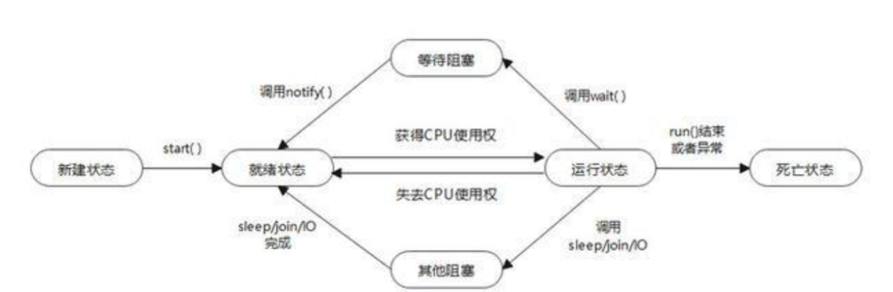


### sleep()、wait()、join()、yield()的区别

1.锁池

所有需要竞争**同步锁**的线程都会放在锁池当中，比如当前对象的锁已经被其中一个线程得到，则其他线程需要在这个锁池进行等待，当前面的线程释放同步锁后锁池中的线程去竞争同步锁，当某个线程得到后会进入就绪队列进行等待cpu资源分配。

2.等待池

当我们调用wait（）方法后，线程会放到等待池当中，**等待池的线程是不会去竞争同步锁**。只有调用了notify（）或notifyAll()后等待池的线程才会开始去竞争锁，**notify（）是随机从等待池选出一个线程放到锁池**，而notifyAll()是将等待池的所有线程放到锁池当中


**sleep和wait**

1、sleep 是 Thread 类的静态本地方法，wait 则是 Object 类的本地方法。

2、sleep方法不会释放lock，但是wait会释放，而且会加入到等待队列中。

3、sleep方法不依赖于同步器synchronized，但是wait需要依赖synchronized关键字。

4、sleep不需要被唤醒（休眠之后推出阻塞），但是wait需要（不指定时间需要被别人中断）。

5、sleep 一般用于当前线程休眠，或者轮循暂停操作，wait 则多用于多线程之间的通信。

6、sleep 会让出 CPU 执行时间且强制上下文切换，而 wait 则不一定，wait 后可能还是有机会重新竞争到锁继续执行的。

yield（）【自己礼让】执行后线程直接进入**就绪**状态，马上释放了cpu的执行权，但是依然保留了cpu的执行资格，所以有可能cpu下次进行线程调度还会让这个线程获取到执行权继续执行


join（）【让别人阻塞】执行后线程进入**阻塞**状态，例如在线程B中调用线程A的join（），那线程B会进入到阻塞队列，直到线程A结束或中断线程

main调用了t1

t1在main中调用t1.join()

main函数被阻塞

直到t1运行结束


### Thread类中run()和start()的区别

run()方法仅仅只是运行类中所定义的函数，并不会以线程的方式执行；

start()方法是由本地实现的一个方法，会启动线程，等待资源分配后即可执行。


### 对线程安全的理解

不是线程安全、应该是内存安全，堆是共享内存，可以被所有线程访问

>   当多个线程访问一个对象时，如果不用进行额外的同步控制或其他的协调操作，调用这个对象的行为都可以获得正确的结果，我们就说这个对象是线程安全的


**堆**是进程和线程共有的空间，分全局堆和局部堆。**全局堆就是所有没有分配的空间，局部堆就是用户分配的空间。**堆在操作系统对进程**初始化**的时候分配，**运行**过程中也可以向系统要额外的堆，但是**用完了要还给操作系统，要不然就是内存泄漏**。

在Java中，堆是Java虚拟机所管理的内存中最大的一块，是所有线程共享的一块内存区域，在虚拟机启动时创建。堆所存在的内存区域的唯一目的就是存放对象实例，几乎所有的对象实例以及数组都在这里分配内存。


**栈**是每个线程独有的，保存其运行状态和局部自动变量的。栈在线程开始的时候初始化，每个线程的栈互相独立，因此，栈是线程安全的。操作系统在切换线程的时候会自动切换栈。栈空间不需要在高级语言里面显式的分配和释放。

目前主流操作系统都是多任务的，即多个进程同时运行。为了保证安全，每个进程只能访问分配给自己的内存空间，而不能访问别的进程的，这是由操作系统保障的。


在**每个进程**的内存空间中都会有一块特殊的公共区域，通常称为**堆（内存）**。进程内的所有线程都可以访问到该区域，这就是造成问题的潜在原因。


### Thread、Runnable的区别

Thread和Runnable的实质是继承关系，没有可比性。无论使用Runnable还是Thread，都会new Thread，然后执行run方法。用法上，如果有复杂的线程操作需求，那就选择继承Thread，如果只是简 单的执行一个任务，那就实现runnable。 thread是runnable的子类


### 对守护线程的理解

守护线程：为所有**非守护线程**提供服务的线程；任何一个守护线程都是整个JVM中**所有非守护线程的保姆；**

守护线程类似于整个进程的一个默默无闻的小喽喽；它的生死无关重要，它却依赖整个进程而运行；哪天其他线程结束了，没有要执行的了，程序就结束了，理都没理守护线程，就把它中断了；

注意： 由于守护线程的终止是自身无法控制的，因此千万不要把IO、File等重要操作逻辑分配给它；因为它不靠谱；


守护线程的作用是什么？

举例， GC垃圾回收线程：就是一个经典的守护线程，当我们的程序中不再有任何运行的Thread,程序就不会再产生垃圾，垃圾回收器也就无事可做，所以当垃圾回收线程是JVM上仅剩的线程时，垃圾回收线程会自动离开。它始终在低级别的状态中运行，用于实时监控和管理系统中的可回收资源。


应用场景

（1）来为其它线程提供服务支持的情况；

（2） 或者在任何情况下，程序结束时，这个线程必须正常且立刻关闭，就可以作为守护线程来使用；反之，如果一个正在执行某个操作的线程必须要正确地关闭掉否则就会出现不好的后果的话，那么这个线程就不能是守护线程，而是用户线程。通常都是些关键的事务，比方说，数据库录入或者更新，这些操作都是不能中断的。


thread.setDaemon(true)必须在thread.start()之前设置，否则会抛出一个IllegalThreadStateException异常。你不能把正在运行的常规线程设置为守护线程。

在Daemon线程中产生的新线程也是Daemon的。

守护线程不能用于去访问固有资源，比如读写操作或者计算逻辑。因为它会在任何时候甚至在一个操作的中间发生**中断**。

Java自带的多线程框架，比如ExecutorService，会将守护线程转换为用户线程，所以**如果要使用后台线程就不能用Java的线程池。**


### ThreadLocal的原理和使用场景

**原理**

每一个 Thread 对象均含有一个 ThreadLocalMap 类型的**成员变量 threadLocals** ，它存储本线程中所有ThreadLocal对象及其对应的值

ThreadLocalMap 由一个个 Entry 对象构成

Entry 继承自 WeakReference<ThreadLocal<?>> ，一个 Entry 由 ThreadLocal 对象和 Object 构成。由此可见， **Entry 的key是ThreadLocal对象，并且是一个弱引用**。当没指向key的强引用后，该key就会被垃圾收集器回收

当执行set方法时，ThreadLocal首先会获取当前线程对象，然后获取当前线程的ThreadLocalMap对象。再以当前ThreadLocal对象为key，将值存储进ThreadLocalMap对象中。

get方法执行过程类似。ThreadLocal首先会获取当前线程对象，然后获取当前线程的ThreadLocalMap对象。再以当前ThreadLocal对象为key，获取对应的value。由于每一条线程均含有各自**私有的**ThreadLocalMap容器，这些容器相互独立互不影响，因此不会存在线程安全性问题，从而也无需使用同步机制来保证多条线程访问容器的互斥性。


**使用场景**

1、在进行对象**跨层**传递的时候，使用ThreadLocal可以避免多次传递，打破层次间的约束。（controller service）

2、线程间**数据隔离**

3、进行**事务**操作，用于存储线程事务信息。

4、数据库连接，**Session会话**管理。

Spring框架在事务开始时会给当前线程绑定一个Jdbc Connection,在整个事务过程都是使用该线程绑定的 connection来执行数据库操作，实现了事务的隔离性。Spring框架里面就是用的ThreadLocal来实现这种隔离


### ThreadLocalMap的底层实现

ThreadLocalMap的底层实现与HashMap类似，初始大小也是16，也是通过扰动函数来减少hash碰撞，然后通过&运算计算索引。区别在于当索引产生冲突时，ThreadLocalMap采取的策略为**线性探测法**，而HashMap采取的是链表+红黑树。


### ThreadLocal内存泄露原因，如何避免

**一些概念**

内存泄露为程序在申请内存后，无法释放已申请的内存空间，一次内存泄露危害可以忽略，但内存泄露堆积后果很严重，无论多少内存,迟早会被占光，不再会被使用的对象或者变量占用的内存不能被回收，就是内存泄露。

强引用：使用最普遍的引用(new)，一个对象具有强引用，**不会被垃圾回收器回收**。当内存空间不足，Java虚拟机宁愿抛出OutOfMemoryError错误，使程序异常终止，也不回收这种对象。

如果想取消强引用和某个对象之间的关联，可以显式地将引用赋值为null，这样可以使JVM在合适的时间就会回收该对象。

弱引用：JVM进行垃圾回收时，无论内存是否充足，都会回收被弱引用关联的对象。在java中，用java.lang.ref.**WeakReference**类来表示。可以在**缓存中**使用弱引用。

>   引用：栈中的引用变量指向堆中的对象
>
>   
>
>   强引用：new、反射创建的对象。不被gc回收。
>
>   软引用：当空间不足，被gc回收。内存敏感缓存。
>
>   弱引用：weakReference表示。被gc回收。有则用，无则创，常用于缓存。
>
>   虚引用：不能直接访问的对象。能再对象被Gc时，收到系统通知


**ThreadLocal原理**

ThreadLocal的实现原理，每一个Thread维护一个ThreadLocalMap，key为使用**弱引用**的ThreadLocal实例，value为线程变量的副本


**为什么key是弱引用**

**key 使用强引用**

当ThreadLocalMap的key为强引用, 即使ThreadLocal对象在栈中的引用被回收，因为ThreadLocalMap还持有ThreadLocal的强引用，如果没有手动删除，ThreadLocal（堆）不会被回收，导致Entry内存泄漏。

**key 使用弱引用**

当ThreadLocalMap的key为弱引用, 当ThreadLocal对象在栈中的引用被回收，由于ThreadLocalMap持有ThreadLocal的弱引用，即使没有手动删除，ThreadLocal也会被回收。

好在ThreadLocalMap在每次调用set()、get()等方法的时候，会自动清除掉key为null的记录。但是为了安全起见，最好还是手动调用remove()方法以清除不需要使用的对象。

>   此处只是针对key是否会内存泄漏，去说明为什么key是弱引用，因为强引用必内存泄漏
>


**内存泄漏原因**

所有Entry对象都被ThreadLocalMap类的实例化对象threadLocals持有，当ThreadLocal对象不再使用时，ThreadLocal对象在栈中的引用就会被回收，一旦没有任何引用指向ThreadLocal对象，Entry只持有弱引用的key就会自动在下一次YGC时被回收。
简而言之： threadLocals对象中的entry对象不在使用后，没有及时remove该entry对象 ，然而程序自身也**无法通过垃圾回收机制自动清除**，从而导致内存泄漏。

>   1强引用：threadlocal的引用（栈） -> ThreadLocal对象（堆）
>
>   2弱引用：ThreadLocalMap中Entry的key（堆）-> ThreadLocal对象（堆）
>
>   当1的强引用消失，由于2是弱引用，所以ThreadLocal对象（堆）会被回收，但是value不会，因为是强引用，Gc也不会管。


**ThreadLocal正确的使用方法**

每次使用完ThreadLocal都调用它的remove()方法清除数据

将ThreadLocal变量定义成private static，这样就一直存在ThreadLocal的强引用，也就能保证任何时候都能通过ThreadLocal的弱引用访问到Entry的value值，进而清除掉 。

>   不理解


### 并发、并行、串行的区别

串行在时间上不可能发生重叠，前一个任务没搞定，下一个任务就只能等着

并行在时间上是重叠的，两个任务在**同一时刻互不干扰**的同时执行。

并发允许两个任务彼此干扰。统一时间点、只有一个任务运行，**交替执行**


### 并发的三大特性

**原子性**

**关键字：**synchronized

原子性是指在一个操作中cpu不可以在中途暂停然后再调度，即不被中断操作，要不全部执行完成，要不都不执行。

>   主内存：就是对应于计算机的内存；
>
>   工作内存：对应于CPU中的寄存器和缓存等等，而由于有多核的存在，这个工作内存也会有多个存在。这个概念和线程私有的内存还是不一样的，线程私有的内存，其实是栈内存。


例：i++操作保证原子性

```java
1：将 count 从主存读到工作内存中的副本中

2：+1的运算

3：将结果写入工作内存

4：将工作内存的值刷回主存(什么时候刷入由操作系统决定，不确定的)
```

程序中原子性指的是最小的操作单元，比如自增操作，它本身其实并不是原子性操作，分了3步的，包括读取变量的原始值、进行加1操作、写入工作内存。所以在多线程中，有可能一个线程还没自增完，可能才执行到第二部，另一个线程就已经读取了值，导致结果错误。那如果我们能保证自增操作是一个原子性的操作，那么就能保证其他线程读取到的一定是自增后的数据。


**可见性**

**关键字：**volatile、synchronized、final

当多个线程访问同一个变量时，一个线程修改了这个变量的值，其他线程能够**立即**看得到修改的值。

若两个线程在不同的cpu，那么线程1改变了i的值还没刷新到主存，线程2又使用了i，那么这个i值肯定还是之前的，线程1对变量的修改线程没看到这就是可见性问题。


**有序性**

**关键字：**volatile、synchronized

虚拟机在进行代码编译时，对于那些改变顺序之后不会对最终结果造成影响的代码，虚拟机不一定会按照我们写的代码的顺序来执行，有可能将他们重排序。实际上，对于有些代码进行重排序之后，虽然对变量的值没有造成影响，但有可能会出现线程安全问题。

volatile本身就包含了禁止指令重排序的语义，而synchronized关键字是由“一个变量在同一时刻只允许一条线程对其进行lock操作”这条规则明确的。


**总结**

synchronized关键字同时满足以上三种特性，但是volatile关键字不满足原子性。

在某些情况下，volatile的同步机制的性能确实要优于锁(使用synchronized关键字或

java.util.concurrent包里面的锁)，因为volatile的总开销要比锁低。

我们判断使用volatile还是加锁的唯一依据就是**volatile的语义能否满足使用的场景(**原子性)


### volatile关键字

1.保证被volatile修饰的共享变量对所有线程总是可见的，也就是当一个线程修改了一个被volatile修饰共享变量的值，新值总是可以被其他线程立即得知。

>   第一：使用volatile关键字会强制将修改的值立即写入**主存**；
>
>   第二：使用volatile关键字的话，当线程2进行修改时，会导致线程1的工作内存中缓存变量stop的缓存行无效（反映到硬件层的话，就是CPU的L1或者L2缓存中对应的缓存行无效）；
>
>   第三：由于线程1的工作内存中缓存变量stop的缓存行无效，所以线程1再次读取变量stop的值时会去主存读取。

2.禁止指令重排序优化。


### 为什么用线程池？解释下线程池参数？

1、降低资源消耗；提高线程利用率，**降低创建和销毁线程的消耗**。

2、提高响应速度；任务来了，直接有线程**可用可执行**，而不是先创建线程，再执行。

3、提高线程的可管理性；线程是稀缺资源，使用线程池可以统一分配**调优监控**。


```java
 public ThreadPoolExecutor(int corePoolSize,
                              int maximumPoolSize,
                              long keepAliveTime,
                              TimeUnit unit,
                              BlockingQueue<Runnable> workQueue,
                              ThreadFactory threadFactory,
                              RejectedExecutionHandler handler ) {}
```


-   **corePoolSize** 代表核心线程数，也就是正常情况下创建工作的线程数，这些线程创建后并不会消除，而是一种**常驻线程**，和线程池的生命周期一样长

-   **maxinumPoolSize** 代表的是最大线程数，它与核心线程数相对应，表示最大允许被创建的线程数，比如当前任务较多，将核心线程数都用完了，还无法满足需求时，此时就会创建新的线程，但是线程池内线程总数不会超过最大线程数

-   keepAliveTime 、 unit 表示超出**核心线程数之外的线程的空闲存活时间**，也就是核心线程不会消除，但是超出核心线程数的部分线程如果空闲一定的时间则会被消除,我们可以通过setKeepAliveTime 来设置空闲时间

-   workQueue 用来存放**待执行的任务**，假设我们现在**核心线程**都已被使用，还有任务进来则全部放入队列，直到整个队列被放满但任务还再持续进入则会开始**创建新的线程**

    >   不是说核心线程用完就立刻创建新的线程

-   ThreadFactory 实际上是一个线程工厂，用来生产线程执行任务。我们可以选择使用默认的创建工厂，产生的线程都在同一个组内，拥有相同的优先级，且都不是守护线程。当然我们也可以选择自定义线程工厂，一般我们会根据业务来制定不同的线程工厂

-   Handler 任务拒绝策略，有两种情况，第一种是当我们调用 shutdown 等方法关闭线程池后，这时候即使线程池内部还有没执行完的任务正在执行，但是由于线程池已经关闭，我们再继续想线程池提交任务就会遭到拒绝。另一种情况就是当达到最大线程数，线程池已经没有能力继续处理新提交的任务时，这是也就拒绝


### 简述线程池处理流程


### 线程池中阻塞队列的作用？为什么是先添加列队而不是先创建最大线程？

1、一般的队列只能保证作为一个有限长度的缓冲区，如果超出了缓冲长度，就无法保留当前的任务了，阻塞队列通过**阻塞可以保留住当前想要继续入队的任务**。

阻塞队列可以保证任务**队列中没有任务时阻塞获取任务的线程**，使得线程进入**wait状态，释放cpu资源**。

阻塞队列自带**阻塞和唤醒**的功能，不需要额外处理，无任务执行时,线程池利用阻塞队列的take方法挂起，从而维持核心线程的存活、不至于一直占用cpu资源


2、在创建新线程的时候，是要**获取全局锁**的，这个时候其它的就得**阻塞**，影响了整体效率。

就好比一个企业里面有10个（core）正式工的名额，最多招10个正式工，要是任务超过正式工人数

（task > core）的情况下，工厂领导（线程池）不是首先扩招工人，还是这10人，但是任务可以稍微积

压一下，即先放到队列去（代价低）。10个正式工慢慢干，迟早会干完的，要是任务还在继续增加，超过正式工的加班忍耐极限了（队列满了），就的招外包帮忙了（注意是临时工）要是正式工加上外包还是不能完成任务，那新来的任务就会被领导拒绝了（线程池的拒绝策略）。


### 线程池中线程复用原理

线程池将线程和任务进行解耦，线程是线程，任务是任务，摆脱了之前通过 Thread 创建线程时的一个线程必须对应一个任务的限制。

在线程池中，同一个线程可以从阻塞队列中不断获取新任务来执行，其核心原理在于线程池对

Thread 进行了封装，并不是每次执行任务都会调用 Thread.start() 来创建新线程，而是让每个线程去执行一个“循环任务”，在这个“循环任务”中不停检查是否有任务需要被执行，如果有则直接执行，也就是调用任务中的 run 方法，将 run 方法当成一个普通的方法执行，通过这种方式只使用固定的线程就将**所有任务的 run 方法串联起来**。


### Runnable和Callable的区别

Runnable可以接受无返回值、无异常抛出的任务。

```java
Runnable task = new Runnable() {
    @Override
    public void run() {
        // ...
    }
};
```

Callable可以接受有返回值、有异常抛出的任务。

```java
Callable task = new Callable() {
    @Override
    public Object call() throws Exception {
        // ...
    }
}
```

> 通过 Executors.callable(Runnable task) 方法可以将Runnable对象转换为Callable对象。

### execute()和submit()的区别

使用 execute() 执行线程任务，没有返回值，无法获知任务是否执行成功。

使用 submit() 执行线程任务，有返回值，可以获得任务执行结果，并且通过 Future 对象进行接收。

```java
ExecutorService exec = Executors.newCachedThreadPool(); // 创建线程池
Callable<Integer> task = ()->{ // 创建带返回值的任务
    // ...
};
Future<Integer> result = exec.submit(task); // 提交任务，获得Future对象
System.out.println(result.get()); // 打印结果
```


### 线程池饱和策略有哪些？

所谓线程池饱和策略，指的就是线程池和阻塞队列都达到饱和时所采取的策略：

- **ThreadPoolExecutor.AbortPolicy（默认策略）**：中止策略，以抛出异常的方式来拒绝新任务。

- ThreadPoolExecutor.CallerRunsPolicy：使用调用者所在的线程运行该任务，该策略会影响程序整体性能。

- ThreadPoolExecutor.DiscardPolicy：丢弃策略，直接丢弃新任务。

- ThreadPoolExecutor.DiscardOldestPolicy：丢弃最早策略，丢弃最久未处理的任务。

    

### 如何控制线程池结束？

```java
// 方法一：空转等待线程池结束
while (!executor.isTerminated()) {
}
// 方法二：主动终止线程池
executor.shutdown();
```


### 阻塞队列

>   阻塞队列与普通队列的区别在于，当队列是空的时，从队列中获取元素的操作将会被阻塞，或者当队列是满时，往队列里添加元素的操作会被阻塞。

阻塞队列也是JUC包下的一个数据结构，可用作创建线程池的任务等待队列，也可用于解决生产者/消费者问题。

```java
BlockingQueue<Runnable> taskQueue = new ArrayBlockingQueue<>(20); // 必须指定队列长度
```

### 如何使用阻塞队列解决生产者/消费者问题？

- put()方法：生产者往队列中插入项，如果满了则阻塞。

- take()方法：消费者从队列中获取项，如果空了则阻塞。

如果想要停止消费者，可以给最后一个生产产品加上标识，一旦消费完该产品，就可以执行退出操作。


### 原子类如何保证可见性和原子性？

JUC包下的原子类使用volatile关键字保证可见性，使用CAS无锁机制来保证原子性。


### 原子类有哪些？

1. 基本类型：AtomicInteger、AtomicLong、AtomicBoolean
2. 数组类型：AtomicIntegerArray、AtomicLongArray、AtomicReferenceArray
3. 引用类型：AtomicReference、AtomicMarkableReference、AtomicStampedReference
4. 对象属性修改类型：AtomicIntegerFieldUpdater、AtomicLongFieldUpdater、AtomicReferenceFieldUpdater

### AtomicInteger类的常用方法

```java
public final int get() // 获取当前的值
public final int getAndSet(int newValue) // 获取当前的值，并设置新的值
public final int getAndIncrement() // 获取当前的值，并自增
public final int getAndDecrement() // 获取当前的值，并自减
public final int getAndAdd(int delta) // 获取当前的值，并加上预期的值
boolean compareAndSet(int expect, int update) // 如果输入的数值等于预期值，则以原子方式将该值设置为输入值（update）
public final void lazySet(int newValue) // 最终设置为newValue，使用lazySet()之后可能导致其他线程在之后的一小段时间内还是可以读到旧的值。
```

### 如何解决CAS机制中可能产生的ABA问题？

CAS机制中的ABA问题可以通过以下两个原子类来解决（核心思想是通过增加一个标记来记录对象的修改）：

- `AtomicMarkableReference`：增加一个boolean类型的标记，只能记录一次修改；
- `AtomicStampedReference`：增加一个int类型的标记，可以记录多次修改。

> CAS中的失败重试如果不做限制就可能无限循环下去，该问题可以通过限制自旋次数/自旋时间来解决（比如采用适应性自旋）。
