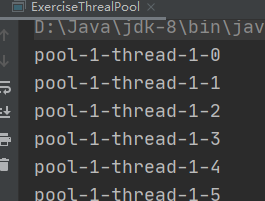

# 代码附录

## 迭代器

### iterator

```java
Iterator<Integer> iterator = list.iterator();
        while(iterator.hasNext()){
            Integer next = iterator.next();
            System.out.println(next);
        }
```

### listIterator

- 正序

```java
        System.out.println("方式二");
        ListIterator<Integer> listIterator = list.listIterator();
        while(listIterator.hasNext()){
            int i = listIterator.next();
            System.out.println(i);

        }
```

- 倒序

```java
//方式三:得先让下标到达最后一个位置
        System.out.println("方式三：倒叙");
        while(listIterator.hasPrevious()){
            Integer previous = listIterator.previous();
            System.out.println(previous);

        }
```

其他

```java
Iterator<String> it = strList.iterator();
        while (it.hasNext()) {
            String str = (String) it.next();
            System.out.println(str);
        }
```


## 单例模式

### **饿汉式**

饿汉式：顾名思义，可以理解成一个饿汉，只要一加载类的时候就会创建了对象，因为用了static修饰，static修饰的成员随着类的加载而加载的

**实现步骤：1：构造函数私有化**

　　　　　**2：提供一个静态对象属性用来接收对象**

　　　　　**3：创建一个静态方法用来获取对象实例**

具体代码如下：

```java
//那么怎么让这个类在整个项目中生成一个对象呢？使用单例模式
    //单例模式第一种：饿汉式
    //弊端：占用内存，如果我不想随着类的加载而加载，想延迟加载创建对象？需要用到懒汉式
    //为什么叫饿汉式呢？一加载类的时候就创建了对象，因为用了static修饰，static修饰的成员随着类的加载而加载
    //1.第一步：构造方法需要私有化
    //2.第二步：提供一个静态对象属性用来接收对象
    //3.第三步：提供一个静态方法用来获取对象
    //随着类的加载就马上创建了对象，很饥饿
    public static Single s=new Single();
    //私有的只能在本类中使用
    private Single(){}
	//静态工厂方法
    public static Single getSingle(){
        return s;
    }
```

>   饿汉式是**线程安全**的。直接将单例对象用static修饰，把实例对象放到堆内存中，保证了多个线程在访问时的可见性。但是缺点也是很大的，正是由于把实例对象放到堆内存中，这样应用一加载就会看到对应实例，极大浪费内存。


### **懒汉式**

懒汉式：比较懒的加载，不会随着类的加载而加载，而是在你调用创建对象实例的方法时才会创建对想

实现步骤：

```
第一步：构造方法需要私有化
第二步：提供一个静态属性
第三步：提供一个方法用来创建对象
```

代码实现如 :

```java
 //懒汉式:顾名思义，这个是比较的懒的，在我们加载类的时候没有创建对象，而是在你调用了方法的时候才创建
    //第一步：构造方法需要私有化
    //第二步：提供一个静态属性
    //第三步：提供一个方法用来创建对象
    public static volatile LazySingle lazySingle;
    private LazySingle(){}
    public static LazySingle getLazySingle(){
        //这里面需要创建对象
        //怎么解决？也就是说如何避免两个不同的线程创建不同的对象？
        //判断对象是否为空，为空进去创建，不为空就不能够创建
        //需要使用同步把生成的对象的相关代码锁起来（同步代码块或者同步方法都可以）
        // synchronized(锁对象) {}  LazySingle.class字节码对象
        //LazySingle加载到内存中去会编译成LazySingle.class文件，
        // 到JVM内存中，首先会加载到方法区，
        // 方法区中可能不止一个LazySingle.class文件，可能会有Dag.class,Cat.class...
        // 这样方法区中会存在很多的字节码文件，用面向对象的思维编写它，专门用一个类称呼它Class类
        //那么每一个字节码文件可以看成是一个字节码文件对象
//        Class<LazySingle> lazySingleClass = LazySingle.class;//Class类，Class类中的 LazySingle.class对象
        //还没有很完善，因为使用同步代码块会存在开锁和关锁的一个步骤，会降低执行效率，损耗时间
        //而且不同的线程去访问它的时候都要执行同步代码块，会降低执行效率，消耗时间
        //因为使用同步代码块会降低执行效率，消耗时间，为了避免减少使用同步代码块的一个次数
        //需要判断如果对象为空的时候才进入同步代码块
        //假如没有创建对象之前，两个不同的线程同时进入，那么所创建的对象也不一样
        // 就需要用同步代码块把生成对象的相关代码锁起来
        // 锁对象使用类的字节码对象 因为使用同步代码块会消耗时间
        // 为了避免减少使用同步代码块的次数，需要判断对象为空的时候，才进入同步代码块
        //这里是进行了双重检查 两个if判断
        if(lazySingle==null) {//如果不等于就不要创建，等于null创建 有利于提升执行效率
            synchronized (LazySingle.class) {//锁对象使用字节码对象
                //如何避免两个线程创建创建不同的对象
                //判断对象是否为空
                //判断对象是否为空，为空进去创建，不为空就不能够创建
                if (lazySingle == null) {
                    lazySingle = new LazySingle();
                }
            }
        }
        return lazySingle;
    }

    public void eat(){
        System.out.println("大口吃饭");
    }
```

>   第一次判断是在Synchronized同步代码块外进行判断，由于单例模式只会创建一个实例，并通过getInstance方法返回singleton对象，所以，**第一次判断，是为了在singleton对象已经创建的情况下，避免进入同步代码块，提升效率。**
>
>   
>
>   第二次判断是为了避免以下情况的发生。
>    (1)假设：线程A已经经过第一次判断，判断singleton=null，准备进入同步代码块.
>    (2)此时线程B获得时间片，由于线程A并没有创建实例，所以，判断singleton仍然=null，所以线程B创建了实例singleton。
>    (3)此时，线程A再次获得时间片，由于刚刚经过第一次判断singleton=null(不会重复判断)，进入同步代码块，这个时候，我们如果不加入第二次判断的话，那么线程A又会创造一个实例singleton，就不满足我们的单例模式的要求，所以第二次判断是很有必要的。
>
>   另外，需要注意 `uniqueInstance` 采用 `volatile` 关键字修饰也是很有必要。
>
>   `uniqueInstance` 采用 `volatile` 关键字修饰也是很有必要的， `uniqueInstance = new Singleton();` 这段代码其实是分为三步执行：
>
>   1.  为 `uniqueInstance` 分配内存空间
>   2.  初始化 `uniqueInstance`
>   3.  将 `uniqueInstance` 指向分配的内存地址
>
>   但是由于 JVM 具有指令重排的特性，执行顺序有可能变成 1->3->2。指令重排在单线程环境下不会出现问题，但是在多线程环境下会导致一个线程获得还没有初始化的实例。例如，线程 T1 执行了 1 和 3，此时 T2 调用 `getUniqueInstance`() 后发现 `uniqueInstance` 不为空，因此返回 `uniqueInstance`，但此时 `uniqueInstance` 还未被初始化。
>
>   
>
>   **使用 `volatile` 可以禁止 JVM 的指令重排，保证在多线程环境下也能正常运行**。
>
>   有一个误区：就是认为已经有Synchronized，怎么会被抢占？
>
>   但是需要注意的是，Synchronized只是为了保证同步，也就是当有多个线程对同一段程序进行操作时，能够保证只有一个线程能够获取到资源，至于是谁获取资源，可不可以抢占它不管的。
>
>   
>
>   线程安全问题：
>
>   **线程不安全**的，如果有两个线程，同一时刻拿到单例对象，要去静态工厂办法访问，由于工厂办法没有锁，那么很有可能这两个线程最终会拿到两个实例。
>
>   所以才要使用synchronized修饰，为了性能所以使用到静态代码块上，而不是方法上
>
>   但这样还是不安全的，因为会发生指令重排的问题，所以需要用volatile进行修饰。
>
>   结束
>
>   
>
>   最推荐的是使用枚举类实现单例模式，这是**线程安全**的。JVM会保证枚举类中的构造方法只调用一次，因此使用枚举会保证只实例化一次。
>
>   ```java
>   **
>    * 枚举模式：最安全
>    */
>   public class SingletonExample6 {
>   
>       // 私有构造函数
>       private SingletonExample6() {
>   
>       }
>   
>       public static SingletonExample6 getInstance() {
>           return Singleton.INSTANCE.getInstance();
>       }
>   
>       private enum Singleton {
>           INSTANCE;
>   
>           private SingletonExample6 singleton;
>   
>           // JVM保证这个方法绝对只调用一次
>           Singleton() {
>               singleton = new SingletonExample6();
>           }
>   
>           public SingletonExample6 getInstance() {
>               return singleton;
>           }
>       }
>   }
>   ```


多线程安全问题

大部分时候我们并没有在项目中使用多线程，所以很少有人会关注这个问题。单例 Bean 存在线程问题，主要是因为当多个线程操作同一个对象的时候是存在资源竞争的。

常见的有两种解决办法：

1. 在 Bean 中尽量避免定义可变的成员变量。
2. 在类中定义一个 `ThreadLocal` 成员变量，将需要的可变成员变量保存在 `ThreadLocal` 中（推荐的一种方式）。

不过，大部分 Bean 实际都是无状态（没有实例变量）的（比如 Dao、Service），这种情况下， Bean 是线程安全的


## 多线程

### AQS:countdownlacth

同步工具：CountDownLatch 基于AQS（num值在运行过程中无法重置。如果需要重置计数的版本，可以考虑使用CyclicBarrier）

允许一条或者多条线程等待其他线程中的一组操作完成后，再继续执行。

（eg：主线程等待子线程都执行结束，再执行相关操作） 

主线程：CountDownLatch latch = new CountDownLatch（num）；// 子线程个数

子线程：latch.countDown();

主线程：latch.await（）；//await方法使当前线程等待直到count值为0，或者当前线程被打断！如果当前的count值为0，那么aw


#### Example1

```java
public class CountdownLatchExample {

    public static void main(String[] args) throws InterruptedException {
        final int totalThread = 10;
        //子线程个数
        CountDownLatch countDownLatch = new CountDownLatch(totalThread);
        ExecutorService executorService = Executors.newCachedThreadPool();
        for (int i = 0; i < totalThread; i++) {
            //此处会创建匿名了内部线程
            executorService.execute(() -> {
                System.out.print("run..");
                countDownLatch.countDown(); //这个不管是否异常都需要数量减,否则会被堵塞无法结束
            });
        }
        countDownLatch.await();//保证之前的所有的线程都执行完成，才会走下面的
        System.out.println("end");
        executorService.shutdown();
    }
}
```


#### Example2

```java
public class ExerciseCountDownLatch {
    public static void main(String[] args) throws InterruptedException {
        //创建线程池
        ExecutorService executorService = Executors.newFixedThreadPool(4);

        //创建磁盘
        DiskMemory diskMemory = new DiskMemory();

        //设置初始值为子线程的数量
        CountDownLatch countDownLatch = new CountDownLatch(4);

        //for循环是要处理的磁盘的数量
        for (int i = 0; i < 4; i++) {
            //创建线程
            executorService.execute(new Runnable() {
                @Override
                public void run() {
                    int size = diskMemory.getSize();
                    diskMemory.setTotalSize(size);
                    System.out.println("线程执行，磁盘大小为：" + size);
                    countDownLatch.countDown();
                }
            });
        }

        //唤醒主线程
        countDownLatch.await();
        System.out.println("磁盘总容量为："+diskMemory.getTotalSize());
        executorService.shutdown();
    }
}

class DiskMemory{
    //利用countDownLatch统计四个盘的容量大小
    private int totalSize;

    public int getTotalSize(){
        return totalSize;
    }

    public void setTotalSize(int size){
        totalSize += size;
    }

    //模拟盘的大小
    public int getSize(){
        return (new Random().nextInt(3)+1)*100;
    }
}

```


### ReentrantLock

```java
public class ExerciseReentrantLock {
    //类
    private Lock lock  = new ReentrantLock();

    public void test(){
        lock.lock();
        try{
            for (int i = 0; i < 10; i++) {
                System.out.println(i + " ");
            }
        }finally {
            lock.unlock();
        }
    }

    public static void main(String[] args) {
        ExerciseReentrantLock exerciseReentrantLock = new ExerciseReentrantLock();
        exerciseReentrantLock.test();
    }

}
```

### Synchronize

#### 修饰成员变量和方法

```java
public class ExerciseSychronized1 {
    //synchronized修饰在非静态方法，或者成员变量，锁住的是对象的实例，也就是this
    //所以在此处锁住的是exerciseSychronized对象，当两个线程在竞争时，thread1先拿到了，就会将fun1执行完才释放给fun2
    public synchronized void fun1(){
        for (int i = 0; i < 3; i++) {
            System.out.println("fun1 :"+ i);
            try {
                Thread.sleep(3000);
            } catch (InterruptedException e) {
                e.printStackTrace();
            }
        }
    }

    public synchronized void fun2(){
        for (int i = 0; i < 3; i++) {
            System.out.println("fun2 :"+ i);
            try {
                Thread.sleep(3000);
            } catch (InterruptedException e) {
                e.printStackTrace();
            }
        }
    }

    public static void main(String[] args) {
        ExerciseSychronized1 exerciseSychronized = new ExerciseSychronized1();

        Thread thread1 = new Thread(new Runnable() {
            @Override
            public void run() {
                exerciseSychronized.fun1();
            }
        });
        thread1.start();

        Thread thread2 = new Thread(new Runnable() {
            @Override
            public void run() {
                exerciseSychronized.fun2();
            }
        });

        thread2.start();
    }


}
```


作用在两个对象上就可以并发了


#### 修饰静态方法

```java
public class ExerciseSychronized2 {
    //synchronized修饰在静态方法，锁住的是class实例，因为静态方法属于class而不属于对象
    //所以在此处锁住的是ExerciseSychronized2类，当两个线程在竞争时，thread1先拿到了，就会将fun1执行完才释放给fun2
    public synchronized static void fun1(){
        for (int i = 0; i < 3; i++) {
            System.out.println("fun1 :"+ i);
            try {
                Thread.sleep(3000);
            } catch (InterruptedException e) {
                e.printStackTrace();
            }
        }
    }

    public synchronized static void fun2(){
        for (int i = 0; i < 3; i++) {
            System.out.println("fun2 :"+ i);
            try {
                Thread.sleep(3000);
            } catch (InterruptedException e) {
                e.printStackTrace();
            }
        }
    }

    public static void main(String[] args) {
        final ExerciseSychronized2 exerciseSychronized1 = new ExerciseSychronized2();
        final ExerciseSychronized2 exerciseSychronized2 = new ExerciseSychronized2();

        Thread thread1 = new Thread(new Runnable() {
            @Override
            public void run() {
                exerciseSychronized1.fun1();
            }
        });
        thread1.start();

        Thread thread2 = new Thread(new Runnable() {
            @Override
            public void run() {
                exerciseSychronized2.fun2();
            }
        });

        thread2.start();
    }


}
```


因为static方法是属于Class的，并且Class的相关数据在JVM中是全局共享的，因此静态方法锁相当于类的一个全局锁，会锁住所有调用该方法的线程。


#### 修饰静态代码块

synchronized作用于一个代码块时，锁住的是所有代码块中配置的对象

```java
public class ExerciseSychronized3 {
    private Object var = new Object();

    public static void main(String[] args) {
        final ExerciseSychronized3 exerciseSychronized3 = new ExerciseSychronized3();
        new Thread(new Runnable() {
            @Override
            public void run() {
                exerciseSychronized3.blockMethod1();
            }
        }).start();

        new Thread(new Runnable() {
            @Override
            public void run() {
                exerciseSychronized3.blockMethod2();
            }
        }).start();
    }

    public void blockMethod1(){
        synchronized (var){
            for (int i = 0; i < 3; i++) {
                System.out.println("generalMethod1 excute"+i+" time");
                try {
                    Thread.sleep(3000);
                } catch (InterruptedException e) {
                    e.printStackTrace();
                }
            }
        }

    }

    public void blockMethod2(){
        synchronized (var) {
            for (int i = 0; i < 3; i++) {
                System.out.println("generalMethod2 excute" + i + " time");
                try {
                    Thread.sleep(3000);
                } catch (InterruptedException e) {
                    e.printStackTrace();
                }
            }
        }
    }

}

```

由于两个方法都需要获取名为lockA的锁，所以线程 1会等待线程2执行完成后才能获取该锁并执行


## 线程创建

有三种使用线程的方法：

- 实现 Runnable 接口；
- 实现 Callable 接口；
- 继承 Thread 类。

实现 Runnable 和 Callable 接口的类只能当做一个可以在线程中运行的任务，不是真正意义上的线程，因此最后还需要通过 Thread 来调用。可以理解为任务是通过线程驱动从而执行的。

### 实现 Runnable 接口

需要实现接口中的 run() 方法。

```java
public class MyRunnable implements Runnable {
    @Override
    public void run() {
        // ...
    }
}
```

使用 Runnable 实例再创建一个 Thread 实例，然后调用 Thread 实例的 start() 方法来启动线程。

```java
public static void main(String[] args) {
    MyRunnable instance = new MyRunnable();
    Thread thread = new Thread(instance);
    thread.start();
}
```

### 实现 Callable 接口

与 Runnable 相比，Callable 可以有返回值，返回值通过 FutureTask 进行封装。

```java
public class MyCallable implements Callable<Integer> {
    public Integer call() {
        return 123;
    }
}
```

```java
public static void main(String[] args) throws ExecutionException, InterruptedException {
    MyCallable mc = new MyCallable();
    FutureTask<Integer> ft = new FutureTask<>(mc);
    Thread thread = new Thread(ft);
    thread.start();
    System.out.println(ft.get());
}
```

### 继承 Thread 类

同样也是需要实现 run() 方法，因为 Thread 类也实现了 Runable 接口。

当调用 start() 方法启动一个线程时，虚拟机会将该线程放入就绪队列中等待被调度，当一个线程被调度时会执行该线程的 run() 方法。

```java
public class MyThread extends Thread {
    public void run() {
        // ...
    }
}
```

```java
public static void main(String[] args) {
    MyThread mt = new MyThread();
    mt.start();
}
```

### 实现接口 VS 继承 Thread

实现接口会更好一些，因为：

- Java 不支持多重继承，因此继承了 Thread 类就无法继承其它类，但是可以实现多个接口；
- 类可能只要求可执行就行，继承整个 Thread 类开销过大。


## 线程池创建

newCachedThreadPool创建一个可缓存线程池，如果线程池长度超过处理需要，可灵活回收空闲线程，若无可回收，则新建线程。

newFixedThreadPool 创建一个定长线程池，可控制线程最大并发数，超出的线程会在队列中等待。

newScheduledThreadPool 创建一个定长线程池，支持定时及周期性任务执行。

newSingleThreadExecutor 创建一个单线程化的线程池，它只会用唯一的工作线程来执行任务，保证所有任务按照指定顺序(FIFO, LIFO, 优先级)执行。

### newCachedThreadPool

创建一个可缓存线程池，如果线程池长度超过处理需要，可灵活回收空闲线程，若无可回收，则新建线程。示例代码如下：

```java
 1     /**
 2      * @ClassName: NewCachedThreadPool
 3      * @description: 创建一个可缓存的线程池  可创建线程数是无限大小的
 4      * @author: mingtian
 5      * @Date:2019/5/2 12:18
 6      **/
 7     public class NewCachedThreadPool {
 8         public static void main(String[] args) {
 9             // 可缓存线程池 Executors表示启动线程的  可创建线程数是无限大小的
10             ExecutorService executorService = Executors.newCachedThreadPool();
11             for (int i = 0; i < 10; i++) {
12                 final int temp = i;
13                 // 可执行线程  execute 启动线程
14                 executorService.execute(new Runnable() {
15                     public void run() {
16                         System.out.println(Thread.currentThread().getName() + "," + temp);
17                     }
18                 });
19             }
20             //停止线程池
21             executorService.shutdown();
22 
23         }
24     }
```

> 注意：Error:(16, 78) java: 从内部类引用的本地变量必须是最终变量或实际上的最终变量
>
> 是因为fun（30）函数被调用后，函数参数等就会被内存机制回收，因为他们是被分配到栈中的。而内部类的对象是在堆中分配内存的，外部方法调用结束后该内部类对象不一定就被销毁了；所以就会出现一个奇怪的现象：内部类对象在访问一个不存在的局部变量。
> 这时候，用状态修饰符final修饰该变量，从而该变量成了常量，解决了这个问题。
>
> 有内部类时，应该将本地的变量都声明为final

**总结**：

线程池为无限大，当执行第二个任务时第一个任务已经完成，会复用执行第一个任务的线程，而不用每次新建线程。


### **newFixedThreadPool**

创建一个定长线程池，可控制线程最大并发数，超出的线程会在队列中等待。示例代码如下：

```java
 1 /**
 2  * @ClassName: NewFixedThreadPool
 3  * @description: 创建可固定长度的线程池
 4  * @author: mingtian
 5  * @Date:2019/5/2 12:27
 6  **/
 7 public class NewFixedThreadPool {
 8     public static void main(String[] args) {
 9         //创建可固定长度的线程池，只会创建3个线程池进行处理
10         ExecutorService executorService = Executors.newFixedThreadPool(3);
11         for (int i = 0; i < 20; i++) {
12             final int temp = i;
13             // 可执行线程  execute 启动线程
14             executorService.execute(new Runnable() {
15                 public void run() {
16                     System.out.println(Thread.currentThread().getName() + "," + temp);
17                 }
18             });
19         }
20         //停止线程池
21         executorService.shutdown();
22     }
```


定长线程池的大小最好根据系统资源进行设置。如Runtime.getRuntime().availableProcessors()

总结:

因为线程池大小为3，每个任务输出index后sleep 2秒，所以每两秒打印3个数字。


线程的数量不会超过8


### **newScheduledThreadPool**

创建一个定长线程池，支持定时及周期性任务执行。延迟执行示例代码如下：

```java
 1 /**
 2  * @ClassName: NewScheduledThreadPool
 3  * @description: 创建可定时执行的线程池 延迟多久执行线程
 4  * @author: mingtian
 5  * @Date:2019/5/2 12:35
 6  **/
 7 public class NewScheduledThreadPool {
 8     public static void main(String[] args) {
 9         //创建可定时执行的线程池
10         ScheduledExecutorService scheduledExecutorService = Executors.newScheduledThreadPool(3);
11         for (int i = 0; i < 10; i++) {
12             final int temp=i;
13             //schedule 方法表示线程执行  表示延迟3秒之后 开始执行线程
14             scheduledExecutorService.schedule(new Runnable() {
15                 public void run() {
16                     System.out.println(Thread.currentThread().getName()+""+temp);
17                 }
18             }, 3, TimeUnit.SECONDS);
19         }
20         //停止线程池
21         scheduledExecutorService.shutdown();
22     }
```

### newSingleThreadExecutor

表示延迟3秒执行。

创建一个单线程化的线程池，它只会用唯一的工作线程来执行任务，保证所有任务按照指定顺序(FIFO, LIFO, 优先级)执行。示例代码如下：

```java
 1 /**
 2  * @ClassName: NewSingleThreadExecutor
 3  * @description: 单例线程池
 4  * @author: mingtian
 5  * @Date:2019/5/2 12:45
 6  **/
 7 public class NewSingleThreadExecutor {
 8     public static void main(String[] args) {
 9         //单线程
10         ExecutorService executorService = Executors.newSingleThreadExecutor();
11         for (int i = 0; i < 10; i++) {
12             final int temp = i;
13             // 可执行线程  execute 启动线程
14             executorService.execute(new Runnable() {
15                 public void run() {
16                     System.out.println(Thread.currentThread().getName() + "," + temp);
17                 }
18             });
19         }
20         //停止线程池
21         executorService.shutdown();
22     }
```



线程的数量不会超过1


## I/O

InputStream ,OutputStream类是抽象类，不能通过new关键字来创建该实例对象，需要其子类创建该实例对象

>   ```java
>   package com.io;
>   
>   import java.io.IOException;
>   import java.io.InputStream;
>   
>   /**
>    * 创建InputStream实例inp，并将其赋值为System类的in属性，定义为控制台输入流，从inp输入流中获取字节信息，
>    * 用这些字节信息创建字符串，并将其在控制台上输出。
>    */
>   public class InputMessage {
>       public static void main(String[] args) {
>           InputStream inp = System.in;
>           byte[] bytes = new byte[1024];
>           try {
>               while(inp.read() != -1){
>                   //根据用户输入的信息创建字符串
>                   String str = new String(bytes).trim();
>               }
>               inp.close();        //关闭流
>           } catch (IOException e) {
>               // TODO Auto-generated catch block
>               e.printStackTrace();
>           }
>       }
>   }
>   
>   
>   /**
>    * 创建OutputStream实例out,并将其赋值为System.out标准输出流。通过write()方法向流写入数据。
>    */
>   public class OutputData {
>       public static void main(String[] args) {
>       OutputStream output = System.out;           //实例化OutputStream对象
>       byte[] bytes = "使用OutputStream输出流在控制台输出字符串\n".getBytes();       //创建bytes数组
>       try {
>           output.write(bytes);
>           bytes = "输出内容：\n".getBytes();
>           output.write(bytes);        //向流中写入数据
>           bytes = "Java数据交互管道——IO流 \n".getBytes();
>           output.write(bytes);
>           output.close();
>       } catch (IOException e) {
>           // TODO Auto-generated catch block
>           e.printStackTrace();
>       }
>       }
>   
>   ```

**输入流重要方法**

```java
int b = in.read();///读取一个字节无符号填充到int低8位。-1表示EOF
in.read(byte[] buf);///读取内容到buf字节数组中
in.read(byte[] buf , int start, int size);//读取内容的一小段，到buf
```

**输出流重要方法**

```java
out.write(int b);///写出一个字节到流，b的低8位。
out.write(byte[] buf);//将buf字节数组写入到流
out.write(byte[] buf, int start, int size);///将将buf[start]开始的size长度内容写入。
```


### 控制台 Scanner

```java
    public static void ScannerInputAndOut(){
        //输入
        Scanner scanner = new Scanner(System.in);
        //输出
        System.out.println(scanner.nextLine());
    }
```

### 字节流 BufferedInputStream

需要定义字节数组，buffer缓冲区

bufferInpuStream.read一次可读取一个字节，或者所有字节，读入到buffer中

然后对buffer进行String的转换

```java
/**
     * 字节流
     * @param
     */
    public static void ByteInputAndOut() throws IOException {
        //定义一个接受字节输入的变量
        BufferedInputStream bufferedInputStream = new BufferedInputStream(System.in);
        //声明一个byte数组作为buffer
        byte[] bytes = new byte[1024];
        int bytesRead = 0;
//        //bufferInpuStream.read一次读取输入流的一个字节
//        //将文本内容循环读入到buffer中
//        while((bytesRead = bufferedInputStream.read(bytes))!=-1){
////            将buffer转换为字符串，打印到控制台
//            String s = new String(bytes, 0, bytesRead);
//            System.out.println(s);
//        }

        //bufferInputStream.read一次可读取多个字节，读入到bytes的buffer中
        bufferedInputStream.read(bytes);
        System.out.println(new String(bytes));
        bufferedInputStream.close();

//        输出
        BufferedOutputStream bufferedOutputStream = new BufferedOutputStream(System.out);
        for (int i = 0; i < 5; i++) {
            bufferedOutputStream.write("hello".getBytes());
        }
        bufferedOutputStream.close();

    }
```

### 字符流 BufferedReader

先new一个InputStreamReader，转换为字符

```java
/**
     * 字符流
     */
    public static void CharInputAndOut() throws IOException {
        //输入
        BufferedReader bufferedReader = new BufferedReader(new InputStreamReader(System.in));
        System.out.println(bufferedReader.readLine());

        //输出
        BufferedWriter bufferedWriter = new BufferedWriter(new OutputStreamWriter(System.out));
        for (int i = 0; i < 5; i++) {
            bufferedWriter.write("hello" + i);
            //换行
            bufferedWriter.newLine();
        }
        bufferedWriter.close();
    }
```

### URL输入

```java
    /**
     * url输入
     */
    public static void UrlInput() throws IOException {
        URL url = new URL("http://www.baidu.com");

        /* 字节流 */
        InputStream is = url.openStream();

        /* 字符流 */
        InputStreamReader isr = new InputStreamReader(is, "utf-8");

        /* 提供缓存功能 */
        BufferedReader br = new BufferedReader(isr);

        String line;
        while ((line = br.readLine()) != null) {
            System.out.println(line);
        }

        br.close();
    }
```

### 文件I/O

[参考](https://www.jianshu.com/p/2fa6eccf1c09)

```java
    /**
     * 基于字节流的文件输入输出
     * @throws IOException
     */
    public static void FileInputAndOutput() throws IOException {
        //输出
        File file1 = new File("test.txt");
        FileOutputStream fileOutputStream = new FileOutputStream(file1);
        for (int i = 0; i < 5; i++) {
            fileOutputStream.write(String.valueOf(i).getBytes());
        }
        fileOutputStream.close();


        //输入
        File file = new File("test.txt");
        FileInputStream fileInputStream = new FileInputStream(file);
        byte[] bytes = new byte[1024];
        fileInputStream.read(bytes);
        System.out.println(new String(bytes));
        fileInputStream.close();
    }
```


## 泛型

概念：泛型是JDK1.5的新特性，本质是参数化类型，可用于类、接口和方法的创建。

优点：提供了**编译时类型安全检查**机制。

### 泛型类

泛型类的定义

```java
public class Generic<T> {
    private T key;
    public Generic(T key) {
        this.key = key;
    }
    public T getKey() {
        return key;
    }
}
```

泛型类的使用（实例化一个泛型类）

```java
Generic<Integer> genericInteger = new Generic<Integer>(123);
```

### 泛型接口

泛型接口的定义

```java
public interface Generator<T> {
    public T method();
}
```

泛型接口的使用（指定类型）

```java
class GeneratorImpl implements Generator<String> {
    @Override
    public String method() {
        return "hello";
    }
}
```

泛型接口的使用（不指定类型）

```java
class GeneratorImpl<T> implements Generator<T> {
    @Override
    public T method() {
        return null;
    }
}
```

### 泛型方法

泛型方法的定义

```java
//好像e还只能是包装类
public static <E> void printArray(E[] inputArray) {
    for(E element : inputArray) {
        System.out.printf("%s ", element); // 自动调用toString()方法
    }
}
```

泛型方法的使用

```java
Integer[] intArray = {1, 2, 3};
String[] stringArray = {"Hello", "World"};
printArray(intArray);
printArray(stringArray);
```

>   E需要时包装类
>
>   E作为参数类型
>
>   T作为返回值类型


## 反射

**利用反射机制获取Class对象的四种方式：**

```java
// 1. 直接获取 -> 不会执行静态代码块等初始化步骤
Class<?> demoClass1 = DemoClass.class;
// 2. Class.forName()
Class<?> demoClass2 = Class.forName("<包名>.DemoClass");
// 3. 通过对象实例的getClass()方法获取
DemoClass demo = new DemoClass();
Class<?> demoClass3 = demo.getClass();
// 4. 通过类加载器获取 -> 不会执行静态代码块等初始化步骤
Class<?> demoClass4 = ClassLoder.getSystemClassLoader.loadClass("<包名>.DemoClass");
```

**利用反射机制创建对象，并调用对象方法：**

```java
Class<?> demoClass = Class.forName("<包名>.DemoClass");
// 创建对象
DemoClass demo = (DemoClass) demoClass.newInstance();
// 获得方法列表
Method[] methods = demoClass.getDeclaredMethods();
// 获得指定方法，传入参数类型，然后调用
Method writeString = demoClass.getDeclaredMethod("writeString", String.class);
writeString.invoke(demo, "A simple demo.");
// 强行修改私有成员属性
Field value = demoClass.getDeclaredField("value");
field.setAccessible(true); // 私有方法在设置accessible为true以后也可以强行调用！
field.set(demo, "newValue");
```

**实例化对象**

```java
newInstance: 弱类型。低效率。只能调用无参构造。
new: 强类型。相对高效。能调用任何public构造。
    
newInstance()是实现IOC、反射、面对接口编程 和 依赖倒置 等技术方法的必然选择，new 只能实现具体类的实例化，不适合于接口编程。
使用newInstance时候，就必须保证：1、这个类已经加载；2、这个类已经连接了。而完成上面两个步骤的正是class的静态方法forName（）方法
```

**Exercise**

```java
    public static void main(String[] args) throws ClassNotFoundException, IllegalAccessException, InstantiationException, NoSuchMethodException, InvocationTargetException {
        //方法一：
        //类加载，类连接
        Class<?> listAndArray = Class.forName("ExerciseListAndArray");
        //通过newInstance的方式创建实例，再此之前必须要进行类加载和类链接
        ExerciseListAndArray o = (ExerciseListAndArray)listAndArray.newInstance();
        //执行方法
        o.testArrayToList();


        //方法二：
        Class<?> listAndArray1 = Class.forName("ExerciseListAndArray");
        //通过newInstance的方式创建实例
        ExerciseListAndArray o1 = (ExerciseListAndArray)listAndArray1.newInstance();
        //执行方法
        Method method = listAndArray1.getDeclaredMethod("testArrayToList");
        method.invoke(o1);

        //方法三：
        //通过new的方式创建并执行
        ExerciseListAndArray o2 = new ExerciseListAndArray();
        o2.testArrayToList();
    }
```


## Comparable接口和Comparator接口

- **继承Comparable接口**后，需要实现CompareTo()方法

    ```java
    public class Person implements Comparable<Person> {
        private int age;
        public int getAge(){return age;}
        @Override
        public int compareTo(Person o) {
            return this.age - o.getAge();
        }
    }
    ```

- 也可以创建一个比较器，**实现Comparator接口**，重写compare()方法

    ```java
    Collections.sort(list, new Comparator<Integer>() {
        @Override
        public int compare(Integer o1, Integer o2) {
            return o2.compareTo(o1); // 逆序
        }
    });
    ```


```java
public class ExerciseComparable implements Comparable<ExerciseComparable>{

    private char c;

    public int getC(){
        return c;
    }

    @Override
    public int compareTo(ExerciseComparable o) {
        return this.c - o.getC();
    }

    public static void main(String[] args) {
        ArrayList<Integer> nums = new ArrayList<>();
        nums.add(3);
        nums.add(5);
        nums.add(0);
        Collections.sort(nums, new Comparator<Integer>() {
            @Override
            public int compare(Integer o1, Integer o2) {
                return o1-o2; // 逆序
            }
        });

        System.out.println(nums);
    }
}
```


## 数组和List

>     //我把list和arr一直搞反了
>     //list是列表：ArrayList,LinkedList
>     //arr是数组：int[]

### 数组转为List？

int[] - > arraylist

1. 手动实现

    ```java
    public static <T> List<T> arrayToList(final T[] array) { // array声明为final，避免在方法体中被修改
        final List<T> l = new ArrayList<>(array.length);
        for(final T s : array) {
            l.add(s);
        }
        return l;
    }
    ```

2. 简便方法，asList

    ```java
    List list = new ArrayList<>(Arrays.asList("a", "b", "c"));
    ```

3. **使用Java8的`Arrays.stream().collect()`方法**

    ```java
    Integer [] myArray = { 1, 2, 3 };
    List myList = Arrays.stream(myArray).collect(Collectors.toList());
    
    // 基本类型也可以实现转换（依赖boxed的装箱操作）
    int [] myArray2 = { 1, 2, 3 };
    List myList = Arrays.stream(myArray2).boxed().collect(Collectors.toList());
    ```

4. 使用Java9的`List.of()`方法

    ```java
    List<String> str3=List.of("a","b");
    ```

    

### 如何将List转为数组？

 arraylist -> int[] 

使用`Collection.toArray()`方法，该方法是一个泛型方法，所以需要给方法传入泛型参数，否则默认返回Object类型数组。

```java
List<String> list = Arrays.asList("A","B","C");
String[] s = list.toArray(new String[0]);
```

> 如果需要反转数组，可以先将数组转为List，再使用Collections.reverse()方法，再将List转回数组。


```java
    //我把list和arr一直搞反了
    //list是列表：ArrayList,LinkedList
    //arr是数组：int[]
    public static void testArrayToList(){


        //方法一：
        int[] list = {1,2,3,4,5,6};
        List<Integer> arr =  new ArrayList<>();

        for(int i: list){
            arr.add(i);
        }
        System.out.println(arr);

        //方法二：
        //注意不能采用Arrays.aslist(list.asList());长度会不对
        List list1 = new ArrayList(Arrays.asList(1,2,3,4,5,6));
        System.out.println(list);

//        //方法三：java 9
        int[] arr1 = {1,2,3,4,5,6};
//        List<Integer> nums = List.of(1,2);

        //方法四：java 8
        List<Integer> collect = Arrays.stream(arr1).boxed().collect(Collectors.toList());
        System.out.println(collect);

        //如果是包装类则无需装箱
        Integer[] arr2 = {1,2,3,4};
        List<Integer> collect1 = Arrays.stream(arr2).collect(Collectors.toList());
        System.out.println(collect1);
    }


    public static void testListToArray(){
        List<Integer> list1 = new ArrayList<Integer>();
        for(int i=0;i<10;i++)
        {
            list1.add(i);
        }
        Integer[] integers = list1.toArray(new Integer[0]);
        System.out.println(Arrays.toString(integers));
    }

    public static void main(String[] args) {
        testArrayToList();
        testListToArray();

    }
```


## ACM模式
