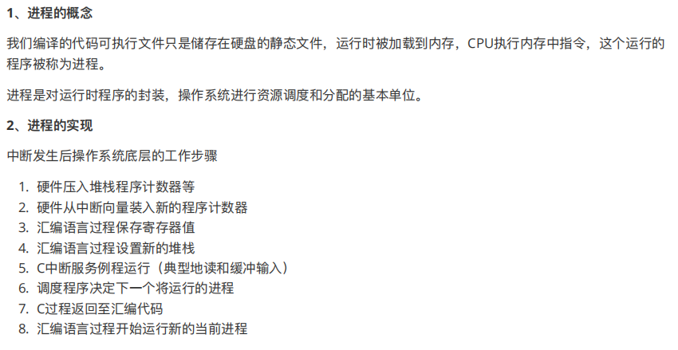
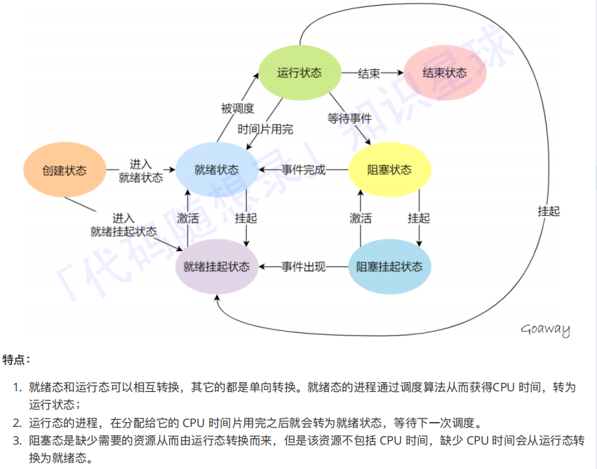
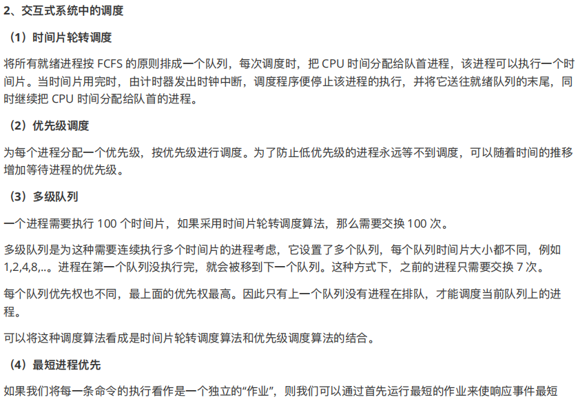

# 操作系统基础

## 什么是操作系统

1.  操作系统本质上是一个运行在计算机上的**软件程序** ，用于管理计算机硬件和软件资源。（介于硬件资源和应用程序之间的一个系统软件）

     举例：运行在你电脑上的所有**应用程序都通过操作系统来调用系统内存以及磁盘**等等硬件。

2.  操作系统存在**屏蔽了硬件层的复杂性**。 操作系统就像是硬件使用的负责人，统筹着各种相关事项。

3.  操作系统的内核（Kernel）是操作系统的核心部分，它负责系统的**内存管理，硬件设备的管理，文件系统的管理以及应用程序的管理**。 内核是连接应用程序和硬件的桥梁，决定着系统的性能和稳定性。

    

## 系统调用

介绍系统调用之前，我们先来了解一下用户态和系统态。

根据进程访问资源的特点，我们可以把进程在系统上的运行分为两个级别：

1.  用户态(user mode) : 用户态运行的进程可以直接读取用户程序的数据。
2.  系统态(kernel mode):可以简单的理解系统态运行的进程或程序几乎可以访问计算机的任何资源，不受限制。

说了用户态和系统态之后，那么什么是系统调用呢？

我们运行的程序基本都是运行在用户态，如果我们调用操作系统提供的系统态级别的子功能咋办呢？那就需要系统调用了！

也就是说在我们运行的用户程序中，凡是与系统态级别的资源有关的操作（如文件管理、进程控制、内存管理等)，都必须通过系统调用方式向操作系统提出服务请求，并由操作系统代为完成。

这些系统调用按功能大致可分为如下几类：

-   设备管理。完成设备的请求或释放，以及设备启动等功能。
-   文件管理。完成文件的读、写、创建及删除等功能。
-   进程控制。完成进程的创建、撤销、阻塞及唤醒等功能。
-   进程通信。完成进程之间的消息传递或信号传递等功能。
-   内存管理。完成内存的分配、回收以及获取作业占用内存区大小及地址等功能

## 冯诺依曼体系结构

高速缓存不在CPU也不在内存

**冯诺依曼计算机的五大部件分别是：运算器、控制器、存储器、输入设备和输出设备**

-   运算器：核心是算术逻辑运算单元，即 ALU，能够执行算术运算或逻辑运算等各种命令，运算单元会从寄存器中提取或存储数据。（里面也有**寄存器**）

-   控制器：由控制单元、指令译码器、指令**寄存器**组成。

-   寄存器：寄存器是 CPU 的高速缓存 ，寄存器在cpu中

    >   快表的存在位置：快表是单独的寄存器，也可能存在CPU内部...
    >
    >   慢表指的是内存中的页表

## 操作系统的功能

# 进程和线程

## 进程和线程

我们从 JVM 的角度来说一下线程和进程之间的关系

从上图可以看出：一个进程中可以有多个线程，多个线程共享进程的堆和方法区 (JDK1.8 之后的元空间)资源，但是每个线程有自己的程序计数器、虚拟机栈 和 本地方法栈。

**总结：** 线程是进程划分成的更小的运行单位,一个进程在其执行的过程中可以产生多个线程。线程和进程最大的不同在于基本上各进程是独立的，而各线程则不一定，因为同一进程中的线程极有可能会相互影响。线程执行开销小，但不利于资源的管理和保护；而进程正相反

## 并行和并发

## 进程有哪几种状态?

我们一般把进程大致分为 5 种状态，这一点和线程很像！

-   **创建状态(new)** ：进程正在被创建，尚未到就绪状态。
-   **就绪状态(ready)** ：进程已处于准备运行状态，即进程获得了**除了处理器之外的一切所需资源**，一旦得到处理器资源(处理器分配的时间片)即可运行。
-   **运行状态(running)** ：进程正在处理器上上运行(单核 CPU 下任意时刻只有一个进程处于运行状态)。
-   **阻塞状态(waiting)** ：又称为等待状态，进程正在等待某一事件而暂停运行如等待某资源为可用或等待 IO 操作完成。即使处理器空闲，该进程也不能运行。
-   **结束状态(terminated)** ：进程正在从系统中消失。可能是进程正常结束或其他原因中断退出运行。

## PCB

常驻内存

进程控制块

## 进程切换比线程慢的原因

## 进程间的通信方式

每个进程各自有不同的用户地址空间，任何一个进程的全局变量在另一个进程中都看不到，所以进程之间要交换数据必须通过内核，在内核中开辟一块缓冲区，进程1把数据从用户空间拷到内核缓冲区，进程2再从内核缓冲区把数据读走，内核提供的这种机制称为**进程间通信**

大概有 7 种常见的进程间的通信方式。

下面这部分总结参考了:[《进程间通信 IPC (InterProcess Communication)》](https://www.jianshu.com/p/c1015f5ffa74)

>    这篇文章，推荐阅读，总结的非常不错。

1.  **管道/匿名管道(Pipes)** ：用于具有亲缘关系的父子进程间或者兄弟进程之间的通信。半双工。

    

    

2.  **有名管道(Names Pipes)** : 匿名管道由于没有名字，只能用于亲缘关系的进程间通信。为了克服这个缺点，提出了有名管道。有名管道严格遵循**先进先出(first in first out)**。有名管道以磁盘文件的方式存在，可以实现本机任意两个进程通信。**有名管道的名字存在于文件系统中，内容存放在内存中**

    >   **匿名管道和有名管道总结：**
    >    （1）管道是特殊类型的文件，在满足先入先出的原则条件下可以进行读写，但不能进行定位读写。
    >    （2）匿名管道是单向的，只能在有亲缘关系的进程间通信；有名管道以磁盘文件的方式存在，可以实现本机任意两个进程通信。
    >    （3）**无名管道阻塞问题：**无名管道无需显示打开，创建时直接返回文件描述符，在读写时需要确定对方的存在，否则将退出。如果当前进程向无名管道的一端写数据，必须确定另一端有某一进程。如果写入无名管道的数据超过其最大值，写操作将阻塞，如果管道中没有数据，读操作将阻塞，如果管道发现另一端断开，将自动退出。
    >    （4）**有名管道阻塞问题：**有名管道在打开时需要确实对方的存在，否则将阻塞。即以读方式打开某管道，在此之前必须一个进程以写方式打开管道，否则阻塞。此外，可以以读写（O_RDWR）模式打开有名管道，即当前进程读，当前进程写，不会阻塞。

3.  **信号(Signal)** ：信号是一种比较复杂的通信方式，用于通知接收进程某个事件已经发生；信号是软件层次上对中断机制的一种模拟，是一种异步通信方式，信号可以在用户空间进程和内核之间直接交互，内核可以利用信号来通知用户空间的进程发生了哪些系统事件

4.  **消息队列(Message Queuing)**  ：消息队列是消息的链表,具有特定的格式,存放在内存中并由消息队列标识符标识。管道和消息队列的通信数据都是先进先出的原则。与管道（无名管道：只存在于内存中的文件；命名管道：存在于实际的磁盘介质或者文件系统）不同的是消息队列存放在**内核**中，只有在内核重启(即，操作系统重启)或者显式地删除一个消息队列时，该消息队列才会被真正的删除。消息队列可以实现消息的**随机查询**,消息不一定要以先进先出的次序读取,也可以按消息的类型读取.比 FIFO 更有优势。**消息队列克服了信号承载信息量少，管道只能承载无格式字节流以及缓冲区大小受限等缺点。**

5.  **信号量(Semaphores)** ：信号量是一个计数器，用于多进程对共享数据的访问，信号量的意图在于进程间同步。这种通信方式主要用于解决与同步相关的问题并避免竞争条件。

    >   信号量是一个计数器，用于多进程对共享数据的访问，信号量的意图在于进程间同步。
    >    为了获得共享资源，进程需要执行下列操作：
    >    （1）**创建一个信号量**：这要求调用者指定初始值，对于二值信号量来说，它通常是1，也可是0。
    >    （2）**等待一个信号量**：该操作会测试这个信号量的值，如果小于0，就阻塞。也称为P操作。
    >    （3）**挂出一个信号量**：该操作将信号量的值加1，也称为V操作。
    >
    >   为了正确地实现信号量，信号量值的测试及减1操作应当是原子操作。为此，信号量通常是在内核中实现的。Linux环境中，有三种类型：**Posix（[可移植性操作系统接口](https://link.jianshu.com?t=http://baike.baidu.com/link?url=hYEo6ngm9MlqsQHT3h28baIDxEooeSPX6wr_FdGF-F8mf7wDp2xJWIDtQWGEDxthtPNiJtlsw460g1_N0txJYa)）有名信号量（使用Posix IPC名字标识）**、**Posix基于内存的信号量（存放在共享内存区中）**、**System V信号量（在内核中维护）**。这三种信号量都可用于进程间或线程间的同步。

    >   **信号量与普通整型变量的区别：**
    >    （1）信号量是非负整型变量，除了初始化之外，它只能通过两个标准原子操作：wait(semap) , signal(semap) ; 来进行访问；
    >    （2）操作也被成为PV原语（P来源于荷兰语proberen"测试"，V来源于荷兰语verhogen"增加"，P表示通过的意思，V表示释放的意思），而普通整型变量则可以在任何语句块中被访问；

    >   **信号量与互斥量之间的区别：**
    >    （1）互斥量用于线程的互斥，信号量用于线程的同步。这是互斥量和信号量的根本区别，也就是互斥和同步之间的区别。
    >    **互斥：**是指某一资源同时只允许一个访问者对其进行访问，具有唯一性和排它性。但互斥无法限制访问者对资源的访问顺序，即访问是无序的。
    >    **同步：**是指在互斥的基础上（大多数情况），通过其它机制实现访问者对资源的有序访问。
    >    在大多数情况下，同步已经实现了互斥，特别是所有写入资源的情况必定是互斥的。少数情况是指可以允许多个访问者同时访问资源
    >    （2）互斥量值只能为0/1，信号量值可以为非负整数。
    >    也就是说，一个互斥量只能用于一个资源的互斥访问，它不能实现多个资源的多线程互斥问题。信号量可以实现多个同类资源的多线程互斥和同步。当信号量为单值信号量是，也可以完成一个资源的互斥访问。
    >    （3）互斥量的加锁和解锁必须由同一线程分别对应使用，信号量可以由一个线程释放，另一个线程得到。

6.  **共享内存(Shared memory)** ：使得多个进程可以访问同一块内存空间，不同进程可以及时看到对方进程中对共享内存中数据的更新。这种方式需要依靠某种同步操作，如互斥锁和信号量等。可以说这是最有用的进程间通信方式。

    

7.  **套接字(Sockets)** : 此方法主要用于在客户端和服务器之间通过网络进行通信。套接字是支持 TCP/IP 的网络通信的基本操作单元，可以看做是不同主机之间的进程进行双向通信的端点，简单的说就是通信的两方的一种约定，用套接字中的相关函数来完成通信过程。

## 线程间的同步方式

线程同步是两个或多个共享关键资源的线程的**并发执行**。应该同步线程以避免关键的资源使用冲突。操作系统一般有下面三种线程同步的方式：

1.  **互斥量(Mutex)**：采用互斥对象机制，只有拥有互斥对象的线程才有访问公共资源的权限。因为互斥对象只有一个，所以可以保证公共资源不会被多个线程同时访问。比如 Java 中的 synchronized 关键词和各种 Lock 都是这种机制。
2.  **信号量(Semaphore)** ：它允许同一时刻多个线程访问同一资源，但是需要控制同一时刻访问此资源的最大线程数量。
3.  **事件(Event)** :Wait/Notify：通过通知操作的方式来保持多线程同步，还可以方便的实现多线程优先级的比较操作

## 进程的调度算法

### 批处理系统中的调度

为了确定首先执行哪个进程以及最后执行哪个进程以实现最大 CPU 利用率，计算机科学家已经定义了一些算法，它们是：

-   **先到先服务(FCFS)调度算法** : 从就绪队列中选择一个最先进入该队列的进程为之分配资源，使它立即执行并一直执行到完成或发生某事件而被阻塞放弃占用 CPU 时再重新调度。
-   **短作业优先(SJF)的调度算法** : 从就绪队列中选出一个估计运行时间最短的进程为之分配资源，使它立即执行并一直执行到完成或发生某事件而被阻塞放弃占用 CPU 时再重新调度。
-   **时间片轮转调度算法** : 时间片轮转调度是一种最古老，最简单，最公平且使用最广的算法，又称 RR(Round robin)调度。每个进程被分配一个时间段，称作它的时间片，即该进程允许运行的时间。
-   **多级反馈队列调度算法** ：前面介绍的几种进程调度的算法都有一定的局限性。如**短进程优先的调度算法，仅照顾了短进程而忽略了长进程** 。多级反馈队列调度算法既能使高优先级的作业得到响应又能使短作业（进程）迅速完成。，因而它是目前**被公认的一种较好的进程调度算法**，UNIX 操作系统采取的便是这种调度算法。
-   **优先级调度** ： 为每个流程分配优先级，首先执行具有最高优先级的进程，依此类推。具有相同优先级的进程以 FCFS 方式执行。可以根据内存要求，时间要求或任何其他资源要求来确定优先级

### 交互式系统中的调度

## 死锁

死锁描述的是这样一种情况：多个进程/线程同时被阻塞，它们中的一个或者全部都在等待某个资源被释放。由于进程/线程被无限期地阻塞，因此程序不可能正常终止。

如果系统中以下四个条件同时成立，那么就能引起死锁：

-   **互斥**：资源必须处于非共享模式，即一次只有一个进程可以使用。如果另一进程申请该资源，那么必须等待直到该资源被释放为止。
-   **占有并等待**：一个进程至少应该占有一个资源，并等待另一资源，而该资源被其他进程所占有。
-   **非抢占**：资源不能被抢占。只能在持有资源的进程完成任务后，该资源才会被释放。
-   **循环等待**：有一组等待进程 `{P0, P1,..., Pn}`， `P0` 等待的资源被 `P1` 占有，`P1` 等待的资源被 `P2` 占有，......，`Pn-1` 等待的资源被 `Pn` 占有，`Pn` 等待的资源被 `P0` 占有。

注意，只有四个条件同时成立时，死锁才会出现

## 死锁的预防

解决死锁的方法可以从多个角度去分析，一般的情况下，有**预防，避免，检测和解除四种**。

-   **预防** 是采用某种策略，**限制并发进程对资源的请求**，从而使得死锁的必要条件在系统执行的任何时间上都不满足。

-   **避免**则是系统在分配资源时，根据资源的使用情况**提前做出预测**，从而**避免死锁的发生**

-   **检测**是指系统设有**专门的机构**，当死锁发生时，该机构能够检测死锁的发生，并精确地确定与死锁有关的进程和资源。

-   **解除** 是与检测相配套的一种措施，用于**将进程从死锁状态下解脱出来**。

    

### 死锁的预防

死锁四大必要条件上面都已经列出来了，很显然，只要破坏四个必要条件中的任何一个就能够预防死锁的发生。

破坏第一个条件 **互斥条件**：使得资源是可以同时访问的，这是种简单的方法，磁盘就可以用这种方法管理，但是我们要知道，有很多资源 **往往是不能同时访问的** ，所以这种做法在大多数的场合是行不通的。

破坏第三个条件 **非抢占** ：也就是说可以采用 **剥夺式调度算法**，但剥夺式调度方法目前一般仅适用于 **主存资源** 和 **处理器资源** 的分配，并不适用于所以的资源，会导致 **资源利用率下降**。

所以一般比较实用的 **预防死锁的方法**，是通过考虑破坏第二个条件和第四个条件。

**1、静态分配策略**

静态分配策略可以破坏死锁产生的第二个条件（占有并等待）。所谓静态分配策略，就是指一个进程必须在执行前就申请到它所需要的全部资源，并且知道它所要的资源都得到满足之后才开始执行。进程要么占有所有的资源然后开始执行，要么不占有资源，不会出现占有一些资源等待一些资源的情况。

静态分配策略逻辑简单，实现也很容易，但这种策略 **严重地降低了资源利用率**，因为在每个进程所占有的资源中，有些资源是在比较靠后的执行时间里采用的，甚至有些资源是在额外的情况下才是用的，这样就可能造成了一个进程占有了一些 **几乎不用的资源而使其他需要该资源的进程产生等待** 的情况。

**2、层次分配策略**

层次分配策略破坏了产生死锁的第四个条件(循环等待)。在层次分配策略下，所有的资源被分成了多个层次，一个进程得到某一次的一个资源后，它只能再申请较高一层的资源；当一个进程要释放某层的一个资源时，必须先释放所占用的较高层的资源，按这种策略，是不可能出现循环等待链的，因为那样的话，就出现了已经申请了较高层的资源，反而去申请了较低层的资源，不符合层次分配策略，证明略。

### 死锁的避免

上面提到的 **破坏** 死锁产生的四个必要条件之一就可以成功 **预防系统发生死锁** ，但是会导致 **低效的进程运行** 和 **资源使用率** 。而死锁的避免相反，它的角度是允许系统中**同时存在四个必要条件** ，只要掌握并发进程中与每个进程有关的资源动态申请情况，做出 **明智和合理的选择** ，仍然可以避免死锁，因为四大条件仅仅是产生死锁的必要条件。

我们将系统的状态分为 **安全状态** 和 **不安全状态** ，每当在未申请者分配资源前先测试系统状态，若把系统资源分配给申请者会产生死锁，则拒绝分配，否则接受申请，并为它分配资源。

>   如果操作系统能够保证所有的进程在有限的时间内得到需要的全部资源，则称系统处于安全状态，否则说系统是不安全的。很显然，系统处于安全状态则不会发生死锁，系统若处于不安全状态则可能发生死锁。

那么如何保证系统保持在安全状态呢？通过算法，其中最具有代表性的 **避免死锁算法** 就是 Dijkstra 的银行家算法，银行家算法用一句话表达就是：当一个进程申请使用资源的时候，**银行家算法** 通过先 **试探** 分配给该进程资源，然后通过 **安全性算法** 判断分配后系统是否处于安全状态，若不安全则试探分配作废，让该进程继续等待，若能够进入到安全的状态，则就 **真的分配资源给该进程**。

银行家算法详情可见：[《一句话+一张图说清楚——银行家算法》](https://blog.csdn.net/qq_33414271/article/details/80245715)。

>       首先是银行家算法中的进程：
>       包含进程Pi的需求资源数量（也是最大需求资源数量，MAX）
>       已分配给该进程的资源A（Allocation）
>       还需要的资源数量N（Need=M-A）
>       
>       Available为空闲资源数量，即资源池（注意：资源池的剩余资源数量+已分配给所有进程的资源数量=系统中的资源总量）
>
>   假设资源P1申请资源，银行家算法先试探的分配给它（当然先要看看当前资源池中的资源数量够不够），若申请的资源数量小于等于Available，然后接着判断分配给P1后剩余的资源，能不能使进程队列的某个进程执行完毕，若没有进程可执行完毕，则系统处于不安全状态（即此时没有一个进程能够完成并释放资源，随时间推移，系统终将处于死锁状态）。
>
>   若有进程可执行完毕，则假设回收已分配给它的资源（剩余资源数量增加），把这个进程标记为可完成，并继续判断队列中的其它进程，若所有进程都可执行完毕，则系统处于安全状态，并根据可完成进程的分配顺序生成安全序列（如{P0，P3，P2，P1}表示将申请后的剩余资源Work先分配给P0–>回收（Work+已分配给P0的A0=Work）–>分配给P3–>回收（Work+A3=Work）–>分配给P2–>······满足所有进程）。
>
>   如此就可避免系统存在潜在死锁的风险。

>   举个例子：
>
>   在银行家算法中，若出现下述资源分配情况：
>   
>
>       注：题中共四种资源，P0的Allocation为（0，0，3，2）表示已分配给P0的第一种资源和第二种资源为0个，第三种资源3个，第四种资源2个。
>
>   问：（1）该状态是否安全？ （2）若进程P2提出请求Request（1，2，2，2）后，系统能否将资源分配给它？
>
>   
>
>   （1）利用安全性算法对上面的状态进行分析（见下表），找到了一个安全序列{P0,P3,P4,P1,P2}，故系统是安全的。
>   
>
>   （2）P2发出请求向量Request(1,2,2,2),系统按银行家算法进行检查：
>
>   ①Request2(1,2,2,2)<=Need2(2,3,5,6)
>   ②Request2(1,2,2,2)<=Available(1,6,2,2)
>   ③系统先假定可为P2分配资源，并修改Available，Allocation2和Need2向量：
>   Available=(0,4,0,0)
>   Allocation2=(2,5,7,6)
>   Need2=(1,1,3,4)
>   此时再进行安全性检查，发现 Available=(0,4,0,0) 不能满足任何一个进程，所以判定系统进入不安全状态，即不能分配给P2相应的Request(1,2,2,2)。

死锁的避免(银行家算法)改善解决了 **资源使用率低的问题** ，但是它要不断地检测每个进程对各类资源的占用和申请情况，以及做 **安全性检查** ，需要花费较多的时间。

### 死锁的检测

对资源的分配加以限制可以 **预防和避免** 死锁的发生，但是都不利于各进程对系统资源的**充分共享**。解决死锁问题的另一条途径是 **死锁检测和解除** (这里突然联想到了乐观锁和悲观锁，感觉死锁的检测和解除就像是 **乐观锁** ，分配资源时不去提前管会不会发生死锁了，等到真的死锁出现了再来解决嘛，而 **死锁的预防和避免** 更像是悲观锁，总是觉得死锁会出现，所以在分配资源的时候就很谨慎)。

这种方法对资源的分配不加以任何限制，也不采取死锁避免措施，但系统 **定时地运行一个 “死锁检测”** 的程序，判断系统内是否出现死锁，如果检测到系统发生了死锁，再采取措施去解除它。

#### 进程-资源分配图

操作系统中的每一刻时刻的**系统状态**都可以用**进程-资源分配图**来表示，进程-资源分配图是描述进程和资源申请及分配关系的一种有向图，可用于**检测系统是否处于死锁状态**。

用一个方框表示每一个资源类，方框中的黑点表示该资源类中的各个资源，每个键进程用一个圆圈表示，用 **有向边** 来表示**进程申请资源和资源被分配的情况**。

图中 2-21 是**进程-资源分配图**的一个例子，其中共有三个资源类，每个进程的资源占有和申请情况已清楚地表示在图中。在这个例子中，由于存在 **占有和等待资源的环路** ，导致一组进程永远处于等待资源的状态，发生了 **死锁**。

进程-资源分配图中存在环路并不一定是发生了死锁。因为循环等待资源仅仅是死锁发生的必要条件，而不是充分条件。图 2-22 便是一个有环路而无死锁的例子。虽然进程 P1 和进程 P3 分别占用了一个资源 R1 和一个资源 R2，并且因为等待另一个资源 R2 和另一个资源 R1 形成了环路，但进程 P2 和进程 P4 分别占有了一个资源 R1 和一个资源  R2，它们申请的资源得到了满足，在有限的时间里会归还资源，于是进程 P1 或 P3  都能获得另一个所需的资源，环路自动解除，系统也就不存在死锁状态了。

#### 死锁检测步骤

知道了死锁检测的原理，我们可以利用下列步骤编写一个 **死锁检测** 程序，检测系统是否产生了死锁。

1.  如果进程-资源分配图中无环路，则此时系统没有发生死锁

2.  如果进程-资源分配图中有环路，且每个资源类仅有一个资源，则系统中已经发生了死锁。

3.  如果进程-资源分配图中有环路，且涉及到的资源类有多个资源，此时系统未必会发生死锁。如果能在进程-资源分配图中找出一个 **既不阻塞又非独立的进程** ，该进程能够在有限的时间内归还占有的资源，也就是把边给消除掉了，重复此过程，直到能在有限的时间内 **消除所有的边** ，则不会发生死锁，否则会发生死锁。(消除边的过程类似于 **拓扑排序**)

    

### 死锁的解除

当死锁检测程序检测到存在死锁发生时，应设法让其解除，让系统从死锁状态中恢复过来，常用的解除死锁的方法有以下四种：

1.  **立即结束所有进程的执行，重新启动操作系统** ：这种方法简单，但以前所在的工作全部作废，损失很大。
2.  **撤销涉及死锁的所有进程，解除死锁后继续运行** ：这种方法能彻底打破**死锁的循环等待**条件，但将付出很大代价，例如有些进程可能已经计算了很长时间，由于被撤销而使产生的部分结果也被消除了，再重新执行时还要再次进行计算。
3.  **逐个撤销涉及死锁的进程，回收其资源直至死锁解除。**
4.  **抢占资源** ：从涉及死锁的一个或几个进程中抢占资源，把夺得的资源再分配给涉及死锁的进程直至死锁解除

## 守护进程

守护进程是指在后台运⾏的，没有控制终端与它相连的进程。它独⽴于控制终端，周期性地执⾏某种任务。

Linux的⼤多数服务器就是⽤守护进程的⽅式实现的，如web服务器进程http等。

## 僵尸进程

多进程程序，⽗进程⼀般需要跟踪⼦进程的退出状态，当⼦进程退出，⽗进程在运⾏，⼦进程必须等到⽗进程捕获

到了⼦进程的退出状态才真正结束。在⼦进程结束后，⽗进程读取状态前，此时⼦进程为僵⼫进程。

设置僵⼫进程的⽬的是维护⼦进程的信息，以便⽗进程在以后某个时候获取。这些信息⾄少包括进程ID，进程的终

⽌状态，以及该进程使⽤的CPU时间。所以当终⽌⼦进程的⽗进程调⽤wait或waitpid时就可以得到这些信息。

但是⼦进程停⽌在僵⼫态会占据内核资源，所以需要避免僵⼫进程的产⽣或⽴即结束⼦进程的僵⼫态。

# 内存管理

## 操作系统的内存管理主要是做什么

操作系统的内存管理主要负责内存的分配与回收（malloc 函数：申请内存，free 函数：释放内存），另外地址转换（也就是将逻辑地址转换成相应的物理地址等功能）也是操作系统内存管理做的事情

## 常见的内存管理机制

简单分为**连续分配管理方式**和**非连续分配管理方式**这两种。连续分配管理方式是指为一个用户程序分配一个连续的内存空间，常见的如 **块式管理** 。同样地，非连续分配管理方式允许一个程序使用的内存分布在离散或者说不相邻的内存中，常见的如**页式管理** 和 **段式管理**。

1.  **块式管理** ：  远古时代的计算机操作系统的内存管理方式。将内存分为几个固定大小的块，每个块中只包含一个进程。如果程序运行需要内存的话，操作系统就分配给它一块，如果程序运行只需要很小的空间的话，分配的这块内存很大一部分几乎被浪费了。这些在每个块中未被利用的空间，我们称之为碎片。
2.  **页式管理** ：把主存分为大小相等且固定的一页一页的形式，页较小，相比于块式管理的划分粒度更小，提高了内存利用率，减少了碎片。页式管理通过页表对应逻辑地址和物理地址。
3.  **段式管理** ： 页式管理虽然提高了内存利用率，但是页式管理其中的页并无任何实际意义。  段式管理把主存分为一段段的，段是有实际意义的，每个段定义了一组逻辑信息，例如,有主程序段 MAIN、子程序段 X、数据段 D 及栈段 S 等。  段式管理通过段表对应逻辑地址和物理地址。
4.  **段页式管理机制** 。段页式管理机制结合了段式管理和页式管理的优点。简单来说段页式管理机制就是把主存先分成若干段，每个段又分成若干页，也就是说 **段页式管理机制** 中段与段之间以及段的内部的都是离散的。

简单来说：页是物理单位，段是逻辑单位。分页可以有效提高内存利用率，分段可以更好满足用户需求。

## 快表和多级页表

在分页内存管理中，很重要的两点是：

1.  虚拟地址到物理地址的转换要快。

    >   虚拟内存引入的原因：为了引入一种能够让作业部分装入就可以运行的存储管理技术
    >
    >   部分装入、请求调入、置换功能
    >
    >   
    >
    >   高速缓存和缓冲区：
    >
    >   高速缓存指独立的寄存器，需要硬件
    >
    >   缓冲区是内存区域分出来的一部分

2.  解决虚拟地址空间大，页表也会很大的问题。

### 多级页表

(指的是页表的管理)

引入多级页表的主要目的是为了**避免把全部页表一直放在内存中，占用过多空间，特别是那些根本就不需要的页表就不需要保留在内存中。**多级页表属于时间换空间的典型场景

1GB = 1024MB

1MB = 1024KB

1KB = 1024B

>   为什么需要多级页表？
>
>   对每一个进程来说，能够用到的地址是有限的，因此如果对虚拟地址的每一个页都设置一个对应项，那么页表的大小是
>
>   4GB内存空间 4KB的页大小
>
>   共有 2^20个页
>
>   每个页占据4B（假设）
>
>   那么页表占据的空间是 2^22B
>
>   也就是4MB
>
>   这个内存的开销很大

-   [多级页表如何节约内存](https://www.polarxiong.com/archives/%E5%A4%9A%E7%BA%A7%E9%A1%B5%E8%A1%A8%E5%A6%82%E4%BD%95%E8%8A%82%E7%BA%A6%E5%86%85%E5%AD%98.html)

    一级页表覆盖到了全部虚拟地址空间，二级页表在需要时创建

    二级页表可以不在主存

### 快表

为了提高虚拟地址到物理地址的转换速度，操作系统在 **页表方案** 基础之上引入了 **快表** 来加速虚拟地址到物理地址的转换。我们可以把快表理解为一种特殊的高速缓冲存储器（Cache），其中的内容是页表的一部分或者全部内容。作为页表的  Cache，它的作用与页表相似，但是提高了访问速率。由于采用页表做地址转换，读写内存数据时 CPU  要访问两次主存。有了快表，有时只要访问一次高速缓冲存储器（不在主存、不在外存、独立的），一次主存，这样可加速查找并提高指令执行速度。

使用快表之后的**地址转换流程**是这样的：

1.  根据虚拟地址中的页号查快表；
2.  如果该页在快表中，直接从快表中读取相应的物理地址；
3.  如果该页不在快表中，就访问内存中的页表，再从页表中得到物理地址，同时将页表中的该映射表项添加到快表中；
4.  当快表填满后，又要登记新页时，就按照一定的**淘汰策略**（页面置换算法）淘汰掉快表中的一个页。

看完了之后你会发现快表和我们平时经常在我们开发的系统使用的缓存（比如 Redis）很像，的确是这样的，操作系统中的很多思想、很多经典的算法，你都可以在我们日常开发使用的各种工具或者框架中找到它们的影子。

>   快表的存在位置：快表是单独的寄存器(偏向于，书上也是这样)，也可能存在CPU内部...
>
>   
>
>   慢表指的是内存中的页表

### 总结

为了提高内存的空间性能，提出了多级页表的概念；但是提到空间性能是以浪费时间性能为基础的，因此为了补充损失的时间性能，提出了快表（即 TLB）的概念。 不论是快表还是多级页表实际上都利用到了**程序的局部性原理**，局部性原理在后面的虚拟内存这部分会介绍到

## 分页机制和分段机制的共同点和区别

共同点

-   分页机制和分段机制都是为了提高内存利用率，减少内存碎片。
-   页和段都是离散存储的，所以两者都是离散分配内存的方式。但是，每个页和段中的内存是连续的。

区别

-   页的大小是固定的，由操作系统决定；而段的大小不固定，取决于我们当前运行的程序。
-   分页仅仅是为了满足操作系统内存管理的需求，而段是逻辑信息的单位，在程序中可以体现为代码段，数据段，能够更好满足用户的需要。

## 逻辑(虚拟)地址和物理地址

我们编程一般只有可能和逻辑地址打交道，比如在 C  语言中，指针里面存储的数值就可以理解成为内存里的一个地址，这个地址也就是我们说的逻辑地址，逻辑地址由操作系统决定。物理地址指的是真实物理内存中地址，更具体一点来说就是内存地址寄存器中的地址。物理地址是内存单元真正的地址

## CPU 寻址了解吗?为什么需要虚拟地址空间?

虚拟/物理地址空间

地址空间是一个抽象的概念，由CPU体系架构的地址总线决定，一般等同于CPU的寻址范围、x位处理器中的x。地址空间一般分为 **虚拟地址空间** 和 **物理地址空间** 。

### CPU寻址一般方式

一条指令：操作码+操作数，按操作数的来源和内部的值进行分类

>   操作数的来源：寄存器、内存、立即数
>
>   间接寻址和直接寻址：
>
>   间接寻址的操作数是指向的操作数的地址（内存中的）
>
>   直接寻址的操作数：操作数的字面量

-   寄存器寻址
    -   间接：操作数是内存中的地址
    -   直接：操作数是寄存器中的地址
-   立即数寻址：操作数是数据本身
-   内存寻址
    -   直接寻址：操作数是内存中的地址
    -   基址寻址：要找的地址=基址（bp\bx） + 操作数=》内存地址
    -   变址寻址：要找的地址=变址（si\di） + 操作数=》内存地址
    -   基址变址：要找的地址=基址（bp\bx）+ 变址（si\di） + 操作数=》内存地址

### 虚存寻址

在没有使用的虚拟内存管理（Virtual Memory Management）技术机器上，虚拟地址被直接送到内存总线上，使具有相同地址的物理存储器被读写。而在使用了虚拟存储器的情况下，虚拟地址不是被直接送到内存地址总线上，而是送到内存管理单元MMU。他由一个或一组芯片组成，一般存在与协处理器中，其功能是把虚拟地址映射为物理地址。

现代处理器使用的是一种称为 **虚拟寻址(Virtual Addressing)** 的寻址方式。**使用虚拟寻址，CPU 需要将虚拟地址翻译成物理地址，这样才能访问到真实的物理内存。** 实际上完成虚拟地址转换为物理地址转换的硬件是 CPU 中含有一个被称为 **内存管理单元（Memory Management Unit, MMU）** 的硬件。

虚拟内存管理技术中最常见的是分页（paging）技术，MMU就是该技术的硬件实现。

详细来说：

#### 单级页表

页表基址寄存器（PTBR）指向当前页表。**一个n位的虚拟地址包含两个部分，一个p位的虚拟页面偏移量（Virtual Page Offset, VPO）和一个（n - p）位的虚拟页号（Virtual Page Number, VPN）。**

**MMU根据VPN来选择对应的PTE**，例如`VPN 0`代表`PTE 0`、`VPN 1`代表`PTE 1`....因为物理页与虚拟页的大小是一致的，所以物理页面偏移量（Physical Page Offset, PPO）与VPO是相同的。那么之后**只要将PTE中的物理页号（Physical Page Number, PPN）与虚拟地址中的VPO串联起来，就能得到相应的物理地址**。

#### 多级页表

多级页表的地址翻译也是如此，只不过因为有多个层次，所以VPN需要分成多段。**假设有一个k级页表，虚拟地址会被分割成k个VPN和1个VPO，每个`VPN i`都是一个到第i级页表的索引**。为了构造物理地址，MMU需要访问k个PTE才能拿到对应的PPN。

#### TLB

页表是被缓存在内存中的，尽管内存的速度相对于硬盘来说已经非常快了，但与CPU还是有所差距。**为了防止每次地址翻译操作都需要去访问内存，CPU使用了高速缓存与TLB来缓存PTE。**在最糟糕的情况下（不包括缺页），MMU需要访问内存取得相应的PTE，这个代价大约为几十到几百个周期，如果PTE凑巧缓存在L1高速缓存中（如果L1没有还会从L2中查找，不过我们忽略多级缓冲区的细节），那么性能开销就会下降到1个或2个周期。然而，许多系统甚至需要消除即使这样微小的开销，TLB由此而生。

-   TLB命中

（1）第一步，CPU将一个虚拟地址交给MMU进行地址翻译。

（2）第二步和第三步，MMU通过TLB取得相应的PTE。

（3）第四步，MMU通过PTE翻译出物理地址并将它发送给高速缓存/内存。

（4）第五步，高速缓存返回数据到CPU（如果缓存命中的话，否则还需要访问内存）。

-   TLB未命中

**当TLB未命中时，MMU必须从高速缓存/内存中取出相应的PTE，并将新取得的PTE存放到TLB（如果TLB已满会覆盖一个已经存在的PTE）。**

**为什么要有虚拟地址空间呢？**

>   没有虚拟地址空间的时候，**程序直接访问和操作的都是物理内存** 。但是这样有什么问题呢？
>
>   -   用户程序可以访问任意内存，寻址内存的每个字节，这样就很容易（有意或者无意）破坏操作系统，造成操作系统崩溃。
>   -   想要同时运行多个程序特别困难，比如你想同时运行一个微信和一个 QQ 音乐都不行。为什么呢？举个简单的例子：微信在运行的时候给内存地址 1xxx 赋值后，QQ 音乐也同样给内存地址 1xxx 赋值，那么  QQ 音乐对内存的赋值就会覆盖微信之前所赋的值，这就造成了微信这个程序就会崩溃。

-   为了引入一种能够让作业部分装入就可以运行的存储管理技术

-   增加操作系统安全性。如果直接把物理地址暴露出来的话会带来严重问题，比如可能对操作系统造成伤害以及给同时运行多个程序造成困难

>   通过虚拟地址访问内存有以下优势：
>
>   -   程序可以使用一系列相邻的虚拟地址来访问物理内存中不相邻的大内存缓冲区。
>   -   程序可以使用一系列虚拟地址来访问大于可用物理内存的内存缓冲区。当物理内存的供应量变小时，内存管理器会将物理内存页（通常大小为 4 KB）保存到磁盘文件。数据或代码页会根据需要在物理内存与磁盘之间移动。
>   -   不同进程使用的虚拟地址彼此隔离。一个进程中的代码无法更改正在由另一进程或操作系统使用的物理内存。

# 虚拟内存

[非常建议阅读](https://juejin.cn/post/6844903507594575886)

## 什么是虚拟内存

很多时候我们使用了很多占内存的软件，这些软件占用的内存可能已经远远超出了我们电脑本身具有的物理内存。**为什么可以这样呢？** 正是因为 **虚拟内存** 的存在，通过 **虚拟内存** 可以让程序可以拥有超过系统物理内存大小的可用内存空间。另外，**虚拟内存为每个进程提供了一个一致的、私有的地址空间，它让每个进程产生了一种自己在独享主存的错觉（每个进程拥有一片连续完整的内存空间）**。这样会更加有效地管理内存并减少出错。

**虚拟内存**是计算机系统内存管理的一种技术，我们可以手动设置自己电脑的虚拟内存。不要单纯认为虚拟内存只是“使用硬盘空间来扩展内存“的技术。**虚拟内存的重要意义是它定义了一个连续的虚拟地址空间**

>   **虚拟内存**  使得应用程序认为它拥有连续的可用的内存（一个连续完整的地址空间），而实际上，它通常是被分隔成多个物理内存碎片，还有部分暂时存储在外部磁盘存储器上，在需要时进行数据交换。与没有使用虚拟内存技术的系统相比，使用这种技术的系统使得大型程序的编写变得更容易，对真正的物理内存（例如 RAM）的使用也更有效率。目前，大多数操作系统都使用了虚拟内存，如 Windows 家族的“虚拟内存”；Linux 的“交换空间”等

## 虚拟内存系统

**Linux为每个进程维护了一个单独的虚拟地址空间**。虚拟地址空间分为内核空间与用户空间，用户空间包括代码、数据、堆、共享库以及栈，内核空间包括内核中的代码和数据结构，内核空间的某些区域被映射到所有进程共享的物理页面。**Linux也将一组连续的虚拟页面（大小等于内存总量）映射到相应的一组连续的物理页面，这种做法为内核提供了一种便利的方法来访问物理内存中任何特定的位置。**

**Linux将虚拟内存组织成一些区域（也称为段）的集合，区域的概念允许虚拟地址空间有间隙。一个区域就是已经存在着的已分配的虚拟内存的连续片（chunk）**。例如，代码段、数据段、堆、共享库段，以及用户栈都属于不同的区域，**每个存在的虚拟页都保存在某个区域中，而不属于任何区域的虚拟页是不存在的，也不能被进程所引用。**

## 局部性原理

局部性原理表现在以下两个方面：

1.  **时间局部性** ：如果程序中的某条指令一旦执行，不久以后该指令可能再次执行；如果某数据被访问过，不久以后该数据可能再次被访问。产生时间局部性的典型原因，是由于在程序中存在着大量的循环操作。
2.  **空间局部性** ：一旦程序访问了某个存储单元，在不久之后，其附近的存储单元也将被访问，即程序在一段时间内所访问的地址，可能集中在一定的范围之内，这是因为指令通常是顺序存放、顺序执行的，数据也一般是以向量、数组、表等形式簇聚存储的。

时间局部性是通过将近来使用的指令和数据保存到高速缓存存储器中，并使用高速缓存的层次结构实现。空间局部性通常是使用较大的高速缓存，并将预取机制集成到高速缓存控制逻辑中实现。虚拟内存技术实际上就是建立了 “内存一外存”的两级存储器的结构，利用局部性原理实现髙速缓存

## 虚拟存储器

基于局部性原理，在程序装入时，可以将程序的一部分装入内存，而将其他部分留在外存，就可以启动程序执行。由于外存往往比内存大很多，所以我们运行的软件的内存大小实际上是可以比计算机系统实际的内存大小大的。在程序执行过程中，当所访问的信息不在内存时，由操作系统将所需要的部分调入内存，然后继续执行程序。另一方面，操作系统将内存中暂时不使用的内容换到外存上，从而腾出空间存放将要调入内存的信息。这样，计算机好像为用户提供了一个比实际内存大得多的存储器——**虚拟存储器**。

实际上，我觉得虚拟内存同样是一种时间换空间的策略，你用 CPU 的计算时间，页的调入调出花费的时间，换来了一个虚拟的更大的空间来支持程序的运行。不得不感叹，程序世界几乎不是时间换空间就是空间换时间。

>   -   它把主存看作为一个存储在硬盘上的虚拟地址空间的高速缓存，并且只在主存中缓存活动区域（按需缓存）。
>   -   它为每个进程提供了一个一致的地址空间，从而降低了程序员对内存管理的复杂性。
>   -   它还保护了每个进程的地址空间不会被其他进程破坏。

## 页表

**页表就是一个存放在物理内存中的数据结构，它记录了虚拟页与物理页的映射关系。**

## 内存映射

**Linux通过将一个虚拟内存区域与一个硬盘上的文件关联起来，以初始化这个虚拟内存区域的内容，这个过程称为内存映射（memory mapping）。这种将虚拟内存系统集成到文件系统的方法可以简单而高效地把程序和数据加载到内存中。**

普通文件映射就是将一个文件与一块内存建立起映射关系，对该文件进行IO操作可以绕过内核直接在用户态完成（用户态在该虚拟地址区域读写就相当于读写这个文件）。匿名文件映射一般在用户空间需要分配一段内存来存放数据时，由内核创建匿名文件并与内存进行映射，之后用户态就可以通过操作这段虚拟地址来操作内存了。匿名文件映射最熟悉的应用场景就是动态内存分配（malloc()函数）。

只要虚拟页被初始化了，它就在一个由内核维护的交换文件（swap file）之间换来换去。交换文件又称为交换空间（swap space）或交换区域（swap area）。swap区域不止用于页交换，在物理内存不够的情况下，还会将部分内存数据交换到swap区域（使用硬盘来扩展内存）

## 共享对象

虚拟内存系统为每个进程提供了私有的虚拟地址空间，这样可以保证进程之间不会发生错误的读写。但多个进程之间也含有相同的部分，例如每个C程序都使用到了C标准库，如果每个进程都在物理内存中保持这些代码的副本，那会造成很大的内存资源浪费。

**内存映射提供了共享对象的机制，来避免内存资源的浪费。一个对象被映射到虚拟内存的一个区域，要么是作为共享对象，要么是作为私有对象的。**

只要没有进程试图写它自己的私有区域，那么多个进程就可以继续共享物理内存中私有对象的一个单独副本。然而，只要有一个进程试图对私有区域的某一页面进行写操作，就会触发一个保护异常。在上图中，进程B试图对私有区域的一个页面进行写操作，该操作触发了保护异常。**异常处理程序会在物理内存中创建这个页面的一个新副本，并更新PTE指向这个新的副本，然后恢复这个页的可写权限。**

还有一个典型的例子就是`fork()`函数，该函数用于创建子进程。当`fork()`函数被当前进程调用时，内核会为新进程创建各种必要的数据结构，并分配给它一个唯一的PID。为了给新进程创建虚拟内存，它复制了当前进程的`mm_struct`、`vm_area_struct`和页表的原样副本。并将两个进程的每个页面都标为只读，两个进程中的每个区域都标记为私有区域（写时复制）。

这样，父进程和子进程的虚拟内存空间完全一致，只有当这两个进程中的任一个进行写操作时，再使用写时复制来保证每个进程的虚拟地址空间私有的抽象概念。

## 虚拟内存技术实现

**部分装入、请求调入、置换功能**

### 部分装入

1.  **请求分页存储管理**  ：建立在分页管理之上，为了支持**虚拟存储器功能**而增加了**请求调页功能和页面置换功能**。请求分页是目前最常用的一种实现虚拟存储器的方法。请求分页存储管理系统中，在作业开始运行之前，仅装入当前要执行的部分段即可运行。假如在作业运行的过程中发现要访问的页面不在内存，则由处理器通知操作系统按照对应的页面置换算法将相应的页面调入到主存，同时操作系统也可以将暂时不用的页面置换到外存中。

2.  **请求分段存储管理**  ：建立在分段存储管理之上，增加了**请求调段功能、分段置换功能**。请求分段储存管理方式就如同请求分页储存管理方式一样，在作业开始运行之前，仅装入当前要执行的部分段即可运行；在执行过程中，可使用请求调入中断动态装入要访问但又不在内存的程序段；当内存空间已满，而又需要装入新的段时，根据置换功能适当调出某个段，以便腾出空间而装入新的段。

3.  **请求段页式存储管理**

    

    不管是上面那种实现方式，我们一般都需要：

    1.  一定容量的内存和外存：在载入程序的时候，只需要将程序的一部分装入内存，而将其他部分留在外存，然后程序就可以执行了；
    2.  **缺页中断**：如果**需执行的指令或访问的数据尚未在内存**（称为缺页或缺段），则由处理器通知操作系统将相应的页面或段**调入到内存**，然后继续执行程序；
    3.  **虚拟地址空间** ：逻辑地址到物理地址的变换

>   **很多人容易搞混请求分页与分页存储管理，两者有何不同呢？**
>
>   分页管理在真实内存，请求分页在虚拟内存
>
>   请求分页存储管理建立在分页管理之上。他们的根本区别是**是否将程序全部所需的全部地址空间都装入主存**，这也是请求分页存储管理可以提供虚拟内存的原因，我们在上面已经分析过了。
>
>   它们之间的根本区别在于是否将一作业的全部地址空间同时装入主存。请求分页存储管理不要求将作业全部地址空间同时装入主存。基于这一点，请求分页存储管理可以提供虚存，而分页存储管理却不能提供虚存

### 页面置换算法

地址映射过程中，若在页面中发现所要访问的页面不在内存中，则发生缺页中断 。

>   **缺页中断** 就是要访问的**页**不在主存，需要操作系统将其调入主存后再进行访问。 在这个时候，被内存映射的文件实际上成了一个分页交换文件。

当发生缺页中断时，如果当前内存中并没有空闲的页面，操作系统就必须在内存选择一个页面将其移出内存，以便为即将调入的页面让出空间。用来选择淘汰哪一页的规则叫做页面置换算法，我们可以把页面置换算法看成是淘汰页面的规则。

-   **OPT 页面置换算法（最佳页面置换算法）** ：最佳(Optimal,  OPT)置换算法所选择的被淘汰页面将是以后永不使用的，或者是在最长时间内不再被访问的页面,这样可以保证获得最低的缺页率。但由于人们目前无法预知进程在内存下的若千页面中哪个是未来最长时间内不再被访问的，因而该算法无法实现。一般作为衡量其他置换算法的方法。
-   **FIFO（First In First Out） 页面置换算法（先进先出页面置换算法）** : 总是淘汰最先进入内存的页面，即选择在内存中驻留时间最久的页面进行淘汰。
-   **LRU （Least Recently Used）页面置换算法（最近最久未使用页面置换算法）** ：LRU 算法赋予每个页面一个访问字段，用来记录一个页面自上次被访问以来所经历的时间 T，当须淘汰一个页面时，选择现有页面中其 T 值最大的，即最近最久未使用的页面予以淘汰。
-   **LFU （Least Frequently Used）页面置换算法（最少使用页面置换算法）** : 该置换算法选择在之前时期使用最少的页面作为淘汰页。

**当CPU遇见缺页时会触发一个缺页异常，缺页异常将控制权转向操作系统内核，然后调用内核中的缺页异常处理程序，该程序会选择一个牺牲页，如果牺牲页已被修改过，内核会先将它复制回硬盘（采用写回机制而不是直写也是为了尽量减少对硬盘的访问次数），然后再把该虚拟页覆盖到牺牲页的位置，并且更新PTE。**

**当缺页异常处理程序返回时，它会重新启动导致缺页的指令，该指令会把导致缺页的虚拟地址重新发送给MMU**。由于现在已经成功处理了缺页异常，所以最终结果是页命中，并得到物理地址。这种在硬盘和内存之间传送页的行为称为页面调度（paging）

## 垃圾回收

垃圾收集器一般采用以下两种（之一）的策略来判断一块堆内存是否为垃圾内存：

-   引用计数器：在数据的物理空间中添加一个计数器，当有其他数据与其相关时（引用），该计数器加一，反之则减一。通过定期检查计数器的值，只要为0则认为是垃圾内存，可以释放它所占用的已分配块。使用引用计数器，实现简单直接，但缺点也很明显，它无法回收循环引用的两个对象（假设有对象A与对象B，它们2个互相引用，但实际上对象A与对象B都已经是没用的对象了）。
-   可达性分析：垃圾收集器将堆内存视为一张有向图，然后选出一组根节点（例如，在Java中一般为类加载器、全局变量、运行时常量池中的引用类型变量等），根节点必须是足够“活跃“的对象。然后计算从根节点集合出发的可达路径，只要从根节点出发不可达的节点，都视为垃圾内存。

## 总结

虚拟内存是对内存的一个抽象。支持虚拟内存的CPU需要通过虚拟寻址的方式来引用内存中的数据。CPU加载一个虚拟地址，然后发送给MMU进行地址翻译。地址翻译需要硬件与操作系统之间紧密合作，MMU借助页表来获得物理地址。

-   首先，MMU（内存管理单元）先将虚拟地址发送给**TLB**以获得PTE（根据VPN（虚拟页号）寻址）。
-   如果恰好TLB中缓存了该PTE（页表页项），那么就返回给MMU，否则MMU需要从**高速缓存/内存**中获得PTE，然后更新缓存到TLB。
-   MMU获得了PTE，就可以从PTE中获得对应的PPN（物理页号），然后结合VPO（虚拟页面偏移量）构造出物理地址。
-   如果在PTE中发现该虚拟页**没有缓存在内存**，那么会触发一个缺页异常。缺页异常处理程序会把虚拟页缓存进物理内存，并更新PTE。异常处理程序返回后，CPU会重新加载这个虚拟地址，并进行翻译。

虚拟内存系统简化了内存管理、链接、加载、代码和数据的共享以及访问权限的保护：

-   简化链接，独立的地址空间允许每个进程的内存映像使用相同的基本格式，而不管代码和数据实际存放在物理内存的何处。
-   简化加载，虚拟内存使向内存中加载可执行文件和共享对象文件变得更加容易。
-   简化共享，独立的地址空间为操作系统提供了一个管理用户进程和内核之间共享的一致机制。
-   访问权限保护，每个虚拟地址都要经过查询PTE的过程，在PTE中设定访问权限的标记位从而简化内存的权限保护。

操作系统通过将虚拟内存与文件系统结合的方式，来初始化虚拟内存区域，这个过程称为内存映射。应用程序显式分配内存的区域叫做堆，通过动态内存分配器来直接操作堆内存。

