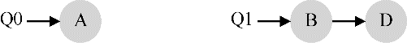
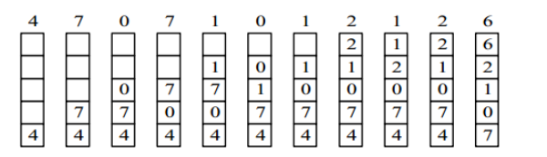

#  常见问题

## 操作系统中你觉得挑战性比较大的点是什么？

进程间的通信

同步


## 进程、线程、协程

**进程：**是具有一定独立功能的程序关于某个数据集合上的一次进行活动，是系统进行资源分配和调度的一个独立单位。 

**线程：**是进程的一个实体，是cpu调度和分派的基本单位，他是比进程更小的能够独立运行的基本单位，线程自己基本上不拥有系统资源，只拥有一点在运行中必不可少的资源。

进程是拥有资源的基本单元，线程是独立调度的基本单元。


**为什么要有进程？**

程序的并发破坏了程序的封闭性和可再现性，使得程序和计算不再一一对应，不处于封闭系统，程序的额运行出现了许多新的特征，程序这种静态概念已经不能反应程序活动的特征了。

提高cpu利用率，实现程序的并发。但需要进行进程切换（为了`异步并发`的执行任务，提高系统效率及资源利用率）


**为什么要有线程？**

减少程序并发执行时所付出的时空开销

进一步提高cpu利用率

进程切换代价高

（为了`异步并发`的执行任务，提高系统效率及资源利用率）


**区别：**

-   拥有资源

**进程是资源分配的基本单位**，但是线程不拥有资源，线程可以访问隶属进程的资源。

-   调度

**线程是独立调度的基本单位**，在同一进程中，线程的切换不会引起进程切换，从一个进程中的线程切换到另一个进程中的线程时，会引起进程切换。

-   系统开销

由于创建或撤销进程时，系统都要为之分配或回收资源，如内存空间、I/O 设备等，所付出的开销远大于创建或撤销线程时的开销。类似地，在进行进程切换时，涉及当前执行进程 CPU 环境的保存及新调度进程 CPU 环境的设置，而线程切换时只需保存和设置少量寄存器内容，开销很小。

>   进程控制块 (Process Control Block, PCB) 描述进程的基本信息和运行状态，所谓的创建进程和撤销进程，都是指对 PCB 的操作。

-   通信方面

线程间可以通过直接读写同一进程中的数据进行通信，但是进程通信需要借助 IPC。


协作式和抢占式：

协作式：进程主动让出cpu，抢占式操作系统决定cpu给谁用


协程：

一种非抢占式(协作式)的任务调度模式，程序可以主动挂起或者恢复执行。

协程基于线程，但相对于线程轻量很多，可理解为在用户层模拟线程操作；
 每创建一个协程，都有一个内核态线程动态绑定，用户态下实现调度、切换，真正执行任务的还是内核线程。
 线程的上下文切换都需要内核参与，而协程的上下文切换，完全由用户去控制，**避免了大量的中断参与，减少了线程上下文切换与调度消耗的资源。**
 线程是操作系统层面的概念，协程是语言层面的概念

**线程与协程最大的区别在于：线程是被动挂起恢复，协程是主动挂起恢复**


为什么要引入协：

简化异步并发任务

而协程的目的就是当出现长时间的I/O操作时，通过让出目前的协程调度，执行下一个任务的方式，来消除ContextSwitch上的开销。


## 进程和线程的概念，进程线程创建方式

### 概念

**进程：**是具有一定独立功能的程序关于某个数据集合上的一次进行活动，是系统进行资源分配和调度的一个独立单位。 

**线程：**是进程的一个实体，是cpu调度和分派的基本单位，他是比进程更小的能够独立运行的基本单位，线程自己基本上不拥有系统资源，只拥有一点在运行中必不可少的资源。

进程是拥有资源的基本单元，线程是独立调度的基本单元。


### 进程创建方式

java中的进程类是Process。前面已经提到，每一个程序的运行基本上都会开启一个进程，然后执行进程的主线程。所以很多时候，我们**并不直接去使用代码来创建一个进程，而是交由系统来为每一个程序自动创建进程**。执行Java程序都伴随着Java虚拟机的执行，JVM启动进程的主线程，由主线程启动其他线程。对应的就是可执行的Java程序中必不可少的一个main方法，main方法是程序的起点，是程序的初始线程，其他线程都由它启动。


通过代码启动一个进程的方法：

#### java.lang.Runtime的exec方法

单例模式

```java
//打开指定路径的文件夹

Process p1 =Runtime.getRuntime().exec("open /Users/anonyper/Desktop/未命名文件夹");

Process p2 = new ProcessBuilder("open", "/Users/anonyper/Desktop/未命名文件夹").start();
```

#### Java.lang.ProcessBuilder的start方法

```java
public ProcessBuilder(String... var1) {...}
public ProcessBuilder(List<String> var1) {...}
public ProcessBuilder command(List<String> var1) {...}
public ProcessBuilder command(String... var1) {...}

//使用ProcessBuilder可以预先配置相关属性再创建进程，而且也可以在后续使用中随着需要改变相关属性，属性修改之后对已创建的进程没影响，只影响后续的start方法创建的进程。

//我要通过ProcessBuilder来启动一个进程打开cmd，并获取ip地址信息
public static void main(String[] args) throws IOException {
        ProcessBuilder pb = new ProcessBuilder("/bin/sh", "-c","ifconfig");
        Process process = pb.start();
        Scanner scanner = new Scanner(process.getInputStream());
        while (scanner.hasNextLine()) {
            System.out.println(scanner.nextLine());
        }
        scanner.close();
    }
```


### 线程创建方式

#### 实现 Runnable 接口

需要实现接口中的 run() 方法。

```java
public class MyRunnable implements Runnable {
    @Override
    public void run() {
        // ...
    }
}
```

使用 Runnable 实例再创建一个 Thread 实例，然后调用 Thread 实例的 start() 方法来启动线程。

```java
public static void main(String[] args) {
    MyRunnable instance = new MyRunnable();
    Thread thread = new Thread(instance);
    thread.start();
}
```

#### 实现 Callable 接口

与 Runnable 相比，Callable 可以有返回值，返回值通过 FutureTask 进行封装。

```java
public class MyCallable implements Callable<Integer> {
    public Integer call() {
        return 123;
    }
}
```

```java
public static void main(String[] args) throws ExecutionException, InterruptedException {
    MyCallable mc = new MyCallable();
    FutureTask<Integer> ft = new FutureTask<>(mc);
    Thread thread = new Thread(ft);
    thread.start();
    System.out.println(ft.get());
}
```

#### 继承 Thread 类

同样也是需要实现 run() 方法，因为 Thread 类也实现了 Runable 接口。

当调用 start() 方法启动一个线程时，虚拟机会将该线程放入就绪队列中等待被调度，当一个线程被调度时会执行该线程的 run() 方法。

```java
public class MyThread extends Thread {
    public void run() {
        // ...
    }
}
```

```java
public static void main(String[] args) {
    MyThread mt = new MyThread();
    mt.start();
}
```

#### 实现接口 VS 继承 Thread

实现接口会更好一些，因为：

- Java 不支持多重继承，因此继承了 Thread 类就无法继承其它类，但是可以实现多个接口；
- 类可能只要求可执行就行，继承整个 Thread 类开销过大。


## 一个进程有多个线程，某个线程挂了，影响进程吗？

会崩溃。线程没有自己单独的内存地址空间。

在一个线程中把另外一个线程的栈空间写坏是再正常不过的事情了。这与进程有没有自己的栈空间无关，因为无论他们有没有自己的栈空间，都可以通过内存地址访问到其他线程的栈空间，所以指针数据的错误可以导致任何同地址空间内其他线程的崩溃，当然也可以导致进程崩溃。

>   线程有自己的 stack，但是没有单独的 heap，也没有单独的 address space。
>
>   只有进程有自己的 address space，而这个 space 中经过合法申请的部分叫做 process space。Process space 之外的地址都是非法地址。
>
>   当一个线程向非法地址读取或者写入，无法确认这个操作是否会影响同一进程中的其它线程，所以只能是整个进程一起崩溃。


## 线程是共享进程的，共享的哪些数据？

堆和方法区是所有线程共享的资源，其中**堆**是进程中最大的一块内存，主要用于存放**新创建的对象** (几乎所有对象都在这里分配内存)，
**方法区**主要用于存放**已被加载的类信息、常量、静态变量、即时编译器编译后的代码**等数据。


#### 堆

**唯一目的就是存放对象实例，几乎所有的对象实例以及数组都在这里分配内存。**

Java 堆是垃圾收集器管理的主要区域，因此也被称作 **GC 堆（Garbage Collected Heap）**.

在 JDK 7 版本及 JDK 7 版本之前，**堆内存**被通常分为下面三部分：

1.  新生代内存(Young Generation)
2.  老生代(Old Generation)
3.  永久代(Permanent Generation)

下图所示的 Eden 区、两个 Survivor 区 S0 和 S1 都属于新生代，中间一层属于老年代，最下面一层属于永久代。**JDK 8 版本之后 PermGen(永久) 已被 Metaspace(元空间) 取代，元空间使用的是直接内存** 


>   大部分情况，对象都会首先在 Eden 区域分配，在一次新生代垃圾回收后，如果对象还存活，则会进入 S0 或者 S1，并且对象的年龄还会加  1(Eden 区->Survivor 区后对象的初始年龄变为 1)，当它的年龄增加到一定程度（默认为 15  岁），就会被晋升到老年代中。对象晋升到老年代的年龄阈值，可以通过参数 `-XX:MaxTenuringThreshold` 来设置


堆这里最容易出现的就是 `OutOfMemoryError` 错误，并且出现这种错误之后的表现形式还会有几种，比如：

1.  **`java.lang.OutOfMemoryError: GC Overhead Limit Exceeded`** ： 当 JVM 花太多时间执行垃圾回收并且只能回收很少的堆空间时，就会发生此错误。
2.  **`java.lang.OutOfMemoryError: Java heap space`** :假如在创建新的对象时, 堆内存中的空间不足以存放新创建的对象, 就会引发此错误。(和配置的最大堆内存有关，且受制于物理内存大小。最大堆内存可通过`-Xmx`参数配置，若没有特别配置，将会使用默认值，


#### 方法区（元空间）

当虚拟机要使用一个类时，它需要读取并解析 Class 文件获取相关信息，再将信息存入到方法区。方法区会存储已被虚拟机加载的 **类信息、字段信息、方法信息、常量、静态变量、即时编译器编译后的代码缓存等数据**。


方法区和堆


## 线程的数据会放在哪？

### 虚拟机栈

每个 Java 方法在执行的同时会创建一个**栈帧**用于存储**局部变量表、操作数栈、常量池引用，动态链接，方法返回地址**等信息。从方法调用直至执行完成的过程，就对应着一个栈帧在 Java 虚拟机栈中入栈和出栈的过程（先进后出）。


**局部变量表**  主要存放了编译期可知的各种数据类型（boolean、byte、char、short、int、float、long、double）、对象引用（reference 类型，它不同于对象本身，可能是一个指向对象起始地址的引用指针，也可能是指向一个代表对象的句柄或其他与此对象相关的位置）。

**操作数栈** 主要作为方法调用的中转站使用，用于存放方法执行过程中产生的中间计算结果。另外，计算过程中产生的临时变量也会放在操作数栈中。

**动态链接** 主要服务一个方法需要调用其他方法的场景。**在 Java 源文件被编译成字节码文件时，所有的变量和方法引用都作为符号引用（Symbilic  Reference）保存在 Class  文件的常量池【方法区】里**。**当一个方法要调用其他方法，需要将常量池中指向方法的符号引用转化为其在内存地址中的直接引用**。动态链接的作用就是为了将符号引用转换为调用方法的直接引用。


### 本地方法栈

### native方法：调用其他语言方法的接口

和虚拟机栈所发挥的作用非常相似，区别是： **虚拟机栈为虚拟机执行 Java 方法 （也就是字节码）服务，而本地方法栈则为虚拟机使用到的 Native 方法服务。** 在 HotSpot 虚拟机中和 Java 虚拟机栈合二为一。


### 程序计数器

作用：

-   **字节码解释器**工作时通过改变这个计数器的值来选取下一条需要执行的**字节码指令**，从而实现代码的流程控制，如：顺序执行、选择、循环、异常处理。
-   在多线程的情况下，程序计数器用于记录当前线程执行的位置，从而当线程被切换回来的时候能够知道该线程上次运行到哪儿了。

⚠️ 注意 ：程序计数器是唯一一个不会出现 `OutOfMemoryError` 的内存区域，它的生命周期随着线程的创建而创建，随着线程的结束而死亡。


## 线程模型

### 定义

java字节码运行在JVM中，JVM运行在各个操作系统上，jvm要进行线程创建和回收时，需要调用操作系统的相关接口。jvm的线程与操作系统的线程中存在着某种映射关系，线程模型就是jvm与操作系统中线程的规范和协议。


### 为什么需要

jvm线程对不同操作系统的原生线程进行了高级抽象，不用关注下层细节专注上层开发。


### 有哪些线程模型

>   内核线程（线程对内核可见）：在支持内核线程的操作系统中，内核维护进程和线程上下文信息并完成线程切换，由于线程对内核可见，所以一个线程由于io操作阻塞，不会影响其他线程运行。
>
>   用户线程（线程对内核不可见）：由于内核不知道线程的存在，所以当一个线程由于io操作阻塞，会直接将进程阻塞，会影响其他线程运行，


**用户态线程创建成本低，问题明显，不可以利用多核。内核态线程，创建成本高，可以利用多核，切换速度慢**。


#### 用户线程：内核线程 =  1:1

一对一（JVM常用）【内核线程KLT、轻量级进程LWP】

概念：

每个用户线程都映射到一个内核线程，每个线程都成为一个独立的调度单元，由内核调度器独立调度，一个线程的阻塞不会影响到其他线程，从而保障整个进程继续工作。（反过来，一个内核线程不一定就会对应一个用户线程）

优点：

每个线程都成为一个独立的调度单元，使用内核提供的线程调度功能及处理器映射，可以完成线程的切换，并将线程的任务映射到其他处理器上，充分利用多核处理器的优势，实现真正的并行。

缺点：

-   每创建一个用户级线程都需要创建一个内核级线程与其对应，因此需要消耗一定的内核资源,而内核资源是有限的，所以能创建的线程数量也是有限的。

-   模态切换频繁，各种线程操作，如创建、析构及同步，都需要进行系统调用，需要频繁的在用户态和内核态之间切换，开销大。

>   linux中，没有内核线程（KLT）概念，有的是轻量级进程（LWP），不同于进程，每个进程可以独享一块内存空间，轻量级进程没有独立的地址空间，只能共享同一个轻量级进程组下的地址空间。两者使用clone（）时传递的参数不同（参数表示为是否共享地址空间）


#### 用户线程：内核线程 =  N:1

多对一：用户线程的调度由用户空间完成。

概念：

多个用户线程映射到一个内核线程，用户线程建立在用户空间的线程库上，用户线程的建立、同步、销毁和调度完全在用户态中完成，对内核透明。果程序实现得当，不需要切换内核态，因此操作可以是非常快且低消耗的，也能够支持规模更大的线程数量，部分高性能数据库中的多线程就是由用户线程实现的。**（线程之间的切换由用户代码来执行）**

优点：

-   线程的上下文切换都发生在用户空间，避免了模态切换（mode switch），减少了性能的开销。

-   用户线程的创建不受内核资源的限制，可以支持更大规模的线程数量。

缺点：

-   **当一个线程进行内核调用阻塞后，其他线程都无法进行内核调用。**所有的线程基于一个内核调度实体即内核线程，这意味着只有一个处理器可以被利用，浪费了其它处理器资源，不支持并行，在多处理器环境下这是不能够被接受的，如果线程因为 I/O 操作陷入了内核态，内核态线程阻塞等待 I/O 数据，则所有的线程都将会被阻塞。

-   增加了复杂度，所有的线程操作都需要用户程序自己处理，而且在用户空间要想自己实现 “阻塞的时候把线程映射到其他处理器上” 异常困难


#### 用户线程：内核线程 =  M:N

概念：
内核线程和用户线程的数量比为 M : N，这种模型需要内核线程调度器和用户空间线程调度器相互操作，本质上是多个线程被映射到了多个内核线程。

优点：

-   用户线程的创建、切换、析构及同步依然发生在用户空间，能创建数量更多的线程，支持更大规模的并发。

-   大部分的线程上下文切换都发生在用户空间，减少了模态切换带来的开销。

-   可以使用内核提供的线程调度功能及处理器映射，充分利用多核处理器的优势，实现真正的并行，并降低了整个进程被完全阻塞的风险。

缺点：

实现难度高


## 进程通信方式

进程同步与进程通信很容易混淆，它们的区别在于：

-   进程同步：控制多个进程按一定顺序执行；
-   进程通信：进程间传输信息。

进程通信是一种手段，而进程同步是一种目的。也可以说，为了能够达到进程同步的目的，需要让进程进行通信，传输一些进程同步所需要的信息。


每个进程各自有不同的用户地址空间，任何一个进程的全局变量在另一个进程中都看不到，所以进程之间要交换数据必须通过内核，在内核中开辟一块缓冲区，进程1把数据从用户空间拷到内核缓冲区，进程2再从内核缓冲区把数据读走，内核提供的这种机制称为**进程间通信**


大概有 7 种常见的进程间的通信方式。

下面这部分总结参考了:[《进程间通信 IPC (InterProcess Communication)》](https://www.jianshu.com/p/c1015f5ffa74)

>    这篇文章，推荐阅读，总结的非常不错。

### 管道

**管道/匿名管道(Pipes)** ：用于具有亲缘关系的父子进程间或者兄弟进程之间的通信。

半双工。

数据是无格式（必须实现约定好数据的格式）

不是普通的文件，不属于文件系统，只存在内存中

管道读数据是一次性的，数据一旦被读走，管道就释放空间了

存在阻塞方式

>   ```c
>   #include <unistd.h>
>   int pipe(int fd[2]);
>   ```


### 有名管道（FIFO）

**有名管道(Names Pipes)** : 匿名管道由于没有名字，只能用于亲缘关系的进程间通信。为了克服这个缺点，提出了有名管道。有名管道严格遵循**先进先出(first in first out)**。有名管道以磁盘文件的方式存在，可以实现本机任意两个进程通信。**有名管道的名字存在于文件系统中，内容存放在内存中**

>   ```c
>   #include <sys/stat.h>
>   int mkfifo(const char *path, mode_t mode);
>   int mkfifoat(int fd, const char *path, mode_t mode);
>   ```

>   **匿名管道和有名管道总结：**
>   （1）管道是特殊类型的文件，在满足先入先出的原则条件下可以进行读写，但不能进行定位读写。
>   （2）匿名管道是单向的，只能在有亲缘关系的进程间通信；有名管道以磁盘文件的方式存在，可以实现本机任意两个进程通信。
>   （3）**无名管道阻塞问题：**无名管道无需显示打开，创建时直接返回文件描述符，在读写时需要确定对方的存在，否则将退出。如果当前进程向无名管道的一端写数据，必须确定另一端有某一进程。如果写入无名管道的数据超过其最大值，写操作将阻塞，如果管道中没有数据，读操作将阻塞，如果管道发现另一端断开，将自动退出。
>   （4）**有名管道阻塞问题：**有名管道在打开时需要确实对方的存在，否则将阻塞。即以读方式打开某管道，在此之前必须一个进程以写方式打开管道，否则阻塞。此外，可以以读写（O_RDWR）模式打开有名管道，即当前进程读，当前进程写，不会阻塞。

FIFO 常用于客户-服务器应用程序中，FIFO 用作汇聚点，在客户进程和服务器进程之间传递数据。


### 信号

**信号(Signal)** ：是linux比较古老的方式，是软件中断。异步通讯方式。

信号可以在用户空间进程和内核之间直接交互，内核可以利用信号来通知用户空间的进程发生了哪些系统事件。

>   比较重要的信号：
>
>   SIGINT 当⽤户按下了<Ctrl+C>组合键时，⽤户终端向正在运⾏中的由该终端启动的程序发出此信号，终⽌进程
>
>   SIGQUIT ⽤户按下<ctrl+>组合键时产⽣该信号，⽤户终端向正在运⾏中的由该终端启动的程序发出些信号,终⽌进程
>
>   SIGSEGV 指示进程进⾏了⽆效内存访问(段错误), 终⽌进程并产⽣core⽂件
>
>   SIGPIPE Broken pipe向⼀个没有读端的管道写数据,终⽌进程
>
>   SIGCHLD：子进程结束运行，其父进程会收到SIGCHLD信号。该信号的默认处理动作是忽略。可以捕捉该信号，在捕捉函数中完成子进程状态的回收。


### 消息队列

**消息队列(Message Queuing)**  ：消息队列是消息的链表,具有特定的格式,存放在内存中并由消息队列标识符标识。管道和消息队列的通信数据都是先进先出的原则。

>   与管道（无名管道：只存在于内存中的文件；命名管道：存在于实际的磁盘介质或者文件系统）不同的是消息队列存放在**内核**中，只有在内核重启(即，操作系统重启)或者显式地删除一个消息队列时，该消息队列才会被真正的删除

消息队列具有以下优点：

-   消息队列可以**独立于读写进程存在**，从而避免了 FIFO 中同步管道的打开和关闭时可能产生的困难；

-   避免了 FIFO 的同步阻塞问题，不需要进程自己提供同步方法；

-   克服了信号承载信息量少，管道只能承载无格式字节流以及缓冲区大小受限等缺点。

-   读进程可以根据消息类型有选择地接收消息，而不像 FIFO 那样只能默认地接收。


### 信号量

**信号量(Semaphores)** ：信号量是一个计数器，用于多进程对共享数据的访问，信号量的意图在于进程间同步。这种通信方式主要用于解决与同步相关的问题并避免竞争条件。

>   信号量是一个计数器，用于多进程对共享数据的访问，信号量的意图在于进程间同步。
>   为了获得共享资源，进程需要执行下列操作：
>   （1）**创建一个信号量**：这要求调用者指定初始值，对于二值信号量来说，它通常是1，也可是0。
>   （2）**等待一个信号量**：该操作会测试这个信号量的值，如果小于0，就阻塞。也称为P操作。
>   （3）**挂出一个信号量**：该操作将信号量的值加1，也称为V操作。
>
>   为了正确地实现信号量，信号量值的测试及减1操作应当是原子操作。为此，信号量通常是在内核中实现的。Linux环境中，有三种类型：**Posix（[可移植性操作系统接口](https://link.jianshu.com?t=http://baike.baidu.com/link?url=hYEo6ngm9MlqsQHT3h28baIDxEooeSPX6wr_FdGF-F8mf7wDp2xJWIDtQWGEDxthtPNiJtlsw460g1_N0txJYa)）有名信号量（使用Posix IPC名字标识）**、**Posix基于内存的信号量（存放在共享内存区中）**、**System V信号量（在内核中维护）**。这三种信号量都可用于进程间或线程间的同步。


### 共享存储

**共享内存(Shared memory)** ：使得多个进程可以访问同一块内存空间，不同进程可以及时看到对方进程中对共享内存中数据的更新。这种方式需要依靠某种**同步操作**，如互斥锁和信号量等。可以说这是最有用的进程间通信方式。【客户和服务器】


也叫共享存储映射：磁盘文件与存储空间中的一个缓冲区相映射【内存和磁盘】mmap

多个进程可以将同一个文件映射到它们的地址空间从而实现共享内存。另外 XSI 共享内存不是使用文件，而是使用内存的匿名段。


因为数据不需要在进程之间复制，所以这是最快的一种 IPC。

需要使用信号量用来同步对共享存储的访问。


### 套接字

**套接字(Sockets)** : 此方法主要用于在客户端和服务器之间通过网络进行通信。套接字是支持 TCP/IP 的网络通信的基本操作单元，可以看做是不同主机之间的进程进行双向通信的端点，简单的说就是通信的两方的一种约定，用套接字中的相关函数来完成通信过程。


## 并行和并发

并发：指计算机同个时间段中能够执行多项任务。

单核处理器：分配时间片的方式，让一个程序运行一段时间再切换到另一个任务，不		同任务交替进行（进程/线程的上下文切换）。


并行：同一时刻能够执行多项任务。

多核处理器


## 阻塞和非阻塞

阻塞时，在调用结果返回前，当前线程会被挂起，并在得到结果之后返回。（阻塞会占用物理内存，在虚拟内存管理的操作系统，会吧他换到硬盘）

非阻塞时，如果不能立刻得到结果，则该调用者不会阻塞当前线程。因此对应非阻塞的情况，调用者需要定时轮询查看处理状态。


## 同步和异步

同步：当前任务需要等待前一个任务执行完成之后才能执行。（安排并发的顺序）

异步：执行任务A时也可以执行任务B。多线程编程实现


## 同步和互斥

-   同步：多个进程因为合作产生的直接制约关系（需要交流），使得进程有一定的先后执行关系。直接相互制约关系【进程-进程】
-   互斥：多个进程在同一时刻只有一个进程能进入临界区。间接相互制约关系【进程-资源-进程】

**区别同步和互斥：**

同类进程是互斥（消费者和消费者）、不同类则是同步（生产者和消费者）。


## 数据的并发：启动一个线程的方式

同1.3


## 线程创建的三种方式以及区别

Java使用Thread类代表线程，所有的线程对象都必须是Thread类或其子类的实例。

### Java三种方式创建线程

-   继承Thread类创建线程
-   实现Runnable接口创建线程
-   使用Callable和Future创建线程

#### **继承Thread类创建线程**

通过继承Thread类来创建并启动多线程的一般步骤如下
1、定义Thread类的子类，并重写该类的run（）方法，该方法的方法体就是线程需要完成的任务，run（）方法也称为线程执行体
2、创建Thread子类的实例，也就是创建了线程对象
3、启动线程，即调用线程的start（）方法

```java
public class MyThread extends Thread {

    public void run(){
        System.out.println("打印---测试1");
    }
}

public class Main {

    public static void main(String[] args) {
        new MyThread().start();//创建并启动线程
    }
}

```

#### **实现Runnable接口创建线程**

通过实现Runnable接口创建并启动线程一般步骤如下：
1、定义Runable接口的实现类，一样要重写run（）方法，这个run（）方法和Thread中的run（）方法一样是线程的执行体
2、创建Runable实现类的实例，并用这个实例作为Thread的target来创建Thread对象，这个Thread对象才是真正的线程对象
3、通过调用线程对象的start（）方法来启动线程

```java
public class MyThread2 implements Runnable {
    @Override
    public void run() {
        System.out.println("打印---测试Runnable");
    }
}

public class Main2 {

    public static void main(String[] args) {
        //创建并启动线程
        MyThread2 myThread2=new MyThread2();
        Thread thread=new Thread(myThread2);
        thread.start();
        // 或者 new Thread（new MyThread2()）.start()；
    }
}

```

#### **使用Callable和Future创建线程**

1、创建 Callable 接口的实现类，并实现 call（）方法，该call（）方法将作为线程执行体，并且有返回值
2、创建Callable实现类的实例，使用FutureTask类来包装Callable对象，该FutureTask对象封装了该Callable对象的call（）方法的返回值
3、使用FutureTask对象作为 Thread 对象的 target 创建并启动新线程
4、调用FutureTask对象的 get（）方法来获得子线程执行结束后的返回值

```java
public class MyThread3 implements Callable {
    @Override
    public Object call() throws Exception {
        System.out.println("打印---Callable方式");
        return 10;
    }
}

public class Main3 {
    public static void main(String[] args) throws ExecutionException, InterruptedException, TimeoutException {
        Callable callable=new MyThread3();
        FutureTask task=new FutureTask(callable);
        new Thread(task).start();
        System.out.println(task.get());
        Thread.sleep(10);//等待线程执行结束
        //task.get() 获取call（）的返回值，若调用时call（）方法未返回，则阻塞线程等待返回值
        //get的传入参数为等待时间，超时抛出超时异常；传入参数为空时，则不设超时，一直等待
        System.out.println(task.get(100L, TimeUnit.MILLISECONDS));
    }
}
```


### **三种方式的优缺点**

#### 采用继承Thread类方式：

（1）优点：编写简单，如果需要访问当前线程，无需使用Thread.currentThread（）方法，直接使用this，即可获得当前线程
（2）缺点：因为线程类已经继承了Thread类，所以不能再继承其他的父类
采用实现Runnable接口方式：
（1）优点：线程类只是实现了Runable接口，还可以继承其他的类。在这种方式下，可以多个线程共享同一个目标对象，所以非常适合多个相同线程来处理同一份资源的情况，从而可以将CPU代码和数据分开，形成清晰的模型，较好的体现了面向对象的思想。
（2）缺点：编程稍微复杂，如果需要访问当前线程，必须使用Thread.currentThread（）方法

#### Runnable和Callable的区别：

（1）Callable规定的方法是call（），Runnable规定的方法是run（）
（2）Callable的任务执行后可返回值，而Runnable的任务是不能返回值的
（3）call方法可以抛出异常，run方法不可以，因为run方法本身没有抛出异常，所以自定义的线程类在重写run的时候也无法抛出异常
（4）运行Callable任务可以拿到一个Future对象，表示异步计算的结果。它提供了检查计算是否完成的方法，以等待计算的完成，并检索计算的结果。通过Future对象可以了解任务的执行情况，可取消任务的执行，还可获取执行结果

#### start（）和run（）的区别

1、start（）方法用来，开启线程，但是线程开启后并没有立即执行，他需要获取CPU的执行权才可以执行
2、run（）方法是由JVM创建完本地操作系统级线程后回调的方法，不可以手动调用（否则就是普通方法）


## 线程池原理和4种创建方式

### 什么是线程池

Java中的线程池是运用场景最多的并发框架，几乎所有需要异步或并发执行任务的程序都可以使用线程池。

在开发过程中，合理地使用线程池能够带来3个好处。
第一：降低资源消耗。通过重复利用机制已降低线程创建和销毁造成的消耗。
第二：提高响应速度。当任务到达时，任务可以不需要等到线程创建就能立即执行。
第三：提高线程的可管理性。线程是稀缺资源，如果无限制地创建，不仅会消耗系统资源，还会降低系统的稳定性，使用线程池可以进行统一分配、调优和监控。但是，要做到合理利用线程池，必须对其实现原理了如指掌。


### 线程池作用

线程池是为突然大量爆发的线程设计的，通过有限的几个固定线程为大量的操作服务，减少了创建和销毁线程所需的时间，从而提高效率。

如果一个线程的时间非常长，就没必要用线程池了(不是不能作长时间操作，而是不宜。)，况且我们还不能控制线程池中线程的开始、挂起、和中止。


### 线程池原理剖析

1.如果当前线程池中的线程数目小于corePoolSize，则每来一个任务，就会创建一个线程去执行这个任务；

2.如果当前线程池中的线程数目>=corePoolSize，则每来一个任务，会尝试将其添加到任务缓存队列当中，若添加成功，则该任务会等待空闲线程将其取出去执行；若添加失败（一般来说是任务缓存队列已满），则会尝试创建新的线程去执行这个任务；

3.如果队列已经满了，则在总线程数不大于maximumPoolSize的前提下，则创建新的线程

4.如果当前线程池中的线程数目达到maximumPoolSize，则会采取任务拒绝策略进行处理；

5.如果线程池中的线程数量大于 corePoolSize时，如果某线程空闲时间超过keepAliveTime，线程将被终止，直至线程池中的线程数目不大于corePoolSize；如果允许为核心池中的线程设置存活时间，那么核心池中的线程空闲时间超过keepAliveTime，线程也会被终止。

线程池的拒绝策略：当最大线程数 + 队列缓存数量 小于线程数量的时候，程序运行出错，被拒绝。


### **线程池常用方法**

execute（）：提交任务，交给线程池执行

submit（）：提交任务，能够返回执行结果 execute + Future

shutdown（）：关闭线程池，等待任务都执行完

shutdownNow（）：关闭线程池，不等待任务执行完

getTaskCount（）：线程池已执行和未执行的任务总数

getCompletedTaskCount（）：已完成的任务数量

getPoolSize（）：线程池当前的线程数量

getActiveCount（）：当前线程池中正在执行任务的线程数量


### 线程池四种创建方式

newCachedThreadPool创建一个可缓存线程池，如果线程池长度超过处理需要，可灵活回收空闲线程，若无可回收，则新建线程。

newFixedThreadPool 创建一个定长线程池，可控制线程最大并发数，超出的线程会在队列中等待。

newScheduledThreadPool 创建一个定长线程池，支持定时及周期性任务执行。

newSingleThreadExecutor 创建一个单线程化的线程池，它只会用唯一的工作线程来执行任务，保证所有任务按照指定顺序(FIFO, LIFO, 优先级)执行。

#### newCachedThreadPool

创建一个可缓存线程池，如果线程池长度超过处理需要，可灵活回收空闲线程，若无可回收，则新建线程。示例代码如下：

```java
 1     /**
 2      * @ClassName: NewCachedThreadPool
 3      * @description: 创建一个可缓存的线程池  可创建线程数是无限大小的
 4      * @author: mingtian
 5      * @Date:2019/5/2 12:18
 6      **/
 7     public class NewCachedThreadPool {
 8         public static void main(String[] args) {
 9             // 可缓存线程池 Executors表示启动线程的  可创建线程数是无限大小的
10             ExecutorService executorService = Executors.newCachedThreadPool();
11             for (int i = 0; i < 10; i++) {
12                 final int temp = i;
13                 // 可执行线程  execute 启动线程
14                 executorService.execute(new Runnable() {
15                     public void run() {
16                         System.out.println(Thread.currentThread().getName() + "," + temp);
17                     }
18                 });
19             }
20             //停止线程池
21             executorService.shutdown();
22 
23         }
24     }
```

**总结**：

线程池为无限大，当执行第二个任务时第一个任务已经完成，会复用执行第一个任务的线程，而不用每次新建线程。


#### **newFixedThreadPool**

创建一个定长线程池，可控制线程最大并发数，超出的线程会在队列中等待。示例代码如下：

```java
 1 /**
 2  * @ClassName: NewFixedThreadPool
 3  * @description: 创建可固定长度的线程池
 4  * @author: mingtian
 5  * @Date:2019/5/2 12:27
 6  **/
 7 public class NewFixedThreadPool {
 8     public static void main(String[] args) {
 9         //创建可固定长度的线程池，只会创建3个线程池进行处理
10         ExecutorService executorService = Executors.newFixedThreadPool(3);
11         for (int i = 0; i < 20; i++) {
12             final int temp = i;
13             // 可执行线程  execute 启动线程
14             executorService.execute(new Runnable() {
15                 public void run() {
16                     System.out.println(Thread.currentThread().getName() + "," + temp);
17                 }
18             });
19         }
20         //停止线程池
21         executorService.shutdown();
22     }
```


定长线程池的大小最好根据系统资源进行设置。如Runtime.getRuntime().availableProcessors()

总结:

因为线程池大小为3，每个任务输出index后sleep 2秒，所以每两秒打印3个数字。


#### **newScheduledThreadPool**

创建一个定长线程池，支持定时及周期性任务执行。延迟执行示例代码如下：

```java
 1 /**
 2  * @ClassName: NewScheduledThreadPool
 3  * @description: 创建可定时执行的线程池 延迟多久执行线程
 4  * @author: mingtian
 5  * @Date:2019/5/2 12:35
 6  **/
 7 public class NewScheduledThreadPool {
 8     public static void main(String[] args) {
 9         //创建可定时执行的线程池
10         ScheduledExecutorService scheduledExecutorService = Executors.newScheduledThreadPool(3);
11         for (int i = 0; i < 10; i++) {
12             final int temp=i;
13             //schedule 方法表示线程执行  表示延迟3秒之后 开始执行线程
14             scheduledExecutorService.schedule(new Runnable() {
15                 public void run() {
16                     System.out.println(Thread.currentThread().getName()+""+temp);
17                 }
18             }, 3, TimeUnit.SECONDS);
19         }
20         //停止线程池
21         scheduledExecutorService.shutdown();
22     }
```

#### newSingleThreadExecutor

表示延迟3秒执行。

创建一个单线程化的线程池，它只会用唯一的工作线程来执行任务，保证所有任务按照指定顺序(FIFO, LIFO, 优先级)执行。示例代码如下：

```java
 1 /**
 2  * @ClassName: NewSingleThreadExecutor
 3  * @description: 单例线程池
 4  * @author: mingtian
 5  * @Date:2019/5/2 12:45
 6  **/
 7 public class NewSingleThreadExecutor {
 8     public static void main(String[] args) {
 9         //单线程
10         ExecutorService executorService = Executors.newSingleThreadExecutor();
11         for (int i = 0; i < 10; i++) {
12             final int temp = i;
13             // 可执行线程  execute 启动线程
14             executorService.execute(new Runnable() {
15                 public void run() {
16                     System.out.println(Thread.currentThread().getName() + "," + temp);
17                 }
18             });
19         }
20         //停止线程池
21         executorService.shutdown();
22     }
```


## 多核操作系统，怎么进行进程调度


**缓存亲和度**

在设计多处理器调度时遇到的最后一个问题，是所谓的缓存亲和度（cache affinity）。这个概念很简单：一个进程在某个CPU上运行时，会在该CPU的缓存中维护许多状态。下次该进程在相同CPU上运行时，由于缓存中的数据而执行得更快。相反，在不同的CPU上执行，会由于需要重新加载数据而很慢（好在硬件保证的缓存一致性可以保证正确执行）。因此多处理器调度应该考虑到这种缓存亲和性，并尽可能将进程保持在同一个CPU上。

### 单队列调度

最基本的方式是简单地复用单处理器调度的基本架构，将所有需要调度的工作放入一个单独的队列中，我们称之为单队列多处理器调度（Single Queue Multiprocessor Scheduling，SQMS）。这个方法最大的优点是简单。它不需要太多修改，就可以将原有的策略用于多个CPU，选择最适合的工作来运行（例如，如果有两个CPU，它可能选择两个最合适的工作）。

然而，SQMS有几个明显的短板。第一个是缺乏可扩展性（scalability）。为了保证在多CPU上正常运行，调度程序的开发者需要在代码中通过加锁（locking）来保证原子性，如上所述。在SQMS访问单个队列时（如寻找下一个运行的工作），锁确保得到正确的结果。

然而，锁可能带来巨大的性能损失，尤其是随着系统中的CPU数增加时[A91]。随着这种单个锁的争用增加，系统花费了越来越多的时间在锁的开销上，较少的时间用于系统应该完成的工作（哪天在这里加上真正的测量数据就好了）。

SQMS的第二个主要问题是缓存亲和性。比如，假设我们有5个工作（A、B、C、D、E）和4个处理器。调度队列如下：


一段时间后，假设每个工作依次执行一个时间片，然后选择另一个工作，下面是每个CPU可能的调度序列：


由于每个CPU都简单地从全局共享的队列中选取下一个工作执行，因此每个工作都不断在不同CPU之间转移，这与缓存亲和的目标背道而驰。

为了解决这个问题，大多数SQMS调度程序都引入了一些亲和度机制，尽可能让进程在同一个CPU上运行。保持一些工作的亲和度的同时，可能需要牺牲其他工作的亲和度来实现负载均衡。例如，针对同样的5个工作的调度如下：


这种调度中，A、B、C、D 这4个工作都保持在同一个CPU上，只有工作E不断地来回迁移（migrating），从而尽可能多地获得缓存亲和度。为了公平起见，之后我们可以选择不同的工作来迁移。但实现这种策略可能很复杂。

我们看到，SQMS调度方式有优势也有不足。优势是能够从单CPU调度程序很简单地发展而来，根据定义，它只有一个队列。然而，它的扩展性不好（由于同步开销有限），并且不能很好地保证缓存亲和度。


### 多队列调度

正是由于单队列调度程序的这些问题，有些系统使用了多队列的方案，比如每个CPU一个队列。我们称之为多队列多处理器调度（Multi-Queue Multiprocessor Scheduling，MQMS）

在MQMS中，基本调度框架包含多个调度队列，每个队列可以使用不同的调度规则，比如轮转或其他任何可能的算法。当一个工作进入系统后，系统会依照一些启发性规则（如随机或选择较空的队列）将其放入某个调度队列。这样一来，每个CPU调度之间相互独立，就避免了单队列的方式中由于数据共享及同步带来的问题。

例如，假设系统中有两个CPU（CPU 0和CPU 1）。这时一些工作进入系统：A、B、C和D。由于每个CPU都有自己的调度队列，操作系统需要决定每个工作放入哪个队列。可能像下面这样做：


根据不同队列的调度策略，每个CPU从两个工作中选择，决定谁将运行。例如，利用轮转，调度结果可能如下所示：


MQMS比SQMS有明显的优势，它天生更具有可扩展性。队列的数量会随着CPU的增加而增加，因此锁和缓存争用的开销不是大问题。此外，MQMS天生具有良好的缓存亲和度。所有工作都保持在固定的CPU上，因而可以很好地利用缓存数据。

但是，如果稍加注意，你可能会发现有一个新问题（这在多队列的方法中是根本的），即负载不均（load imbalance）。假定和上面设定一样（4个工作，2个CPU），但假设一个工作（如C）这时执行完毕。现在调度队列如下：


如果对系统中每个队列都执行轮转调度策略，会获得如下调度结果：


从图中可以看出，A获得了B和D两倍的CPU时间，这不是期望的结果。更糟的是，假设A和C都执行完毕，系统中只有B和D。调度队列看起来如下：


因此CPU使用时间线看起来令人难过：


所以可怜的多队列多处理器调度程序应该怎么办呢？

>   **关键问题：如何应对负载不均**
>   多队列多处理器调度程序应该如何处理负载不均问题，从而更好地实现预期的调度目标？

最明显的答案是让工作移动，这种技术我们称为迁移（migration）。通过工作的跨CPU迁移，可以真正实现负载均衡。

来看两个例子就更清楚了。同样，有一个CPU空闲，另一个CPU有一些工作。


在这种情况下，期望的迁移很容易理解：操作系统应该将B或D迁移到CPU0。这次工作迁移导致负载均衡，皆大欢喜。

更棘手的情况是较早一些的例子，A独自留在CPU 0上，B和D在CPU 1上交替运行。





在这种情况下，单次迁移并不能解决问题。应该怎么做呢？答案是不断地迁移一个或多个工作。一种可能的解决方案是不断切换工作，如下面的时间线所示。可以看到，开始的时候A独享CPU 0，B和D在CPU 1。一些时间片后，B迁移到CPU 0与A竞争，D则独享CPU 1一段时间。这样就实现了负载均衡。


当然，还有其他不同的迁移模式。但现在是最棘手的部分：系统如何决定发起这样的迁移？

一个基本的方法是采用一种技术，名为工作窃取（work stealing）[FLR98]。通过这种方法，工作量较少的（源）队列不定期地“偷看”其他（目标）队列是不是比自己的工作多。如果目标队列比源队列（显著地）更满，就从目标队列“窃取”一个或多个工作，实现负载均衡。

当然，这种方法也有让人抓狂的地方——如果太频繁地检查其他队列，就会带来较高的开销，可扩展性不好，而这是多队列调度最初的全部目标！相反，如果检查间隔太长，又可能会带来严重的负载不均。找到合适的阈值仍然是黑魔法，这在系统策略设计中很常见。


### 总结

本章介绍了多处理器调度的不同方法。其中单队列的方式（SQMS）比较容易构建，负载均衡较好，但在扩展性和缓存亲和度方面有着固有的缺陷。多队列的方式（MQMS）有很好的扩展性和缓存亲和度，但实现负载均衡却很困难，也更复杂。无论采用哪种方式，都没有简单的答案：构建一个通用的调度程序仍是一项令人生畏的任务，因为即使很小的代码变动，也有可能导致巨大的行为差异。除非很清楚自己在做什么，或者有人付你很多钱，否则别干这种事。


## 信号量PV操作，生产者消费者模式

信号量（Semaphore）是一个整型变量，可以对其执行 down 和 up 操作，也就是常见的 P 和 V 操作。

-   **down**（P操作） : 如果信号量大于 0 ，执行 -1 操作；如果信号量等于 0，进程睡眠(阻塞)，等待信号量大于 0；
-   **up** （V操作）：对信号量执行 +1 操作，唤醒睡眠的进程让其完成 down 操作。

down 和 up 操作需要被设计成原语，不可分割，通常的做法是在执行这些操作的时候屏蔽中断。


### 生产者消费者

使用一个缓冲区来保存物品，只有缓冲区没有满，生产者才可以放入物品；只有缓冲区不为空，消费者才可以拿走物品。

因为缓冲区属于临界资源，因此需要使用一个**互斥量 mutex 来控制对缓冲区的互斥访问**。

mutex=1表示可以访问 解锁

mutex=0 加锁

为了同步生产者和消费者的行为，需要**记录缓冲区中物品的数量**。数量可以使用信号量来进行统计，这里需要使用两个信号量：**empty 记录空缓冲区的数量，full 记录满缓冲区的数量**。其中，empty 信号量是在生产者进程中使用，当 empty 不为 0 时，生产者才可以放入物品；full 信号量是在消费者进程中使用，当 full 信号量不为 0 时，消费者才可以取走物品。

>   注意，不能先对缓冲区进行加锁，再测试信号量。也就是说，不能先执行 down(mutex) 再执行 down(empty)。如果这么做了，那么可能会出现这种情况：生产者对缓冲区加锁后，执行 down(empty) 操作，发现 empty = 0，此时生产者睡眠。消费者不能进入临界区，因为生产者对缓冲区加锁了，消费者就无法执行 up(empty) 操作，empty 永远都为 0，导致生产者永远等待下，不会释放锁，消费者因此也会永远等待下去。

```c
#define N 100
typedef int semaphore;
semaphore mutex = 1;
semaphore empty = N;
semaphore full = 0;

void producer(){
	while(TRUE){
		int item = produce_item();
        P(&empty);
        P(&mutex);
        insert_item(item);
        V(&mutex);
        V(&full);
    }
}


void consumer(){
	while(TRUE){
		P(&full);
        P(&mutex);
        int item = remove_item();
        consume_item(item);
        V(&mutex);
        V(&empty);
    }
}
```


## **临界资源的概念，多线程多cpu之间共享资源的保护怎么做的**

一次仅允许一个进程使用的资源称为临界资源。 许多物理设备都属于临界资源，如输入机、打印机、磁带机等。

### 临界区

对临界资源进行访问的那段代码称为临界区。

为了互斥访问临界资源，每个进程在进入临界区之前，需要先进行检查。

```
// entry section
// critical section;
// exit section
```


### 同步与互斥

-   同步：多个进程因为合作产生的直接制约关系，使得进程有一定的先后执行关系。

-   互斥：多个进程在同一时刻只有一个进程能进入临界区。

    

### 信号量

信号量（Semaphore）是一个整型变量，可以对其执行 down 和 up 操作，也就是常见的 P 和 V 操作。

-   **down**（P操作） : 如果信号量大于 0 ，执行 -1 操作；如果信号量等于 0，进程睡眠(阻塞)，等待信号量大于 0；
-   **up** （V操作）：对信号量执行 +1 操作，唤醒睡眠的进程让其完成 down 操作。

down 和 up 操作需要被设计成原语，不可分割，通常的做法是在执行这些操作的时候屏蔽中断。

如果信号量的取值只能为 0 或者 1，那么就成为了 **互斥量（Mutex）** ，0 表示临界区已经加锁，1 表示临界区解锁。

```c
typedef int semaphore;
semaphore mutex = 1;
void P1() {
    down(&mutex);
    // 临界区
    up(&mutex);
}

void P2() {
    down(&mutex);
    // 临界区
    up(&mutex);
}
```

   

#### 信号量与普通整型变量的区别

-   信号量是非负整型变量，除了初始化之外，它只能通过两个标准原子操作：wait(semap) , signal(semap) ; 来进行访问；
-   操作也被成为PV原语（P来源于荷兰语proberen"测试"，V来源于荷兰语verhogen"增加"，P表示通过的意思，V表示释放的意思），而普通整型变量则可以在任何语句块中被访问；


#### 信号量与互斥量之间的区别

-   互斥量用于线程的互斥，信号量用于线程的同步。这是互斥量和信号量的根本区别，也就是互斥和同步之间的区别。

    >   **互斥：**是指某一资源同时只允许一个访问者对其进行访问，具有唯一性和排它性。但互斥无法限制访问者对资源的访问顺序，即访问是无序的。
    >   **同步：**是指在互斥的基础上（大多数情况），通过其它机制实现访问者对资源的有序访问。同步就是数据保持一致，无论是进程还是线程，都是实现了代码执行流程的分支，多个分支同时进行。多个分支互不干扰，但是又有些数据需要共享，让这些数据对所有分支保持一致即为同步。
    >
    >   在大多数情况下，同步已经实现了互斥，特别是所有写入资源的情况必定是互斥的。少数情况是指可以允许多个访问者同时访问资源

-   互斥量值只能为0/1，信号量值可以为非负整数。
    也就是说，一个互斥量只能用于一个资源的互斥访问，它不能实现多个资源的多线程互斥问题。信号量可以实现多个同类资源的多线程互斥和同步。当信号量为单值信号量是，也可以完成一个资源的互斥访问。

-   互斥量的加锁和解锁必须由同一线程分别对应使用，信号量可以由一个线程释放，另一个线程得到。


### 管程

使用信号量机制实现的生产者消费者问题需要客户端代码做很多控制，而管程把控制的代码独立出来，不仅不容易出错，也使得客户端代码调用更容易。管程把分散在各个进程中互斥访问公共变量的临界区集中起来，提供对他们的保护。

管程有一个重要特性：在一个时刻只能有一个**进程使用管程**。进程在无法继续执行的时候不能一直占用管程，否则其它进程永远不能使用管程。

管程引入了 **条件变量** 以及相关的操作：**wait()** 和 **signal()** 来实现同步操作。对条件变量执行 wait() 操作会导致调用进程阻塞，把管程让出来给另一个进程持有。signal() 操作用于唤醒被阻塞的进程


### 锁

实现同步

**解决方案**
当多个线程同时访问同一份资源的时候，如果其中的一个线程抢到了时间片，如果给这个资源“上一把锁”，这个时候其他剩余的线程只能在锁外面进行等待。

**锁**
对象锁：任意的对象都可以充当一把锁；
类锁：把任意一个类当作锁，格式：类名.class


## CPU状态

### CPU状态之间的转换

用户态--->内核态：唯一途径是通过中断、异常、陷入机制（访管指令）

内核态--->用户态：设置程序状态字PSW

以下三种情况会导致用户态到内核态的切换：

\- 1）系统调用

这是**用户态进程主动要求切换到内核态**的一种方式，用户态进程通过系统调用申请使用操作系统提供的服务程序完成工作。比如前例中fork()实际上就是执行了一个创建新进程的系统调用。

而系统调用的机制其核心还是使用了操作系统为用户特别开放的一个**中断**来实现，例如Linux的int 80h中断。

\- 2）异常

当CPU在执行运行在**用户态下的程序**时，发生了某些事先不可知的异常，这时会触发由当前运行进程切换到处理**此异常的内核**相关程序中，也就转到了内核态，比如缺页异常。

\- 3）外围设备的中断

当外围设备完成用户请求的操作后，会**向CPU发出相应的中断信号**，这时CPU会暂停执行下一条即将要执行的指令转而去执行**与中断信号**对应的处理程序，

如果先前执行的指令是用户态下的程序，那么这个转换的过程自然也就发生了由用户态到内核态的切换。比如硬盘读写操作完成，系统会切换到硬盘读写的中断处理程序中执行后续操作等。

这3种方式是系统在运行时由用户态转到内核态的最主要方式，其中系统调用可以认为是用户进程主动发起的，异常和外围设备中断则是**被动**的。


### CPU上下文切换

Linux 是个多用户系统，支持大于cpu核数的任务在系统上运行所以不可避免的出现cpu资源竞争，竞争CPU会导致 上下文切换

CPU在不同的任务之前切换需要保存任务的运行资源记录：CPU得知道从哪里去加载任务，又从哪里开始运行所以需要用到**CPU寄存器和程序计数器**。在理解上面的基础上CPU上下文切换就是**保存上一个任务运行的寄存器和计数器信息切换到加载下一个任务的寄存器和计数器的过程**

cpu上下文切换分类：

\- 进程上下文切换

\- 线程上下文切换

\- 中断上下文切换


## 线程状态

https://www.jianshu.com/p/9208424392f4

**如果临界资源中的数据正在被其他线程使用，那当前线程处于什么状态 ？**

阻塞状态，等待资源。会占用物理内存，如果存在虚存，一般会选择挂起（未占用物理内存）

置换到磁盘中


**执行这个线程的cpu去干嘛了？**

内核进行线程切换

cpu去执行别的进程？（从就绪态里选）

>用户态线程无法跨核心，一个进程的多个用户态线程不能并发，阻塞一个用户态线程会导致进程的主线程阻塞，直接交出执行权限。这些都是用户态线程的劣势。内核线程可以独立执行，操作系统会分配时间片段。因此内核态线程更完整，也称作轻量级进程。内核态线程创建成本高，切换成本高，创建太多还会给调度算法增加压力，因此不会太多。


**这个线程获取到资源后，cpu怎么去执行？**

获得设备资源后可以重新进入就绪状态


**中断的处理过程**
情况一：对于某些中断，在处理完毕后，直接返回刚刚被中断的进程

情况二：对于其他一些中断，要中断当前进程的运行，调整进程队列，启动进程调度，选择下一个执行的进程并恢复其执行

(1) 执行完每个指令后，CPU都要检查当前是否有外部中断信号。
(2) 如果检测到外部中断信号，则需要保护被中断进程的CPU环境（如程序状态字PSW、程序计数器、各种通用寄存器）。
(3) 根据中断信号类型转入相应的中断处理程序。
(4) 恢复进程的CPU环境并退出中断，返回原进程继续往下执行


**如果处于内核态，多个cpu怎么处理的？**

在多处理器系统中，内核能够同时调度同一进程中多个线程并行执行到多个处理器中；如果进程中的一个线程被阻塞，内核可以调度同一个进程中的另一个线程；内核支持线程具有很小的数据结构和堆栈，线程的切换比较快，切换开销小；内核本身也可以使用多线程的方式来实现。


缺点：

即使CPU在同一个进程的多个线程之间切换，也需要陷入内核，因此其速度和效率不如用户级线程。


## 什么是线程安全，如何保证线程安全

### 线程安全

 线程安全就是多线程访问时，采用了加锁机制，当一个线程访问该类的某个数据时，进行保护，其他线程不能进行访问直到该线程读取完，其他线程才可使用。不会出现数据不一致或者数据污染。 线程不安全就是不提供数据访问保护，有可能出现多个线程先后更改数据造成所得到的数据是脏数据。


### 如何保证

-   使用线程安全的类；

-   使用synchronized同步代码块，或者用Lock锁；

    由于线程安全问题，使用synchronized同步代码块
    原理：当两个并发线程访问同一个对象object中的这个synchronized(this)同步代码块时，一个时间内只能有一个线程得到执行。另一个线程必须等待当前线程执行完这个代码块以后才能执行该代码块。

-   多线程并发情况下，线程共享的变量改为方法局部级变量；


## 多线程高并发的业务，怎么做并发保护?

背景：以低的硬件成本，开发运行效率高的软件。

做法：拆分计算机处理的任务，将其发布到多个廉价cpu上。（单cpu多任务->多cpu多任务并发）

出现问题：多个任务要进行读写同一块内存时，如何进行同步管理保证程序不会出错，且高性能？

解决方法：

-   并发编程（锁）
-   信号量
-   管程


## 信号量和自旋锁的区别？分别用在什么场景？

自旋锁与信号量作为同步机制，都是用来保护临界区的，但是它们的工作方式完全不一样。

1.  自旋锁只有两种状态，即LOCKED与UNLOCKED。
    而信号量既可以作为互斥锁来使用（此时具有0和1两种状态），也可以作为资源计数器来使用（此时为正整数，具有不同的值，例如：0,1,2,...）

2.  进程在获取自旋锁时，会持续地查询锁的状态（读改写的原子操作），若未获取到锁则CPU会处于一直忙等待状态，这正是“自旋”的含义。
    进程在获取信号量时，如果没有获取到则会转入睡眠状态，在未来的某个时间进程被唤醒并重新获取信号量。

    >   阻塞：是线程自己发现没资源，获取不到资源，它自己先去休息了，有资源它会自己回来，而且不占用CPU。【占物理内存】
    >
    >   挂起：CPU告诉线程你先去休息，有资源我告诉你。它会释放CPU。【不占用CPU和内存】
    >
    >   睡眠：睡眠是指CPU告诉线程，你先去休息，过规定时间，你自己回来。
    >
    >   忙等待：忙等待是指线程找不到资源就一直等，并且将CPU占据。【占用CPU,物理内存】

3.  自旋锁原本用于多核SMP（对称多处理）环境下，在并发时进行临界区的保护，以上第2点讲到的忙等待就是这个情形下的经典操作。但是在单核环境下，其经典操作会有些不同。
    在单核的情形下，若开了抢占功能，则其等同于SMP的环境，也需要考虑并发的问题，采用禁止抢占来加锁，采用使能抢占来解锁。
    在单核的情形下，若没有开抢占功能，则自旋锁被**优化为**什么也不做。

4.  在中断上下文（软中断，硬中断）使用自旋锁，需要使用带有中断操作的自旋锁版本。

5.  自旋锁可以用在中断上下文。
    但是信号量不能用在中断上下文，因为它会睡眠，这是不允许的。


总结：

自旋锁：spinlock，在任何时刻同样只能有一个线程访问对象。但是当获取锁操作失败时，**不会进入睡眠，而是会在原地自旋**，直到锁被释放。这样节省了线程从睡眠状态到被唤醒期间的消耗，**在加锁时间短暂的环境下会极大的提高效率**。但如果加锁时间过长，则会非常浪费CPU资源

信号量：semaphore，是用于线程间同步的，当一个线程完成操作后就通过信号量通知其它线程，然后别的线程就可以继续进行某些操作了。


## CAS的理念和应用场景？ 

### CAS(乐观锁)

乐观锁需要**操作和冲突检测**这两个步骤具备原子性，这里就不能再使用互斥同步来保证了，只能靠硬件来完成。硬件支持的原子性操作最典型的是：比较并交换（Compare-and-Swap，CAS）。CAS 指令需要有 3 个操作数，分别是内存地址 V、旧的预期值 A 和新值 B。当执行操作时，只有当 V 的值等于 A，才将 V 的值更新为 B。


**悲观锁**(互斥锁)
总是假设最坏的情况，每次去拿数据的时候都认为别人会修改，所以每次在拿数据的时候都会上锁，这样别人想拿这个数据就会阻塞直到它拿到锁（共享资源每次只给一个线程使用，其它线程阻塞，用完后再把资源转让给其它线程）。传统的关系型数据库里边就用到了很多这种锁机制，比如行锁，表锁等，读锁，写锁等，都是在做操作之前先上锁。Java中synchronized和ReentrantLock等独占锁就是悲观锁思想的实现。

**乐观锁**
总是假设最好的情况，每次去拿数据的时候都认为别人不会修改，所以不会上锁，但是在更新的时候会判断一下在此期间别人有没有去更新这个数据，可以使用版本号机制和CAS算法实现。乐观锁**适用于多读的应用类型，**这样可以提高吞吐量，像数据库提供的类似于write_condition机制，其实都是提供的乐观锁。在Java中java.util.concurrent.atomic包下面的原子变量类就是使用了乐观锁的一种实现方式CAS实现的。

**两种锁的使用场景**
从上面对两种锁的介绍，我们知道两种锁各有优缺点，不可认为一种好于另一种，像乐观锁适用于写比较少的情况下（多读场景），即冲突真的很少发生的时候，这样可以省去了锁的开销，加大了系统的整个吞吐量。但如果是多写的情况，一般会经常产生冲突，这就会导致上层应用会不断的进行retry，这样反倒是降低了性能，所以一般多写的场景下用悲观锁就比较合适。


## 参数volatile作用？与Synchronized区别是什么？

>   首先需要理解线程安全的两个方面：**执行控制**和**内存可见**。
>
>   **执行控制**的目的是控制代码执行（顺序）及是否可以并发执行。
>
>   **内存可见**控制的是线程执行结果在内存中对其它线程的可见性。根据[Java内存模型](http://blog.csdn.net/suifeng3051/article/details/52611310)的实现，线程在具体执行时，会先拷贝主存数据到线程本地（CPU缓存），操作完成后再把结果从线程本地刷到主存。
>
>   `synchronized`关键字解决的是执行控制的问题，它会阻止其它线程获取当前对象的监控锁，这样就使得当前对象中被`synchronized`关键字保护的代码块无法被其它线程访问，也就无法并发执行。更重要的是，`synchronized`还会创建一个**内存屏障**，内存屏障指令保证了所有CPU操作结果都会直接刷到主存中，从而保证了操作的内存可见性，同时也使得先获得这个锁的线程的所有操作，都**happens-before**于随后获得这个锁的线程的操作。
>
>   `volatile`关键字解决的是内存可见性的问题，会使得所有对`volatile`变量的读写都会直接刷到主存，即保证了变量的可见性。这样就能满足一些对变量可见性有要求而对读取顺序没有要求的需求。


作用一：保证变量的可见性

当前的 Java 内存模型下，线程可以把变量保存**本地内存**（比如机器的寄存器）中，而不是直接在主存中进行读写。这就可能造成一个线程在主存中修改了一个变量的值，而另外一个线程还继续使用它在寄存器中的变量值的拷贝，造成**数据的不一致**。

要解决这个问题，就需要把变量声明为 `volatile` 关键字，还有一个重要的作用就是保证变量的可见性。


作用二：禁止 JVM 的指令重排

`uniqueInstance = new Singleton();` 这段代码其实是分为三步执行：

1.  为 `uniqueInstance` 分配内存空间
2.  初始化 `uniqueInstance`
3.  将 `uniqueInstance` 指向分配的内存地址

但是由于 JVM 具有指令重排的特性，执行顺序有可能变成 1->3->2。指令重排在单线程环境下不会出现问题，但是在多线程环境下会导致一个线程获得还没有初始化的实例。例如，线程 T1 执行了 1 和 3，此时 T2 调用 `getUniqueInstance`() 后发现 `uniqueInstance` 不为空，因此返回 `uniqueInstance`，但此时 `uniqueInstance` 还未被初始化。

**使用 `volatile` 可以禁止 JVM 的指令重排，保证在多线程环境下也能正常运行**。


区别：

1.  volatile本质是在告诉jvm当前变量在寄存器（工作内存）中的值是不确定的，需要从主存中读取； synchronized则是锁定当前变量，只有当前线程可以访问该变量，其他线程被阻塞住。
2.  volatile仅能使用在变量级别；synchronized则可以使用在变量、方法、和类级别的
3.  volatile仅能实现变量的修改可见性，不能保证原子性；而synchronized则可以保证变量的修改可见性和原子性
4.  volatile不会造成线程的阻塞；synchronized可能会造成线程的阻塞。
5.  volatile标记的变量不会被编译器优化；synchronized标记的变量可以被编译器优化


## 锁

### 锁

在并发环境下，多个线程会对资源进行争抢，所以可能导致数据不一致问题。所以锁是为了避免多线程下资源竞争导致的数据不一致。


### 线程竞争的资源有哪些

线程私有：寄存器，虚拟机栈、本地方法栈

竞争线程共享资源：堆（对象），方法区（类信息，常量，静态变量）


### 其他概念

-   每个对象都有一把锁，锁存放在对象的对象头中，锁中记录了当前对象被哪个线程所占用。

-   对象的结构：

    对象头：包括mark word（当前对象运行时状态信息）、class point（指向当前对象类型所在方法区中的类型）

    实例数据：属性、方法

    填充字节：帮助对象对齐

    **mark word：32位，非结构化，锁标志位下不同字段可以重用不同bit，可以节省空间。**

    

    Mark Word 用于存储对象自身的运行时数据，如 HashCode、GC分代年龄、锁状态标志、线程持有的锁、偏向线程ID等等。

    | 长度     | 内容     | 说明                         |
    | -------- | -------- | ---------------------------- |
    | 32/64bit | MarkWord | 存储对象的hashCode或锁信息等 |

    

    

    

### 同步线程synchronized同步锁

**`synchronized` 关键字解决的是多个线程之间访问资源的同步性，`synchronized`关键字可以保证被它修饰的方法或者代码块在任意时刻只能有一个线程执行。**

另外，在 Java 早期版本中，`synchronized` 属于 **重量级锁**，效率低下。

**为什么呢？**

因为监视器锁（monitor）是依赖于底层的**操作系统**的 `Mutex Lock` 来实现的，**Java 的线程是映射到操作系统的原生线程之上的。如果要挂起或者唤醒一个线程，都需要操作系统帮忙完成，而操作系统实现线程之间的切换时需要从用户态转换到内核态**，这个状态之间的转换需要相对比较长的时间，时间成本相对较高。

庆幸的是在 Java 6 之后 Java 官方对从 JVM 层面对 `synchronized` 较大优化，所以现在的 `synchronized` 锁效率也**优化**得很不错了。JDK1.6 对锁的实现引入了大量的优化，如**自旋锁、适应性自旋锁、锁消除、锁粗化、偏向锁、轻量级锁**等技术来减少锁操作的开销。

所以，你会发现目前的话，不论是各种开源框架还是 JDK 源码都大量使用了 `synchronized` 关键字。


出现的问题：synchronized，被编译后javac，生成字节码指令：monitorenter、monitorexit使得线程同步。monitor以来操作系统的mutex lock实现的，所以java线程挂起或者唤醒都要切换操作到系统的内核态。

改进：java8引入了偏向锁、轻量级锁。锁只能升级、不能降级。


### 锁的四种状态

锁主要存在四种状态，依次是：无锁状态、偏向锁状态、轻量级锁状态、重量级锁状态，他们会随着竞争的激烈而逐渐升级。注意锁可以升级不可降级，这种策略是为了提高获得锁和释放锁的效率。**锁可以升级，但不能降级。即：无锁 -> 偏向锁 -> 轻量级锁 -> 重量级锁是单向的。**


#### 无锁状态

| 25bit          | 4bit         | 1bit(是否是偏向锁) | 2bit(锁标志位) |
| -------------- | ------------ | ------------------ | -------------- |
| 对象的hashCode | 对象分代年龄 | 0                  | 01             |

这里的 hashCode 是 Object#hashCode 或者 System#identityHashCode 计算出来的值，不是用户覆盖产生的 hashCode。


>   没有对资源进行锁定，所有线程都可以访问同一资源。
>
>   标志位：0 01
>
>   出现的情况：
>
>   某个对象不会出现在多线程环境下，或者出现在多线程环境下也不会出现竞争的情况，则无需对该对象保护。
>
>   资源会被竞争，但是不想对资源进行锁定。而是限制同时只有一个线程能修改成功，其他修改失败的线程会不断重试，直到修改成功（CAS），保证原子性。


#### 偏向锁状

| 23bit  | 2bit  | 4bit         | 1bit | 2bit |
| ------ | ----- | ------------ | ---- | ---- |
| 线程ID | epoch | 对象分代年龄 | 1    | 01   |

这里 线程ID 和 epoch 占用了 hashCode 的位置，所以，如果对象如果计算过 identityHashCode  后，便无法进入偏向锁状态，反过来，如果对象处于偏向锁状态，并且需要计算其 identityHashCode  的话，则偏向锁会被撤销，升级为重量级锁。

epoch：

对于偏向锁，如果 线程ID = 0 表示未加锁。

什么时候会计算 HashCode 呢？比如：将对象作为 Map 的 Key 时会自动触发计算，List  就不会计算，日常创建一个对象，持久化到库里，进行 json 序列化，或者作为临时对象等，这些情况下，并不会触发计算  hashCode，所以大部分情况不会触发计算 hashCode。

Identity hash code是未被覆写的 java.lang.Object.hashCode() 或者 java.lang.System.identityHashCode(Object) 所返回的值。


>   偏向锁：不通过线程状态切换，不通过CAS获得锁，对象把锁直接交给有标识的进程。
>
>   标志位： 1 01
>
>   机制：在mark word通过标志位判断是不是偏向锁，是则找到对应线程ID，再去判断当前想获取锁的线程是不是表中的线程，如果是，则把锁给该线程；如果不是，且还有多个线程竞争该资源，偏向锁升级到轻量级锁。


#### 轻量级锁状

| 30bit                  | 2bit |
| ---------------------- | ---- |
| 指向线程栈锁记录的指针 | 00   |

这里指向栈帧中的 Lock Record 记录，里面当然可以记录对象的 identityHashCode。

它仅仅使用 CAS 进行操作，实现获取锁。


>   轻量级锁：多个线程竞争该偏向锁资源，则偏向锁升级到轻量级锁。
>
>   锁标志位：00
>
>   机制：线程想要获得某个对象的锁时，获取到在锁标志位00，则知道其是轻量级锁。此时线程会在其虚拟机栈中开辟一块lock record空间。线程通过cas去尝试获取锁，一旦获得，会复制mark word到lock record中，并将lock record中的owner指针指向该对象。对象的mark word的前30bit指向线程的lock record。
>
>   其他进程想要获取该对象时，需要自旋等待。
>
>   （自旋：线程轮询不断尝试去获取对象锁的过程，自旋不需要进行系统中断和现场恢复。相当于cpu在空转。
>
>   适应性自旋：自旋的时间不固定，由上一次在同一个锁上的自旋时间，以及锁状态决定。）

####  重量级锁状态

| 30bit              | 2bit |
| ------------------ | ---- |
| 指向锁监视器的指针 | 10   |

这里指向了内存中对象的 ObjectMonitor 对象，而 ObectMontitor 对象可以存储对象的 identityHashCode 的值。

>   重量级锁：一旦自旋等待的线程数超过1个，轻量级锁升级为重量级锁。
>
>   标志位：10
>
>   机制：需要通过Monitor对线程进行控制，此时会完全锁定资源。


### CAS 和AQS

#### CAS

乐观锁需要**操作和冲突检测**这两个步骤具备原子性，这里就不能再使用互斥同步来保证了，只能靠硬件来完成。硬件支持的原子性操作最典型的是：比较并交换（Compare-and-Swap，CAS）。CAS 指令需要有 3 个操作数，分别是内存地址 V、旧的预期值 A 和新值 B。当执行操作时，只有当 V 的值等于 A，才将 V 的值更新为 B。


>   **CAS**（compare and swap）：当资源对象的状态值为0，线程1，线程2都读到了该资源的状态值为0，线程1/2各自设置自己的old_value=0(读到的资源状态值)，new_value=1（改变资源的状态值）。当线程1更早的获取到资源对象，将old_value与资源对象的状态值比较，相同（都是0），则将资源对象的状态值改为1 。此时线程2到来，比较自己的old_value与资源对象的状态值，发现不相同（资源是1，线程2是0），因此线程2自旋（有规定次数）等待，当资源状态值变成0时，线程2再去。
>
>   CAS要是原子性的，只能有一个线程去改变当前资源的状态值。
>
>   cpu原生保证了原子性：x86：cmpxchg指令  ARM：LL/SC指令
>
>   


#### AtomicInteger

J.U.C 包里面的整数原子类 AtomicInteger 的方法调用了 Unsafe 类的 CAS 操作。

以下代码使用了 AtomicInteger 执行了自增的操作。

```java
private AtomicInteger cnt = new AtomicInteger();

public void add() {
    cnt.incrementAndGet();
}
```

以下代码是 incrementAndGet() 的源码，它调用了 Unsafe 的 getAndAddInt() 。

```java
public final int incrementAndGet() {
    return unsafe.getAndAddInt(this, valueOffset, 1) + 1;
}
```

以下代码是 getAndAddInt() 源码，var1 指示对象内存地址，var2 指示该字段相对对象内存地址的偏移，var4 指示操作需要加的数值，这里为 1。通过 getIntVolatile(var1, var2) 得到旧的预期值，通过调用 compareAndSwapInt() 来进行 CAS 比较，如果该字段内存地址中的值等于 var5，那么就更新内存地址为 var1+var2 的变量为 var5+var4。

可以看到 getAndAddInt() 在一个循环中进行，发生冲突的做法是不断的进行重试。

```java
public final int getAndAddInt(Object var1, long var2, int var4) {
    int var5;
    do {
        var5 = this.getIntVolatile(var1, var2);
    } while(!this.compareAndSwapInt(var1, var2, var5, var5 + var4));

    return var5;
}
```


#### AQS

AQS 被认为是 J.U.C 的核心。**AQS  核心思想是，如果被请求的共享资源空闲，则将当前请求资源的线程设置为有效的工作线程，并且将共享资源设置为锁定状态。如果被请求的共享资源被占用，那么就需要一套线程阻塞等待以及被唤醒时锁分配的机制，这个机制 AQS 是用 CLH 队列锁实现的，即将暂时获取不到锁的线程加入到队列中。**

>   CLH(Craig,Landin and Hagersten)队列是一个虚拟的双向队列（虚拟的双向队列即不存在队列实例，仅存在结点之间的关联关系）。AQS 是将每条请求共享资源的线程封装成一个 CLH 锁队列的一个结点（Node）来实现锁的分配。


**AQS 定义两种资源共享方式**

-   Exclusive（独占）：只有一个线程能执行，如 ReentrantLock。又可分为公平锁和非公平锁： 

    -   公平锁：按照线程在队列中的排队顺序，先到者先拿到锁
    -   非公平锁：当线程要获取锁时，无视队列顺序直接去抢锁，谁抢到就是谁的

    >   Java 提供了两种锁机制来控制多个线程对共享资源的互斥访问，第一个是**JVM 实现的 synchronized，而另一个是 JDK 实现的 ReentrantLock**。

-   **Share**（共享）：多个线程可同时执行，如` CountDownLatch`、`Semaphore`、 `CyclicBarrier`、`ReadWriteLock` 。

`ReentrantReadWriteLock` 可以看成是组合式，因为 `ReentrantReadWriteLock` 也就是读写锁允许多个线程同时对某一资源进行读。


不同的自定义同步器争用共享资源的方式也不同。自定义同步器在实现时只需要实现共享资源 state 的获取与释放方式即可，至于具体线程等待队列的维护（如获取资源失败入队/唤醒出队等），AQS 已经在顶层实现好了


AQS特点：

通用性，下层实现透明的同步机制，同时与上层业务解耦。

利用CAS，原子地修改共享标志位。

```tex
private volatile int state；  // state表示占用线程的数量

有两种状态：

独占：一个线程占有，其他线程不能占用。

共享：一个线程占有，其他线程可以通过升级锁的方式占用
```


```TEX
独占时：
进程获取锁的的情况：

 A. 一个线程需要该资源，获取不到的话，继续执行其他业务   

 B. 一个线程需要该资源，获取不到的话，进入等待队列

释放锁：
 
当线程处于等待队列中时，无法响应外部的中断请求（LockSupport.park），该线程不会抛出中断异常，而是存储该中断状态值。只有当线程拿到锁后，才能进行外部中断响应。
```


## 同步锁的，效率会低，如何提高效率

-   减少锁持有时间

    如果单个线程特有锁的时间过长，会导致锁的竞争更加激烈，会影响系统的性能。在程序中需要尽可能减少线程对锁的持有时间

-   减少锁的粒度

    **锁的粒度过粗会导致线程在申请锁时需要进行不必要的等待**。减少锁粒度是一种削弱多线程竞争的一种手段。
    **可以简单理解为单个独占锁变为多个粒度更加小的锁，从而有效降低对锁的竞争，以此来提高性能。**

-   使用读写分离锁替代独占锁

    **使用`ReadWriteLock`读写分离锁可以提高系统性能。**使用读写分离锁也是减小锁粒度的一种特殊情况。读的时候用读锁，写的时候用写锁。减小锁的粒度是能分割数据结构实现减小锁的粒度，那么读写锁是对系统功能点的分割。在多数情况下都允许多个线程同时读，在写的时候使用采用独占锁，在读多写少的情况下，使用读写锁可以大大提高系统的并发能力。记住：读读可以，读写互斥，写写互斥。

-   锁分离

    将读写锁的思想进一步延伸就是锁分离。读写锁是根据读写操作功能上的不同进行了锁分离。根据应用程序功能的特点，也可以对独占锁进行分离。

    如 java.util.concurrent.LinkedBlockingQueue类中take() 与 put() 方法分别从队头取数据，把数据添加到队尾。虽然这两个方法都是对队列进行修改操作，由于操作的主体是链表，take() 操作的是链表的头部，put() 操作的是链表的尾部，两者并不冲突。如果采用独占锁的话，这两个操作不能同时并发，在该类中就采用锁分离，take()取数据时有取锁,，put() 添加数据时有自己的添加锁，这样 take()与 put()相互独立实现了并发。

-   锁粗化

    JVM在遇到一连串不断对同一个锁进行请求和释放操作时，会把所有的锁整合成对锁的一次请求，从而`减少对锁的请求次数`，这个操作叫锁的粗化


## 同步锁，锁的底层代码

**synchronized 关键字底层原理属于 JVM 层面。**

#### synchronized 同步语句块的情况

```java
public class SynchronizedDemo {
    public void method() {
        synchronized (this) {
            System.out.println("synchronized 代码块");
        }
    }
}
```

**`synchronized` 同步语句块的实现使用的是 `monitorenter` 和 `monitorexit` 指令，其中 `monitorenter` 指令指向同步代码块的开始位置，`monitorexit` 指令则指明同步代码块的结束位置。**

当执行 `monitorenter` 指令时，线程试图获取锁也就是获取 **对象监视器 `monitor`** 的持有权。

>   在 Java 虚拟机(HotSpot)中，Monitor 是基于 C++实现的。每个对象中都内置了一个 `ObjectMonitor`对象。
>
>   另外，`wait/notify`等方法也依赖于`monitor`对象，这就是为什么只有在同步的块或者方法中才能调用`wait/notify`等方法，否则会抛出`java.lang.IllegalMonitorStateException`的异常的原因。


在执行`monitorenter`时，会尝试获取对象的锁，如果锁的计数器为 0 则表示锁可以被获取，获取后将锁计数器设为 1 也就是加 1。


对象锁的的拥有者线程才可以执行 `monitorexit` 指令来释放锁。在执行 `monitorexit` 指令后，将锁计数器设为 0，表明锁被释放，其他线程可以尝试获取锁。


如果获取对象锁失败，那当前线程就要阻塞等待，直到锁被另外一个线程释放为止。


#### synchronized 修饰方法的的情况

```java
public class SynchronizedDemo2 {
    public synchronized void method() {
        System.out.println("synchronized 方法");
    }
}
```

`synchronized` 修饰的方法并没有 `monitorenter` 指令和 `monitorexit` 指令，取得代之的确实是 `ACC_SYNCHRONIZED` 标识，该标识指明了该方法是一个同步方法。JVM 通过该 `ACC_SYNCHRONIZED` 访问标志来辨别一个方法是否声明为同步方法，从而执行相应的同步调用。

如果是实例方法，JVM 会尝试获取实例对象的锁。如果是静态方法，JVM 会尝试获取当前 class 的锁


#### 总结

`synchronized` 同步语句块的实现使用的是 `monitorenter` 和 `monitorexit` 指令，其中 `monitorenter` 指令指向同步代码块的开始位置，`monitorexit` 指令则指明同步代码块的结束位置。

`synchronized` 修饰的方法并没有 `monitorenter` 指令和 `monitorexit` 指令，取得代之的确实是 `ACC_SYNCHRONIZED` 标识，该标识指明了该方法是一个同步方法。

**不过两者的本质都是对对象监视器 monitor 的获取。**


## 对并发相关的线程池、锁介绍一下

### 锁

>   可重入性：单个线程执行时，重新进入同一个子程序，仍然是线程安全的。线程A获得了该资源的锁，当想要再次获得锁时，不会因为锁被自己占用而又等待锁的释放。
>
>   公平锁：线程按着请求锁的顺序，拥有稳定获得锁的机会，但性能可能不如非公平 。
>
>   非公平锁：锁不按请求的顺序分配，具有一定的抢占性，性能可能比公平锁高（后请求锁的线程可能在前面休眠线程恢复前拿到锁，提高并发效率）。

Java 提供了两种锁机制来控制多个线程对共享资源的互斥访问，第一个是**JVM 实现的 synchronized，而另一个是 JDK 实现的 ReentrantLock**（lock/unlock）。


**两者都是可重入锁**

**“可重入锁”**  指的是自己可以再次获取自己的内部锁。比如一个线程获得了某个对象的锁，此时这个对象锁还没有释放，当其再次想要获取这个对象的锁的时候还是可以获取的，如果是不可重入锁的话，就会造成死锁。同一个线程每次获取锁，锁的计数器都自增 1，所以要等到锁的计数器下降为 0 时才能释放锁。


synchronized**它只作用于同一个对象，如果调用两个对象上的同步代码块，就不会进行同步**。


**synchronized 依赖于 JVM 而 ReentrantLock 依赖于 API**

`synchronized` 是依赖于 JVM 实现的，前面我们也讲到了 虚拟机团队在 JDK1.6 为 `synchronized` 关键字进行了很多优化，但是这些优化都是在虚拟机层面实现的，并没有直接暴露给我们。`ReentrantLock` 是 **JDK 层**面实现的（也就是 API 层面，需要 lock() 和 unlock() 方法配合 try/finally 语句块来完成）

```java
public class LockExample {

    private Lock lock = new ReentrantLock();

    public void func() {
        lock.lock();
        try {
            for (int i = 0; i < 10; i++) {
                System.out.print(i + " ");
            }
        } finally {
            lock.unlock(); // 确保释放锁，从而避免发生死锁。
        }
    }
}
```


**ReentrantLock 比 synchronized 增加了一些高级功能**

相比`synchronized`，`ReentrantLock`增加了一些高级功能。主要来说主要有三点：

-   **等待可中断** : `ReentrantLock`提供了一种能够中断等待锁的线程的机制，通过 `lock.lockInterruptibly()` 来实现这个机制。也就是说正在等待的线程可以选择放弃等待，改为处理其他事情。
-   **可实现公平锁** : `ReentrantLock`可以指定是公平锁还是非公平锁。而`synchronized`只能是非公平锁。所谓的公平锁就是先等待的线程先获得锁。`ReentrantLock`默认情况是非公平的，可以通过 `ReentrantLock`类的`ReentrantLock(boolean fair)`构造方法来制定是否是公平的。
-   **可实现选择性通知（锁可以绑定多个条件）**: `synchronized`关键字与`wait()`和`notify()`/`notifyAll()`方法相结合可以实现等待/通知机制。`ReentrantLock`类当然也可以实现，但是需要借助于`Condition`接口与`newCondition()`方法。


ReentrantLock方法

ReentrantLock采用内部自己定义的一个**抽象静态类Sync** 来管理锁，ReentrantLock 内部通过继承Sync抽象静态类，实现了两种锁一种是公平锁FairSync，一种是非公平锁NonfairSync


NonfairSync非公平锁：

lock（）加锁，以CAS的方式。只试一次，成功->获得锁资源；失败->进入acquire（）内部再去调用tryAcquire（）获得锁，获取不到加入等待队列变成公平锁。

tryAcquire（）进行插队尝试

​              

FairSync公平锁：

​          

同步工具：CountDownLatch 基于AQS（num值在运行过程中无法重置。如果需要重置计数的版本，可以考虑使用CyclicBarrier）

允许一条或者多条线程等待其他线程中的一组操作完成后，再继续执行。

（eg：主线程等待子线程都执行结束，再执行相关操作） 

主线程：CountDownLatch latch = new CountDownLatch（num）；// 子线程个数

子线程：latch.countDown();

主线程：latch.await（）；//await方法使当前线程等待直到count值为0，或者当前线程被打断！如果当前的count值为0，那么await方法直接返回，当前线程不会阻塞！如果当前的count值大于0，那么当前线程阻塞


当某一子线程运行时间过长，可以设置超时时间，当超过该时间，主线程将直接执行后续逻辑。

```java
public class CountdownLatchExample {

    public static void main(String[] args) throws InterruptedException {
        final int totalThread = 10;
        //子线程个数
        CountDownLatch countDownLatch = new CountDownLatch(totalThread);
        ExecutorService executorService = Executors.newCachedThreadPool();
        for (int i = 0; i < totalThread; i++) {
            executorService.execute(() -> {
                System.out.print("run..");
                countDownLatch.countDown(); //这个不管是否异常都需要数量减,否则会被堵塞无法结束
            });
        }
        countDownLatch.await();//保证之前的所有的线程都执行完成，才会走下面的
        System.out.println("end");
        executorService.shutdown();
    }
}
```

```html
run..run..run..run..run..run..run..run..run..run..end
```


### 线程池

同1.15


## 虚拟内存是什么？

通过 **虚拟内存** 可以让程序可以拥有超过系统物理内存大小的可用内存空间。另外，**虚拟内存为每个进程提供了一个一致的、私有的地址空间，它让每个进程产生了一种自己在独享主存的错觉（每个进程拥有一片连续完整的内存空间）**。这样会更加有效地管理内存并减少出错。

**虚拟内存**是计算机系统内存管理的一种技术，我们可以手动设置自己电脑的虚拟内存。不要单纯认为虚拟内存只是“使用硬盘空间来扩展内存“的技术。**虚拟内存的重要意义是它定义了一个连续的虚拟地址空间**


## LRU是什么

### 页面置换算法

地址映射过程中，若在页面中发现所要访问的页面不在内存中，则发生缺页中断 。

>   **缺页中断** 就是要访问的**页**不在主存，需要操作系统将其调入主存后再进行访问。 在这个时候，被内存映射的文件实际上成了一个分页交换文件。

当发生缺页中断时，如果当前内存中并没有空闲的页面，操作系统就必须在内存选择一个页面将其移出内存，以便为即将调入的页面让出空间。用来选择淘汰哪一页的规则叫做页面置换算法，我们可以把页面置换算法看成是淘汰页面的规则。

-   **OPT 页面置换算法（最佳页面置换算法）** ：最佳(Optimal,  OPT)置换算法所选择的**被淘汰页面将是以后永不使用的，或者是在最长时间内不再被访问的页面**,这样可以保证获得最低的缺页率。但由于人们目前无法预知进程在内存下的若千页面中哪个是未来最长时间内不再被访问的，因而该算法无法实现。一般作为衡量其他置换算法的方法。

    >   举例：一个系统为某进程分配了三个物理块，并有如下页面引用序列
    >
    >   ```
    >   7，0，1，2，0，3，0，4，2，3，0，3，2，1，2，0，1，7，0，1
    >   ```
    >
    >   开始运行时，先将 7, 0, 1 三个页面装入内存。当进程要访问页面 2 时，产生缺页中断，会将页面 7 换出，因为页面 7 再次被访问的时间最长。

-   **FIFO（First In First Out） 页面置换算法（先进先出页面置换算法）** : 总是淘汰最先进入内存的页面，即选择在内存中驻留时间最久的页面进行淘汰。

    >   ```
    >   4，7，0，7，1，0，1，2，1，2，6
    >   ```

-   **LRU （Least Recently Used）页面置换算法（最近最久未使用页面置换算法）** ：LRU 算法赋予每个页面一个访问字段，用来记录一个页面自上次被访问以来所经历的时间 T，当须淘汰一个页面时，选择现有页面中其 T 值最大的，即最近最久未使用的页面予以淘汰。

    >   为了实现 LRU，需要在内存中维护一个所有页面的链表。当一个页面被访问时，将这个页面移到链表表头。这样就能保证链表表尾的页面是最近最久未访问的。
    >
    >   因为每次访问都需要更新链表，因此这种方式实现的 LRU 代价很高。
    >
    >   ```
    >   4，7，0，7，1，0，1，2，1，2，6
    >   ```
    >
    >   

-   **LFU （Least Frequently Used）页面置换算法（最少使用页面置换算法）** : 该置换算法选择在之前时期使用最少的页面作为淘汰页。

    

## 死锁

### 什么是死锁

死锁描述的是这样一种情况：多个进程/线程同时被阻塞，它们中的一个或者全部都在等待某个资源被释放。由于进程/线程被无限期地阻塞，因此程序不可能正常终止。


### 死锁的原因

如果系统中以下四个条件同时成立，那么就能引起死锁：

-   **互斥**：资源必须处于非共享模式，即一次只有一个进程可以使用。如果另一进程申请该资源，那么必须等待直到该资源被释放为止。
-   **占有并等待**：一个进程至少应该占有一个资源，并等待另一资源，而该资源被其他进程所占有。
-   **非抢占**：资源不能被抢占。只能在持有资源的进程完成任务后，该资源才会被释放。
-   **循环等待**：有一组等待进程 `{P0, P1,..., Pn}`， `P0` 等待的资源被 `P1` 占有，`P1` 等待的资源被 `P2` 占有，......，`Pn-1` 等待的资源被 `Pn` 占有，`Pn` 等待的资源被 `P0` 占有。

注意，只有四个条件同时成立时，死锁才会出现


解决死锁的方法可以从多个角度去分析，一般的情况下，有**预防，避免，检测和解除四种**。

-   **预防** 是采用某种策略，**限制并发进程对资源的请求**，从而使得死锁的必要条件在系统执行的任何时间上都不满足。

-   **避免**则是系统在分配资源时，根据资源的使用情况**提前做出预测**，从而**避免死锁的发生**

-   **检测**是指系统设有**专门的机构**，当死锁发生时，该机构能够检测死锁的发生，并精确地确定与死锁有关的进程和资源。

-   **解除** 是与检测相配套的一种措施，用于**将进程从死锁状态下解脱出来**。

    

### 死锁的预防

死锁四大必要条件上面都已经列出来了，很显然，只要破坏四个必要条件中的任何一个就能够预防死锁的发生。

破坏第一个条件 **互斥条件**：使得资源是可以同时访问的，这是种简单的方法，磁盘就可以用这种方法管理，但是我们要知道，有很多资源 **往往是不能同时访问的** ，所以这种做法在大多数的场合是行不通的。

破坏第三个条件 **非抢占** ：也就是说可以采用 **剥夺式调度算法**，但剥夺式调度方法目前一般仅适用于 **主存资源** 和 **处理器资源** 的分配，并不适用于所以的资源，会导致 **资源利用率下降**。

所以一般比较实用的 **预防死锁的方法**，是通过考虑破坏第二个条件和第四个条件。

**1、静态分配策略**

静态分配策略可以破坏死锁产生的第二个条件（占有并等待）。所谓静态分配策略，就是指一个进程必须在执行前就申请到它所需要的全部资源，并且知道它所要的资源都得到满足之后才开始执行。进程要么占有所有的资源然后开始执行，要么不占有资源，不会出现占有一些资源等待一些资源的情况。

静态分配策略逻辑简单，实现也很容易，但这种策略 **严重地降低了资源利用率**，因为在每个进程所占有的资源中，有些资源是在比较靠后的执行时间里采用的，甚至有些资源是在额外的情况下才是用的，这样就可能造成了一个进程占有了一些 **几乎不用的资源而使其他需要该资源的进程产生等待** 的情况。

**2、层次分配策略**

层次分配策略破坏了产生死锁的第四个条件(循环等待)。在层次分配策略下，所有的资源被分成了多个层次，一个进程得到某一次的一个资源后，它只能再申请较高一层的资源；当一个进程要释放某层的一个资源时，必须先释放所占用的较高层的资源，按这种策略，是不可能出现循环等待链的，因为那样的话，就出现了已经申请了较高层的资源，反而去申请了较低层的资源，不符合层次分配策略，证明略。


### 死锁的避免

上面提到的 **破坏** 死锁产生的四个必要条件之一就可以成功 **预防系统发生死锁** ，但是会导致 **低效的进程运行** 和 **资源使用率** 。而死锁的避免相反，它的角度是允许系统中**同时存在四个必要条件** ，只要掌握并发进程中与每个进程有关的资源动态申请情况，做出 **明智和合理的选择** ，仍然可以避免死锁，因为四大条件仅仅是产生死锁的必要条件。

我们将系统的状态分为 **安全状态** 和 **不安全状态** ，每当在未申请者分配资源前先测试系统状态，若把系统资源分配给申请者会产生死锁，则拒绝分配，否则接受申请，并为它分配资源。

>   如果操作系统能够保证所有的进程在有限的时间内得到需要的全部资源，则称系统处于安全状态，否则说系统是不安全的。很显然，系统处于安全状态则不会发生死锁，系统若处于不安全状态则可能发生死锁。

那么如何保证系统保持在安全状态呢？通过算法，其中最具有代表性的 **避免死锁算法** 就是 Dijkstra 的银行家算法，银行家算法用一句话表达就是：当一个进程申请使用资源的时候，**银行家算法** 通过先 **试探** 分配给该进程资源，然后通过 **安全性算法** 判断分配后系统是否处于安全状态，若不安全则试探分配作废，让该进程继续等待，若能够进入到安全的状态，则就 **真的分配资源给该进程**。

银行家算法详情可见：[《一句话+一张图说清楚——银行家算法》](https://blog.csdn.net/qq_33414271/article/details/80245715)。


>       首先是银行家算法中的进程：
>       包含进程Pi的需求资源数量（也是最大需求资源数量，MAX）
>       已分配给该进程的资源A（Allocation）
>       还需要的资源数量N（Need=M-A）
>
>       Available为空闲资源数量，即资源池（注意：资源池的剩余资源数量+已分配给所有进程的资源数量=系统中的资源总量）
>
>       假设资源P1申请资源，银行家算法先试探的分配给它（当然先要看看当前资源池中的资源数量够不够），若申请的资源数量小于等于Available，然后接着判断分配给P1后剩余的资源，能不能使进程队列的某个进程执行完毕，若没有进程可执行完毕，则系统处于不安全状态（即此时没有一个进程能够完成并释放资源，随时间推移，系统终将处于死锁状态）。
>
>       若有进程可执行完毕，则假设回收已分配给它的资源（剩余资源数量增加），把这个进程标记为可完成，并继续判断队列中的其它进程，若所有进程都可执行完毕，则系统处于安全状态，并根据可完成进程的分配顺序生成安全序列（如{P0，P3，P2，P1}表示将申请后的剩余资源Work先分配给P0–>回收（Work+已分配给P0的A0=Work）–>分配给P3–>回收（Work+A3=Work）–>分配给P2–>······满足所有进程）。
>
>       如此就可避免系统存在潜在死锁的风险。

>   举个例子：
>
>   在银行家算法中，若出现下述资源分配情况：
>   
>
>      注：题中共四种资源，P0的Allocation为（0，0，3，2）表示已分配给P0的第一种资源和第二种资源为0个，第三种资源3个，第四种资源2个。
>
>   问：（1）该状态是否安全？ （2）若进程P2提出请求Request（1，2，2，2）后，系统能否将资源分配给它？
>
>   
>
>   （1）利用安全性算法对上面的状态进行分析（见下表），找到了一个安全序列{P0,P3,P4,P1,P2}，故系统是安全的。
>   
>
>   （2）P2发出请求向量Request(1,2,2,2),系统按银行家算法进行检查：
>
>   ①Request2(1,2,2,2)<=Need2(2,3,5,6)
>   ②Request2(1,2,2,2)<=Available(1,6,2,2)
>   ③系统先假定可为P2分配资源，并修改Available，Allocation2和Need2向量：
>   Available=(0,4,0,0)
>   Allocation2=(2,5,7,6)
>   Need2=(1,1,3,4)
>   此时再进行安全性检查，发现 Available=(0,4,0,0) 不能满足任何一个进程，所以判定系统进入不安全状态，即不能分配给P2相应的Request(1,2,2,2)。

死锁的避免(银行家算法)改善解决了 **资源使用率低的问题** ，但是它要不断地检测每个进程对各类资源的占用和申请情况，以及做 **安全性检查** ，需要花费较多的时间。


### 死锁的检测

对资源的分配加以限制可以 **预防和避免** 死锁的发生，但是都不利于各进程对系统资源的**充分共享**。解决死锁问题的另一条途径是 **死锁检测和解除** (这里突然联想到了乐观锁和悲观锁，感觉死锁的检测和解除就像是 **乐观锁** ，分配资源时不去提前管会不会发生死锁了，等到真的死锁出现了再来解决嘛，而 **死锁的预防和避免** 更像是悲观锁，总是觉得死锁会出现，所以在分配资源的时候就很谨慎)。

这种方法对资源的分配不加以任何限制，也不采取死锁避免措施，但系统 **定时地运行一个 “死锁检测”** 的程序，判断系统内是否出现死锁，如果检测到系统发生了死锁，再采取措施去解除它。

#### 进程-资源分配图

操作系统中的每一刻时刻的**系统状态**都可以用**进程-资源分配图**来表示，进程-资源分配图是描述进程和资源申请及分配关系的一种有向图，可用于**检测系统是否处于死锁状态**。

用一个方框表示每一个资源类，方框中的黑点表示该资源类中的各个资源，每个键进程用一个圆圈表示，用 **有向边** 来表示**进程申请资源和资源被分配的情况**。

图中 2-21 是**进程-资源分配图**的一个例子，其中共有三个资源类，每个进程的资源占有和申请情况已清楚地表示在图中。在这个例子中，由于存在 **占有和等待资源的环路** ，导致一组进程永远处于等待资源的状态，发生了 **死锁**。


进程-资源分配图中存在环路并不一定是发生了死锁。因为循环等待资源仅仅是死锁发生的必要条件，而不是充分条件。图 2-22 便是一个有环路而无死锁的例子。虽然进程 P1 和进程 P3 分别占用了一个资源 R1 和一个资源 R2，并且因为等待另一个资源 R2 和另一个资源 R1 形成了环路，但进程 P2 和进程 P4 分别占有了一个资源 R1 和一个资源  R2，它们申请的资源得到了满足，在有限的时间里会归还资源，于是进程 P1 或 P3  都能获得另一个所需的资源，环路自动解除，系统也就不存在死锁状态了。

#### 死锁检测步骤

知道了死锁检测的原理，我们可以利用下列步骤编写一个 **死锁检测** 程序，检测系统是否产生了死锁。

1.  如果进程-资源分配图中无环路，则此时系统没有发生死锁

2.  如果进程-资源分配图中有环路，且每个资源类仅有一个资源，则系统中已经发生了死锁。

3.  如果进程-资源分配图中有环路，且涉及到的资源类有多个资源，此时系统未必会发生死锁。如果能在进程-资源分配图中找出一个 **既不阻塞又非独立的进程** ，该进程能够在有限的时间内归还占有的资源，也就是把边给消除掉了，重复此过程，直到能在有限的时间内 **消除所有的边** ，则不会发生死锁，否则会发生死锁。(消除边的过程类似于 **拓扑排序**)

    

### 死锁的解除

当死锁检测程序检测到存在死锁发生时，应设法让其解除，让系统从死锁状态中恢复过来，常用的解除死锁的方法有以下四种：

1.  **立即结束所有进程的执行，重新启动操作系统** ：这种方法简单，但以前所在的工作全部作废，损失很大。
2.  **撤销涉及死锁的所有进程，解除死锁后继续运行** ：这种方法能彻底打破**死锁的循环等待**条件，但将付出很大代价，例如有些进程可能已经计算了很长时间，由于被撤销而使产生的部分结果也被消除了，再重新执行时还要再次进行计算。
3.  **逐个撤销涉及死锁的进程，回收其资源直至死锁解除。**
4.  **抢占资源** ：从涉及死锁的一个或几个进程中抢占资源，把夺得的资源再分配给涉及死锁的进程直至死锁解除


## I/O复用

### 为什么

场景：当一个网络服务器需要处理1w或者更多的客户端并发请求。

多线程的方式实现，弊端：cpu上下文切换代价高（cpu上下文切换：保存上一个任务执行时使用的程序计数器和寄存器状态，将新任务的内容加载到程序计数器和寄存器中，跳转到程序计数器所指的新任务位置运行新任务）

解决方法：则一个线程需要处理多个请求，而不是只为一个请求服务。

单线程：该线程正在处理客户端A的请求，这时客户端B发来的请求不会被丢弃，会被DMA存储。


### 定义

与多进程和多线程技术相比，`I/O多路复用技术的最大优势是系统开销小，系统不必创建进程/线程`，也不必维护这些进程/线程，从而大大减小了系统的开销。

目前支持I/O多路复用的系统调用有 `select，pselect，poll，epoll`，I/O多路复用就是`通过一种机制，一个进程可以监视多个描述符，一旦某个描述符就绪（一般是读就绪或者写就绪），能够通知程序进行相应的读写操作`。`但select，pselect，poll，epoll本质上都是同步I/O`，因为他们都需要在读写事件就绪后自己负责进行读写，也就是说这个读写过程是阻塞的，而异步I/O则无需自己负责进行读写，异步I/O的实现会负责把数据从内核拷贝到用户空间。


### 多路复用的系统调用

#### select

将readfds**从用户态copy到内核态**，内核判断是否有数据到来（内核监听）。

如果没有数据到来，select呈阻塞态。

如果有一个或多个数据到来，内核态将readfds中对应的那一位fd置位，select返回。之后遍历置位数组fd，那一位置位了则读出数据，并进行相应处理。

```java
int select (int n, fd_set *readfds, fd_set *writefds, fd_set *exceptfds, struct timeval *timeout);

// fd_set是一个bitmap类型，表示那个文件描述符是被启用的
// 例如文件描述符中有客户端1，2，5，7；那么对应的bitmap为011001010....（有1024位，有文件描述符的位置置1）
```

缺点：

bitmap有上限，fd_set数组不可重用，用户态copy到内核态有切换开销，select返回时不知道具体是那一位被置位了，因此需要O(n)的时间复杂度再去遍历。


#### poll

没有采用bitmap，而是自定义的pollfd数组，解决了bitmap只有1024位的缺点，每次可恢复revents，因而可以重用。

将pollfd从用户态copy到内核态，内核判断是否有数据到来（内核监听）。

如果没有数据到来，poll呈阻塞态。

如果有一个或多个数据到来，内核态将pollfd中的revents置位，poll返回。之后遍历置位数组pollfd，那一位置位了则读出数据，并进行相应处理，其中revents置位后需要恢复成0。

```java
int poll (struct pollfd *fds, unsigned int nfds, int timeout);

class pollfd{
    int fd;
    short events;
    short revents;
}
```

>   `poll本质上和select没有区别，它将用户传入的数组拷贝到内核空间`，然后查询每个fd对应的设备状态，如果设备就绪则在设备等待队列中加入一项并继续遍历，如果遍历完所有fd后没有发现就绪设备，则挂起当前进程，直到设备就绪或者主动超时，被唤醒后它又要再次遍历fd。这个过程经历了多次无谓的遍历。


#### epoll

有数据时“重排”，将有数据的fd放到epfd数组最前面。epoll返回，有返回值，++可知道有多少个fd触发了事件，那么可以知道遍历多少个元素

1.  `没有最大并发连接的限制`，能打开的FD的上限远大于1024（1G的内存上能监听约10万个端口）。
2.  `效率提升，不是轮询的方式，不会随着FD数目的增加效率下降`。只有活跃可用的FD才会调用callback函数；`即Epoll最大的优点就在于它只管你“活跃”的连接，而跟连接总数无关`，因此在实际的网络环境中，Epoll的效率就会远远高于select和poll。
3.  `内存拷贝`，利用mmap()文件映射内存加速与内核空间的消息传递；`即epoll使用mmap减少复制开销`。


## 使用了哪些文件流的输入输出类

Java 的 I/O 大概可以分成以下几类：

- 磁盘操作：File(文件类)

- 字节操作：InputStream 和 OutputStream（二进制数据）

    文件字节输入流类 ： FileInputStream类

    文件字节输出流类：FileOutputStream 继承自OutputStream类

    >   InputStream ,OutputStream类是抽象类，不能通过new关键字来创建该实例对象，需要其子类创建该实例对象
    >
    >   ```java
    >   package com.io;
    >    
    >   import java.io.IOException;
    >   import java.io.InputStream;
    >    
    >   /**
    >    * 创建InputStream实例inp，并将其赋值为System类的in属性，定义为控制台输入流，从inp输入流中获取字节信息，
    >    * 用这些字节信息创建字符串，并将其在控制台上输出。
    >    */
    >   public class InputMessage {
    >       public static void main(String[] args) {
    >           InputStream inp = System.in;
    >           byte[] bytes = new byte[1024];
    >           try {
    >               while(inp.read() != -1){
    >                   //根据用户输入的信息创建字符串
    >                   String str = new String(bytes).trim();
    >               }
    >               inp.close();        //关闭流
    >           } catch (IOException e) {
    >               // TODO Auto-generated catch block
    >               e.printStackTrace();
    >           }
    >       }
    >   }
    >   
    >   
    >   /**
    >    * 创建OutputStream实例out,并将其赋值为System.out标准输出流。通过write()方法向流写入数据。
    >    */
    >   public class OutputData {
    >       public static void main(String[] args) {
    >       OutputStream output = System.out;           //实例化OutputStream对象
    >       byte[] bytes = "使用OutputStream输出流在控制台输出字符串\n".getBytes();       //创建bytes数组
    >       try {
    >           output.write(bytes);
    >           bytes = "输出内容：\n".getBytes();
    >           output.write(bytes);        //向流中写入数据
    >           bytes = "Java数据交互管道——IO流 \n".getBytes();
    >           output.write(bytes);
    >           output.close();
    >       } catch (IOException e) {
    >           // TODO Auto-generated catch block
    >           e.printStackTrace();
    >       }
    >       }
    >   
    >   ```

- 字符操作：Reader 和 Writer（抽象类）

    文件字符输入流FileReader

    文件字符输出流FileWriter

- 对象操作：Serializable

- 网络操作：Socket

- 新的输入/输出：NIO

>   字符和字节传输：
>
>   字节流以字节为单位传送数据，可以使文本、视频、音频、图片等。字符流以字符为单位传送数据，只能传送文本类型的数据。、
>
>   使用字符输入输出流的好处是：当读取中文时不会出现乱码问题，而使用字节输入输出流时，并不能保证这一点。


## 问题

鼠标双击一个软件，打开软件到软件显示到界面上的过程中，整个计算机系统做了哪些事？比如从：cpu、内存、硬盘、操作系统、显卡的工作原理，没有显卡计算机能不能进行工作？


### 流程

1 ，双击微信图标。 

-   双击

-   或者命令行键入命令的方式将它打开（不过一般不会这么做吧； 

当我们双击了微信图标时，就告诉了操作系统，我希望你能帮我运行「微信」


2 ，此时操作系统接收到请求之后，就去磁盘上找到「微信」程序的相关信息，检测它的类型是不是可执行文件，同时通过程序首部信息确定代码和数据在可执行文件中的位置并且计算出对应的磁盘块地址。

>   操作系统怎么检测它是不是可执行文件呢？
>
>   对于 Windows 系统来说，可执行文件是 PE(Portable Executable),
>
>   对于 Linux 系统来说，可执行文件是 ELF(Executable and Linkable Format),
>
>   对于 Mac 系统来说，可执行文件是Mach-O(Mach Object)
>
>   所以操作系统检测的时候，就看一下是否符合文件规范就能确定了


3 ，操作系统做完第 2 步之后，就会创建一个进程，并且将「微信」的可执行文件映射到该进程结构，意思就是，这个进程负责执行「微信」程序。


4 ，接下来操作系统会为「微信」程序设置 CPU 上下文环境，此时我们假设这个调度程序选中了「微信」程序，那么操作系统就会跳到程序开始处


5 ，接下来执行「微信」程序的第一条指令。但是它会发生缺页异常。

>   为什么会发生缺页异常？ 因为程序在执行时，要将代码和数据读入内存， CPU 才能执行，但此时因为内存中还没有相关数据，进而触发了硬件机制，捕获到缺页异常，将控制权交给操作系统


6 ，操作系统此时会分配一页物理内存，同时将代码从磁盘读入内存，然后继续执行「微信」程序。如果程序很大，一页内存不够的话，会在执行过程中重复 5，6 步骤，直至将程序全部读入内存为止


7 ，之后,「微信」程序执行相关函数(系统调用),在显示器上显示「微信」图标


8 ，操作系统接收到这个请求，然后找到显示设备，通常显示设备是由一个进程控制的，所以操作系统将要显示的「微信」图标给该进程


9 ，控制设备的进程告诉设备的窗口系统它要显示「微信」图标，窗口系统在确定这是一个合法的操作之后，会将「微信」图标转换成像素，将像素写入设备的存储映像区


10 ，视频硬件将像素转换成显示器可以接收的一组控制数据信号


11 ，显示器解释数据信号，激发液晶屏 此时，我们就能够在屏幕上看到「微信」的登录界面。

至此，当我们双击某个程序，到显示运行界面时，操作系统做的工作就比较清楚了。


### 显卡原理

不同显卡的工作原理基本相同。 CPU与软件应用程序协同工作，以便将有关图像的信息发送到显卡。显卡决定如何使用屏幕上的像素来生成图像。之后，它通过线缆将这些信息发送到监视器。

**显卡处理图像数据的过程**

1.   CPU → 显卡
     CPU将有关作图的指令和数据通过总线传送给显卡。对于现代显卡，由于需要传送大量的图像数据，因而显卡接口在不断改进，从最早的ISA接口到PCI、流行的AGP接口，以及正在普及的PCI-E接口，其数据吞吐能力不断增强。

2.   显卡内部图像处理
     GPU根据 CPU的要求，完成图像处理过程(处理数据)，并将最终图像数据保存在显存中。

3.   最终图像输出
     对于普通显卡， RAMDAC从显存中读取图像数据，转换成模拟信号传送给显示器。

     对于具有数字输出接口的显卡，则直接将数据传递给数字显示器。 


### 是否可以正常工作

没有显卡计算机是可以工作的，只是绝大部分主板自检不通过，就不能开机。 GPU好像就是个图形加速器，辅助CPU图形计算的，和CPU工作方式不一样，CPU也能干这个活儿，就是干的很慢，很慢的。没有显卡也能工作，只是没图像输出而已。

>GPU 处理的数据和 CPU 处理的数据不同。CPU 是对少量数据进行复杂操作（比如语言的编译），GPU 是对大量数据进行简单操作（比如对大量顶点进行旋转）。所以两者的优化形式不同。CPU 会利用长流水线和乱序等等操作尽量优化单线程性能。GPU 的单线程性能很差，但是每个核的造价低廉，所以可以提供大量核
