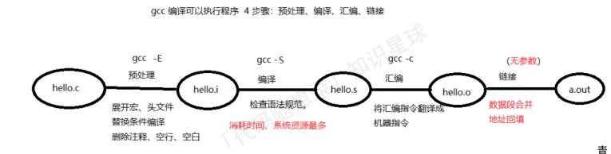
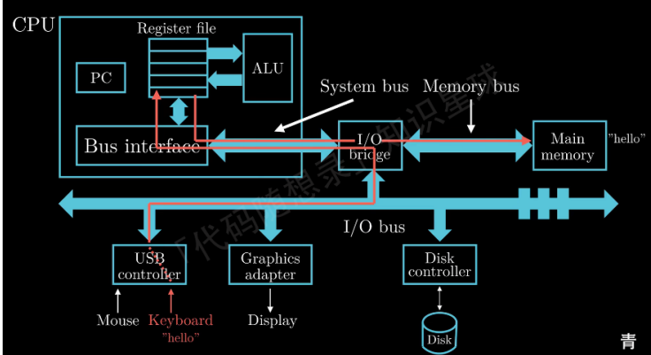
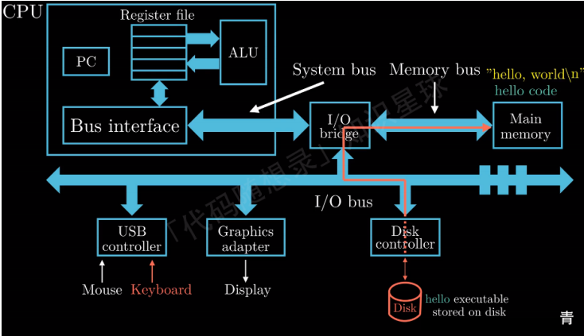
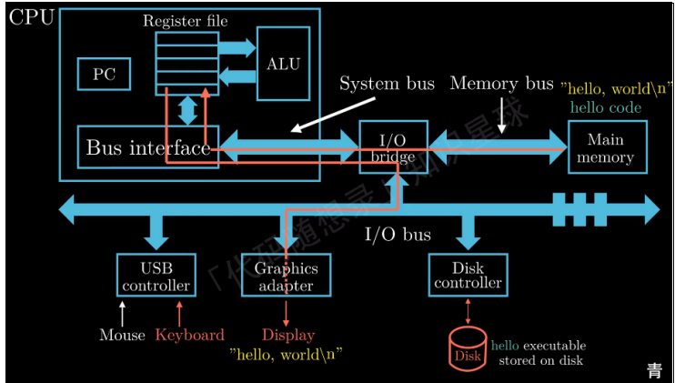
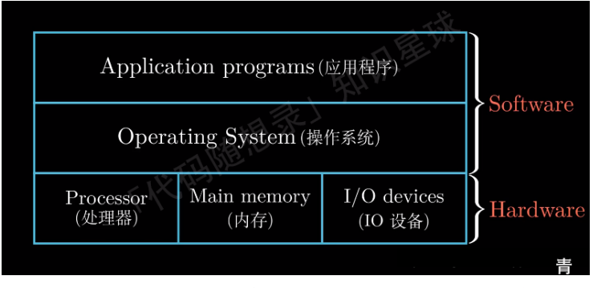
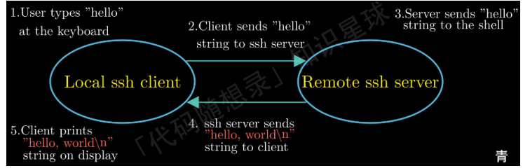

# 计算机组成原理

## 字符编码

计算机：

01二进制表示数字-》字符（映射）【解码】

字符-》二进制【编码】

编码方式：

固定长度编码

可变程度编码（UTF-8）

## 编译系统

## 处理器解释指令

寄存器：

通俗的讲，寄存器可以理解为⼀个临时存放数据的空间

例如我们计算两个变ᰁ a+b 的和，处理器从内存中读取 a 的值暂存在寄存器 X 中，读取 B 的值暂存在寄存器 Y

中，这个操作会覆盖寄存器中原来的数值，处理器完成加载的操作后，ALU（Arithmatic/logic Unit）会从复制寄

存器 X 和 Y 中保存的数值，然后进⾏算术运算，得到的结果会保存到寄存器 X 或者寄存器 Y 中，此时寄存器中原

来的数值会被新的数值覆盖

### 例子

hello.c 经过编译系统得到可执⾏⽬标⽂件 hello，此时可执⾏⽬标⽂件 hello 已经存放在系统的磁盘上，那么，如何运⾏这个可执⾏⽂件呢？

在 linux 系统上运⾏可执⾏程序：打开⼀个 shell 程序，然后在 shell 中输⼊相应可执⾏程序的⽂件名。运⾏hello程序。在这个例⼦中，shell 加载并且运⾏ hello 程序，屏幕上显示 hello,world 内容，hello 程序运⾏结束并退出，shell继续等待下⼀个命令的输⼊。

（1）⾸先我们通过键盘输⼊"./hello" 的字符串，shell 程序会将输⼊的字符逐⼀读⼊**寄存器**，处理器会把 hello 这个字符串放⼊**内存**中。

（2）当我们完成输⼊，按下回⻋键时，shell 程序就知道我们已经完成了命令的输⼊，然后执⾏⼀系列的指令来来加载可执⾏⽂件 hello ，这些指令将 hello 中的数据和代码从**磁盘**复制到**内存**。数据就是我们要显示输出的 "hello , world\n" ，这个复制的过程将利⽤DMA（Direct Memory Access）技术，数据可以不经过处理器，从磁盘直接到达内存。当可执⾏⽂件 hello 中的代码和数据被加载到内存中，处理器就开始执⾏ main 函数中的代码，main 函数⾮常简单，只有⼀个打印功能。

（3）CPU会将 "hello , world\n" 这个字符串从**内存**复制到寄存器⽂件。然后再从寄存器⽂件复制到**显示设备**，最终hello, world显示在屏幕上。

## 操作系统的作用

这样设计的⽬的主要有两个：

⼀是防⽌硬件被失控的应⽤程序滥⽤；

另外⼀个⽬的就是操作系统提供统⼀的机制来控制这些复杂的底层硬件。

⽂件是对 IO 设备的抽象；

虚拟内存是对内存和磁盘 IO 的抽象；

进程是对处理器、内存以及 IO 设备的抽象。

## 系统网络通信

系统来看，⽹络也可以视为⼀个 IO 设备。

