# OSI和TCP/IP网络分层模型

## OSI七层模型

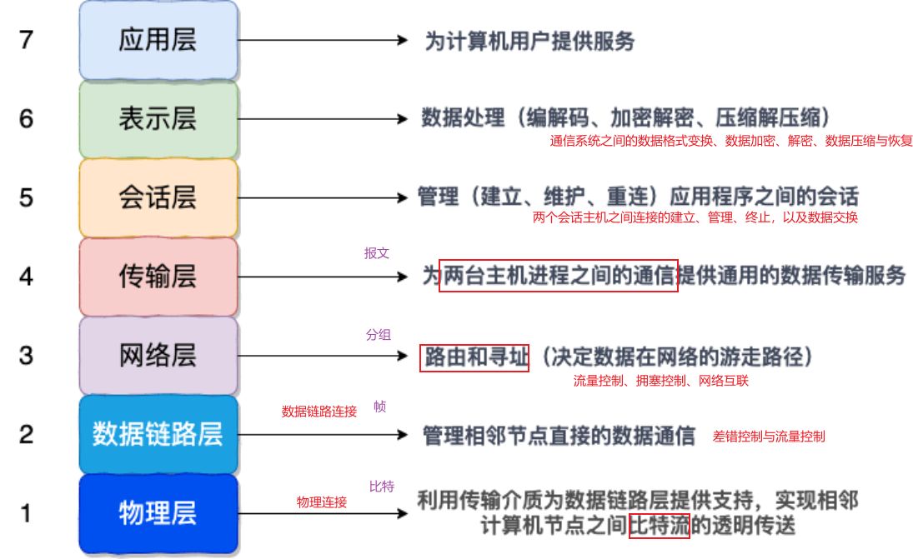

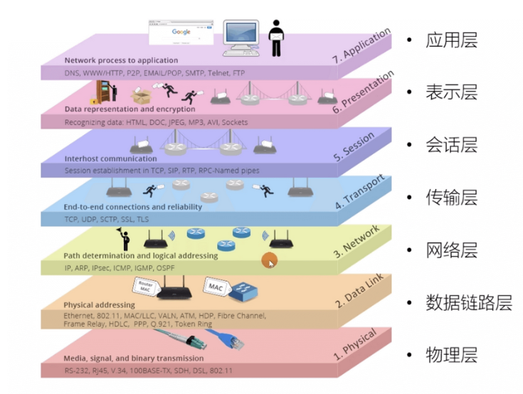


### 明确OSI环境

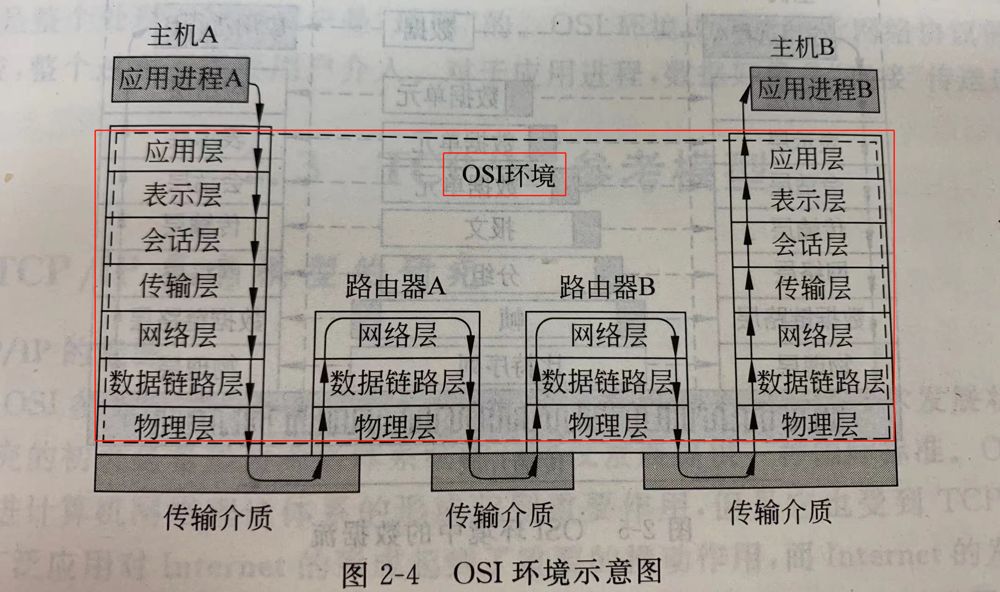

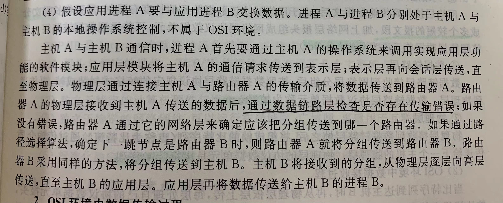

主机本身不在osi环境中


数据传输过程

原则：

各层有各层的协议、各层有各层的数据处理单元（pdu）

各层处理各自的数据单元

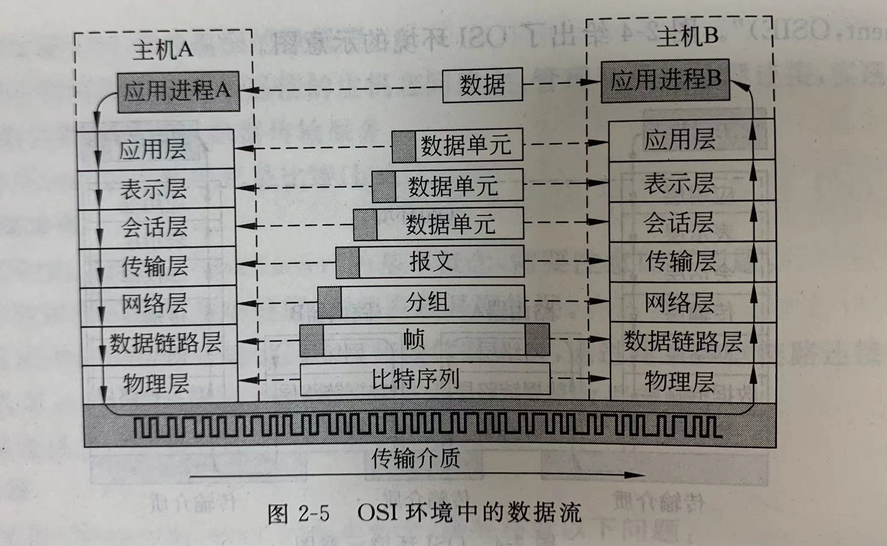

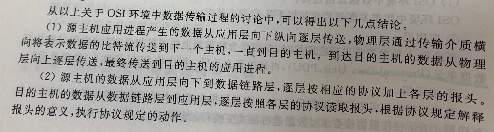

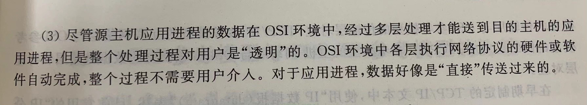


### 评价OSI 七层模型

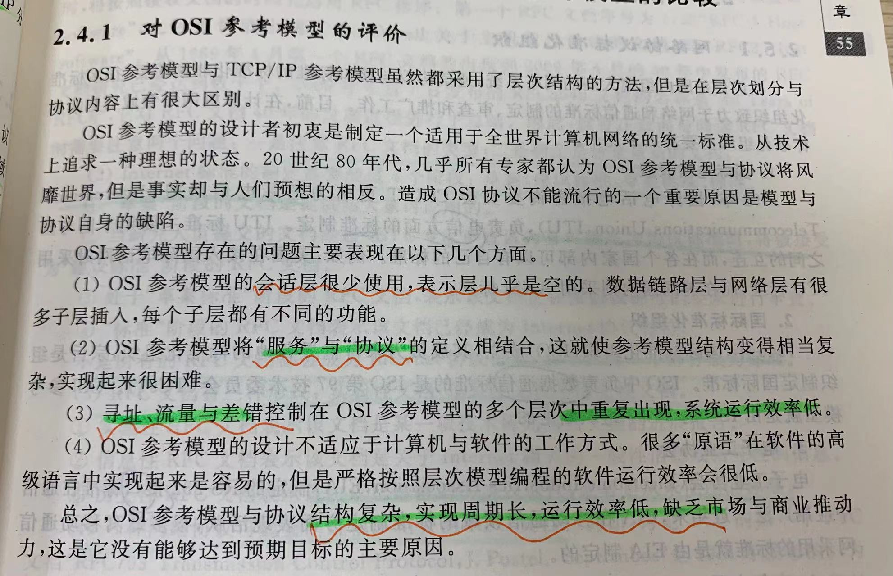


## TCP/IP

TCP/IP是网络中重要的通信规则


### 版本

IPV4

IPV6 下一代IP

>   网关、路由器、ip分组


### 和OSI对应关系

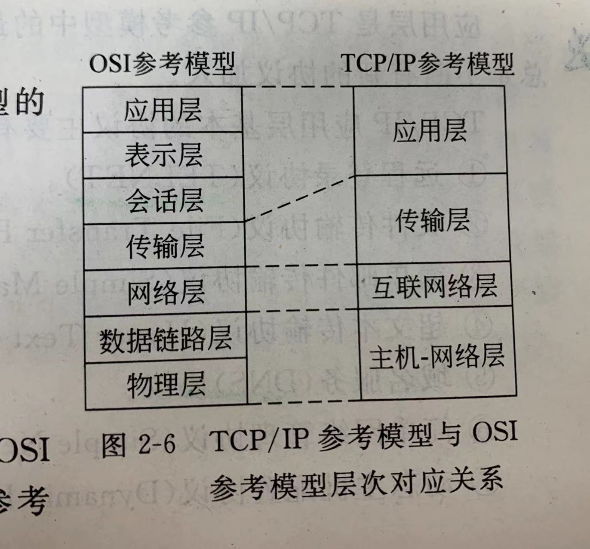


### 功能

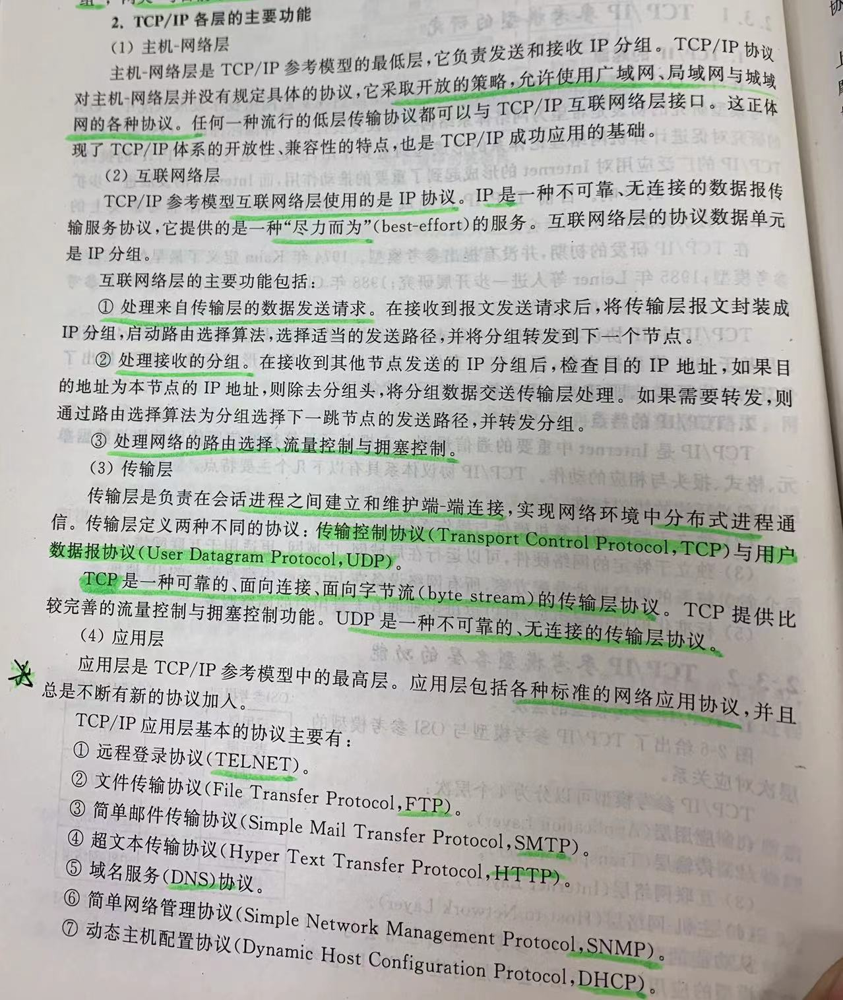


#### 主机网络层（网络接口层）

>    **发送和接受ip分组**

我们可以把网络接口层看作是数据链路层和物理层的合体。

1.   **物理层的作用是实现相邻计算机节点之间比特流的透明传送，尽可能屏蔽掉具体传输介质和物理设备的差异**
2.   数据链路层(data link layer)通常简称为链路层（ 两台主机之间的数据传输，总是在一段一段的链路上传送的）。**数据链路层的作用是将网络层交下来的 IP 数据报组装成帧，在两个相邻节点间的链路上传送帧。每一帧包括数据和必要的控制信息（如同步信息，地址信息，差错控制等）。**

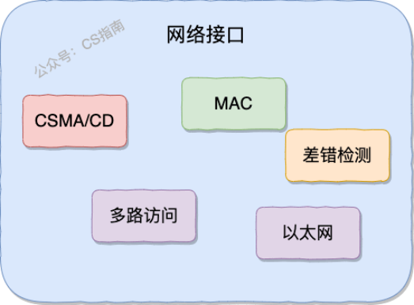


#### 网络层

>   处理来自传输层的数据发送请求
>
>   处理接收的分组
>
>   处理网络的路由选择、流量控制、拥塞控制

（1）**网络层负责为分组交换网上的不同主机提供通信服务。**

 在发送数据时，网络层把运输层产生的报文段或用户数据报封装成分组和包进行传送。在 TCP/IP 体系结构中，由于网络层使用 IP 协议，因此分组也叫 IP 数据报，简称数据报。

IP协议是一种不可靠、无连接的数据报传输服务协议、提供尽力而为的服务

⚠️注意 ：**不要把运输层的“用户数据报 UDP”和网络层的“IP 数据报”弄混**。

（2）**网络层的还有一个任务就是选择合适的路由，使源主机运输层所传下来的分组，能通过网络层中的路由器找到目的主机。**

这里强调指出，网络层中的“网络”二字已经不是我们通常谈到的具体网络，而是指计算机网络体系结构模型中第三层的名称。

互联网是由大量的异构（heterogeneous）网络通过路由器（router）相互连接起来的。互联网使用的网络层协议是无连接的网际协议（Intert Prococol）和许多路由选择协议，因此互联网的网络层也叫做**网际层**或**IP 层**。

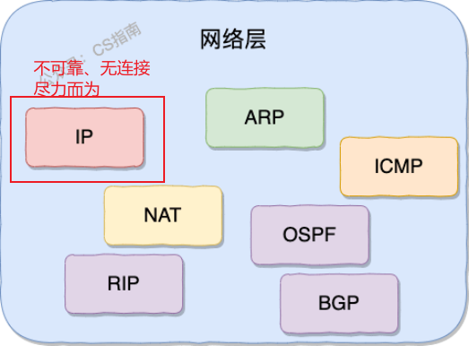


#### 传输层

>   两台主机设备的进程 简历和维护端-端的连接，实现网络环境中分布式进程通信。

**传输层的主要任务就是负责向两台终端设备进程之间的通信提供通用的数据传输服务。** 应用进程利用该服务传送应用层报文。“通用的”是指并不针对某一个特定的网络应用，而是多种应用可以使用同一个运输层服务。

**运输层主要使用以下两种协议：**

1.  **传输控制协议 TCP**（Transmisson Control Protocol）--提供**面向连接**的，**可靠的**，面向字节流的数据传输服务。
2.  **用户数据报协议 UDP**（User Datagram Protocol）--提供**无连接**的，尽最大努力的数据传输服务（**不保证数据传输的可靠性**）。


#### 应用层

**应用层位于传输层之上，主要提供两个终端设备上的应用程序之间信息交换的服务，它定义了信息交换的格式，消息会交给下一层传输层来传输。** 我们把应用层交互的数据单元称为报文。包含了各种 标准的网络应用协议

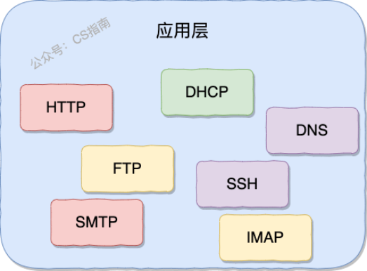

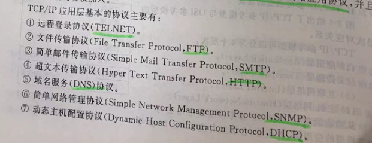


### 评价TCP/IP

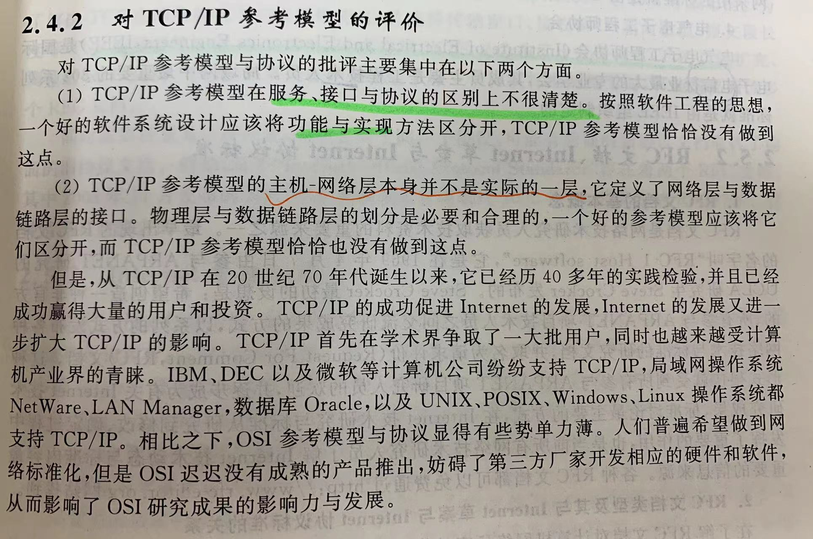


# HTTP & HTTPs

HTTP 协议，全称超文本传输协议（Hypertext Transfer Protocol）

应用层。

HTTP 协议就是用来规范超文本的传输，超文本，也就是网络上的包括文本在内的各式各样的消息，具体来说，主要是来规范浏览器和服务器端的行为的。

HTTP 是一个**无状态（stateless）协议**，也就是说服务器**不维护任何有关客户端过去所发请求的消息**。这其实是一种懒政，有状态协议会更加复杂，需要维护状态（历史信息），而且如果客户或服务器失效，会产生状态的不一致，解决这种不一致的代价更高


## HTTP协议

### HTTP 协议通信过程

HTTP 是应用层协议，它以 **TCP（传输层）**作为底层协议，默认端口为 **80**. 通信过程主要如下：

1.  服务器在 80 端口等待客户的请求。

2.  浏览器发起到服务器的 TCP 连接（创建套接字 Socket）。

3.  服务器接收来自浏览器的 TCP 连接。

4.  浏览器（HTTP 客户端）与 Web 服务器（HTTP 服务器）交换 HTTP 消息。

5.  关闭 TCP 连接。

    

### HTTP 协议优点

扩展性强、速度快、跨平台支持性好。


## HTTPS 协议

### HTTPS 协议介绍

HTTPS 协议（Hyper Text  Transfer Protocol Secure），是 **HTTP 的加强安全版本**。HTTPS 是基于 HTTP 的，也是用 **TCP  作为底层协议**，并额外使用 **SSL/TLS 协议用作加密和安全认证**。默认端口号是 **443**.

HTTPS 协议中，SSL 通道通常使用基于密钥的加密算法，密钥长度通常是 40 比特或 128 比特。


### HTTPS 协议优点

保密性好、信任度高。


### HTTPS 的核心—SSL/TLS协议

对**消息**是**对称加密**

对对称加密的**密钥**是**非对称加密**

HTTPS 之所以能达到较高的安全性要求，就是结合了 SSL/TLS 和 TCP 协议，对通信数据进行加密，解决了 HTTP 数据透明的问题。接下来重点介绍一下 SSL/TLS 的工作原理。


#### SSL 和 TLS 的区别

**SSL 和 TLS 没有太大的区别。**

SSL 指安全套接字协议（Secure Sockets Layer），首次发布与 1996 年。SSL 的首次发布其实已经是他的 3.0 版本，SSL 1.0 从未面世，SSL 2.0 则具有较大的缺陷（DROWN 缺陷——Decrypting RSA with Obsolete and  Weakened eNcryption）。很快，在 1999 年，SSL 3.0 进一步升级，**新版本被命名为 TLS 1.0**。因此，TLS 是基于 SSL 之上的，但由于习惯叫法，通常把 HTTPS 中的核心加密协议混成为 SSL/TLS。


#### SSL/TLS 的工作原理

##### 非对称加密

SSL/TLS 的核心要素是**非对称加密**。非对称加密采用两个密钥——**一个公钥，一个私钥**。在通信时，**私钥仅由解密者保存**，**公钥**由任何一个想与解密者通信的**发送者（加密者）**所知。可以设想一个场景，

>   在某个自助邮局，每个通信信道都是一个邮箱，每一个邮箱所有者都在旁边立了一个牌子，上面挂着一把钥匙：这是我的公钥，发送者请将信件放入我的邮箱，并用公钥锁好。
>
>   但是公钥只能加锁，并不能解锁。解锁只能由邮箱的所有者——因为只有他保存着私钥。
>
>   这样，通信信息就不会被其他人截获了，这依赖于私钥的保密性。


非对称加密的公钥和私钥需要采用一种复杂的数学机制生成（密码学认为，为了较高的安全性，尽量不要自己创造加密方案）。公私钥对的生成算法依赖于单向陷门函数。

>   单向函数：已知单向函数 f，给定任意一个输入 x，易计算输出 y=f(x)；而给定一个输出 y，假设存在 f(x)=y，很难根据 f 来计算出 x。
>
>   单向陷门函数：一个较弱的单向函数。已知单向陷门函数 f，陷门 h，给定任意一个输入 x，易计算出输出 y=f(x;h)；而给定一个输出 y，假设存在 f(x;h)=y，很难根据 f 来计算出 x，但可以根据 f 和 h 来推导出 x。
>
>   在这里，函数 f 的计算方法相当于公钥，陷门 h 相当于私钥。公钥 f 是公开的，任何人对已有输入，都可以用 f 加密，而要想根据加密信息还原出原信息，必须要有私钥h才行


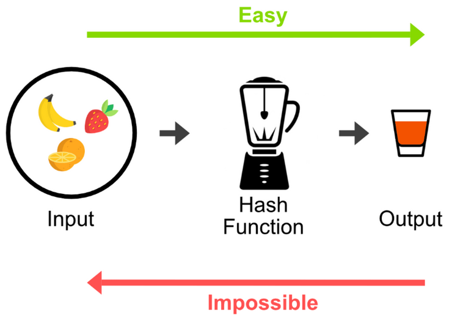

上图就是一个单向函数（不是单项陷门函数），假设有一个绝世秘籍，任何知道了这个秘籍的人都可以把苹果汁榨成苹果，那么这个秘籍就是“陷门”了吧。


##### 对称加密

使用 SSL/TLS 进行通信的双方需要使用非对称加密方案来通信，但是非对称加密设计了较为复杂的数学算法，在实际通信过程中**，计算的代价较高**，效率太低，因此，**SSL/TLS 实际对消息的加密使用的是对称加密。**

>   对称加密：通信双方共享唯一密钥 k，加解密算法已知，加密方利用密钥 k 加密，解密方利用密钥 k 解密，保密性依赖于密钥 k 的保密性。

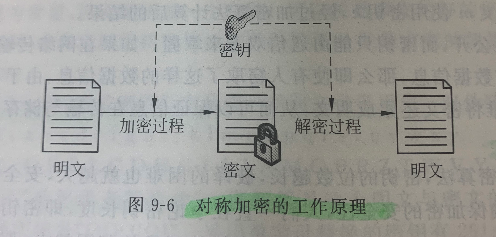


对称加密的密钥生成代价比公私钥对的生成代价低得多，那么有的人会问了，为什么 SSL/TLS  还需要使用非对称加密呢？因为对称加密的保密性完全依赖于密钥的保密性。**在双方通信之前，需要商量一个用于对称加密的密钥**。我们知道网络通信的信道是不安全的，传输报文对任何人是可见的，密钥的交换肯定不能直接在网络信道中传输。因此，**使用非对称加密，对对称加密的密钥进行加密，保护该密钥不在网络信道中被窃听。**这样，**通信双方只需要一次非对称加密，交换对称加密的密钥，在之后的信息通信中，使用绝对安全的密钥，对信息进行对称加密，即可保证传输消息的保密性**


##### 公钥传输的信赖性

SSL/TLS 介绍到这里，了解信息安全的朋友又会想到一个安全隐患，设想一个下面的场景：

>   客户端 C 和服务器 S 想要使用 SSL/TLS 通信，由上述 SSL/TLS 通信原理，C 需要先知道 S 的公钥，而 S 公钥的唯一获取途径，就是把 S 公钥在网络信道中传输。要注意网络信道通信中有几个前提：
>
>   1.  任何人都可以捕获通信包
>   2.  通信包的保密性由发送者设计
>   3.  保密算法设计方案默认为公开，而（解密）密钥默认是安全的
>
>   因此，假设 S 公钥不做加密，在信道中传输，那么很有可能存在一个攻击者 A，发送给 C 一个诈包，假装是 S 公钥，其实是诱饵服务器 AS 的公钥。当 C 收获了 AS 的公钥（却以为是 S 的公钥），C 后续就会使用 AS 公钥对数据进行加密，并在公开信道传输，那么 A 将捕获这些加密包，用  AS 的私钥解密，就截获了 C 本要给 S 发送的内容，而 C 和 S 二人全然不知。
>
>   同样的，S 公钥即使做加密，也难以避免这种信任性问题，C 被 AS 拐跑了！

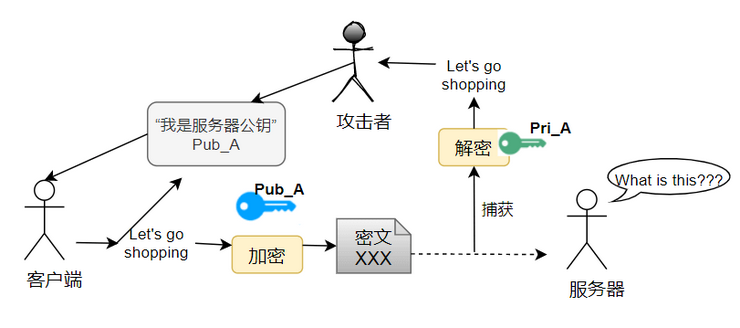

为了公钥传输的信赖性问题，第三方机构应运而生——证书颁发机构（CA，Certificate Authority）。CA 默认是受信任的第三方。CA 会给各个服务器颁发证书，证书存储在服务器上，并附有 CA 的**电子签名**（见下节）。

当客户端（浏览器）向服务器发送 HTTPS  请求时，一定要先获取目标服务器的证书，并根据证书上的信息，检验证书的合法性。一旦客户端检测到证书非法，就会发生错误。客户端获取了服务器的证书后，由于证书的信任性是由第三方信赖机构认证的，而证书上又包含着服务器的公钥信息，客户端就可以放心的信任证书上的公钥就是目标服务器的公钥。


####  数字签名

好，到这一小节，已经是 SSL/TLS 的尾声了。上一小节提到了数字签名，数字签名要解决的问题，是防止证书被伪造。第三方信赖机构 CA 之所以能被信赖，就是 **靠数字签名技术** 。

数字签名，是 CA 在给服务器颁发证书时，使用散列+加密的组合技术，在证书上盖个章，以此来提供验伪的功能。具体行为如下：

>   CA 知道服务器的公钥，对该公钥采用散列技术生成一个摘要。CA 使用 CA 私钥对该摘要进行加密，并附在证书下方，发送给服务器。
>
>   现在服务器将该证书发送给客户端，客户端需要验证该证书的身份。客户端找到第三方机构 CA，获知 CA 的公钥，并用 CA 公钥对证书的签名进行解密，获得了 CA 生成的摘要。
>
>   客户端对证书数据（也就是服务器的公钥）做相同的散列处理，得到摘要，并将该摘要与之前从签名中解码出的摘要做对比，如果相同，则身份验证成功；否则验证失败。


带有证书的公钥传输机制如下：

1.  设有服务器 S，客户端 C，和第三方信赖机构 CA。
2.  S 信任 CA，CA 是知道 S 公钥的，CA 向 S 颁发证书。并附上 CA 私钥对消息摘要的加密签名。
3.  S 获得 CA 颁发的证书，将该证书传递给 C。
4.  C 获得 S 的证书，信任 CA 并知晓 CA 公钥，使用 CA 公钥对 S 证书上的签名解密，同时对消息进行散列处理，得到摘要。比较摘要，验证 S 证书的真实性。
5.  如果 C 验证 S 证书是真实的，则信任 S 的公钥（在 S 证书中）。

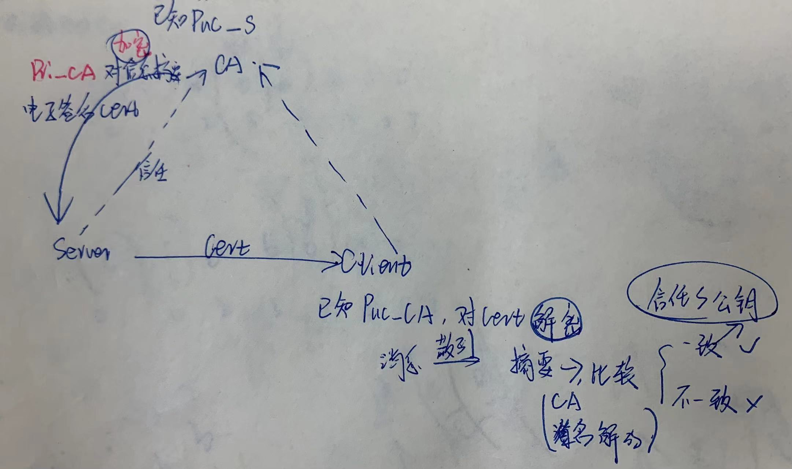


## 总结

**端口号** ：HTTP 默认是 80，HTTPS 默认是 443。

**URL 前缀** ：HTTP 的 URL 前缀是 `http://`，HTTPS 的 URL 前缀是 `https://`。

**安全性和资源消耗** ： HTTP 协议运行在 TCP 之上，所有传输的内容都是明文，客户端和服务器端都无法验证对方的身份。HTTPS 是运行在 SSL/TLS  之上的 HTTP 协议，SSL/TLS 运行在 TCP  之上。所有传输的内容都经过加密，加密采用对称加密，但对称加密的密钥用服务器方的证书进行了非对称加密。所以说，HTTP 安全性没有 HTTPS  高，但是 HTTPS 比 HTTP 耗费更多服务器资源


# HTTP 1.0 vs HTTP 1.1

这篇文章会从下面几个维度来对比 HTTP 1.0 和 HTTP 1.1：

-   响应状态码
-   缓存处理
-   连接方式
-   Host头处理
-   带宽优化

## 响应状态码

HTTP/1.0仅定义了16种状态码。HTTP/1.1中新加入了大量的状态码，光是错误响应状态码就新增了24种。比如说，`100 (Continue)`——在请求大资源前的预热请求，`206 (Partial Content)`——范围请求的标识码，`409 (Conflict)`——请求与当前资源的规定冲突，`410 (Gone)`——资源已被永久转移，而且没有任何已知的转发地址。


## 缓存处理

缓存技术通过避免用户与源服务器的频繁交互，节约了大量的网络带宽，降低了用户接收信息的延迟。


###  HTTP/1.0

`Expires`标签：标志（时间）一个响应体，在`Expires`标志时间内的请求，都会获得该**响应体缓存**。

`Last-Modified`标签：服务器端在**初次返回**给客户端的响应体中，该标签标记了被请求资源在服务器端的**最后一次修改**。

`If-Modified-Since`标签：表示一个时间，该时间之后，我要请求的资源是否有被修改过？”通常情况下，请求头中的`If-Modified-Since`的值即为上一次获得该资源时，响应体中的`Last-Modified`的值。

>   如果服务器接收到了请求头，并判断`If-Modified-Since`时间后，资源确实没有修改过，则返回给客户端一个**`304 not modified`响应头**，表示”缓冲可用，你从浏览器里拿吧！”。
>
>   如果服务器判断`If-Modified-Since`时间后，资源**被修改过**，则返回给客户端一个**`200 OK`的响应体**，并附带全新的资源内容，表示”你要的我已经改过的，给你一份新的”。

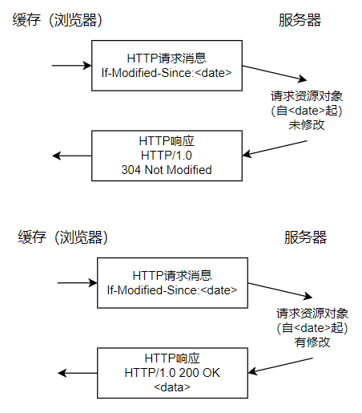


### HTTP/1.1

HTTP/1.1的缓存机制在HTTP/1.0的基础上，大大增加了灵活性和扩展性。基本工作原理和HTTP/1.0保持不变，而是增加了更多细致的特性。其中，请求头中最常见的特性就是`Cache-Control`，详见MDN Web文档 [Cache-Control](https://developer.mozilla.org/zh-CN/docs/Web/HTTP/Headers/Cache-Control)

>   Cache-Control 通用消息头字段，被用于在http请求和响应中，通过指定指令来实现缓存机制。缓存指令是单向的，这意味着在请求中设置的指令，不一定被包含在响应中。


## 连接方式

**HTTP/1.0 默认使用短连接** ，也就是说，**客户端和服务器每进行一次 HTTP  操作，就建立一次连接，任务结束就中断连接**。当客户端浏览器访问的某个 HTML 或其他类型的 Web 页中包含有其他的 Web 资源（如  JavaScript 文件、图像文件、CSS 文件等），每遇到这样一个 Web  资源，浏览器就会重新建立一个TCP连接，这样就会导致有**大量的“握手报文”和“挥手报文”占用了带宽**。

**为了解决 HTTP/1.0 存在的资源浪费的问题， HTTP/1.1 优化为默认长连接模式 。**  采用长连接模式的请求报文会通知服务端：“我向你请求连接，并且**连接成功建立后，请不要关闭**”。因此，该TCP连接将持续打开，为后续的**客户端-服务端的数据交互服务**。也就是说在使用长连接的情况下，当一个网页打开完成后，客户端和服务器之间用于传输 HTTP 数据的 TCP 连接不会关闭，客户端再次访问这个服务器时，会继续使用这一条已经建立的连接。

**如果 TCP 连接一直保持的话也是对资源的浪费**，因此，一些服务器软件（如 Apache）还会支持**超时时间**的时间。在超时时间之内没有新的请求达到，TCP 连接才会被关闭。

有必要说明的是，HTTP/1.0仍提供了长连接选项，即在请求头中加入`Connection: Keep-alive`。同样的，在HTTP/1.1中，如果不希望使用长连接选项，也可以在请求头中加入`Connection: close`，这样会通知服务器端：“我不需要长连接，连接成功后即可关闭”。

**HTTP 协议的长连接和短连接，实质上是 TCP 协议的长连接和短连接。**

**实现长连接需要客户端和服务端都支持长连接**


## Host头处理

**域名系统（DNS）允许多个主机名绑定到同一个IP地址**上，但是**HTTP/1.0**并没有考虑这个问题，假设我们有一个资源URL是http://example1.org/home.html，HTTP/1.0的请求报文中，将会请求的是如下。(不包含host)

`GET /home.html HTTP/1.0`

因此，HTTP/1.1在请求头中加入了`**Host`字段**。加入`Host`字段的报文头部将会是:

```text
GET /home.html HTTP/1.1
Host: example1.org
```

这样，服务器端就可以确定客户端想要请求的真正的网址了


## 带宽优化

### 范围请求

HTTP/1.1引入了范围请求（range request）机制，**以避免带宽的浪费**。当客户端想请求一个文件的**一部分，**或者需要继续下载一个已经下载了部分但被终止的文件，HTTP/1.1可以在请求中加入`Range`头部，以请求（并只能请求字节型数据）数据的一部分。服务器端可以忽略`Range`头部，也可以返回若干`Range`响应。

如果一个响应包含部分数据的话，那么将带有**`206 (Partial Content)`状态码**。该状态码的意义在于避免了HTTP/1.0代理缓存错误地把该响应认为是一个完整的数据响应，从而把他当作为一个请求的响应缓存。

在范围响应中，`Content-Range`头部标志指示出了该数据块的偏移量和数据块的长度。

### 状态码100

HTTP/1.1中新加入了状态码`100`。该状态码的使用场景为，存在某些**较大的文件请求，服务器可能不愿意响应这种请求**，此时状态码`100`可以作为指示请求是否会被正常响应，过程如下图：

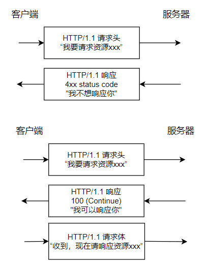

然而在HTTP/1.0中，并没有`100 (Continue)`状态码，要想触发这一机制，可以发送一个`Expect`头部，其中包含一个`100-continue`的值


### 压缩

许多格式的**数据在传输时都会做预压缩处理**。数据的压缩可以大幅优化带宽的利用。然而，HTTP/1.0对数据压缩的选项提供的不多，不支持压缩细节的选择，也无法区分**端到端（end-to-end）压缩**或者是**逐跳（hop-by-hop）压缩**。

HTTP/1.1则对**内容编码（content-codings）和传输编码（transfer-codings）**做了区分。内容编码总是端到端的，传输编码总是逐跳的。

HTTP/1.0包含了`**Content-Encoding**`头部，对消息进行**端到端编码**。HTTP/1.1加入了**`Transfer-Encoding`头部**，可以对消息进行**逐跳传输编码**。HTTP/1.1还加入了`Accept-Encoding`头部，是客户端用来指示他能处理什么样的内容编码


## 总结

**状态响应码** : HTTP/1.1中新加入了大量的状态码，光是错误响应状态码就新增了24种。比如说，`100 (Continue)`——在请求大资源前的预热请求，`206 (Partial Content)`——范围请求的标识码，`409 (Conflict)`——请求与当前资源的规定冲突，`410 (Gone)`——资源已被永久转移，而且没有任何已知的转发地址。

**缓存处理** : 在 HTTP1.0 中主要使用 header 里的 If-Modified-Since,Expires  来做为缓存判断的标准，HTTP1.1 则引入了更多的缓存控制策略例如 Entity tag，If-Unmodified-Since,  If-Match, If-None-Match 等更多可供选择的缓存头来控制缓存策略。

**连接方式** : HTTP 1.0 为短连接，HTTP 1.1 支持长连接。

**Host头处理** : HTTP/1.1在请求头中加入了`Host`字段

**带宽优化及网络连接的使用** :HTTP1.0  中，存在一些浪费带宽的现象，例如客户端只是需要某个对象的一部分，而服务器却将整个对象送过来了，并且不支持断点续传功能，HTTP1.1  则在请求头引入了 range 头域，它允许只请求资源的某个部分，即返回码是 206（Partial  Content），这样就方便了开发者自由的选择以便于充分利用带宽和连接。

