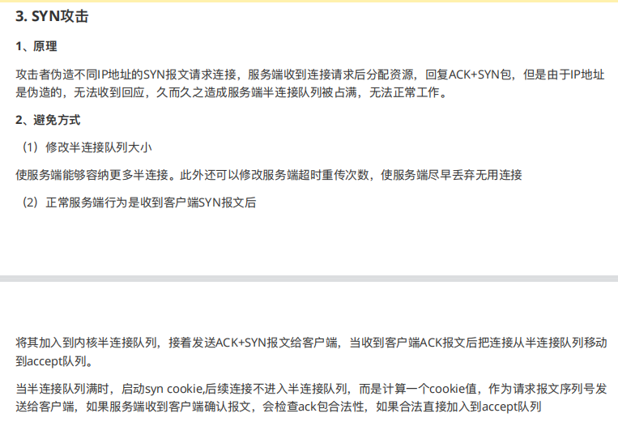

# OSI和TCP/IP网络分层模型

## OSI七层模型


### 明确OSI环境


主机本身不在osi环境中


数据传输过程

原则：

各层有各层的协议、各层有各层的数据处理单元（pdu）

各层处理各自的数据单元


### 评价OSI 七层模型


## TCP/IP

TCP/IP是网络中重要的通信规则


### 版本

IPV4

IPV6 下一代IP

>   网关、路由器、ip分组


### 和OSI对应关系


### 功能


#### 主机网络层（网络接口层）

>    **发送和接受ip分组**

我们可以把网络接口层看作是数据链路层和物理层的合体。

1.   **物理层的作用是实现相邻计算机节点之间比特流的透明传送，尽可能屏蔽掉具体传输介质和物理设备的差异**
2.   数据链路层(data link layer)通常简称为链路层（ 两台主机之间的数据传输，总是在一段一段的链路上传送的）。**数据链路层的作用是将网络层交下来的 IP 数据报组装成帧，在两个相邻节点间的链路上传送帧。每一帧包括数据和必要的控制信息（如同步信息，地址信息，差错控制等）。**


#### 网络层

>   处理来自传输层的数据发送请求
>
>   处理接收的分组
>
>   处理网络的路由选择、流量控制、拥塞控制

（1）**网络层负责为分组交换网上的不同主机提供通信服务。**

 在发送数据时，网络层把运输层产生的报文段或用户数据报封装成分组和包进行传送。在 TCP/IP 体系结构中，由于网络层使用 IP 协议，因此分组也叫 IP 数据报，简称数据报。

IP协议是一种不可靠、无连接的数据报传输服务协议、提供尽力而为的服务

⚠️注意 ：**不要把运输层的“用户数据报 UDP”和网络层的“IP 数据报”弄混**。

（2）**网络层的还有一个任务就是选择合适的路由，使源主机运输层所传下来的分组，能通过网络层中的路由器找到目的主机。**

这里强调指出，网络层中的“网络”二字已经不是我们通常谈到的具体网络，而是指计算机网络体系结构模型中第三层的名称。

互联网是由大量的异构（heterogeneous）网络通过路由器（router）相互连接起来的。互联网使用的网络层协议是无连接的网际协议（Intert Prococol）和许多路由选择协议，因此互联网的网络层也叫做**网际层**或**IP 层**。


#### 传输层

>   两台主机设备的进程 简历和维护端-端的连接，实现网络环境中分布式进程通信。

**传输层的主要任务就是负责向两台终端设备进程之间的通信提供通用的数据传输服务。** 应用进程利用该服务传送应用层报文。“通用的”是指并不针对某一个特定的网络应用，而是多种应用可以使用同一个运输层服务。

**运输层主要使用以下两种协议：**

1.  **传输控制协议 TCP**（Transmisson Control Protocol）--提供**面向连接**的，**可靠的**，面向字节流的数据传输服务。
2.  **用户数据报协议 UDP**（User Datagram Protocol）--提供**无连接**的，尽最大努力的数据传输服务（**不保证数据传输的可靠性**）。


#### 应用层

**应用层位于传输层之上，主要提供两个终端设备上的应用程序之间信息交换的服务，它定义了信息交换的格式，消息会交给下一层传输层来传输。** 我们把应用层交互的数据单元称为报文。包含了各种 标准的网络应用协议


### 评价TCP/IP


# HTTP & HTTPs

HTTP 协议，全称超文本传输协议（Hypertext Transfer Protocol）

应用层。

HTTP 协议就是用来规范超文本的传输，超文本，也就是网络上的包括文本在内的各式各样的消息，具体来说，主要是来规范浏览器和服务器端的行为的。

HTTP 是一个**无状态（stateless）协议**，也就是说服务器**不维护任何有关客户端过去所发请求的消息**。这其实是一种懒政，有状态协议会更加复杂，需要维护状态（历史信息），而且如果客户或服务器失效，会产生状态的不一致，解决这种不一致的代价更高


## HTTP协议

### HTTP 协议通信过程

HTTP 是应用层协议，它以 **TCP（传输层）**作为底层协议，默认端口为 **80**. 通信过程主要如下：

1.  服务器在 80 端口等待客户的请求。

2.  浏览器发起到服务器的 TCP 连接（创建套接字 Socket）。

3.  服务器接收来自浏览器的 TCP 连接。

4.  浏览器（HTTP 客户端）与 Web 服务器（HTTP 服务器）交换 HTTP 消息。

5.  关闭 TCP 连接。

    

### HTTP 协议优点

扩展性强、速度快、跨平台支持性好。


## HTTPS 协议

### HTTPS 协议介绍

HTTPS 协议（Hyper Text  Transfer Protocol Secure），是 **HTTP 的加强安全版本**。HTTPS 是基于 HTTP 的，也是用 **TCP  作为底层协议**，并额外使用 **SSL/TLS 协议用作加密和安全认证**。默认端口号是 **443**.

HTTPS 协议中，SSL 通道通常使用基于密钥的加密算法，密钥长度通常是 40 比特或 128 比特。


### HTTPS 协议优点

保密性好、信任度高。


### HTTPS 的核心—SSL/TLS协议

对**消息**是**对称加密**

对对称加密的**密钥**是**非对称加密**

HTTPS 之所以能达到较高的安全性要求，就是结合了 SSL/TLS 和 TCP 协议，对通信数据进行加密，解决了 HTTP 数据透明的问题。接下来重点介绍一下 SSL/TLS 的工作原理。


#### SSL 和 TLS 的区别

**SSL 和 TLS 没有太大的区别。**

SSL 指安全套接字协议（Secure Sockets Layer），首次发布与 1996 年。SSL 的首次发布其实已经是他的 3.0 版本，SSL 1.0 从未面世，SSL 2.0 则具有较大的缺陷（DROWN 缺陷——Decrypting RSA with Obsolete and  Weakened eNcryption）。很快，在 1999 年，SSL 3.0 进一步升级，**新版本被命名为 TLS 1.0**。因此，TLS 是基于 SSL 之上的，但由于习惯叫法，通常把 HTTPS 中的核心加密协议混成为 SSL/TLS。


#### SSL/TLS 的工作原理

##### 非对称加密

SSL/TLS 的核心要素是**非对称加密**。非对称加密采用两个密钥——**一个公钥，一个私钥**。在通信时，**私钥仅由解密者保存**，**公钥**由任何一个想与解密者通信的**发送者（加密者）**所知。可以设想一个场景，

>   在某个自助邮局，每个通信信道都是一个邮箱，每一个邮箱所有者都在旁边立了一个牌子，上面挂着一把钥匙：这是我的公钥，发送者请将信件放入我的邮箱，并用公钥锁好。
>
>   但是公钥只能加锁，并不能解锁。解锁只能由邮箱的所有者——因为只有他保存着私钥。
>
>   这样，通信信息就不会被其他人截获了，这依赖于私钥的保密性。


非对称加密的公钥和私钥需要采用一种复杂的数学机制生成（密码学认为，为了较高的安全性，尽量不要自己创造加密方案）。公私钥对的生成算法依赖于单向陷门函数。

>   单向函数：已知单向函数 f，给定任意一个输入 x，易计算输出 y=f(x)；而给定一个输出 y，假设存在 f(x)=y，很难根据 f 来计算出 x。
>
>   单向陷门函数：一个较弱的单向函数。已知单向陷门函数 f，陷门 h，给定任意一个输入 x，易计算出输出 y=f(x;h)；而给定一个输出 y，假设存在 f(x;h)=y，很难根据 f 来计算出 x，但可以根据 f 和 h 来推导出 x。
>
>   在这里，函数 f 的计算方法相当于公钥，陷门 h 相当于私钥。公钥 f 是公开的，任何人对已有输入，都可以用 f 加密，而要想根据加密信息还原出原信息，必须要有私钥h才行


上图就是一个单向函数（不是单项陷门函数），假设有一个绝世秘籍，任何知道了这个秘籍的人都可以把苹果汁榨成苹果，那么这个秘籍就是“陷门”了吧。


##### 对称加密

使用 SSL/TLS 进行通信的双方需要使用非对称加密方案来通信，但是非对称加密设计了较为复杂的数学算法，在实际通信过程中**，计算的代价较高**，效率太低，因此，**SSL/TLS 实际对消息的加密使用的是对称加密。**

>   对称加密：通信双方共享唯一密钥 k，加解密算法已知，加密方利用密钥 k 加密，解密方利用密钥 k 解密，保密性依赖于密钥 k 的保密性。


对称加密的密钥生成代价比公私钥对的生成代价低得多，那么有的人会问了，为什么 SSL/TLS  还需要使用非对称加密呢？因为对称加密的保密性完全依赖于密钥的保密性。**在双方通信之前，需要商量一个用于对称加密的密钥**。我们知道网络通信的信道是不安全的，传输报文对任何人是可见的，密钥的交换肯定不能直接在网络信道中传输。因此，**使用非对称加密，对对称加密的密钥进行加密，保护该密钥不在网络信道中被窃听。**这样，**通信双方只需要一次非对称加密，交换对称加密的密钥，在之后的信息通信中，使用绝对安全的密钥，对信息进行对称加密，即可保证传输消息的保密性**


##### 公钥传输的信赖性

SSL/TLS 介绍到这里，了解信息安全的朋友又会想到一个安全隐患，设想一个下面的场景：

>   客户端 C 和服务器 S 想要使用 SSL/TLS 通信，由上述 SSL/TLS 通信原理，C 需要先知道 S 的公钥，而 S 公钥的唯一获取途径，就是把 S 公钥在网络信道中传输。要注意网络信道通信中有几个前提：
>
>   1.  任何人都可以捕获通信包
>   2.  通信包的保密性由发送者设计
>   3.  保密算法设计方案默认为公开，而（解密）密钥默认是安全的
>
>   因此，假设 S 公钥不做加密，在信道中传输，那么很有可能存在一个攻击者 A，发送给 C 一个诈包，假装是 S 公钥，其实是诱饵服务器 AS 的公钥。当 C 收获了 AS 的公钥（却以为是 S 的公钥），C 后续就会使用 AS 公钥对数据进行加密，并在公开信道传输，那么 A 将捕获这些加密包，用  AS 的私钥解密，就截获了 C 本要给 S 发送的内容，而 C 和 S 二人全然不知。
>
>   同样的，S 公钥即使做加密，也难以避免这种信任性问题，C 被 AS 拐跑了！


为了公钥传输的信赖性问题，第三方机构应运而生——证书颁发机构（CA，Certificate Authority）。CA 默认是受信任的第三方。CA 会给各个服务器颁发证书，证书存储在服务器上，并附有 CA 的**电子签名**（见下节）。

当客户端（浏览器）向服务器发送 HTTPS  请求时，一定要先获取目标服务器的证书，并根据证书上的信息，检验证书的合法性。一旦客户端检测到证书非法，就会发生错误。客户端获取了服务器的证书后，由于证书的信任性是由第三方信赖机构认证的，而证书上又包含着服务器的公钥信息，客户端就可以放心的信任证书上的公钥就是目标服务器的公钥。


####  数字签名

好，到这一小节，已经是 SSL/TLS 的尾声了。上一小节提到了数字签名，数字签名要解决的问题，是防止证书被伪造。第三方信赖机构 CA 之所以能被信赖，就是 **靠数字签名技术** 。

数字签名，是 CA 在给服务器颁发证书时，使用散列+加密的组合技术，在证书上盖个章，以此来提供验伪的功能。具体行为如下：

>   CA 知道服务器的公钥，对该公钥采用散列技术生成一个摘要。CA 使用 CA 私钥对该摘要进行加密，并附在证书下方，发送给服务器。
>
>   现在服务器将该证书发送给客户端，客户端需要验证该证书的身份。客户端找到第三方机构 CA，获知 CA 的公钥，并用 CA 公钥对证书的签名进行解密，获得了 CA 生成的摘要。
>
>   客户端对证书数据（也就是服务器的公钥）做相同的散列处理，得到摘要，并将该摘要与之前从签名中解码出的摘要做对比，如果相同，则身份验证成功；否则验证失败。


带有证书的公钥传输机制如下：

1.  设有服务器 S，客户端 C，和第三方信赖机构 CA。
2.  S 信任 CA，CA 是知道 S 公钥的，CA 向 S 颁发证书。并附上 CA 私钥对消息摘要的加密签名。
3.  S 获得 CA 颁发的证书，将该证书传递给 C。
4.  C 获得 S 的证书，信任 CA 并知晓 CA 公钥，使用 CA 公钥对 S 证书上的签名解密，同时对消息进行散列处理，得到摘要。比较摘要，验证 S 证书的真实性。
5.  如果 C 验证 S 证书是真实的，则信任 S 的公钥（在 S 证书中）。


## 总结

**端口号** ：HTTP 默认是 80，HTTPS 默认是 443。

**URL 前缀** ：HTTP 的 URL 前缀是 `http://`，HTTPS 的 URL 前缀是 `https://`。

**安全性和资源消耗** ： HTTP 协议运行在 TCP 之上，所有传输的内容都是明文，客户端和服务器端都无法验证对方的身份。HTTPS 是运行在 SSL/TLS  之上的 HTTP 协议，SSL/TLS 运行在 TCP  之上。所有传输的内容都经过加密，加密采用对称加密，但对称加密的密钥用服务器方的证书进行了非对称加密。所以说，HTTP 安全性没有 HTTPS  高，但是 HTTPS 比 HTTP 耗费更多服务器资源


# HTTP 1.0 vs HTTP 1.1

这篇文章会从下面几个维度来对比 HTTP 1.0 和 HTTP 1.1：

-   响应状态码
-   缓存处理
-   连接方式
-   Host头处理
-   带宽优化

## 响应状态码

HTTP/1.0仅定义了16种状态码。HTTP/1.1中新加入了大量的状态码，光是错误响应状态码就新增了24种。比如说，`100 (Continue)`——在请求大资源前的预热请求，`206 (Partial Content)`——范围请求的标识码，`409 (Conflict)`——请求与当前资源的规定冲突，`410 (Gone)`——资源已被永久转移，而且没有任何已知的转发地址。


## 缓存处理

缓存技术通过避免用户与源服务器的频繁交互，节约了大量的网络带宽，降低了用户接收信息的延迟。


###  HTTP/1.0

`Expires`标签：标志（时间）一个响应体，在`Expires`标志时间内的请求，都会获得该**响应体缓存**。

`Last-Modified`标签：服务器端在**初次返回**给客户端的响应体中，该标签标记了被请求资源在服务器端的**最后一次修改**。

`If-Modified-Since`标签：表示一个时间，该时间之后，我要请求的资源是否有被修改过？”通常情况下，请求头中的`If-Modified-Since`的值即为上一次获得该资源时，响应体中的`Last-Modified`的值。

>   如果服务器接收到了请求头，并判断`If-Modified-Since`时间后，资源确实没有修改过，则返回给客户端一个**`304 not modified`响应头**，表示”缓冲可用，你从浏览器里拿吧！”。
>
>   如果服务器判断`If-Modified-Since`时间后，资源**被修改过**，则返回给客户端一个**`200 OK`的响应体**，并附带全新的资源内容，表示”你要的我已经改过的，给你一份新的”。


### HTTP/1.1

HTTP/1.1的缓存机制在HTTP/1.0的基础上，大大增加了灵活性和扩展性。基本工作原理和HTTP/1.0保持不变，而是增加了更多细致的特性。其中，请求头中最常见的特性就是`Cache-Control`，详见MDN Web文档 [Cache-Control](https://developer.mozilla.org/zh-CN/docs/Web/HTTP/Headers/Cache-Control)

>   Cache-Control 通用消息头字段，被用于在http请求和响应中，通过指定指令来实现缓存机制。缓存指令是单向的，这意味着在请求中设置的指令，不一定被包含在响应中。


## 连接方式

**HTTP/1.0 默认使用短连接** ，也就是说，**客户端和服务器每进行一次 HTTP  操作，就建立一次连接，任务结束就中断连接**。当客户端浏览器访问的某个 HTML 或其他类型的 Web 页中包含有其他的 Web 资源（如  JavaScript 文件、图像文件、CSS 文件等），每遇到这样一个 Web  资源，浏览器就会重新建立一个TCP连接，这样就会导致有**大量的“握手报文”和“挥手报文”占用了带宽**。

**为了解决 HTTP/1.0 存在的资源浪费的问题， HTTP/1.1 优化为默认长连接模式 。**  采用长连接模式的请求报文会通知服务端：“我向你请求连接，并且**连接成功建立后，请不要关闭**”。因此，该TCP连接将持续打开，为后续的**客户端-服务端的数据交互服务**。也就是说在使用长连接的情况下，当一个网页打开完成后，客户端和服务器之间用于传输 HTTP 数据的 TCP 连接不会关闭，客户端再次访问这个服务器时，会继续使用这一条已经建立的连接。

**如果 TCP 连接一直保持的话也是对资源的浪费**，因此，一些服务器软件（如 Apache）还会支持**超时时间**的时间。在超时时间之内没有新的请求达到，TCP 连接才会被关闭。

有必要说明的是，HTTP/1.0仍提供了长连接选项，即在请求头中加入`Connection: Keep-alive`。同样的，在HTTP/1.1中，如果不希望使用长连接选项，也可以在请求头中加入`Connection: close`，这样会通知服务器端：“我不需要长连接，连接成功后即可关闭”。

**HTTP 协议的长连接和短连接，实质上是 TCP 协议的长连接和短连接。**

**实现长连接需要客户端和服务端都支持长连接**


## Host头处理

**域名系统（DNS）允许多个主机名绑定到同一个IP地址**上，但是**HTTP/1.0**并没有考虑这个问题，假设我们有一个资源URL是http://example1.org/home.html，HTTP/1.0的请求报文中，将会请求的是如下。(不包含host)

`GET /home.html HTTP/1.0`

因此，HTTP/1.1在请求头中加入了`**Host`字段**。加入`Host`字段的报文头部将会是:

```text
GET /home.html HTTP/1.1
Host: example1.org
```

这样，服务器端就可以确定客户端想要请求的真正的网址了


## 带宽优化

### 范围请求

HTTP/1.1引入了范围请求（range request）机制，**以避免带宽的浪费**。当客户端想请求一个文件的**一部分，**或者需要继续下载一个已经下载了部分但被终止的文件，HTTP/1.1可以在请求中加入`Range`头部，以请求（并只能请求字节型数据）数据的一部分。服务器端可以忽略`Range`头部，也可以返回若干`Range`响应。

如果一个响应包含部分数据的话，那么将带有**`206 (Partial Content)`状态码**。该状态码的意义在于避免了HTTP/1.0代理缓存错误地把该响应认为是一个完整的数据响应，从而把他当作为一个请求的响应缓存。

在范围响应中，`Content-Range`头部标志指示出了该数据块的偏移量和数据块的长度。

### 状态码100

HTTP/1.1中新加入了状态码`100`。该状态码的使用场景为，存在某些**较大的文件请求，服务器可能不愿意响应这种请求**，此时状态码`100`可以作为指示请求是否会被正常响应，过程如下图：


然而在HTTP/1.0中，并没有`100 (Continue)`状态码，要想触发这一机制，可以发送一个`Expect`头部，其中包含一个`100-continue`的值


### 压缩

许多格式的**数据在传输时都会做预压缩处理**。数据的压缩可以大幅优化带宽的利用。然而，HTTP/1.0对数据压缩的选项提供的不多，不支持压缩细节的选择，也无法区分**端到端（end-to-end）压缩**或者是**逐跳（hop-by-hop）压缩**。

HTTP/1.1则对**内容编码（content-codings）和传输编码（transfer-codings）**做了区分。内容编码总是端到端的，传输编码总是逐跳的。

HTTP/1.0包含了`**Content-Encoding**`头部，对消息进行**端到端编码**。HTTP/1.1加入了**`Transfer-Encoding`头部**，可以对消息进行**逐跳传输编码**。HTTP/1.1还加入了`Accept-Encoding`头部，是客户端用来指示他能处理什么样的内容编码


## 总结

**状态响应码** : HTTP/1.1中新加入了大量的状态码，光是错误响应状态码就新增了24种。比如说，`100 (Continue)`——在请求大资源前的预热请求，`206 (Partial Content)`——范围请求的标识码，`409 (Conflict)`——请求与当前资源的规定冲突，`410 (Gone)`——资源已被永久转移，而且没有任何已知的转发地址。

**缓存处理** : 在 HTTP1.0 中主要使用 header 里的 If-Modified-Since,Expires  来做为缓存判断的标准，HTTP1.1 则引入了更多的缓存控制策略例如 Entity tag，If-Unmodified-Since,  If-Match, If-None-Match 等更多可供选择的缓存头来控制缓存策略。

**连接方式** : HTTP 1.0 为短连接，HTTP 1.1 支持长连接。

**Host头处理** : HTTP/1.1在请求头中加入了`Host`字段

**带宽优化及网络连接的使用** :HTTP1.0  中，存在一些浪费带宽的现象，例如客户端只是需要某个对象的一部分，而服务器却将整个对象送过来了，并且不支持断点续传功能，HTTP1.1  则在请求头引入了 range 头域，它允许只请求资源的某个部分，即返回码是 206（Partial  Content），这样就方便了开发者自由的选择以便于充分利用带宽和连接。


# 常见知识点和面试题

## 应用层有哪些常见的协议？

### HTTP:超文本传输协议(TCP)

**超文本传输协议（HTTP，HyperText Transfer Protocol)** 主要是为 Web 浏览器与 Web 服务器之间的通信而设计的。当我们使用浏览器浏览网页的时候，我们网页就是通过 HTTP 请求进行加载的，整个过程如下图所示。


HTTP 协是基于 TCP协议，发送 HTTP 请求之前首先要建立 TCP 连接也就是要经历 3 次握手。目前使用的 HTTP  协议大部分都是 1.1。在 1.1 的协议里面，默认是开启了 **Keep-Alive 的**，这样的话建立的连接就可以在多次请求中被**复用**了。

另外， HTTP 协议是”无状态”**的协议**，它无法记录客户端用户的状态，一般我们都是通过 **Session 来记录客户端用户的状态**。


###  SMTP:简单邮件传输(发送)协议(TCP)

**简单邮件传输(发送)协议（SMTP，Simple Mail Transfer Protocol）** 基于 TCP 协议，用来发送电子邮件。

注意⚠️：**接受邮件的协议不是 SMTP 而是 POP3 协议。**

SMTP 协议这块涉及的内容比较多，下面这两个问题比较重要：

1. 电子邮件的发送过程
2. 如何判断邮箱是真正存在的？

**电子邮件的发送过程？**

比如我的邮箱是“dabai@cszhinan.com”，我要向“xiaoma@qq.com”发送邮件，整个过程可以简单分为下面几步：

1. 通过 **SMTP** 协议，我将我写好的邮件交给163邮箱服务器（邮局）。
2. 163邮箱服务器发现我发送的邮箱是qq邮箱，然后它使用 SMTP协议将我的邮件转发到 qq邮箱服务器。
3. qq邮箱服务器接收邮件之后就通知邮箱为“xiaoma@qq.com”的用户来收邮件，然后用户就通过 **POP3/IMAP** 协议将邮件取出。


**如何判断邮箱是真正存在的？**

很多场景(比如邮件营销)下面我们需要判断我们要**发送的邮箱地址**是否真的存在，这个时候我们可以利用 SMTP 协议来检测：

1. 查找**邮箱域名**对应的 **SMTP 服务器地址**
2. 尝试与**服务器建立连接**
3. 连接成功后尝试向**需要验证的邮箱发送邮件**
4. 根据**返回结果**判定邮箱地址的**真实性**

推荐几个在线邮箱是否有效检测工具：

1. https://verify-email.org/
2. http://tool.chacuo.net/mailverify
3. https://www.emailcamel.com/


### POP3/IMAP:邮件接收的协议

这两个协议没必要多做阐述，只需要了解 **POP3 和 IMAP 两者都是负责邮件接收的协议**即可。另外，需要注意不要将这两者和 SMTP 协议搞混淆了。**SMTP 协议只负责邮件的发送，真正负责接收的协议是POP3/IMAP。**

IMAP 协议相比于POP3更新一点，为用户提供的可选功能也更多一点,几乎所有现代电子邮件客户端和服务器都支持IMAP。大部分网络邮件服务提供商都支持POP3和IMAP。


### FTP:文件传输协议(TCP)

**FTP 协议** 主要提供文件传输服务，基于 **TCP** 实现**可靠的传输**。使用 FTP 传输文件的好处是可以**屏蔽操作系统和文件存储方式**。

FTP 是基于客户—服务器（C/S）模型而设计的，在**客户端与 FTP 服务器之间建立两个连接**。如果我们要基于 FTP 协议开发一个文件传输的软件的话，首先需要搞清楚 FTP 的原理。

> FTP 的独特的优势同时也是与其它客户服务器程序最大的不同点就在于它在两台通信的主机之间使用了两条 TCP 连接（其它客户服务器应用程序一般只有一条 TCP 连接）：
>
> 1. 控制连接：用于传送控制信息（命令和响应）
> 2. 数据连接：用于数据传送；
>
> 这种将命令和数据分开传送的思想大大提高了 FTP 的效率。


### Telnet:远程登陆协议(TCP)

**Telnet 协议** 通过一个**终端登陆到其他服务器**，建立在可靠的传输协议 TCP 之上。Telnet 协议的最大缺点之一是所有数据（包括用户名和密码）均以**明文形式发送**，这有潜在的安全风险。这就是为什么如今很少使用Telnet并被SSH(非常安全的协议)所取代的主要原因。


### SSH:安全的网络传输协议(TCP)

**SSH（ Secure Shell）** 是目前较可靠，专为**远程登录会话**和其他网络服务提供安全性的协议。利用 SSH 协议可以有效防止远程管理过程中的信息泄露问题。SSH 建立在可靠的传输协议 TCP 之上。

**Telnet 和 SSH 之间的主要区别在于 SSH 协议会对传输的数据进行加密保证数据安全性**


## TCP 三次握手和四次挥手(面试常客)

[参考](https://blog.csdn.net/qzcsu/article/details/72861891)

为了准确无误地把数据送达目标处，TCP 协议采用了三次握手策略。

### TCP 三次握手

#### 简单版


- 客户端–发送带有 SYN 标志的数据包–一次握手–服务端

- 服务端–发送带有 SYN/ACK 标志的数据包–二次握手–客户端

- 客户端–发送带有带有 ACK 标志的数据包–三次握手–服务端

  > 在客户机和服务器之间建立正常的 TCP 网络连接时，客户机首先发出一个 SYN （同步请求）消息，服务器使用 SYN-ACK同步请求应答）  应答表示接收到了这个消息，最后客户机再以 ACK(Acknowledgement）消息响应。这样在客户机和服务器之间才能建立起可靠的 TCP  连接（三次握手），数据才可以在客户机和服务器之间传递


#### 详细版

​	在TCP/IP协议中，TCP协议提供可靠的连接服务，采用三次握手建立一个连接。

2. 第一次握手：建立连接时，客户端发送SYN 包(SYN = 1,seq=x)到服务器，并进入SYN_SEND状态，等待服务器确认。（TCP规定，SYN报文段（SYN=1的报文段）不能携带数据，但需要消耗掉一个序号。）

3. 第二次握手：服务器处于listen状态，收到SYN 包，必须确认客户的SYN（ack= x+1, ACK=1,），同时自己也发送一个SYN包（SYN=1,seq = y），即SYN+ACK包，此时服务器进入SYN_RECV(同步收到)状态。（这个报文也不能携带数据，但是同样要消耗一个序号。）

4. 第三次握手：客户端收到服务器的SYN＋ACK包，向服务器发送确认包ACK(ack=k+1，ACK=1，seq = x +1)，此包发送完毕，客户端和服务器进入ESTABLISHED状态(建立连接)，完成三次握手。（TCP规定，ACK报文段可以携带数据，但是如果不携带数据则不消耗序号。）

5. 完成三次握手，客户端与服务器开始传送数据


> seq指发送序列
>
> ack指确认序列
>
> SYN指发送报文
>
> ACK指回应报文
>
> 理解：
>
> 所有消息都有序列，按发送方起始序列+1
>
> ack是回应序列，右发送序列+1


#### 为什么要三次握手

1，

2，**三次握手的目的是建立可靠的通信信道，说到通讯，简单来说就是数据的发送与接收，而三次握手最主要的目的就是双方确认自己与对方的发送与接收是正常的。**

第一次握手：Client 什么都不能确认；**Server 确认**了**对方发送正常，自己接收正常**

第二次握手：**Client 确认**了：**自己发送、接收正常，对方发送、接收正常**；Server 确认了：对方发送正常，自己接收正常

第三次握手：Client 确认了：自己发送、接收正常，对方发送、接收正常；Server 确认了：**自己发送、接收正常，**对方发送、接收正常

所以三次握手就能**确认双方收发功能都正常**，缺一不可。


#### 为什么TCP客户端最后还要发送一次确认呢？

主要防止已经失效的连接请求报文突然又传送到了服务器，从而产生错误。

如果使用的是两次握手建立连接，假设有这样一种场景，客户端发送了第一个请求连接并且没有丢失，只是因为在网络结点中滞留的时间太长了，由于TCP的客户端迟迟没有收到确认报文，以为服务器没有收到，此时重新向服务器发送这条报文，此后客户端和服务器经过两次握手完成连接，传输数据，然后关闭连接。此时此前滞留的那一次请求连接，网络通畅了到达了服务器，这个报文本该是失效的，但是，两次握手的机制将会让客户端和服务器再次建立连接，这将导致不必要的错误和资源的浪费。

如果采用的是三次握手，就算是那一次失效的报文传送过来了，服务端接受到了那条失效报文并且回复了确认报文，但是**客户端不会再次发出确认。由于服务器收不到确认，就知道客户端并没有请求连接。**


#### 第 2 次握手传回了 ACK，为什么还要传回 SYN？

接收端传回发送端所发送的 ACK 是为了告诉客户端，我接收到的信息确实就是你所发送的信号了，这表明从客户端到服务端的通信是正常的。而回传 SYN 则是为了**建立并确认从服务端到客户端的通信**。”

> SYN 同步序列编号(Synchronize Sequence Numbers) 是 TCP/IP  建立连接时使用的握手信号。


### TCP四次挥手

#### 简单版


断开一个 TCP 连接则需要“四次挥手”：

- 客户端-发送一个 FIN，用来关闭客户端到服务器的数据传送
- 服务器-收到这个 FIN，它发回一 个 ACK，确认序号为收到的序号加 1 。和 SYN 一样，一个 FIN 将占用一个序号
- 服务器-关闭与客户端的连接，发送一个 FIN 给客户端
- 客户端-发回 ACK 报文确认，并将确认序号设置为收到序号加 1

任何一方都可以在数据传送结束后发出连接释放的通知，待对方确认后进入半关闭状态。当另一方也没有数据再发送的时候，则发出连接释放通知，对方确认后就完全关闭了 TCP 连接。

简单易懂：

举个例子：A 和 B 打电话，通话即将结束后，A 说“我没啥要说的了”，B 回答“我知道了”，但是 **B 可能还会有要说的话，A 不能要求 B  跟着自己的节奏结束通话**，于是 B 可能又巴拉巴拉说了一通，最后 B 说“我说完了”，A 回答“知道了”，这样通话才算结束。

> 数据传输完毕后，双方都可释放连接。最开始的时候，客户端和服务器都是处于ESTABLISHED状态，然后客户端主动关闭，服务器被动关闭。

> FIN结束报文
>

#### 详细版

1. 客户端进程发出连接释放报文，并且停止发送数据。释放数据报文首部，FIN=1，其序列号为seq=u（等于前面已经传送过来的数据的最后一个字节的序号加1），此时，客户端进入FIN-WAIT-1（终止等待1）状态。 （TCP规定，FIN报文段即使不携带数据，也要消耗一个序号。）

2. 服务器收到连接释放报文，发出确认报文，ACK=1，ack=u+1，并且带上自己的序列号seq=v，此时，服务端就进入了CLOSE-WAIT（关闭等待）状态。TCP服务器通知高层的应用进程，**客户端向服务器的方向就释放了**，这时候处于**半关闭状态**，即客户端已经没有数据要发送了，但是**服务器若发送数据，客户端依然要接受**。这个**状态还要持续一段时间**，也就是整个**CLOSE-WAIT**状态持续的时间。
   客户端收到服务器的确认请求后，此时，客户端就进入**FIN-WAIT-2（终止等待2）状态**，**等待服务器发送连接释放报文**（在这之前还需要接受服务器发送的最后的数据）。

3. **服务器将最后的数据发送完毕后**，就向客户端**发送连接释放报文**，FIN=1，ack=u+1，由于在半关闭状态，服务器很可能又发送了一些数据，假定此时的序列号为seq=w，此时，服务器就进入了LAST-ACK（最后确认）状态，等待客户端的确认。

4. 客户端收到服务器的连接释放报文后，必须发出确认，ACK=1，ack=w+1，而自己的序列号是seq=u+1，此时，**客户端就进入了TIME-WAIT（时间等待）状态**。注意此时TCP连接**还没有释放**，**必须经过2 *MSL（最长报文段寿命）的时间后**，当客户端撤销相应的TCB后，才进入**CLOSED状态**。
   **服务器**只要收到了客户端发出的确认，立即**进入CLOSED状态**。同样，撤销TCB后，就结束了这次的TCP连接。可以看到，服务器结束TCP连接的时间要比客户端早一些。

   

#### 为什么客户端最后还要等待2MSL？

MSL（Maximum Segment Lifetime），TCP允许不同的实现可以设置不同的MSL值。

第一，**保证客户端发送的最后一个ACK报文能够到达服务器**，因为这个ACK报文可能丢失，站在服务器的角度看来，我已经发送了FIN+ACK报文请求断开了，客户端还没有给我回应，应该是我发送的请求断开报文它没有收到，于是服务器又会重新发送一次，而客户端就能在这个2MSL时间段内收到这个**重传的报文**，接着给出回应报文，并且会**重启**2MSL计时器。

>   

第二，防止类似与“三次握手”中提到了的“已经失**效的连接请求报文段”**出现在本连接中。客户端发送完最后一个确认报文后，在这个2MSL时间中，就可以使**本连接持续的时间内所产生的所有报文段都从网络中消失。**这样新的连接中不会出现旧连接的请求报文。


#### 为什么建立连接是三次握手，关闭连接确是四次挥手呢？

建立连接的时候， 服务器在LISTEN状态下，收到建立连接请求的SYN报文后，把ACK和SYN放在一个报文里发送给客户端。
而关闭连接时，**服务器**收到对方的FIN报文时，**仅仅表示对方不再发送数据了但是还能接收数据**，而自己也未必全部数据都发送给对方了，所以己方可以立即关闭，也可以发送一些数据给对方后，再发送**FIN报文给对方来表示同意现在关闭连接**，因此，**己方ACK和FIN一般都会分开发送，从而导致多了一次。**


#### 如果已经建立了连接，但是客户端突然出现故障了怎么办？

TCP还设有一个**保活计时器**，显然，客户端如果出现故障，服务器不能一直等下去，白白浪费资源。服务器每收到一次客户端的请求后都会重新复位这个计时器，时间通常是设置为2小时，若两小时还没有收到客户端的任何数据，服务器就会发送一个探测报文段，以后每隔75秒发送一次。若一连发送10个探测报文仍然没反应，服务器就认为客户端出了故障，接着就关闭连接。


## TCP, UDP 协议的区别


**UDP 在传送数据之前不需要先建立连接，远地主机在收到 UDP 报文后，不需要给出任何确认。**虽然 UDP 不提供可靠交付，但在某些情况下 UDP 却是一种最有效的工作方式（一般用于即时通信），比如： QQ 语音、 QQ 视频 、直播等等

**TCP 提供面向连接的服务**。在传送数据之前必须**先建立连接，数据传送结束后要释放连接。** TCP 不提供广播或多播服务。由于 TCP  要提供可靠的，面向连接的传输服务（TCP 的可靠体现在 TCP  在传递数据之前，会有三次握手来建立连接，而且在数据传递时，有确认、窗口、重传、拥塞控制机制，在数据传完后，还会断开连接用来节约系统资源），这难以避免增加了许多开销，如确认，流量控制，计时器以及连接管理等。这不仅使协议数据单元的首部增大很多，还要占用许多处理机资源。**TCP** 一般用于**文件传输、发送和接收邮件、远程登录等场景**。

### UDP头部格式


### TCP头部格式


## TCP 协议如何保证可靠传输

1. 应用数据被分割成 TCP 认为最适合发送的数据块。
2. TCP 给发送的每一个包进行**编号**，接收方对数据包进行排序，把有序数据传送给应用层。
3. **校验和：** TCP 将保持它**首部和数据的检验和**。这是一个**端到端**的检验和，目的是**检测数据在传输过程中的任何变化**。如果收到段的检验和有差错，TCP 将丢弃这个报文段和不确认收到此报文段。
4. TCP 的接收端会**丢弃重复的数据**。
5. **流量控制：** TCP 连接的每一方都有**固定大小的缓冲空间**，TCP  的接收端只允许发送端发送接收端缓冲区能接纳的数据。当接收方来不及处理发送方的数据，能提示发送方**降低发送的速率**，防止包丢失。TCP  使用的流量控制协议是**可变大小的滑动窗口协议**。 （TCP 利用滑动窗口实现流量控制）
6. **拥塞控制：** 当网络拥塞时，**减少数据的发送**。
7. **ARQ 协议：** 也是为了**实现可靠传输**的，它的基本原理就是**每发完一个分组就停止发送，等待对方确认。在收到确认后再发下一个分组。**
8. **超时重传：** 当 TCP 发出一个段后，它启动一个定时器，等待目的端确认收到这个报文段。如果不能及时收到一个确认，将重发这个报文段。


### ARQ 协议

**自动重传请求**（Automatic Repeat-reQuest，ARQ）是 OSI  模型中数据**链路层和传输层**的**错误纠正协议**之一。它通过使用**确认和超时**这两个机制，在不可靠服务的基础上实现可靠的信息传输。如果发送方在发送后一段时间之内没有收到确认帧，它通常会重新发送。ARQ 包括**停止等待 ARQ 协议**和**连续 ARQ 协议。**


#### 停止等待 ARQ 协议

停止等待协议是为了实现可靠传输的，它的基本原理就是**每发完一个分组就停止发送，等待对方确认**（回复 ACK）。如果过了一段时间（超时时间后），还是没有收到 ACK 确认，说明没有发送成功，需要重新发送，**直到收到确认后再发下一个分组。**

在停止等待协议中，若**接收方收到重复分组，就丢弃该分组，**但同时还要发送确认。

**优缺点：**

- **优点：** 简单
- **缺点：** 信道利用率低，等待时间长

**1) 无差错情况:**

发送方发送**分组**, 接收方在规定时间内收到, 并且回复确认。 发送方再次发送。

**2) 出现差错情况（超时重传）:**

**停止等待协议**中**超时重传**是指只要超过一段时间仍然没有收到确认，就重传前面发送过的分组（认为刚才发送过的分组丢失了）。因此每发送完一个分组需要设置一个超时计时器，其重传时间应比数据在分组传输的平均往返时间更长一些。这种自动重传方式常称为 **自动重传请求 ARQ** 。另外在停止等待协议中若收到重复分组，就丢弃该分组，但同时还要发送确认。

**3) 确认丢失和确认迟到**

- **确认丢失** ：确认消息在传输过程丢失。当 A 发送 M1 消息，B 收到后，B 向 A 发送了一个 M1 确认消息，但却在传输过程中丢失。而 A  并不知道，在超时计时过后，A 重传 M1 消息，B 再次收到该消息后采取以下两点措施：1. **丢弃这个重复的 M1 消息**，不向上层交付。 2. **向 A 发送确认消息**。（不会认为已经发送过了，就不再发送。A 能重传，就证明 B 的确认消息丢失）。
- **确认迟到** ：确认消息在传输过程中迟到。A 发送 M1 消息，B 收到并发送确认。在超时时间内没有收到确认消息，A 重传 M1 消息，B  仍然收到并继续发送确认消息（B 收到了 2 份 M1）。此时 A 收到了 B 第二次发送的确认消息。接着发送其他数据。过了一会，A 收到了 B  第一次发送的对 M1 的确认消息（A 也收到了 2 份确认消息）。处理如下：1. A 收到**重复的确认**后，**直接丢弃**。2. B 收到**重复的 M1**  后，也**直接丢弃**重复的 M1


#### 连续 ARQ 协议

**连续 ARQ 协议** 可提高信道利用率。发送维持一个**发送窗口**，凡位于发送窗口内的分组可连续发送出去，而**不需要等待对方确认**。接收方一般采用**累积确认**，对按序到达的**最后一个分组发送确认**，表明到这个分组位置的所有分组都已经正确收到了。

**优缺点：**

- **优点：** 信道利用率高，容易实现，即使确认丢失，也不必重传。
- **缺点：** 不能向发送方反映出接收方已经正确收到的所有分组的信息。 比如：发送方发送了 5 条 消息，中间第三条丢失（3  号），这时接收方只能对前两个发送确认。发送方无法知道后三个分组的下落，而只好把后三个全部重传一次。这也叫 **Go-Back-N（回退  N）**，表示需要退回来重传已经发送过的 N 个消息。（中间有一个没有收到断了就断了）


### 滑动窗口和流量控制

**TCP 利用滑动窗口实现流量控制。流量控制是为了控制发送方发送速率，保证接收方来得及接收。** 接收方发送的确认报文中的窗口字段可以用来控制发送方窗口大小，从而影响发送方的发送速率。将窗口字段设置为 0，则发送方不能发送数据。


### 拥塞控制

在某段时间，若对网络中**某一资源的需求超过了该资源所能提供的可用部分**，网络的性能就要变坏。这种情况就叫拥塞。拥塞控制就是为了**防止过多的数据注入到网络中**，这样就可以使网络中的路由器或链路不致过载。拥塞控制所要做的都有一个前提，就是网络能够承受现有的网络负荷。**拥塞控制是一个全局性**的过程，涉及到所有的主机，所有的路由器，以及与降低网络传输性能有关的**所有因素**。相反，**流量控制**往往是点对点通信量的控制，是个**端到端**的问题。流量控制所要做到的就是**抑制发送端**发送数据的速率，以便使接收端来得及接收。

为了进行拥塞控制，TCP **发送方**要维持一个 **拥塞窗口(cwnd)** 的状态变量。拥塞控制窗口的大小取决于网络的拥塞程度，并且动态变化。发送方让自己的**发送窗口取为拥塞窗口**和**接收方的接受窗口**中较小的一个。

TCP 的拥塞控制采用了四种算法，即 **慢开始** 、 **拥塞避免** 、**快重传** 和 **快恢复**。在网络层也可以使路由器采用**适当的分组丢弃策略**（如主动队列管理 AQM），以减少网络拥塞的发生。

- **慢开始：**  慢开始算法的思路是当主机开始发送数据时，如果立即把大量数据字节注入到网络，那么可能会引起网络阻塞，因为现在还不知道网络的符合情况。经验表明，较好的方法是先**探测**一下，即**由小到大逐渐增大发送窗口**，也就是由小到大逐渐增大拥塞窗口数值。cwnd 初始值为 1，**每经过一个传播轮次，cwnd 加倍**。（当发送⽅每收到⼀个ACK，拥塞窗⼝cwnd的⼤⼩就会加1）
- **拥塞避免：** 拥塞避免算法的思路是让拥塞窗口 cwnd **缓慢增大**，即每经过一个**往返时间 RTT** 就把发送方的 **cwnd 加 1**.
- **快重传和恢复：** 在 TCP/IP 中，快速重传和恢复（fast retransmit and  recovery，FRR）是一种拥塞控制算法，它能快速恢复丢失的数据包。**没有 FRR**，如果数据包**丢失**了，TCP  将会使用定时器来要求传输暂停。在**暂停**的这段时间内，没有新的或复制的数据包被发送。有了  FRR，如果接收机接收到一个**不按顺序的数据段**，它会立即给发送机发送一个重复确认。如果发送机接收到**三个重复确认**，它会假定确认件指出的数据段丢失了，并**立即重传**这些丢失的数据段。有了 FRR，就**不会**因为**重传时要求的暂停被耽误**。  当有**单独**的数据包丢失时，快速重传和恢复（FRR）能最有效地工作。当有**多个**数据信息包在某一段很短的时间内丢失时，它则**不能很有效**地工作。


## 在浏览器中输入 url 地址 ->> 显示主页的过程(面试常客)

打开一个网页，整个过程会使用哪些协议？


> 上图有一个错误，请注意，是 OSPF 不是 OPSF。 OSPF（Open Shortest Path First，ospf）开放最短路径优先协议, 是由 Internet 工程任务组开发的路由选择协议

总体来说分为以下几个过程:

1. DNS 解析(DNS是域名解析服务器，用于网址和ip地址的相互映射)

   > 所有网址真正的解析过程为: 
   >
   > . -> .com -> google.com. -> www.google.com.
   >
   > 
   >
   > DNS缓存优化
   >
   > DNS负载均衡（DNS重定向）

2. TCP 连接：如前面

3. 发送 HTTP 请求：

   > ##### 请求报头
   >
   > 请求报头允许客户端向服务器传递请求的**附加信息**和**客户端自身的信息**。
   > PS: 客户端不一定特指浏览器，有时候也可使用Linux下的CURL命令以及HTTP客户端测试工具等。
   > **常见的请求报头**: 
   >
   > Accept, Accept-Charset:接受哪些类型的信息
   >
   > Accept-Encoding: 指定接受的编码方式
   >
   > Connection: 设置为Keep-alive
   >
   > Accept-Language, Content-Type, Authorization, Cookie, User-Agent等
   >
   > 
   >
   > ##### 请求正文
   >
   > 当使用POST, PUT等方法时，通常需要客户端向服务器传递数据。这些数据就储存在请求正文中。在请求包头中有一些与请求正文相关的信息，例如: 现在的Web应用通常采用Rest架构，请求的数据格式一般为json。这时就需要设置Content-Type: application/json。

4. 服务器处理请求并返回 HTTP 报文

   > 后端工程师眼中的HTTP。后端从在固定的端口接收到TCP报文开始，这一部分对应于编程语言中的socket。它会对TCP连接进行处理，对HTTP协议进行解析，并按照报文格式进一步封装成HTTP Request对象，供上层使用。这一部分工作一般是由Web服务器去进行，比如有Tomcat, Jetty和Netty等等。
   >
   > HTTP响应报文也是由三部分组成: **状态码**, **响应报头**和**响应报文**
   >
   > ##### 状态码
   >
   > 状态码是由3位数组成，第一个数字定义了响应的类别，且有五种可能取值:
   >
   > 
   >
   > ##### 响应报头
   >
   > 常见的响应报头字段有: Server, Connection...。
   >
   > ##### 响应报文
   >
   > 服务器返回给浏览器的文本信息，通常HTML, CSS, JS, 图片等文件就放在这一部分

5. 浏览器解析渲染页面

6. 连接结束

具体可以参考下面这篇文章：

https://segmentfault.com/a/1190000006879700


更详细版


## WEB请求涉及到的问题


## 各种协议与 HTTP 协议之间的关系

一般面试官会通过这样的问题来考察你对计算机网络知识体系的理解


## HTTP 是不保存状态的协议, 如何保存用户状态?

HTTP 是一种不保存状态，即无状态（stateless）协议。也就是说 HTTP  协议自身**不对请求和响应之间的通信状态**进行**保存**。那么我们**如何保存用户状态**呢？**Session** 机制的存在就是为了解决这个问题，Session  的主要作用就是通过**服务端**记录用户的状态。典型的场景是购物车，当你要添加商品到购物车的时候，系统不知道是哪个用户操作的，因为 HTTP  协议是无状态的。服务端给特定的用户创建特定的 Session 之后就可以标识这个用户并且跟踪这个用户了（一般情况下，服务器会在一定时间内保存这个 Session，过了时间限制，就会销毁这个 Session）。

在服务端保存 Session  的方法很多，最常用的就是**内存和数据库**(比如是使用内存数据库 redis 保存)。既然 Session 存放在服务器端，那么我们**如何实现  Session 跟踪**呢？大部分情况下，我们都是通过在 **Cookie 中附加一个Session ID**来方式来跟踪。

**Cookie 被禁用怎么办?**

最常用的就是利用 URL 重写把 Session ID 直接附加在 URL 路径的后面。


## Cookie 的作用是什么? 和 Session 有什么区别？

Cookie 和 Session 都是用来跟踪浏览器用户身份的会话方式，但是两者的应用场景不太一样。

**Cookie 一般用来保存用户信息** 比如 ① 我们在 Cookie 中**保存已经登录过的用户信息**，下次访问网站的时候页面可以自动帮你把登录的一些基本信息给填了；②  一般的网站都会有保持登录，也就是说下次你再访问网站的时候就不需要重新登录了，这是因为用户登录的时候我们可以存放了一个 **Token** 在  Cookie 中，下次登录的时候只需要根据 Token 值来查找用户即可(为了安全考虑，重新登录一般要将 Token 重写)；③  登录一次网站后访问同网站其他页面不需要重新登录。**Session 的主要作用就是通过服务端记录用户的状态。** 典型的场景是购物车，当你要添加商品到购物车的时候，系统不知道是哪个用户操作的，因为 HTTP 协议是无状态的。服务端给特定的用户创建特定的 Session 之后就可以标识这个用户并且跟踪这个用户了。

**Cookie 数据保存在客户端(浏览器端)，Session 数据保存在服务器端**。

Cookie 存储在客户端中，而 Session 存储在服务器上，相对来说 Session 安全性更高。如果要在 Cookie 中存储一些敏感信息，不要直接写入 Cookie 中，最好能将 Cookie 信息加密，然后使用到的时候再去服务器端解密。


## URI 和 URL 的区别是什么?

- URI(Uniform Resource Identifier) 是统一资源标志符，可以唯一**标识一个资源**。
- URL(Uniform Resource Locator) 是统一资源定位符，可以提供该**资源的路径**。它是一种具体的 URI，即 URL 可以用来标识一个资源，而且还指明了如何 locate 这个资源。

URI 的作用像身份证号一样，URL 的作用更像家庭住址一样。URL 是一种具体的 URI，它不仅唯一标识资源，而且还提供了定位该资源的信息


## SYN攻击




## RPC远程过程调用

