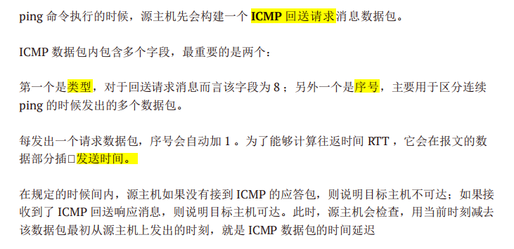
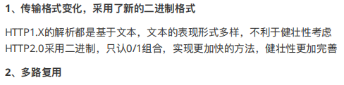
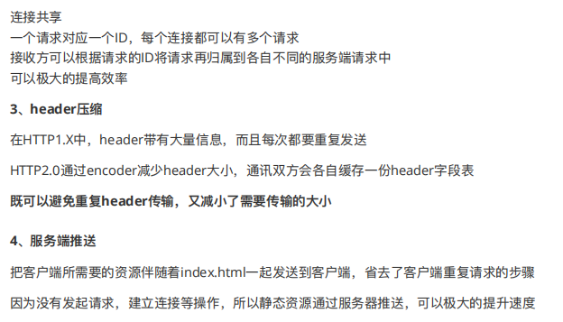
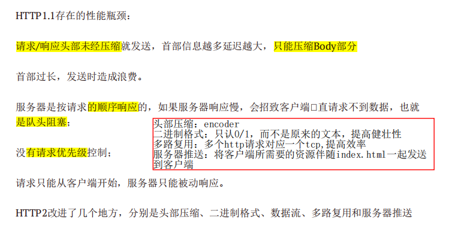
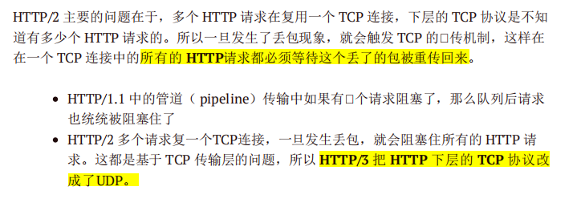
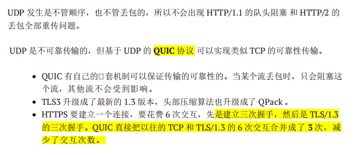
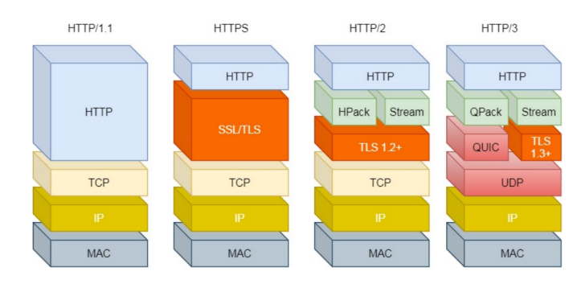
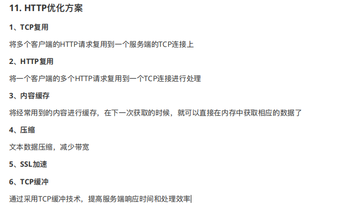
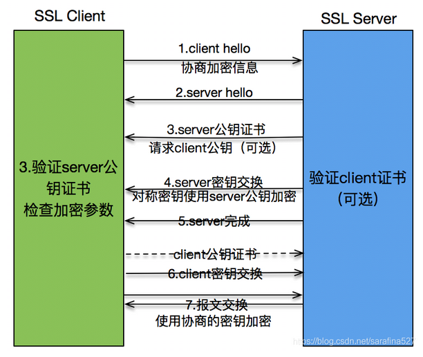
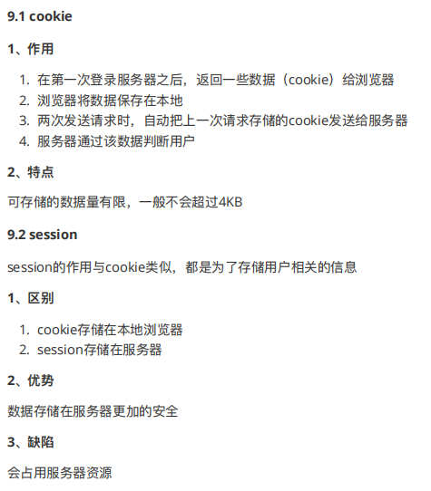

# 七层网络协议

## 七层网络协议是什么


网络OSI参考模型分为(从上到下):应，表，会，传，网，数链，物
    物理层->数据链路层->网络层->传输层->会话层->表示层->应用层。

**1，物理层（网卡）：**是模型的最低层，物理层涉及在信道上传输的**原始比特**流。该层是网络通信的数据传输介质，由连接不同结点的电缆与设备共同构成。功能是：利用传输介质为数据链路层提供物理连接，用于计算机之间的数据传输，传输bit流。负责0、1 比特流（0/1序列）与电压的高低、逛的闪灭之间的转换。在这一层，数据的单位称为比特（bit）。

**2，数据链路层（交换机）：**模型的第二层，数据链路层的主要任务是**加强物理层传输原始比特流的功能**，使之对应的网络层显现为一条无错线路。发送包把输入数据封装在数据帧，按顺序传送出去并处理接收方回送的**确认帧**。主要功能是：负责物理层面上的互联的、节点间的通信传输（例如一个以太网项链的2个节点之间的通信），传输以“帧”为单位的数据包，该层的作用包括：物理地址寻址、数据的成帧、流量控制、数据的检错、重发等。对bit数据格式化，校验。目的是保障数据传输可靠性。采用**差错控制与流量控制**方法，**使有差错的物理线路变成无差错的数据链路**。在这一层，数据的单位称为帧。

**3，网络层（路由选择，点到点）：**第三层，网络层关系到子网的运行控制，其中一个关键问题是确认**从源端到目的端如何选择路由**。主要功能是：为数据在节点之间传输创建**逻辑链路**，IP寻址，通过IP连接网络上的计算机。将数据传输到目标地址；目标地址可以使多个网络通过路由器连接而成的某一个地址，主要负责寻找地址和路由选择。通过路由实现不同局域网间的通信。通过路由选择算法为分组通过通信子网选择最适当的路径，以及实现**拥塞控制**、**网络互连**等功能。在这一层，数据的单位称为**数据包（packet）**。

**4，传输层（端到端）：**第四层，传输层的基本功能是**从会话层接收数据而且把其分成较小的单元传递给网络层**。只在通信双方的节点上（比如**计算机终端）进行处理**，而无需在路由器上处理，主要功能是：建立了主机端到端服务，处理数据包错误、数据包次序，以及其他一些关键传输问题。传输层向高层屏蔽了下层数据通信的细节。因此，它是计算机通信体系结构中关键的一层。主要关注tcp、udp。ipv6传输效率高就和这层有关。在这一层，数据的单位称为**数据段**（segment）。

主要功能：

（1）：为端到端连接提供传输服务

（2）：这种传输服务分为可靠和不可靠的,其中Tcp是典型的可靠传输,而Udp则是不可靠传输

（3）：为端到端连接提供**流量控制,差错控制,服务质量**(Quality of Service,QoS)等管理服务

包括的协议如下：

TCP：传输控制协议，传输效率低，可靠性强

UDP：用户数据报协议，适用于传输可靠性要求不高，数据量小的数据（比如QQ）

**5，会话层（会话控制）**：第五层，会话层允许不同机器上的用户**建立会话关系**。主要功能是：负责维护两个结点之间的传输连接，以便确保点到点传输不中断，以及管理数据交换等功能。管理不同设备之间通信。

**6，表示层（数据格式转化）：**第六层，表示层用来完成某些特定的功能。对应用层数据编码和数据格式转换，保障不同设备之间通信（windows和linux）。主要功能是：用于处理在两个通信系统中交换信息的表示方法，主要包括**数据格式变换、数据加密与解密、数据压缩与恢复等功能**。

**7，应用层**：模型的最高层，应用层包含着大量人们普遍需要的协议。主要功能是：**提供应用接口**，为用户直接提供各种网络服务，比如**文件服务器、数据库服务、电子邮件与其他网络服务**。


ARP：是根据IP地址获取物理地址（MAC）的一个TCP/IP协议

RARP：是根据物理地址(MAC) 获取IP地址的一个TCP/IP协议

>   注意和ARP和ARQ不一样，前者是在数据链路层，后者是TCP协议中自动重传请求协议

ARP协议在TCP/IP模型中属于IP层（网络层），在OSI模型中属于链路层


# TCP和UDP

## TCP和UDP区别以及应用场景

**运输层主要使用以下两种协议：**

1.  **传输控制协议 TCP**（Transmisson Control Protocol）--提供**面向连接**的，**可靠的**，面向字节流的数据传输服务。
2.  **用户数据报协议 UDP**（User Datagram Protocol）--提供**无连接**的，尽最大努力的数据传输服务（**不保证数据传输的可靠性**）。


### TCP与UDP的区别

-   TCP是面向连接的协议，发送数据前要先建立连接，TCP提供可靠的服务，也就是说，通过TCP连接传输的数据不会丢失，没有重复，并且按顺序到达；

    UDP是无连接的协议，发送数据前不需要建立连接，是没有可靠性；

-   TCP通信类似于于要打个电话，接通了，确认身份后，才开始进行通行；

    UDP通信类似于学校广播，靠着广播播报直接进行通信。

-   TCP只支持点对点通信，UDP支持一对一、一对多、多对一、多对多；

-   TCP是面向字节流的，UDP是面向报文的； 面向字节流是指发送数据时以字节为单位，一个数据包可以拆分成若干组进行发送，而UDP一个报文只能一次发完。

    >   TCP数据⼤于MSS时会在**TCP层**将数据进⾏分⽚传输，到达⽬的地后同样在传输层进⾏合并，如果有某个⽚丢失则只需要重传丢失的分⽚即可;
    >
    >   UDP数据⼤于MTU时会在**IP层分⽚**，同样也在⽬的IP层合并，如果某个IP分⽚丢失，则需要将所有分⽚都进⾏重传，开销⼤。

-   TCP首部开销（20字节）比UDP首部开销（8字节）要大

-   UDP 的主机不需要维持复杂的连接状态表

-   TCP拥有流量控制、拥塞控制，保证传输安全性等，UDP在⽹络拥堵情况下不会降低发送速率。

    

### TCP和UDP的应用场景

对某些实时性要求比较高的情况使用UDP，比如游戏，媒体通信，实时直播，即使出现传输错误也可以容忍；

其它大部分情况下，HTTP都是用TCP，因为要求传输的内容可靠，不出现丢失的情况


## TCP的可靠性如何保证？

1.  应用数据被分割成 TCP 认为最适合发送的数据块。
2.  TCP 给发送的每一个包进行编号，接收方对数据包进行**排序**，把有序数据传送给应用层。
3.  **校验和：** TCP 将保持它首部和数据的检验和。这是一个**端到端的检验和**，目的是检测数据在传输过程中的任何变化。如果收到段的检验和有差错，TCP 将丢弃这个报文段和不确认收到此报文段。
4.  TCP 的接收端会丢弃重复的数据。
5.  **流量控制：** TCP 连接的每一方都有固定大小的缓冲空间，TCP  的接收端只允许发送端发送接收端缓冲区能接纳的数据。当接收方来不及处理发送方的数据，能提示发送方降低发送的速率，防止包丢失。TCP  使用的流量控制协议是可变大小的滑动窗口协议。 （TCP 利用**滑动窗口**实现流量控制）
6.  **拥塞控制：** 当网络拥塞时，减少数据的发送。全局的。
7.  **ARQ 协议：** 也是为了实现可靠传输的，它的基本原理就是每发完一个分组就停止发送，等待对方确认。在收到确认后再发下一个分组。（自动重传请求）
8.  **超时重传：** 当 TCP 发出一个段后，它启动一个定时器，等待目的端确认收到这个报文段。如果不能及时收到一个确认，将重发这个报文段


>   分割：
>
>   编号：有序
>
>   校验和：端-端
>
>   弃重：
>
>   流控：滑动窗口
>
>   拥控：减少数据发送
>
>   ARQ：确认再传
>
>   超时重传：定时器

## 介绍TCP重传

-   ### ARQ 协议

    **自动重传请求**（Automatic Repeat-reQuest，ARQ）是 OSI  模型中数据**链路层和传输层**的**错误纠正协议**之一。它通过使用**确认和超时**这两个机制，在不可靠服务的基础上实现可靠的信息传输。如果发送方在发送后一段时间之内没有收到确认帧，它通常会重新发送。ARQ 包括**停止等待 ARQ 协议**和**连续 ARQ 协议。**
    
    
    
    #### 停止等待 ARQ 协议
    
    停止等待协议是为了实现可靠传输的，它的基本原理就是**每发完一个分组就停止发送，等待对方确认**（回复 ACK）。如果过了一段时间（超时时间后），还是没有收到 ACK 确认，说明没有发送成功，需要重新发送，**直到收到确认后再发下一个分组。**
    
    在停止等待协议中，若**接收方收到重复分组，就丢弃该分组，**但同时还要发送确认。
    
    **优缺点：**
    
    - **优点：** 简单
    - **缺点：** 信道利用率低，等待时间长
    
    **1) 无差错情况:**
    
    发送方发送**分组**, 接收方在规定时间内收到, 并且回复确认。 发送方再次发送。
    
    **2) 出现差错情况（超时重传）:**
    
    **停止等待协议**中**超时重传**是指只要超过一段时间仍然没有收到确认，就重传前面发送过的分组（认为刚才发送过的分组丢失了）。因此每发送完一个分组需要设置一个超时计时器，其重传时间应比数据在分组传输的平均往返时间更长一些。这种自动重传方式常称为 **自动重传请求 ARQ** 。另外在停止等待协议中若收到重复分组，就丢弃该分组，但同时还要发送确认。
    
    **3) 确认丢失和确认迟到**
    
    - **确认丢失** ：确认消息在传输过程丢失。当 A 发送 M1 消息，B 收到后，B 向 A 发送了一个 M1 确认消息，但却在传输过程中丢失。而 A  并不知道，在超时计时过后，A 重传 M1 消息，B 再次收到该消息后采取以下两点措施：1. **丢弃这个重复的 M1 消息**，不向上层交付。 2. **向 A 发送确认消息**。（不会认为已经发送过了，就不再发送。A 能重传，就证明 B 的确认消息丢失）。
    - **确认迟到** ：确认消息在传输过程中迟到。A 发送 M1 消息，B 收到并发送确认。在超时时间内没有收到确认消息，A 重传 M1 消息，B  仍然收到并继续发送确认消息（B 收到了 2 份 M1）。此时 A 收到了 B 第二次发送的确认消息。接着发送其他数据。过了一会，A 收到了 B  第一次发送的对 M1 的确认消息（A 也收到了 2 份确认消息）。处理如下：1. A 收到**重复的确认**后，**直接丢弃**。2. B 收到**重复的 M1**  后，也**直接丢弃**重复的 M1
    
    
    
    #### 连续 ARQ 协议
    
    **连续 ARQ 协议** 可提高信道利用率。发送维持一个**发送窗口**，凡位于发送窗口内的分组可连续发送出去，而**不需要等待对方确认**。接收方一般采用**累积确认**，对按序到达的**最后一个分组发送确认**，表明到这个分组位置的所有分组都已经正确收到了。
    
    **优缺点：**
    
    - **优点：** 信道利用率高，容易实现，即使确认丢失，也不必重传。
    - **缺点：** 不能向发送方反映出接收方已经正确收到的所有分组的信息。 比如：发送方发送了 5 条 消息，中间第三条丢失（3  号），这时接收方只能对前两个发送确认。发送方无法知道后三个分组的下落，而只好把后三个全部重传一次。这也叫 **Go-Back-N（回退  N）**，表示需要退回来重传已经发送过的 N 个消息。（中间有一个没有收到断了就断了）
    

## 介绍滑动窗口

**TCP 利用滑动窗口实现流量控制。流量控制是为了控制发送方发送速率，保证接收方来得及接收。** 接收方发送的确认报文中的窗口字段可以用来控制发送方窗口大小，从而影响发送方的发送速率。将窗口字段设置为 0，则发送方不能发送数据。


窗口是缓存的一部分，用来暂时存放字节流。**发送方和接收方各有一个窗口**，接收方通过 TCP 报文段中的窗口字段告诉发送方自己的窗口大小，发送方根据这个值和其它信息设置自己的窗口大小。

发送窗口内的字节都允许被发送，接收窗口内的字节都允许被接收。如果发送窗口左部的字节已经发送并且收到了确认，那么就将发送窗口**向右滑动一定距离**，直到左部第一个字节不是已发送并且已确认的状态；接收窗口的滑动类似，接收窗口左部字节已经发送确认并交付主机，就向右滑动接收窗口。

**接收窗口只会对窗口内最后一个按序到达的字节进行确认**，例如接收窗口已经收到的字节为 {31, 34, 35}，其中 {31} 按序到达，而 {34, 35} 就不是，因此只对字节 31 进行确认。发送方得到一个字节的确认之后，就知道这个字节之前的所有字节都已经被接收。


## TCP协议字段


-   **序号** ：用于对字节流进行编号，例如序号为 301，表示第一个字节的编号为 301，如果携带的数据长度为 100 字节，那么下一个报文段的序号应为 401。

-   **确认号** ：期望收到的下一个报文段的序号。例如 B 正确收到 A 发送来的一个报文段，序号为 501，携带的数据长度为 200 字节，因此 B 期望下一个报文段的序号为 701，B 发送给 A 的确认报文段中确认号就为 701。

-   **数据偏移** ：指的是数据部分距离报文段起始处的偏移量，实际上指的是首部的长度。

-   **确认 ACK** ：当 ACK=1 时确认号字段有效，否则无效。TCP 规定，在连接建立后所有传送的报文段都必须把 ACK 置 1。

-   **同步 SYN** ：在连接建立时用来同步序号。当 SYN=1，ACK=0 时表示这是一个连接请求报文段。若对方同意建立连接，则响应报文中 SYN=1，ACK=1。

-   **终止 FIN** ：用来释放一个连接，当 FIN=1 时，表示此报文段的发送方的数据已发送完毕，并要求释放连接。

-   **窗口** ：窗口值作为接收方让发送方设置其发送窗口的依据。之所以要有这个限制，是因为接收方的数据缓存空间是有限的。

    

## TCP连接中收到一个废报文，状态会怎么切换？

- **确认丢失** ：确认消息在传输过程丢失。当 A 发送 M1 消息，B 收到后，B 向 A 发送了一个 M1 确认消息，但却在传输过程中丢失。而 A  并不知道，在超时计时过后，A 重传 M1 消息，B 再次收到该消息后采取以下两点措施：1. **丢弃这个重复的 M1 消息**，不向上层交付。 2. **向 A 发送确认消息**。（不会认为已经发送过了，就不再发送。A 能重传，就证明 B 的确认消息丢失）。

  


## 为什么ack=seq+1

因为确认应答的是seq序列

ack=seq+1这么设计的目的是确保建立连接的双方都是真实的对方,而不是被某个中间人冒充的。ack和seq都是两个整型变量,表示序列号;


#### 为什么TCP客户端最后还要发送一次确认呢？

主要防止已经失效的连接请求报文突然又传送到了服务器，从而产生错误。

如果使用的是两次握手建立连接，假设有这样一种场景，客户端发送了第一个请求连接并且没有丢失，只是因为在网络结点中滞留的时间太长了，由于TCP的客户端迟迟没有收到确认报文，以为服务器没有收到，此时重新向服务器发送这条报文，此后客户端和服务器经过两次握手完成连接，传输数据，然后关闭连接。此时此前滞留的那一次请求连接，网络通畅了到达了服务器，这个报文本该是失效的，但是，两次握手的机制将会让客户端和服务器再次建立连接，这将导致不必要的错误和资源的浪费。

如果采用的是三次握手，就算是那一次失效的报文传送过来了，服务端接受到了那条失效报文并且回复了确认报文，但是客户端不会再次发出确认。由于服务器收不到确认，就知道客户端并没有请求连接。


## TCP三次握手四次挥手，分别状态

### TCP 三次握手

#### 简单版


- 客户端–发送带有 SYN 标志的数据包–一次握手–服务端

- 服务端–发送带有 SYN/ACK 标志的数据包–二次握手–客户端

- 客户端–发送带有带有 ACK 标志的数据包–三次握手–服务端

  > 在客户机和服务器之间建立正常的 TCP 网络连接时，客户机首先发出一个 SYN （同步请求）消息，服务器使用 SYN-ACK同步请求应答）  应答表示接收到了这个消息，最后客户机再以 ACK(Acknowledgement）消息响应。这样在客户机和服务器之间才能建立起可靠的 TCP  连接（三次握手），数据才可以在客户机和服务器之间传递


#### 详细版

​	在TCP/IP协议中，TCP协议提供可靠的连接服务，采用三次握手建立一个连接。

2. 第一次握手：建立连接时，客户端发送SYN 包(SYN = 1,seq=x)到服务器，并进入SYN_SEND状态，等待服务器确认。（TCP规定，SYN报文段（SYN=1的报文段）不能携带数据，但需要消耗掉一个序号。）

3. 第二次握手：服务器处于listen状态，收到SYN 包，必须确认客户的SYN（ack= x+1, ACK=1,），同时自己也发送一个SYN包（SYN=1,seq = y），即SYN+ACK包，此时服务器进入SYN_RECV(同步收到)状态。（这个报文也不能携带数据，但是同样要消耗一个序号。）

4. 第三次握手：客户端收到服务器的SYN＋ACK包，向服务器发送确认包ACK(ack=k+1，ACK=1，seq = x +1)，此包发送完毕，客户端和服务器进入ESTABLISHED状态(建立连接)，完成三次握手。（TCP规定，ACK报文段可以携带数据，但是如果不携带数据则不消耗序号。）

5. 完成三次握手，客户端与服务器开始传送数据


> seq指发送序列 : 同步标志
>
> ack指确认序列
>
> SYN指发送报文
>
> ACK指回应报文
>
> 理解：
>
> 所有消息都有序列，按发送方起始序列+1
>
> ack是回应序列，右发送序列+1


### TCP四次挥手

#### 简单版


断开一个 TCP 连接则需要“四次挥手”：

- 客户端-发送一个 FIN，用来关闭客户端到服务器的数据传送
- 服务器-收到这个 FIN，它发回一 个 ACK，确认序号为收到的序号加 1 。和 SYN 一样，一个 FIN 将占用一个序号
- 服务器-关闭与客户端的连接，发送一个 FIN 给客户端
- 客户端-发回 ACK 报文确认，并将确认序号设置为收到序号加 1

任何一方都可以在数据传送结束后发出连接释放的通知，待对方确认后进入半关闭状态。当另一方也没有数据再发送的时候，则发出连接释放通知，对方确认后就完全关闭了 TCP 连接。

简单易懂：

举个例子：A 和 B 打电话，通话即将结束后，A 说“我没啥要说的了”，B 回答“我知道了”，但是 **B 可能还会有要说的话，A 不能要求 B  跟着自己的节奏结束通话**，于是 B 可能又巴拉巴拉说了一通，最后 B 说“我说完了”，A 回答“知道了”，这样通话才算结束。

> 数据传输完毕后，双方都可释放连接。最开始的时候，客户端和服务器都是处于ESTABLISHED状态，然后客户端主动关闭，服务器被动关闭。

> FIN结束报文
>

#### 详细版

1. 客户端进程发出连接释放报文，并且停止发送数据。释放数据报文首部，FIN=1，其序列号为seq=u（等于前面已经传送过来的数据的最后一个字节的序号加1），此时，客户端进入FIN-WAIT-1（终止等待1）状态。 （TCP规定，FIN报文段即使不携带数据，也要消耗一个序号。）

2. 服务器收到连接释放报文，发出确认报文，ACK=1，ack=u+1，并且带上自己的序列号seq=v，此时，服务端就进入了CLOSE-WAIT（关闭等待）状态。TCP服务器通知高层的应用进程，**客户端向服务器的方向就释放了**，这时候处于**半关闭状态**，即客户端已经没有数据要发送了，但是**服务器若发送数据，客户端依然要接受**。这个**状态还要持续一段时间**，也就是整个**CLOSE-WAIT**状态持续的时间。
   客户端收到服务器的确认请求后，此时，客户端就进入**FIN-WAIT-2（终止等待2）状态**，**等待服务器发送连接释放报文**（在这之前还需要接受服务器发送的最后的数据）。

3. **服务器将最后的数据发送完毕后**，就向客户端**发送连接释放报文**，FIN=1，ack=u+1，由于在半关闭状态，服务器很可能又发送了一些数据，假定此时的序列号为seq=w，此时，服务器就进入了LAST-ACK（最后确认）状态，等待客户端的确认。

4. 客户端收到服务器的连接释放报文后，必须发出确认，ACK=1，ack=w+1，而自己的序列号是seq=u+1，此时，**客户端就进入了TIME-WAIT（时间等待）状态**。注意此时TCP连接**还没有释放**，**必须经过2 *MSL（最长报文段寿命）的时间后**，当客户端撤销相应的TCB后，才进入**CLOSED状态**。
   **服务器**只要收到了客户端发出的确认，立即**进入CLOSED状态**。同样，撤销TCB后，就结束了这次的TCP连接。可以看到，服务器结束TCP连接的时间要比客户端早一些。

   


## 为什么TCP建立要三次、断开要四次

建立连接的时候， 服务器在LISTEN状态下，收到建立连接请求的SYN报文后，把ACK和SYN放在一个报文里发送给客户端。
而关闭连接时，**服务器**收到对方的FIN报文时，**仅仅表示对方不再发送数据了但是还能接收数据**，而自己也未必全部数据都发送给对方了，所以己方可以立即关闭，也可以发送一些数据给对方后，再发送**FIN报文给对方来表示同意现在关闭连接**，因此，**己方ACK和FIN一般都会分开发送，从而导致多了一次。**


## 半连接状态是什么？

发生在TCP三次握手中，如果A向B发起连接，B也按照正常情况下响应了，但是A**不进行三次握手，这就是半连接**。

客户端向服务端发起连接请求（**同步请求**），服务器第一次收到客户端的SYN之后，就会处于SYN_RCVD（**同步收到**）状态，此时双方还没有完全建立其连接，**服务器会把此种状态下请求连接放到一个队列里，我们将这种队列称之为半连接队列。**
**全连接队列就是已经完成了三次握手**，建立起连接就会放到全连接队列中去，如果全连接队列满了就可能会出现丢包的现象。

> 补充关于SYN-ACK重传次数的问题:
>
> 服务器发送完SYN-ACK包，如果未收到客户端确认包，服务器进行首次重传，等待一段时间仍未收到客户确认包，进行第二次重传。如果重传次数超过系统规定的最大重传次数，系统将该连接信息从半连接队列中删除。
> 每次重传等待的时间一般不同，一般是指数增长。如时间间隔是1，2，4，8


## TCP拆包、粘包，如何解决这个问题

TCP协议是**面向字节流的**，TCP没有**消息边界保护**的功能，所以TCP就会发生**粘包**和**拆包**的问题。

这一点不像UDP，因为**UDP面向报文**，所以它不会对报文进行处理，而是直接将报文作为一个整体，添加UDP头部（ 粘包拆包问题在数据 “链路层、网络层、传输层” 都可能发生）


### 粘包/拆包问题产生原因

- 要发送的数据大于TCP发送缓冲区剩余空间大小，将会发生拆包。

- 待发送数据大于MSS（TCP报文长度 - TCP头部长度 > MSS最大报文长度），TCP在传输前将根据MSS大小进行拆包分段发送。

  > MTU 最大传输单元 （链路层）：
  >
  > 数据链路层传输的帧大小是有限制的，不能把一个太大的包直接塞给链路层，这个限制被称为「最大传输单元（Maximum Transmission Unit, MTU）
  >
  > MSS TCP最大段大小 Maximum Segment Size（传输层 - 可传输tcp数据包大小）
  >
  > 一般，在以太网中 TCP 的 MSS = 1500（MTU） - 20（IP 头大小） - 20（TCP 头大小）= **1460**
  >
  > 
  >
  >  **总结：**IP 数据包长度超过链路的 MTU 时，在发送之前需要分片，而 TCP 层为了 IP 层不用分片主动将包切割成 MSS 大小。

- 要发送的数据小于TCP发送缓冲区的大小，TCP将多次写入缓冲区的数据包合并为一次发送，将发生粘包（Nagle算法优化，避免tcp报文头重脚轻的情况发生）

- 接收数据端的应用层没有及时读取接收缓冲区中的数据，将发生粘包。


### 解决方法

解决问题关键在于如何给每个数据包**添加边界信息用于区分不同数据包**

- 消息分为TCP首部和TCP消息体，TCP首部中**应保存数据包的长度**（TCP的首部**原本是没有**表示数据长度的字段，因为可由**IP层计算**出：TCP包长度 = IP首部的数据包长度 - IP首部长度，再由TCP包长度可知数据的长度）。这样接收端在接收到数据后，通过读取包首部的长度字段，就知道每个数据包的实际长度了。
- **发送端在每个包的末尾使用固定的分隔符**（如 \r\n），这样接收端通过这个边界就可以将不同的数据包拆分开（如 **FTP协议**）。
- **发送端将每个数据包封装为固定长度**（不够的可以通过补0填充），这样接收端每次从接收缓冲区中读取固定长度的数据就自然而然的把每个数据包拆分开来。不推荐这种方式，尤其是在高并发大流量的业务场景下，会消耗不必要的资源


# HTTP协议

## http的请求头有什么？请求方法在哪个部分？ cookie是放在哪个部分？空行的作用？

> 当我们设计一个通信协议时，“消息头/消息体”的分割方式是很常用的，**消息头告诉对方这个消息是干什么的，消息体告诉对方怎么干**。HTTP协议传输的消息也是这样规定的，每一个HTTP包都分为HTTP头和HTTP体两部分，消息体是可选的，而消息头是必须的。每当我们打开一个网页，在上面点击右键，选择“查看源文件”，这时看到的HTML代码就是HTTP的消息体，那么消息头可以通过浏览器的开发工具或者插件可以看到
>
> 客户端通过发送 HTTP 请求向服务器请求对资源的访问。 它向服务器传递了一个数据块，也就是请求信息，HTTP 请求由三部分组成：请求行、 请求头和请求正文。

请求头

```xml
GET /u/50869054?s=48&v=4 HTTP/2
Host: avatars.githubusercontent.com
User-Agent: Mozilla/5.0 (Windows NT 10.0; Win64; x64; rv:100.0) Gecko/20100101 Firefox/100.0
Accept: image/avif,image/webp,*/*
Accept-Language: zh-CN,zh;q=0.8,zh-TW;q=0.7,zh-HK;q=0.5,en-US;q=0.3,en;q=0.2
Accept-Encoding: gzip, deflate, br
Connection: keep-alive
Referer: https://github.com/
Sec-Fetch-Dest: image
Sec-Fetch-Mode: no-cors
Sec-Fetch-Site: cross-site
Pragma: no-cache
Cache-Control: no-cache
```

**请求行：**请求方法URI协议/版本

POST /index.php HTTP/1.1

##### 请求报头

请求报头允许客户端向服务器传递请求的**附加信息**和**客户端自身的信息**。
PS: 客户端不一定特指浏览器，有时候也可使用Linux下的CURL命令以及HTTP客户端测试工具等。
**常见的请求报头**: 

Accept, Accept-Charset:接受哪些类型的信息

Accept-Encoding: 指定接受的编码方式
Accept-Language：语言环境
Cache-Control：缓存控制
Connection：告诉浏览器，请求完成是断开还是保持链接(Keep-alive)
HOST：主机

Accept-Language, Content-Type, Authorization, Cookie, User-Agent等

##### 请求正文

当**使用POST, PUT等方法时，通常需要客户端向服务器传递数据。这些数据就储存在请求正文中**。在请求包头中有一些与请求正文相关的信息，例如: 现在的Web应用通常采用Rest架构，请求的数据格式一般为json。这时就需要设置Content-Type: application/json。

> response:
>
> 


**Cookie在请求头中**


作用： 最重要的header, 将cookie的值发送给HTTP 服务器

空行数:在Cookie栏内除显示Cookie内容外,另外多加的*空行*,可以用来添加新*Cookie*数据。注意,当输入完空行 数后,一定要按回车,否则输入无效。


**空行的作用是区分消息报头和相应正文**


## http是哪层协议？HTTP请求有哪些

HTTP用于从WWW服务器传输超文本到本地浏览器的传送协议

HTTP 是应用层协议，它以 **TCP（传输层）**作为底层协议，默认端口为 **80**. 通信过程主要如下：

1.  服务器在 80 端口等待客户的请求。
2.  浏览器发起到服务器的 TCP 连接（创建套接字 Socket）。
3.  服务器接收来自浏览器的 TCP 连接。
4.  浏览器（HTTP 客户端）与 Web 服务器（HTTP 服务器）交换 HTTP 消息。
5.  关闭 TCP 连接。


### 请求


客户端发送的   **请求报文**   第一行为请求行，包含了方法字段。

### 

#### GET

> 获取资源

当前网络请求中，绝大部分使用的是 GET 方法。

#### HEAD

> 获取报文首部

和 GET 方法类似，但是不返回报文实体主体部分。

主要用于确认 URL 的有效性以及资源更新的日期时间等。

#### POST

> 传输实体主体

POST 主要用来传输数据，而 GET 主要用来获取资源。

更多 POST 与 GET 的比较请见第九章。

#### PUT

> 上传文件

由于自身不带验证机制，任何人都可以上传文件，因此存在安全性问题，一般不使用该方法。

```
PUT /new.html HTTP/1.1
Host: example.com
Content-type: text/html
Content-length: 16

<p>New File</p>
```

#### PATCH

> 对资源进行部分修改

PUT 也可以用于修改资源，但是只能完全替代原始资源，PATCH 允许部分修改。

```
PATCH /file.txt HTTP/1.1
Host: www.example.com
Content-Type: application/example
If-Match: "e0023aa4e"
Content-Length: 100

[description of changes]
```

#### DELETE

> 删除文件

与 PUT 功能相反，并且同样不带验证机制。

```
DELETE /file.html HTTP/1.1
```

#### OPTIONS

> 查询支持的方法

查询指定的 URL 能够支持的方法。

会返回 `Allow: GET, POST, HEAD, OPTIONS` 这样的内容。

#### CONNECT

> 要求在与代理服务器通信时建立隧道

使用 SSL（Secure Sockets Layer，安全套接层）和 TLS（Transport Layer Security，传输层安全）协议把通信内容加密后经网络隧道传输。

```
CONNECT www.example.com:443 HTTP/1.1
```

#### TRACE

> 追踪路径

服务器会将通信路径返回给客户端。

发送请求时，在 Max-Forwards 首部字段中填入数值，每经过一个服务器就会减 1，当数值为 0 时就停止传输。

通常不会使用 TRACE，并且它容易受到 XST 攻击（Cross-Site Tracing，跨站追踪）。


## post和Get区别

`get`【提交请求】：**获取资源**，**请求服务器发送某个资源**，用来请求访问已被URI（统一资源标志符，和URL是包含和被包含的关系）识别的资源。(一般用于**获取数据**)

`POST`【提交数据】：用来**传输实体的主体**，**向服务器提交数据**,  虽然GET也可以实现，但是一般不用。


详细版

### 作用

GET 用于获取资源，而 POST 用于传输实体主体。


### 参数

GET 和 POST 的请求都能使用额外的参数，但是 GET 的参数是以查询字符串出现在 URL 中，而 POST 的参数存储在实体主体中。不能因为 POST 参数存储在实体主体中就认为它的安全性更高，因为照样可以通过一些抓包工具（Fiddler）查看。

因为 URL 只支持 ASCII 码，因此 GET 的参数中如果存在中文等字符就需要先进行编码。例如 `中文` 会转换为 `%E4%B8%AD%E6%96%87`，而空格会转换为 `%20`。POST 参数支持标准字符集。

```
GET /test/demo_form.asp?name1=value1&name2=value2 HTTP/1.1

POST /test/demo_form.asp HTTP/1.1
Host: w3schools.com
name1=value1&name2=value2
```


### 安全

安全的 HTTP 方法不会改变服务器状态，也就是说它只是**可读**的。

**GET 方法是安全的，而 POST 却不是**，因为 POST 的目的是传送实体主体内容，这个内容可能是用户上传的表单数据，上传成功之后，服务器可能把这个数据存储到数据库中，因此状态也就发生了改变。

安全的方法除了 GET 之外还有：HEAD、OPTIONS。

不安全的方法除了 POST 之外还有 PUT、DELETE。


### 幂等性

幂等的 HTTP 方法，**同样的请求被执行一次与连续执行多次的效果是一样**的，服务器的状态也是一样的。换句话说就是，幂等方法不应该具有副作用（统计用途除外）。

所有的**安全方法也都是幂等**的。

在正确实现的条件下，GET，HEAD，PUT 和 DELETE 等方法都是幂等的，而 POST 方法不是。

GET /pageX HTTP/1.1 是幂等的，连续调用多次，客户端接收到的结果都是一样的：

```
GET /pageX HTTP/1.1
GET /pageX HTTP/1.1
GET /pageX HTTP/1.1
GET /pageX HTTP/1.1
```

POST /add_row HTTP/1.1 不是幂等的，如果调用多次，就会增加多行记录：

```
POST /add_row HTTP/1.1   -> Adds a 1nd row
POST /add_row HTTP/1.1   -> Adds a 2nd row
POST /add_row HTTP/1.1   -> Adds a 3rd row
```

DELETE /idX/delete HTTP/1.1 是幂等的，即使不同的请求接收到的状态码不一样：

```
DELETE /idX/delete HTTP/1.1   -> Returns 200 if idX exists
DELETE /idX/delete HTTP/1.1   -> Returns 404 as it just got deleted
DELETE /idX/delete HTTP/1.1   -> Returns 404
```


### 可缓存

如果要对响应进行缓存，需要满足以下条件：

- **请求报文的 HTTP 方法本身是可缓存的，包括 GET 和 HEAD**，但是 PUT 和 DELETE 不可缓存，POST 在多数情况下不可缓存的。
- 响应报文的状态码是可缓存的，包括：200, 203, 204, 206, 300, 301, 404, 405, 410, 414, and 501。
- 响应报文的 Cache-Control 首部字段没有指定不进行缓存。

 

### XMLHttpRequest

为了阐述 POST 和 GET 的另一个区别，需要先了解 XMLHttpRequest：

> XMLHttpRequest 是一个 **API，它为客户端提供了在客户端和服务器之间传输数据的功能**。它提供了一个通过  URL 来获取数据的简单方式，并且不会使整个页面刷新。这使得网页**只更新一部分页面**而不会打扰到用户。XMLHttpRequest 在 AJAX  中被大量使用。

- 在使用 **XMLHttpRequest 的 POST 方法时，浏览器会先发送 Header 再发送 Data**。但并不是所有浏览器会这么做，例如火狐就不会。

- 而 GET 方法 Header 和 Data 会一起发送。

  

## http请求的一个过程

> 查 Web 缓存是否有该网页缓存，有的话直接显示；
>
> DNS解析（浏览器缓存、系统缓存、hosts 文件、路由器缓存、递归搜索根域名服务器）；
>
> TCP连接（三次握手）；.
>
> 发送HTTP请求（OPSF：开放最短路径优先），HTTP 会话会被分成报文段，添加源、目的端口（目的端口由客户端系统随机一个）；
>
> 服务器处理请求并返回HTTP报文；
>
> 浏览器收到服务器的响应报文后，如果可以缓存，则进行缓存；
>
> 浏览器解析渲染⻚面（浏览器请求下载资源、解析、构建树、渲染布局、绘制、最后呈现给客户端界面）；浏览器将获取的 HTML 文档解析成 DOM 树（文档对象模型，Document Object Model。不论 DOM 还是 CSSOM，都要经过 bytes -> characters -> tokens -> nodes -> objectmodel）；处理 CSS 标记，构成层叠样式表模型 CSSOM；
>
> 连接结束（四次挥手断开链接）

打开一个网页，整个过程会使用哪些协议？


> 上图有一个错误，请注意，是 OSPF 不是 OPSF。 OSPF（Open Shortest Path First，ospf）开放最短路径优先协议, 是由 Internet 工程任务组开发的路由选择协议

总体来说分为以下几个过程:

1. DNS 解析(DNS是域名解析服务器，用于网址和ip地址的相互映射)

   1. IP协议包装IP头
   2. OSPF协议寻找最短路由路径
   3. ARP：将IP -> MAC

   > 所有网址真正的解析过程为: 
   >
   > . -> .com -> google.com. -> www.google.com.
   >
   > 
   >
   > DNS缓存优化
   >
   > DNS负载均衡（DNS重定向）

2. TCP 连接：如前面

3. 发送 HTTP 请求：

   > ##### 请求报头
   >
   > 请求报头允许客户端向服务器传递请求的**附加信息**和**客户端自身的信息**。
   > PS: 客户端不一定特指浏览器，有时候也可使用Linux下的CURL命令以及HTTP客户端测试工具等。
   > **常见的请求报头**: 
   >
   > Accept, Accept-Charset:接受哪些类型的信息
   >
   > Accept-Encoding: 指定接受的编码方式
   >
   > Connection: 设置为Keep-alive
   >
   > Accept-Language, Content-Type, Authorization, Cookie, User-Agent等
   >
   > 
   >
   > ##### 请求正文
   >
   > 当使用POST, PUT等方法时，通常需要客户端向服务器传递数据。这些数据就储存在请求正文中。在请求包头中有一些与请求正文相关的信息，例如: 现在的Web应用通常采用Rest架构，请求的数据格式一般为json。这时就需要设置Content-Type: application/json。

4. 服务器处理请求并返回 HTTP 报文

   > 后端工程师眼中的HTTP。后端从在固定的端口接收到TCP报文开始，这一部分对应于编程语言中的socket。它会对TCP连接进行处理，对HTTP协议进行解析，并按照报文格式进一步封装成HTTP Request对象，供上层使用。这一部分工作一般是由Web服务器去进行，比如有Tomcat, Jetty和Netty等等。
   >
   > HTTP响应报文也是由三部分组成: **状态码**, **响应报头**和**响应报文**
   >
   > ##### 状态码
   >
   > 状态码是由3位数组成，第一个数字定义了响应的类别，且有五种可能取值:
   >
   > 
   >
   > ##### 响应报头
   >
   > 常见的响应报头字段有: Server, Connection...。
   >
   > ##### 响应报文
   >
   > 服务器返回给浏览器的文本信息，通常HTML, CSS, JS, 图片等文件就放在这一部分

5. 浏览器解析渲染页面

6. 连接结束


## DNS解析过程

1.   本地hosts文件：是否有对应域名和ip的映射

2.   本地DNS解析缓存：是否有对应域名和ip的映射

3.   本地DNS：如果在资源范围内则解析后返回给主机

4.   本地DNS：网址的映射关系，解析并返回

5.   本地DNS开了转发模式：向上一级请求，再向上解析，返回给本地DNS，本地DNS返回给主机（自下向上）

     本地DNS未开转发模式：根DNS->判断这个域名由谁来负责（ip）-> 本地DNS->相应ip的根DNS->如果不能解析，就找下一级的DNS 给本地DNS，重复这个工程（自上而下） 


## ping的工作原理

>   ICMP：ICMP(Internet Control Message Protocol)它属于网络层协议，主要用于在主机与路由器之间传递控制信息，包括报告错误、交换受限控制和状态信息等。主要是检查，而不是纠错。




## 对http协议的了解/发展是什么，https协议的了解。两者的区别是什么？

>   无状态协议：服务器不保留连接的相关信息。所以每次请求都需要包含所需的所有信息。

HTTP 是一个**无状态（stateless）协议**，也就是说服务器**不维护任何有关客户端过去所发请求的消息**。这其实是一种懒政，有状态协议会更加复杂，需要维护状态（历史信息），而且如果客户或服务器失效，会产生状态的不一致，解决这种不一致的代价更高。

HTTPS 协议（Hyper Text  Transfer Protocol Secure），是 **HTTP 的加强安全版本**。HTTPS 是基于 HTTP 的，也是用 **TCP  作为底层协议**，并额外使用 **SSL/TLS 协议用作加密和安全认证**。默认端口号是 **443**.

HTTPS 协议中，SSL 通道通常使用基于密钥的加密算法，密钥长度通常是 40 比特或 128 比特。

## http1.1版本的新特性

**状态响应码** : HTTP/1.1中新加入了大量的状态码，光是错误响应状态码就新增了24种。比如说，`100 (Continue)`——在请求大资源前的预热请求，`206 (Partial Content)`——范围请求的标识码，`409 (Conflict)`——请求与当前资源的规定冲突，`410 (Gone)`——资源已被永久删除，而且没有任何已知的转发地址。

**缓存处理** : 在 HTTP1.0 中主要使用 header 里的 If-Modified-Since,Expires  来做为缓存判断的标准，HTTP1.1 则引入了更多的缓存控制策略例如 Entity tag，If-Unmodified-Since,  If-Match, If-None-Match 等更多可供选择的缓存头来控制缓存策略。

**连接方式** : HTTP 1.0 为短连接，HTTP 1.1 支持长连接。长连接：非流水线（客户端在收到上一个请求的响应后才能继续发送下一个请求），流水线（不用）

**Host头处理** : HTTP/1.1在请求头中加入了`Host`字段

**带宽优化及网络连接的使用** :HTTP1.0  中，存在一些浪费带宽的现象，例如客户端只是需要某个对象的一部分，而服务器却将整个对象送过来了，并且不支持断点续传功能，HTTP1.1  则在请求头引入了 range 头域，它允许**只请求资源的某个部分**，即返回码是 **206**（Partial  Content），这样就方便了开发者自由的选择以便于充分利用带宽和连接。

## http2.0版本的新特性





>   头部压缩：encoder   
>
>   二进制格式：只认0/1，而不是原来的文本，提高健壮性
>
>   多路复用：多个http请求对应一个tcp,提高效率
>
>   服务器推送：将客户端所需要的资源伴随index.html一起发送
>
>   到客户端


## 说一下HTTP1.0、HTTP1.1、HTTP2、HTTP3的演变？

**http1.0到http1.1:**

**状态响应码** : HTTP/1.1中新加入了大量的状态码，光是错误响应状态码就新增了24种。比如说，`100 (Continue)`——在请求大资源前的预热请求，`206 (Partial Content)`——范围请求的标识码，`409 (Conflict)`——请求与当前资源的规定冲突，`410 (Gone)`——资源已被永久删除，而且没有任何已知的转发地址。

**缓存处理** : 在 HTTP1.0 中主要使用 header 里的 If-Modified-Since,Expires  来做为缓存判断的标准，HTTP1.1 则引入了更多的缓存控制策略例如 Entity tag，If-Unmodified-Since,  If-Match, If-None-Match 等更多可供选择的缓存头来控制缓存策略。

**连接方式** : HTTP 1.0 为短连接，HTTP 1.1 支持长连接。长连接：非流水线（客户端在收到上一个请求的响应后才能继续发送下一个请求），流水线（不用）

**Host头处理** : HTTP/1.1在请求头中加入了`Host`字段

**带宽优化及网络连接的使用** :HTTP1.0  中，存在一些浪费带宽的现象，例如客户端只是需要某个对象的一部分，而服务器却将整个对象送过来了，并且不支持断点续传功能，HTTP1.1  则在请求头引入了 range 头域，它允许**只请求资源的某个部分**，即返回码是 **206**（Partial  Content），这样就方便了开发者自由的选择以便于充分利用带宽和连接。









## HTTP优化方案




## https是什么？加密时怎么传递密钥？

HTTPS 协议（Hyper Text  Transfer Protocol Secure），是 **HTTP 的加强安全版本**。HTTPS 是基于 HTTP 的，也是用 **TCP  作为底层协议**，并额外使用 **SSL/TLS 协议用作加密和安全认证**。默认端口号是 **443**.

HTTPS 协议中，SSL 通道通常使用基于密钥的加密算法，密钥长度通常是 40 比特或 128 比特。


### HTTPS 的核心—SSL/TLS协议

对**消息**是**对称加密**

对对称加密的**密钥**是**非对称加密**

HTTPS 之所以能达到较高的安全性要求，就是结合了 SSL/TLS 和 TCP 协议，对通信数据进行加密，解决了 HTTP 数据透明的问题。接下来重点介绍一下 SSL/TLS 的工作原理。


**握手过程**



客户端的浏览器向服务器传送客户端SSL 协议的版本号，加密算法的种类，产生的随机数，以及其他服务器和客户端之间通讯所需要的各种信息。

②服务器向客户端传送SSL 协议的版本号，加密算法的种类，随机数以及其他相关信息，同时服务器还将向客户端传送自己的证书。

③客户利用服务器传过来的信息验证服务器的合法性，服务器的合法性包括：证书是否过期，发行服务器证书的CA 是否可靠，发行者证书的公钥能否正确解开服务器证书的“发行者的数字签名”，服务器证书上的域名是否和服务器的实际域名相匹配。如果合法性验证没有通过，通讯将断开；如果合法性验证通过，将继续进行第四步。

④用户端随机产生一个用于后面通讯的“对称密码”，然后用服务器的公钥（服务器的公钥从步骤②中的服务器的证书中获e68a84e8a2ad62616964757a686964616f31333433633439得）对其加密，然后传给服务器。

⑤服务器用私钥解密“对称密码”(此处的公钥和私钥是相互关联的，公钥加密的数据只能用私钥解密，私钥只在[服务器端](https://links.jianshu.com/go?to=https%3A%2F%2Fwww.baidu.com%2Fs%3Fwd%3D%E6%9C%8D%E5%8A%A1%E5%99%A8%E7%AB%AF%26tn%3DSE_PcZhidaonwhc_ngpagmjz%26rsv_dl%3Dgh_pc_zhidao)保留。然后用其作为服务器和客户端的“通话密码”加解密通讯。同时在SSL 通讯过程中还要完成数据通讯的完整性，防止数据通讯中的任何变化。

⑥客户端向[服务器端](https://links.jianshu.com/go?to=https%3A%2F%2Fwww.baidu.com%2Fs%3Fwd%3D%E6%9C%8D%E5%8A%A1%E5%99%A8%E7%AB%AF%26tn%3DSE_PcZhidaonwhc_ngpagmjz%26rsv_dl%3Dgh_pc_zhidao)发出信息，指明后面的数据通讯将使用的步骤⑤中的主密码为对称密钥，同时通知服务器客户端的握手过程结束。

⑦SSL 的握手部分结束，SSL 安全通道的数据通讯开始，客户和服务器开始使用相同的对称密钥进行数据通讯，同时进行通讯完整性的检验。


#### SSL 和 TLS 的区别

**SSL 和 TLS 没有太大的区别。**

SSL 指安全套接字协议（Secure Sockets Layer），首次发布与 1996 年。SSL 的首次发布其实已经是他的 3.0 版本，SSL 1.0 从未面世，SSL 2.0 则具有较大的缺陷（DROWN 缺陷——Decrypting RSA with Obsolete and  Weakened eNcryption）。很快，在 1999 年，SSL 3.0 进一步升级，**新版本被命名为 TLS 1.0**。因此，TLS 是基于 SSL 之上的，但由于习惯叫法，通常把 HTTPS 中的核心加密协议混成为 SSL/TLS。


#### SSL/TLS 的工作原理

##### 非对称加密

SSL/TLS 的核心要素是**非对称加密**。非对称加密采用两个密钥——**一个公钥，一个私钥**。在通信时，**私钥仅由解密者保存**，**公钥**由任何一个想与解密者通信的**发送者（加密者）**所知。可以设想一个场景，

>   在某个自助邮局，每个通信信道都是一个邮箱，每一个邮箱所有者都在旁边立了一个牌子，上面挂着一把钥匙：这是我的公钥，发送者请将信件放入我的邮箱，并用公钥锁好。
>
>   但是公钥只能加锁，并不能解锁。解锁只能由邮箱的所有者——因为只有他保存着私钥。
>
>   这样，通信信息就不会被其他人截获了，这依赖于私钥的保密性。


非对称加密的公钥和私钥需要采用一种复杂的数学机制生成（密码学认为，为了较高的安全性，尽量不要自己创造加密方案）。公私钥对的生成算法依赖于单向陷门函数。

>   单向函数：已知单向函数 f，给定任意一个输入 x，易计算输出 y=f(x)；而给定一个输出 y，假设存在 f(x)=y，很难根据 f 来计算出 x。
>
>   单向陷门函数：一个较弱的单向函数。已知单向陷门函数 f，陷门 h，给定任意一个输入 x，易计算出输出 y=f(x;h)；而给定一个输出 y，假设存在 f(x;h)=y，很难根据 f 来计算出 x，但可以根据 f 和 h 来推导出 x。
>
>   在这里，函数 f 的计算方法相当于公钥，陷门 h 相当于私钥。公钥 f 是公开的，任何人对已有输入，都可以用 f 加密，而要想根据加密信息还原出原信息，必须要有私钥h才行


上图就是一个单向函数（不是单项陷门函数），假设有一个绝世秘籍，任何知道了这个秘籍的人都可以把苹果汁榨成苹果，那么这个秘籍就是“陷门”了吧。


##### 对称加密

使用 SSL/TLS 进行通信的双方需要使用非对称加密方案来通信，但是非对称加密设计了较为复杂的数学算法，在实际通信过程中**，计算的代价较高**，效率太低，因此，**SSL/TLS 实际对消息的加密使用的是对称加密。**

>   对称加密：通信双方共享唯一密钥 k，加解密算法已知，加密方利用密钥 k 加密，解密方利用密钥 k 解密，保密性依赖于密钥 k 的保密性。


对称加密的密钥生成代价比公私钥对的生成代价低得多，那么有的人会问了，为什么 SSL/TLS  还需要使用非对称加密呢？因为对称加密的保密性完全依赖于密钥的保密性。**在双方通信之前，需要商量一个用于对称加密的密钥**。我们知道网络通信的信道是不安全的，传输报文对任何人是可见的，密钥的交换肯定不能直接在网络信道中传输。因此，**使用非对称加密，对对称加密的密钥进行加密，保护该密钥不在网络信道中被窃听。**这样，**通信双方只需要一次非对称加密，交换对称加密的密钥，在之后的信息通信中，使用绝对安全的密钥，对信息进行对称加密，即可保证传输消息的保密性**


##### 公钥传输的信赖性

SSL/TLS 介绍到这里，了解信息安全的朋友又会想到一个安全隐患，设想一个下面的场景：

>   客户端 C 和服务器 S 想要使用 SSL/TLS 通信，由上述 SSL/TLS 通信原理，C 需要先知道 S 的公钥，而 S 公钥的唯一获取途径，就是把 S 公钥在网络信道中传输。要注意网络信道通信中有几个前提：
>
>   1.  任何人都可以捕获通信包
>   2.  通信包的保密性由发送者设计
>   3.  保密算法设计方案默认为公开，而（解密）密钥默认是安全的
>
>   因此，假设 S 公钥不做加密，在信道中传输，那么很有可能存在一个攻击者 A，发送给 C 一个诈包，假装是 S 公钥，其实是诱饵服务器 AS 的公钥。当 C 收获了 AS 的公钥（却以为是 S 的公钥），C 后续就会使用 AS 公钥对数据进行加密，并在公开信道传输，那么 A 将捕获这些加密包，用  AS 的私钥解密，就截获了 C 本要给 S 发送的内容，而 C 和 S 二人全然不知。
>
>   同样的，S 公钥即使做加密，也难以避免这种信任性问题，C 被 AS 拐跑了！


为了**公钥传输的信赖性**问题，第三方机构应运而生——证书颁发机构（**CA**，Certificate Authority）。CA 默认是受信任的第三方。CA 会给各个服务器颁发证书，证书存储在服务器上，并附有 CA 的**电子签名**（见下节）。

当客户端（浏览器）向服务器发送 HTTPS  请求时，一定要先获取目标服务器的证书，并根据证书上的信息，检验证书的合法性。一旦客户端检测到证书非法，就会发生错误。客户端获取了服务器的证书后，由于证书的信任性是由第三方信赖机构认证的，而证书上又包含着服务器的公钥信息，客户端就可以放心的信任证书上的公钥就是目标服务器的公钥。


####  数字签名

好，到这一小节，已经是 SSL/TLS 的尾声了。上一小节提到了数字签名，数字签名要解决的问题，是**防止证书被伪造**。第三方信赖机构 CA 之所以能被信赖，就是 **靠数字签名技术** 。

数字签名，是 CA 在给服务器颁发证书时，使用散列+加密的组合技术，在证书上盖个章，以此来提供验伪的功能。具体行为如下：

>   CA 知道服务器的公钥，对该公钥采用散列技术生成一个摘要。CA 使用 CA 私钥对该摘要进行加密，并附在证书下方，发送给服务器。
>
>   现在服务器将该证书发送给客户端，客户端需要验证该证书的身份。客户端找到第三方机构 CA，获知 CA 的公钥，并用 CA 公钥对证书的签名进行解密，获得了 CA 生成的摘要。
>
>   客户端对证书数据（也就是服务器的公钥）做相同的散列处理，得到摘要，并将该摘要与之前从签名中解码出的摘要做对比，如果相同，则身份验证成功；否则验证失败。


带有证书的公钥传输机制如下：

1.  设有服务器 S，客户端 C，和第三方信赖机构 CA。
2.  S 信任 CA，CA 是知道 S 公钥的，CA 向 S 颁发证书。并附上 **CA 私钥对消息摘要**的加密签名。
3.  S 获得 CA 颁发的证书，将该证书传递给 C。
4.  C 获得 S 的证书，信任 CA 并知晓 CA 公钥，使用 CA 公钥对 S 证书上的签名解密，同时对消息进行散列处理，得到摘要。比较摘要，验证 S 证书的真实性。
5.  如果 C 验证 S 证书是真实的，则信任 S 的公钥（在 S 证书中）。


>   公钥传输的信赖问题：CA证书颁发机构
>
>   防止证书伪造（CA为什么可以被信赖）：数字签名

### 总结

#### 区别

**端口号** ：HTTP 默认是 80，HTTPS 默认是 443。

**URL 前缀** ：HTTP 的 URL 前缀是 `http://`，HTTPS 的 URL 前缀是 `https://`。

**安全性和资源消耗** ： HTTP 协议运行在 TCP 之上，所有传输的内容都是明文，客户端和服务器端都无法验证对方的身份。HTTPS 是运行在 SSL/TLS  之上的 HTTP 协议，SSL/TLS 运行在 TCP  之上。所有传输的内容都经过加密，加密采用对称加密，但对称加密的密钥用服务器方的证书进行了非对称加密。所以说，HTTP 安全性没有 HTTPS  高，但是 HTTPS 比 HTTP 耗费更多服务器资源

http连接简单，https在tcp三次握手后，需要进行ssl的握手

HTTPS需要向CA申请数字证书证明服务器身份可靠


#### HTTPS解决了HTTP的哪些问题

通过加入SSL协议解决了以下问题：

窃听风险：加密算法

篡改风险：信息摘要

冒充风险：数字证书


## cookie和session的区别

Cookie 和 Session 都是用来跟踪浏览器用户身份的会话方式，但是两者的应用场景不太一样。

**Cookie 一般用来保存用户信息** 比如 ① 我们在 Cookie 中**保存已经登录过的用户信息**，下次访问网站的时候页面可以自动帮你把登录的一些基本信息给填了；②  一般的网站都会有保持登录，也就是说下次你再访问网站的时候就不需要重新登录了，这是因为用户登录的时候我们可以存放了一个 **Token** 在  Cookie 中，下次登录的时候只需要根据 Token 值来查找用户即可(为了安全考虑，重新登录一般要将 Token 重写)；③  登录一次网站后访问同网站其他页面不需要重新登录。

**Session 的主要作用就是通过服务端记录用户的状态。** 典型的场景是购物车，当你要添加商品到购物车的时候，系统不知道是哪个用户操作的，因为 HTTP 协议是无状态的。服务端给特定的用户创建特定的 Session 之后就可以标识这个用户并且跟踪这个用户了。

**Cookie 数据保存在客户端(浏览器端)，Session 数据保存在服务器端**。

Cookie 存储在客户端中，而 Session 存储在服务器上，相对来说 Session 安全性更高。如果要在 Cookie 中存储一些敏感信息，不要直接写入 Cookie 中，最好能将 Cookie 信息加密，然后使用到的时候再去服务器端解密。

>   


重要：**用户-token-cookie-session** 

**Session与Cookie的区别**

Session与Cookie的区别在于Session是记录在服务端的，而Cookie是记录在客户端的。

**session原理**

当访问服务器某个网页的时候，会在服务器端的内存里开辟一块内存，这块内存就叫做session，而这个内存是跟浏览器关联在一起的。这个浏览器指的是浏览器窗口，或者是浏览器的子窗口，意思就是，**只允许当前这个session对应的浏览器访问**，就算是在同一个机器上新启的浏览器也是无法访问的。而另外一个浏览器也需要记录session的话，就会再启一个属于自己的session。

**为什么需要session**

HTTP协议是非连接性的，取完当前浏览器的内容，然后关闭浏览器后，链接就断开了，而没有任何机制去记录取出后的信息。而当**需要访问同一个网站的另外一个页面时**(就好比如在第一个页面选择购买的商品后，跳转到第二个页面去进行付款)这个时候取出来的信息，就读不出来了。所以必须要有一种机制让页面知道原理页面的session内容。

**如何知道浏览器和这个服务器中的session是一一对应的呢？又如何保证不会去访问其它的session呢？**

就是当访问一个页面的时候给浏览器创建一个独一无二的号码，也给同时创建的session赋予同样的号码。这样就可以在打开同一个网站的第二个页面时获取到第一个页面中session保留下来的对应信息（理解：**当访问第二个页面时将号码同时传递到第二个页面，找到对应的session。**）这个号码也叫sessionID，session的ID号码，session的独一无二号码。

**session的实现方式**

**方式一：cookies实现**：就是把session的id  放在cookie里面（为什么是使用cookies存放呢，因为cookie有临时的，也有定时的，临时的就是当前浏览器什么时候关掉即消失，也就是说session本来就是当浏览器关闭即消失的，所以可以用临时的cookie存放。保存再cookie里的sessionID一定不会重复，因为是独一无二的。），当允许浏览器使用cookie的时候，session就会依赖于cookies，当浏览器不支持cookie后，就可以通过第二种方式获取session内存中的数据资源。

这个时候Cookie就登场了。每次HTTP请求的时候，客户端都会发送相应的Cookie信息到服务端。实际上大多数的应用都是用 Cookie 来实现Session跟踪的，第一次创建Session的时候，服务端会在HTTP协议中告诉客户端，需要在 Cookie  里面记录一个Session ID，以后每次请求把这个会话ID发送到服务器，我就知道你是谁了。

**方式二：在客户端不支持cookie的情况下使用**：如果不支持cookie，必须自己编程使用URL重写的方式实现。即每次HTTP交互，URL后面都会被附加上一个诸如 sid=xxxxx 这样的参数，服务端据此来识别用户。


## 登录态怎么保证

HTTP 是一种不保存状态，即无状态（stateless）协议。也就是说 HTTP  协议自身**不对请求和响应之间的通信状态**进行**保存**。那么我们**如何保存用户状态**呢？**Session** 机制的存在就是为了解决这个问题，Session  的主要作用就是通过**服务端**记录用户的状态。典型的场景是购物车，当你要添加商品到购物车的时候，系统不知道是哪个用户操作的，因为 HTTP  协议是无状态的。服务端给特定的用户创建特定的 Session 之后就可以标识这个用户并且跟踪这个用户了（一般情况下，服务器会在一定时间内保存这个 Session，过了时间限制，就会销毁这个 Session）。

在服务端保存 Session  的方法很多，最常用的就是**内存和数据库**(比如是使用内存数据库 redis 保存)。既然 Session 存放在服务器端，那么我们**如何实现  Session 跟踪**呢？大部分情况下，我们都是通过在 **Cookie 中附加一个Session ID**来方式来跟踪。

**Cookie 被禁用怎么办?**

最常用的就是利用 URL 重写把 Session ID 直接附加在 URL 路径的后面。


## 某个网页打不开，不是网络问题，原因分析

**原因一：网络设置问题**

 部分网页打不开的原因，很多时候是需要手动指定IP、网关、DNS服务器联网方式，或者是使用代理服务器上网的

**原因二：DNS服务器问题**

 如果ie无法浏览网页时，可以先尝试用IP地址来访问，如果可以访问，那么应该是DNS的问题。造成DNS的问题可能是连网时获取DNS出错或 DNS服务器本身问题，这时你可以手动指定DNS服务。

**原因三：IE浏览器问题**

 如果IE浏览器本身出现故障时，那么自然就会影响到浏览了，比如说IE被恶意修改破坏也会导致无法浏览网页。

**原因四：网络防火墙问题**

 如果网络防火墙设置不当，比如说安全等级过高、不小心把IE放进了阻止访问列表或者错误的防火墙策略等，也会导致部分网页无法浏览。

**原因五：网络协议和网卡驱动问题**

 IE无法浏览，有可能是网络协议(特别是TCP/IP协议)或网卡驱动损坏导致

**原因六：HOSTS文件问题**

 对于网页浏览来说，系统HOSTS文件被修改，也会导致浏览的不正常

**原因七：系统文件问题**

 和ie浏览器有关的系统文件被更换或损坏时，会影响到IE正常的使用，这时可使用SFC命令修复一下。

 

# 网络层

## DNS是哪一次层的？

DNS属于应用层。DNS是域名系统，它的作用是将字符串域名解析成服务器的IP地址，避免了人们对IP地址记忆的单调和苦恼，属于用户的解决方案，因此它属于应用层。DNS 使用 UDP 协议作为传输层协议的主要原因是为了避免使用 TCP 协议时造成的连接时延。


# 传输层

## 传输层用的什么协议，为什么用？

传输层定义了主机应用程序之间端到端的连通性。传输层中最为常见的两个协议分别是传输控制协议TCP（Transmission Control Protocol）和用户数据报协议UDP（User Datagram Protocol）。


对比：

- 用户数据报协议 UDP（User Datagram Protocol）是无连接的，尽最大可能交付，没有拥塞控制，面向报文（对于应用程序传下来的报文不合并也不拆分，只是添加 UDP 首部），支持一对一、一对多、多对一和多对多的交互通信。
- 传输控制协议 TCP（Transmission Control  Protocol）是面向连接的，提供可靠交付，有流量控制，拥塞控制，提供全双工通信，面向字节流（把应用层传下来的报文看成字节流，把字节流组织成大小不等的数据块），每一条 TCP 连接只能是点对点的（一对一）。


**UDP 在传送数据之前不需要先建立连接，远地主机在收到 UDP 报文后，不需要给出任何确认。**虽然 UDP 不提供可靠交付，但在某些情况下 UDP 却是一种最有效的工作方式（一般用于即时通信），比如： QQ 语音、 QQ 视频 、直播等等

**TCP 提供面向连接的服务**。在传送数据之前必须**先建立连接，数据传送结束后要释放连接。** TCP 不提供广播或多播服务。由于 TCP  要提供可靠的，面向连接的传输服务（TCP 的可靠体现在 TCP  在传递数据之前，会有三次握手来建立连接，而且在数据传递时，有确认、窗口、重传、拥塞控制机制，在数据传完后，还会断开连接用来节约系统资源），这难以避免增加了许多开销，如确认，流量控制，计时器以及连接管理等。这不仅使协议数据单元的首部增大很多，还要占用许多处理机资源。**TCP** 一般用于**文件传输、发送和接收邮件、远程登录等场景**。