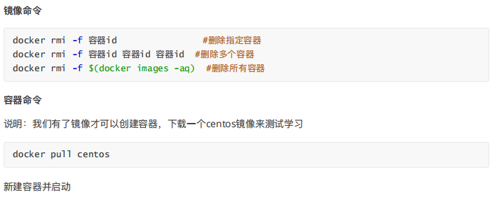
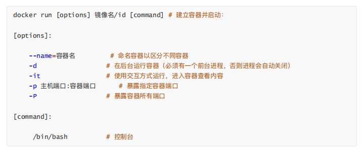

# Linux

## 常见命令

touch命令若文件不存在，系统会建立一个新的文件。

## 内存管理

## 虚拟内存

## Linux信号

## Linux设计

## io模型

阻塞io不占用cpu，占用内存（可以移入虚存）

所以事实上，在非阻塞IO模型中，用户线程需要不断地**询问**内核数据是否就绪，也就说非阻塞IO不会交出CPU，而会一直占用CPU。

recvfrom：经socket接收数据

### 比较

## 网络

## docker

### 定义

Docker 属于 Linux 容器的⼀种封装，提供简单易⽤的容器使⽤接⼝。它是⽬前最流⾏的 Linux 容器解决⽅案。

Docker 将应⽤程序与该程序的依赖，打包在⼀个⽂件⾥⾯。运⾏这个⽂件，就会⽣成⼀个虚拟容器。程序在这个

虚拟容器⾥运⾏，就好像在真实的物理机上运⾏⼀样。有了 Docker，就不⽤担⼼环境问题。

### 意义

开发和运维两套环境，⽽环境配置⼗分麻烦。

如在Windows上开发，要发布到Linux上运⾏

### 组成

### 常用命令

挂载，持久化数据

### dockerfile

### docker网络

