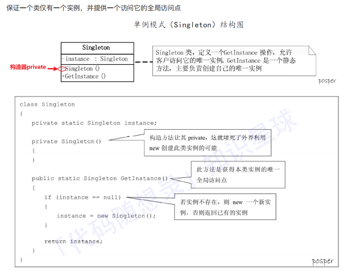
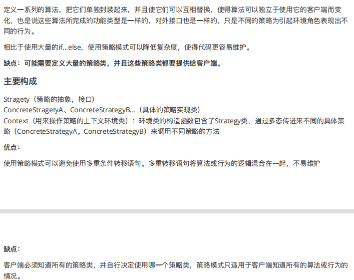

# 设计模式

| 序号 | 模式 & 描述                                                  | 包括                                                         |
| ---- | ------------------------------------------------------------ | ------------------------------------------------------------ |
| 1    | **创建型模式** 这些设计模式提供了一种在创建对象的同时隐藏创建逻辑的方式，而不是使用 new 运算符直接实例化对象。这使得程序在判断针对某个给定实例需要创建哪些对象时更加灵活。 | 工厂模式（Factory Pattern） 抽象工厂模式（Abstract Factory Pattern） 单例模式（Singleton Pattern） 建造者模式（Builder Pattern） 原型模式（Prototype Pattern） |
| 2    | **结构型模式** 这些设计模式关注类和对象的组合。继承的概念被用来组合接口和定义组合对象获得新功能的方式。 | 适配器模式（Adapter Pattern） 桥接模式（Bridge Pattern） 过滤器模式（Filter、Criteria Pattern） 组合模式（Composite Pattern） 装饰器模式（Decorator Pattern） 外观模式（Facade Pattern） 享元模式（Flyweight Pattern） 代理模式（Proxy Pattern） |
| 3    | **行为型模式** 这些设计模式特别关注对象之间的通信。          | 责任链模式（Chain of Responsibility Pattern） 命令模式（Command Pattern） 解释器模式（Interpreter Pattern） 迭代器模式（Iterator Pattern） 中介者模式（Mediator Pattern） 备忘录模式（Memento Pattern） 观察者模式（Observer Pattern） 状态模式（State Pattern） 空对象模式（Null Object Pattern） 策略模式（Strategy Pattern） 模板模式（Template Pattern） 访问者模式（Visitor Pattern） |
| 4    | **J2EE 模式** 这些设计模式特别关注表示层。这些模式是由 Sun Java Center 鉴定的。 | MVC 模式（MVC Pattern） 业务代表模式（Business Delegate Pattern） 组合实体模式（Composite Entity Pattern） 数据访问对象模式（Data Access Object Pattern） 前端控制器模式（Front Controller Pattern） 拦截过滤器模式（Intercepting Filter Pattern） 服务定位器模式（Service Locator Pattern） 传输对象模式（Transfer Object Pattern） |

## 单例模式（创建模式）

保证一个类仅有一个实例，并提供一个访问他的全局访问点




## 策略模式（行为模式）

代替if...else




## 观察者模式（行为模式）

**1对多。多个观察者被一个主题对象通知**

属于⾏为型模式的⼀种，它定义了⼀种⼀对多的依赖关系，让多个观察者对象同时监听某⼀个主题对象。**这个主题对象在状态变化时，会通知所有的观察者对象，使他们能够⾃动更新⾃⼰。**


### 主要构成

观察者模式使用三个类 **Subject、Observer 和 Client**。Subject 对象带有绑定观察者到 Client 对象和从 Client 对象解绑观察者的方法**（attach、detach）**。我们创建 *Subject* 类、*Observer* 抽象类和扩展了抽象类 *Observer* 的**具体实体类**。

subject：Subject 对象带有绑定观察者到 Client 对象和从 Client 对象解绑观察者的方法。

observer：它定义了⼀个更新接⼝⽅法（**update**），使得在得到主题更改通知时更新⾃⼰ 


### 案例

#### 步骤 1

创建 Subject 类。

##### Subject.java

```java
import java.util.ArrayList;
import java.util.List;
 
public class Subject {
   
   private List<Observer> observers 
      = new ArrayList<Observer>();
   private int state;
 
   public int getState() {
      return state;
   }
 
   public void setState(int state) {
      this.state = state;
      notifyAllObservers();
   }
 
   public void attach(Observer observer){
      observers.add(observer);      
   }
 
   public void notifyAllObservers(){
      for (Observer observer : observers) {
         observer.update();
      }
   }  
}
```


#### 步骤 2

创建 Observer 类。

##### Observer.java

```java

public abstract class Observer {
   protected Subject subject;
   public abstract void update();
}
```


#### 步骤 3

创建实体观察者类。

##### BinaryObserver.java

```java
public class BinaryObserver extends Observer{
 
   public BinaryObserver(Subject subject){
      this.subject = subject;
      this.subject.attach(this);
   }
 
   @Override
   public void update() {
      System.out.println( "Binary String: " 
      + Integer.toBinaryString( subject.getState() ) ); 
   }
}
```


##### OctalObserver.java

```java

public class OctalObserver extends Observer{
 
   public OctalObserver(Subject subject){
      this.subject = subject;
      this.subject.attach(this);
   }
 
   @Override
   public void update() {
     System.out.println( "Octal String: " 
     + Integer.toOctalString( subject.getState() ) ); 
   }
}

```


##### HexaObserver.java

```java

public class HexaObserver extends Observer{
 
   public HexaObserver(Subject subject){
      this.subject = subject;
      this.subject.attach(this);
   }
 
   @Override
   public void update() {
      System.out.println( "Hex String: " 
      + Integer.toHexString( subject.getState() ).toUpperCase() ); 
   }
}

```


#### 步骤 4

使用 *Subject* 和实体观察者对象。

##### ObserverPatternDemo.java

```java
public class ObserverPatternDemo {
   public static void main(String[] args) {
      Subject subject = new Subject();
 
      new HexaObserver(subject);
      new OctalObserver(subject);
      new BinaryObserver(subject);
 
      System.out.println("First state change: 15");   
      subject.setState(15);
      System.out.println("Second state change: 10");  
      subject.setState(10);
   }
}
```

> Carl哥的微信公众号 是被观察者，微信⽤户 是观察者，有多个微信⽤户关注了Carl哥的公众号，当Carl哥的公众号
>
> 更新订阅时就会通知这些订阅了的微信⽤户。 
>
> **优点：**
>
> 解除耦合，让耦合的双⽅都依赖于抽象，从⽽使得各⾃的变换都不会影响另⼀边的变换 
>
> **缺点：**
>
> 调试复杂，⽽且在Java中消息的通知⼀般是顺序执⾏，那么⼀个观察者卡顿，会影响整体的执⾏效率，在这种情况下，⼀般会采⽤异步实现。 


## 工厂模式（创建模式）

⼀般情况下，⼯⼚模式分为三种更加细分的类型：**简单⼯⼚、⼯⼚⽅法和抽象⼯⼚**。 


1. 工厂模式的概念

   工厂模式顾名思义就是创建所需要的对象，可以代替传统的new创建对象方式。
   它是一种创建型模式，用于封装和管理对象的创建。

   工厂模式包括简单工厂模式、抽象工厂模式和工厂方法模式，抽象工厂模式是工厂方法模式的扩展。抽象工厂模式不常用。

2. 工厂模式的意念

   定义一个接口来创建对象，让子类来决定哪些类需要被实例化。工厂方法把实例化的工作推迟到子类中实现。

3. 工厂模式的应用场景

   有一组同类型或类似的对象需要创建
   在编码时不能预见需要创建哪种类的实例

   系统需要考虑扩展性，不应依赖于产品类实例如何被创建、组合和表达的细节。

   同一类型的对象需要创建。

4. 工厂模式的动机

   项目中的现状:

   在软件系统中经常面临着“对象”的创建工作，由于需要的变化，这个对象可能随之也会发生变化，为此，我们需要提供一种封装机制来隔离出这个易变对象的变化，从而保持系统中其他依赖该对象的对象不随着需求变化而变化。

   

   基于项目现状将代码进行如下设计：

   尽量松耦合，一个对象的依赖对象的变化与本身无关；
   具体产品与客户端剥离，责任分割。

   

#### 工厂模式的应用

包结构目录


工厂，生产冰淇淋和冰棒


##### 传统方式实例对象

IceProjectInterface.java

```java
package com.ice;

/**
 * 冰棒产品接口
 */
public interface IceProjectInterface{
	/**
	 * 打印信息方法
	 */
	public void showInfo();
}

```

 IceCreamImpl.java

```java
package com.ice.impl;

import com.ice.IceProjectInterface;

/**
 * 冰淇淋实现类
 */
public class IceCreamImpl implements IceProjectInterface{
	@Override
	public void showInfo() {
		System.out.println("这里是冰淇淋");
	}
}

```

IceLollyImpl.java

```java
package com.ice.impl;

import com.ice.IceProjectInterface;
/**
*冰棒实现类
*/
public class IceLollyImpl implements IceProjectInterface{
	@Override
	public void showInfo() {
		System.out.println("这里是冰棒");
	}
}

```

IceProjectTest.java

```java
package com.ice.test;

import com.ice.IceProjectInterface;
import com.ice.impl.IceCreamImpl;

/**
 * 冰棒产品测试类
 */
public class IceProjectTest{
	public static void main(String[] args){
		//传统方法
		IceProjectInterface iceCream = new IceCreamImpl();
		iceCream.showInfo();
	}
}

```


##### 简单工厂模式


首先创建一个Factory工厂类

IceProjectFactory.java

```java
package com.ice.factory;

import com.ice.IceProject;
import com.ice.impl.IceCreamImpl;
import com.ice.impl.IceLollyImpl;

/**
 * 冰棒产品工厂类
 */
public class IceProjectFactory{
	/**
	*根据参数创建对象
	*@param name 冰棒产品名称
	*/
	public IceProjectInterface iceProjectByName(String name){
		if("ice-cream".equals(name)){
			return new IceCreamImpl();
		}else if("ice-lolly".equals(name)){
			return new IceLollyImpl();
		}
		return null;
	}
}
```

IceProjectTest.java

```java
package com.ice.test;

import com.ice.IceProject;
import com.ice.factory.IceProjectFactory;
import com.ice.impl.IceCreamImpl;

/**
 * 冰棒产品测试类
 */
public class IceProjectTest{
	public static void main(String[] args){
		IceProjectInterface iceCream = new IceProjectFactory().iceProjectByName("ice-cream");
		iceCream.showInfo();
	}
}
```

##### 工厂方法模式


使用这种方式来创建对象时，每增加一个类，我们需要在方法中多添加一个if结构，我们可以使用反射机制，优化代码，并根据类的名称来为我们创建类的实例。

IceProjectFactory.java

```java
   /**
	 * 根据类名创建对象
	 * @param className 类名
	 * @return 返回所需对象
	 */
	public IceProjectInterface iceProjectByClass(String className){
		try {
			IceProjectInterface iceProject = (IceProjectInterface)Class.forName(className).newInstance();
			return iceProject;
		} catch (InstantiationException e) {
			e.printStackTrace();
		} catch (IllegalAccessException e) {
			e.printStackTrace();
		} catch (ClassNotFoundException e) {
			e.printStackTrace();
		}
		return null;
	}
```

IceProjectTest.java

```java
	IceProjectInterface iceCream = new IceProjectFactory().iceProjectByClass("com.ice.impl.IceCreamImpl");
	iceCream.showInfo();
```

**使用映射配置类路径**

由于根据类名来查找创建对象，类名过长，我们可以使用简写key的形式，创建映射文件来配置类路径。

type.properties

```java
ice-cream = com.ice.impl.IceCreamImpl
ice-lolly = com.ice.impl.IceLollyImpl
```

 IceProjectFactory.java

```java
   /**
	 * 根据key创建对象
	 * @param className 类名
	 * @return 返回所需对象
	 */
	public IceProjectInterface iceProjectByClassKey(String key){
		try {
			Map<String, String> map = new PropertiesReader().getProperties();
			IceProjectInterface iceProject = (IceProjectInterface)Class.forName(map.get(key)).newInstance();
			return iceProject;
		} catch (InstantiationException e) {
			e.printStackTrace();
		} catch (IllegalAccessException e) {
			e.printStackTrace();
		} catch (ClassNotFoundException e) {
			e.printStackTrace();
		}
		return null;
	}

```

IceProjectTest.java

```java
		IceProjectInterface iceCream 
		= new IceProjectFactory().iceProjectByClassKey("ice-cream");
		iceCream.showInfo();

```


##### 抽象工厂模式


#### 工厂方法模式和抽象工厂模式对比

-   工厂方法模式是一种极端情况的抽象工厂模式，而抽象工厂模式可以看成是工厂模式的推广；
-   工厂方法模式用来创建一个产品的等级结构，而抽象工厂模式是用来创建多个产品的等级结构；
-   工厂方法模式只有一个抽象产品类，而抽象工厂模式有多个抽象产品类。


#### 常见应用

-   JDBC

是一种用于执行SQL语句的Java API，可以为多种关系数据库提供统一访问，它由一组Java语言编写的类和接口组成。

-   Spring BeanFactory（抽象工厂）

Spring BeanFactory作为Spring基础的IOC容器，是Spring的一个Bean工厂。单从工厂模式的角度思考，它就是用来生产Bean，提供给客户端。

- collection 中iterator的实现（工厂方法）


- JDK中的DateFormate、Calendar类都有使⽤，通过不同参数返回我们需要的对象。（简单工厂）


#### 工厂模式的好处

-   工厂模式是为了解耦：可以将对象的创建和使用分离，如果不分离，不但违反了设计模式的开闭原则，需要需要使用另一个子类的话，需要修改源代码 ,把对象的创建和使用的过程分开。
-   工厂模式可以降低代码重复。
-   因为工厂管理了对象的创建逻辑，使用者并不需要知道具体的创建过程，只管使用即可，减少了使用者因为创建逻辑导致的错误


## 其他


# 法则

