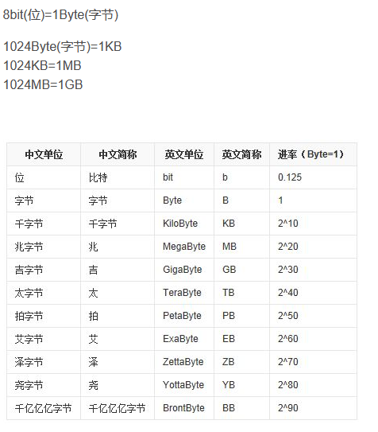

# 海量数据

## 单位转换

参考链接：[1](https://mp.weixin.qq.com/s/awOmIyCeC4833Ghe1e7lQw)

S

海量数据

给10w个字符串，每个长10个字符，设计一个数据结构及[算法]()存储数据，并判断输入一个新字符串是否在已有的字符串中。 

>   利用前缀树

100w个数据取出topk，方法及时间复杂度，有什么优化的方法。用多线程怎么实现？ 

>   利用hash先映射到小文件下，针对每个文件的数据进行小根堆topk排序，然后这些所有的大根堆进行topk排序
>
>   优化的话可以用多线程：每个线程处理不同的hash小文件，当全部处理完成后，再进行主程序的排序，可以用countdownlatch

常用数据结构+算法：

前缀树

分支 + hashMap/HashSet + 堆

位图：位图存的是能表示的所有情况，比如如果有8位，那么位图的大小是10^8bits，而不是8位，因为位图只能存0/1