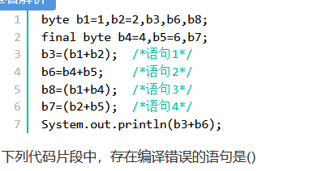
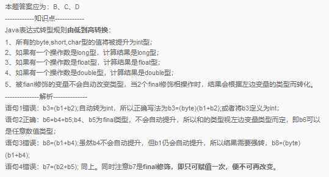
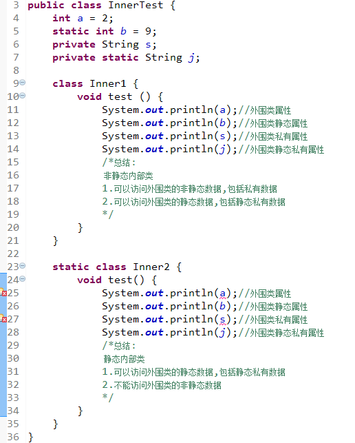
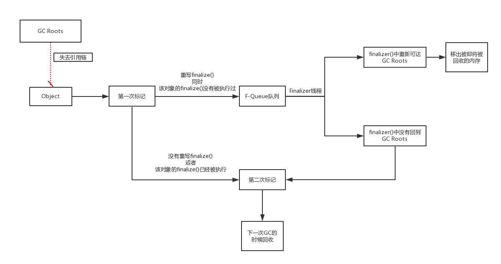
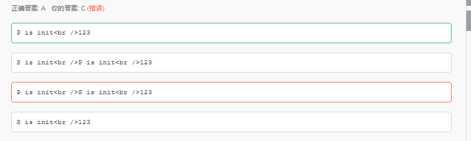
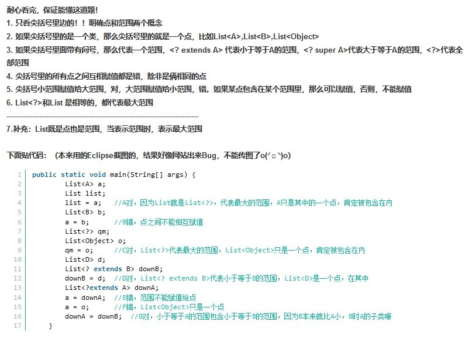
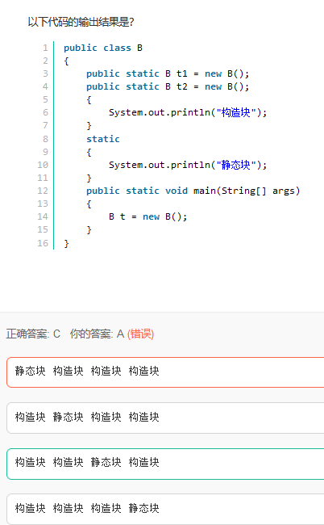

# 选择

多看看牛客的错题

1.byte






2.内部类




3.java gc回收标记



4.什么情况下不会初始化子类

```java
public class P {
    public static int abc = 123;
    static{
        System.out.println("P is init");
    }
}
public class S extends P {
    static{
        System.out.println("S is init");
    }
}
public class Test {
    public static void main(String[] args) {
        System.out.println(S.abc);
    }
}
```



  不会初始化子类的几种 

  \1. 调用的是父类的static方法或者字段 

  2.调用的是父类的final方法或者字段 

  \3. 通过数组来引用 


5.静动态语言

动态类型语言是指在运行期间才去做数据类型检查的语言

静态类型语言与动态类型语言刚好相反，它的数据类型是在编译其间检查的


6.带泛型的赋值问题



7.split

```
String split 这个方法默认返回一个数组， * 如果没有找到分隔符， * 会把整个字符串当成一个长度为1的字符
```


8.类初始化问题



1.程序入口main方法要执行首先要加载类B 

2.静态域：分为静态变量，静态方法，静态块。这里面涉及到的是静态变量和静态块，当执行到静态域时，按照静态域的顺序加载。并且静态域只在类的第一次加载时执行 

3.每次new对象时，会执行一次构造块和构造方法，构造块总是在构造方法前执行（当然，第一次new时，会先执行静态域，静态域〉构造块〉构造方法） 注意：加载类时并不会调用构造块和构造方法，只有静态域会执行  

4.根据前三点，首先加载类B，执行静态域的第一个静态变量，static b1=new B，输出构造块和构造方法（空）。ps:这里为什么不加载静态方法呢？因为执行了静态变量的初始化，意味着已经加载了B的静态域的一部分，这时候不能再加载另一个静态域了，否则属于重复加载 了（**静态域必须当成一个整体来看待。否则加载会错乱**，也就是说有的静态与要一起加载）   于是，依次static b2 =new B，输出构造块，再执行静态块，完成对整个静态域的加载，再执行main方法，new b，输出构造块。                                                            


8.servlet生命周期

Servlet的生命周期一般可以用三个方法来表示：

1.  ​    init()：仅执行一次，负责在装载Servlet时初始化Servlet对象
2.  ​    service() ：核心方法，一般HttpServlet中会有get,post两种处理方式。在调用doGet和doPost方法时会构造servletRequest和servletResponse请求和响应对象作为参数
3.  ​    destory()：在停止并且卸载Servlet时执行，负责释放资源  

​    初始化阶段：Servlet启动，会读取配置文件中的信息，构造指定的Servlet对象，创建ServletConfig对象，将ServletConfig作为参数来调用init()方法。所以选ACD。B是在调用service方法时才构造的  


